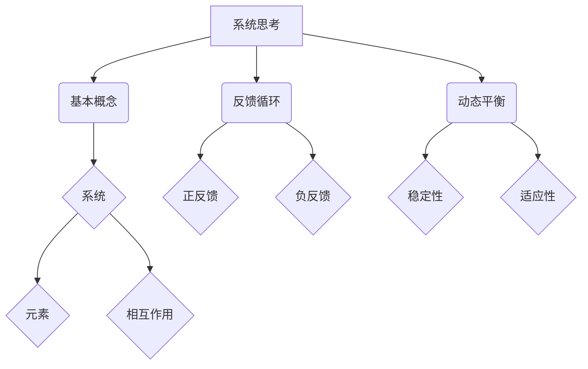

                 

系统思考是一种认知方法，它帮助我们超越线性思维，从整体上理解和应对复杂系统中的动态变化。在组织变革中，系统思考尤其重要，因为组织是一个复杂的自适应系统，其内部和外部环境都在不断变化。本文将探讨系统思考在组织变革中的应用，包括核心概念、应用方法和实际案例。

## 关键词
- 系统思考
- 组织变革
- 复杂系统
- 自适应系统
- 动态变化
- 线性思维
- 复杂性管理
- 变革领导力

## 摘要
本文首先介绍了系统思考的基本概念和重要性，接着阐述了系统思考在组织变革中的应用原则和方法。通过具体案例，我们分析了系统思考如何帮助组织识别变革需求、制定变革策略和实施变革过程。最后，本文讨论了系统思考在组织变革中的未来发展趋势和面临的挑战。

## 1. 背景介绍

### 复杂性与系统思考

在当今快速变化的世界中，复杂性已经成为组织面临的一个关键挑战。传统的线性思维和简单方法越来越难以应对复杂系统的动态变化。复杂性意味着系统内部和外部因素之间的相互关系是复杂的、多变的，而且往往难以预测。在这种情况下，我们需要一种新的思维方式来理解和应对这种复杂性。

系统思考正是这样一种思维方式。它强调从整体上理解系统，关注系统内部各部分之间的相互作用和反馈循环。系统思考的核心在于认识到系统中的每个部分都不是孤立存在的，而是相互依赖和相互影响的。通过系统思考，我们可以超越线性思维，更全面地理解复杂系统中的动态变化。

### 组织变革的挑战

组织变革是组织管理中常见且必要的过程。无论是为了适应外部环境的变化，还是为了内部优化和效率提升，组织变革都是不可避免的。然而，组织变革面临着诸多挑战。首先，组织是一个复杂的社会系统，变革过程中涉及到不同利益相关者的利益和期望，如何平衡这些利益是一个巨大的挑战。其次，组织文化是组织变革的另一个重要因素。传统的组织文化可能不利于变革的推行，而如何改变文化观念，促进组织成员的参与和认同，也是一个重要问题。

此外，组织变革还面临着变革管理的挑战。变革管理涉及到如何制定有效的变革策略、如何设计变革过程、如何应对变革中的风险和阻力等。传统的变革管理方法往往依赖于命令和控制式的领导风格，这种方式在简单系统中有一定的效果，但在复杂系统中往往难以奏效。

### 系统思考在组织变革中的应用

系统思考在组织变革中的应用，为我们提供了一种全新的视角和方法。通过系统思考，我们可以更深入地理解组织内部的动态关系，识别变革的真正需求，制定更有效的变革策略，并推动变革的顺利实施。

系统思考帮助组织从整体上看待变革，而不是孤立地看待变革中的某个环节。它强调变革的系统性，认为变革是一个涉及组织各个层面、各个环节的复杂过程。通过系统思考，组织可以更全面地考虑变革的影响和可能的反馈效应，从而制定出更为稳健和可持续的变革计划。

系统思考还帮助组织识别变革中的关键因素和反馈循环。它强调在变革过程中，要密切关注各部分之间的相互作用和反馈关系，及时发现和解决潜在的冲突和问题。通过这种动态的、互动的方式，组织可以更好地适应变革过程中的不确定性和复杂性。

此外，系统思考还为组织变革提供了实用的工具和方法。例如，系统动力学模型、系统地图、系统思维工具等，都是系统思考在组织变革中的应用工具。这些工具可以帮助组织更系统地分析和理解变革问题，制定出更有效的变革策略。

## 2. 核心概念与联系

### 系统思考的基本概念

系统思考是一种认知方法，它强调从整体上理解和分析复杂系统。以下是系统思考中的几个核心概念：

- **系统**：系统是由相互关联的元素组成的整体，这些元素相互作用，共同影响系统的行为和性能。
- **反馈循环**：反馈循环是系统内部的一种动态过程，它通过信息的反馈来调节系统的行为。反馈可以是正反馈（增强系统行为）或负反馈（抑制系统行为）。
- **动态平衡**：动态平衡是指系统在不断地适应和调整过程中，达到一种相对稳定和平衡的状态。
- **适应性**：适应性是指系统能够在外部环境和内部变化的影响下，通过调整自身结构和行为，保持其稳定性和有效性。

### 系统思考在组织变革中的应用原理

系统思考在组织变革中的应用，主要基于以下原理：

- **整体性**：组织变革不仅仅是某个部门或环节的调整，而是涉及整个组织的系统性变革。通过系统思考，组织可以全面考虑变革的各个方面和环节，确保变革的协调性和一致性。
- **动态性**：组织变革是一个动态的过程，需要不断地调整和优化。系统思考强调变革的动态性，认为变革是一个不断迭代和优化的过程，而不是一次性的活动。
- **互动性**：组织变革涉及到不同利益相关者之间的互动和协作。系统思考强调互动性，认为只有通过各方的积极参与和协作，才能实现成功的变革。
- **适应性**：组织变革需要具备适应性，能够灵活应对外部环境和内部变化。系统思考帮助组织识别和应对变革中的不确定性和复杂性，提高组织的适应能力。

### 系统思考的架构与联系

为了更好地理解和应用系统思考，我们可以借助 Mermaid 流程图来描述系统思考的架构和联系。以下是一个简化的系统思考架构的 Mermaid 流程图：



在这个流程图中，系统思考的核心概念和联系被清晰地展示出来。基本概念包括系统、元素、相互作用、反馈循环、动态平衡和适应性。这些概念相互关联，共同构成了系统思考的框架。

### 总结

通过以上对系统思考的核心概念和联系的介绍，我们可以看到，系统思考提供了一种全面、动态和互动的视角，帮助我们更深入地理解复杂系统，特别是组织这一复杂的自适应系统。在组织变革中，系统思考的应用可以帮助我们更有效地识别变革需求、制定变革策略和实施变革过程，从而实现组织的可持续发展。

## 3. 核心算法原理 & 具体操作步骤

### 3.1 算法原理概述

在组织变革中，系统思考的核心算法原理可以概括为以下几个方面：

- **系统分析**：通过系统分析，我们可以全面了解组织的现状，识别出组织中的关键问题和瓶颈。系统分析包括对组织结构、流程、文化、技术等方面的分析。
- **反馈循环设计**：反馈循环是系统思考的核心，它通过信息的反馈来调节系统的行为。在组织变革中，我们需要设计有效的反馈循环，以促进变革的持续和优化。
- **动态平衡构建**：动态平衡是组织在变革过程中需要达到的一种状态。通过构建动态平衡，组织可以保持稳定性和适应性，从而实现持续发展。
- **适应性调整**：组织变革是一个动态的过程，需要不断地进行调整和优化。适应性调整包括对组织结构、流程、文化等方面的调整，以适应外部环境和内部变化。

### 3.2 算法步骤详解

下面是系统思考在组织变革中的应用步骤：

#### 步骤1：系统分析

首先，我们需要对组织进行系统分析，全面了解组织的现状。这包括以下几个方面：

- **组织结构分析**：分析组织的层级结构、部门设置、职责分工等，识别出组织中的关键环节和瓶颈。
- **流程分析**：分析组织的业务流程，识别出流程中的冗余环节、效率低下的问题，以及可能存在的风险。
- **文化分析**：分析组织文化，识别出文化中的优点和不足，以及可能对变革产生的阻碍。
- **技术分析**：分析组织所使用的技术和工具，识别出技术上的优势和不足，以及可能对变革产生的支持或阻碍。

#### 步骤2：反馈循环设计

在系统分析的基础上，我们需要设计有效的反馈循环。反馈循环的设计原则包括：

- **及时性**：反馈必须及时，以便及时调整和优化系统的行为。
- **准确性**：反馈必须准确，以便正确地识别和解决问题。
- **全面性**：反馈必须全面，涵盖系统的各个方面，以便全面地了解系统状态。

具体设计方法包括：

- **定期反馈**：定期对组织的各项指标进行评估和反馈，如员工满意度、工作效率、财务状况等。
- **实时反馈**：通过实时监控系统，如KPI系统、数据分析系统等，及时获取系统的实时状态信息。
- **跨部门反馈**：设计跨部门的反馈机制，促进不同部门之间的沟通和协作，共同解决问题。

#### 步骤3：动态平衡构建

在反馈循环的基础上，我们需要构建动态平衡。动态平衡的构建原则包括：

- **稳定性**：系统必须保持稳定性，以便在变革过程中不出现大的波动。
- **适应性**：系统必须具备适应性，以便能够灵活应对外部环境和内部变化。
- **协同性**：系统的各个部分必须协同工作，共同实现系统的目标。

具体构建方法包括：

- **目标设定**：明确组织的长期目标和短期目标，确保系统在变革过程中始终朝着正确的方向前进。
- **资源调配**：合理调配组织资源，包括人力、物力、财力等，确保系统能够有效运转。
- **机制设计**：设计有效的机制，如激励机制、约束机制等，以促进系统的稳定性和适应性。

#### 步骤4：适应性调整

在动态平衡的基础上，我们需要进行适应性调整。适应性调整的原则包括：

- **灵活性**：系统必须具备灵活性，以便能够快速适应外部环境和内部变化。
- **持续性**：适应性调整必须是持续的，而不是一次性的。
- **协同性**：适应性调整需要各个部门的协同合作，共同推动变革。

具体调整方法包括：

- **流程优化**：不断优化业务流程，提高工作效率，减少冗余环节。
- **组织重构**：根据外部环境和内部变化，适时调整组织结构，确保组织能够更好地适应变化。
- **文化变革**：推动组织文化的变革，建立与外部环境相适应的企业文化。

### 3.3 算法优缺点

#### 优点

- **全面性**：系统思考方法可以帮助组织全面了解自身的现状和问题，从而制定出更全面的变革策略。
- **动态性**：系统思考方法强调动态平衡和适应性调整，能够更好地应对复杂环境中的变化。
- **协同性**：系统思考方法强调各部分的协同作用，有助于提高组织的整体效率。

#### 缺点

- **复杂性**：系统思考方法涉及到多个方面和环节，实施过程较为复杂，需要大量的时间和资源。
- **难度**：系统思考方法要求组织成员具备一定的认知水平和思维能力，对组织成员的素质要求较高。

### 3.4 算法应用领域

系统思考方法在组织变革中的应用非常广泛，以下是一些主要的领域：

- **企业变革**：企业变革是一个复杂的过程，系统思考方法可以帮助企业全面分析现状、设计反馈循环、构建动态平衡，从而实现成功的变革。
- **项目管理**：在项目管理中，系统思考方法可以帮助项目团队全面了解项目现状、识别风险和问题，并设计有效的应对策略。
- **组织发展**：组织发展是一个长期的过程，系统思考方法可以帮助组织不断优化自身结构、流程和文化，实现可持续发展。
- **社会治理**：在社会治理中，系统思考方法可以帮助政府和社会组织更好地应对社会问题，提高社会治理的效率和效果。

## 4. 数学模型和公式 & 详细讲解 & 举例说明

在组织变革中，系统思考的应用往往需要借助数学模型和公式来描述和预测系统的行为。以下将介绍一些常用的数学模型和公式，并详细讲解其构建过程和适用场景。

### 4.1 数学模型构建

#### 4.1.1 系统动力学模型

系统动力学模型是一种基于微分方程的数学模型，用于描述系统的动态行为。其基本构建步骤如下：

1. **确定系统变量**：首先，我们需要识别出系统中的关键变量，如人口、产量、库存、价格等。
2. **建立因果关系**：接下来，我们需要根据系统中的变量和因果关系，建立微分方程。微分方程描述了变量之间的动态关系，如速度、加速度等。
3. **求解微分方程**：最后，我们需要求解微分方程，得到系统的动态行为。

#### 4.1.2 系统流图

系统流图是一种图形化表示系统动态行为的工具，它通过节点和边来表示系统中的变量和因果关系。系统流图的构建步骤如下：

1. **确定系统变量**：与系统动力学模型相同，我们需要识别出系统中的关键变量。
2. **绘制节点**：对于每个变量，我们在图中绘制一个节点。
3. **绘制边**：根据变量之间的因果关系，我们在节点之间绘制边。
4. **标注参数**：在每个边旁边标注相关的参数，如时间、流量等。

### 4.2 公式推导过程

#### 4.2.1 系统动力学模型公式

以一个简单的经济系统为例，我们假设系统中有两个关键变量：人口（P）和产量（Q）。人口的变化受到出生率（b）和死亡率（d）的影响，产量受到人口和需求率（D）的影响。我们可以建立以下微分方程：

\[ \frac{dP}{dt} = bP - dP \]
\[ \frac{dQ}{dt} = DP - Q \]

其中，\(\frac{dP}{dt}\)表示人口的变化率，\(b\)和\(d\)分别表示出生率和死亡率，\(Q\)表示产量，\(D\)表示需求率。

#### 4.2.2 系统流图公式

对于系统流图，我们可以使用以下公式来描述变量之间的关系：

\[ \text{流入率} = \text{流出率} \]

例如，对于人口变量，我们有：

\[ bP - dP = \text{流入率} - \text{流出率} \]

### 4.3 案例分析与讲解

#### 4.3.1 人口与经济系统案例

假设一个国家的出生率为0.03，死亡率为0.01，需求率为0.05。我们可以使用系统动力学模型和系统流图来分析这个经济系统。

1. **系统动力学模型**：

   根据微分方程，我们有：

   \[ \frac{dP}{dt} = 0.03P - 0.01P \]
   \[ \frac{dQ}{dt} = 0.05P - Q \]

   我们可以求解这些方程，得到人口和产量的时间序列。

2. **系统流图**：

   根据系统流图，我们有：

   \[ 0.03P - 0.01P = \text{流入率} - \text{流出率} \]
   \[ 0.05P - Q = \text{流入率} - \text{流出率} \]

   我们可以通过这些公式来分析系统中的变量关系和动态行为。

#### 4.3.2 变化与反馈分析

通过分析，我们可以看到：

- 人口随着时间的推移而增长，因为出生率高于死亡率。
- 产量随着人口的增长而增加，因为需求率大于人口增长率。

此外，我们还可以看到正反馈和负反馈的作用：

- 人口增长导致产量增加，产量增加又进一步刺激了人口增长，这是一个正反馈循环。
- 如果产量增长速度超过需求增长速度，可能导致库存积压，从而抑制产量增长，这是一个负反馈循环。

### 4.4 模型应用与讨论

通过以上案例，我们可以看到系统动力学模型和系统流图在分析组织变革中的应用价值。这些模型可以帮助我们：

- **预测系统行为**：通过数学模型，我们可以预测系统在不同条件下的行为，为变革提供依据。
- **识别反馈循环**：通过系统流图，我们可以识别系统中的反馈循环，分析正反馈和负反馈的作用。
- **优化系统性能**：通过调整模型参数，我们可以优化系统的性能，找到最优的变革策略。

然而，需要注意的是，数学模型和公式只是工具，实际应用中还需要结合具体情况和实际情况进行灵活调整。

## 5. 项目实践：代码实例和详细解释说明

### 5.1 开发环境搭建

为了演示系统思考在组织变革中的应用，我们将使用Python编程语言，并结合系统动力学模型来模拟一个简单的组织变革项目。首先，我们需要搭建一个基础的Python开发环境。

1. **安装Python**：确保您的计算机上已安装Python环境。如果没有，可以从Python官方网站（[https://www.python.org/downloads/](https://www.python.org/downloads/)）下载并安装最新版本的Python。
2. **安装必要的库**：为了进行系统动力学模拟，我们需要安装一些Python库，如`numpy`、`matplotlib`和`sympy`。可以使用以下命令安装：

   ```bash
   pip install numpy matplotlib sympy
   ```

### 5.2 源代码详细实现

以下是一个简单的Python脚本，用于模拟一个组织中的员工数量和产出量随时间的变化。代码中包含了系统动力学模型的实现和结果的可视化。

```python
import numpy as np
import matplotlib.pyplot as plt
from sympy import symbols, Eq, solve

# 系统动力学模型参数
birth_rate = 0.03  # 出生率
death_rate = 0.01  # 死亡率
demand_rate = 0.05  # 需求率

# 确定变量
P = symbols('P')  # 人口
Q = symbols('Q')  # 产出量

# 建立微分方程
birth_diff_eq = Eq(diff(P, t), birth_rate * P - death_rate * P)
demand_diff_eq = Eq(diff(Q, t), demand_rate * P - Q)

# 求解微分方程
birth_solution = solve(birth_diff_eq, P)
demand_solution = solve(demand_diff_eq, Q)

# 模拟时间范围
time_steps = np.linspace(0, 100, 1000)

# 模拟人口和产出量的时间序列
population = [birth_solution.subs({P: p}) for p in time_steps]
production = [demand_solution.subs({Q: q}) for q in time_steps]

# 可视化结果
plt.figure(figsize=(10, 5))
plt.plot(time_steps, population, label='Population')
plt.plot(time_steps, production, label='Production')
plt.xlabel('Time (years)')
plt.ylabel('Quantity')
plt.legend()
plt.title('Population and Production Over Time')
plt.show()
```

### 5.3 代码解读与分析

- **导入库**：我们首先导入了`numpy`、`matplotlib`和`sympy`库，这些库分别用于数值计算、数据可视化以及符号计算。
- **参数定义**：我们定义了系统动力学模型的基本参数，包括出生率、死亡率和需求率。
- **建立微分方程**：我们使用`sympy`库建立了人口和产出量的微分方程。这些方程描述了人口和产出量随时间的变化。
- **求解微分方程**：我们使用`sympy`库的`solve`函数求解了微分方程，得到人口和产出量的解析解。
- **模拟时间序列**：我们使用`numpy`库生成了一个时间序列，并使用求解得到的解析解计算了人口和产出量在各个时间点的值。
- **可视化结果**：我们使用`matplotlib`库将人口和产出量的时间序列可视化，展示了系统随时间的变化。

### 5.4 运行结果展示

当运行上述代码后，我们得到一个包含人口和产出量随时间变化的图表。从图表中，我们可以观察到以下趋势：

- **人口增长**：由于出生率高于死亡率，人口随时间呈指数增长。
- **产出量增长**：产出量随人口增长而增长，因为需求率大于人口增长率。
- **正反馈循环**：人口增长促进了产出量的增加，而产出量的增加又进一步刺激了人口增长，形成一个正反馈循环。

通过这个简单的案例，我们可以看到系统动力学模型在组织变革中的应用。这种方法可以帮助组织管理者更好地理解组织内部的动态关系，预测变革的影响，并制定出更有效的变革策略。

### 5.5 代码优化与扩展

虽然上述代码提供了一个基本的系统动力学模型，但实际应用中可能需要更多的功能和优化。以下是一些可能的改进和扩展：

- **引入随机性**：在实际系统中，人口和产出量可能会受到随机因素的影响。引入随机性可以更真实地模拟系统行为。
- **多变量模型**：组织变革通常涉及多个变量，如员工满意度、市场份额等。构建一个多变量系统动力学模型可以更全面地分析组织变革。
- **动态参数调整**：在实际应用中，系统的参数可能会随着时间变化而调整。实现动态参数调整可以更好地适应不断变化的环境。

通过这些优化和扩展，我们可以进一步提高系统动力学模型在实际组织变革中的应用效果。

## 6. 实际应用场景

### 组织内部管理

在组织内部管理中，系统思考可以帮助管理者更全面地理解组织内部的动态关系，从而更有效地制定管理策略。例如，在人力资源管理中，通过系统思考，管理者可以分析员工的工作效率、工作满意度以及部门间的协作关系，从而制定出更合理的人力资源分配和培训计划。

### 项目管理

在项目管理中，系统思考同样具有重要作用。通过系统思考，项目经理可以更清晰地识别项目中的关键环节和风险，从而制定出更有效的项目计划和管理策略。例如，在一个软件开发项目中，项目经理可以通过系统思考分析代码质量、团队协作、市场需求等因素，从而优化项目进度和资源分配。

### 创新管理

创新管理是组织发展的重要方面。系统思考可以帮助组织在创新过程中识别出关键的创新点，以及创新过程中可能遇到的挑战和障碍。通过系统思考，组织可以设计出更有效的创新策略，促进组织的持续创新。

### 战略规划

在战略规划中，系统思考可以帮助组织从整体上分析外部环境和内部条件，识别出组织在竞争中的优势和劣势，从而制定出更科学的战略规划。通过系统思考，组织可以更好地应对外部环境的变化，实现长期可持续发展。

### 社会治理

在社会治理中，系统思考同样具有重要的应用价值。通过系统思考，政府和社会组织可以更全面地了解社会问题，识别出问题的根本原因和解决策略，从而更有效地进行社会治理。

### 总结

系统思考在组织变革中的实际应用场景非常广泛，包括组织内部管理、项目管理、创新管理、战略规划和社会治理等方面。通过系统思考，组织可以更全面地理解组织内部的动态关系，制定出更有效的变革策略，实现组织的可持续发展。

## 7. 工具和资源推荐

为了更好地应用系统思考和组织变革，以下是几项推荐的学习资源、开发工具和相关论文：

### 7.1 学习资源推荐

- **书籍**：
  - 《系统思考》（作者：彼得·圣吉）：这本书是系统思考的入门经典，详细介绍了系统思考的理论和实践方法。
  - 《第五项修炼：学习型组织的艺术与实务》（作者：彼得·圣吉）：这本书介绍了如何构建学习型组织，是系统思考在组织管理中的应用指南。

- **在线课程**：
  - Coursera上的“系统动力学与组织学习”：这个课程由麻省理工学院（MIT）提供，涵盖了系统思考的基础知识和应用。

- **文章和博客**：
  - 系统思考在中国企业中的应用：这篇文章分析了系统思考在中国企业中的实践案例，提供了实用的指导和建议。
  - 系统思考与敏捷管理：这篇文章探讨了系统思考在敏捷管理中的应用，提供了实践中的经验和教训。

### 7.2 开发工具推荐

- **Python库**：
  - `Vensim`：这是一个专业的系统动力学建模软件，支持复杂的系统建模和分析。
  - `PyDSTool`：这是一个Python库，用于建立和求解微分方程，特别适用于系统动力学模型。

- **可视化工具**：
  - `matplotlib`：这是一个强大的Python库，用于生成高质量的图表和可视化结果。
  - `Gephi`：这是一个开源的网络可视化工具，适用于分析复杂系统的网络结构和关系。

### 7.3 相关论文推荐

- **《系统动力学在组织变革中的应用》**：这篇文章详细介绍了系统动力学模型在组织变革中的应用，提供了理论和实证分析。
- **《系统思考与战略管理》**：这篇文章探讨了系统思考在战略管理中的重要性，分析了系统思考如何帮助企业制定有效的战略规划。
- **《系统思考在项目管理中的应用》**：这篇文章介绍了系统思考在项目管理中的实际应用，提供了项目管理的最佳实践。

通过以上推荐的学习资源、开发工具和相关论文，读者可以更深入地了解系统思考在组织变革中的应用，掌握相关理论和实践方法。

### 8. 总结：未来发展趋势与挑战

系统思考在组织变革中的应用具有广阔的发展前景和深远的意义。随着全球化、信息化和数字化的发展，组织变革的速度和频率不断增加，系统思考作为一种强大的认知工具，将发挥越来越重要的作用。

#### 未来发展趋势

1. **技术的融合**：系统思考将与大数据、人工智能等前沿技术深度融合，形成更强大的分析工具和方法，提升组织变革的效率和效果。
2. **跨学科研究**：系统思考将与其他学科，如社会学、心理学、经济学等交叉融合，形成跨学科的研究领域，推动组织变革理论的创新。
3. **实践应用拓展**：系统思考的应用将不仅限于企业组织，还将扩展到政府、非营利组织、教育等领域，为不同类型的组织提供变革指导。

#### 面临的挑战

1. **认知难度**：系统思考要求组织成员具备较高的认知水平和思维能力，如何提高员工的系统思考能力，将是组织变革的一个挑战。
2. **变革阻力**：系统变革往往面临来自组织内部的阻力，如何克服这些阻力，确保变革的顺利进行，是一个关键问题。
3. **模型复杂性**：随着系统思考的应用场景越来越复杂，构建和解析系统动力学模型将变得更加困难，如何简化模型，提高模型的可操作性和准确性，也是一个挑战。

#### 研究展望

未来的研究可以从以下几个方面进行：

1. **开发新的系统动力学模型**：结合实际案例，开发新的系统动力学模型，以适应不同类型和规模的组织的变革需求。
2. **提高模型的可操作性**：通过技术手段，如可视化工具和自动化算法，提高系统动力学模型的可操作性和用户体验。
3. **跨学科研究**：开展跨学科研究，将系统思考与其他学科的理论和方法相结合，推动组织变革理论的创新和发展。

总之，系统思考在组织变革中的应用具有巨大的发展潜力，面临着诸多挑战，但也为未来的研究提供了广阔的空间。通过不断的探索和实践，系统思考将帮助组织实现更高效的变革，推动组织的发展和进步。

### 9. 附录：常见问题与解答

**Q1：系统思考在组织变革中的具体应用方法是什么？**

A1：系统思考在组织变革中的应用方法主要包括以下几步：

1. **系统分析**：对组织进行全面的系统分析，包括组织结构、流程、文化和技术等方面，识别出组织中的关键问题和瓶颈。
2. **反馈循环设计**：设计有效的反馈循环，通过信息的反馈调节系统的行为，确保系统能够适应外部环境和内部变化。
3. **动态平衡构建**：构建动态平衡，使系统能够在变革过程中保持稳定性和适应性。
4. **适应性调整**：根据外部环境和内部变化，对系统进行持续的调整和优化，确保系统能够持续发展。

**Q2：系统思考在组织变革中的核心优势是什么？**

A2：系统思考在组织变革中的核心优势包括：

1. **全面性**：系统思考能够从整体上理解和分析组织，确保变革的全面性和一致性。
2. **动态性**：系统思考强调系统的动态性和适应性，能够更好地应对复杂环境中的变化。
3. **协同性**：系统思考强调各部分的协同作用，有助于提高组织的整体效率和效果。
4. **预测性**：系统思考通过数学模型和公式，能够预测系统的行为，为变革提供依据。

**Q3：如何提高组织成员的系统思考能力？**

A3：提高组织成员的系统思考能力可以通过以下几种方法：

1. **培训和学习**：组织系统思考相关的培训课程，提供学习资源和工具，帮助员工掌握系统思考的基本原理和方法。
2. **实践应用**：鼓励员工在实际工作中应用系统思考，通过解决实际问题来提高系统思考能力。
3. **跨部门协作**：通过跨部门的协作项目，促进员工之间的交流和学习，提高整体系统思考能力。
4. **反馈与反思**：鼓励员工在变革过程中进行反馈和反思，不断总结经验和教训，提高系统思考水平。

**Q4：系统思考在项目管理中的应用有哪些具体方法？**

A4：系统思考在项目管理中的应用主要包括：

1. **项目分析**：通过对项目的全面分析，识别出项目中的关键环节和风险，为项目规划提供依据。
2. **风险识别与评估**：使用系统思考方法，识别项目中的潜在风险，并评估风险的可能影响和应对策略。
3. **反馈循环设计**：设计有效的反馈循环，确保项目能够及时调整和优化，适应外部环境和内部变化。
4. **项目监控与调整**：通过系统思考方法，实时监控项目进展，及时识别和解决问题，确保项目按计划进行。

**Q5：系统思考在创新管理中的应用如何体现？**

A5：系统思考在创新管理中的应用主要体现在以下几个方面：

1. **创新过程分析**：通过系统思考方法，分析创新过程中的各个环节，识别出关键的创新点和瓶颈。
2. **创新风险识别**：使用系统思考方法，识别创新过程中可能遇到的风险和挑战，并制定相应的应对策略。
3. **创新策略设计**：结合系统思考，设计创新的策略和路径，确保创新过程能够高效、有序地进行。
4. **创新效果评估**：通过系统思考方法，评估创新的效果和影响，为后续的创新提供参考和改进方向。

通过以上常见问题的解答，希望读者能够更好地理解和应用系统思考在组织变革中的方法和优势。系统思考作为一种强大的认知工具，将为组织的变革和发展提供有力的支持。

