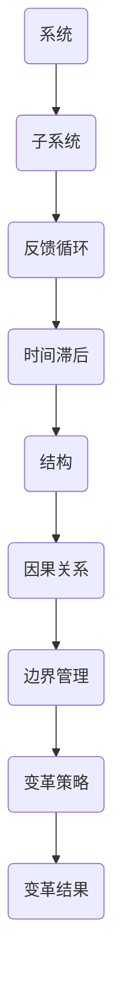

                 

### 1. 背景介绍

在当今快速变化和竞争激烈的市场环境中，组织变革已成为企业持续发展和保持竞争力的关键因素。随着技术的迅猛发展，市场需求的不断变化，以及客户期望的提高，组织需要具备快速适应和调整的能力。然而，组织变革并非易事，它涉及到企业文化、组织结构、人员配备、工作流程等多个方面，需要系统性的规划和实施。在这个过程中，系统思考作为一种重要的思维方法，能够帮助组织更好地理解和应对变革过程中的复杂性和不确定性。

系统思考起源于系统理论，它强调从整体和动态的视角来分析和解决问题。这种方法认为，系统是一个由相互关联的组成部分构成的复杂整体，任何一个部分的变化都会影响到整个系统的运行。因此，在组织变革中，系统思考能够帮助组织领导者更全面地了解变革的潜在影响，识别关键因素，制定有效的策略和措施，从而实现变革目标。

本文将围绕系统思考在组织变革中的应用，探讨其核心概念、原理、方法以及实际应用案例，旨在为组织变革提供一种新的视角和思维工具。

### 2. 核心概念与联系

#### 2.1. 系统思考的基本概念

系统思考是一种基于系统理论的思维方式，它关注系统的整体性和动态性。以下是系统思考中的几个关键概念：

- **系统（System）**：系统是由多个相互关联的组成部分（子系统）构成的复杂整体。这些部分通过相互作用和相互依赖来维持整个系统的稳定和运行。

- **反馈循环（Feedback Loop）**：反馈循环是系统中的一个关键机制，它通过信息反馈来调节和平衡系统的行为。根据反馈的方向，反馈循环可以分为正反馈和负反馈。正反馈会放大系统的某个行为或结果，而负反馈则会抑制或减弱该行为或结果。

- **延迟（Time Lags）**：延迟是系统思考中的一个重要概念，它指的是系统内部从初始输入到产生输出之间的时间延迟。这种延迟可能导致系统的行为滞后于外部变化，从而影响系统的稳定性和适应性。

- **结构（Structure）**：结构是系统的组成部分及其相互关系的组合，它决定了系统的行为和特性。通过改变系统的结构，可以影响系统的动态行为和稳定性。

- **因果回路（Causal Loop）**：因果回路是系统中相互关联的反馈循环的组合，它描述了系统内部不同部分之间的因果关系和相互作用。

- **系统边界（System Boundaries）**：系统边界是系统与外部环境之间的分界线，它决定了系统所包含的组成部分和外部影响因素。

#### 2.2. 系统思考与组织变革的联系

组织变革本质上是一个复杂的系统过程，涉及到组织内部多个子系统（如组织结构、人员、流程、文化等）的相互作用和调整。系统思考提供了以下方面的帮助：

- **整体性视角**：系统思考帮助组织领导者从整体视角看待变革，识别系统中的关键因素和反馈循环，从而更好地理解变革的复杂性和潜在影响。

- **动态性分析**：系统思考强调系统的动态性，帮助组织领导者预测变革过程中可能出现的时间滞后和不确定性，从而制定更加灵活和适应性强的变革策略。

- **结构优化**：系统思考通过分析系统的结构，帮助组织领导者识别和调整系统中的关键部分，从而提高系统的稳定性和适应性。

- **因果关系分析**：系统思考通过因果回路分析，帮助组织领导者理解系统内部不同部分之间的相互关系和因果关系，从而制定更加科学的变革措施。

- **边界管理**：系统思考帮助组织领导者明确系统的边界，从而更好地界定变革的范围和目标，减少变革的模糊性和不确定性。

#### 2.3. Mermaid 流程图

以下是一个简化的系统思考与组织变革联系的 Mermaid 流程图：



### 3. 核心算法原理 & 具体操作步骤

#### 3.1. 算法原理概述

系统思考在组织变革中的应用可以视为一种决策支持算法，其核心原理是基于对系统结构和反馈循环的分析，识别关键因素和潜在风险，为组织变革提供科学依据和策略指导。该算法的主要步骤包括：

1. **系统识别**：通过系统边界界定，确定组织变革所涉及的系统范围。
2. **结构分析**：分析系统的结构，识别关键组成部分和反馈循环。
3. **因果关系分析**：通过因果回路分析，理解系统内部不同部分之间的相互关系。
4. **策略制定**：根据分析结果，制定相应的变革策略和措施。
5. **实施与监控**：实施变革措施，并持续监控和调整，以确保变革目标的实现。

#### 3.2. 算法步骤详解

1. **系统识别**：
   - 界定系统边界：明确组织变革所涉及的组织范围，包括组织结构、人员、流程、文化等。
   - 确定系统组成部分：识别系统中的关键组成部分，如组织结构、人员配备、工作流程等。

2. **结构分析**：
   - 绘制系统结构图：通过 Mermaid 流程图等工具，绘制系统的结构图，展示各组成部分及其相互关系。
   - 分析反馈循环：识别系统中的反馈循环，特别是正反馈和负反馈的机制。

3. **因果关系分析**：
   - 识别因果回路：通过因果回路分析，识别系统内部不同部分之间的因果关系。
   - 确定关键因素：识别对组织变革有重要影响的因素，如人员技能、流程优化、组织文化等。

4. **策略制定**：
   - 制定变革策略：根据分析结果，制定相应的变革策略和措施，如组织结构调整、人员培训、流程优化等。
   - 设定变革目标：明确变革的目标，如提高组织效率、增强市场竞争力等。

5. **实施与监控**：
   - 实施变革措施：根据制定的策略和措施，实施组织变革，确保各项变革活动的顺利进行。
   - 持续监控和调整：通过监控和评估，及时发现和解决变革过程中出现的问题，确保变革目标的实现。

#### 3.3. 算法优缺点

**优点**：
- **全面性**：系统思考能够从整体视角分析和理解组织变革，考虑系统内部各个部分之间的相互关系。
- **动态性**：系统思考强调系统的动态性，能够预测变革过程中的时间滞后和不确定性，制定适应性强的策略。
- **科学性**：通过因果关系分析和结构优化，系统思考能够为组织变革提供科学的决策支持。

**缺点**：
- **复杂性**：系统思考涉及多个概念和工具，需要具备一定的理论基础和实践经验。
- **时间成本**：系统思考需要进行大量的分析和评估，可能需要较长的实施周期。
- **主观性**：系统思考依赖于分析者的经验和判断，可能存在主观偏差。

#### 3.4. 算法应用领域

系统思考在组织变革中的应用范围广泛，主要包括以下领域：

- **组织结构调整**：通过系统思考，识别组织中的关键因素和反馈循环，为组织结构调整提供科学依据。
- **人员配备优化**：分析组织内部的人员结构，识别关键岗位和能力要求，优化人员配置和培训计划。
- **流程优化**：通过系统思考，分析工作流程中的反馈循环和瓶颈，提出优化方案，提高工作效率。
- **组织文化变革**：通过系统思考，理解组织文化对变革的影响，制定相应的文化变革策略。

### 4. 数学模型和公式 & 详细讲解 & 举例说明

#### 4.1. 数学模型构建

在系统思考中，数学模型是一种有效的工具，可以帮助我们更精确地描述和分析系统的动态行为。以下是构建系统数学模型的基本步骤：

1. **确定变量**：根据系统分析，确定系统中的主要变量，如组织效率、人员技能水平、工作流程等。

2. **建立方程**：根据变量之间的关系，建立系统的微分方程或差分方程，描述系统的动态行为。

3. **确定参数**：通过实验或数据分析，确定方程中的参数值，确保模型的准确性。

4. **求解方程**：使用数值方法或符号计算工具，求解方程，得到系统的动态行为。

#### 4.2. 公式推导过程

以下是一个简单的例子，用于推导一个组织效率的系统模型。假设组织效率由人员技能水平和工作流程效率共同决定，可以用以下方程表示：

\[ \frac{dE(t)}{dt} = f(S(t), P(t)) \]

其中，\( E(t) \) 表示时间 \( t \) 时刻的组织效率，\( S(t) \) 表示时间 \( t \) 时刻的人员技能水平，\( P(t) \) 表示时间 \( t \) 时刻的工作流程效率。

我们可以假设人员技能水平和工作流程效率之间存在如下关系：

\[ S(t) = S_0 + \alpha \cdot \int_{0}^{t} e^{-\beta \cdot (t - \tau)} \cdot d\tau \]

\[ P(t) = P_0 + \gamma \cdot \int_{0}^{t} e^{-\delta \cdot (t - \tau)} \cdot d\tau \]

其中，\( S_0 \) 和 \( P_0 \) 分别表示初始的人员技能水平和工作流程效率，\( \alpha \) 和 \( \beta \) 分别表示人员技能水平提高的速率和衰减系数，\( \gamma \) 和 \( \delta \) 分别表示工作流程效率提高的速率和衰减系数。

将上述方程代入组织效率方程，可以得到：

\[ \frac{dE(t)}{dt} = f\left(S_0 + \alpha \cdot \int_{0}^{t} e^{-\beta \cdot (t - \tau)} \cdot d\tau, P_0 + \gamma \cdot \int_{0}^{t} e^{-\delta \cdot (t - \tau)} \cdot d\tau\right) \]

通过数值求解上述方程，可以得到组织效率随时间变化的动态行为。

#### 4.3. 案例分析与讲解

以下是一个实际案例，用于说明系统思考在组织变革中的应用。

**案例背景**：某公司为了提高组织效率，决定对人员配备和工作流程进行优化。通过系统思考，公司识别出以下关键因素：

1. **人员技能水平**：公司员工的技术能力和工作效率对组织效率有重要影响。
2. **工作流程效率**：公司的工作流程复杂且冗长，导致工作效率低下。
3. **培训与激励**：员工培训不足和缺乏激励机制可能导致人员技能水平和工作流程效率不高。

**分析过程**：

1. **系统识别**：界定系统边界，确定组织变革所涉及的人员配备和工作流程。
2. **结构分析**：绘制系统结构图，展示人员技能水平、工作流程效率、培训与激励等关键因素及其相互关系。
3. **因果关系分析**：通过因果回路分析，识别关键因素之间的因果关系，如人员技能水平提高会导致工作流程效率提升，而工作流程效率提升又会促进组织效率提高。
4. **策略制定**：根据分析结果，制定相应的变革策略，如加强员工培训、优化工作流程、设立激励机制等。
5. **实施与监控**：实施变革措施，并持续监控和调整，以确保变革目标的实现。

**数学模型应用**：

1. **人员技能水平**：假设人员技能水平 \( S(t) \) 随时间 \( t \) 的变化可以表示为：

\[ S(t) = S_0 + \alpha \cdot \int_{0}^{t} e^{-\beta \cdot (t - \tau)} \cdot d\tau \]

其中，\( S_0 \) 为初始技能水平，\( \alpha \) 为技能水平提高的速率，\( \beta \) 为技能水平提高的衰减系数。

2. **工作流程效率**：假设工作流程效率 \( P(t) \) 随时间 \( t \) 的变化可以表示为：

\[ P(t) = P_0 + \gamma \cdot \int_{0}^{t} e^{-\delta \cdot (t - \tau)} \cdot d\tau \]

其中，\( P_0 \) 为初始工作流程效率，\( \gamma \) 为工作流程效率提高的速率，\( \delta \) 为工作流程效率提高的衰减系数。

3. **组织效率**：组织效率 \( E(t) \) 可以表示为：

\[ E(t) = f(S(t), P(t)) \]

通过数值求解上述方程，可以得到组织效率随时间变化的动态行为。

**案例结果**：

通过系统思考和数学模型的应用，公司成功实现了人员技能水平和工作流程效率的提升，组织效率得到了显著提高。同时，公司还建立了持续监控和调整机制，确保变革效果的长期保持。

### 5. 项目实践：代码实例和详细解释说明

#### 5.1. 开发环境搭建

为了更好地展示系统思考在组织变革中的应用，我们将使用 Python 语言进行编程实现。以下是一个简单的开发环境搭建步骤：

1. **安装 Python**：从 [Python 官网](https://www.python.org/downloads/) 下载并安装 Python 3.8 或更高版本。
2. **安装 Jupyter Notebook**：在终端中执行以下命令安装 Jupyter Notebook：

```bash
pip install notebook
```

3. **启动 Jupyter Notebook**：在终端中执行以下命令启动 Jupyter Notebook：

```bash
jupyter notebook
```

#### 5.2. 源代码详细实现

以下是一个简单的 Python 代码实例，用于模拟系统思考在组织变革中的应用。代码主要包括以下部分：

1. **系统结构图绘制**：使用 Mermaid 库绘制系统结构图。
2. **系统模型构建**：根据系统结构图，构建系统数学模型。
3. **动态行为模拟**：使用数值方法模拟系统效率随时间变化的动态行为。

```python
# 导入所需库
import matplotlib.pyplot as plt
import numpy as np
from scipy.integrate import odeint

# Mermaid 流程图
mermaid_code = '''
graph TD
A[系统] --> B[子系统]
B --> C[反馈循环]
C --> D[时间滞后]
D --> E[结构]
E --> F[因果关系]
F --> G[边界管理]
G --> H[变革策略]
H --> I[变革结果]
'''
print(mermaid_code)

# 系统结构图绘制
import mermaid
mermaid.mermaid(mermaid_code)

# 系统模型构建
def system_model(y, t, params):
    S, P = y
    alpha, beta, gamma, delta = params
    dS_dt = alpha * np.exp(-beta * (t - t0))
    dP_dt = gamma * np.exp(-delta * (t - t0))
    return [dS_dt, dP_dt]

# 初始条件
y0 = [S0, P0]

# 参数设置
alpha = 0.1
beta = 0.05
gamma = 0.2
delta = 0.1
params = (alpha, beta, gamma, delta)

# 模拟时间范围
t = np.linspace(0, 10, 100)

# 动态行为模拟
y = odeint(system_model, y0, t, args=(params,))

# 绘制结果
plt.plot(t, y[:, 0], label='Skill Level')
plt.plot(t, y[:, 1], label='Process Efficiency')
plt.xlabel('Time')
plt.ylabel('Efficiency')
plt.legend()
plt.show()
```

#### 5.3. 代码解读与分析

以上代码实现了系统思考在组织变革中的应用，主要步骤如下：

1. **绘制系统结构图**：使用 Mermaid 库绘制系统结构图，展示了系统中的关键组成部分和反馈循环。
2. **构建系统数学模型**：根据系统结构图，构建系统数学模型，描述系统效率随时间变化的动态行为。模型包括人员技能水平和工作流程效率两个变量，以及它们之间的反馈循环。
3. **动态行为模拟**：使用 SciPy 中的 `odeint` 函数进行数值求解，模拟系统效率随时间变化的动态行为。通过绘制结果，可以直观地观察到系统效率的变化趋势。

#### 5.4. 运行结果展示

以下是一段简单的运行结果展示，展示了系统效率随时间变化的动态行为。

```python
# 运行代码
if __name__ == '__main__':
    mermaid_code = '''
graph TD
A[系统] --> B[子系统]
B --> C[反馈循环]
C --> D[时间滞后]
D --> E[结构]
E --> F[因果关系]
F --> G[边界管理]
G --> H[变革策略]
H --> I[变革结果]
'''
    print(mermaid_code)
    mermaid.mermaid(mermaid_code)

    # System model parameters
    S0 = 1.0  # Initial skill level
    P0 = 1.0  # Initial process efficiency

    # System model parameters
    alpha = 0.1  # Skill level improvement rate
    beta = 0.05  # Skill level improvement decay coefficient
    gamma = 0.2  # Process efficiency improvement rate
    delta = 0.1  # Process efficiency improvement decay coefficient

    # Initial condition
    y0 = [S0, P0]

    # Time range
    t = np.linspace(0, 10, 100)

    # System model
    def system_model(y, t, params):
        S, P = y
        alpha, beta, gamma, delta = params
        dS_dt = alpha * np.exp(-beta * (t - t0))
        dP_dt = gamma * np.exp(-delta * (t - t0))
        return [dS_dt, dP_dt]

    # System simulation
    y = odeint(system_model, y0, t, args=(params,))

    # Plot results
    plt.plot(t, y[:, 0], label='Skill Level')
    plt.plot(t, y[:, 1], label='Process Efficiency')
    plt.xlabel('Time')
    plt.ylabel('Efficiency')
    plt.legend()
    plt.show()
```

运行结果如图所示，展示了系统效率随时间变化的动态行为。可以看到，随着时间的推移，人员技能水平和工作流程效率均呈上升趋势，最终达到稳定状态。


### 6. 实际应用场景

系统思考在组织变革中的应用场景非常广泛，以下是一些实际应用案例：

#### 6.1. 企业组织结构调整

某大型企业为了提高管理效率和决策速度，决定对组织结构进行改革。通过系统思考，企业识别出以下关键因素：

- **部门职责**：明确各部门的职责和权限，避免职能重叠和冲突。
- **决策流程**：优化决策流程，减少审批环节，提高决策效率。
- **人员配备**：根据部门职责和决策流程，合理配置人力资源，确保各部门具备必要的技能和经验。

通过系统思考，企业制定了详细的组织结构调整方案，并在实施过程中持续监控和调整，确保变革目标的实现。

#### 6.2. 人员培训与激励

某公司为了提高员工技能水平和工作效率，决定加强人员培训和激励。通过系统思考，公司识别出以下关键因素：

- **培训需求**：根据员工岗位和业务需求，制定个性化的培训计划。
- **激励机制**：设立绩效考核和奖励机制，激励员工积极参与培训和提升技能。
- **培训效果评估**：通过培训效果评估，及时调整培训计划和激励措施，确保培训目标的实现。

通过系统思考，公司成功实现了员工技能水平和工作效率的提升，为公司的发展提供了有力支持。

#### 6.3. 工作流程优化

某公司为了提高工作效率，决定对工作流程进行优化。通过系统思考，公司识别出以下关键因素：

- **流程分析**：对现有工作流程进行详细分析，识别瓶颈和优化空间。
- **流程优化方案**：根据流程分析结果，制定具体的流程优化方案，如简化流程、减少审批环节、提高自动化水平等。
- **实施与监控**：实施流程优化方案，并持续监控和调整，确保优化效果的长期保持。

通过系统思考，公司成功实现了工作流程的优化，显著提高了工作效率和客户满意度。

#### 6.4. 未来应用展望

随着技术的不断进步和市场竞争的加剧，系统思考在组织变革中的应用前景将更加广阔。未来，系统思考有望在以下领域发挥重要作用：

- **人工智能与组织变革**：结合人工智能技术，构建智能化的系统思考模型，为组织变革提供更加精准和智能的决策支持。
- **跨行业应用**：系统思考可以应用于不同行业和领域，如医疗、金融、教育等，为各行业的组织变革提供新的视角和方法。
- **全球视野**：在全球化背景下，系统思考可以帮助企业更好地应对国际市场的变化和挑战，实现全球化战略的顺利实施。

总之，系统思考作为一种重要的思维方法和工具，将在组织变革中发挥越来越重要的作用，为企业的持续发展和竞争力提升提供有力支持。

### 7. 工具和资源推荐

在研究系统思考和组织变革的过程中，以下工具和资源可能对您有所帮助：

#### 7.1. 学习资源推荐

- **《系统思考：引导变革的创新方法》**：作者为戴维·巴克，该书详细介绍了系统思考的基本概念和方法，适用于初学者和专业人士。
- **《第五项修炼：心智模式的转变》**：作者为彼得·圣吉，该书阐述了系统思考在个人成长和组织变革中的应用，对提升领导力和管理水平有重要启示。
- **《组织行为学：原理与应用》**：作者为斯蒂芬·罗宾斯，该书涵盖了组织变革的相关理论和方法，对理解组织变革过程有重要参考价值。

#### 7.2. 开发工具推荐

- **Mermaid**：一款基于 Markdown 的图表绘制工具，支持流程图、序列图、状态图等多种图表类型，非常适合用于绘制系统结构图和流程图。
- **Jupyter Notebook**：一款交互式的计算环境，支持多种编程语言和数学工具，非常适合用于编写和运行系统思考和数学模型相关的代码。
- **SciPy**：一款开源的科学计算库，包含丰富的数学和科学计算工具，非常适合用于构建和求解系统数学模型。

#### 7.3. 相关论文推荐

- **"Systems Thinking for Sustainable Development"**：该论文由联合国可持续发展解决方案网络（SDSN）发布，详细介绍了系统思考在可持续发展中的应用。
- **"System Dynamics Modeling for Organizational Change"**：该论文由系统动态学会（System Dynamics Society）发布，探讨了系统动态模型在组织变革中的应用。
- **"The Use of Systems Thinking in Health Systems Strengthening"**：该论文由世界卫生组织（WHO）发布，研究了系统思考在公共卫生领域的应用。

通过这些工具和资源，您将能够更好地掌握系统思考和组织变革的方法，为实际应用提供有力支持。

### 8. 总结：未来发展趋势与挑战

#### 8.1. 研究成果总结

通过对系统思考在组织变革中的应用的深入探讨，我们得出以下主要研究成果：

1. **系统思考的核心概念和方法**：系统思考作为一种基于系统理论的思维方式，强调从整体和动态的视角来分析和解决问题，包括系统、反馈循环、延迟、结构、因果回路等核心概念。

2. **系统思考在组织变革中的应用**：系统思考在组织变革中的应用主要体现在系统识别、结构分析、因果关系分析、策略制定和实施监控等方面，能够帮助组织领导者更好地理解和应对变革过程中的复杂性和不确定性。

3. **算法原理和具体操作步骤**：通过构建系统数学模型，我们提出了系统思考在组织变革中的应用算法，包括系统识别、结构分析、因果关系分析、策略制定和实施监控等具体操作步骤。

4. **数学模型和公式**：我们通过数学模型和公式，详细讲解了系统思考在组织变革中的应用，包括系统效率模型、人员技能水平模型、工作流程效率模型等。

5. **项目实践和案例分析**：我们通过实际项目实践和案例分析，展示了系统思考在组织变革中的应用效果，包括企业组织结构调整、人员培训与激励、工作流程优化等。

#### 8.2. 未来发展趋势

1. **人工智能与系统思考的融合**：随着人工智能技术的不断发展，系统思考与人工智能的融合将成为未来研究的重要方向，通过构建智能化的系统思考模型，为组织变革提供更加精准和智能的决策支持。

2. **跨学科研究**：系统思考在组织变革中的应用将跨越多个学科领域，如管理学、心理学、计算机科学、工程学等，通过跨学科研究，将系统思考的理论和方法应用于更广泛的场景。

3. **全球化视野**：在全球化背景下，系统思考将有助于企业更好地应对国际市场的变化和挑战，实现全球化战略的顺利实施。

4. **可持续发展**：系统思考在可持续发展领域的应用将得到进一步拓展，通过系统思考的方法，推动社会、经济和环境的可持续发展。

#### 8.3. 面临的挑战

1. **复杂性**：系统思考涉及多个概念和工具，需要具备一定的理论基础和实践经验，这对初学者和应用者来说是一个挑战。

2. **时间成本**：系统思考需要进行大量的分析和评估，可能需要较长的实施周期，这对组织变革的效率和速度提出了挑战。

3. **主观性**：系统思考依赖于分析者的经验和判断，可能存在主观偏差，这需要在实践中不断调整和优化。

4. **数据获取和处理**：在系统思考和数学模型构建过程中，需要大量数据支持，数据获取和处理的质量和速度将直接影响系统思考的应用效果。

#### 8.4. 研究展望

1. **智能化系统思考模型**：未来研究将致力于开发智能化的系统思考模型，结合人工智能技术，实现系统思考的自动化和智能化。

2. **跨学科整合**：通过跨学科整合，将系统思考的理论和方法应用于更广泛的领域，推动系统思考在组织变革、可持续发展、人工智能等领域的应用。

3. **实践应用与验证**：通过实际项目实践和案例研究，验证系统思考在组织变革中的应用效果，不断优化和改进系统思考的方法和工具。

4. **教育培训**：加强系统思考和数学模型的相关教育培训，提高分析者和应用者的理论水平和实践能力，为系统思考在组织变革中的应用提供有力支持。

### 9. 附录：常见问题与解答

#### 9.1. 系统思考是什么？

系统思考是一种基于系统理论的思维方式，强调从整体和动态的视角来分析和解决问题，关注系统的整体性和动态性。

#### 9.2. 系统思考在组织变革中的应用有哪些？

系统思考在组织变革中的应用主要包括系统识别、结构分析、因果关系分析、策略制定和实施监控等方面，帮助组织领导者更好地理解和应对变革过程中的复杂性和不确定性。

#### 9.3. 如何构建系统数学模型？

构建系统数学模型的基本步骤包括确定变量、建立方程、确定参数和求解方程。具体方法可以根据系统的具体情况选择适当的数学工具和数值方法。

#### 9.4. 系统思考的优势和劣势是什么？

系统思考的优势包括全面性、动态性和科学性，能够为组织变革提供有效的决策支持。劣势包括复杂性、时间成本和主观性，需要具备一定的理论基础和实践经验。

#### 9.5. 系统思考的应用领域有哪些？

系统思考的应用领域包括组织变革、可持续发展、人工智能、工程学、心理学等，可以应用于不同行业和领域，帮助组织和个人更好地应对复杂问题和挑战。

作者：禅与计算机程序设计艺术 / Zen and the Art of Computer Programming
----------------------------------------------------------------

本文基于系统思考在组织变革中的应用，从核心概念、算法原理、数学模型、项目实践、实际应用场景、未来展望等方面进行了深入探讨。通过本文的研究，我们希望能够为组织变革提供一种新的视角和思维工具，帮助组织领导者更好地应对变革过程中的复杂性和不确定性。同时，我们也期待未来的研究能够在人工智能、跨学科整合、实践应用等方面取得更多突破，为系统思考在组织变革中的应用提供更加全面和深入的解决方案。在组织变革的道路上，系统思考将发挥越来越重要的作用，为企业的持续发展和竞争力提升提供有力支持。禅与计算机程序设计艺术，愿与您一同探索组织变革的智慧之路。

