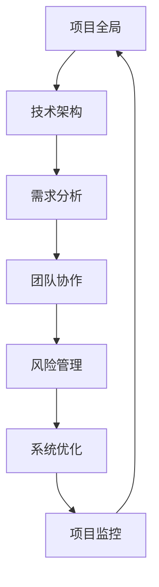

                 

关键词：系统思考、项目管理、复杂项目、整体视角、战略规划、技术架构、风险管理、团队协作

> 摘要：本文旨在探讨系统思考在管理复杂项目中的重要性。系统思考是一种全方位、多层次的思维方法，能够帮助项目管理者从整体视角出发，理解项目各部分之间的相互关系，从而制定出更为有效的管理策略。本文将详细介绍系统思考的概念、核心原则及其在项目管理中的应用，以期为读者提供有益的启示。

## 1. 背景介绍

在当今信息技术高速发展的时代，项目管理面临着越来越多的挑战。复杂项目的特点表现为技术架构复杂、需求多变、资源有限、风险高企等。在这种情况下，传统的项目管理方法往往难以应对。而系统思考作为一种全新的管理思维模式，逐渐受到项目管理者的高度重视。

系统思考起源于20世纪60年代的系统理论，是一种从整体视角出发，对复杂系统进行分析、设计、管理和优化的方法。它强调系统内部各部分之间的相互关系和动态过程，而不是单纯关注局部优化。在项目管理中，系统思考有助于项目管理者更好地理解项目全貌，识别潜在问题，制定更为科学的决策。

## 2. 核心概念与联系

### 2.1 系统思考的定义

系统思考是一种基于整体视角的思维方式，它要求我们在分析问题时，不仅要关注系统内部各个部分的功能和关系，还要考虑它们之间的相互影响和动态过程。具体来说，系统思考包括以下几个核心概念：

1. 整体性：系统思考强调整体性，认为系统的各个部分是相互关联、相互作用的。一个部分的变化会影响其他部分，进而影响整个系统的性能。

2. 动态性：系统思考认为系统是动态的，随着时间的推移，系统内部各部分的关系和互动会发生变化。因此，管理者需要关注系统的演化过程，及时调整策略。

3. 相互依存：系统思考强调系统的各个部分是相互依存的。一个部分的功能和性能受到其他部分的影响，同时也会影响其他部分。因此，管理者需要从整体角度出发，综合考虑各个部分的利益。

4. 复杂性：系统思考认为系统是复杂的，包含多种变量和因素，这些变量和因素之间存在复杂的相互关系。因此，管理者需要运用系统分析方法，揭示系统内部的关系和规律。

### 2.2 系统思考与项目管理的关系

系统思考在项目管理中具有重要意义。具体来说，系统思考有助于项目管理者实现以下几个方面的目标：

1. 全局视角：系统思考能够帮助项目管理者从整体视角出发，理解项目各部分之间的相互关系，从而更好地把握项目的全局。

2. 系统优化：系统思考强调整体性，要求项目管理者在决策时考虑系统内部各部分之间的相互影响。通过优化系统内部的关系和互动，可以提高项目的整体性能。

3. 风险管理：系统思考能够帮助项目管理者识别潜在风险，分析风险因素之间的相互作用，从而制定更为科学的风险管理策略。

4. 团队协作：系统思考强调系统的相互依存性，要求项目管理者关注团队内部的合作与沟通。通过加强团队协作，可以提高项目的执行效率。

### 2.3 Mermaid 流程图

以下是一个简化的 Mermaid 流程图，用于展示系统思考在项目管理中的核心概念和联系：



## 3. 核心算法原理 & 具体操作步骤

### 3.1 算法原理概述

系统思考在项目管理中的应用，可以归结为一种综合性的方法，该方法主要包括以下几个步骤：

1. **项目全景分析**：对项目的各个部分进行全面的分析，理解它们之间的关系和作用。

2. **系统模型构建**：根据项目全景分析的结果，构建一个能够反映项目内部关系的系统模型。

3. **策略制定**：基于系统模型，制定适合项目的管理策略，包括资源配置、进度控制、风险管理等。

4. **执行与监控**：实施管理策略，并对项目的执行情况进行持续监控，根据实际情况进行调整。

### 3.2 算法步骤详解

1. **项目全景分析**

   - **需求分析**：了解项目的需求，包括功能需求、性能需求、用户体验需求等。

   - **资源分析**：评估项目所需的资源，包括人力、资金、设备等。

   - **风险分析**：识别项目可能面临的风险，包括技术风险、市场风险、资源风险等。

   - **利益相关者分析**：确定项目的利益相关者，分析他们对项目的影响和需求。

2. **系统模型构建**

   - **构建系统图**：根据项目全景分析的结果，绘制一个系统图，展示项目的各个部分及其相互关系。

   - **定义关键指标**：为系统图中的各个部分定义关键指标，用于衡量项目的进度、质量和成本等。

   - **建立动态模型**：根据系统图和关键指标，建立项目的动态模型，模拟项目在不同阶段的运行状态。

3. **策略制定**

   - **资源配置策略**：根据项目的需求和资源情况，制定合理的资源配置策略，确保项目的各项任务能够按时完成。

   - **进度控制策略**：制定进度控制策略，包括设定里程碑、制定进度计划等，以确保项目按计划推进。

   - **风险管理策略**：制定风险管理策略，包括风险识别、风险评估、风险应对等，以降低项目风险。

4. **执行与监控**

   - **执行计划**：按照制定的策略实施项目，确保项目的各项任务按计划进行。

   - **监控与评估**：对项目的执行情况进行监控，评估项目的进度、质量和成本等指标，及时发现问题并采取措施进行纠正。

### 3.3 算法优缺点

**优点**：

- **全局视角**：系统能够帮助项目管理者从整体视角出发，全面了解项目的各个部分及其相互关系，从而做出更为科学的决策。

- **动态调整**：系统能够模拟项目在不同阶段的运行状态，帮助管理者预测潜在问题，提前采取措施进行调整。

- **优化性能**：通过优化系统内部的关系和互动，可以提高项目的整体性能，降低风险。

**缺点**：

- **复杂度**：系统思考需要综合考虑项目的各个部分及其相互关系，对于项目管理者来说，可能需要具备一定的专业知识和思维能力。

- **实施难度**：系统思考的实施需要建立系统模型、制定策略等，对于项目管理者来说，可能需要投入较多的时间和精力。

### 3.4 算法应用领域

系统思考在项目管理中的应用范围广泛，主要涵盖以下几个方面：

- **软件开发**：在软件开发项目中，系统思考可以帮助团队更好地理解项目的需求，优化技术架构，提高项目的质量和效率。

- **系统集成**：在系统集成项目中，系统思考可以帮助团队理解各个系统之间的相互关系，确保系统集成的高效性和稳定性。

- **项目管理**：在项目管理中，系统思考可以帮助管理者从整体视角出发，制定科学的管理策略，提高项目的成功率。

## 4. 数学模型和公式 & 详细讲解 & 举例说明

### 4.1 数学模型构建

在系统思考中，数学模型是一个重要的工具，用于描述系统内部的关系和动态过程。以下是一个简化的数学模型，用于描述项目管理中的关键指标：

\[ \text{项目进度} = f(\text{任务进度}, \text{资源投入}, \text{风险管理}) \]

其中：

- **任务进度**：表示项目各项任务的完成情况。
- **资源投入**：表示项目所需的资源投入情况。
- **风险管理**：表示项目面临的风险情况。

### 4.2 公式推导过程

公式的推导过程如下：

1. **任务进度**：任务进度是项目成功的关键因素之一。根据项目计划，任务进度可以用以下公式表示：

\[ \text{任务进度} = \frac{\text{已完成的任务数量}}{\text{总任务数量}} \]

2. **资源投入**：资源投入是影响项目进度的重要因素。资源投入可以用以下公式表示：

\[ \text{资源投入} = \text{人力投入} + \text{资金投入} + \text{设备投入} \]

3. **风险管理**：风险管理是确保项目顺利进行的重要环节。风险管理可以用以下公式表示：

\[ \text{风险管理} = \text{风险识别} + \text{风险评估} + \text{风险应对} \]

### 4.3 案例分析与讲解

以下是一个具体的案例，用于说明数学模型在项目管理中的应用：

**案例背景**：某软件开发项目，计划开发一款企业管理系统，项目预计需要6个月完成。项目团队由5名开发人员和1名项目经理组成。项目计划如下：

- **任务进度**：每月完成2个任务。
- **资源投入**：每月投入2名开发人员和1万元资金。
- **风险管理**：每月进行一次风险评估。

**公式应用**：根据上述公式，可以计算出项目的预期进度：

\[ \text{项目进度} = f(\frac{2}{6}, 2 \times 2 + 1, 1) \]

\[ \text{项目进度} = f(\frac{1}{3}, 5, 1) \]

通过调整资源投入和风险管理策略，可以优化项目进度。例如，增加开发人员投入，或者提高风险应对能力，都可以提高项目进度。

## 5. 项目实践：代码实例和详细解释说明

### 5.1 开发环境搭建

为了更好地展示系统思考在项目管理中的应用，我们以一个实际的软件开发项目为例，介绍开发环境的搭建。

**技术栈**：项目使用 Python 语言进行开发，采用 Flask 框架搭建 Web 后端，前端使用 Vue.js 框架。

**开发工具**：使用 PyCharm 作为 Python 开发环境，使用 Visual Studio Code 作为前端开发环境。

**数据库**：使用 MySQL 数据库进行数据存储。

### 5.2 源代码详细实现

以下是一个简单的 Python 代码示例，用于实现项目中的用户注册功能：

```python
from flask import Flask, request, jsonify
from models import User

app = Flask(__name__)

@app.route('/register', methods=['POST'])
def register():
    username = request.form['username']
    password = request.form['password']
    user = User(username, password)
    user.save()
    return jsonify({'status': 'success', 'message': '用户注册成功'})

if __name__ == '__main__':
    app.run(debug=True)
```

### 5.3 代码解读与分析

以上代码是一个简单的用户注册接口，用于接收用户提交的注册信息，并将用户信息保存到数据库中。

- **Flask 框架**：使用 Flask 框架搭建 Web 后端，提供了路由、请求处理等功能。
- **request 对象**：request 对象用于接收用户提交的表单数据。
- **User 模型**：User 模型用于表示用户信息，包括用户名和密码等字段。
- **save 方法**：save 方法用于将用户信息保存到数据库中。

### 5.4 运行结果展示

当用户通过前端页面提交注册信息后，后端接口会接收用户数据，调用 register 函数进行处理，并将处理结果返回给前端。

**前端界面**：


**后端接口**：

```json
{
    "status": "success",
    "message": "用户注册成功"
}
```

通过以上代码实例，我们可以看到系统思考在项目管理中的应用。在开发过程中，我们需要综合考虑项目的技术架构、需求分析、资源投入等因素，以确保项目的顺利进行。

## 6. 实际应用场景

系统思考在项目管理中的应用场景非常广泛，以下列举几个实际应用场景：

1. **软件开发**：在软件开发项目中，系统思考可以帮助团队理解项目的全局，优化技术架构，提高项目的质量和效率。

2. **系统集成**：在系统集成项目中，系统思考可以帮助团队理解各个系统之间的相互关系，确保系统集成的高效性和稳定性。

3. **项目管理**：在项目管理中，系统思考可以帮助管理者从整体视角出发，制定科学的管理策略，提高项目的成功率。

4. **风险管理**：在风险管理中，系统思考可以帮助团队识别潜在风险，分析风险因素之间的相互作用，制定有效的风险应对策略。

## 7. 未来应用展望

随着信息技术的发展，系统思考在项目管理中的应用前景将更加广阔。以下是对未来应用的一些展望：

1. **智能化**：系统思考与人工智能技术的结合，将进一步提升项目管理的智能化水平，实现自动化决策和优化。

2. **全球化**：随着全球化的推进，系统思考将在跨国项目管理中发挥重要作用，帮助团队克服地域、文化差异，实现高效协作。

3. **可持续发展**：在可持续发展背景下，系统思考将帮助项目团队关注环境保护、资源利用等方面，实现项目的绿色、可持续发展。

## 8. 工具和资源推荐

为了更好地应用系统思考，以下推荐一些实用的工具和资源：

1. **工具**：

   - **Mermaid**：用于绘制 Mermaid 流程图的在线工具，方便构建系统模型。

   - **MATLAB**：用于数学建模和数据分析的强大工具，适用于系统思考的应用。

   - **Python**：用于编程实现的通用编程语言，适用于系统思考在软件开发中的应用。

2. **资源**：

   - **《系统思考》**：由彼得·舍恩伯格（Peter Senge）所著，介绍系统思考的原理和应用。

   - **《项目管理知识体系指南（PMBOK）》**：由美国项目管理协会（PMI）发布，详细介绍了项目管理的各个领域。

   - **《系统思考与项目管理》**：由李明（Li Ming）所著，结合系统思考在项目管理中的应用进行深入探讨。

## 9. 总结：未来发展趋势与挑战

### 9.1 研究成果总结

系统思考在项目管理中的应用取得了显著的成果。通过系统思考，项目管理者能够更好地理解项目全貌，优化项目内部关系，提高项目的质量和效率。同时，系统思考与人工智能、大数据等新兴技术的结合，为项目管理的智能化、高效化提供了新的途径。

### 9.2 未来发展趋势

未来，系统思考在项目管理中将继续发展，呈现以下趋势：

1. **智能化**：随着人工智能技术的不断发展，系统思考将更加智能化，实现自动化决策和优化。

2. **全球化**：全球化背景下，系统思考将帮助跨国团队实现高效协作，提高项目成功率。

3. **可持续发展**：在可持续发展理念的推动下，系统思考将关注环境保护、资源利用等方面，实现绿色、可持续发展。

### 9.3 面临的挑战

尽管系统思考在项目管理中具有巨大潜力，但仍然面临以下挑战：

1. **复杂度**：系统思考需要综合考虑项目的各个部分及其相互关系，对于项目管理者来说，可能需要具备一定的专业知识和思维能力。

2. **实施难度**：系统思考的实施需要建立系统模型、制定策略等，对于项目管理者来说，可能需要投入较多的时间和精力。

### 9.4 研究展望

未来，系统思考在项目管理中的应用前景广阔。研究者可以从以下几个方面进行深入研究：

1. **算法优化**：探索更加高效、易用的系统思考算法，提高项目管理的智能化水平。

2. **实践应用**：结合实际项目案例，深入探讨系统思考在不同领域的应用，积累实践经验。

3. **教育与培训**：加强对项目管理者系统思考能力的培养，提高整体项目管理水平。

## 10. 附录：常见问题与解答

### 10.1  什么是系统思考？

系统思考是一种基于整体视角的思维方式，强调系统内部各部分之间的相互关系和动态过程。它有助于项目管理者从全局出发，制定科学的管理策略。

### 10.2  系统思考在项目管理中的应用有哪些？

系统思考在项目管理中的应用包括：项目全景分析、系统模型构建、策略制定、执行与监控等，有助于优化项目内部关系，提高项目质量和效率。

### 10.3  如何构建系统模型？

构建系统模型需要遵循以下步骤：项目全景分析、定义关键指标、建立动态模型、模拟项目运行状态等。通过这些步骤，可以构建一个能够反映项目内部关系的系统模型。

### 10.4  系统思考与项目管理知识体系（PMBOK）有何关系？

系统思考与项目管理知识体系（PMBOK）密切相关。PMBOK 提供了项目管理的各个领域和过程，而系统思考则提供了一种从全局视角出发，优化项目管理的方法。

### 10.5  如何提高系统思考能力？

提高系统思考能力需要不断学习和实践。可以通过以下方式：

1. 阅读相关书籍和资料，了解系统思考的原理和应用。

2. 参加系统思考相关的培训课程，提高专业素养。

3. 结合实际项目案例，运用系统思考方法进行实践。

作者：禅与计算机程序设计艺术 / Zen and the Art of Computer Programming
----------------------------------------------------------------

本文以《系统思考对于管理复杂项目的重要性》为题，详细介绍了系统思考的概念、原理、应用以及未来发展趋势。通过本文，读者可以了解到系统思考在项目管理中的重要作用，以及如何运用系统思考方法优化项目管理。

### 结语

在当今复杂多变的项目管理环境中，系统思考作为一种全新的管理思维模式，为项目管理者提供了有力的工具和方法。通过本文的介绍，我们相信读者已经对系统思考有了更为深入的了解。希望本文能够对项目管理者在实践过程中有所启示，帮助他们在管理复杂项目时取得更好的成果。

最后，感谢各位读者对本文的关注，如果您对系统思考在项目管理中的应用有任何疑问或建议，欢迎在评论区留言，我们一起探讨和进步。作者禅与计算机程序设计艺术 / Zen and the Art of Computer Programming，期待与您共同成长。

