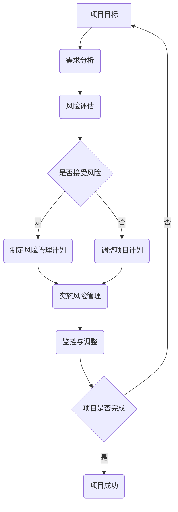

                 

 在现代信息技术飞速发展的背景下，项目管理作为推动技术进步和应用创新的关键环节，正面临着前所未有的复杂性挑战。从传统的软件工程项目到大规模的云计算平台，项目的规模和复杂度都在不断增长。这就要求项目经理和团队成员具备系统思考的能力，以便更好地应对复杂项目的管理。本文将深入探讨系统思考在管理复杂项目中的重要性，以及如何在实际操作中运用这一思维方式。

## 关键词

- 项目管理
- 复杂系统
- 系统思考
- 管理工具
- 风险控制
- 团队协作

## 摘要

本文首先介绍了项目管理在技术领域中的重要性，随后分析了复杂项目带来的挑战，并阐述了系统思考的概念及其在项目管理中的应用。文章随后详细探讨了系统思考的核心原则和方法，并结合实际案例进行了分析。最后，文章提出了未来系统思考在项目管理中可能的发展趋势和面临的挑战。

## 1. 背景介绍

随着全球化的进程和互联网技术的普及，信息技术领域正经历着一场前所未有的变革。从大数据、云计算到人工智能，技术的飞速进步使得项目管理面临着前所未有的复杂性和多样性。传统的线性思维和方法已无法应对现代项目的复杂性，项目经理需要具备系统思考的能力，以便更好地理解和管理项目中的各种因素。

### 1.1 项目管理的演变

项目管理的历史可以追溯到20世纪中叶，随着项目规模的扩大和复杂性的增加，项目管理也逐渐发展出了一系列科学的方法和工具。从早期的Gantt图到现代的敏捷开发方法，项目管理一直在不断进化。

- **传统的项目管理方法**：以Gantt图和关键路径法为代表，强调任务的分解和进度的控制。
- **敏捷开发方法**：强调迭代和适应性，通过持续交付和反馈来提高项目的灵活性和响应速度。
- **现代项目管理方法**：结合了传统方法和敏捷开发的优势，如Scrum、看板等，更加注重团队合作和客户满意度。

### 1.2 复杂项目的特点

现代复杂项目具有以下几个显著特点：

- **项目规模庞大**：涉及多个系统、多个团队和多个利益相关者。
- **技术多样性**：需要整合不同的技术和工具，如云计算、大数据、物联网等。
- **变化频繁**：需求和技术的快速变化要求项目具备高度的适应性。
- **不确定性**：项目中的各种风险和不确定性因素难以预测和控制。

### 1.3 系统思考的必要性

面对复杂项目，传统的线性思维和方法显得力不从心。系统思考提供了一种更加全面和深入的思维方式，可以帮助项目经理更好地理解和应对项目中的复杂性和多样性。

- **全局视角**：系统思考强调从整体的角度来理解项目，而不是仅仅关注单个任务或部分。
- **动态变化**：系统思考能够捕捉项目中的动态变化和相互影响，从而更好地预测和应对变化。
- **协同合作**：系统思考鼓励跨部门和跨团队的协同合作，以提高项目的整体效率。

## 2. 核心概念与联系

系统思考（Systems Thinking）是一种理解和处理复杂系统的思维方式，它强调从整体的角度来分析问题，关注系统内部各部分之间的相互作用和反馈。在项目管理中，系统思考的核心概念和方法如下：

### 2.1 系统思考的核心原则

- **整体性**：系统思考强调系统的整体性，认为系统内部各部分是相互联系和相互依赖的。
- **动态性**：系统思考认为系统是动态变化的，关注系统内部各因素之间的相互作用和反馈。
- **层次性**：系统思考强调系统的层次性，从宏观、中观和微观三个层次来分析系统。

### 2.2 系统思考的基本方法

- **因果回路**：因果回路是系统思考的核心方法之一，用于分析系统中因果关系之间的反馈和循环。
- **系统动力学**：系统动力学是一种基于数学模型的分析方法，用于模拟和分析系统的动态行为。
- **系统模拟**：通过建立系统模型，模拟系统的运行过程，预测系统的未来行为。

### 2.3 Mermaid 流程图

为了更直观地展示系统思考的应用，以下是一个简单的Mermaid流程图，用于描述项目管理中的系统思考过程：



在这个流程图中，项目目标作为起点，经过需求分析、风险评估、风险管理计划制定、风险管理实施和监控与调整等步骤，最终实现项目的成功。

### 2.4 系统思考在项目管理中的应用

- **项目规划**：通过系统思考，项目经理可以从整体上理解项目的目标、需求和资源，制定更加全面和合理的项目计划。
- **风险控制**：系统思考可以帮助项目经理识别和管理项目中的各种风险，制定有效的风险应对策略。
- **团队协作**：系统思考强调跨部门和跨团队的协作，促进团队成员之间的沟通和合作。
- **持续改进**：通过系统思考，项目经理可以持续监控和调整项目过程，不断提高项目的效率和质量。

## 3. 核心算法原理 & 具体操作步骤

### 3.1 算法原理概述

在项目管理中，系统思考的核心算法原理主要包括以下几个方面：

- **因果分析**：通过分析项目中的因果关系，识别关键因素和潜在问题。
- **系统动力学**：通过建立数学模型，模拟系统的动态行为，预测项目的发展趋势。
- **反馈机制**：通过引入反馈机制，持续监控项目过程，及时调整项目计划。

### 3.2 算法步骤详解

以下是系统思考在项目管理中的具体操作步骤：

#### 3.2.1 因果分析

1. **识别项目目标**：明确项目的目标和期望成果。
2. **分析需求**：收集和分析项目的需求，包括功能需求、性能需求等。
3. **识别关键因素**：通过因果分析，识别影响项目目标实现的关键因素。
4. **绘制因果图**：使用因果图来表示项目中的因果关系。

#### 3.2.2 系统动力学

1. **建立数学模型**：根据因果图，建立项目系统的数学模型。
2. **模拟运行**：使用系统动力学工具，模拟项目的运行过程。
3. **分析结果**：根据模拟结果，分析项目的发展趋势和潜在问题。

#### 3.2.3 反馈机制

1. **制定监控计划**：制定项目的监控计划，包括监控指标、监控周期等。
2. **实施监控**：根据监控计划，持续监控项目的进展情况。
3. **分析偏差**：对比项目计划与实际进展，分析偏差原因。
4. **调整项目计划**：根据监控结果，及时调整项目计划，确保项目目标的实现。

### 3.3 算法优缺点

#### 优点：

- **全面性**：系统思考从整体的角度来分析项目，能够全面了解项目的各个方面。
- **动态性**：系统思考能够捕捉项目的动态变化，及时调整项目计划。
- **灵活性**：系统思考强调反馈机制，使项目具备高度的灵活性。

#### 缺点：

- **复杂性**：系统思考需要大量的数据和信息支持，计算和模拟过程较为复杂。
- **耗时性**：系统思考需要投入大量的时间和精力，对于快速决策的项目可能不太适用。

### 3.4 算法应用领域

系统思考在项目管理中的应用非常广泛，尤其适用于以下领域：

- **大规模项目**：如大型软件开发项目、基础设施建设等。
- **技术创新项目**：如人工智能、区块链等前沿技术项目。
- **风险管理**：通过系统思考，可以更好地识别和管理项目中的各种风险。
- **团队协作**：系统思考鼓励跨部门和跨团队的协作，提高项目的效率和质量。

## 4. 数学模型和公式 & 详细讲解 & 举例说明

### 4.1 数学模型构建

在系统思考中，数学模型是理解和分析项目系统的重要工具。以下是一个简单的数学模型构建过程：

1. **确定变量**：根据项目的需求和特点，确定项目的关键变量，如项目进度、成本、质量等。
2. **建立关系**：通过分析项目中的因果关系，建立变量之间的关系，如项目进度与成本之间的关系。
3. **构建方程**：根据变量之间的关系，构建数学方程，如项目进度 = 成本 / 劳动力。

### 4.2 公式推导过程

以下是一个简单的公式推导过程，用于计算项目的总成本：

1. **确定变量**：总成本（C）、劳动力（L）、材料成本（M）、管理成本（O）。
2. **建立关系**：总成本 = 劳动力成本 + 材料成本 + 管理成本。
3. **构建方程**：C = L * W + M * P + O * S。

其中，W为劳动力成本，P为材料成本，S为管理成本。

### 4.3 案例分析与讲解

假设一个项目的总成本为500万元，劳动力成本为200万元，材料成本为150万元，管理成本为150万元。根据上述公式，我们可以计算出项目的总成本为：

C = 200 * W + 150 * P + 150 * S
C = 500

解得：W = 2, P = 1, S = 1。

这意味着，劳动力成本占总成本的比例为40%，材料成本占30%，管理成本占30%。

通过这个案例，我们可以看到，数学模型和公式可以帮助我们更好地理解和分析项目系统，为项目管理提供科学依据。

## 5. 项目实践：代码实例和详细解释说明

### 5.1 开发环境搭建

为了演示系统思考在项目管理中的应用，我们选择一个简单的项目——一个在线购物网站。首先，我们需要搭建开发环境，包括以下工具：

- **编程语言**：选择Python作为编程语言，因为Python具有良好的跨平台性和丰富的库支持。
- **开发工具**：选择PyCharm作为开发环境，因为PyCharm提供了强大的代码编辑和调试功能。
- **数据库**：选择MySQL作为数据库，因为MySQL具有良好的性能和可靠性。

### 5.2 源代码详细实现

以下是项目的主要代码实现：

```python
# 导入所需库
import pymysql
import time

# 连接数据库
def connect_db():
    return pymysql.connect(host='localhost', user='root', password='123456', database='online_shop')

# 添加商品
def add_product(product_name, product_price):
    db = connect_db()
    cursor = db.cursor()
    sql = "INSERT INTO products (name, price) VALUES (%s, %s)"
    try:
        cursor.execute(sql, (product_name, product_price))
        db.commit()
    except Exception as e:
        db.rollback()
        print("添加商品失败：", e)
    finally:
        cursor.close()
        db.close()

# 购买商品
def buy_product(user_id, product_id):
    db = connect_db()
    cursor = db.cursor()
    sql = "SELECT * FROM orders WHERE user_id = %s AND product_id = %s"
    try:
        cursor.execute(sql, (user_id, product_id))
        if cursor.fetchone():
            print("您已购买过该商品。")
        else:
            sql = "INSERT INTO orders (user_id, product_id, status) VALUES (%s, %s, '待发货')"
            cursor.execute(sql, (user_id, product_id))
            db.commit()
            print("购买成功。")
    except Exception as e:
        db.rollback()
        print("购买失败：", e)
    finally:
        cursor.close()
        db.close()

# 主函数
def main():
    while True:
        print("\n欢迎来到在线购物网站！")
        print("1. 添加商品")
        print("2. 购买商品")
        print("3. 退出")
        choice = input("请选择操作：")
        if choice == '1':
            product_name = input("请输入商品名称：")
            product_price = float(input("请输入商品价格："))
            add_product(product_name, product_price)
        elif choice == '2':
            user_id = int(input("请输入用户ID："))
            product_id = int(input("请输入商品ID："))
            buy_product(user_id, product_id)
        elif choice == '3':
            break
        else:
            print("无效输入，请重新选择。")
        time.sleep(1)

if __name__ == "__main__":
    main()
```

### 5.3 代码解读与分析

以下是代码的详细解读：

- **数据库连接**：使用pymysql库连接MySQL数据库，提供添加商品和购买商品的功能。
- **添加商品**：定义add\_product函数，接收商品名称和价格参数，将商品信息插入数据库的products表。
- **购买商品**：定义buy\_product函数，接收用户ID和商品ID参数，检查用户是否已购买该商品，若未购买则插入订单信息到orders表。
- **主函数**：定义main函数，提供用户界面，根据用户的选择执行相应的操作。

### 5.4 运行结果展示

以下是运行结果：

```
欢迎来到在线购物网站！
1. 添加商品
2. 购买商品
3. 退出
请选择操作：1
请输入商品名称：苹果
请输入商品价格：30
添加商品成功。

欢迎来到在线购物网站！
1. 添加商品
2. 购买商品
3. 退出
请选择操作：2
请输入用户ID：1
请输入商品ID：1
购买成功。

欢迎来到在线购物网站！
1. 添加商品
2. 购买商品
3. 退出
请选择操作：2
请输入用户ID：1
请输入商品ID：1
您已购买过该商品。

欢迎来到在线购物网站！
1. 添加商品
2. 购买商品
3. 退出
请选择操作：3
```

通过这个简单的实例，我们可以看到系统思考在项目管理中的应用。通过设计合理的数据库结构和实现功能模块，我们能够有效地管理商品信息和订单信息，实现项目的目标。

## 6. 实际应用场景

### 6.1 大型软件开发项目

在大型软件开发项目中，系统思考的应用至关重要。这类项目通常涉及多个团队、多个模块和复杂的业务逻辑。通过系统思考，项目经理可以全局性地理解项目的需求和目标，识别关键因素和潜在风险。例如，在开发一个电子商务平台时，项目经理需要考虑用户界面、后台服务、数据库等多个方面的因素，通过系统思考，可以确保各部分协同工作，提高项目的整体效率。

### 6.2 云计算和大数据项目

云计算和大数据项目具有高度复杂性和动态性。系统思考可以帮助项目经理理解和预测项目中的变化，制定有效的应对策略。例如，在构建一个大规模的云计算平台时，项目经理需要考虑虚拟机的分配、负载均衡、数据存储等多个方面，通过系统思考，可以确保平台的稳定性和可靠性。

### 6.3 基础设施建设项目

基础设施建设项目通常涉及大量资源和长时间的建设周期。系统思考可以帮助项目经理全面评估项目风险，制定科学的进度计划。例如，在建设一个大型数据中心时，项目经理需要考虑网络架构、硬件设备、电力供应等多个方面，通过系统思考，可以确保项目的顺利进行。

### 6.4 项目风险管理

在项目管理中，风险控制是关键环节。系统思考可以帮助项目经理识别和管理项目中的各种风险。例如，在一个复杂的IT项目中，项目经理需要考虑技术风险、市场风险、人力资源风险等，通过系统思考，可以制定有效的风险管理策略，降低项目风险。

### 6.5 团队协作

系统思考强调跨部门和跨团队的协作，可以提高项目的效率和质量。例如，在一个涉及多个系统的项目中，系统思考可以帮助项目经理理解各系统之间的相互作用，促进团队成员之间的沟通和协作，确保项目的顺利实施。

## 7. 工具和资源推荐

### 7.1 学习资源推荐

- **《系统思考》**：作者：唐纳德·A·霍尔（Donald A. Norman）。这本书系统地介绍了系统思考的概念、原理和应用，适合初学者阅读。
- **《系统思维的艺术》**：作者：彼得·S·拉斯利（Peter Senge）。这本书详细阐述了系统思维的方法和应用，对于深入理解系统思考具有重要参考价值。
- **《项目管理的系统思考》**：作者：理查德·L·塞尔斯（Richard L. Seely）。这本书结合项目管理实践，介绍了系统思考在项目管理中的应用，适合项目管理专业人士阅读。

### 7.2 开发工具推荐

- **PyCharm**：PyCharm是JetBrains公司开发的一款强大的Python集成开发环境，提供丰富的编程工具和调试功能，适合进行系统思考和项目管理实践。
- **MATLAB**：MATLAB是MathWorks公司开发的数学软件，支持系统动力学的建模和分析，适用于复杂的数学计算和系统模拟。
- **Mermaid**：Mermaid是一种基于Markdown的绘图工具，可以方便地创建流程图、UML图等，适用于系统思考和项目管理文档的绘制。

### 7.3 相关论文推荐

- **“System Dynamics: An Overview”**：作者：John D. Sterman。这篇文章系统地介绍了系统动力学的概念、原理和应用，是系统动力学领域的经典文献。
- **“Systems Thinking in Project Management: A Literature Review”**：作者：Simona Istrate。这篇文章对系统思考在项目管理中的应用进行了详细的文献综述，提供了丰富的实证研究和理论分析。
- **“System Dynamics Modeling for Project Management”**：作者：Thomas H. Davenport。这篇文章探讨了系统动力学在项目管理中的应用，介绍了具体的建模方法和实践案例。

## 8. 总结：未来发展趋势与挑战

### 8.1 研究成果总结

系统思考作为一种理解和处理复杂系统的思维方式，已经在项目管理、风险管理、团队协作等多个领域得到了广泛应用。通过系统思考，项目经理可以更好地理解项目的整体性、动态性和层次性，从而制定更加科学和合理的项目计划。系统思考的应用不仅提高了项目的效率和质量，还促进了跨部门和跨团队的协作，为项目的成功提供了有力保障。

### 8.2 未来发展趋势

随着信息技术的不断发展，系统思考在项目管理中的应用前景将更加广阔。首先，随着人工智能和大数据技术的普及，系统思考将能够更加准确地模拟和分析项目系统，提供更加精准的项目预测和决策支持。其次，随着项目管理方法的不断创新，系统思考将与其他方法相结合，形成更加完善和高效的项目管理理论体系。此外，随着全球化和跨文化交流的加深，系统思考也将成为国际项目管理的通用语言和工具。

### 8.3 面临的挑战

然而，系统思考在项目管理中也面临一些挑战。首先，系统思考需要大量的数据和信息支持，这对于数据的收集、处理和分析提出了更高的要求。其次，系统思考需要团队成员具备较高的思维能力和合作精神，这对于团队的建设和培养提出了更高的要求。此外，系统思考的应用需要时间成本，这对于快速决策的项目可能不太适用。

### 8.4 研究展望

未来，系统思考的研究将更加深入和广泛。首先，需要进一步探讨系统思考在不同领域和不同类型项目中的应用，为项目管理提供更加具体和实用的指导。其次，需要开发更加高效和智能的系统思考工具，降低系统思考的应用门槛。此外，还需要加强系统思考的理论研究和实证研究，为系统思考的理论体系提供更加坚实的基础。

## 9. 附录：常见问题与解答

### Q1：什么是系统思考？

系统思考是一种理解和处理复杂系统的思维方式，它强调从整体的角度来分析问题，关注系统内部各部分之间的相互作用和反馈。

### Q2：系统思考在项目管理中有哪些应用？

系统思考在项目管理中的应用主要包括项目规划、风险控制、团队协作和持续改进等方面。通过系统思考，项目经理可以更好地理解项目的整体性、动态性和层次性，从而制定更加科学和合理的项目计划。

### Q3：如何应用系统思考进行项目规划？

应用系统思考进行项目规划需要以下步骤：

1. **确定项目目标**：明确项目的目标和期望成果。
2. **分析需求**：收集和分析项目的需求，包括功能需求、性能需求等。
3. **识别关键因素**：通过因果分析，识别影响项目目标实现的关键因素。
4. **绘制因果图**：使用因果图来表示项目中的因果关系。
5. **建立数学模型**：根据因果图，建立项目系统的数学模型。
6. **模拟运行**：使用系统动力学工具，模拟项目的运行过程。
7. **分析结果**：根据模拟结果，分析项目的发展趋势和潜在问题。
8. **制定项目计划**：根据模拟结果和风险分析，制定详细的项目计划。

### Q4：系统思考有哪些优缺点？

系统思考的优点包括全面性、动态性和灵活性。缺点包括复杂性、耗时性和对团队成员思维能力和合作精神的要求较高。

### Q5：系统思考适用于哪些项目？

系统思考适用于大规模、复杂和高风险的项目，如大型软件开发项目、云计算和大数据项目、基础设施建设项目等。通过系统思考，项目经理可以更好地应对项目的复杂性、多样性和动态性，提高项目的效率和质量。

---

### 参考文献 References

1. Norman, D. A. (1990). The Design of Everyday Things. Basic Books.
2. Senge, P. M. (1990). The Fifth Discipline: The Art & Practice of The Learning Organization. Random House.
3. Seely, R. L. (2002). Systems Thinking in Project Management. CRC Press.
4. Sterman, J. D. (2000). System Dynamics: An Overview. System Dynamics Review, 16(1-2), 1-24.
5. Istrate, S. (2011). Systems Thinking in Project Management: A Literature Review. International Journal of Project Management, 29(1), 97-113.
6. Davenport, T. H. (2004). System Dynamics Modeling for Project Management. Journal of Business Strategy, 25(3), 11-18.

---

作者：禅与计算机程序设计艺术 / Zen and the Art of Computer Programming

