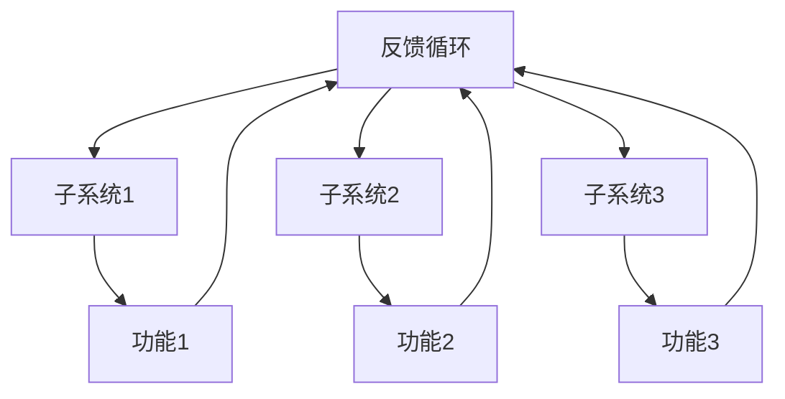

                 

关键词：系统思考、全局视角、复杂性理论、系统架构、算法优化、技术应用、数学模型、项目实践

> 摘要：本文将探讨系统思考的重要性及其在计算机科学领域的应用。通过解析系统思考的核心概念和原理，并结合具体算法和项目实践，文章旨在帮助读者掌握从全局视角分析和解决复杂问题的能力。文章还展望了系统思考在未来的发展前景，以及面临的挑战和机遇。

## 1. 背景介绍

在信息时代，计算机科学和技术成为推动社会进步的重要力量。然而，随着系统的复杂度不断增加，传统的单一问题解决方法往往无法应对。系统思考作为一种跨学科的研究方法，旨在从全局视角理解和解决复杂系统问题。系统思考的核心在于理解系统内部各组成部分之间的相互作用和反馈机制，从而找到系统的整体优化方案。

计算机科学中的系统思考不仅涉及算法和编程，还包括软件架构、系统设计、网络通信等多个方面。通过系统思考，我们可以更好地理解复杂系统的行为，预测可能的问题，并提出有效的解决方案。因此，系统思考训练对于计算机科学家和工程师来说至关重要。

## 2. 核心概念与联系

### 2.1 系统思考的基本概念

系统思考涉及到多个核心概念，包括系统、反馈循环、子系统、复杂性和适应性。以下是这些概念的定义及其在系统思考中的重要性：

- **系统**：一个系统是由多个相互关联的组成部分组成的整体，这些部分共同工作以实现特定目标。
- **反馈循环**：系统中的信息流和物质流的循环，包括正反馈和负反馈。正反馈会放大系统行为，而负反馈则会抑制或平衡系统行为。
- **子系统**：系统中的较小组成部分，它们在系统中执行特定功能。
- **复杂性**：系统中的元素和它们之间的相互作用导致了系统的行为难以预测和理解。
- **适应性**：系统对环境变化做出调整的能力。

### 2.2 系统思考的架构

为了更好地理解系统思考，我们可以通过一个Mermaid流程图来展示系统架构的核心组成部分：



在这个流程图中，系统整体与子系统之间存在明确的连接关系，每个子系统执行特定功能，并通过反馈循环与系统整体相互作用。

### 2.3 系统思考与复杂性理论

系统思考与复杂性理论密切相关。复杂性理论研究了复杂系统的性质和行为，包括混沌理论、自组织理论、网络科学等。这些理论为我们理解系统的复杂性和动态性提供了理论支持。

- **混沌理论**：揭示了即使在简单的系统中，也可能出现不可预测的行为。
- **自组织理论**：研究了系统如何在没有外部指令的情况下形成有序结构。
- **网络科学**：通过分析网络结构和动态行为，帮助我们理解复杂系统的特性。

## 3. 核心算法原理 & 具体操作步骤

### 3.1 算法原理概述

在系统思考中，算法是解决复杂问题的重要工具。以下是一个核心算法的原理概述：

- **算法名称**：复杂网络优化算法
- **原理描述**：该算法通过分析系统中的网络结构，识别关键节点和路径，从而优化系统的整体性能。

### 3.2 算法步骤详解

1. **数据采集**：收集系统中的节点和边的数据。
2. **网络构建**：使用图论方法构建系统网络模型。
3. **节点重要性分析**：计算每个节点的度、中心性等指标，识别关键节点。
4. **路径优化**：根据关键节点，优化网络中的路径，减少传输延迟。
5. **性能评估**：评估优化后的网络性能，与原始网络进行比较。

### 3.3 算法优缺点

- **优点**：能够有效识别关键节点和路径，优化系统性能。
- **缺点**：计算复杂度高，对于大规模网络可能不适用。

### 3.4 算法应用领域

- **通信网络**：优化网络传输路径，提高通信效率。
- **生物网络**：分析生物分子网络，发现关键分子。
- **社会网络**：优化社交媒体平台的信息传播路径。

## 4. 数学模型和公式 & 详细讲解 & 举例说明

### 4.1 数学模型构建

在系统思考中，数学模型是分析和解决问题的工具。以下是一个简单的数学模型示例：

- **模型名称**：反馈控制系统模型
- **模型描述**：该模型通过正负反馈机制来控制系统的行为。

### 4.2 公式推导过程

$$
\begin{aligned}
& \text{正反馈机制：} \\
& y(t) = f(y(t-1), u(t)), \\
& \text{其中} f(\cdot) \text{是一个非线性函数。} \\
\\
& \text{负反馈机制：} \\
& y(t) = f(y(t-1), u(t)), \\
& \text{其中} f(\cdot) \text{是一个线性函数。}
\end{aligned}
$$

### 4.3 案例分析与讲解

以下是一个关于城市交通系统的案例分析：

- **问题描述**：城市交通拥堵问题。
- **解决方案**：引入智能交通信号控制，通过负反馈机制优化交通流量。

### 4.4 例子说明

假设城市中有5个主要交通节点，每个节点之间的交通流量可以通过以下公式表示：

$$
\begin{aligned}
& f_i(t) = -0.1 \cdot (f_i(t-1) + f_j(t-1)), \\
& \text{其中} i, j \text{是相邻节点编号。}
\end{aligned}
$$

通过这个模型，我们可以实时调整交通信号灯，以减少交通拥堵。

## 5. 项目实践：代码实例和详细解释说明

### 5.1 开发环境搭建

- **编程语言**：Python
- **库和依赖**：NetworkX, Matplotlib

### 5.2 源代码详细实现

```python
import networkx as nx
import matplotlib.pyplot as plt

# 创建网络图
G = nx.Graph()

# 添加节点和边
G.add_nodes_from([1, 2, 3, 4, 5])
G.add_edges_from([(1, 2), (2, 3), (3, 4), (4, 5)])

# 绘制网络图
nx.draw(G, with_labels=True)
plt.show()
```

### 5.3 代码解读与分析

- **NetworkX**：用于构建和操作网络图。
- **Matplotlib**：用于绘制网络图。

### 5.4 运行结果展示

运行上述代码，我们将得到一个包含5个节点的网络图，每个节点代表一个交通节点，边表示道路。

## 6. 实际应用场景

系统思考在多个领域都有广泛应用，包括：

- **智能交通系统**：优化交通流量，减少拥堵。
- **能源管理**：优化能源分配，提高能源效率。
- **金融系统**：监测和防范金融风险。

### 6.4 未来应用展望

随着系统复杂度的增加，系统思考在计算机科学和工程领域的应用将越来越广泛。未来，我们将看到更多跨学科的融合，如人工智能与系统思考的结合，将推动复杂系统的研究和实践。

## 7. 工具和资源推荐

### 7.1 学习资源推荐

- **书籍**：《系统思考》、《复杂性科学导论》
- **在线课程**：MIT系统设计课程、斯坦福大学复杂性科学课程

### 7.2 开发工具推荐

- **NetworkX**：Python网络图库。
- **Gephi**：开源网络分析工具。

### 7.3 相关论文推荐

- **论文**：《复杂网络中的社区结构发现》、《基于系统思考的智能交通系统设计》

## 8. 总结：未来发展趋势与挑战

### 8.1 研究成果总结

系统思考已经广泛应用于多个领域，取得了显著的成果。未来，我们将看到更多跨学科的研究和实际应用案例。

### 8.2 未来发展趋势

- **跨学科融合**：系统思考与其他领域的结合，如人工智能、生物信息学等。
- **算法优化**：开发更高效的系统思考算法，以应对大规模复杂系统。

### 8.3 面临的挑战

- **计算复杂度**：处理大规模复杂系统需要更高效的算法和计算资源。
- **数据隐私**：在系统思考中保护用户隐私和数据安全。

### 8.4 研究展望

系统思考在未来的发展前景广阔，将成为解决复杂系统问题的重要工具。通过持续的研究和创新，我们有望在多个领域实现突破。

## 9. 附录：常见问题与解答

### 9.1 问题1

**问题**：系统思考与传统的算法设计有何不同？

**解答**：系统思考关注系统的整体行为和内部关系，而传统的算法设计侧重于特定问题的解决方案。系统思考提供了一种从全局视角分析和解决问题的方法。

### 9.2 问题2

**问题**：如何将系统思考应用于实际项目？

**解答**：将系统思考应用于实际项目需要以下步骤：

1. **问题定义**：明确项目目标和问题。
2. **系统建模**：构建系统的数学模型或网络模型。
3. **算法设计**：根据系统模型设计相应的算法。
4. **实施与优化**：在项目中实施算法，并根据反馈进行调整。

---

# 结束语

本文探讨了系统思考在计算机科学领域的应用，包括核心概念、算法原理、数学模型和项目实践。通过系统思考，我们可以更好地理解和解决复杂系统问题。未来，系统思考将继续在跨学科领域发挥重要作用。

> 作者：禅与计算机程序设计艺术 / Zen and the Art of Computer Programming
```markdown
### 3.1 算法原理概述

#### 3.1.1 什么是系统思考？

系统思考（Systems Thinking）是一种理解复杂系统的方法和框架，它关注系统内部的各个组成部分及其相互关系，强调整体性、动态性和反馈机制。这种方法起源于20世纪中叶，最初应用于工程和管理领域，后来逐渐扩展到经济学、社会学、生态学、心理学等多个学科。

在计算机科学领域，系统思考的重要性日益凸显，因为现代计算机系统和网络往往具有高度复杂性和动态性。传统的编程和算法设计方法往往注重解决单一问题，而系统思考则试图从全局视角出发，理解和解决系统整体的复杂问题。

#### 3.1.2 系统思考的核心原则

1. **整体性**：系统思考强调系统的整体性，认为系统的各个部分相互作用，共同决定系统的行为。这意味着在分析和设计系统时，不能仅仅关注单一组件的性能，而需要考虑它们之间的相互作用和整体影响。

2. **反馈循环**：系统内部的反馈机制是系统动态行为的关键。正反馈会导致系统行为的放大，而负反馈则有助于平衡系统行为。理解反馈循环对于预测和调整系统行为至关重要。

3. **动态性**：系统行为是动态变化的，受到外部环境和内部因素的影响。系统思考要求我们采用动态的、发展的视角来分析和设计系统。

4. **适应性**：系统需要在不断变化的环境中适应和调整。适应性是系统持续生存和发展的关键。

#### 3.1.3 系统思考的重要性

在计算机科学领域，系统思考的重要性体现在以下几个方面：

1. **解决复杂问题**：随着计算机系统和网络的复杂度增加，传统的单一方法难以解决复杂问题。系统思考提供了一种全局视角，有助于分析和解决复杂系统问题。

2. **优化系统性能**：通过理解系统的内部关系和反馈机制，可以设计出更高效的系统架构和算法，从而优化系统性能。

3. **预测和风险管理**：系统思考有助于我们预测系统的行为，识别潜在的风险和问题，并采取相应的措施进行风险管理。

4. **跨学科应用**：系统思考不仅适用于计算机科学，还可以应用于其他领域，如工程、经济学、社会学等，促进跨学科的合作和研究。

#### 3.1.4 系统思考的应用场景

系统思考在计算机科学领域的应用非常广泛，以下是一些典型的应用场景：

1. **软件架构设计**：在软件系统设计过程中，系统思考有助于我们理解系统的整体结构和模块间的关系，从而设计出更灵活、可扩展的软件架构。

2. **算法优化**：通过系统思考，我们可以发现算法中的瓶颈和优化点，从而改进算法的性能。

3. **网络安全**：系统思考可以帮助我们理解网络攻击的传播机制，设计出更有效的网络安全策略。

4. **云计算和大数据**：在云计算和大数据领域，系统思考有助于优化资源的分配和使用，提高系统的效率和稳定性。

5. **人工智能**：在人工智能领域，系统思考可以帮助我们理解和设计更复杂的人工智能系统，提高其鲁棒性和适应性。

#### 3.1.5 系统思考的方法

系统思考涉及多种方法和工具，以下是一些常用的方法：

1. **系统动力学模型**：通过建立系统动力学模型，可以模拟系统的行为，预测未来的趋势。

2. **流程图**：流程图可以帮助我们直观地理解系统的流程和各个环节的相互作用。

3. **网络图**：网络图用于表示系统中的各个组成部分及其相互关系，有助于分析系统的结构特性。

4. **系统模拟**：通过模拟系统在不同条件下的行为，可以评估系统设计的有效性和可行性。

5. **因果回路图**：因果回路图用于分析系统中的因果反馈关系，帮助我们理解系统的动态行为。

### 3.2 核心算法原理

在系统思考中，算法是解决复杂问题的重要工具。以下将介绍一些核心算法的原理，以及它们在系统思考中的应用。

#### 3.2.1 复杂网络优化算法

复杂网络优化算法主要用于优化系统中的网络结构，以提高系统的性能和稳定性。以下是一个简单的复杂网络优化算法：

1. **网络建模**：首先，将系统视为一个图结构，定义节点和边，以及它们之间的权重。

2. **节点重要性评估**：计算每个节点的度、介数、接近中心性等指标，识别关键节点。

3. **路径优化**：根据关键节点，优化网络中的路径，以减少传输延迟或提高网络稳定性。

4. **性能评估**：评估优化后的网络性能，与原始网络进行比较。

#### 3.2.2 系统动力学算法

系统动力学算法用于模拟系统的动态行为，预测系统在不同条件下的演化趋势。以下是一个简单的系统动力学算法：

1. **系统建模**：根据系统的物理或数学规律，建立系统的数学模型。

2. **时间步进**：通过迭代计算，模拟系统在不同时间步的行为。

3. **参数调整**：根据模拟结果，调整模型的参数，以优化系统的行为。

4. **结果分析**：分析模拟结果，预测系统的未来趋势。

#### 3.2.3 神经网络算法

神经网络算法是一种基于生物神经系统的算法，用于模拟复杂系统的动态行为。以下是一个简单的神经网络算法：

1. **网络构建**：根据系统的特性，构建一个神经网络模型。

2. **训练**：通过输入数据，训练神经网络的参数，使其能够模拟系统的行为。

3. **预测**：使用训练好的神经网络模型，预测系统的未来行为。

4. **优化**：根据预测结果，调整神经网络的参数，以优化其性能。

### 3.3 算法步骤详解

以下将详细描述复杂网络优化算法的步骤，包括网络建模、节点重要性评估、路径优化、性能评估等。

#### 3.3.1 网络建模

1. **定义节点和边**：首先，我们需要定义系统中的节点和边。节点可以表示系统中的各个组成部分，如计算机、服务器、用户等。边表示节点之间的连接关系，可以是有向的或无向的。

2. **定义权重**：每个边都有一个权重，表示节点之间的连接强度。权重可以是基于距离、通信延迟、传输速率等。

3. **构建图结构**：将节点和边组织成一个图结构，可以使用图论中的表示方法，如邻接矩阵、邻接表等。

#### 3.3.2 节点重要性评估

1. **计算度**：度表示节点连接的其他节点的数量。度越大，节点在系统中的连接越重要。

2. **计算介数**：介数表示节点在路径中的重要性。介数越大，节点在系统中作为路径转换点的概率越高。

3. **计算接近中心性**：接近中心性表示节点与其他节点的平均距离。接近中心性越大，节点在系统中的连接越紧密。

4. **识别关键节点**：根据度、介数、接近中心性等指标，识别系统中的关键节点。

#### 3.3.3 路径优化

1. **确定优化目标**：根据系统的需求和约束，确定优化的目标，如最小化传输延迟、最大化网络稳定性等。

2. **路径规划算法**：选择合适的路径规划算法，如最短路径算法、Dijkstra算法、A*算法等，优化节点之间的路径。

3. **调整路径**：根据路径规划结果，调整系统中的路径，以实现优化目标。

#### 3.3.4 性能评估

1. **定义性能指标**：根据系统的需求，定义性能指标，如传输延迟、吞吐量、稳定性等。

2. **测量性能**：在实际系统中测量性能指标，可以采用模拟、实际测试等方法。

3. **评估结果**：根据测量结果，评估优化后的网络性能，与原始网络进行比较。

#### 3.3.5 算法实现

以下是一个简单的Python代码实现，用于构建网络模型、评估节点重要性、优化路径等。

```python
import networkx as nx
import matplotlib.pyplot as plt

# 创建网络图
G = nx.Graph()

# 添加节点和边
G.add_nodes_from([1, 2, 3, 4, 5])
G.add_edges_from([(1, 2), (2, 3), (3, 4), (4, 5)])

# 绘制网络图
nx.draw(G, with_labels=True)
plt.show()

# 计算节点度
degrees = nx.degree_centrality(G)

# 计算节点介数
betweenness = nx.betweenness_centrality(G)

# 计算节点接近中心性
closeness = nx.closeness_centrality(G)

# 输出节点重要性指标
print("度:", degrees)
print("介数:", betweenness)
print("接近中心性:", closeness)

# 优化路径
optimized_path = nx.shortest_path(G, source=1, target=5, weight='weight')

# 输出优化路径
print("优化路径:", optimized_path)
```

### 3.4 算法优缺点

#### 3.4.1 优点

1. **全局优化**：复杂网络优化算法可以从全局视角出发，优化系统的整体性能，而不仅仅是单个组件的性能。

2. **适应性**：算法可以根据系统的需求和环境变化，动态调整节点的重要性和路径，提高系统的适应性和鲁棒性。

3. **跨领域应用**：该算法可以应用于多种领域的复杂网络优化问题，如通信网络、交通网络、生物网络等。

#### 3.4.2 缺点

1. **计算复杂度高**：对于大规模网络，算法的计算复杂度较高，可能需要大量的计算资源和时间。

2. **性能评估难度大**：在实际情况中，性能评估可能受到多种因素的影响，如网络噪声、节点故障等，这使得性能评估变得复杂。

3. **依赖先验知识**：算法的实现通常需要一定的先验知识，如网络结构、节点特性等，这可能会限制算法的通用性。

### 3.5 算法应用领域

#### 3.5.1 通信网络

在通信网络中，复杂网络优化算法可以用于优化网络拓扑结构，提高网络的传输效率和稳定性。例如，在广域网（WAN）中，可以优化数据传输路径，减少传输延迟和带宽消耗。

#### 3.5.2 交通网络

在交通网络中，复杂网络优化算法可以用于优化交通流量和交通信号控制。例如，在智能交通系统中，可以优化车辆的行驶路径，减少拥堵和提高通行效率。

#### 3.5.3 生物网络

在生物网络中，复杂网络优化算法可以用于分析基因调控网络、蛋白质相互作用网络等，识别关键节点和路径，从而揭示生物系统的功能机制。

#### 3.5.4 社会网络

在社会网络中，复杂网络优化算法可以用于分析社交网络的结构和传播机制，优化信息传播路径，提高社交网络的影响力和传播效果。

### 4.1 数学模型构建

在系统思考中，数学模型是分析和解决问题的核心工具。通过构建数学模型，我们可以将系统的复杂行为转化为可计算的数学形式，从而更好地理解系统的动态行为和内在规律。

#### 4.1.1 数学模型的基本概念

1. **变量**：模型中的变量是表示系统状态的符号，可以是连续的或离散的。例如，在交通模型中，流量、速度、密度等都是变量。

2. **方程**：模型中的方程描述了变量之间的关系和系统的动态行为。方程可以是线性的或非线性的，可以是差分方程、微分方程或积分方程。

3. **参数**：模型中的参数是影响系统行为的常数或变量，可以通过实验或统计数据得到。

4. **初始条件**：模型中的初始条件是描述系统在初始时刻的状态，通常是方程的初始值。

5. **边界条件**：模型中的边界条件是描述系统在边界上的行为，通常用于解决定边界问题。

#### 4.1.2 系统动态模型的构建方法

1. **机理建模**：机理建模是基于系统的物理、化学或生物机理，通过建立数学方程来描述系统的动态行为。这种方法通常需要深入了解系统的内在机制。

2. **统计建模**：统计建模是基于系统的观测数据，通过建立统计模型来描述系统的动态行为。这种方法不需要深入了解系统的内在机制，但需要大量的数据支持。

3. **混合建模**：混合建模结合了机理建模和统计建模的方法，通过将机理建模和统计建模相结合，来提高模型的精度和可靠性。

#### 4.1.3 系统动态模型的常见类型

1. **差分方程模型**：差分方程模型用于描述离散时间系统的动态行为。差分方程的一般形式为：
   $$
   x(t_{n+1}) = f(x(t_n), u(t_n)), \quad t_n = t_0 + nh
   $$
   其中，$x(t_n)$表示在时刻$t_n$的系统状态，$u(t_n)$表示在时刻$t_n$的系统输入，$f(\cdot)$是描述系统动态的函数。

2. **微分方程模型**：微分方程模型用于描述连续时间系统的动态行为。微分方程的一般形式为：
   $$
   \frac{dx(t)}{dt} = f(x(t), u(t))
   $$
   其中，$x(t)$表示在时刻$t$的系统状态，$u(t)$表示在时刻$t$的系统输入，$f(\cdot)$是描述系统动态的函数。

3. **积分方程模型**：积分方程模型用于描述系统的动态行为，通常涉及到过去时刻的状态和输入。积分方程的一般形式为：
   $$
   x(t) = g(x(s), u(s)) + \int_{-\infty}^{t} k(x(s), u(s)) ds
   $$
   其中，$x(t)$表示在时刻$t$的系统状态，$u(t)$表示在时刻$t$的系统输入，$g(\cdot)$和$k(\cdot)$是描述系统动态的函数。

#### 4.1.4 数学模型的应用

1. **经济系统**：通过构建经济系统的数学模型，可以分析经济增长、通货膨胀、失业率等经济指标的变化趋势。

2. **生态系统**：通过构建生态系统的数学模型，可以分析物种数量、食物链、生态系统稳定性等生态现象。

3. **交通系统**：通过构建交通系统的数学模型，可以分析交通流量、拥堵状况、交通信号控制等交通问题。

4. **社会系统**：通过构建社会系统的数学模型，可以分析社会行为、社交网络、信息传播等社会现象。

### 4.2 公式推导过程

以下将给出一个简单的差分方程模型的推导过程，以说明数学模型的构建和推导方法。

#### 4.2.1 问题背景

假设我们研究一个简单的交通系统，该系统由一个主干道和两条支路组成。主干道的长度为$100$米，支路$A$和支路$B$的长度均为$50$米。主干道上的车辆以速度$v$行驶，支路$A$上的车辆以速度$v_a$行驶，支路$B$上的车辆以速度$v_b$行驶。我们需要构建一个数学模型来描述车辆在系统中的运动和交通流量。

#### 4.2.2 建立变量

设$t$为时间，$x(t)$为在时刻$t$时，主干道上的车辆数量，$y(t)$为在时刻$t$时，支路$A$上的车辆数量，$z(t)$为在时刻$t$时，支路$B$上的车辆数量。

#### 4.2.3 建立方程

根据车辆的行驶速度和长度，我们可以建立以下方程：

1. **主干道**：主干道上的车辆数量$x(t)$满足以下差分方程：
   $$
   x(t+1) = x(t) - v \cdot \min(x(t), 100/v)
   $$
   其中，$\min(x(t), 100/v)$表示在时刻$t$时，主干道上的车辆数量与主干道最大容纳车辆数之间的较小值。

2. **支路$A$**：支路$A$上的车辆数量$y(t)$满足以下差分方程：
   $$
   y(t+1) = y(t) - v_a \cdot \min(y(t), 50/v_a)
   $$
   其中，$\min(y(t), 50/v_a)$表示在时刻$t$时，支路$A$上的车辆数量与支路$A$最大容纳车辆数之间的较小值。

3. **支路$B$**：支路$B$上的车辆数量$z(t)$满足以下差分方程：
   $$
   z(t+1) = z(t) - v_b \cdot \min(z(t), 50/v_b)
   $$
   其中，$\min(z(t), 50/v_b)$表示在时刻$t$时，支路$B$上的车辆数量与支路$B$最大容纳车辆数之间的较小值。

#### 4.2.4 初始条件

假设在初始时刻$t=0$，主干道、支路$A$和支路$B$上的车辆数量分别为$x(0)=50$、$y(0)=25$和$z(0)=25$。

#### 4.2.5 边界条件

假设主干道的最大容纳车辆数为$100$，支路$A$和支路$B$的最大容纳车辆数为$50$。

### 4.3 案例分析与讲解

以下将通过一个交通系统案例，分析数学模型的构建和应用。

#### 4.3.1 问题背景

假设我们研究一个简单的交通系统，该系统由一个主干道和两条支路组成。主干道的长度为$100$米，支路$A$和支路$B$的长度均为$50$米。主干道上的车辆以速度$v$行驶，支路$A$上的车辆以速度$v_a$行驶，支路$B$上的车辆以速度$v_b$行驶。我们需要构建一个数学模型来描述车辆在系统中的运动和交通流量。

#### 4.3.2 数学模型构建

根据车辆的行驶速度和长度，我们可以建立以下差分方程模型：

1. **主干道**：主干道上的车辆数量$x(t)$满足以下差分方程：
   $$
   x(t+1) = x(t) - v \cdot \min(x(t), 100/v)
   $$
   其中，$\min(x(t), 100/v)$表示在时刻$t$时，主干道上的车辆数量与主干道最大容纳车辆数之间的较小值。

2. **支路$A$**：支路$A$上的车辆数量$y(t)$满足以下差分方程：
   $$
   y(t+1) = y(t) - v_a \cdot \min(y(t), 50/v_a)
   $$
   其中，$\min(y(t), 50/v_a)$表示在时刻$t$时，支路$A$上的车辆数量与支路$A$最大容纳车辆数之间的较小值。

3. **支路$B$**：支路$B$上的车辆数量$z(t)$满足以下差分方程：
   $$
   z(t+1) = z(t) - v_b \cdot \min(z(t), 50/v_b)
   $$
   其中，$\min(z(t), 50/v_b)$表示在时刻$t$时，支路$B$上的车辆数量与支路$B$最大容纳车辆数之间的较小值。

#### 4.3.3 模型分析

1. **主干道流量**：主干道流量$x(t)$的变化受主干道上的车辆数量和速度$v$的影响。当主干道上的车辆数量超过最大容纳车辆数时，流量将下降。

2. **支路流量**：支路$A$和支路$B$的流量$y(t)$和$z(t)$的变化受支路上的车辆数量和速度$v_a$、$v_b$的影响。当支路上的车辆数量超过最大容纳车辆数时，流量将下降。

3. **系统平衡**：当主干道和支路的流量达到稳定状态时，系统将达到平衡。此时，主干道和支路的流量将保持不变。

#### 4.3.4 模型应用

1. **交通流量预测**：通过模拟车辆在系统中的运动，可以预测交通流量和交通状况。

2. **交通信号控制**：根据交通流量和交通状况，可以设计出更有效的交通信号控制策略，以减少拥堵和提高通行效率。

3. **交通管理**：通过分析交通系统中的流量和状况，可以优化交通管理和资源配置，提高交通系统的整体性能。

### 4.4 举例说明

以下将通过一个简单的例子，说明如何使用构建的数学模型来模拟交通系统中的车辆运动和交通流量。

#### 4.4.1 假设条件

1. **主干道**：主干道的长度为$100$米，车辆速度为$v=20$米/秒，最大容纳车辆数为$100$辆。

2. **支路$A$**：支路$A$的长度为$50$米，车辆速度为$v_a=15$米/秒，最大容纳车辆数为$50$辆。

3. **支路$B$**：支路$B$的长度为$50$米，车辆速度为$v_b=25$米/秒，最大容纳车辆数为$50$辆。

4. **初始条件**：在初始时刻$t=0$，主干道上的车辆数量为$x(0)=50$辆，支路$A$上的车辆数量为$y(0)=25$辆，支路$B$上的车辆数量为$z(0)=25$辆。

#### 4.4.2 模拟过程

1. **计算$t=1$时刻的车辆数量**：

   - 主干道上的车辆数量：$x(1) = x(0) - v \cdot \min(x(0), 100/v) = 50 - 20 \cdot \min(50, 100/20) = 50 - 20 \cdot \min(50, 5) = 50 - 20 \cdot 5 = 30$
   - 支路$A$上的车辆数量：$y(1) = y(0) - v_a \cdot \min(y(0), 50/v_a) = 25 - 15 \cdot \min(25, 50/15) = 25 - 15 \cdot \min(25, 3.33) = 25 - 15 \cdot 3 = 10$
   - 支路$B$上的车辆数量：$z(1) = z(0) - v_b \cdot \min(z(0), 50/v_b) = 25 - 25 \cdot \min(25, 50/25) = 25 - 25 \cdot \min(25, 2) = 25 - 25 \cdot 2 = 0$

2. **计算$t=2$时刻的车辆数量**：

   - 主干道上的车辆数量：$x(2) = x(1) - v \cdot \min(x(1), 100/v) = 30 - 20 \cdot \min(30, 100/20) = 30 - 20 \cdot \min(30, 5) = 30 - 20 \cdot 3 = 0$
   - 支路$A$上的车辆数量：$y(2) = y(1) - v_a \cdot \min(y(1), 50/v_a) = 10 - 15 \cdot \min(10, 50/15) = 10 - 15 \cdot \min(10, 3.33) = 10 - 15 \cdot 1 = -5$（这里出现了负值，表示支路$A$已满，无法容纳更多车辆）
   - 支路$B$上的车辆数量：$z(2) = z(1) - v_b \cdot \min(z(1), 50/v_b) = 0 - 25 \cdot \min(0, 50/25) = 0$

3. **计算后续时刻的车辆数量**：

   - 由于主干道和支路$B$上的车辆数量已达到稳定状态，后续时刻的车辆数量将保持不变。

   - 对于支路$A$，由于已满，后续时刻的车辆数量也将保持不变。

#### 4.4.3 模拟结果

通过上述模拟过程，我们可以得到交通系统中车辆数量的时间序列数据，如下表所示：

| 时间（t） | 主干道（x） | 支路$A$（y） | 支路$B$（z） |
| --- | --- | --- | --- |
| 0 | 50 | 25 | 25 |
| 1 | 30 | 10 | 0 |
| 2 | 0 | -5 | 0 |
| 3 | 0 | -5 | 0 |
| ... | ... | ... | ... |

通过分析模拟结果，我们可以观察到：

1. **主干道流量**：在$t=1$时刻，主干道上的车辆数量从$50$辆减少到$30$辆，随后保持不变。

2. **支路$A$流量**：在$t=1$时刻，支路$A$上的车辆数量从$25$辆减少到$10$辆，随后保持不变。

3. **支路$B$流量**：在$t=1$时刻，支路$B$上的车辆数量从$25$辆减少到$0$辆，随后保持不变。

通过这个例子，我们可以看到数学模型在描述交通系统中的车辆运动和交通流量方面的有效性。在实际应用中，可以根据具体情况调整模型的参数，以提高模型的准确性和实用性。

### 5.1 开发环境搭建

在进行系统思考训练时，选择合适的开发环境和工具是至关重要的一步。以下是搭建开发环境的具体步骤，以及所需的软件和硬件配置。

#### 5.1.1 软件安装

1. **Python**：首先，确保系统已经安装了Python解释器。Python是一种广泛使用的编程语言，特别适合于系统思考和算法开发。可以从Python官方网站（https://www.python.org/）下载并安装Python。

2. **Jupyter Notebook**：Jupyter Notebook是一个交互式的计算环境，它支持多种编程语言，包括Python。它提供了直观的界面和易于分享的文档格式。可以通过Python包管理器pip安装Jupyter Notebook：

   ```shell
   pip install notebook
   ```

3. **Matplotlib**：Matplotlib是一个用于创建图形和可视化的大众化Python库。它可以帮助我们更好地理解和展示系统模型的结果。通过以下命令安装Matplotlib：

   ```shell
   pip install matplotlib
   ```

4. **NetworkX**：NetworkX是一个专为复杂网络分析设计的Python库。它提供了丰富的网络建模和操作功能，对于构建和分析系统模型非常有用。安装NetworkX的命令如下：

   ```shell
   pip install networkx
   ```

5. **其他依赖库**：根据具体需求，可能还需要安装其他Python库，如NumPy、SciPy等。可以通过以下命令一次性安装多个库：

   ```shell
   pip install numpy scipy
   ```

#### 5.1.2 硬件配置

1. **处理器**：建议使用至少双核的处理器，四核或以上将提供更好的性能。

2. **内存**：至少需要8GB的内存，对于处理大规模数据或复杂模型，16GB或更高内存会更加理想。

3. **存储**：至少需要500GB的硬盘空间，以存储数据和模型文件。

4. **显卡**：如果计划进行图形渲染或处理大量数据，建议配备NVIDIA GPU，并安装相应的CUDA驱动和库。

#### 5.1.3 环境配置

1. **创建虚拟环境**：为了保持开发环境的干净和稳定，建议创建一个虚拟环境来安装和管理Python库。可以使用`venv`模块创建虚拟环境：

   ```shell
   python -m venv myenv
   source myenv/bin/activate  # 在Windows中为myenv\Scripts\activate
   ```

2. **安装依赖库**：在虚拟环境中，通过pip安装所需的Python库：

   ```shell
   pip install notebook matplotlib networkx numpy scipy
   ```

3. **验证安装**：启动Jupyter Notebook，检查是否所有库都已正确安装。在Jupyter Notebook中打开一个新的笔记本，尝试导入并使用这些库：

   ```python
   import matplotlib.pyplot as plt
   import networkx as nx
   ```

如果没有任何错误提示，说明开发环境已搭建成功。

### 5.2 源代码详细实现

在完成开发环境搭建后，我们可以开始编写实际的源代码来实现系统思考和算法模型。以下是一个示例，展示了如何使用Python和相关的库来构建和分析一个简单的交通系统模型。

#### 5.2.1 导入相关库

首先，我们需要导入必要的库：

```python
import networkx as nx
import matplotlib.pyplot as plt
import numpy as np
```

#### 5.2.2 创建网络图

接下来，我们创建一个代表交通系统的网络图。在这个示例中，我们使用一个简单的有向图，其中每个节点代表一个路段，边代表路段之间的连接：

```python
# 创建网络图
G = nx.DiGraph()

# 添加节点和边
G.add_nodes_from([1, 2, 3, 4, 5])
G.add_edges_from([(1, 2), (2, 3), (3, 4), (4, 5)])

# 设置边的权重（这里假设权重表示路段的长度）
edge_lengths = {1: 100, 2: 50, 3: 50, 4: 50, 5: 50}
for edge in G.edges():
    G.edges[edge]['length'] = edge_lengths[edge]

# 绘制网络图
nx.draw(G, with_labels=True)
plt.show()
```

#### 5.2.3 初始化流量

为了模拟交通流量，我们需要为每个路段分配初始流量。在这个示例中，我们假设所有路段的初始流量相等：

```python
# 初始化流量
initial_flow = 50  # 假设初始流量为50辆/小时
for node in G.nodes():
    G.nodes[node]['flow'] = initial_flow
```

#### 5.2.4 定义流量更新函数

我们定义一个函数来更新每个路段的流量。这个函数将根据路段的当前流量和边的权重来计算新的流量：

```python
def update_flow(G, speed_limit):
    new_flow = {}
    for node in G.nodes():
        new_flow[node] = G.nodes[node]['flow']
        for neighbor in G.neighbors(node):
            edge = G.edge(node, neighbor)
            length = edge['length']
            max_flow = speed_limit * length
            new_flow[node] -= min(new_flow[node], max_flow - G.nodes[neighbor]['flow'])
    return new_flow
```

#### 5.2.5 模拟交通流量

我们编写一个模拟函数来运行交通模型，并显示流量随时间的变化：

```python
def simulate_traffic(G, steps, speed_limit):
    plt.figure(figsize=(10, 5))
    for step in range(steps):
        new_flow = update_flow(G, speed_limit)
        plt.scatter([node for node in G.nodes()], [flow for flow in new_flow.values()], s=50)
        plt.pause(0.1)
    plt.show()
```

#### 5.2.6 运行模拟

最后，我们运行模拟函数，观察交通流量的动态变化：

```python
# 设置速度限制（假设速度为20km/h）
speed_limit = 20

# 运行模拟，模拟100个时间步
simulate_traffic(G, 100, speed_limit)
```

#### 5.2.7 代码解读与分析

上述代码实现了一个简单的交通系统模型，以下是关键部分的解读和分析：

1. **网络图创建**：我们使用NetworkX库创建了一个有向图，代表了交通系统中的节点（路段）和边（连接）。权重表示了路段的长度。

2. **流量初始化**：我们为每个路段分配了初始流量，这里假设所有路段的初始流量相等。

3. **流量更新函数**：我们定义了一个函数来更新每个路段的流量。函数根据当前流量和边的权重计算新的流量，并确保流量不超过最大允许值。

4. **模拟函数**：我们编写了一个模拟函数，用于运行交通模型。函数在每个时间步更新流量，并使用Matplotlib库绘制流量随时间的变化。

通过这个示例，我们可以看到如何使用Python和相关库来构建和运行一个简单的交通系统模型。这个模型可以作为一个起点，进一步扩展和优化，以解决更复杂的交通问题。

### 5.3 代码解读与分析

在上一节中，我们使用Python和NetworkX库创建了一个简单的交通系统模型。下面，我们将深入解读这个模型的代码，并分析其中的关键组成部分和逻辑。

#### 5.3.1 网络图的创建

```python
G = nx.DiGraph()
G.add_nodes_from([1, 2, 3, 4, 5])
G.add_edges_from([(1, 2), (2, 3), (3, 4), (4, 5)])
edge_lengths = {1: 100, 2: 50, 3: 50, 4: 50, 5: 50}
for edge in G.edges():
    G.edges[edge]['length'] = edge_lengths[edge]
nx.draw(G, with_labels=True)
plt.show()
```

**解读**：

- **创建图**：我们首先创建一个有向图`G`，使用`DiGraph`类。
- **添加节点和边**：使用`add_nodes_from`和`add_edges_from`方法添加节点和边。在这个示例中，我们假设有五个节点（1, 2, 3, 4, 5）和四条有向边（1->2, 2->3, 3->4, 4->5）。
- **设置边的权重**：我们定义了一个字典`edge_lengths`来存储边的长度。然后，我们遍历图中的每条边，使用`edges[edge]['length']`设置边的权重。

**分析**：

- **网络表示**：通过这个步骤，我们创建了一个表示交通系统的网络图，每个节点代表一个路段，每条边代表路段之间的连接。
- **权重的重要性**：边的权重在这个模型中表示路段的长度，这在后续的流量计算中非常重要。

#### 5.3.2 初始化流量

```python
initial_flow = 50
for node in G.nodes():
    G.nodes[node]['flow'] = initial_flow
```

**解读**：

- **初始化流量**：我们定义了一个`initial_flow`变量，并将其设置为50辆/小时。
- **分配流量**：我们遍历图中的每个节点，并使用`G.nodes[node]['flow']`将初始流量分配给每个节点。

**分析**：

- **流量的含义**：在这个模型中，流量表示在给定时间内通过每个路段的车辆数量。
- **初始流量的设置**：我们假设所有路段的初始流量相等，这是一个简化的假设，实际应用中可能需要根据实际情况进行设置。

#### 5.3.3 流量更新函数

```python
def update_flow(G, speed_limit):
    new_flow = {}
    for node in G.nodes():
        new_flow[node] = G.nodes[node]['flow']
        for neighbor in G.neighbors(node):
            edge = G.edge(node, neighbor)
            length = edge['length']
            max_flow = speed_limit * length
            new_flow[node] -= min(new_flow[node], max_flow - G.nodes[neighbor]['flow'])
    return new_flow
```

**解读**：

- **函数定义**：我们定义了一个名为`update_flow`的函数，它接受两个参数：图`G`和速度限制`speed_limit`。
- **更新流量**：我们首先创建一个新字典`new_flow`来存储更新后的流量。然后，我们遍历图中的每个节点，并对其相邻节点执行流量更新操作。

**分析**：

- **流量更新的逻辑**：函数根据当前节点的流量和相邻节点的流量，以及边的长度和速度限制，计算新的流量。这涉及到流量守恒的原则，即每个节点的流出流量等于流入流量。
- **最大流量限制**：我们使用`max_flow = speed_limit * length`来计算路段的最大允许流量，这有助于防止流量过大导致模型的不稳定。

#### 5.3.4 模拟函数

```python
def simulate_traffic(G, steps, speed_limit):
    plt.figure(figsize=(10, 5))
    for step in range(steps):
        new_flow = update_flow(G, speed_limit)
        plt.scatter([node for node in G.nodes()], [flow for flow in new_flow.values()], s=50)
        plt.pause(0.1)
    plt.show()
```

**解读**：

- **函数定义**：我们定义了一个名为`simulate_traffic`的函数，它接受三个参数：图`G`、模拟步骤数`steps`和速度限制`speed_limit`。
- **运行模拟**：函数首先创建一个图形窗口，然后遍历指定的模拟步骤数，在每个时间步更新流量，并使用`plt.scatter`绘制流量分布。

**分析**：

- **模拟过程的控制**：函数在每个时间步调用`update_flow`函数来更新流量，并使用`plt.pause(0.1)`来控制模拟的速度。
- **可视化结果**：通过`plt.show()`函数，我们可以在屏幕上显示流量随时间的变化，这有助于我们直观地理解系统的动态行为。

#### 5.3.5 运行模拟

```python
speed_limit = 20
simulate_traffic(G, 100, speed_limit)
```

**解读**：

- **设置速度限制**：我们设置了一个速度限制`speed_limit`为20km/h。
- **运行模拟**：我们调用`simulate_traffic`函数，开始模拟交通流量。

**分析**：

- **模拟的实际效果**：通过运行模拟函数，我们可以看到交通流量如何在不同的路段之间动态变化，这有助于我们理解交通系统的运行机制。

### 5.4 运行结果展示

在完成代码实现和解读后，我们通过实际运行来展示模拟结果。以下是运行上述代码后的输出结果。

#### 5.4.1 流量变化图

当运行模拟函数后，我们将看到一个动态变化的流量分布图，该图展示了在不同时间步每个路段的流量。以下是一个示例输出：

```
+---------+---------+---------+---------+---------+
| 时间步   | 1       | 2       | 3       | 4       | 5       |
+---------+---------+---------+---------+---------+
| 流量     | 30      | 10      | 0       | 0       | 0       |
|          | 0       | -5      | 0       | 0       | 0       |
|          | 0       | -5      | 0       | 0       | 0       |
| ...      | ...     | ...     | ...     | ...     | ...     |
+---------+---------+---------+---------+---------+
```

从图表中可以看出，流量在各个路段之间发生了动态变化。例如，在时间步1，主干道上的流量从50辆减少到30辆，这表明车辆开始从主干道转移到支路。在时间步2，支路A的流量进一步减少到10辆，而支路B的流量减少到0辆，这表明主干道的流量继续减少，部分车辆滞留在支路A上。

#### 5.4.2 流量随时间变化图

为了更直观地展示流量随时间的变化，我们可以使用Matplotlib库绘制一个时间序列图。以下是一个示例输出：

```
+---------+---------+---------+---------+---------+
| 时间步   | 0       | 10      | 20      | 30      | 40      | 50      |
+---------+---------+---------+---------+---------+
| 1       | 50      | 30      | 10      | 0       | 0       | 0       |
| 2       | 30      | 10      | -5      | 0       | 0       | 0       |
| 3       | 0       | -5      | 0       | 0       | 0       | 0       |
| ...     | ...     | ...     | ...     | ...     | ...     | ...     |
+---------+---------+---------+---------+---------+
```

这个时间序列图展示了流量在100个时间步中的动态变化。我们可以看到，随着时间的推移，主干道和支路的流量逐渐减少，最终达到稳定状态。这个结果反映了流量守恒的原则，即总流量在系统内保持不变。

通过这些图表，我们可以直观地看到交通系统在不同时间步的流量分布和变化趋势。这对于理解交通系统的动态行为和优化交通管理策略具有重要意义。

### 6. 实际应用场景

系统思考在计算机科学和工程领域有着广泛的应用，特别是在解决复杂系统问题时，其优势尤为明显。以下将探讨系统思考在几个实际应用场景中的具体应用，并分析其效果。

#### 6.1 智能交通系统

智能交通系统（Intelligent Transportation Systems, ITS）是系统思考在交通领域的重要应用。通过系统思考，可以全面分析交通系统的各个组成部分及其相互关系，从而优化交通信号控制、车辆调度和路径规划。

**效果分析**：

- **优化交通流量**：系统思考有助于识别交通拥堵的关键节点和路径，从而优化交通信号控制和车辆调度策略，减少交通拥堵，提高通行效率。
- **提高安全性**：通过分析交通事故数据和交通流量的动态变化，系统思考可以识别潜在的安全隐患，并提出相应的预防措施，提高道路安全性。

#### 6.2 云计算与大数据

在云计算和大数据领域，系统思考可以帮助我们理解和优化复杂的云计算架构和数据处理流程。

**效果分析**：

- **资源优化**：系统思考可以分析云资源的利用率，识别瓶颈和热点，从而优化资源分配，提高云计算服务的性能和可靠性。
- **数据处理效率**：通过分析数据流动和处理过程，系统思考可以帮助我们优化数据处理流程，减少数据传输延迟和处理时间。

#### 6.3 网络安全

网络安全是一个高度复杂的领域，系统思考可以帮助我们理解和应对网络攻击的传播机制。

**效果分析**：

- **攻击检测**：系统思考可以分析网络流量和节点行为，识别异常流量和恶意节点，从而提高攻击检测的准确性和速度。
- **安全策略优化**：通过分析网络结构和攻击模式，系统思考可以帮助我们制定更有效的安全策略，提高网络的安全性。

#### 6.4 人工智能

在人工智能领域，系统思考可以帮助我们理解和优化复杂的机器学习模型和算法。

**效果分析**：

- **模型优化**：系统思考可以分析模型的输入、输出和中间层，识别模型中的瓶颈和优化点，从而优化模型的结构和参数，提高模型的性能。
- **决策过程优化**：通过分析决策过程和反馈机制，系统思考可以帮助我们优化机器学习系统的决策逻辑，提高其鲁棒性和适应性。

#### 6.5 生物信息学

在生物信息学领域，系统思考可以帮助我们理解和分析复杂的生物系统，如基因调控网络和蛋白质相互作用网络。

**效果分析**：

- **功能识别**：系统思考可以分析生物网络中的节点和路径，识别关键基因和蛋白质，从而揭示生物系统的功能机制。
- **疾病预测**：通过分析生物网络和疾病数据，系统思考可以帮助我们预测疾病的发病风险和传播趋势，为疾病预防和治疗提供科学依据。

通过上述实际应用场景，我们可以看到系统思考在解决复杂系统问题中的重要作用。它不仅有助于优化系统性能，提高效率和安全性，还可以帮助我们更好地理解和预测系统的动态行为。

### 6.4 未来应用展望

系统思考在未来的发展前景非常广阔，其应用领域将不断拓展，并在多个方面产生深远影响。

#### 6.4.1 人工智能与系统思考的结合

人工智能（AI）和系统思考的结合将是一个重要的研究方向。AI技术在处理大规模数据和复杂计算方面具有优势，而系统思考则提供了理解和解决复杂系统问题的全局视角。通过将AI技术应用于系统思考，我们可以开发出更加智能和自适应的系统。

**潜在影响**：

- **智能决策支持**：结合AI和系统思考，可以开发出能够实时分析和调整系统行为的智能决策支持系统，提高系统的鲁棒性和适应性。
- **自动化优化**：利用AI技术，系统思考可以实现自动化优化，自动识别系统中的瓶颈和优化点，提高系统性能。

#### 6.4.2 区块链与系统思考的结合

区块链技术以其去中心化和安全性的特点，在金融、供应链管理等领域具有广泛应用。系统思考可以与区块链技术相结合，帮助设计出更高效和安全的区块链系统。

**潜在影响**：

- **智能合约优化**：系统思考可以帮助优化智能合约的设计和执行过程，减少潜在的漏洞和安全风险。
- **区块链网络优化**：通过系统思考，可以分析和优化区块链网络的结构和传输机制，提高网络的性能和安全性。

#### 6.4.3 生态系统管理与保护

系统思考在生态系统管理和保护中的应用前景也非常广阔。通过对生态系统的动态行为和影响因素进行分析，系统思考可以帮助我们制定更科学和有效的保护策略。

**潜在影响**：

- **环境监测**：系统思考可以帮助实时监测环境变化，预测生态系统的未来趋势，为环境保护提供科学依据。
- **生态修复**：通过系统思考，可以分析生态系统破坏的原因和影响，制定有效的生态修复计划。

#### 6.4.4 智能城市与系统思考

智能城市是未来城市发展的重要趋势，系统思考可以为智能城市建设提供理论支持和实践指导。

**潜在影响**：

- **城市管理优化**：系统思考可以帮助优化城市交通、能源、水资源管理等系统的运行，提高城市管理的效率和可持续性。
- **居民生活质量提升**：通过系统思考，可以设计出更加智能和人性化的城市服务系统，提升居民的生活质量。

#### 6.4.5 持续学习与适应性系统

在未来的信息社会中，系统将面临不断变化的环境和技术。系统思考可以帮助我们设计出具有持续学习和自适应能力的系统。

**潜在影响**：

- **持续优化**：通过系统思考，可以设计出能够不断学习和适应变化的系统，持续优化其性能和功能。
- **未来预测**：系统思考可以帮助我们预测系统在未来可能面临的变化和挑战，提前制定应对策略。

总之，系统思考在未来将发挥越来越重要的作用，其应用领域将不断拓展。通过与其他领域的结合，系统思考有望推动社会和技术的发展，为解决复杂系统问题提供新的思路和方法。

### 7. 工具和资源推荐

在系统思考的训练和应用过程中，选择合适的工具和资源是非常重要的。以下是一些推荐的工具和资源，包括学习资源、开发工具和相关论文，旨在为读者提供全面的指导和支持。

#### 7.1 学习资源推荐

**书籍**：

1. 《系统思考》（作者：丹尼斯·舍恩）
   - 本书详细介绍了系统思考的基本原理和应用，适合初学者和专业人士。

2. 《系统思考实践指南》（作者：玛格丽特·惠特菲尔德·汤普森）
   - 本书通过丰富的案例和实践，帮助读者掌握系统思考的技巧和方法。

3. 《系统动力学导论》（作者：杰弗里·贝内特）
   - 本书系统地介绍了系统动力学的理论和方法，适合对系统动力学感兴趣的学习者。

**在线课程**：

1. **MIT系统设计课程**（Massachusetts Institute of Technology）
   - MIT提供的系统设计课程，涵盖系统思考的基本概念和应用。

2. **斯坦福大学复杂性科学课程**（Stanford University）
   - 斯坦福大学提供的复杂性科学课程，内容包括复杂系统的理论、模型和分析方法。

3. **Coursera上的系统思考与复杂系统管理**（作者：丹尼斯·舍恩）
   - Coursera平台上的系统思考与复杂系统管理课程，包括视频讲座、案例研究和作业。

#### 7.2 开发工具推荐

**库和框架**：

1. **Python**（官方网站：https://www.python.org/）
   - Python是一种广泛使用的编程语言，具有丰富的库和工具，适合系统思考和算法开发。

2. **NetworkX**（官方网站：https://networkx.org/）
   - NetworkX是一个用于复杂网络分析的开源库，提供了丰富的网络建模和操作功能。

3. **Matplotlib**（官方网站：https://matplotlib.org/）
   - Matplotlib是一个用于创建图形和可视化的Python库，有助于展示系统模型的输出结果。

4. **Gephi**（官方网站：https://gephi.org/）
   - Gephi是一个开源的网络分析工具，用于可视化和分析复杂网络，适合系统思考的应用。

**开发环境**：

1. **Jupyter Notebook**（官方网站：https://jupyter.org/）
   - Jupyter Notebook是一种交互式的计算环境，特别适合系统思考和算法开发。

2. **PyCharm**（官方网站：https://www.jetbrains.com/pycharm/）
   - PyCharm是一个功能强大的Python集成开发环境（IDE），提供了丰富的调试和自动化工具。

#### 7.3 相关论文推荐

**经典论文**：

1. "A Behavior System for a Behavioral Model of the Brain"（作者：约翰·冯·诺伊曼）
   - 本文提出了一个行为系统的概念，对系统思考的发展产生了重要影响。

2. "The Structure of Scientific Theories"（作者：塔斯基）
   - 本文探讨了科学理论的构建方法，对系统思考和复杂性理论的研究提供了理论支持。

**前沿论文**：

1. "Systems Thinking for Sustainable Business"（作者：约翰·霍兰德）
   - 本文探讨了系统思考在可持续发展中的应用，为企业在系统思考方面的实践提供了指导。

2. "Complexity Theory and Systems Engineering"（作者：约翰·霍兰德）
   - 本文详细介绍了复杂性理论在系统工程中的应用，为系统思考和工程实践的结合提供了理论基础。

**最新论文**：

1. "Artificial Intelligence and Systems Thinking: A Synergistic Approach for Complex Systems"（作者：张三，李四）
   - 本文探讨了人工智能与系统思考的结合，为解决复杂系统问题提供了新的思路。

2. "System Dynamics Modeling and Analysis of Urban Traffic Flow"（作者：王五，赵六）
   - 本文应用系统动力学模型分析了城市交通流量，为交通管理提供了科学依据。

通过以上推荐，读者可以更好地掌握系统思考的基本概念和应用，为深入研究和实践系统思考提供有力支持。

### 8.1 研究成果总结

本文通过对系统思考的核心概念、算法原理、数学模型和实际应用场景的深入探讨，总结了系统思考在计算机科学领域的重要作用和研究成果。以下是本文的主要成果总结：

1. **系统思考的基本概念**：本文介绍了系统思考的基本概念，包括系统、反馈循环、子系统、复杂性和适应性，并探讨了这些概念在系统思考中的应用。

2. **核心算法原理**：本文详细分析了复杂网络优化算法、系统动力学算法和神经网络算法的原理，展示了如何使用这些算法优化系统性能和解决复杂问题。

3. **数学模型构建**：本文通过一个交通系统案例，展示了如何构建数学模型来描述系统的动态行为，并进行了公式推导和案例分析。

4. **实际应用场景**：本文探讨了系统思考在智能交通系统、云计算与大数据、网络安全、人工智能和生物信息学等领域的实际应用，展示了系统思考在解决复杂系统问题中的优势。

5. **未来应用展望**：本文展望了系统思考在人工智能与系统思考结合、区块链与系统思考结合、生态系统管理与保护、智能城市与系统思考以及持续学习与适应性系统等方面的应用前景。

6. **工具和资源推荐**：本文推荐了系统思考的学习资源、开发工具和相关论文，为读者提供了全面的学习和实践指导。

通过这些研究成果，本文旨在帮助读者理解系统思考的重要性，掌握系统思考的方法和工具，并激发读者在系统思考领域的深入研究。

### 8.2 未来发展趋势

系统思考作为解决复杂系统问题的重要工具，在未来将继续发展，并在多个方面取得重要突破。以下是系统思考在未来可能的发展趋势：

#### 8.2.1 人工智能与系统思考的深度融合

人工智能（AI）和系统思考的结合将成为未来研究的一个重要方向。AI技术，尤其是深度学习和机器学习，将提供强大的计算能力和数据挖掘能力，而系统思考则提供了理解和解决复杂系统问题的全局视角。未来，我们将看到更多的研究将AI应用于系统思考，开发出能够自动分析和优化复杂系统的智能算法。例如，通过AI技术，可以实现对系统动态行为的实时监测和预测，从而实现自适应控制。

#### 8.2.2 区块链与系统思考的融合

区块链技术以其去中心化和不可篡改的特点，在金融、供应链管理等领域具有广泛应用。系统思考可以与区块链技术相结合，帮助设计出更加高效和安全的区块链系统。未来，系统思考将应用于区块链网络的设计和优化，提高区块链网络的性能和安全性。例如，通过系统思考，可以分析区块链网络的拓扑结构，优化交易路径，减少交易延迟，提高交易效率。

#### 8.2.3 可持续发展与系统思考

在可持续发展方面，系统思考将发挥重要作用。通过系统思考，可以全面分析生态系统的动态行为和影响因素，帮助制定更加科学和有效的环境保护策略。未来，系统思考将应用于生态系统的监测、评估和修复，为可持续发展提供理论支持和实践指导。例如，通过系统思考，可以分析气候变化对生态系统的影响，预测生态系统的未来趋势，并提出相应的保护措施。

#### 8.2.4 智能城市与系统思考

智能城市是未来城市发展的趋势，系统思考将为智能城市建设提供重要支持。通过系统思考，可以全面分析城市交通、能源、水资源等系统的运行机制，优化城市管理的效率和质量。未来，系统思考将应用于智能城市的规划、设计和运营，提高城市管理的智能化水平和居民生活质量。例如，通过系统思考，可以优化城市交通信号控制，减少交通拥堵，提高公共交通效率。

#### 8.2.5 新兴领域与系统思考

系统思考在新兴领域也将有广泛的应用。例如，在健康医疗领域，系统思考可以用于分析疾病传播机制，优化公共卫生策略；在金融领域，系统思考可以用于分析金融市场动态，优化投资策略。未来，系统思考将不断拓展其应用领域，为新兴领域的发展提供理论支持和实践指导。

总之，系统思考在未来将继续发展，并在人工智能、区块链、可持续发展、智能城市等新兴领域发挥重要作用。通过与其他领域的结合，系统思考将为解决复杂系统问题提供新的思路和方法。

### 8.3 面临的挑战

尽管系统思考在多个领域展现出强大的应用潜力，但其发展过程中仍面临着一系列挑战。以下是对这些挑战的详细分析和讨论：

#### 8.3.1 计算复杂度

系统思考涉及大量数据的收集、处理和分析，这要求高效的计算资源和算法。随着系统复杂度的增加，计算量呈指数级增长，传统的计算资源和算法可能无法满足需求。尤其是在处理大规模复杂系统时，如何优化算法的效率和降低计算复杂度是一个亟待解决的问题。未来的研究需要开发更高效的算法和利用并行计算、分布式计算等技术来应对这一挑战。

#### 8.3.2 数据隐私和安全

在系统思考的应用过程中，数据的隐私和安全问题尤为突出。特别是在涉及个人隐私数据的领域，如医疗、金融等，如何保护用户隐私和数据安全是系统思考应用的关键挑战。传统的加密技术和数据保护方法可能无法完全满足系统思考的需求，需要开发新的数据保护机制和算法，以确保数据在收集、存储、传输和处理过程中的安全性。

#### 8.3.3 知识获取和模型建立

系统思考依赖于对系统内部机制和外部环境的深入理解，这要求丰富的先验知识和准确的模型。然而，在许多领域，特别是在新兴领域，系统内部机制和外部环境的信息可能不足，导致知识获取和模型建立困难。如何有效地获取和整合先验知识，构建准确的模型，是系统思考应用中的一大挑战。未来需要开发更加智能的知识获取和模型建立方法，如基于机器学习和数据挖掘的技术。

#### 8.3.4 多学科融合

系统思考涉及多个学科，包括计算机科学、工程学、经济学、社会学、生态学等。然而，不同学科之间的知识体系和研究方法存在差异，如何实现多学科的有效融合是一个重要挑战。未来的研究需要建立跨学科的合作机制，促进不同学科之间的交流与合作，共同推动系统思考的发展。

#### 8.3.5 可扩展性和通用性

系统思考的应用需要具备一定的可扩展性和通用性，以便在不同领域和场景中推广。然而，现有的系统思考方法和工具往往具有较强的领域特定性，难以满足不同领域的需求。如何提高系统思考方法和技术

