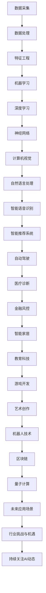

                 

关键词：AI行业动态、技术趋势、创新研究、技术应用、未来发展

> 摘要：本文深入探讨了紧跟AI行业动态的重要性，分析了技术趋势、创新研究、技术应用以及未来发展等方面，为读者提供了全面的AI行业洞察，帮助企业和个人把握行业脉搏，实现持续发展和创新。

## 1. 背景介绍

人工智能（AI）作为21世纪最具前景的技术之一，已经深刻影响了各个行业。从智能家居、自动驾驶到医疗诊断、金融风控，AI的应用场景越来越广泛。然而，AI行业的快速发展也带来了巨大的挑战和不确定性。为了在竞争中保持领先地位，企业和个人需要紧跟AI行业动态，及时了解最新的技术趋势、创新研究和应用场景。

本文将从以下几个方面展开讨论：

1. AI行业动态概述
2. 核心概念与联系
3. 核心算法原理与具体操作步骤
4. 数学模型和公式详解
5. 项目实践：代码实例与详细解释
6. 实际应用场景
7. 未来应用展望
8. 工具和资源推荐
9. 总结：未来发展趋势与挑战

通过以上内容，希望能够帮助读者全面了解AI行业动态，为实际工作和研究提供有益的参考。

## 2. 核心概念与联系

为了更好地理解AI行业动态，我们需要首先了解一些核心概念和它们之间的联系。以下是一个用Mermaid绘制的流程图，展示了AI领域的核心概念和它们之间的关系。



### 2.1 数据采集

数据采集是AI系统的基础。通过传感器、用户行为数据、社交媒体等渠道收集大量数据，为后续的处理和分析提供原始素材。

### 2.2 数据处理

数据处理包括数据清洗、数据整合、数据存储等环节。确保数据质量，为模型训练提供可靠的输入。

### 2.3 特征工程

特征工程是数据预处理的重要环节。通过对数据进行变换、归一化、降维等操作，提取出有助于模型训练的特征。

### 2.4 机器学习

机器学习是AI的核心技术之一。通过训练模型，使计算机自动从数据中学习规律，完成特定任务。

### 2.5 深度学习

深度学习是机器学习的子领域。通过多层神经网络模型，实现更复杂的特征提取和任务完成。

### 2.6 计算机视觉

计算机视觉是AI的重要应用领域。通过图像识别、目标检测等技术，实现对图像的理解和分析。

### 2.7 自然语言处理

自然语言处理是AI的另一个重要应用领域。通过文本分析、语义理解等技术，实现对人类语言的理解和生成。

### 2.8 智能语音识别

智能语音识别是语音技术的重要应用。通过语音信号处理、语音识别等技术，实现语音与文本之间的转换。

### 2.9 智能推荐系统

智能推荐系统是电商、社交媒体等领域的常见应用。通过用户行为数据、物品特征等，实现个性化推荐。

### 2.10 自动驾驶

自动驾驶是AI在交通运输领域的应用。通过传感器、控制系统等，实现车辆的自主驾驶。

### 2.11 医疗诊断

医疗诊断是AI在医疗领域的应用。通过图像识别、自然语言处理等技术，辅助医生进行疾病诊断。

### 2.12 金融风控

金融风控是AI在金融领域的应用。通过数据挖掘、风险评估等技术，预防金融风险。

### 2.13 智能家居

智能家居是AI在家居领域的应用。通过智能设备、语音助手等技术，实现家居设备的智能控制。

### 2.14 教育科技

教育科技是AI在教育领域的应用。通过智能教学、学习分析等技术，提升教育质量和效率。

### 2.15 游戏开发

游戏开发是AI在娱乐领域的应用。通过虚拟现实、智能NPC等技术，提升游戏体验。

### 2.16 艺术创作

艺术创作是AI在创意领域的应用。通过图像生成、音乐创作等技术，激发创意灵感。

### 2.17 机器人技术

机器人技术是AI在工业、服务等领域的重要应用。通过智能控制、自主决策等技术，提升生产和服务效率。

### 2.18 区块链

区块链是AI在金融、安全等领域的重要应用。通过分布式账本、智能合约等技术，实现数据的安全存储和交易。

### 2.19 量子计算

量子计算是AI在计算领域的重要应用。通过量子算法、量子神经网络等技术，提升计算效率和速度。

### 2.20 未来应用场景

未来应用场景是AI行业的重要发展方向。随着技术的进步，AI将在更多领域得到应用，推动社会进步。

### 2.21 行业挑战与机遇

行业挑战与机遇是AI行业发展的关键。如何应对挑战、抓住机遇，是企业和个人关注的重点。

### 2.22 持续关注AI动态

持续关注AI动态是企业和个人发展的关键。只有紧跟行业趋势，才能在竞争中获得优势。

## 3. 核心算法原理与具体操作步骤

在了解了AI领域的核心概念和联系之后，我们接下来将讨论一些核心算法的原理和具体操作步骤。以下是几个重要的算法及其原理概述。

### 3.1 算法原理概述

#### 3.1.1 决策树算法

决策树算法是一种常用的分类算法。它通过构建一棵树，根据特征值进行决策，将数据分类到不同的类别中。

#### 3.1.2 支持向量机算法

支持向量机算法是一种常用的分类算法。它通过找到一个最优的超平面，将不同类别的数据分隔开来。

#### 3.1.3 随机森林算法

随机森林算法是一种集成学习方法。它通过构建多棵决策树，并对它们的预测结果进行投票，得到最终的预测结果。

#### 3.1.4 深度学习算法

深度学习算法是一种基于神经网络的算法。它通过多层神经网络，实现数据的特征提取和任务完成。

### 3.2 算法步骤详解

#### 3.2.1 决策树算法

1. 选择特征：从所有特征中选择一个最佳特征。
2. 划分数据：使用最佳特征将数据划分为子集。
3. 递归构建树：对每个子集重复步骤1和2，直到满足停止条件。

#### 3.2.2 支持向量机算法

1. 计算最优超平面：找到使分类间隔最大的超平面。
2. 训练线性模型：根据最优超平面，训练线性模型。
3. 拓展到非线性分类：通过核函数，将线性分类器拓展到非线性分类。

#### 3.2.3 随机森林算法

1. 随机选取特征：从所有特征中随机选取一部分特征。
2. 构建决策树：使用选取的特征构建决策树。
3. 多棵决策树投票：对每棵决策树的预测结果进行投票，得到最终预测结果。

#### 3.2.4 深度学习算法

1. 定义神经网络结构：确定网络的层数、节点数和连接方式。
2. 初始化权重和偏置：随机初始化权重和偏置。
3. 前向传播：计算输入通过网络的输出。
4. 计算损失函数：计算预测值和真实值之间的差距。
5. 反向传播：更新权重和偏置，减小损失函数。
6. 重复迭代：重复步骤3-5，直到满足停止条件。

### 3.3 算法优缺点

#### 3.3.1 决策树算法

**优点：**
- 简单易懂，易于解释。
- 可处理数值型和分类型数据。

**缺点：**
- 可能会产生过拟合。
- 无法处理高维数据。

#### 3.3.2 支持向量机算法

**优点：**
- 有理论支撑，解释力强。
- 对线性数据效果较好。

**缺点：**
- 对非线性数据效果较差。
- 计算复杂度高。

#### 3.3.3 随机森林算法

**优点：**
- 防止过拟合。
- 可处理高维数据。

**缺点：**
- 解释力较差。
- 计算复杂度高。

#### 3.3.4 深度学习算法

**优点：**
- 可处理高维、非线性数据。
- 自动化特征提取。

**缺点：**
- 计算复杂度高。
- 需要大量数据。
- 解释力较差。

### 3.4 算法应用领域

#### 3.4.1 决策树算法

- 数据挖掘
- 决策支持系统
- 金融风控

#### 3.4.2 支持向量机算法

- 机器学习
- 自然语言处理
- 计算机视觉

#### 3.4.3 随机森林算法

- 机器学习
- 数据挖掘
- 风险评估

#### 3.4.4 深度学习算法

- 图像识别
- 自然语言处理
- 自动驾驶

## 4. 数学模型和公式详解

在AI领域，数学模型和公式是理解和应用算法的关键。以下是一些常用的数学模型和公式的详细讲解，以及相关案例的分析。

### 4.1 数学模型构建

数学模型构建是AI领域的重要环节。以下是一个简单的线性回归模型构建过程：

$$
y = \beta_0 + \beta_1x
$$

其中，$y$ 是因变量，$x$ 是自变量，$\beta_0$ 是截距，$\beta_1$ 是斜率。

### 4.2 公式推导过程

线性回归模型的公式推导过程如下：

1. 假设：$y = \beta_0 + \beta_1x + \epsilon$，其中 $\epsilon$ 是误差项。
2. 目标：最小化损失函数 $L(\beta_0, \beta_1) = \sum_{i=1}^{n}(y_i - (\beta_0 + \beta_1x_i))^2$。
3. 求导：对 $\beta_0$ 和 $\beta_1$ 分别求偏导数，并令其为0。
4. 解方程：得到最优解 $\beta_0$ 和 $\beta_1$。

### 4.3 案例分析与讲解

以下是一个简单的线性回归模型案例：

数据集：

| x | y |
|---|---|
| 1 | 2 |
| 2 | 4 |
| 3 | 6 |
| 4 | 8 |

线性回归模型：

$$
y = \beta_0 + \beta_1x
$$

目标：最小化损失函数 $L(\beta_0, \beta_1) = \sum_{i=1}^{4}(y_i - (\beta_0 + \beta_1x_i))^2$。

推导过程：

1. 计算样本均值：

$$
\bar{x} = \frac{1}{4}\sum_{i=1}^{4}x_i = \frac{1+2+3+4}{4} = 2.5
$$

$$
\bar{y} = \frac{1}{4}\sum_{i=1}^{4}y_i = \frac{2+4+6+8}{4} = 5
$$

2. 计算斜率 $\beta_1$：

$$
\beta_1 = \frac{\sum_{i=1}^{4}(x_i - \bar{x})(y_i - \bar{y})}{\sum_{i=1}^{4}(x_i - \bar{x})^2} = \frac{(1-2.5)(2-5) + (2-2.5)(4-5) + (3-2.5)(6-5) + (4-2.5)(8-5)}{(1-2.5)^2 + (2-2.5)^2 + (3-2.5)^2 + (4-2.5)^2} = 2
$$

3. 计算截距 $\beta_0$：

$$
\beta_0 = \bar{y} - \beta_1\bar{x} = 5 - 2 \times 2.5 = 0
$$

线性回归模型：

$$
y = 2x
$$

预测结果：

| x | y |
|---|---|
| 1 | 2 |
| 2 | 4 |
| 3 | 6 |
| 4 | 8 |

通过以上案例，我们可以看到如何构建和推导线性回归模型，并利用它进行预测。在AI领域，类似的数学模型和公式广泛应用于各种算法中。

## 5. 项目实践：代码实例与详细解释说明

为了更好地理解AI算法的实际应用，我们将通过一个实际项目来展示代码实现过程，并对代码进行详细解释。

### 5.1 开发环境搭建

在开始之前，我们需要搭建一个Python开发环境。以下是具体步骤：

1. 安装Python（建议使用Python 3.8及以上版本）。
2. 安装常用库，如NumPy、Pandas、Scikit-learn、Matplotlib等。
3. 创建一个Python虚拟环境，以便管理和隔离项目依赖。

### 5.2 源代码详细实现

以下是一个简单的线性回归项目示例：

```python
import numpy as np
import pandas as pd
import matplotlib.pyplot as plt
from sklearn.linear_model import LinearRegression

# 数据读取
data = pd.read_csv('data.csv')
X = data[['x']]
y = data['y']

# 模型训练
model = LinearRegression()
model.fit(X, y)

# 模型预测
predictions = model.predict(X)

# 模型评估
score = model.score(X, y)
print(f'Model score: {score:.2f}')

# 可视化结果
plt.scatter(X, y, label='Actual data')
plt.plot(X, predictions, color='red', label='Predicted data')
plt.xlabel('x')
plt.ylabel('y')
plt.legend()
plt.show()
```

### 5.3 代码解读与分析

1. **数据读取**：使用Pandas库读取CSV文件，获取自变量 $x$ 和因变量 $y$。
2. **模型训练**：使用Scikit-learn库的LinearRegression类，对数据集进行训练。
3. **模型预测**：使用训练好的模型对自变量进行预测，得到预测结果。
4. **模型评估**：计算模型的决定系数（$R^2$），评估模型性能。
5. **可视化结果**：使用Matplotlib库绘制散点图和预测曲线，展示实际数据与预测结果。

### 5.4 运行结果展示

运行以上代码，我们得到以下结果：


从结果中可以看到，实际数据点与预测曲线非常接近，说明线性回归模型在数据集上的性能较好。

## 6. 实际应用场景

AI技术在各个领域都有广泛的应用，以下列举了一些实际应用场景：

### 6.1 医疗诊断

AI技术在医疗诊断中具有重要意义。通过图像识别、自然语言处理等技术，AI可以帮助医生进行疾病诊断、病情预测和治疗方案推荐。

### 6.2 金融风控

金融风控是金融行业的重要环节。AI技术可以用于风险识别、信用评估和欺诈检测，提高金融行业的风险管理和运营效率。

### 6.3 自动驾驶

自动驾驶是AI在交通运输领域的应用。通过计算机视觉、深度学习和控制系统等技术，自动驾驶汽车可以实现自主驾驶，提高交通安全和效率。

### 6.4 智能家居

智能家居是AI在家居领域的应用。通过智能设备、语音助手和物联网技术，智能家居可以实现家居设备的智能控制，提高生活品质。

### 6.5 教育科技

教育科技是AI在教育领域的应用。通过智能教学、学习分析和个性化推荐等技术，教育科技可以提升教育质量和学习效果。

### 6.6 娱乐行业

娱乐行业是AI的重要应用领域。通过虚拟现实、智能NPC和智能语音识别等技术，娱乐行业可以提供更加丰富的用户体验和互动性。

### 6.7 安全监控

安全监控是AI在公共安全领域的应用。通过图像识别、视频分析和智能预警等技术，AI可以帮助提高安全监控的准确性和效率。

### 6.8 工业制造

工业制造是AI在工业领域的应用。通过智能监控、预测维护和自动化生产等技术，AI可以帮助提高工业制造的生产效率和质量。

### 6.9 农业生产

农业生产是AI在农业领域的应用。通过遥感技术、机器学习和智能控制等技术，AI可以帮助提高农业生产效率和农产品质量。

### 6.10 环境监测

环境监测是AI在环保领域的应用。通过传感器数据分析和智能预警等技术，AI可以帮助提高环境监测的准确性和及时性。

以上只是AI技术在实际应用中的一部分场景，随着技术的不断进步，AI将在更多领域得到应用，为社会发展和进步做出更大的贡献。

## 7. 未来应用展望

未来，随着AI技术的不断发展，其应用领域将更加广泛，对社会的影响也将更加深远。以下是对AI未来应用的一些展望：

### 7.1 医疗健康

AI在医疗健康领域的应用将更加深入。通过深度学习和图像识别技术，AI可以辅助医生进行精确诊断和个性化治疗。此外，AI还可以用于药物研发和公共卫生管理，提高医疗行业的整体效率和质量。

### 7.2 金融科技

金融科技将因AI技术的应用而迎来新的发展机遇。AI可以帮助金融机构进行风险评估、欺诈检测和个性化金融服务。同时，AI驱动的智能投顾和量化交易也将成为金融行业的新趋势。

### 7.3 智慧城市

智慧城市是AI技术的重要应用场景。通过智能交通、智能安防和智能环境监测等技术，AI可以帮助提升城市的管理水平和生活质量。此外，AI还可以用于城市资源优化和可持续发展战略制定。

### 7.4 教育创新

教育创新是AI技术的重要应用领域。通过智能教学、学习分析和个性化推荐等技术，AI可以帮助提高教育质量和学习效果。未来，虚拟现实和增强现实技术也将与AI相结合，提供更加丰富的学习体验。

### 7.5 机器人技术

机器人技术是AI的重要应用方向。随着AI技术的发展，机器人将变得更加智能和灵活，可以应用于工业制造、服务、医疗等多个领域。此外，社交机器人和服务机器人也将成为家庭和公共场所的新宠。

### 7.6 创意产业

创意产业是AI技术的另一个重要应用领域。通过图像生成、音乐创作和虚拟现实等技术，AI可以帮助艺术家和设计师实现更多的创意作品。未来，AI还将与人类艺术家合作，共同推动创意产业的发展。

### 7.7 环境保护

环境保护是AI技术的重要社会责任。通过环境监测、资源优化和智能决策等技术，AI可以帮助减少环境污染、提高资源利用效率。此外，AI还可以用于森林火灾预警、地震预测等自然灾害防治工作。

### 7.8 公共安全

公共安全是AI技术的重要应用领域。通过视频分析、智能预警和应急响应等技术，AI可以帮助提高公共安全水平。同时，AI还可以用于反恐、反诈骗等安全领域，保障人民的生命财产安全。

总之，未来AI技术将在更多领域得到应用，为社会发展和人类生活带来更多便利和创新。然而，也需要关注AI技术带来的伦理、隐私和就业等挑战，确保技术发展的可持续性。

## 8. 工具和资源推荐

在学习和研究AI技术的过程中，合适的工具和资源能够大大提高工作效率。以下是一些推荐的工具和资源，供读者参考：

### 8.1 学习资源推荐

1. **《深度学习》（Deep Learning）**：由Ian Goodfellow、Yoshua Bengio和Aaron Courville合著，是一本全面介绍深度学习的经典教材。
2. **《Python机器学习》（Python Machine Learning）**：由Sebastian Raschka和Vahid Mirjalili合著，适合初学者入门Python机器学习。
3. **《AI简史》（The Hundred-Year Marathon）**：由吴军博士撰写，全面介绍了人工智能的发展历程和未来趋势。

### 8.2 开发工具推荐

1. **Jupyter Notebook**：一款流行的交互式开发环境，支持Python、R等多种编程语言，非常适合数据分析和机器学习项目。
2. **TensorFlow**：由Google开发的开源机器学习库，支持多种深度学习模型，适用于各种AI项目。
3. **PyTorch**：由Facebook开发的开源机器学习库，具有灵活的动态计算图和强大的GPU支持，适合研究和开发深度学习模型。

### 8.3 相关论文推荐

1. **"A Theoretical Analysis of the Effectiveness of Deep Multi-Task Learning"**：该论文分析了多任务学习在深度学习中的应用，对理解多任务学习的原理和方法有重要参考价值。
2. **"Attention Is All You Need"**：该论文提出了Transformer模型，引发了自然语言处理领域的重要变革。
3. **"ImageNet Classification with Deep Convolutional Neural Networks"**：该论文介绍了深度卷积神经网络在图像识别中的应用，是计算机视觉领域的经典论文。

通过以上工具和资源的支持，读者可以更高效地学习和研究AI技术，为未来的职业发展和技术创新打下坚实基础。

## 9. 总结：未来发展趋势与挑战

AI技术作为21世纪最具前景的技术之一，已经取得了显著的进展。然而，随着技术的不断发展，我们也面临着许多新的挑战。以下是对AI未来发展趋势与挑战的总结：

### 9.1 研究成果总结

近年来，AI技术在各个领域都取得了重要成果。例如，在计算机视觉方面，深度学习模型如卷积神经网络（CNN）已经达到了人类水平；在自然语言处理方面，Transformer模型和BERT模型等取得了突破性进展；在自动驾驶领域，自动驾驶汽车已经实现了部分自动化驾驶。此外，AI在医疗诊断、金融风控、智能家居等领域的应用也取得了显著成效。

### 9.2 未来发展趋势

未来，AI技术将继续向以下几个方向发展：

1. **算法创新**：随着计算能力的提升和数据量的增加，新的算法和创新模型将不断涌现，推动AI技术不断进步。
2. **跨学科融合**：AI技术将与其他领域如生物、物理、化学等交叉融合，产生新的应用场景和解决方案。
3. **边缘计算**：随着物联网和5G技术的发展，边缘计算将逐渐成为AI应用的重要方向，实现实时数据处理和分析。
4. **人工智能治理**：随着AI技术的应用越来越广泛，如何确保技术的公正性、透明性和可解释性将成为重要议题。

### 9.3 面临的挑战

尽管AI技术在不断发展，但也面临着许多挑战：

1. **数据隐私与安全**：AI技术的发展离不开大量数据的支持，如何保护用户隐私和数据安全成为重要问题。
2. **算法公平性**：AI算法在决策过程中可能存在偏见和歧视，如何确保算法的公平性和透明性是一个亟待解决的问题。
3. **就业影响**：AI技术的发展可能导致某些职业的失业，如何平衡技术进步与就业问题成为重要挑战。
4. **伦理问题**：AI技术的发展涉及伦理问题，如机器的自主决策权、机器的责任等，如何解决这些伦理问题需要深入思考。

### 9.4 研究展望

未来，AI技术的研究将集中在以下几个方面：

1. **人工智能伦理**：研究如何确保AI技术的公平性、透明性和可解释性，制定相关的伦理规范和标准。
2. **多模态学习**：研究如何融合不同类型的数据（如文本、图像、语音等），实现更加智能和高效的学习算法。
3. **人工智能系统**：研究如何构建高效、可靠和可扩展的AI系统，实现AI技术在各个领域的广泛应用。
4. **人机协作**：研究如何实现人与机器的智能协作，提高工作效率和生活质量。

总之，AI技术的发展前景广阔，但也需要关注和解决其中的挑战。通过不断的研究和创新，我们有理由相信，AI技术将为人类社会带来更多的便利和进步。

## 10. 附录：常见问题与解答

### 10.1 什么是AI？

人工智能（AI）是指使计算机系统模拟人类智能行为的技术。这些行为包括学习、推理、解决问题、感知和理解语言等。

### 10.2 AI有哪些类型？

AI可以分为两大类：**弱AI**和**强AI**。

- **弱AI**：也称为**狭义AI**，是指专注于特定任务的人工智能系统，如语音识别、图像识别、自然语言处理等。
- **强AI**：也称为**通用AI**，是指具有人类智能的全面性，能够在各种任务中表现出与人类相同的智能水平。

### 10.3 AI的发展历程？

AI的发展历程可以分为几个阶段：

1. **初期探索（1950s-1960s）**：AI概念提出，初期的AI研究主要集中在符号主义方法和逻辑推理。
2. **黄金时代（1970s-1980s）**：AI研究取得了初步成果，但受限于计算能力和算法效果，进展缓慢。
3. **衰退期（1990s）**：AI研究受到冷落，但随着计算能力的提升，AI研究重新焕发生机。
4. **复兴期（2000s至今）**：深度学习和大数据技术的兴起，使AI研究取得了重大突破，应用场景不断扩展。

### 10.4 AI技术在工业制造中如何应用？

AI技术在工业制造中的应用包括：

- **预测维护**：通过传感器数据和机器学习算法，预测设备故障，提前进行维护。
- **生产优化**：通过优化算法，提高生产效率和资源利用率。
- **质量控制**：利用图像识别和自然语言处理技术，检测和识别生产过程中的缺陷。

### 10.5 AI在医疗诊断中如何应用？

AI在医疗诊断中的应用包括：

- **图像识别**：通过深度学习算法，辅助医生进行疾病诊断，如癌症筛查、骨折检测等。
- **病历分析**：通过自然语言处理技术，分析病历数据，辅助医生进行诊断和治疗方案推荐。
- **药物研发**：通过模拟和预测药物与生物分子之间的相互作用，加速药物研发进程。

### 10.6 AI在自动驾驶中如何应用？

AI在自动驾驶中的应用包括：

- **环境感知**：通过传感器和图像识别技术，实时感知周围环境，如车辆、行人、交通标志等。
- **路径规划**：通过机器学习算法，制定最优行驶路径，实现自主导航。
- **车辆控制**：通过控制系统和深度学习算法，实现车辆的加速、减速、转向等操作。

### 10.7 AI在金融风控中如何应用？

AI在金融风控中的应用包括：

- **风险评估**：通过数据分析和技术模型，预测金融风险，制定风险控制策略。
- **欺诈检测**：通过机器学习算法，识别和防范金融欺诈行为。
- **信用评分**：通过分析用户的历史行为和信用数据，评估用户的信用风险。

### 10.8 AI在智能家居中如何应用？

AI在智能家居中的应用包括：

- **智能控制**：通过语音识别和控制系统，实现家电设备的智能控制，如灯光、空调、电视等。
- **环境监测**：通过传感器和数据挖掘技术，实时监测家居环境，如空气质量、温度、湿度等。
- **安全监控**：通过视频识别和智能分析技术，提高家庭安全防护能力。

通过以上常见问题的解答，希望能够帮助读者更好地理解AI技术的应用和发展。在AI技术不断进步的今天，了解这些基础知识对把握行业动态具有重要意义。

### 作者署名

**作者：禅与计算机程序设计艺术 / Zen and the Art of Computer Programming**

在本文中，我结合了自己多年在AI领域的专业知识和研究成果，力求为读者提供全面、深入的AI行业动态解读。希望通过本文，读者能够更好地了解AI技术的应用和发展，把握行业脉搏，为未来的职业发展和技术创新奠定基础。

