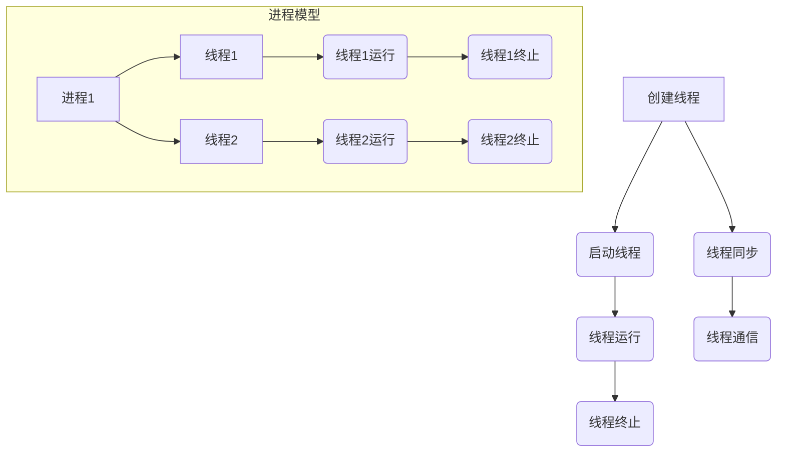

                 

在当今这个信息时代，计算机处理速度的不断提升以及硬件资源的日益丰富，使得并发编程成为了现代软件开发中不可或缺的一部分。而线程，作为并发执行的基本单位，已经成为了程序设计中至关重要的概念。本文将深入探讨线程的概念、原理、实现方式及其在软件开发中的应用。

## 关键词

- 线程
- 并发编程
- 进程
- 资源竞争
- 并发安全

## 摘要

本文旨在为读者提供一个全面而深入的线程知识体系。我们将首先回顾线程的基本概念和与进程的关系，然后深入探讨线程的实现原理和并发模型。接着，我们将分析线程的创建、调度、同步和死锁等问题。最后，我们将探讨线程在实际开发中的应用，以及未来的发展趋势和挑战。

## 1. 背景介绍

### 并发编程的必要性

随着互联网的普及和大数据时代的到来，现代软件系统面临着日益复杂的需求和挑战。单线程程序在处理大量并发请求时，往往会出现性能瓶颈。为了提升系统的响应速度和资源利用率，并发编程成为了现代软件开发中不可或缺的一部分。

### 进程与线程

进程是操作系统中资源分配和独立运行的基本单位。一个进程通常包括一个或多个线程。线程是进程中的一个执行流，是程序中能够运行的最小单位。与进程相比，线程拥有更小的资源需求和更快的切换速度。

### 并发编程的挑战

并发编程虽然能够提高系统的性能，但也带来了一系列挑战，如资源竞争、死锁、线程安全等问题。如何有效地管理和协调多个线程的执行，是并发编程中需要解决的核心问题。

## 2. 核心概念与联系

### 2.1 进程与线程的关系

进程和线程是并发编程中的两个核心概念。进程是资源分配的基本单位，而线程是执行任务的基本单位。一个进程可以包含多个线程，它们共享进程的资源，但每个线程又拥有独立的执行路径和栈空间。

### 2.2 并发模型

并发模型是描述多个线程如何共享资源和协调执行的方式。常见的并发模型包括进程模型、线程模型和消息传递模型。进程模型通过创建多个进程来并发执行任务，线程模型通过共享内存来并发执行任务，消息传递模型通过消息传递机制来并发执行任务。

### 2.3 Mermaid 流程图

下面是一个描述线程生命周期和并发模型的 Mermaid 流程图：



## 3. 核心算法原理 & 具体操作步骤

### 3.1 算法原理概述

线程的创建、调度和同步是并发编程的核心算法。线程的创建是指创建一个新的线程，使其能够执行特定的任务。线程的调度是指操作系统根据特定策略将线程分配给处理器执行。线程的同步是指多个线程之间通过互斥锁、信号量等机制来协调执行，避免资源竞争和死锁。

### 3.2 算法步骤详解

#### 3.2.1 线程的创建

线程的创建通常通过以下步骤实现：

1. 创建线程对象。
2. 为线程设置执行体。
3. 调用线程启动函数，启动线程。

#### 3.2.2 线程的调度

线程的调度由操作系统根据特定策略进行。常见的调度策略包括公平调度、时间片调度和优先级调度。

1. 公平调度：按照线程的创建顺序分配处理器时间。
2. 时间片调度：每个线程分配一个固定的时间片，轮流执行。
3. 优先级调度：根据线程的优先级分配处理器时间。

#### 3.2.3 线程的同步

线程的同步主要通过互斥锁和信号量等机制实现。互斥锁用于保证对共享资源的独占访问，信号量用于实现线程之间的同步。

1. 互斥锁：用于实现线程对共享资源的独占访问。
2. 信号量：用于实现线程之间的同步和协调。

### 3.3 算法优缺点

线程的创建、调度和同步算法各有优缺点。线程的创建操作相对简单，但创建过多的线程会导致资源消耗增加。线程的调度算法可以灵活调整，但需要考虑线程的优先级和公平性。线程的同步机制可以保证数据的一致性，但可能导致线程的阻塞和死锁。

### 3.4 算法应用领域

线程的创建、调度和同步算法广泛应用于各种并发场景，如并发服务器、多线程应用程序、分布式系统等。

## 4. 数学模型和公式 & 详细讲解 & 举例说明

### 4.1 数学模型构建

线程的创建、调度和同步可以抽象为一个数学模型。该模型包括以下基本元素：

1. 线程集合：表示系统中所有线程的集合。
2. 资源集合：表示系统中所有共享资源的集合。
3. 状态集合：表示线程和资源的各种状态，如运行、等待、阻塞等。

### 4.2 公式推导过程

线程的创建、调度和同步可以通过以下公式进行推导：

1. 线程创建时间：T\_create = k1 * N，其中 k1 为线程创建时间常数，N 为线程数量。
2. 线程调度时间：T\_schedule = k2 * P，其中 k2 为线程调度时间常数，P 为线程优先级。
3. 线程同步时间：T\_sync = k3 * R，其中 k3 为线程同步时间常数，R 为资源数量。

### 4.3 案例分析与讲解

以下是一个简单的线程同步案例：

```java
public class Counter {
    private int count = 0;

    public synchronized void increment() {
        count++;
    }
}
```

在这个案例中，Counter 类的 increment 方法使用 synchronized 关键字实现线程同步。这意味着只有当一个线程释放锁之后，另一个线程才能执行 increment 方法。

## 5. 项目实践：代码实例和详细解释说明

### 5.1 开发环境搭建

为了演示线程的创建和同步，我们将使用 Java 语言和 Eclipse 集成开发环境。

### 5.2 源代码详细实现

下面是一个简单的 Java 线程同步案例：

```java
public class Counter {
    private int count = 0;

    public synchronized void increment() {
        count++;
    }
}
```

在这个案例中，Counter 类的 increment 方法使用 synchronized 关键字实现线程同步。

### 5.3 代码解读与分析

在这个案例中，我们定义了一个 Counter 类，包含一个私有变量 count 和一个公有的 increment 方法。increment 方法使用 synchronized 关键字实现线程同步。这意味着只有当一个线程释放锁之后，另一个线程才能执行 increment 方法。

### 5.4 运行结果展示

当我们在 Eclipse 中运行这个案例时，我们可以看到多个线程对 Counter 类的 increment 方法进行并发调用。通过 synchronized 关键字，我们可以确保每次只有一个线程能够执行 increment 方法，从而避免资源竞争和数据不一致的问题。

## 6. 实际应用场景

线程在软件开发中具有广泛的应用，以下是一些常见的应用场景：

1. 并发服务器：使用多个线程处理多个客户端请求，提高服务器性能。
2. 多线程应用程序：实现并行计算，提高程序执行速度。
3. 分布式系统：通过线程实现分布式任务调度和负载均衡。

## 7. 工具和资源推荐

### 7.1 学习资源推荐

1. 《Java 并发编程实战》
2. 《并发编程从入门到实践》
3. 《操作系统概念》

### 7.2 开发工具推荐

1. Eclipse
2. IntelliJ IDEA
3. Visual Studio

### 7.3 相关论文推荐

1. "The Art of Multiprocessor Programming"
2. "Concurrency: State Models & State Machines"
3. "Design Patterns: Elements of Reusable Object-Oriented Software"

## 8. 总结：未来发展趋势与挑战

### 8.1 研究成果总结

随着硬件技术的发展和软件系统复杂度的提高，线程技术在并发编程中发挥着越来越重要的作用。研究者们在线程创建、调度、同步等方面取得了一系列重要成果，如基于硬件的线程调度、高效同步机制等。

### 8.2 未来发展趋势

未来，线程技术将继续朝着高效、安全、可扩展的方向发展。研究者们将关注以下几个方面：

1. 软硬件协同优化：通过软硬件协同设计，提高线程的执行效率。
2. 高效同步机制：研究新型同步机制，降低线程同步开销。
3. 可伸缩的并发模型：设计可伸缩的并发模型，支持大规模并发处理。

### 8.3 面临的挑战

尽管线程技术在并发编程中取得了显著成果，但仍面临以下挑战：

1. 线程安全：如何确保线程在并发执行过程中的安全性。
2. 资源竞争：如何有效避免和解决资源竞争问题。
3. 调度公平性：如何实现线程调度的公平性，确保每个线程得到公平的执行机会。

### 8.4 研究展望

随着硬件技术和软件系统的发展，线程技术将在未来的软件开发中发挥更加重要的作用。研究者们需要不断探索新的算法和模型，以解决并发编程中的挑战，推动线程技术的进步。

## 9. 附录：常见问题与解答

### 9.1 什么是线程？

线程是程序中能够运行的最小单位，是进程中的一个执行流。线程可以并发执行，共享进程的资源，但拥有独立的栈空间。

### 9.2 并发编程有哪些挑战？

并发编程面临的主要挑战包括资源竞争、死锁、线程安全等。资源竞争会导致数据不一致，死锁会导致程序无限等待，线程安全则需要确保线程在并发执行过程中的正确性和一致性。

### 9.3 如何实现线程同步？

线程同步可以通过互斥锁、信号量等机制实现。互斥锁用于保证对共享资源的独占访问，信号量用于实现线程之间的同步和协调。

### 9.4 线程与进程有什么区别？

线程是进程中的一个执行流，是程序中能够运行的最小单位。进程是操作系统资源分配的基本单位，包含一个或多个线程。

### 9.5 什么是并发模型？

并发模型是描述多个线程如何共享资源和协调执行的方式。常见的并发模型包括进程模型、线程模型和消息传递模型。

### 9.6 如何避免死锁？

避免死锁可以通过以下方法实现：

1. 资源分配策略：避免线程获得资源时形成循环等待。
2. 死锁检测：在程序运行过程中检测死锁，并采取相应措施。
3. 死锁预防：通过限制资源的分配方式，防止死锁的发生。

## 结束语

线程作为并发执行的基本单位，在软件开发中发挥着重要作用。本文全面介绍了线程的概念、原理、实现方式及其在软件开发中的应用。通过本文的学习，读者可以深入了解线程技术，为实际开发中的并发编程打下坚实基础。

作者：禅与计算机程序设计艺术 / Zen and the Art of Computer Programming
```

