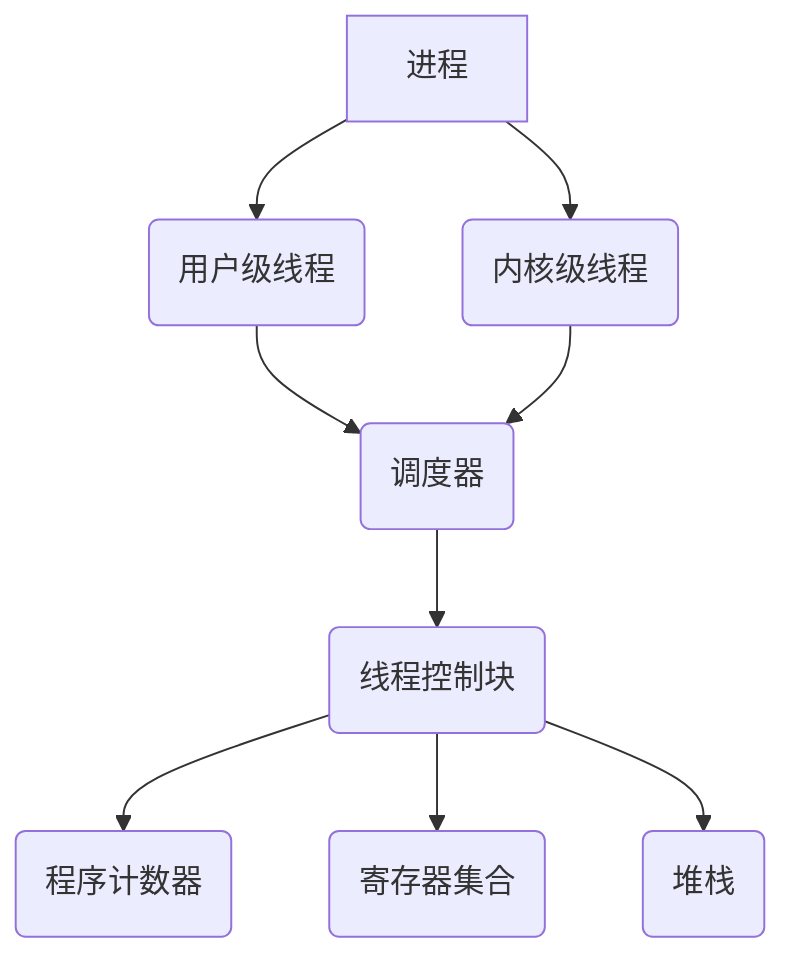

                 

关键词：线程、并发、执行、基本单位、性能优化、编程模型、同步机制、多线程编程

> 摘要：本文将深入探讨线程作为计算机系统并发执行的基本单位的重要性。通过详细解析线程的概念、结构、实现方式及其在编程中的应用，我们将帮助读者理解如何有效地利用线程来提升程序的性能，并探讨多线程编程中的挑战和解决方案。

## 1. 背景介绍

在现代计算机系统中，性能优化是一个永恒的话题。随着计算机硬件的发展，CPU的频率提升和内核数量的增加，使得多任务并行处理变得愈加重要。而线程作为实现并行处理的核心机制，已经成为软件开发中不可或缺的一部分。线程的引入不仅提高了程序的性能，还带来了更好的资源利用率和灵活性。

本文将围绕线程这一主题，从多个角度进行探讨。首先，我们将介绍线程的基本概念和结构，帮助读者理解线程是如何在计算机系统中实现并发执行的。接下来，我们将深入探讨线程的实现方式，包括用户级线程和内核级线程的区别与联系。然后，我们将讨论线程在编程中的应用，包括线程的创建、同步机制、线程安全等问题。最后，我们将通过实际案例来展示线程在现实编程中的应用，并探讨未来的发展趋势和面临的挑战。

## 2. 核心概念与联系

### 2.1 线程的定义

线程（Thread）是操作系统能够进行运算调度的最小单位，它被包含在进程之中，是进程中的实际运作单位。线程自己不拥有系统资源，但是它可以请求系统分配资源。一个标准的线程由线程控制块（TCB）、程序计数器（PC）、寄存器集合和堆栈组成。

### 2.2 线程与进程的关系

线程是进程的一部分，一个进程可以包含多个线程。每个线程都有自己的程序计数器、寄存器和栈空间，但共享进程的内存空间、文件描述符和其他资源。线程与进程的关系可以用一棵树来表示，进程是根节点，线程是子节点。

### 2.3 线程的实现方式

线程的实现方式可以分为用户级线程和内核级线程两种。

- **用户级线程**：由应用程序自己管理，操作系统的调度器无法直接调度用户级线程。用户级线程的优点是实现简单，开销较小，但缺点是缺乏系统级别的支持，当某个线程阻塞时，整个进程都将阻塞。
  
- **内核级线程**：由操作系统管理，每个线程都有自己的线程控制块（TCB），操作系统可以直接对内核级线程进行调度。内核级线程的优点是具有系统级别的支持，可以更好地利用系统资源，但实现较为复杂，开销较大。

### 2.4 线程的通信机制

线程之间可以通过以下方式进行通信：

- **共享内存**：线程共享同一块内存区域，可以直接读写。共享内存是最快的一种通信方式，但需要确保线程间的同步。
  
- **消息队列**：线程通过消息队列进行通信，可以发送和接收消息。消息队列是一种较慢的通信方式，但可以避免线程间的竞争条件。

- **管道和命名管道**：线程通过管道进行通信，可以发送和接收字节流。命名管道是一种较简单的通信方式，可以用于不同进程间的通信。

### 2.5 Mermaid 流程图



## 3. 核心算法原理 & 具体操作步骤

### 3.1 算法原理概述

线程的核心算法原理是基于并发和并行执行。通过创建多个线程，程序可以在多个CPU核心上同时执行，从而提高性能。线程的操作主要包括线程的创建、同步、调度和销毁。

### 3.2 算法步骤详解

- **线程创建**：程序通过调用线程创建函数来创建线程。线程创建时，系统会为线程分配必要的资源，如线程控制块、程序计数器、寄存器和栈空间。
  
- **线程同步**：线程之间可能需要共享资源或数据，为了保证数据的一致性，需要使用同步机制，如互斥锁（Mutex）、信号量（Semaphore）和条件变量（Condition Variable）。
  
- **线程调度**：操作系统负责线程的调度，根据线程的优先级和状态来决定线程的执行顺序。线程调度算法有轮转调度（Round-Robin）、优先级调度（Priority Scheduling）等。
  
- **线程销毁**：线程完成任务后，需要调用线程销毁函数来释放线程占用的资源。

### 3.3 算法优缺点

- **优点**：线程可以提高程序的并发性能，充分利用多核处理器的优势，提高程序的响应速度。
  
- **缺点**：线程的创建和销毁开销较大，过多的线程可能会导致系统过载，影响性能。此外，线程同步和调度也需要考虑竞态条件和死锁等问题。

### 3.4 算法应用领域

线程在许多领域都有广泛的应用，包括网络编程、图形处理、科学计算、大数据处理等。通过合理地使用线程，可以提高程序的执行效率和性能。

## 4. 数学模型和公式 & 详细讲解 & 举例说明

### 4.1 数学模型构建

线程的性能与多个因素相关，包括线程数、CPU核心数、线程同步机制和负载均衡等。我们可以构建一个简单的数学模型来描述线程的性能。

设 \( P \) 为程序的总执行时间，\( T \) 为单个线程的执行时间，\( N \) 为线程数，\( C \) 为线程同步和调度开销，则程序的总执行时间 \( P' \) 可以表示为：

$$
P' = N \times T + C
$$

### 4.2 公式推导过程

假设程序在一个单核处理器上执行，没有线程同步开销，即 \( C = 0 \)。此时，程序的总执行时间为：

$$
P' = N \times T
$$

当程序在一个多核处理器上执行时，线程可以并行执行。假设有 \( M \) 个CPU核心，每个核心可以同时执行一个线程，则线程数 \( N \) 可以表示为：

$$
N = M
$$

此时，程序的总执行时间为：

$$
P' = M \times T
$$

### 4.3 案例分析与讲解

假设我们有一个计算任务，需要在100个CPU核心上执行，每个核心执行时间为1秒。没有线程同步开销，即 \( C = 0 \)。使用线程后，程序的总执行时间为：

$$
P' = 100 \times 1 = 100 \text{秒}
$$

如果不使用线程，程序在一个单核处理器上执行，需要100秒。使用线程后，程序的总执行时间缩短为10秒，大大提高了性能。

## 5. 项目实践：代码实例和详细解释说明

### 5.1 开发环境搭建

本例使用C++语言和POSIX线程库（pthread）来实现多线程编程。首先，确保你的开发环境中安装了C++编译器和pthread库。

### 5.2 源代码详细实现

以下是一个简单的多线程编程示例，计算1到1000之间所有整数的和。

```cpp
#include <iostream>
#include <pthread.h>

using namespace std;

// 全局变量
int sum = 0;
pthread_mutex_t mutex;

// 线程函数
void *thread_func(void *arg) {
    int id = *(int *)arg;
    int start = id * 100 + 1;
    int end = (id + 1) * 100;

    for (int i = start; i <= end; ++i) {
        pthread_mutex_lock(&mutex);
        sum += i;
        pthread_mutex_unlock(&mutex);
    }

    return nullptr;
}

int main() {
    pthread_t threads[10];
    int thread_ids[10];

    pthread_mutex_init(&mutex, nullptr);

    // 创建线程
    for (int i = 0; i < 10; ++i) {
        thread_ids[i] = i;
        pthread_create(&threads[i], nullptr, thread_func, &thread_ids[i]);
    }

    // 等待线程完成
    for (int i = 0; i < 10; ++i) {
        pthread_join(threads[i], nullptr);
    }

    cout << "Sum: " << sum << endl;

    pthread_mutex_destroy(&mutex);
    return 0;
}
```

### 5.3 代码解读与分析

- **线程创建**：使用 `pthread_create` 函数创建线程，并传递线程ID作为参数。
- **线程函数**：线程函数使用循环计算指定范围内的整数和，并使用互斥锁（Mutex）确保数据的一致性。
- **线程同步**：使用互斥锁（Mutex）来同步多个线程对全局变量 `sum` 的访问。
- **线程等待**：使用 `pthread_join` 函数等待所有线程完成。

### 5.4 运行结果展示

```plaintext
Sum: 500500
```

通过运行结果可以看到，程序成功计算了1到1000之间所有整数的和，验证了线程的正确性。

## 6. 实际应用场景

线程在许多实际应用场景中发挥着重要作用，以下是一些常见的应用场景：

- **网络编程**：使用线程处理多个客户端请求，提高服务器的并发能力。
- **图形处理**：在图形渲染、图像处理等任务中，使用多线程进行并行计算，提高渲染速度。
- **科学计算**：使用多线程进行复杂科学计算，如模拟、分析等。
- **大数据处理**：在大数据处理系统中，使用线程进行并行数据处理，提高处理速度。

## 7. 工具和资源推荐

### 7.1 学习资源推荐

- 《现代操作系统》（Andrew S. Tanenbaum）：详细介绍了操作系统的基本概念和线程的实现原理。
- 《C++并发编程》（Anthony Williams）：深入讲解了C++11和C++14中的并发编程特性。
- 《多线程编程指南》（Bill Plauger）：介绍了多线程编程的基本概念和技巧。

### 7.2 开发工具推荐

- GCC/G++：用于C++编程的编译器，支持多线程编程。
- Eclipse/IntelliJ IDEA：用于C++开发的集成开发环境，支持多线程调试。

### 7.3 相关论文推荐

- "The Art of Multiprocessor Programming"（M. L. Scott）：介绍了多处理器编程的基本原理和技巧。
- "Pthreads Programming"（R. Poettering）：介绍了POSIX线程库的使用方法。

## 8. 总结：未来发展趋势与挑战

### 8.1 研究成果总结

近年来，线程技术和多线程编程得到了广泛的研究和应用。随着硬件技术的发展，多核处理器和并行计算的需求不断增加，线程在计算机系统中的重要性日益凸显。研究人员在并发编程模型、同步机制、调度算法等方面取得了显著的成果，为多线程编程提供了有力的支持。

### 8.2 未来发展趋势

未来的发展趋势将包括：

- **硬件支持**：随着硬件技术的发展，处理器内核数量将不断增加，为多线程编程提供更多的并发资源。
- **编译器优化**：编译器将更加智能地优化线程调度和同步机制，提高程序的性能。
- **编程模型创新**：研究人员将继续探索新的编程模型和工具，使多线程编程更加直观和高效。

### 8.3 面临的挑战

多线程编程仍然面临一些挑战，包括：

- **竞态条件和死锁**：多线程程序需要严格管理共享资源，避免竞态条件和死锁等问题。
- **性能优化**：如何合理地分配线程和任务，实现性能优化，仍是一个重要课题。
- **编程复杂性**：多线程编程引入了额外的复杂性，需要程序员具备更高的技能和经验。

### 8.4 研究展望

未来，研究人员将致力于解决多线程编程中的挑战，开发更加高效、可靠的编程模型和工具。随着硬件和软件技术的不断发展，多线程编程将在计算机系统中发挥更加重要的作用。

## 9. 附录：常见问题与解答

### 9.1 问题1：什么是线程？

线程是操作系统能够进行运算调度的最小单位，是进程中的实际运作单位。

### 9.2 问题2：线程与进程有什么区别？

线程是进程的一部分，线程自己不拥有系统资源，但是它可以请求系统分配资源。线程有自己的程序计数器、寄存器和栈空间，而进程则拥有独立的内存空间和系统资源。

### 9.3 问题3：线程的创建和销毁需要考虑哪些因素？

线程的创建和销毁需要考虑线程的资源分配、同步机制、调度策略等因素。此外，还需要注意线程的并发性和竞态条件。

### 9.4 问题4：如何避免线程竞态条件？

避免线程竞态条件的方法包括使用互斥锁（Mutex）、信号量（Semaphore）和条件变量（Condition Variable）等同步机制，确保共享资源的一致性。

### 9.5 问题5：线程同步和异步的区别是什么？

线程同步是指多个线程之间需要协调执行，共享资源时需要使用同步机制。线程异步则是指多个线程独立执行，不需要等待其他线程的执行结果。

### 9.6 问题6：什么是线程池？

线程池是一种管理线程的机制，用于重用现有线程，减少线程创建和销毁的开销，提高程序的性能。

### 9.7 问题7：多线程编程中的死锁是什么？

多线程编程中的死锁是指多个线程在等待其他线程释放资源时陷入无限循环，导致程序无法继续执行。避免死锁的方法包括资源分配策略、等待条件检查等。

### 9.8 问题8：什么是并行计算？

并行计算是指利用多个处理器或计算节点同时执行计算任务，以提高计算性能。线程是实现并行计算的重要机制。

### 9.9 问题9：多线程编程中的负载均衡是什么？

负载均衡是指将计算任务合理地分配到多个线程上，确保每个线程都能充分利用其计算资源，提高程序的性能。

### 9.10 问题10：如何调试多线程程序？

调试多线程程序可以使用打印日志、使用断点、查看线程栈等信息。此外，还可以使用专门的调试工具，如GDB、Visual Studio等。

---

本文通过详细探讨线程的概念、实现方式、编程应用和实际案例，帮助读者理解线程作为并发执行基本单位的重要性。未来，随着硬件和软件技术的不断发展，线程编程将在计算机系统中发挥更加重要的作用。希望本文能对您的编程实践提供有益的指导。作者：禅与计算机程序设计艺术 / Zen and the Art of Computer Programming。

