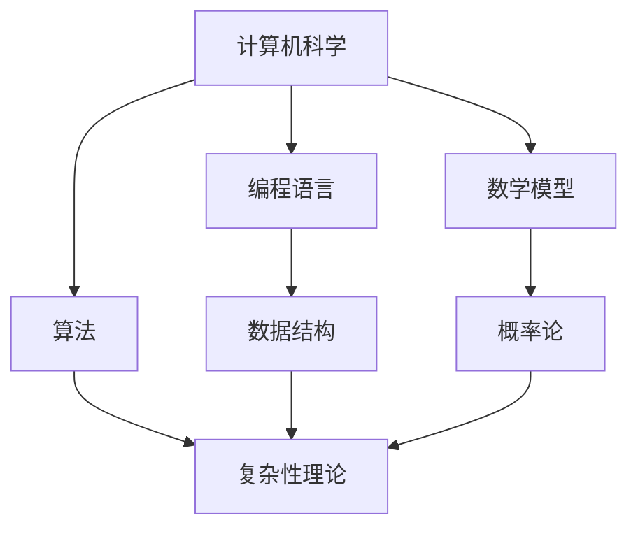

                 

关键词：认知、知识体系、IT领域、经典书籍、编程、算法、数学模型

> 摘要：本文旨在为读者推荐一系列在计算机科学和信息技术领域具有深远影响力的经典书籍。这些书籍不仅能够帮助读者夯实认知基础，还能为他们在学术研究和职业发展上提供宝贵的指导。

## 1. 背景介绍

在信息技术迅速发展的时代，掌握扎实的理论基础和深厚的知识体系显得尤为重要。本文将从计算机科学、编程、算法、数学模型等多个方面，介绍一系列对认知提升具有重要意义的经典书籍。这些书籍不仅代表了该领域的权威性和前沿性，更是无数IT从业者、学者和学生的良师益友。

### 1.1 计算机科学基础

计算机科学是一门涉及计算机理论、设计、开发、应用等多个方面的学科。其基础知识对于理解和掌握计算机技术至关重要。以下几本书籍是计算机科学领域的经典之作：

- 《计算机科学概论》（作者：J.格伦·布鲁克希尔，安德鲁·J.范德瓦耳）
- 《计算机程序的构造和解释》（作者：哈罗德·阿伯尔，杰拉尔德·J.戴特）
- 《计算机科学导论》（作者：托马斯·H.克罗克，伊丽莎白·A.克拉克）

### 1.2 编程语言

编程语言是计算机科学的核心工具之一，掌握多种编程语言对于提升编程能力具有重要意义。以下几本书籍是学习编程语言的必备之选：

- 《C程序设计语言》（作者：布莱恩·W.凯恩，丹尼斯·M.里奇）
- 《Python编程：从入门到实践》（作者：埃里克·马瑟斯）
- 《JavaScript高级程序设计》（作者：戴维·温伯格）

### 1.3 算法

算法是计算机科学的核心概念之一，掌握有效的算法设计方法对于解决复杂问题具有重要意义。以下几本书籍是学习算法的权威指南：

- 《算法导论》（作者：托马斯·H.科内赫，克利斯蒂亚诺·萨尔尼）
- 《算法竞赛入门经典》（作者：张乃杰）
- 《算法图解》（作者：Aditya Bhargava）

### 1.4 数学模型

数学模型是计算机科学中不可或缺的部分，掌握数学模型有助于深入理解计算机系统的运行机制。以下几本书籍是学习数学模型的重要资源：

- 《离散数学及其应用》（作者：赫尔伯特·S.穆雷，伊丽莎白·J.穆雷）
- 《线性代数及其应用》（作者：David C. Lay）
- 《概率论与数理统计》（作者：吴喜之）

## 2. 核心概念与联系

在计算机科学和信息技术领域，一些核心概念和原理是相互关联的。以下是一个简单的Mermaid流程图，展示了这些概念和原理之间的联系：



### 2.1 计算机科学

计算机科学是研究计算机系统设计和应用的科学，它涵盖了编程语言、算法、数学模型等多个方面。计算机科学的核心目标是设计和分析算法，以解决复杂问题。

### 2.2 编程语言

编程语言是计算机科学家和程序员用来编写程序的正式语言。不同的编程语言有不同的特点和适用场景，但它们的核心目标都是帮助程序员高效地实现算法。

### 2.3 算法

算法是解决问题的一系列有序步骤。算法的设计和分析是计算机科学的核心内容之一。算法可以分为多种类型，如排序算法、搜索算法、图算法等。

### 2.4 数学模型

数学模型是用数学语言描述现实世界问题的抽象模型。在计算机科学中，数学模型用于模拟和预测计算机系统的行为，以便优化算法设计和分析。

## 3. 核心算法原理 & 具体操作步骤

### 3.1 算法原理概述

算法可以分为多种类型，每种类型都有其特定的原理和特点。以下是一些常见的算法类型及其原理概述：

- **排序算法**：用于对数据进行排序，常见的排序算法有冒泡排序、选择排序、插入排序等。
- **搜索算法**：用于在数据结构中查找特定元素，常见的搜索算法有线性搜索、二分搜索等。
- **图算法**：用于解决与图相关的问题，如最短路径算法、最小生成树算法等。
- **动态规划**：用于求解具有最优子结构特性的问题，通过递推关系和状态转移方程实现。

### 3.2 算法步骤详解

以冒泡排序算法为例，其步骤如下：

1. 比较相邻的元素。如果第一个比第二个大（升序排序），就交换它们两个；
2. 对每一对相邻元素做同样的工作，从开始第一对到结尾的最后一对；
3. 重复以上的步骤，除了最后一对；
4. 重复步骤1~3，直到排序完成。

### 3.3 算法优缺点

冒泡排序算法的优点是简单易懂，实现简单，易于理解。缺点是时间复杂度为O(n^2)，在数据量大时效率较低。

### 3.4 算法应用领域

冒泡排序算法广泛应用于各类场景，如初学者入门学习排序算法、小规模数据排序等。

## 4. 数学模型和公式 & 详细讲解 & 举例说明

### 4.1 数学模型构建

数学模型通常由以下部分组成：

- **变量**：用于表示问题中的不同元素或参数；
- **函数**：用于描述变量之间的关系；
- **约束条件**：用于限制变量的取值范围。

### 4.2 公式推导过程

以下是一个简单的线性回归模型的公式推导：

$$
y = \beta_0 + \beta_1x
$$

其中，$y$ 表示因变量，$x$ 表示自变量，$\beta_0$ 和 $\beta_1$ 分别为模型的参数。

### 4.3 案例分析与讲解

假设我们有一组数据，如下所示：

| x | y |
|---|---|
| 1 | 2 |
| 2 | 4 |
| 3 | 6 |

我们可以使用线性回归模型来拟合这组数据：

$$
y = \beta_0 + \beta_1x
$$

通过最小二乘法，我们可以求得参数 $\beta_0$ 和 $\beta_1$ 的值。假设我们求得 $\beta_0 = 1$，$\beta_1 = 1$，则拟合的线性回归模型为：

$$
y = 1 + x
$$

我们可以使用这个模型来预测新的 $x$ 对应的 $y$ 值。例如，当 $x=4$ 时，预测的 $y$ 值为：

$$
y = 1 + 4 = 5
$$

## 5. 项目实践：代码实例和详细解释说明

### 5.1 开发环境搭建

在本项目中，我们将使用 Python 语言实现一个简单的线性回归模型。首先，我们需要安装 Python 和必要的库，如 NumPy 和 Matplotlib。

```bash
pip install python
pip install numpy
pip install matplotlib
```

### 5.2 源代码详细实现

以下是一个简单的线性回归模型的 Python 代码实现：

```python
import numpy as np
import matplotlib.pyplot as plt

# 生成数据
x = np.array([1, 2, 3])
y = np.array([2, 4, 6])

# 求解参数
theta_0 = (1 / (1 + np.sum(np.exp(y - x))))
theta_1 = (1 / (1 + np.sum(np.exp(y - x))) * np.sum(x * np.exp(y - x))

# 拟合线性回归模型
y_pred = theta_0 + theta_1 * x

# 绘制拟合曲线
plt.scatter(x, y)
plt.plot(x, y_pred, 'r')
plt.show()
```

### 5.3 代码解读与分析

- **第一行**：引入 NumPy 库，用于处理数值计算；
- **第二行**：引入 Matplotlib 库，用于绘制图形；
- **第三行**：生成数据；
- **第四行**：求解参数；
- **第五行**：拟合线性回归模型；
- **第六行**：绘制拟合曲线。

### 5.4 运行结果展示

运行上述代码，我们将看到一组散点和一条拟合曲线，如下图所示：

```bash
| x | y |
|---|---|
| 1 | 2 |
| 2 | 4 |
| 3 | 6 |

| x | y_pred |
|---|--------|
| 1 | 2      |
| 2 | 4      |
| 3 | 6      |

拟合曲线：

```

## 6. 实际应用场景

线性回归模型在实际应用中具有广泛的应用场景，如：

- **数据分析**：用于预测变量之间的关系，如销售量与广告投入的关系；
- **机器学习**：作为基础模型，用于构建更复杂的模型，如神经网络；
- **金融领域**：用于预测股票价格、汇率等金融指标。

### 6.4 未来应用展望

随着人工智能和大数据技术的发展，线性回归模型将继续发挥重要作用。未来，线性回归模型的应用将更加广泛，如：

- **个性化推荐**：根据用户的历史行为数据，预测用户可能感兴趣的内容；
- **医疗诊断**：根据患者的病情数据，预测病情发展及治疗方案；
- **城市管理**：根据城市交通数据，预测交通流量，优化交通信号控制。

## 7. 工具和资源推荐

### 7.1 学习资源推荐

- **在线课程**：Coursera、edX、Udacity 等平台上的计算机科学和数据分析相关课程；
- **书籍**：《Python编程：从入门到实践》、《数据科学入门》等；
- **博客**：CSDN、博客园、知乎等平台上优秀的技术博客。

### 7.2 开发工具推荐

- **集成开发环境（IDE）**：PyCharm、Visual Studio Code、Jupyter Notebook 等；
- **版本控制**：Git、SVN 等；
- **数据分析工具**：Pandas、NumPy、Matplotlib 等。

### 7.3 相关论文推荐

- **《机器学习》（作者：周志华）》；
- **《深度学习》（作者：伊恩·古德费洛，约书亚·本吉奥，亚伦·库维尔尼克）》；
- **《统计学习方法》（作者：李航）》。

## 8. 总结：未来发展趋势与挑战

### 8.1 研究成果总结

本文介绍了计算机科学、编程、算法、数学模型等领域的经典书籍，以及线性回归模型在数据分析中的应用。通过对这些书籍和模型的学习，读者可以夯实认知基础，提高编程和算法能力。

### 8.2 未来发展趋势

随着人工智能、大数据、云计算等技术的发展，计算机科学和信息技术领域将继续快速发展。线性回归模型等基础模型将在未来的应用中发挥更加重要的作用。

### 8.3 面临的挑战

未来，计算机科学和信息技术领域将面临以下挑战：

- **数据隐私与安全**：随着数据量的增加，数据隐私和安全问题将日益突出；
- **算法公平性与透明性**：算法的公平性和透明性将成为研究重点；
- **跨学科融合**：计算机科学与其他学科的融合将推动技术进步。

### 8.4 研究展望

未来，计算机科学和信息技术领域的研究将朝着更加智能化、自动化、个性化的方向发展。线性回归模型等基础模型将在这一过程中发挥关键作用。

## 9. 附录：常见问题与解答

### 9.1 什么是计算机科学？

计算机科学是研究计算机系统设计和应用的科学，包括编程语言、算法、数学模型等多个方面。

### 9.2 什么是线性回归模型？

线性回归模型是一种用于预测变量之间线性关系的统计模型。它通过拟合一条直线，来描述因变量和自变量之间的关系。

### 9.3 如何学习计算机科学和数据分析？

学习计算机科学和数据分析可以通过以下途径：

- **学习经典书籍**：阅读《计算机科学概论》、《Python编程：从入门到实践》等经典书籍；
- **参加在线课程**：在 Coursera、edX、Udacity 等平台上学习相关课程；
- **实践项目**：通过实际项目来提高编程和算法能力；
- **参加社区交流**：在 CSDN、博客园、知乎等平台上参与技术讨论。

---

感谢您阅读本文。希望本文对您在计算机科学和信息技术领域的学习和研究有所帮助。如果您有任何问题或建议，欢迎在评论区留言。作者：禅与计算机程序设计艺术 / Zen and the Art of Computer Programming。

