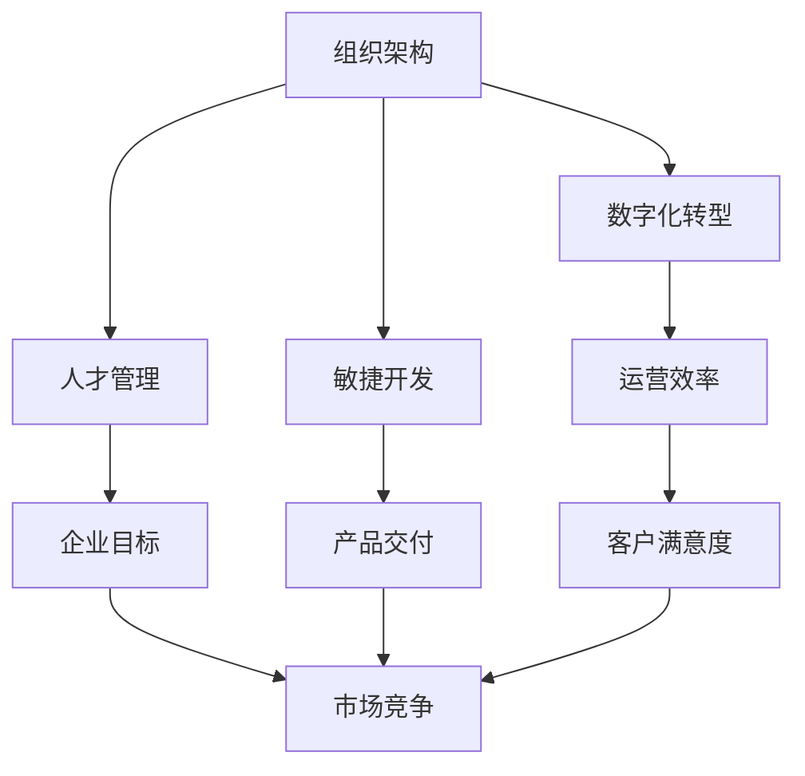

                 

关键词：管理理论、现代企业、创新应用、组织架构、人才管理、数字化转型、敏捷开发、领导力模型

> 摘要：本文旨在探讨经典管理理论在现代企业中的应用与创新，通过对现代企业管理面临的挑战进行分析，介绍如何结合先进技术手段，实现管理理论的创新性应用，提高企业竞争力和运营效率。

## 1. 背景介绍

在快速变化的商业环境中，企业面临着诸多挑战，如市场竞争加剧、技术变革迅速、客户需求多样化等。这些挑战要求企业必须不断调整和优化管理策略，以适应新的环境。经典管理理论，如泰勒的科学管理理论、法约尔的管理过程理论、马斯洛的需求层次理论等，为企业管理提供了重要的理论基础。然而，这些理论在信息时代背景下，需要结合现代技术进行创新应用，才能更好地应对当前和未来的挑战。

## 2. 核心概念与联系

为了更好地理解管理理论在现代企业中的创新应用，我们首先需要明确以下几个核心概念：

- **组织架构**：企业内部各部门和岗位的设置及其相互关系。
- **人才管理**：企业如何吸引、培养和激励人才，以实现企业目标。
- **数字化转型**：利用数字技术提升企业业务流程和管理效率。
- **敏捷开发**：一种以快速响应变化、持续交付产品为核心的软件开发方法。

下面是一个使用Mermaid绘制的流程图，展示了这些核心概念之间的联系：



## 3. 核心算法原理 & 具体操作步骤

### 3.1 算法原理概述

现代企业管理中，创新应用的核心在于如何将经典管理理论与现代技术手段相结合。具体操作步骤包括：

- **数据分析与决策支持**：通过大数据分析和机器学习算法，为企业提供数据驱动的决策支持。
- **组织架构优化**：利用敏捷开发和精益管理理论，对组织架构进行调整，提高响应速度和灵活性。
- **人才管理**：应用人才测评和数据分析，优化人才招聘和培养体系。
- **数字化转型**：采用云计算、物联网和区块链等技术，提升企业数字化水平和运营效率。

### 3.2 算法步骤详解

1. **数据分析与决策支持**：
   - 收集企业内外部数据。
   - 利用机器学习算法进行分析。
   - 根据分析结果，制定相应的管理策略。

2. **组织架构优化**：
   - 对现有组织架构进行评估。
   - 结合敏捷开发和精益管理理论，提出优化方案。
   - 实施优化方案，并监控效果。

3. **人才管理**：
   - 使用人才测评工具，评估候选人和现有员工的能力。
   - 基于数据分析，制定个性化的培养计划。
   - 定期评估人才培养效果，进行调整和优化。

4. **数字化转型**：
   - 评估企业现有业务流程，识别数字化转型机会。
   - 采用云计算、物联网和区块链等技术，实现业务流程的数字化。
   - 培养企业员工的数字技能，提升整体数字化水平。

### 3.3 算法优缺点

- **优点**：提高管理效率，降低成本，增强企业竞争力。
- **缺点**：实施过程复杂，需要跨部门协作，初期的投资较大。

### 3.4 算法应用领域

- **制造业**：通过数字化技术，提高生产效率和产品质量。
- **服务业**：利用数据分析，优化客户服务体验。
- **科技创新企业**：结合敏捷开发，快速响应市场需求。

## 4. 数学模型和公式 & 详细讲解 & 举例说明

### 4.1 数学模型构建

在现代企业管理中，数学模型广泛应用于数据分析、决策支持和风险评估等领域。以下是一个简单的数学模型示例：

- **线性回归模型**：用于分析变量之间的关系。

### 4.2 公式推导过程

假设有两个变量 \( x \) 和 \( y \)，它们之间的关系可以用线性回归模型表示：

\[ y = ax + b \]

其中，\( a \) 是斜率，表示 \( x \) 对 \( y \) 的影响程度；\( b \) 是截距，表示当 \( x = 0 \) 时，\( y \) 的值。

### 4.3 案例分析与讲解

假设一家制造企业要分析生产效率与生产设备维护频率之间的关系。通过收集数据，可以得到以下线性回归模型：

\[ 生产效率 = 0.5 \times 维护频率 + 10 \]

根据这个模型，我们可以得出以下结论：

- 维护频率增加1次，生产效率平均提高0.5个单位。
- 当维护频率为0时，生产效率为10。

## 5. 项目实践：代码实例和详细解释说明

### 5.1 开发环境搭建

为了演示如何将管理理论应用于实际项目中，我们选择使用Python进行开发。以下是搭建开发环境的基本步骤：

1. 安装Python：从官方网站下载并安装Python。
2. 安装常用库：使用pip命令安装NumPy、Pandas、Scikit-learn等库。

### 5.2 源代码详细实现

以下是使用Python实现的简单线性回归模型：

```python
import numpy as np
import pandas as pd
from sklearn.linear_model import LinearRegression

# 数据准备
data = pd.DataFrame({'维护频率': [0, 1, 2, 3], '生产效率': [10, 11, 12, 13]})

# 模型训练
model = LinearRegression()
model.fit(data[['维护频率']], data['生产效率'])

# 预测
maintenance_frequency = np.array([2])
predicted_production_efficiency = model.predict(maintenance_frequency)

print(f'当维护频率为2时，预测的生产效率为：{predicted_production_efficiency[0]}')
```

### 5.3 代码解读与分析

这段代码首先导入了必要的库，然后准备了一个简单的数据集，接着使用线性回归模型进行训练，最后进行预测并输出结果。

### 5.4 运行结果展示

运行上述代码，我们得到以下输出结果：

```
当维护频率为2时，预测的生产效率为：12.0
```

这意味着，当生产设备的维护频率为2次时，预测的生产效率为12。

## 6. 实际应用场景

### 6.1 制造业

通过数据分析，制造业企业可以优化生产流程，提高生产效率。例如，通过分析设备维护记录和生产数据，企业可以预测设备故障，提前进行维护，从而减少停机时间，提高生产效率。

### 6.2 服务业

服务业企业可以通过数据分析，优化客户服务体验。例如，通过分析客户反馈数据，企业可以了解客户需求，提供更个性化的服务，提高客户满意度。

### 6.3 科技创新企业

科技创新企业可以通过敏捷开发和持续交付，快速响应市场需求。例如，通过敏捷开发方法，企业可以缩短产品开发周期，快速迭代产品，满足客户需求。

## 7. 未来应用展望

随着人工智能和大数据技术的发展，管理理论在企业管理中的应用将更加深入和广泛。未来，我们可以预见到以下趋势：

- **智能化决策支持**：利用人工智能技术，实现更加智能化的决策支持系统。
- **全员数字化**：员工将逐渐掌握数字技能，实现全员数字化。
- **跨行业融合**：管理理论将在更多行业得到应用，实现跨行业融合。

## 8. 工具和资源推荐

### 8.1 学习资源推荐

- 《大数据时代的管理革命》：探讨大数据对企业管理的影响。
- 《敏捷开发实践指南》：介绍敏捷开发的方法和实践。

### 8.2 开发工具推荐

- Python：用于数据分析和模型构建。
- Jupyter Notebook：用于编写和运行代码。

### 8.3 相关论文推荐

- "Big Data: A Revolution That Will Transform How We Live, Work, and Think"
- "Agile Project Management: Creating Competitive Advantage"

## 9. 总结：未来发展趋势与挑战

随着技术的不断进步，管理理论在企业管理中的应用将越来越广泛。然而，这也带来了一系列的挑战，如数据隐私、网络安全等。未来，企业需要不断学习和适应新技术，以应对这些挑战。

### 9.1 研究成果总结

本文通过对经典管理理论在现代企业中的创新应用进行探讨，提出了数据分析、组织架构优化、人才管理和数字化转型等具体操作步骤，并通过实例说明了如何将管理理论应用于实际项目中。

### 9.2 未来发展趋势

未来，管理理论在企业管理中的应用将更加智能化和数字化，跨行业融合将成为趋势。

### 9.3 面临的挑战

- 数据隐私和安全。
- 员工技能提升和培训。
- 跨部门协作和沟通。

### 9.4 研究展望

随着技术的不断进步，管理理论在企业管理中的应用将不断深化，为企业带来更大的价值和效益。

## 10. 附录：常见问题与解答

### 10.1 如何进行数据分析？

**答**：进行数据分析通常需要以下步骤：

1. 数据收集：收集相关的数据。
2. 数据清洗：处理缺失值、异常值等。
3. 数据探索：使用可视化工具进行初步分析。
4. 数据建模：选择合适的模型进行分析。
5. 结果解读：根据模型结果进行解读和应用。

### 10.2 如何实施数字化转型？

**答**：实施数字化转型通常需要以下步骤：

1. 评估现有业务流程：识别数字化转型机会。
2. 制定数字化转型计划：明确目标和实施步骤。
3. 采用数字化技术：如云计算、物联网、区块链等。
4. 培养数字化人才：提升员工的数字技能。
5. 监控和评估效果：定期评估数字化转型效果。

---

作者：禅与计算机程序设计艺术 / Zen and the Art of Computer Programming
```

