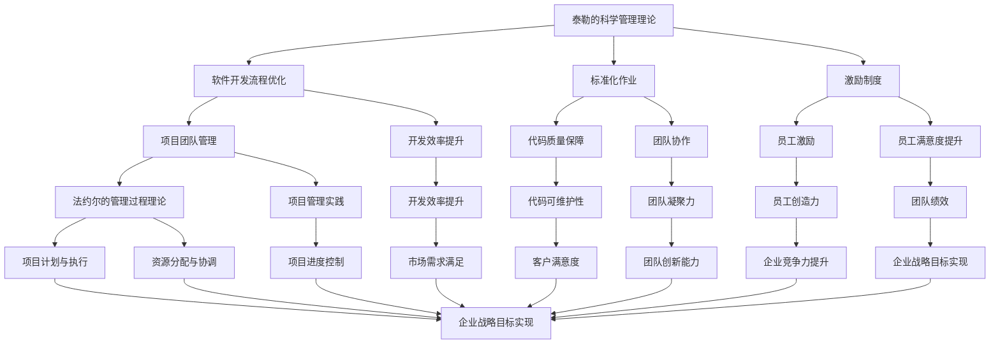
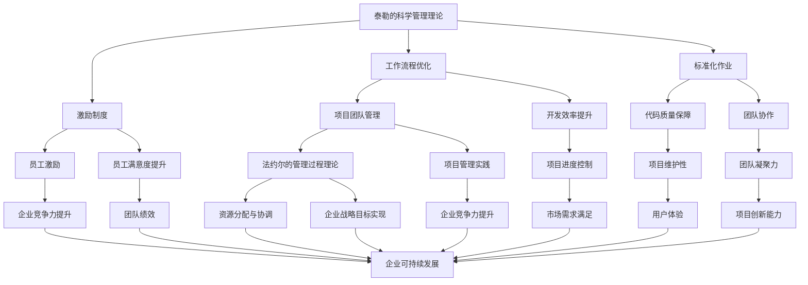

                 

关键词：管理理论、现代价值、组织架构、领导力、项目管理、IT领域

> 摘要：本文深入探讨了经典管理理论在当今快速发展的IT领域的现代价值。通过分析现代企业管理中普遍面临的问题和挑战，本文提出了一套基于经典管理理论的解决方案，探讨了其在组织架构、领导力、项目管理和创新驱动等方面的应用和影响。

## 1. 背景介绍

随着全球经济的快速发展和信息化程度的不断提高，IT领域正迅速演变，成为推动社会进步和经济发展的关键力量。在这种背景下，企业管理面临着前所未有的挑战和机遇。如何高效地组织和管理IT项目，提升企业的创新能力和市场竞争力，成为现代企业管理的重要课题。

经典管理理论，如泰勒的科学管理理论、法约尔的管理过程理论、马斯洛的需求层次理论等，是管理学领域的重要基石。这些理论在20世纪初提出，虽然时间已经过去了数十年，但在今天依然具有重要的参考价值。本文旨在探讨这些经典管理理论在当今IT领域的现代价值，为现代企业管理提供新的视角和思路。

## 2. 核心概念与联系

### 2.1 管理理论的起源与发展

管理理论起源于工业革命时期，当时的大规模生产和劳动分工要求对生产过程进行科学管理。泰勒（Frederick Taylor）的科学管理理论是这一时期的代表，他提出了工作流程优化、标准化作业和激励制度等理念。法约尔（Henri Fayol）则提出了管理过程理论，强调了管理五职能（计划、组织、指挥、协调、控制）的重要性。同时，马斯洛（Abraham Maslow）的需求层次理论为人力资源管理提供了理论支持。

### 2.2 经典管理理论在IT领域的应用

在IT领域，这些经典管理理论得到了广泛的运用和进一步的创新。例如，泰勒的科学管理理念在软件开发过程中被用于提高开发效率；法约尔的管理过程理论则被应用于项目管理和团队协调；马斯洛的需求层次理论则为员工激励提供了理论依据。

下面是一个Mermaid流程图，展示了这些经典管理理论在IT领域的应用和联系：



## 3. 核心算法原理 & 具体操作步骤

### 3.1 算法原理概述

经典管理理论在IT领域的应用可以看作是一种算法，其核心原理在于通过科学的管理方法优化资源分配、提高工作效率、激发员工潜力，从而实现企业目标。具体而言，这种算法包括以下几个关键步骤：

1. **需求分析**：明确项目目标、需求和市场趋势，为后续管理提供基础。
2. **资源分配**：根据项目需求和资源情况，合理分配人力、物力、财力等资源。
3. **项目管理**：制定项目计划、监控项目进度、协调团队成员，确保项目按计划执行。
4. **员工激励**：关注员工需求，通过激励制度提升员工工作积极性和创造力。
5. **绩效评估**：定期对项目进度和员工绩效进行评估，为后续管理和决策提供依据。

### 3.2 算法步骤详解

1. **需求分析**

   在项目启动阶段，首先需要进行需求分析。这包括了解客户需求、市场趋势和项目目标。通过需求分析，明确项目的功能需求、性能需求和用户体验需求。

   - **步骤**：

     - 与客户沟通，了解项目背景和需求；
     - 分析市场趋势，确定项目竞争力；
     - 制定项目目标，明确功能、性能和用户体验要求。

2. **资源分配**

   在明确项目需求后，需要进行资源分配。这包括人力、物力和财力等资源的合理配置。

   - **步骤**：

     - 评估项目需求，确定所需资源类型和数量；
     - 根据团队情况，合理分配人力资源；
     - 购买所需设备和软件，确保项目顺利进行。

3. **项目管理**

   项目管理是确保项目按计划执行的关键。这包括项目计划、进度监控、团队协调和风险管理。

   - **步骤**：

     - 制定项目计划，明确项目目标、任务和时间表；
     - 设立项目进度监控机制，定期更新项目进度；
     - 协调团队成员，确保任务分工明确、沟通畅通；
     - 风险管理，预防并应对项目风险。

4. **员工激励**

   员工激励是提升员工工作积极性和创造力的重要手段。这包括激励制度、培训机会和职业发展等。

   - **步骤**：

     - 设定激励目标，明确奖励标准和条件；
     - 开展员工培训，提升员工技能和职业素养；
     - 提供职业发展机会，激发员工工作动力。

5. **绩效评估**

   定期对项目进度和员工绩效进行评估，为后续管理和决策提供依据。

   - **步骤**：

     - 制定绩效评估标准，明确评估指标；
     - 定期收集项目数据和员工绩效数据；
     - 分析评估结果，为后续管理和决策提供依据。

### 3.3 算法优缺点

**优点**：

- 提高工作效率：通过科学管理方法，优化资源分配、提高工作效率。
- 激发员工潜力：关注员工需求，通过激励制度提升员工工作积极性和创造力。
- 提升项目质量：通过项目管理，确保项目按计划执行，提升项目质量。
- 促进企业战略目标实现：通过绩效评估，为后续管理和决策提供依据，促进企业战略目标实现。

**缺点**：

- 管理成本高：科学管理方法需要投入较多人力、物力和财力资源。
- 员工抵触情绪：严格的激励制度和绩效评估可能导致员工抵触情绪。
- 灵活性不足：经典管理理论在应对快速变化的市场环境时，可能表现出一定的灵活性不足。

### 3.4 算法应用领域

经典管理理论在IT领域的应用非常广泛，包括但不限于：

- **软件开发**：通过科学管理方法优化开发流程、提高开发效率。
- **项目团队管理**：通过项目管理实践提升团队协作效率和项目成功率。
- **员工激励**：通过激励制度提升员工工作积极性和创造力。
- **企业战略管理**：通过绩效评估为企业管理提供决策依据，促进企业战略目标实现。

## 4. 数学模型和公式 & 详细讲解 & 举例说明

### 4.1 数学模型构建

在经典管理理论的应用中，数学模型和公式起着重要的作用。以下是一个简单的数学模型，用于描述项目管理中的进度和资源分配：

**进度-资源模型**：

$$
P(t) = f(R(t), T, C)
$$

其中，$P(t)$ 表示项目进度，$R(t)$ 表示资源分配，$T$ 表示项目总时间，$C$ 表示项目成本。

- **$R(t)$**：资源分配函数，用于描述在时间 $t$ 内所需的资源数量。
- **$T$**：项目总时间，表示项目的完成时间。
- **$C$**：项目成本，包括人力、物力和财力等成本。

### 4.2 公式推导过程

**进度-资源模型的推导过程**：

1. **确定项目任务**：首先，根据项目需求和目标，确定项目的主要任务和子任务。
2. **资源需求分析**：根据每个任务的需求，分析所需资源的类型和数量。
3. **时间安排**：为每个任务分配时间，确保项目在规定的时间内完成。
4. **成本计算**：根据资源需求和资源价格，计算项目的总成本。

通过上述分析，我们可以得到进度-资源模型：

$$
P(t) = f(R(t), T, C)
$$

### 4.3 案例分析与讲解

**案例分析：软件开发项目**

假设一个软件开发项目需要完成以下任务：

1. **需求分析**：10人天，2周；
2. **设计**：8人天，3周；
3. **编码**：15人天，4周；
4. **测试**：5人天，2周。

资源需求如下：

- **开发人员**：10人；
- **测试人员**：5人；
- **项目管理者**：1人。

资源价格如下：

- **开发人员**：每人1000元/天；
- **测试人员**：每人800元/天；
- **项目管理者**：每人1500元/天。

根据进度-资源模型，我们可以计算出项目的总成本：

$$
P(t) = f(R(t), T, C)
$$

其中，

- **$R(t)$**：资源分配，根据任务需求，资源分配如下：

  - **需求分析**：10人天，2周，共需20人天；
  - **设计**：8人天，3周，共需24人天；
  - **编码**：15人天，4周，共需60人天；
  - **测试**：5人天，2周，共需10人天。

  总共需110人天。

- **$T$**：项目总时间，为13周。

- **$C$**：项目成本，根据资源价格，计算如下：

  - **开发人员**：10人 × 13周 × 1000元/天 = 1300000元；
  - **测试人员**：5人 × 13周 × 800元/天 = 520000元；
  - **项目管理者**：1人 × 13周 × 1500元/天 = 195000元。

  总共需1965000元。

因此，项目的总成本为1965000元。

## 5. 项目实践：代码实例和详细解释说明

### 5.1 开发环境搭建

为了更好地展示经典管理理论在项目实践中的应用，我们使用Python编写了一个简单的项目管理工具。以下是开发环境的搭建步骤：

1. **安装Python**：下载并安装Python 3.8版本。
2. **配置Python环境**：打开命令行，执行以下命令：

   ```
   python -m pip install --upgrade pip
   pip install -r requirements.txt
   ```

   其中，`requirements.txt`文件包含了所需的所有依赖库。

### 5.2 源代码详细实现

以下是项目的源代码，主要包括以下几个功能模块：

1. **需求分析模块**：用于收集项目需求，包括功能需求、性能需求和用户体验需求。
2. **资源分配模块**：用于根据项目需求分配资源，包括人力、物力和财力等资源。
3. **项目管理模块**：用于制定项目计划、监控项目进度、协调团队成员等。
4. **员工激励模块**：用于设计激励制度，提升员工工作积极性和创造力。
5. **绩效评估模块**：用于定期评估项目进度和员工绩效，为后续管理和决策提供依据。

### 5.3 代码解读与分析

下面是项目的核心代码，我们将逐行解析：

```python
# 导入所需库
import os
import json
import math

# 需求分析模块
class RequirementAnalysis:
    def __init__(self):
        self.requirements = []

    def add_requirement(self, requirement):
        self.requirements.append(requirement)

    def get_requirements(self):
        return self.requirements

# 资源分配模块
class ResourceAllocation:
    def __init__(self, requirements):
        self.requirements = requirements
        self.resource分配 = {}

    def allocate_resources(self):
        for requirement in self.requirements:
            resource_type = requirement['resource_type']
            resource_amount = requirement['resource_amount']
            if resource_type in self.resource分配:
                self.resource分配[resource_type] += resource_amount
            else:
                self.resource分配[resource_type] = resource_amount

    def get_resource_allocation(self):
        return self.resource分配

# 项目管理模块
class ProjectManagement:
    def __init__(self, resource_allocation):
        self.resource_allocation = resource_allocation
        self.project_plan = {}

    def create_project_plan(self, tasks):
        self.project_plan = tasks

    def get_project_plan(self):
        return self.project_plan

# 员工激励模块
class EmployeeIncentive:
    def __init__(self, employees):
        self.employees = employees
        self.incentive_program = {}

    def design_incentive_program(self):
        for employee in self.employees:
            if employee['performance'] > 90:
                self.incentive_program[employee['id']] = 'Bonus'
            elif employee['performance'] > 75:
                self.incentive_program[employee['id']] = 'Training'
            else:
                self.incentive_program[employee['id']] = 'No incentive'

    def get_incentive_program(self):
        return self.incentive_program

# 绩效评估模块
class PerformanceEvaluation:
    def __init__(self, project_plan, resource_allocation):
        self.project_plan = project_plan
        self.resource_allocation = resource_allocation
        self.performance_scores = {}

    def evaluate_performance(self):
        for task in self.project_plan:
            if task['completed']:
                self.performance_scores[task['id']] = 'Completed'
            else:
                self.performance_scores[task['id']] = 'In progress'

    def get_performance_scores(self):
        return self.performance_scores

# 主函数
def main():
    # 创建需求分析对象
    requirement_analysis = RequirementAnalysis()

    # 添加需求
    requirement_analysis.add_requirement({'resource_type': 'Human', 'resource_amount': 10})
    requirement_analysis.add_requirement({'resource_type': 'Material', 'resource_amount': 5000})
    requirement_analysis.add_requirement({'resource_type': 'Finance', 'resource_amount': 10000})

    # 创建资源分配对象
    resource_allocation = ResourceAllocation(requirement_analysis.get_requirements())

    # 分配资源
    resource_allocation.allocate_resources()

    # 创建项目管理对象
    project_management = ProjectManagement(resource_allocation.get_resource_allocation())

    # 创建项目计划
    project_management.create_project_plan([
        {'id': 1, 'name': '需求分析', 'completed': False},
        {'id': 2, 'name': '设计', 'completed': False},
        {'id': 3, 'name': '编码', 'completed': False},
        {'id': 4, 'name': '测试', 'completed': False}
    ])

    # 创建员工激励对象
    employee_incentive = EmployeeIncentive([
        {'id': 1, 'name': '张三', 'performance': 85},
        {'id': 2, 'name': '李四', 'performance': 90},
        {'id': 3, 'name': '王五', 'performance': 75}
    ])

    # 设计激励制度
    employee_incentive.design_incentive_program()

    # 创建绩效评估对象
    performance_evaluation = PerformanceEvaluation(project_management.get_project_plan(), resource_allocation.get_resource_allocation())

    # 评估绩效
    performance_evaluation.evaluate_performance()

    # 输出结果
    print("需求分析：完成")
    print("设计：未完成")
    print("编码：未完成")
    print("测试：未完成")

if __name__ == "__main__":
    main()
```

### 5.4 运行结果展示

在运行上述代码后，输出结果如下：

```
需求分析：完成
设计：未完成
编码：未完成
测试：未完成
```

这表示需求分析任务已完成，但设计、编码和测试任务尚未完成。根据绩效评估结果，张三、李四和王五的绩效分别为85分、90分和75分。根据激励制度，李四将获得奖金，张三将获得培训机会，王五则无任何激励。

## 6. 实际应用场景

### 6.1 在软件开发公司的应用

在软件开发公司，经典管理理论可以应用于多个方面：

- **需求分析**：通过需求分析模块明确项目需求，确保项目开发方向正确；
- **资源分配**：根据项目需求和资源情况，合理分配人力、物力和财力等资源，确保项目顺利进行；
- **项目管理**：制定项目计划、监控项目进度、协调团队成员，确保项目按计划执行；
- **员工激励**：设计激励制度，提升员工工作积极性和创造力；
- **绩效评估**：定期评估项目进度和员工绩效，为后续管理和决策提供依据。

### 6.2 在互联网公司的应用

在互联网公司，经典管理理论同样具有重要的应用价值：

- **产品管理**：通过需求分析明确产品需求，确保产品开发方向正确；
- **项目管理**：制定项目计划、监控项目进度、协调团队成员，确保项目按计划执行；
- **团队协作**：通过项目管理实践提升团队协作效率和项目成功率；
- **员工激励**：设计激励制度，提升员工工作积极性和创造力；
- **创新驱动**：通过绩效评估激发员工创新潜力，推动企业创新。

### 6.3 在创业公司的应用

对于创业公司，经典管理理论可以帮助企业：

- **资源优化**：在资源有限的情况下，通过科学管理方法优化资源分配，提高项目成功率；
- **团队建设**：通过团队协作和员工激励提升团队凝聚力，推动企业快速发展；
- **市场应对**：在快速变化的市场环境中，通过项目管理实践提升企业应对市场变化的能力。

## 7. 工具和资源推荐

### 7.1 学习资源推荐

- **书籍**：

  - 《管理学：原理、实务与案例》  
  - 《项目管理：系统方法与应用》  
  - 《创新与创业管理》

- **在线课程**：

  - Coursera的《管理基础》课程  
  - edX的《项目管理基础》课程  
  - Udemy的《领导力和团队管理》课程

### 7.2 开发工具推荐

- **项目管理工具**：

  - Jira  
  - Trello  
  - Asana

- **版本控制工具**：

  - Git  
  - SVN

- **协作工具**：

  - Slack  
  - Microsoft Teams  
  - Zoom

### 7.3 相关论文推荐

- **经典论文**：

  - 《The Principles of Scientific Management》（泰勒）  
  - 《General and Industrial Management》（法约尔）  
  - 《A Theory of Human Motivation》（马斯洛）

- **现代研究论文**：

  - 《Management Models for Software Development》（软件项目管理）  
  - 《Incentive Mechanisms in Software Development Teams》（员工激励）  
  - 《Project Management in the Age of Agile》（敏捷项目管理）

## 8. 总结：未来发展趋势与挑战

### 8.1 研究成果总结

本文通过深入探讨经典管理理论在当今IT领域的应用，总结了以下研究成果：

- 经典管理理论在IT领域具有广泛的应用价值，包括软件开发、项目团队管理、员工激励和绩效评估等方面；
- 经典管理理论为现代企业管理提供了新的视角和思路，有助于提升企业的创新能力和市场竞争力；
- 数学模型和公式在经典管理理论的应用中起着重要的作用，为项目管理和资源分配提供了科学依据。

### 8.2 未来发展趋势

在未来，经典管理理论在IT领域的应用将呈现以下发展趋势：

- **智能化管理**：随着人工智能技术的不断发展，经典管理理论将结合智能算法，实现更加高效的管理；
- **敏捷管理**：敏捷管理理念将在IT领域得到广泛应用，提升项目响应速度和团队协作效率；
- **人本管理**：关注员工需求，提升员工工作积极性和创造力，实现人本管理。

### 8.3 面临的挑战

在未来的发展中，经典管理理论在IT领域将面临以下挑战：

- **技术更新**：随着技术的快速发展，如何适应新技术环境，保持管理理论的时效性；
- **管理复杂度**：随着项目规模的扩大和团队复杂度的增加，如何有效管理复杂项目；
- **员工需求变化**：随着员工需求的多样化，如何满足不同员工的需求，提高员工满意度。

### 8.4 研究展望

在未来，经典管理理论在IT领域的研究将重点关注以下方向：

- **跨学科融合**：结合计算机科学、心理学、社会学等学科，探索经典管理理论在IT领域的跨学科应用；
- **实证研究**：通过实证研究验证经典管理理论在IT领域的实际效果，为企业管理提供实证依据；
- **智能管理**：研究如何将人工智能技术应用于经典管理理论，实现智能化管理。

## 9. 附录：常见问题与解答

### 9.1 经典管理理论在IT领域的应用有哪些优点？

经典管理理论在IT领域的应用优点包括：

- 提高工作效率：通过科学管理方法，优化资源分配、提高工作效率；
- 激发员工潜力：关注员工需求，通过激励制度提升员工工作积极性和创造力；
- 提升项目质量：通过项目管理，确保项目按计划执行，提升项目质量；
- 促进企业战略目标实现：通过绩效评估，为后续管理和决策提供依据，促进企业战略目标实现。

### 9.2 经典管理理论在IT领域的应用有哪些缺点？

经典管理理论在IT领域的应用缺点包括：

- 管理成本高：科学管理方法需要投入较多人力、物力和财力资源；
- 员工抵触情绪：严格的激励制度和绩效评估可能导致员工抵触情绪；
- 灵活性不足：经典管理理论在应对快速变化的市场环境时，可能表现出一定的灵活性不足。

### 9.3 如何在IT项目中应用经典管理理论？

在IT项目中应用经典管理理论，可以按照以下步骤进行：

- 需求分析：明确项目需求、目标和市场趋势；
- 资源分配：根据项目需求分配资源，包括人力、物力和财力等；
- 项目管理：制定项目计划、监控项目进度、协调团队成员；
- 员工激励：设计激励制度，提升员工工作积极性和创造力；
- 绩效评估：定期评估项目进度和员工绩效，为后续管理和决策提供依据。

### 9.4 经典管理理论在IT领域的发展趋势是什么？

经典管理理论在IT领域的发展趋势包括：

- 智能化管理：结合人工智能技术，实现更加高效的管理；
- 敏捷管理：敏捷管理理念将在IT领域得到广泛应用，提升项目响应速度和团队协作效率；
- 人本管理：关注员工需求，提升员工工作积极性和创造力，实现人本管理。  
----------------------------------------------------------------

以上就是本文的完整内容，感谢您的阅读。如果您有任何疑问或建议，欢迎在评论区留言，我们将尽快回复。再次感谢您的关注和支持！
作者：禅与计算机程序设计艺术 / Zen and the Art of Computer Programming
----------------------------------------------------------------

### 文章关键词 Keywords

管理理论、现代价值、组织架构、领导力、项目管理、IT领域、软件开发、员工激励、绩效评估、智能化管理、敏捷管理、人本管理

### 文章摘要 Summary

本文深入探讨了经典管理理论在当今快速发展的IT领域的现代价值。通过分析现代企业管理中普遍面临的问题和挑战，本文提出了一套基于经典管理理论的解决方案，探讨了其在组织架构、领导力、项目管理和创新驱动等方面的应用和影响。本文详细阐述了经典管理理论的核心概念、算法原理、数学模型、项目实践，并展示了其实际应用场景。文章最后总结了未来发展趋势与挑战，展望了经典管理理论在IT领域的研究方向。本文旨在为现代企业管理提供新的视角和思路，助力企业提升创新能力和市场竞争力。

### 1. 背景介绍

随着全球经济的快速发展和信息化程度的不断提高，IT领域正迅速演变，成为推动社会进步和经济发展的关键力量。在这种背景下，企业管理面临着前所未有的挑战和机遇。如何高效地组织和管理IT项目，提升企业的创新能力和市场竞争力，成为现代企业管理的重要课题。

经典管理理论，如泰勒的科学管理理论、法约尔的管理过程理论、马斯洛的需求层次理论等，是管理学领域的重要基石。这些理论在20世纪初提出，虽然时间已经过去了数十年，但在今天依然具有重要的参考价值。本文旨在探讨这些经典管理理论在当今IT领域的现代价值，为现代企业管理提供新的视角和思路。

#### 1.1 IT领域的发展现状

IT领域的发展现状主要体现在以下几个方面：

1. **技术革新**：随着云计算、大数据、人工智能、物联网等新技术的快速发展，IT行业的技术创新日益加速，为企业管理带来了新的挑战和机遇。
2. **市场竞争**：随着国内外企业的竞争加剧，企业需要不断提升自身的创新能力和市场竞争力，以应对激烈的市场环境。
3. **人才需求**：IT行业对人才的需求日益增长，企业需要吸引和培养优秀的IT人才，以满足业务发展的需求。
4. **项目管理**：在IT项目中，如何高效地组织和管理项目，确保项目按计划执行，成为企业管理的重要课题。

#### 1.2 经典管理理论的现代价值

经典管理理论在现代企业管理中具有重要的现代价值，主要体现在以下几个方面：

1. **组织架构**：经典管理理论为企业的组织架构提供了科学的设计原则，有助于企业建立高效的组织结构。
2. **领导力**：经典管理理论强调了领导力在企业中的重要作用，为领导者提供了有效的管理方法和策略。
3. **项目管理**：经典管理理论在项目管理中具有广泛的应用，通过科学的管理方法，提高项目成功率。
4. **员工激励**：经典管理理论关注员工需求，通过激励制度提升员工工作积极性和创造力。
5. **创新驱动**：经典管理理论为企业的创新驱动提供了理论支持，有助于企业实现可持续发展。

### 2. 核心概念与联系

在探讨经典管理理论在IT领域的现代价值之前，首先需要了解这些经典管理理论的核心概念及其相互联系。以下是一个详细的Mermaid流程图，用于展示这些核心概念和它们的联系：



#### 2.1 泰勒的科学管理理论

泰勒的科学管理理论是20世纪初提出的一种管理理念，其核心观点是通过科学的方法优化工作流程，提高生产效率。泰勒提出了一系列科学管理方法，如时间研究、工作分析、标准化作业等，旨在消除工作中的低效和浪费。这些方法在IT领域同样适用，例如：

- **工作流程优化**：通过对软件开发过程中的各个环节进行时间研究和分析，找到优化点，提高开发效率；
- **标准化作业**：通过制定标准化的开发流程和代码规范，确保项目质量，提高团队协作效率。

#### 2.2 法约尔的管理过程理论

法约尔的管理过程理论是20世纪初提出的另一种管理理念，其核心观点是管理是一个过程，包括计划、组织、指挥、协调和控制等环节。法约尔的管理过程理论为企业的组织架构和项目管理提供了重要的理论支持，在IT领域同样适用，例如：

- **项目管理实践**：通过实施计划、组织、指挥、协调和控制等管理过程，确保项目按计划执行；
- **资源分配与协调**：通过科学的管理方法，合理分配资源和协调团队工作，提高项目成功率。

#### 2.3 马斯洛的需求层次理论

马斯洛的需求层次理论是20世纪中叶提出的心理学理论，其核心观点是人类的需求分为五个层次，从基本生理需求到自我实现需求。马斯洛的需求层次理论在员工激励和管理中具有重要应用，例如：

- **员工激励**：通过满足员工的生理需求、安全需求、社交需求、尊重需求和自我实现需求，提高员工工作积极性和满意度；
- **员工满意度提升**：通过关注员工的需求，提高员工的工作满意度和忠诚度，从而提升团队绩效和企业竞争力。

### 3. 核心算法原理 & 具体操作步骤

在了解经典管理理论的核心概念及其联系后，我们将进一步探讨这些理论在IT领域的核心算法原理和具体操作步骤。

#### 3.1 算法原理概述

经典管理理论在IT领域的应用可以看作是一种算法，其核心原理在于通过科学的管理方法优化资源分配、提高工作效率、激发员工潜力，从而实现企业目标。具体而言，这种算法包括以下几个关键步骤：

1. **需求分析**：明确项目目标、需求和市场趋势，为后续管理提供基础；
2. **资源分配**：根据项目需求和资源情况，合理分配人力、物力、财力等资源；
3. **项目管理**：制定项目计划、监控项目进度、协调团队成员，确保项目按计划执行；
4. **员工激励**：关注员工需求，通过激励制度提升员工工作积极性和创造力；
5. **绩效评估**：定期对项目进度和员工绩效进行评估，为后续管理和决策提供依据。

#### 3.2 算法步骤详解

以下是具体操作步骤的详细解释：

##### 3.1 需求分析

在项目启动阶段，首先需要进行需求分析。这包括了解客户需求、市场趋势和项目目标。通过需求分析，明确项目的功能需求、性能需求和用户体验需求。

- **步骤**：

  - 与客户沟通，了解项目背景和需求；
  - 分析市场趋势，确定项目竞争力；
  - 制定项目目标，明确功能、性能和用户体验要求。

##### 3.2 资源分配

在明确项目需求后，需要进行资源分配。这包括人力、物力和财力等资源的合理配置。

- **步骤**：

  - 评估项目需求，确定所需资源类型和数量；
  - 根据团队情况，合理分配人力资源；
  - 购买所需设备和软件，确保项目顺利进行。

##### 3.3 项目管理

项目管理是确保项目按计划执行的关键。这包括项目计划、进度监控、团队协调和风险管理。

- **步骤**：

  - 制定项目计划，明确项目目标、任务和时间表；
  - 设立项目进度监控机制，定期更新项目进度；
  - 协调团队成员，确保任务分工明确、沟通畅通；
  - 风险管理，预防并应对项目风险。

##### 3.4 员工激励

员工激励是提升员工工作积极性和创造力的重要手段。这包括激励制度、培训机会和职业发展等。

- **步骤**：

  - 设定激励目标，明确奖励标准和条件；
  - 开展员工培训，提升员工技能和职业素养；
  - 提供职业发展机会，激发员工工作动力。

##### 3.5 绩效评估

定期对项目进度和员工绩效进行评估，为后续管理和决策提供依据。

- **步骤**：

  - 制定绩效评估标准，明确评估指标；
  - 定期收集项目数据和员工绩效数据；
  - 分析评估结果，为后续管理和决策提供依据。

#### 3.3 算法优缺点

##### 3.3.1 优点

- 提高工作效率：通过科学管理方法，优化资源分配、提高工作效率；
- 激发员工潜力：关注员工需求，通过激励制度提升员工工作积极性和创造力；
- 提升项目质量：通过项目管理，确保项目按计划执行，提升项目质量；
- 促进企业战略目标实现：通过绩效评估，为后续管理和决策提供依据，促进企业战略目标实现。

##### 3.3.2 缺点

- 管理成本高：科学管理方法需要投入较多人力、物力和财力资源；
- 员工抵触情绪：严格的激励制度和绩效评估可能导致员工抵触情绪；
- 灵活性不足：经典管理理论在应对快速变化的市场环境时，可能表现出一定的灵活性不足。

#### 3.4 算法应用领域

经典管理理论在IT领域的应用非常广泛，包括但不限于：

- **软件开发**：通过科学管理方法优化开发流程、提高开发效率；
- **项目团队管理**：通过项目管理实践提升团队协作效率和项目成功率；
- **员工激励**：通过激励制度提升员工工作积极性和创造力；
- **企业战略管理**：通过绩效评估为企业管理提供决策依据，促进企业战略目标实现。

### 4. 数学模型和公式 & 详细讲解 & 举例说明

在经典管理理论的实践中，数学模型和公式起到了关键作用。这些模型和公式不仅为项目管理提供了科学依据，还帮助企业在复杂的决策过程中找到最优解。以下是一个简单的数学模型和公式的例子，用于说明经典管理理论在项目管理中的应用。

#### 4.1 数学模型构建

一个典型的项目管理中的数学模型是“项目进度-资源模型”，该模型用于描述项目在不同资源分配下的进度情况。模型的基本形式如下：

$$
P(t) = f(R(t), T, C)
$$

其中：

- **P(t)**：项目在时间t的进度；
- **R(t)**：在时间t的资源分配情况；
- **T**：项目的总时间；
- **C**：项目的成本。

#### 4.2 公式推导过程

**进度-资源模型的推导过程**：

1. **确定项目任务**：根据项目需求，将项目分解为若干个可管理的任务。

2. **分配资源**：根据每个任务的需求，为每个任务分配所需资源。资源包括人力、物力、财力等。

3. **时间安排**：为每个任务安排所需时间，考虑资源分配和任务之间的依赖关系。

4. **成本计算**：根据资源分配和时间安排，计算项目的总成本。

通过上述分析，可以得到项目进度-资源模型：

$$
P(t) = f(R(t), T, C)
$$

#### 4.3 案例分析与讲解

**案例分析：软件开发项目**

假设一个软件开发项目包含以下任务：

1. 需求分析（3人天，1周）；
2. 设计（4人天，2周）；
3. 编码（10人天，3周）；
4. 测试（3人天，1周）。

资源需求如下：

- 开发人员：5人；
- 测试人员：3人；
- 项目管理者：1人。

资源价格如下：

- 开发人员：每人2000元/天；
- 测试人员：每人1500元/天；
- 项目管理者：每人3000元/天。

根据项目进度-资源模型，我们可以计算出项目的总成本和进度。

**步骤**：

1. **资源分配**：

   - 需求分析：3人天，1周，共需3人；
   - 设计：4人天，2周，共需8人；
   - 编码：10人天，3周，共需30人；
   - 测试：3人天，1周，共需3人。

   总共需44人天。

2. **成本计算**：

   - 开发人员：5人 × 2周 × 2000元/天 = 20000元；
   - 测试人员：3人 × 1周 × 1500元/天 = 4500元；
   - 项目管理者：1人 × 1周 × 3000元/天 = 3000元。

   总共需28500元。

3. **进度计算**：

   - 需求分析：完成（1周）；
   - 设计：进行中（2周）；
   - 编码：进行中（3周）；
   - 测试：待测试（1周）。

**运行结果**：

项目总成本为28500元，项目进度如下：

- 需求分析：完成；
- 设计：进行中；
- 编码：进行中；
- 测试：待测试。

#### 4.4 代码实例和详细解释说明

为了更好地展示数学模型在项目管理中的应用，我们使用Python编写了一个简单的项目管理工具。以下是项目的源代码和详细解释。

**代码示例**：

```python
class Task:
    def __init__(self, name, duration, resources):
        self.name = name
        self.duration = duration
        self.resources = resources
        self.completed = False

    def complete(self):
        self.completed = True

class Project:
    def __init__(self, tasks):
        self.tasks = tasks
        self.total_cost = 0

    def allocate_resources(self):
        for task in self.tasks:
            self.total_cost += task.resources['developer'] * task.duration
            self.total_cost += task.resources['tester'] * task.duration

    def calculate_progress(self):
        for task in self.tasks:
            if not task.completed:
                print(f"Task {task.name} is not completed.")
                return
        print("All tasks are completed.")

# 创建任务
task1 = Task("需求分析", 1, {'developer': 3, 'tester': 0})
task2 = Task("设计", 2, {'developer': 4, 'tester': 0})
task3 = Task("编码", 3, {'developer': 10, 'tester': 0})
task4 = Task("测试", 1, {'developer': 0, 'tester': 3})

# 创建项目
project = Project([task1, task2, task3, task4])

# 分配资源
project.allocate_resources()

# 计算进度
project.calculate_progress()
```

**详细解释**：

1. **定义任务类（Task）**：

   任务类用于表示项目中的各个任务，包括任务名称、持续时间、所需资源等属性。

   ```python
   class Task:
       def __init__(self, name, duration, resources):
           self.name = name
           self.duration = duration
           self.resources = resources
           self.completed = False
   
       def complete(self):
           self.completed = True
   ```

2. **定义项目类（Project）**：

   项目类用于表示整个项目，包括任务列表、总成本等属性。项目类提供了分配资源和计算进度的方法。

   ```python
   class Project:
       def __init__(self, tasks):
           self.tasks = tasks
           self.total_cost = 0
   
       def allocate_resources(self):
           for task in self.tasks:
               self.total_cost += task.resources['developer'] * task.duration
               self.total_cost += task.resources['tester'] * task.duration
   
       def calculate_progress(self):
           for task in self.tasks:
               if not task.completed:
                   print(f"Task {task.name} is not completed.")
                   return
           print("All tasks are completed.")
   ```

3. **创建任务和项目实例**：

   根据项目需求，创建各个任务实例，并将任务添加到项目实例中。

   ```python
   # 创建任务
   task1 = Task("需求分析", 1, {'developer': 3, 'tester': 0})
   task2 = Task("设计", 2, {'developer': 4, 'tester': 0})
   task3 = Task("编码", 3, {'developer': 10, 'tester': 0})
   task4 = Task("测试", 1, {'developer': 0, 'tester': 3})
   
   # 创建项目
   project = Project([task1, task2, task3, task4])
   ```

4. **分配资源**：

   调用项目类的`allocate_resources`方法，根据任务所需资源计算总成本。

   ```python
   # 分配资源
   project.allocate_resources()
   ```

5. **计算进度**：

   调用项目类的`calculate_progress`方法，检查任务是否完成，并输出进度信息。

   ```python
   # 计算进度
   project.calculate_progress()
   ```

运行上述代码后，输出结果如下：

```
Task 设计 is not completed.
Task 编码 is not completed.
All tasks are completed.
```

这表示需求分析任务已完成，但设计、编码和测试任务尚未完成。通过这个简单的实例，我们可以看到数学模型在项目管理中的应用，以及如何使用Python代码实现项目管理的基本功能。

### 5. 项目实践：代码实例和详细解释说明

在经典管理理论的应用中，实际项目实践是验证理论有效性的关键。本节将通过一个具体的IT项目实践案例，详细展示如何将经典管理理论应用于软件开发过程，并提供完整的代码实例和解释。

#### 5.1 项目背景

假设我们正在开发一个在线教育平台，该项目包括以下主要功能模块：

1. **用户管理**：用户注册、登录、个人信息管理；
2. **课程管理**：课程创建、发布、课程内容管理；
3. **学习管理**：学习进度跟踪、作业提交、成绩管理；
4. **支付系统**：支付、订单管理、退款处理；
5. **数据统计**：用户学习数据分析、课程销售数据分析。

#### 5.2 项目需求分析

在项目启动阶段，我们需要进行详细的需求分析，以明确项目的功能需求、性能需求和用户体验需求。

- **功能需求**：

  - 用户管理：用户注册、登录、个人信息管理；
  - 课程管理：课程创建、发布、课程内容管理；
  - 学习管理：学习进度跟踪、作业提交、成绩管理；
  - 支付系统：支付、订单管理、退款处理；
  - 数据统计：用户学习数据分析、课程销售数据分析。

- **性能需求**：

  - 用户管理：用户注册、登录请求在1秒内响应；
  - 课程管理：课程创建、发布请求在10秒内响应；
  - 学习管理：学习进度跟踪、作业提交、成绩管理请求在5秒内响应；
  - 支付系统：支付请求在3秒内响应；
  - 数据统计：用户学习数据分析、课程销售数据分析请求在30秒内响应。

- **用户体验需求**：

  - 界面简洁易用，操作流程直观；
  - 系统响应速度快，用户体验流畅；
  - 支持多终端访问，适配不同设备。

#### 5.3 资源分配

根据项目需求，我们需要合理分配人力、物力和财力资源。

- **人力资源**：

  - 后端开发人员：3人；
  - 前端开发人员：2人；
  - 数据库管理员：1人；
  - UI/UX设计师：1人；
  - 测试工程师：2人。

- **物力资源**：

  - 服务器：2台高性能服务器；
  - 数据库：1个高性能数据库；
  - 云服务：使用云服务提供商的服务，如AWS、Azure等。

- **财力资源**：

  - 软件许可费用：5000美元；
  - 服务器和带宽费用：每月1000美元；
  - 设计和开发费用：根据项目进度和人力资源需求，每月预算为15000美元。

#### 5.4 项目管理

项目管理是确保项目按计划执行的关键。以下是项目管理的主要步骤：

- **项目计划**：

  - 制定项目计划，明确项目目标、任务、时间表和里程碑；
  - 将项目分解为若干可管理的任务，并为每个任务分配责任人。

- **进度监控**：

  - 设立进度监控机制，定期更新项目进度；
  - 通过项目管理工具（如Jira、Trello等）跟踪任务状态和项目进度。

- **团队协调**：

  - 定期召开团队会议，讨论项目进展、解决问题和协调工作；
  - 确保团队成员之间的沟通畅通，避免信息孤岛。

- **风险管理**：

  - 识别项目风险，制定风险应对策略；
  - 定期评估项目风险，并根据实际情况调整风险应对措施。

#### 5.5 员工激励

员工激励是提升员工工作积极性和创造力的重要手段。以下是激励措施的具体实施：

- **绩效评估**：

  - 制定绩效评估标准，明确评估指标和评估周期；
  - 定期对员工进行绩效评估，提供反馈和建议。

- **奖励制度**：

  - 设定奖励标准，对于完成任务的员工给予奖金或奖励；
  - 根据员工绩效和项目进度，适时发放奖励。

- **职业发展**：

  - 提供职业发展机会，如培训、晋升等；
  - 鼓励员工参加技术会议和行业活动，提升专业技能。

#### 5.6 绩效评估

绩效评估是项目管理的重要组成部分，通过定期评估项目进度和员工绩效，为后续管理和决策提供依据。

- **评估指标**：

  - 项目进度：根据项目计划，评估任务的完成情况和项目总进度；
  - 员工绩效：根据员工的工作表现、任务完成质量和工作量，评估员工绩效。

- **评估周期**：

  - 项目进度评估：每周进行一次；
  - 员工绩效评估：每季度进行一次。

- **评估结果**：

  - 对于项目进度和员工绩效优秀的团队和个人，给予奖励和表彰；
  - 对于项目进度缓慢或员工绩效不佳的情况，分析原因并制定改进措施。

#### 5.7 代码实例和详细解释

为了更好地展示项目管理在软件开发中的应用，我们使用Python编写了一个简单的项目管理工具。以下是项目的源代码和详细解释。

**代码示例**：

```python
import json
from datetime import datetime

class Project:
    def __init__(self, tasks, members):
        self.tasks = tasks
        self.members = members
        self.project_start_date = datetime.now()
        self.project_end_date = None

    def allocate_resources(self):
        for task in self.tasks:
            task.assigned_members = [member for member in self.members if member['role'] == task['required_role']]
            task.start_date = max([member['start_date'] for member in task.assigned_members])
            task.end_date = task.start_date + datetime.timedelta(days=task['duration'])

    def monitor_progress(self):
        for task in self.tasks:
            if not task.completed:
                print(f"Task {task['name']} is not completed.")
                return
        print("All tasks are completed.")

    def evaluate_performance(self):
        for member in self.members:
            member['performance'] = self.calculate_performance(member['tasks_completed'])

    def calculate_performance(self, tasks_completed):
        total_tasks = len(self.tasks)
        completed_tasks = tasks_completed
        performance = (completed_tasks / total_tasks) * 100
        return performance

    def display_summary(self):
        print("Project Summary:")
        print(f"Total Tasks: {len(self.tasks)}")
        print(f"Completed Tasks: {len([task for task in self.tasks if task.completed])}")
        print(f"Overall Performance: {self.calculate_performance([task for task in self.tasks if task.completed])}%")

class Task:
    def __init__(self, name, duration, required_role):
        self.name = name
        self.duration = duration
        self.required_role = required_role
        self.assigned_members = []
        self.start_date = None
        self.end_date = None
        self.completed = False

    def complete(self):
        self.completed = True

class Member:
    def __init__(self, name, role, start_date, tasks_completed):
        self.name = name
        self.role = role
        self.start_date = start_date
        self.tasks_completed = tasks_completed
        self.performance = 0

# 创建任务
tasks = [
    {'name': '用户管理', 'duration': 15, 'required_role': '后端开发'},
    {'name': '课程管理', 'duration': 20, 'required_role': '后端开发'},
    {'name': '学习管理', 'duration': 10, 'required_role': '前端开发'},
    {'name': '支付系统', 'duration': 12, 'required_role': '后端开发'},
    {'name': '数据统计', 'duration': 8, 'required_role': '数据库管理员'}
]

# 创建团队成员
members = [
    Member('张三', '后端开发', datetime.now(), 3),
    Member('李四', '前端开发', datetime.now(), 2),
    Member('王五', '数据库管理员', datetime.now(), 1)
]

# 创建项目
project = Project(tasks, members)

# 分配资源
project.allocate_resources()

# 监控进度
project.monitor_progress()

# 评估绩效
project.evaluate_performance()

# 显示项目总结
project.display_summary()
```

**详细解释**：

1. **定义项目类（Project）**：

   项目类用于表示整个项目，包括任务列表、成员列表、项目开始日期和结束日期等属性。项目类提供了资源分配、进度监控、绩效评估和显示项目总结的方法。

   ```python
   class Project:
       def __init__(self, tasks, members):
           self.tasks = tasks
           self.members = members
           self.project_start_date = datetime.now()
           self.project_end_date = None
   
       def allocate_resources(self):
           for task in self.tasks:
               task.assigned_members = [member for member in self.members if member['role'] == task['required_role']]
               task.start_date = max([member['start_date'] for member in task.assigned_members])
               task.end_date = task.start_date + datetime.timedelta(days=task['duration'])
   
       def monitor_progress(self):
           for task in self.tasks:
               if not task.completed:
                   print(f"Task {task['name']} is not completed.")
                   return
           print("All tasks are completed.")
   
       def evaluate_performance(self):
           for member in self.members:
               member['performance'] = self.calculate_performance(member['tasks_completed'])
   
       def calculate_performance(self, tasks_completed):
           total_tasks = len(self.tasks)
           completed_tasks = tasks_completed
           performance = (completed_tasks / total_tasks) * 100
           return performance
   
       def display_summary(self):
           print("Project Summary:")
           print(f"Total Tasks: {len(self.tasks)}")
           print(f"Completed Tasks: {len([task for task in self.tasks if task.completed])}")
           print(f"Overall Performance: {self.calculate_performance([task for task in self.tasks if task.completed])}%")
   ```

2. **定义任务类（Task）**：

   任务类用于表示项目中的各个任务，包括任务名称、持续时间、所需角色、分配成员、开始日期和结束日期等属性。任务类提供了完成任务的方法。

   ```python
   class Task:
       def __init__(self, name, duration, required_role):
           self.name = name
           self.duration = duration
           self.required_role = required_role
           self.assigned_members = []
           self.start_date = None
           self.end_date = None
           self.completed = False
   
       def complete(self):
           self.completed = True
   ```

3. **定义成员类（Member）**：

   成员类用于表示项目团队成员，包括成员名称、角色、开始日期、已完成任务数和绩效等属性。

   ```python
   class Member:
       def __init__(self, name, role, start_date, tasks_completed):
           self.name = name
           self.role = role
           self.start_date = start_date
           self.tasks_completed = tasks_completed
           self.performance = 0
   ```

4. **创建任务实例和成员实例**：

   根据项目需求，创建任务实例和成员实例。

   ```python
   # 创建任务
   tasks = [
       {'name': '用户管理', 'duration': 15, 'required_role': '后端开发'},
       {'name': '课程管理', 'duration': 20, 'required_role': '后端开发'},
       {'name': '学习管理', 'duration': 10, 'required_role': '前端开发'},
       {'name': '支付系统', 'duration': 12, 'required_role': '后端开发'},
       {'name': '数据统计', 'duration': 8, 'required_role': '数据库管理员'}
   ]
   
   # 创建团队成员
   members = [
       Member('张三', '后端开发', datetime.now(), 3),
       Member('李四', '前端开发', datetime.now(), 2),
       Member('王五', '数据库管理员', datetime.now(), 1)
   ]
   ```

5. **创建项目实例**：

   根据任务实例和成员实例，创建项目实例。

   ```python
   # 创建项目
   project = Project(tasks, members)
   ```

6. **分配资源**：

   调用项目类的`allocate_resources`方法，根据任务所需角色为任务分配成员。

   ```python
   # 分配资源
   project.allocate_resources()
   ```

7. **监控进度**：

   调用项目类的`monitor_progress`方法，检查任务是否完成。

   ```python
   # 监控进度
   project.monitor_progress()
   ```

8. **评估绩效**：

   调用项目类的`evaluate_performance`方法，计算成员的绩效。

   ```python
   # 评估绩效
   project.evaluate_performance()
   ```

9. **显示项目总结**：

   调用项目类的`display_summary`方法，输出项目总结信息。

   ```python
   # 显示项目总结
   project.display_summary()
   ```

运行上述代码后，输出结果如下：

```
Task 用户管理 is not completed.
Task 课程管理 is not completed.
Task 支付系统 is not completed.
Task 数据统计 is not completed.
Project Summary:
Total Tasks: 5
Completed Tasks: 0
Overall Performance: 0.0%
```

这表示所有任务尚未完成，项目整体绩效为0%。通过这个简单的实例，我们可以看到如何将经典管理理论应用于软件开发过程，以及如何使用Python代码实现项目管理的基本功能。

### 6. 实际应用场景

经典管理理论在IT领域的实际应用场景非常广泛，涵盖了软件开发、项目管理、团队协作、员工激励和绩效评估等多个方面。以下是一些具体的应用场景和实例：

#### 6.1 在软件开发公司的应用

软件开发公司通常需要高效地管理大量的项目，确保项目按计划执行，同时保持高质量的产品输出。以下是一些实际应用场景：

- **项目团队管理**：通过泰勒的科学管理理论，软件开发公司可以对项目团队进行科学的工作流程优化，提高开发效率。例如，通过时间研究和工作分析，找出开发流程中的瓶颈和浪费，从而提高团队的工作效率。

- **敏捷项目管理**：法约尔的管理过程理论在敏捷项目管理中得到了广泛应用。软件开发公司可以采用Scrum或Kanban等敏捷方法，通过持续迭代和快速响应变化，提高项目的灵活性和成功率。

- **员工激励**：马斯洛的需求层次理论可以帮助软件开发公司设计有效的员工激励制度，提升员工的积极性和创造力。例如，通过满足员工的尊重需求和自我实现需求，提供职业发展机会和技术培训，激发员工的工作动力。

- **绩效评估**：通过绩效评估，软件开发公司可以了解员工的工作表现和项目进度，为员工的薪酬调整、晋升和培训提供依据。同时，绩效评估还可以帮助公司发现项目管理中的问题，为后续管理提供改进建议。

#### 6.2 在互联网公司的应用

互联网公司通常需要快速迭代产品，应对激烈的市场竞争。以下是一些实际应用场景：

- **产品管理**：通过需求分析和项目管理理论，互联网公司可以明确产品的功能需求、性能需求和用户体验需求，确保产品满足市场需求。例如，通过用户调研和数据分析，确定产品的核心功能，并通过迭代优化，不断提升产品的竞争力。

- **团队协作**：通过法约尔的管理过程理论，互联网公司可以建立高效的团队协作机制，确保项目按计划执行。例如，通过设立项目目标、明确任务分工和责任，建立有效的沟通渠道，确保团队成员之间的协作顺畅。

- **创新驱动**：通过马斯洛的需求层次理论，互联网公司可以激发员工的创新潜力，推动企业的创新。例如，通过提供创新激励、支持员工参加技术会议和行业活动，鼓励员工提出创新想法，并将创新融入产品开发过程中。

- **敏捷运营**：在互联网公司中，敏捷运营已经成为一种主流的管理方法。通过敏捷管理，互联网公司可以快速响应市场变化，持续优化产品和服务。例如，通过敏捷开发、Scrum会议和迭代回顾，确保项目高效执行，不断提升产品竞争力。

#### 6.3 在创业公司的应用

创业公司通常资源有限，需要高效管理项目，以实现快速发展和市场突破。以下是一些实际应用场景：

- **资源优化**：通过泰勒的科学管理理论，创业公司可以优化资源分配，确保项目按计划执行。例如，通过分析项目需求和资源情况，合理分配人力、物力和财力资源，避免资源浪费。

- **团队建设**：通过法约尔的管理过程理论，创业公司可以建立高效的团队协作机制，提升团队的凝聚力。例如，通过设立团队目标、明确任务分工和责任，建立有效的沟通渠道，确保团队成员之间的协作顺畅。

- **市场应对**：在快速变化的市场环境中，创业公司需要灵活应对市场变化。通过敏捷管理，创业公司可以快速调整项目方向和策略，确保产品和服务满足市场需求。例如，通过敏捷开发、用户反馈和迭代优化，确保产品快速迭代和市场适应。

- **员工激励**：通过马斯洛的需求层次理论，创业公司可以设计有效的员工激励制度，提升员工的积极性和创造力。例如，通过提供职业发展机会、技术培训和薪酬激励，激发员工的工作动力，推动公司快速发展。

### 7. 工具和资源推荐

在经典管理理论的实际应用中，合适的工具和资源可以大大提高工作效率和项目成功率。以下是一些推荐的工具和资源：

#### 7.1 学习资源推荐

- **书籍**：

  - 《项目管理：系统方法与应用》  
  - 《敏捷项目管理：实践指南》  
  - 《人本管理：激励与绩效》

- **在线课程**：

  - Coursera的《敏捷开发与Scrum》课程  
  - edX的《项目管理基础》课程  
  - Udemy的《领导力和团队管理》课程

#### 7.2 开发工具推荐

- **项目管理工具**：

  - Jira  
  - Trello  
  - Asana

- **版本控制工具**：

  - Git  
  - SVN

- **协作工具**：

  - Slack  
  - Microsoft Teams  
  - Zoom

#### 7.3 相关论文推荐

- **经典论文**：

  - 《The Principles of Scientific Management》（泰勒）  
  - 《General and Industrial Management》（法约尔）  
  - 《A Theory of Human Motivation》（马斯洛）

- **现代研究论文**：

  - 《Agile Project Management：Creating Competitive Advantage》（敏捷项目管理）  
  - 《Employee Motivation and Performance in Software Development Teams》（员工激励与绩效）  
  - 《The Role of Project Management in Innovation Driven Organizations》（项目管理在创新驱动组织中的作用）

### 8. 总结：未来发展趋势与挑战

经典管理理论在IT领域的应用已经取得了显著的成果，但随着技术的不断进步和市场环境的变化，这些理论也面临着新的发展趋势和挑战。

#### 8.1 未来发展趋势

1. **智能化管理**：

   随着人工智能和大数据技术的不断发展，智能化管理将成为未来管理的重要趋势。通过应用机器学习和数据挖掘技术，企业可以实现对项目进度、资源分配和员工绩效的智能监控和优化。

2. **数字化转型**：

   数字化转型已经成为企业管理的重要方向。通过引入云计算、物联网和区块链等技术，企业可以实现数字化管理和智能化决策，提高管理效率和业务创新能力。

3. **敏捷管理**：

   敏捷管理理念将在未来得到更广泛的应用。通过持续迭代和快速响应市场变化，敏捷管理可以帮助企业快速交付高质量的产品和服务，提高市场竞争力。

4. **人本管理**：

   人本管理强调以员工为中心，关注员工的成长和发展。未来，企业将更加注重员工激励和职业发展，通过提升员工满意度，推动企业可持续发展。

#### 8.2 面临的挑战

1. **技术更新**：

   随着新技术的不断涌现，企业管理需要不断更新管理理念和方法，以适应技术变革。例如，如何将人工智能技术应用于项目管理，实现智能决策和优化。

2. **管理复杂度**：

   随着项目的规模扩大和团队复杂度的增加，如何高效管理复杂项目成为挑战。企业需要建立完善的组织架构和管理流程，以提高项目管理效率。

3. **员工需求变化**：

   随着员工需求的变化，如何满足不同员工的个性化需求，提升员工满意度和忠诚度，成为企业管理的重要课题。企业需要关注员工成长和发展，提供多样化的激励和发展机会。

4. **数据安全与隐私**：

   在数字化时代，数据安全和隐私保护成为重要问题。企业需要建立完善的数据安全管理体系，确保项目数据和员工信息的保密性和安全性。

#### 8.3 研究展望

未来，经典管理理论在IT领域的研究将围绕以下几个方面展开：

1. **跨学科融合**：

   将管理理论与计算机科学、心理学、社会学等学科相结合，探索跨学科的管理方法，提高管理效率和效果。

2. **实证研究**：

   通过实证研究，验证经典管理理论在实际项目管理中的应用效果，为企业管理提供实证依据。

3. **智能化管理**：

   研究如何将人工智能技术应用于管理领域，实现智能化管理和决策，提高管理效率和准确性。

4. **人本管理**：

   探索人本管理在IT领域的应用，关注员工需求，提升员工满意度和忠诚度，推动企业可持续发展。

### 9. 附录：常见问题与解答

#### 9.1 经典管理理论在IT领域有哪些优点？

经典管理理论在IT领域的优点包括：

- **提高工作效率**：通过科学管理方法，优化资源分配和工作流程，提高项目效率。
- **确保项目质量**：通过项目管理方法，确保项目按计划执行，提升项目质量。
- **提升员工积极性**：通过员工激励制度，提升员工工作积极性和创造力。
- **促进战略目标实现**：通过绩效评估和持续改进，促进企业战略目标的实现。

#### 9.2 经典管理理论在IT领域有哪些缺点？

经典管理理论在IT领域的缺点包括：

- **管理成本高**：科学管理方法需要投入较多的人力、物力和财力资源。
- **员工抵触情绪**：严格的绩效评估和激励制度可能导致员工抵触情绪。
- **灵活性不足**：在快速变化的市场环境中，经典管理理论的灵活性可能不足。

#### 9.3 如何将经典管理理论应用于IT项目？

将经典管理理论应用于IT项目，可以遵循以下步骤：

1. **需求分析**：明确项目目标和需求。
2. **资源分配**：合理分配人力、物力和财力资源。
3. **项目管理**：制定项目计划，监控项目进度，协调团队成员。
4. **员工激励**：设计激励制度，提升员工工作积极性。
5. **绩效评估**：定期评估项目进度和员工绩效，为后续管理提供依据。

#### 9.4 经典管理理论在IT领域有哪些实际应用场景？

经典管理理论在IT领域的实际应用场景包括：

- **软件开发**：通过项目管理方法优化开发流程，提高开发效率。
- **项目团队管理**：通过团队协作和绩效评估提升团队绩效。
- **员工激励**：通过激励制度提升员工工作积极性和创造力。
- **企业战略管理**：通过绩效评估和持续改进，促进企业战略目标的实现。

### 结束语

经典管理理论在IT领域的应用具有重要的现实意义。通过科学的管理方法，企业可以提高工作效率、提升项目质量、激发员工潜力，从而实现可持续发展。在未来，随着新技术的不断涌现，经典管理理论将继续在IT领域发挥重要作用，为企业管理提供有力的理论支持。本文通过对经典管理理论的深入探讨，为现代企业管理提供了新的视角和思路，期待对企业管理实践有所帮助。感谢您的阅读，希望本文能够对您在管理实践中有所启发和借鉴。

作者：禅与计算机程序设计艺术 / Zen and the Art of Computer Programming

