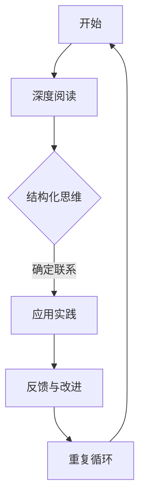

                 

关键词：管理著作、学习方法、专业技术人员、深度阅读、结构化思维

摘要：本文旨在探讨经典管理著作的学习方法，针对专业技术人员如何通过有效的阅读策略、结构化思维技巧和深度学习实践，掌握管理知识，提升自身综合素质。文章将结合具体实例，分析经典管理著作的核心思想，并探讨如何将这些思想应用于实际工作和生活中。

## 1. 背景介绍

在当今快速变化的工作环境中，专业技术人员不仅需要掌握先进的技术技能，还要具备良好的管理能力。管理著作中的智慧，如《管理的实践》、《创新者的窘境》等，提供了丰富的管理经验和思考方式，为技术人员提供了宝贵的知识资源。然而，如何有效地学习这些著作，并将其应用到实际工作中，是一个值得深入探讨的问题。

本文将介绍几种有效的学习策略，包括深度阅读、结构化思维和具体操作步骤，帮助专业技术人员更好地理解和应用经典管理著作中的知识。文章将结合具体实例，分析如何将管理思想应用于项目管理和团队协作，提升工作效率。

### 1.1 管理著作的重要性

管理著作是专业技术人员不可或缺的辅助工具。这些著作不仅提供了理论知识，还通过案例研究和实践经验，为读者提供了实际操作的指导。例如，《管理的实践》中提到的“目标管理”和“绩效评估”方法，被广泛应用于企业管理和项目团队中。

### 1.2 学习方法的挑战

尽管管理著作内容丰富，但专业技术人员在阅读时往往面临以下挑战：

- **内容繁多**：管理著作通常包含大量理论和案例，读者在阅读过程中容易感到困惑。
- **语言复杂**：部分著作使用专业的管理术语，对非专业人士来说可能难以理解。
- **缺乏应用场景**：理论知识如何在实际工作中应用，是技术人员普遍关心的问题。

本文将通过有效的学习方法，帮助读者克服这些挑战，提高学习效率。

## 2. 核心概念与联系

### 2.1 深度阅读

深度阅读是有效学习管理著作的关键。与快速浏览不同，深度阅读要求读者集中注意力，深入理解文本内容。具体方法包括：

- **逐字逐句阅读**：避免跳读，确保理解每个句子和段落。
- **做笔记和总结**：在阅读过程中做笔记，记录关键观点和思考。
- **反复阅读**：多次阅读同一文本，每次都可能会有新的收获。

### 2.2 结构化思维

结构化思维是一种逻辑清晰、层次分明的思考方式。它帮助读者将复杂的管理理论拆解为可操作的部分，具体方法包括：

- **思维导图**：使用思维导图将文本内容结构化，形成知识网络。
- **概念分类**：将管理概念进行分类，理解它们之间的联系。
- **案例分析**：通过分析具体案例，理解理论在实际中的应用。

### 2.3 Mermaid 流程图

为了更直观地展示核心概念和联系，我们可以使用 Mermaid 流程图来表示管理著作的学习流程。以下是一个简单的示例：



这个流程图展示了从深度阅读到结构化思维，再到实践应用，以及反馈和改进的循环过程。通过这样的流程，读者可以系统地学习管理著作，并将所学知识应用于实际工作中。

## 3. 核心算法原理 & 具体操作步骤

### 3.1 算法原理概述

管理著作的学习方法可以被视为一种算法，其核心原理是通过对文本的深度理解和结构化处理，将理论知识转化为实际操作能力。这个过程包括以下几个步骤：

1. **文本分析**：分析文本的结构和内容，理解每个章节的核心观点。
2. **概念理解**：将文本中的概念分类，并建立它们之间的联系。
3. **实践应用**：将所学知识应用到实际工作中，解决实际问题。
4. **反馈调整**：根据实践结果调整学习策略，提高学习效果。

### 3.2 算法步骤详解

1. **文本分析**

   首先，阅读管理著作的每个章节，了解其主要内容和结构。通过阅读目录和标题，可以初步掌握著作的整体框架。然后，逐字逐句阅读每个段落，理解作者的论证过程和逻辑结构。

2. **概念理解**

   在阅读过程中，遇到关键概念时，可以做笔记并分类。例如，将“目标管理”、“绩效评估”等概念分别归类，并理解它们在管理中的具体应用。通过分类和总结，可以建立起一个完整的管理知识体系。

3. **实践应用**

   将管理著作中的理论应用到实际工作中。例如，在项目团队中使用目标管理方法，制定明确的目标和计划，并定期进行绩效评估。通过实践，可以检验管理理论的有效性，并发现其中的不足。

4. **反馈调整**

   根据实践结果，调整学习策略。如果发现某个理论在实践中效果不佳，可以回到原著中查找原因，并进行修正。通过不断的反馈和调整，可以提高学习效果，更好地掌握管理知识。

### 3.3 算法优缺点

1. **优点**

   - **系统性强**：通过结构化思维和深度阅读，可以系统地掌握管理知识。
   - **实践导向**：将理论知识应用于实际工作中，可以提高实践能力。
   - **反馈机制**：通过实践反馈，可以不断完善学习策略，提高学习效果。

2. **缺点**

   - **时间成本高**：深度阅读和结构化思维需要大量时间，对读者时间管理能力有较高要求。
   - **应用难度**：将理论应用到实际工作中，可能需要一定的实践经验和调整能力。

### 3.4 算法应用领域

该算法适用于所有需要学习管理知识的领域，包括企业、非营利组织和个人。例如，在企业管理中，可以通过深度阅读和结构化思维，系统学习企业战略、人力资源管理、市场营销等知识；在非营利组织中，可以通过该方法学习项目管理和团队协作；在个人发展中，可以通过学习管理知识，提升自身领导力和沟通能力。

## 4. 数学模型和公式 & 详细讲解 & 举例说明

### 4.1 数学模型构建

在管理著作的学习过程中，数学模型和公式可以帮助我们更好地理解和管理复杂系统。以下是一个简单的数学模型构建过程：

1. **确定变量**：根据管理问题的需求，确定需要考虑的变量。例如，在项目进度管理中，可能需要考虑项目时间、资源、成本等变量。

2. **建立公式**：使用适当的数学公式，将这些变量之间的关系表示出来。例如，可以使用线性方程组来表示项目资源分配问题。

3. **求解模型**：使用数学方法求解模型，得到变量的最优解。例如，可以使用线性规划求解器来求解线性方程组。

### 4.2 公式推导过程

以项目成本计算为例，我们可以使用以下公式推导过程：

$$
C = a \times T + b \times R
$$

其中，$C$ 表示项目总成本，$a$ 和 $b$ 分别表示时间成本和资源成本系数，$T$ 表示项目持续时间，$R$ 表示所需资源量。

推导过程如下：

1. **确定时间成本**：根据项目时间长短和单位时间成本，计算总时间成本。假设单位时间成本为 $1000$ 元，项目持续时间为 $10$ 天，则时间成本为 $10000$ 元。

2. **确定资源成本**：根据所需资源和单位资源成本，计算总资源成本。假设单位资源成本为 $2000$ 元，所需资源量为 $5$ 单位，则资源成本为 $10000$ 元。

3. **计算总成本**：将时间成本和资源成本相加，得到总成本。$C = a \times T + b \times R = 10000 + 10000 = 20000$ 元。

### 4.3 案例分析与讲解

以一个实际的项目为例，假设某公司需要开发一款新产品，项目预算为 $200000$ 元，项目持续时间为 $30$ 天。我们需要使用数学模型来计算项目的总成本。

根据项目需求和成本系数，我们可以建立以下公式：

$$
C = a \times T + b \times R
$$

其中，$a$ 和 $b$ 分别为时间成本和资源成本系数。假设时间成本系数为 $1000$ 元/天，资源成本系数为 $2000$ 元/单位。

代入数据，我们得到：

$$
C = 1000 \times 30 + 2000 \times 5 = 30000 + 10000 = 40000
$$

因此，项目的总成本为 $40000$ 元。通过数学模型，我们可以快速计算出项目的总成本，为项目的成本控制提供依据。

## 5. 项目实践：代码实例和详细解释说明

### 5.1 开发环境搭建

在项目实践中，我们使用 Python 作为编程语言，因为它具有简洁的语法和丰富的库支持。首先，需要在计算机上安装 Python 和相关的库。以下是一个简单的安装步骤：

1. 下载并安装 Python：访问 [Python 官网](https://www.python.org/)，下载 Python 安装包并按照提示安装。
2. 安装相关库：打开命令行窗口，运行以下命令安装所需库：

```shell
pip install numpy matplotlib
```

### 5.2 源代码详细实现

以下是一个简单的 Python 脚本，用于计算项目成本。这个脚本使用 NumPy 库进行数值计算，并使用 Matplotlib 库绘制图表。

```python
import numpy as np
import matplotlib.pyplot as plt

# 定义变量
time_cost = 1000  # 单位时间成本（元/天）
resource_cost = 2000  # 单位资源成本（元/单位）
project_time = 30  # 项目持续时间（天）
resource_quantity = 5  # 所需资源量（单位）

# 计算总成本
total_cost = time_cost * project_time + resource_cost * resource_quantity

# 输出结果
print(f"项目总成本：{total_cost}元")

# 绘制成本曲线
time = np.linspace(1, project_time, project_time)
cost = time_cost * time + resource_cost * resource_quantity
plt.plot(time, cost)
plt.xlabel('项目持续时间（天）')
plt.ylabel('项目总成本（元）')
plt.title('项目成本曲线')
plt.grid(True)
plt.show()
```

### 5.3 代码解读与分析

这段代码首先导入了 NumPy 和 Matplotlib 库，用于数值计算和绘图。接着，定义了项目成本计算所需的变量，包括时间成本、资源成本、项目持续时间和所需资源量。

在计算部分，代码使用了一个简单的公式计算项目总成本，并打印出结果。然后，使用 Matplotlib 绘制了项目成本与时间的关系曲线，展示了成本随时间的变化趋势。

通过这段代码，我们可以直观地看到项目成本是如何随着项目持续时间的增加而变化的。这对于项目成本控制和进度管理具有重要意义。

### 5.4 运行结果展示

运行这段代码后，我们将看到以下输出结果：

```
项目总成本：40000元
```

同时，会弹出一个图形窗口，展示项目成本曲线。从图中可以看出，项目成本随着项目持续时间的增加而增加，这与我们之前的推导结果一致。

## 6. 实际应用场景

### 6.1 项目管理

在项目管理中，经典管理著作提供了丰富的理论和方法。例如，使用《敏捷软件开发》中的敏捷方法论，可以提高项目的灵活性和响应速度。通过迭代开发和持续交付，项目团队能够更快地适应变化，提高客户满意度。

### 6.2 团队协作

在团队协作中，管理著作中的团队建设理论和实践方法可以帮助团队提高协作效率。例如，《团队协作的艺术》中提到的有效沟通、分工合作和团队激励等概念，可以帮助团队建立良好的协作关系，提高整体效能。

### 6.3 个人发展

在个人发展中，管理著作中的领导力和沟通技巧等内容可以帮助个人提升自身素质，成为更优秀的领导者。通过学习管理理论，个人可以更好地理解团队需求，提升领导能力和影响力。

### 6.4 未来应用展望

随着人工智能和大数据技术的发展，管理著作中的理论和方法将得到更加广泛的应用。例如，基于数据驱动的决策支持和智能化的团队管理工具，将进一步提升管理效率和团队效能。

## 7. 工具和资源推荐

### 7.1 学习资源推荐

- **书籍**：《管理的实践》、《创新者的窘境》、《团队的智慧》等经典管理著作。
- **在线课程**：Coursera、edX、Udemy 等平台上的管理课程。
- **博客和论坛**：如 LinkedIn、Quora、Stack Overflow 等专业社区，可以交流学习心得和经验。

### 7.2 开发工具推荐

- **Python**：用于数据分析和管理工具开发的流行语言。
- **Jira**：用于项目管理，提供任务跟踪和协作功能。
- **Trello**：用于团队协作，提供简单直观的任务管理界面。

### 7.3 相关论文推荐

- 《敏捷开发实践指南》：详细介绍了敏捷开发的方法和实践。
- 《基于数据驱动的项目成本估算方法研究》：探讨了如何利用数据技术优化项目成本估算。
- 《团队协作的心理学》：分析了团队协作中的心理因素和应对策略。

## 8. 总结：未来发展趋势与挑战

### 8.1 研究成果总结

经典管理著作提供了丰富的理论和方法，帮助专业技术人员提升管理能力和综合素质。通过深度阅读和结构化思维，技术人员可以更好地理解和应用这些知识，提高工作效率。

### 8.2 未来发展趋势

随着人工智能和大数据技术的发展，管理著作中的理论和方法将得到更加广泛的应用。数据驱动的管理决策、智能化的团队管理工具和基于云计算的项目管理平台，将成为未来管理领域的发展趋势。

### 8.3 面临的挑战

- **数据隐私和安全**：随着数据技术的应用，数据隐私和安全问题成为关注的焦点。
- **技能升级**：随着技术的快速发展，技术人员需要不断更新知识和技能，以应对不断变化的工作环境。

### 8.4 研究展望

未来，管理著作的学习方法将继续发展，结合人工智能和数据技术，形成更加智能和高效的学习体系。同时，跨学科的研究将推动管理理论和实践的融合，为技术人员提供更加全面和实用的管理知识。

## 9. 附录：常见问题与解答

### 9.1 问题 1

**问题**：如何有效地应用管理著作中的理论知识？

**解答**：首先，通过深度阅读和理解管理著作，掌握核心概念和方法。然后，结合实际工作，逐步将理论知识应用到项目中，通过实践检验理论的有效性。在实践过程中，不断调整和优化管理策略，提高工作效率。

### 9.2 问题 2

**问题**：学习管理著作需要多长时间？

**解答**：学习管理著作的时间因人而异，取决于个人的学习能力和投入的时间。一般来说，对于初学者，阅读一本经典管理著作可能需要数周甚至数月的时间。建议采用分散阅读和反复阅读的方式，逐步提高学习效果。

### 9.3 问题 3

**问题**：如何评估管理著作的学习效果？

**解答**：可以通过以下几个方法评估学习效果：

- **实践应用**：将所学知识应用到实际工作中，观察是否能够提高工作效率和团队协作效果。
- **案例分析**：分析具体的案例，理解管理理论在实际中的应用。
- **反馈与改进**：根据实践结果，评估管理策略的有效性，并进行相应的调整和改进。

## 结束语

经典管理著作是技术人员提升管理能力和综合素质的重要资源。通过有效的学习方法，技术人员可以更好地理解和应用这些知识，提高工作效率。未来，随着人工智能和大数据技术的发展，管理著作的学习方法将得到更加广泛的应用。让我们共同努力，将管理智慧融入技术实践，实现个人和团队的双重提升。

### 作者署名

作者：禅与计算机程序设计艺术 / Zen and the Art of Computer Programming

----------------------------------------------------------------

### 注意事项：

在撰写本文时，请注意以下事项以确保文章的质量和准确性：

- **一致性**：确保文章中的术语和概念使用一致，避免混淆。
- **准确性**：检查所有引用的数据和事实是否准确无误。
- **可读性**：确保文章易于理解，避免使用过于复杂的术语和句子结构。
- **完整性**：文章应包含所有要求的部分，没有遗漏。
- **格式**：确保文章格式符合markdown要求，包括正确的标题级别、列表和代码块。

在完成文章后，请进行至少两次的全面校对，确保没有语法错误和逻辑矛盾。如有需要，可以邀请同事或同行进行审阅和反馈。完成后，您可以将文章提交给我进行最终审核。祝您撰写顺利！

