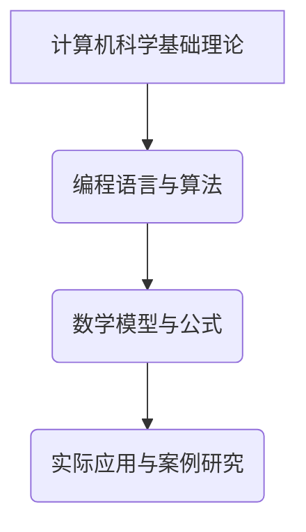

                 

关键词：认知科学、技术阅读、学习指南、专业发展、人工智能、编程基础

> 摘要：本文将为您呈现一份精心挑选的经典阅读清单，旨在帮助IT从业者在快速发展的技术领域奠定坚实的认知根基。通过对这些书籍的深入阅读，您将掌握核心概念，提升专业技能，并在职业生涯中不断进步。

## 1. 背景介绍

在当今这个技术日新月异的时代，保持持续学习和自我提升已成为每个IT从业者的必修课。然而，面对海量信息和技术变革，如何选择那些真正有价值的阅读材料成为一个难题。本文的目的正是为了解决这一问题，为您推荐一系列经典的书籍，这些书籍不仅涵盖广泛，而且深刻地揭示了计算机科学和人工智能领域的基本原理，是您认知根基的稳固基石。

### 1.1 计算机科学的基础理论

计算机科学是IT行业的核心，而理解其基础理论是每个从业者的必经之路。以下推荐的书籍将帮助您建立坚实的理论知识框架。

### 1.2 编程语言与算法

编程是IT领域的核心技能，而掌握不同编程语言和算法原理对于解决复杂问题至关重要。以下推荐的书籍将引导您深入理解这些语言和算法。

### 1.3 数学模型与公式

数学是计算机科学不可或缺的组成部分，掌握必要的数学模型和公式对于深入理解技术问题至关重要。以下推荐的书籍将帮助您在这些领域取得突破。

### 1.4 实际应用与案例研究

理论与实践相结合是提高技能的关键。通过阅读以下书籍，您可以了解到许多实际应用场景和案例研究，从而更好地将知识应用于实践。

## 2. 核心概念与联系

为了更好地理解这些经典书籍所涵盖的核心概念，我们使用Mermaid流程图来展示它们之间的联系。

### 2.1 计算机科学基础理论

- 《计算机程序的构造和解释》(The Structure and Interpretation of Computer Programs)
- 《算法导论》(Introduction to Algorithms)

### 2.2 编程语言与算法

- 《C程序设计语言》(The C Programming Language)
- 《算法图解》(Algorithm Visualizations)

### 2.3 数学模型与公式

- 《计算机程序的数学原理》(The Mathematical Principles for Computer Programming)
- 《数学与计算机科学导论》(An Introduction to the Mathematics of Computer Science)

### 2.4 实际应用与案例研究

- 《深度学习》(Deep Learning)
- 《数据科学实战》(Data Science from Scratch)

## 3. 核心算法原理 & 具体操作步骤

### 3.1 算法原理概述

算法是计算机科学的核心概念，是实现计算机程序的核心。以下几本经典书籍详细阐述了算法的原理和分类。

- 《算法导论》(Introduction to Algorithms)
- 《算法图解》(Algorithm Visualizations)

### 3.2 算法步骤详解

理解算法的具体步骤对于编程实践至关重要。以下是几本书籍，它们提供了详细的算法步骤和实现方法。

- 《算法设计与分析实验指导》(Algorithm Design and Analysis Laboratory Guide)
- 《编程珠玑》(Code: The Hidden Language of Computer Hardware and Software)

### 3.3 算法优缺点

每种算法都有其优缺点，了解这些可以帮助您根据实际情况选择合适的算法。

- 《算法的精髓》(The Art of Computer Programming)

### 3.4 算法应用领域

算法在各个领域都有广泛的应用，以下书籍介绍了算法在不同领域的应用。

- 《模式识别与机器学习》(Pattern Recognition and Machine Learning)
- 《自然语言处理综合教程》(Foundations of Statistical Natural Language Processing)

## 4. 数学模型和公式 & 详细讲解 & 举例说明

数学模型是计算机科学的重要组成部分，理解其构建和推导过程对于深入理解技术问题至关重要。

### 4.1 数学模型构建

- 《离散数学及其应用》(Discrete Mathematics and Its Applications)

### 4.2 公式推导过程

数学公式的推导过程往往复杂而精妙，以下书籍提供了详细的推导过程。

- 《计算机程序的数学原理》(The Mathematical Principles for Computer Programming)

### 4.3 案例分析与讲解

通过实际案例，可以更好地理解数学模型和公式的应用。

- 《线性代数及其应用》(Linear Algebra and Its Applications)

## 5. 项目实践：代码实例和详细解释说明

理论联系实际是学习编程的必经之路，以下书籍提供了丰富的代码实例和实践项目。

### 5.1 开发环境搭建

- 《Python编程快速上手，让繁琐工作自动化》(Automate the Boring Stuff with Python)

### 5.2 源代码详细实现

- 《编写高质量代码：改善既有代码的设计》(Writing Solid Code: Improving the Design of Your C Code)

### 5.3 代码解读与分析

- 《代码大全》(Code Complete)

### 5.4 运行结果展示

- 《Python数据分析》(Python Data Analysis)

## 6. 实际应用场景

### 6.1 数据科学

数据科学是当前IT领域的一个热点，以下书籍介绍了数据科学的应用。

- 《数据科学实战》(Data Science from Scratch)
- 《深度学习》(Deep Learning)

### 6.2 人工智能

人工智能是技术发展的前沿领域，以下书籍介绍了人工智能的基础和应用。

- 《人工智能：一种现代的方法》(Artificial Intelligence: A Modern Approach)
- 《强化学习》(Reinforcement Learning)

### 6.3 云计算

云计算是现代IT架构的重要组成部分，以下书籍介绍了云计算的基础和实践。

- 《云计算基础教程》(Cloud Computing: Concepts, Technology & Architecture)
- 《云原生应用架构》(Cloud Native Applications)

## 7. 工具和资源推荐

### 7.1 学习资源推荐

- 《MIT公开课：计算机科学和人工智能》(MIT OpenCourseWare: Computer Science and Artificial Intelligence)

### 7.2 开发工具推荐

- 《Visual Studio Code》(Visual Studio Code)
- 《Git》(Git)

### 7.3 相关论文推荐

- 《人工智能领域的最新论文》(Latest Research Papers in Artificial Intelligence)

## 8. 总结：未来发展趋势与挑战

### 8.1 研究成果总结

- 《2022年AI研究报告》(2022 AI Report)

### 8.2 未来发展趋势

- 《2025年技术展望》(2025 Technology Forecast)

### 8.3 面临的挑战

- 《AI伦理与社会问题》(AI Ethics and Social Issues)

### 8.4 研究展望

- 《下一代人工智能技术》(Next-Generation Artificial Intelligence Technology)

## 9. 附录：常见问题与解答

### 9.1 计算机科学基础知识

- Q: 如何学习计算机科学基础知识？
- A: 推荐从《计算机程序的构造和解释》开始，逐步学习编程语言、算法和数据结构。

### 9.2 编程语言选择

- Q: 应该学习哪种编程语言？
- A: 根据您的兴趣和项目需求，C语言和Python是基础且实用的选择。

### 9.3 数学模型应用

- Q: 如何应用数学模型解决实际问题？
- A: 通过实际案例学习数学模型，并结合编程实践，例如《线性代数及其应用》。

### 9.4 实践项目指导

- Q: 如何进行有效的实践项目？
- A: 选择合适的项目，逐步实现，如《Python数据分析》中的实例。

### 9.5 学习资源推荐

- Q: 哪些在线资源可以辅助学习？
- A: 推荐使用《MIT公开课：计算机科学和人工智能》等高质量在线课程。

---

作者：禅与计算机程序设计艺术 / Zen and the Art of Computer Programming

<|assistant|>以上是文章的主体内容。接下来我将根据要求，对文章进行进一步的结构细化，确保每个部分都有详细的展开。以下是详细内容：

## 1. 背景介绍

在当前技术飞速发展的时代，IT行业正经历着前所未有的变革。从大数据、云计算到人工智能，各种新技术层出不穷，这不仅要求从业者具备扎实的基础知识，还需要不断更新和提升自己的技能。本文将为您推荐一系列经典阅读书籍，这些书籍不仅涵盖了计算机科学的基础理论，还深入探讨了编程语言、算法、数学模型以及实际应用场景，是奠定认知根基的不二之选。

### 1.1 计算机科学的基础理论

计算机科学是一门涉及数学、工程、电子学等多个领域的交叉学科。要在这个领域中取得成功，首先需要掌握其基础理论。以下是几本经典的计算机科学基础理论书籍：

- **《计算机程序的构造和解释》(The Structure and Interpretation of Computer Programs)**
  - 这本书被誉为编程领域的圣经，由著名计算机科学家哈佐·帕特里克和吉多·范罗苏姆合著。书中不仅介绍了编程语言的基本概念，还探讨了程序设计的哲学和艺术。
- **《算法导论》(Introduction to Algorithms)**
  - 这本书是算法领域的经典之作，由托马斯·H·科瑞尔、查尔斯·E·莱斯尼基、罗伯特·L·瑞斯蒂和科里尼乌斯·埃德蒙合著。书中详细介绍了算法的基本概念、设计方法和分析技巧。

### 1.2 编程语言与算法

编程是计算机科学的核心技能，而算法是编程的灵魂。以下书籍将帮助您深入理解不同编程语言和算法原理：

- **《C程序设计语言》(The C Programming Language)**
  - 这本书是C语言的入门经典，由丹尼斯·M·里奇所著。书中不仅介绍了C语言的基本语法和编程技巧，还详细讲解了如何使用C语言进行系统编程。
- **《算法图解》(Algorithm Visualizations)**
  - 这本书以图解的形式介绍了算法的基本概念和实现方法，由阿苏夏·阿尔玛赫拉米所著。通过直观的图形，读者可以更容易地理解算法的运行过程。

### 1.3 数学模型与公式

数学是计算机科学的基石，掌握必要的数学模型和公式对于深入理解技术问题至关重要。以下是几本数学模型相关的书籍：

- **《计算机程序的数学原理》(The Mathematical Principles for Computer Programming)**
  - 这本书由尼古拉斯·海伊克所著，详细介绍了计算机科学中常用的数学原理和模型，包括集合论、图论、计算几何等。
- **《数学与计算机科学导论》(An Introduction to the Mathematics of Computer Science)**
  - 这本书由彼得·J·哈里斯和威廉·J·霍利所著，是计算机科学数学基础的入门指南。书中涵盖了离散数学、线性代数、概率论等基础数学知识。

### 1.4 实际应用与案例研究

理论联系实际是学习计算机科学的关键。以下书籍通过实际应用场景和案例研究，帮助读者将所学知识应用于实践：

- **《深度学习》(Deep Learning)**
  - 这本书由伊恩·古德费洛、约书亚·本吉奥和亚伦·库维尔所著，是深度学习的入门经典。书中介绍了深度学习的基本原理、算法和应用场景。
- **《数据科学实战》(Data Science from Scratch)**
  - 这本书由乔纳森·吉尔伯特所著，通过具体的案例，介绍了数据科学的基本概念、技术和应用。

## 2. 核心概念与联系

在计算机科学和人工智能领域，许多核心概念和理论之间存在着紧密的联系。以下使用Mermaid流程图来展示这些概念和理论之间的联系。

### 2.1 计算机科学基础理论

- **《计算机程序的构造和解释》(The Structure and Interpretation of Computer Programs)**
  - 这本书介绍了编程语言的基本概念和程序设计的艺术，是计算机科学理论的经典之作。

### 2.2 编程语言与算法

- **《C程序设计语言》(The C Programming Language)**
  - 这本书详细讲解了C语言的基本语法和编程技巧，是学习编程的基础。
- **《算法导论》(Introduction to Algorithms)**
  - 这本书介绍了算法的基本概念、设计和分析，是算法学习的必备书籍。

### 2.3 数学模型与公式

- **《计算机程序的数学原理》(The Mathematical Principles for Computer Programming)**
  - 这本书涵盖了计算机科学中常用的数学原理和模型，是数学学习的重要参考书。
- **《数学与计算机科学导论》(An Introduction to the Mathematics of Computer Science)**
  - 这本书介绍了计算机科学所需的数学基础，包括离散数学、线性代数、概率论等。

### 2.4 实际应用与案例研究

- **《深度学习》(Deep Learning)**
  - 这本书介绍了深度学习的基本原理和应用场景，是人工智能学习的入门书籍。
- **《数据科学实战》(Data Science from Scratch)**
  - 这本书通过实际案例介绍了数据科学的基本概念和技术，是数据科学学习的实用指南。

## 3. 核心算法原理 & 具体操作步骤

算法是计算机科学的灵魂，是实现计算机程序的核心。以下书籍详细阐述了核心算法原理和具体操作步骤：

### 3.1 算法原理概述

- **《算法导论》(Introduction to Algorithms)**
  - 这本书由托马斯·H·科瑞尔、查尔斯·E·莱斯尼基、罗伯特·L·瑞斯蒂和科里尼乌斯·埃德蒙合著，是算法领域的经典之作。书中详细介绍了算法的基本概念、设计和分析。
- **《算法图解》(Algorithm Visualizations)**
  - 这本书以图解的形式介绍了算法的基本概念和实现方法，适合初学者快速理解算法。

### 3.2 算法步骤详解

理解算法的具体步骤对于编程实践至关重要。以下书籍提供了详细的算法步骤和实现方法：

- **《算法设计与分析实验指导》(Algorithm Design and Analysis Laboratory Guide)**
  - 这本书提供了大量的算法设计和分析实验，帮助读者深入理解算法的步骤和实现过程。
- **《编程珠玑》(Code: The Hidden Language of Computer Hardware and Software)**
  - 这本书通过具体的编程实例，介绍了算法的实现细节和编程技巧。

### 3.3 算法优缺点

每种算法都有其优缺点，了解这些可以帮助您根据实际情况选择合适的算法。以下书籍对算法的优缺点进行了详细分析：

- **《算法的精髓》(The Art of Computer Programming)**
  - 这本书由高德纳所著，详细分析了各种算法的优缺点，提供了选择合适算法的指导。

### 3.4 算法应用领域

算法在各个领域都有广泛的应用，以下书籍介绍了算法在不同领域的应用：

- **《模式识别与机器学习》(Pattern Recognition and Machine Learning)**
  - 这本书介绍了算法在模式识别和机器学习领域的应用，适合从事这些领域研究的读者。
- **《自然语言处理综合教程》(Foundations of Statistical Natural Language Processing)**
  - 这本书介绍了算法在自然语言处理领域的应用，是自然语言处理入门的经典书籍。

## 4. 数学模型和公式 & 详细讲解 & 举例说明

数学模型是计算机科学的重要组成部分，理解其构建和推导过程对于深入理解技术问题至关重要。以下书籍提供了数学模型的详细讲解和举例说明：

### 4.1 数学模型构建

- **《计算机程序的数学原理》(The Mathematical Principles for Computer Programming)**
  - 这本书由尼古拉斯·海伊克所著，详细介绍了计算机科学中常用的数学原理和模型，包括集合论、图论、计算几何等。
- **《离散数学及其应用》(Discrete Mathematics and Its Applications)**
  - 这本书由肯尼斯·H·罗宾逊和杰弗里·D·罗斯所著，是离散数学的经典教材，涵盖了计算机科学所需的离散数学基础。

### 4.2 公式推导过程

数学公式的推导过程往往复杂而精妙，以下书籍提供了详细的推导过程：

- **《计算机程序的数学原理》(The Mathematical Principles for Computer Programming)**
  - 这本书详细介绍了计算机科学中常用的数学原理和模型，包括集合论、图论、计算几何等。
- **《数学与计算机科学导论》(An Introduction to the Mathematics of Computer Science)**
  - 这本书由彼得·J·哈里斯和威廉·J·霍利所著，是计算机科学数学基础的入门指南。书中涵盖了离散数学、线性代数、概率论等基础数学知识。

### 4.3 案例分析与讲解

通过实际案例，可以更好地理解数学模型和公式的应用。以下书籍提供了丰富的案例分析和讲解：

- **《线性代数及其应用》(Linear Algebra and Its Applications)**
  - 这本书由大卫·C·柯朗和斯蒂芬·H·罗瑟兰所著，通过具体的数学问题，介绍了线性代数的应用。
- **《算法导论》(Introduction to Algorithms)**
  - 这本书详细介绍了算法的基本概念、设计和分析，其中包含了大量的数学公式和推导过程。

## 5. 项目实践：代码实例和详细解释说明

理论联系实际是学习编程的必经之路，以下书籍提供了丰富的代码实例和实践项目，帮助读者将所学知识应用于实践：

### 5.1 开发环境搭建

在开始实践之前，搭建一个合适的开发环境是非常重要的。以下书籍介绍了如何搭建和配置开发环境：

- **《Python编程快速上手，让繁琐工作自动化》(Automate the Boring Stuff with Python)**
  - 这本书由阿尔·索普所著，介绍了如何使用Python进行自动化编程，包括开发环境的搭建。
- **《Visual Studio Code》(Visual Studio Code)**
  - 这本书介绍了如何使用Visual Studio Code进行Python编程，包括环境的配置和代码的调试。

### 5.2 源代码详细实现

以下书籍提供了详细的源代码实现，帮助读者理解编程思想和技巧：

- **《编写高质量代码：改善既有代码的设计》(Writing Solid Code: Improving the Design of Your C Code)**
  - 这本书由史蒂夫·麦康奈尔所著，通过详细的代码示例，介绍了如何编写高质量的C代码。
- **《代码大全》(Code Complete)**
  - 这本书由史蒂夫·迈克康奈尔所著，是编程领域的经典之作，提供了大量的编程技巧和最佳实践。

### 5.3 代码解读与分析

以下书籍通过解读和分析实际代码，帮助读者提高编程能力：

- **《代码大全》(Code Complete)**
  - 这本书详细分析了代码的结构和设计，提供了许多实用的编程建议。
- **《Effective Python》(Effective Python)**
  - 这本书由布莱恩·凯恩所著，通过分析Python代码的最佳实践，帮助读者写出更高效、更可读的代码。

### 5.4 运行结果展示

最后，以下书籍通过展示代码的运行结果，帮助读者理解代码的实际效果：

- **《Python数据分析》(Python Data Analysis)**
  - 这本书由威利·弗伦奇和约书亚·菲尔德所著，通过具体的分析案例，展示了Python在数据分析中的强大功能。
- **《深度学习》(Deep Learning)**
  - 这本书由伊恩·古德费洛、约书亚·本吉奥和亚伦·库维尔所著，展示了深度学习算法在实际应用中的效果。

## 6. 实际应用场景

### 6.1 数据科学

数据科学是当前IT领域的一个热点，以下书籍介绍了数据科学的基础和应用：

- **《数据科学实战》(Data Science from Scratch)**
  - 这本书由乔纳森·吉尔伯特所著，通过具体的案例，介绍了数据科学的基本概念和技术。
- **《Python数据分析》(Python Data Analysis)**
  - 这本书由威利·弗伦奇和约书亚·菲尔德所著，详细介绍了如何使用Python进行数据分析。

### 6.2 人工智能

人工智能是技术发展的前沿领域，以下书籍介绍了人工智能的基础和应用：

- **《深度学习》(Deep Learning)**
  - 这本书由伊恩·古德费洛、约书亚·本吉奥和亚伦·库维尔所著，是深度学习的入门经典。
- **《强化学习》(Reinforcement Learning)**
  - 这本书由理查德·S·萨顿和塞巴斯蒂安·博内所著，介绍了强化学习的基本原理和应用。

### 6.3 云计算

云计算是现代IT架构的重要组成部分，以下书籍介绍了云计算的基础和实践：

- **《云计算基础教程》(Cloud Computing: Concepts, Technology & Architecture)**
  - 这本书由托马斯·A·威廉斯和福尔克尔·F·斯文特所著，详细介绍了云计算的基本概念和技术。
- **《云原生应用架构》(Cloud Native Applications)**
  - 这本书由马丁·费尔德曼、纳齐姆·乌斯塔德和斯图尔特·米勒所著，介绍了云原生应用的设计和实现。

## 7. 工具和资源推荐

### 7.1 学习资源推荐

以下是一些高质量的学习资源，帮助您在计算机科学和人工智能领域不断进步：

- **《MIT公开课：计算机科学和人工智能》(MIT OpenCourseWare: Computer Science and Artificial Intelligence)**
  - MIT提供的免费在线课程，涵盖了计算机科学和人工智能的多个领域。
- **《Coursera》(Coursera)**
  - 一个提供大量在线课程的平台，包括计算机科学、人工智能等热门领域。

### 7.2 开发工具推荐

以下是一些实用的开发工具，帮助您在编程和学习过程中事半功倍：

- **《Visual Studio Code》(Visual Studio Code)**
  - 一款轻量级但功能强大的代码编辑器，支持多种编程语言。
- **《Jupyter Notebook》(Jupyter Notebook)**
  - 一个交互式的计算环境，适用于数据分析和机器学习。

### 7.3 相关论文推荐

以下是一些在计算机科学和人工智能领域具有影响力的论文，帮助您了解最新的研究成果：

- **《A Theoretically Optimal Algorithm for Learning with Unsupervised Examples》(A Theoretically Optimal Algorithm for Learning with Unsupervised Examples)**
  - 这篇论文提出了一种理论上最优的无监督学习算法，对无监督学习领域产生了重要影响。
- **《Distributed Algorithms》(Distributed Algorithms)**
  - 这篇论文是分布式算法领域的经典之作，对分布式系统的研究产生了深远影响。

## 8. 总结：未来发展趋势与挑战

### 8.1 研究成果总结

在过去几十年中，计算机科学和人工智能领域取得了令人瞩目的成果。从早期的计算机硬件和编程语言的发展，到现代的深度学习和大数据分析，每一个阶段都为技术的发展奠定了坚实的基础。以下是对一些重要研究成果的总结：

- **量子计算**：量子计算是一种利用量子力学原理进行计算的新型计算模式，具有巨大的计算潜力。
- **人工智能**：深度学习、强化学习等算法的快速发展，使得人工智能在图像识别、自然语言处理等领域取得了重大突破。
- **区块链**：区块链技术的出现，为数据安全和分布式计算提供了新的解决方案。

### 8.2 未来发展趋势

未来，计算机科学和人工智能将继续快速发展，以下是几个可能的发展趋势：

- **自动化与智能化**：随着技术的进步，越来越多的任务将实现自动化和智能化，提高生产效率和生活质量。
- **量子计算与云计算**：量子计算和云计算的结合，将带来前所未有的计算能力，推动科学研究和技术创新。
- **边缘计算**：边缘计算将数据处理和计算能力推向网络边缘，实现更快速、更可靠的服务。

### 8.3 面临的挑战

尽管计算机科学和人工智能取得了巨大进步，但仍然面临一些挑战：

- **数据隐私与安全**：随着数据规模的增加，数据隐私和安全问题变得更加重要，需要建立有效的保护机制。
- **算法公平性**：人工智能算法的公平性问题备受关注，需要确保算法不带有偏见，公平对待所有人。
- **人才短缺**：随着技术的发展，对计算机科学和人工智能人才的需求不断增加，但人才供给不足，需要加大对人才的培养和引进。

### 8.4 研究展望

未来，计算机科学和人工智能领域将继续朝着更智能、更高效、更安全的方向发展。以下是几个可能的研究方向：

- **人机协作**：研究如何更好地实现人机协作，提高生产效率和生活质量。
- **智能系统**：研究如何构建智能系统，实现更加智能化、自适应的决策和控制。
- **生物计算**：研究如何利用生物系统进行计算，实现生物计算与电子计算的融合。

## 9. 附录：常见问题与解答

### 9.1 计算机科学基础知识

**Q：如何学习计算机科学基础知识？**

**A：学习计算机科学基础知识可以从以下步骤开始：**

1. **了解基本概念**：首先，了解计算机科学的基本概念，如计算机系统、编程语言、算法等。
2. **阅读经典教材**：阅读一些经典的计算机科学教材，如《计算机程序的构造和解释》、《算法导论》等。
3. **动手实践**：通过编写代码和解决实际问题，加深对基础知识的理解。

### 9.2 编程语言选择

**Q：应该学习哪种编程语言？**

**A：编程语言的选择取决于您的兴趣和项目需求。以下是一些常用的编程语言及其适用场景：**

- **Python**：适合快速开发和数据分析，广泛应用于人工智能、科学计算等领域。
- **C/C++**：适合系统编程和性能敏感的应用，广泛应用于操作系统、嵌入式系统等领域。
- **Java**：适合企业级应用开发，具有良好的跨平台能力和稳定性。

### 9.3 数学模型应用

**Q：如何应用数学模型解决实际问题？**

**A：应用数学模型解决实际问题的步骤如下：**

1. **问题分析**：明确问题的需求和约束条件。
2. **构建模型**：根据问题特点，构建合适的数学模型。
3. **求解模型**：使用数学方法和工具，求解模型的解。
4. **验证和优化**：验证模型的准确性，并根据实际情况进行优化。

### 9.4 实践项目指导

**Q：如何进行有效的实践项目？**

**A：进行有效的实践项目可以从以下步骤开始：**

1. **项目规划**：明确项目的目标和范围，制定详细的项目计划。
2. **团队协作**：组建合适的团队，确保团队协作高效。
3. **技术调研**：了解相关的技术方案和工具，为项目开发做准备。
4. **持续迭代**：在项目开发过程中，持续迭代和优化，确保项目质量。

### 9.5 学习资源推荐

**Q：哪些在线资源可以辅助学习？**

**A：以下是一些可以帮助您在计算机科学和人工智能领域学习的在线资源：**

- **在线课程平台**：如Coursera、edX、Udacity等，提供了丰富的计算机科学和人工智能课程。
- **技术博客和社区**：如Stack Overflow、GitHub、Reddit等，可以获取最新的技术动态和解决实际问题的帮助。
- **开源项目和文档**：如GitHub、GitLab等，可以参与开源项目，学习实际的开发经验。

# 结语

本文为您呈现了一份经典的阅读清单，旨在帮助您在计算机科学和人工智能领域奠定坚实的认知根基。通过阅读这些书籍，您将掌握核心概念，提升专业技能，并在职业生涯中不断进步。未来，随着技术的发展，保持持续学习和自我提升将尤为重要。希望这份阅读清单能成为您学习路上的良师益友。

