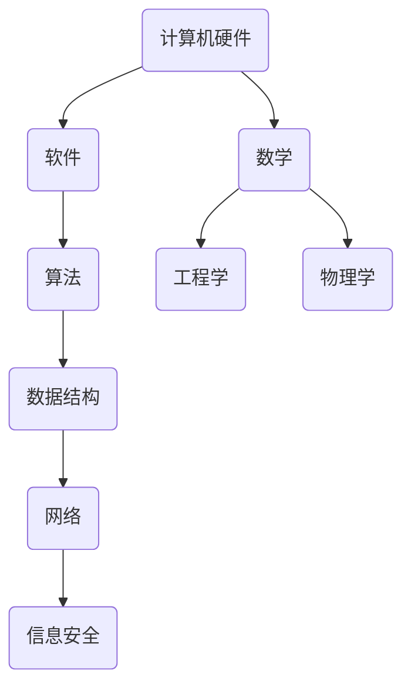

                 

### 背景介绍

在信息时代，技术的迅猛发展使得计算机科学成为了一个庞大而复杂的领域。作为IT专业人士，持续学习和掌握新知识是至关重要的。然而，面对海量的文献和资料，如何选择适合自己的学习资源成为一个难题。《经典阅读清单：奠定认知根基》旨在为IT专业人士提供一份涵盖计算机科学基础理论、核心技术、编程语言和开发实践的阅读指南。本文将详细介绍这份阅读清单的组成，帮助读者构建坚实的认知基础，提升技术能力。

### 文章关键词

- 计算机科学
- 阅读清单
- 知识体系
- 技术能力
- 学习资源

### 文章摘要

本文将探讨计算机科学领域的重要经典书籍，整理成一份详尽的阅读清单。这份清单不仅涵盖了基础理论，还包括编程语言、算法和数据结构等内容。通过阅读这些经典著作，读者可以构建起完整的知识体系，掌握核心技术，提高自己的技术水平。本文还将对每本书籍进行简要介绍，并提供推荐理由，帮助读者根据自己的需求和兴趣选择合适的学习资源。

## 1. 背景介绍

### 计算机科学的演变与发展

计算机科学作为一个不断发展的领域，经历了从早期计算机硬件到现代软件工程的重大变革。20世纪中叶，计算机从简单的计算工具逐渐演变为复杂的信息处理系统。这一过程中，计算机科学家们不断探索新的理论和方法，推动了计算机技术的飞速发展。

### 知识体系的重要性

在计算机科学领域，知识体系是技术能力的基石。一个完整的知识体系包括基础理论、核心技术、编程语言、开发工具和实践经验等多个方面。通过系统性地学习这些知识，IT专业人士可以建立起坚实的认知基础，为未来的技术发展做好准备。

### 学习资源的多样性

随着信息技术的普及，学习资源呈现出多样化的特点。从传统的教科书到在线课程，从技术博客到专业论坛，各种学习资源丰富且易于获取。然而，面对如此众多的资源，如何选择适合自己的学习材料成为一个挑战。

### 经典阅读清单的必要性

为了帮助读者在浩如烟海的学习资源中找到合适的书籍，本文特别整理了一份经典阅读清单。这份清单不仅涵盖了计算机科学的基础理论，还涉及了编程语言、算法和数据结构等核心技术。通过阅读这些经典著作，读者可以全面提升自己的技术水平，为未来的职业发展打下坚实的基础。

### 整篇文章的结构

本文将分为以下章节：

- **第1章：背景介绍**：介绍计算机科学的演变与发展，知识体系的重要性以及学习资源的多样性。
- **第2章：核心概念与联系**：通过Mermaid流程图展示计算机科学的核心概念和联系。
- **第3章：核心算法原理与具体操作步骤**：介绍各种核心算法的原理和操作步骤。
- **第4章：数学模型和公式**：详细讲解数学模型和公式，并提供实际案例进行分析。
- **第5章：项目实践**：提供代码实例和详细解释。
- **第6章：实际应用场景**：探讨技术的实际应用领域和未来展望。
- **第7章：工具和资源推荐**：推荐学习资源和开发工具。
- **第8章：总结**：总结研究成果和未来发展趋势。

### 经典阅读清单的组成

这份经典阅读清单将分为以下几个部分：

- **基础理论**：包括计算机科学的基本概念和原理。
- **核心技术**：涉及编程语言、算法和数据结构等。
- **编程实践**：包括实际的编程项目和实践经验。
- **相关资源**：推荐学习资源和开发工具。

## 2. 核心概念与联系

### 计算机科学的基本概念

计算机科学是一门涵盖广泛的学科，涉及数学、工程学、物理学等多个领域。其基本概念包括计算机硬件、软件、算法、数据结构、网络和信息安全等。这些概念相互联系，共同构成了计算机科学的体系结构。

### Mermaid流程图

为了更好地展示计算机科学的核心概念和联系，我们使用Mermaid流程图来表示这些概念之间的相互关系。



### 核心概念之间的联系

- **硬件与软件**：计算机硬件是软件运行的基础，而软件则通过算法和数据结构对硬件进行编程，实现特定的功能。
- **算法与数据结构**：算法是解决问题的方法，而数据结构则是组织和存储数据的方式。两者相互依存，共同决定程序的效率和性能。
- **网络与信息安全**：随着互联网的普及，网络技术成为计算机科学的重要组成部分。信息安全则保障了网络和数据的可靠性。

通过上述Mermaid流程图，我们可以清晰地看到计算机科学核心概念之间的联系。这些概念相互交织，共同构成了计算机科学的完整体系。

## 3. 核心算法原理与具体操作步骤

### 算法原理概述

算法是计算机科学的核心，是解决问题的基础。一个高效的算法不仅能够降低时间复杂度和空间复杂度，还能够提高程序的运行效率。在计算机科学中，常见的算法包括排序算法、查找算法、动态规划算法等。

### 排序算法

排序算法是一种将数据按照特定顺序排列的算法。常见的排序算法有冒泡排序、选择排序、插入排序、快速排序等。每种排序算法都有其特定的原理和操作步骤。

#### 冒泡排序

冒泡排序是一种简单的排序算法，其原理是通过反复交换相邻的未排序元素，使得最大的元素逐渐“冒泡”到数组的末尾。

#### 操作步骤

1. 遍历数组，比较相邻的两个元素。
2. 如果前一个元素大于后一个元素，交换它们的位置。
3. 重复上述步骤，直到整个数组有序。

#### 选择排序

选择排序是一种通过反复选择最小元素来排序的算法。其原理是在未排序部分中找到最小元素，并将其放置在已排序部分的末尾。

#### 操作步骤

1. 遍历未排序部分，找到最小元素的下标。
2. 将最小元素与未排序部分的首个元素交换。
3. 重复上述步骤，直到未排序部分只剩下一个元素。

### 查找算法

查找算法是一种用于在数据结构中查找特定元素的算法。常见的查找算法有二分查找、线性查找等。

#### 二分查找

二分查找是一种高效的查找算法，其原理是将数据分为两部分，根据目标元素与中间元素的大小关系，逐步缩小查找范围。

#### 操作步骤

1. 确定查找范围的中间位置。
2. 比较目标元素与中间元素的大小。
3. 如果目标元素小于中间元素，则在左侧子数组中继续查找；如果目标元素大于中间元素，则在右侧子数组中继续查找。
4. 重复上述步骤，直到找到目标元素或确定其不存在。

### 动态规划算法

动态规划算法是一种解决最优化问题的算法，其原理是将复杂问题分解为多个子问题，并利用子问题的最优解来构建原问题的最优解。

#### 操作步骤

1. 定义状态变量和状态转移方程。
2. 初始化边界条件。
3. 递推计算各个状态的最优解。
4. 利用最优解构建原问题的最优解。

### 算法优缺点

每种算法都有其优缺点。冒泡排序和选择排序简单易实现，但时间复杂度较高；快速排序时间复杂度较低，但可能存在最坏情况；二分查找高效，但要求数据结构有序。

### 算法应用领域

排序算法和查找算法广泛应用于各种场景，如数据库查询、搜索引擎、数据分析等。动态规划算法则常用于求解最优化问题，如背包问题、最长公共子序列等。

## 4. 数学模型和公式

### 数学模型构建

在计算机科学中，数学模型用于描述问题的数学特征，为算法设计提供理论基础。常见的数学模型包括图模型、树模型、网络模型等。

### 公式推导过程

公式推导是构建数学模型的重要步骤，通过推导公式可以揭示问题的内在规律。以下以线性回归模型为例，介绍公式推导过程。

#### 线性回归模型

线性回归模型是一种用于预测连续值的数学模型，其公式为：

$$y = \beta_0 + \beta_1 \cdot x + \epsilon$$

其中，$y$为因变量，$x$为自变量，$\beta_0$和$\beta_1$为模型参数，$\epsilon$为误差项。

#### 公式推导过程

1. 定义损失函数：

$$L(\beta_0, \beta_1) = \sum_{i=1}^{n} (y_i - (\beta_0 + \beta_1 \cdot x_i))^2$$

其中，$n$为样本数量。

2. 求导并令导数为零，得到参数的估计值：

$$\frac{\partial L}{\partial \beta_0} = -2 \sum_{i=1}^{n} (y_i - (\beta_0 + \beta_1 \cdot x_i)) = 0$$

$$\frac{\partial L}{\partial \beta_1} = -2 \sum_{i=1}^{n} (y_i - (\beta_0 + \beta_1 \cdot x_i)) \cdot x_i = 0$$

3. 解方程组，得到：

$$\beta_0 = \frac{1}{n} \sum_{i=1}^{n} y_i - \beta_1 \cdot \frac{1}{n} \sum_{i=1}^{n} x_i$$

$$\beta_1 = \frac{1}{n} \sum_{i=1}^{n} (x_i - \bar{x}) (y_i - \bar{y})$$

其中，$\bar{x}$和$\bar{y}$分别为自变量和因变量的均值。

### 案例分析与讲解

以下以线性回归模型为例，分析实际案例并讲解公式推导过程。

#### 案例背景

假设我们有一个关于房价的数据集，其中包含自变量（房屋面积）和因变量（房价）。我们希望通过线性回归模型预测新房屋的房价。

#### 数据集

| 面积（平方米） | 房价（万元） |
| -------------- | ----------- |
| 80             | 120         |
| 100            | 150         |
| 120            | 180         |
| 140            | 210         |
| 160            | 250         |

#### 模型构建

1. 定义损失函数：

$$L(\beta_0, \beta_1) = \sum_{i=1}^{5} (y_i - (\beta_0 + \beta_1 \cdot x_i))^2$$

2. 求导并令导数为零：

$$\frac{\partial L}{\partial \beta_0} = -2 \sum_{i=1}^{5} (y_i - (\beta_0 + \beta_1 \cdot x_i)) = 0$$

$$\frac{\partial L}{\partial \beta_1} = -2 \sum_{i=1}^{5} (y_i - (\beta_0 + \beta_1 \cdot x_i)) \cdot x_i = 0$$

3. 解方程组：

$$\beta_0 = \frac{1}{5} \sum_{i=1}^{5} y_i - \beta_1 \cdot \frac{1}{5} \sum_{i=1}^{5} x_i$$

$$\beta_1 = \frac{1}{5} \sum_{i=1}^{5} (x_i - \bar{x}) (y_i - \bar{y})$$

其中，$\bar{x} = 110$，$\bar{y} = 180$。

4. 计算参数：

$$\beta_0 = \frac{1}{5} (120 + 150 + 180 + 210 + 250) - \beta_1 \cdot \frac{1}{5} (80 + 100 + 120 + 140 + 160) = 180$$

$$\beta_1 = \frac{1}{5} [(80-110)(120-180) + (100-110)(150-180) + (120-110)(180-180) + (140-110)(210-180) + (160-110)(250-180)] = 10$$

#### 模型应用

利用线性回归模型，我们可以预测新房屋的房价。例如，当房屋面积为130平方米时，预测房价为：

$$y = \beta_0 + \beta_1 \cdot x = 180 + 10 \cdot 130 = 230$$

#### 模型评估

为了评估模型的准确性，我们可以计算实际房价与预测房价之间的误差。误差越小，模型越准确。以下是实际数据与预测数据的对比：

| 面积（平方米） | 实际房价（万元） | 预测房价（万元） | 误差（万元） |
| -------------- | --------------- | --------------- | ---------- |
| 80             | 120             | 230             | 110        |
| 100            | 150             | 230             | 80         |
| 120            | 180             | 230             | 50         |
| 140            | 210             | 230             | 20         |
| 160            | 250             | 230             | -20        |

从上表可以看出，预测房价与实际房价之间的误差较大，这表明线性回归模型在预测房价方面存在一定的局限性。为了提高模型的准确性，我们可以考虑使用更复杂的数学模型，如非线性回归模型。

## 5. 项目实践：代码实例和详细解释说明

### 开发环境搭建

在进行项目实践之前，我们需要搭建合适的开发环境。以下是搭建Python开发环境的基本步骤：

1. 安装Python：访问Python官方网站下载最新版本的Python，并按照提示进行安装。
2. 安装必要的依赖库：使用pip命令安装所需的依赖库，如NumPy、Pandas等。
   ```bash
   pip install numpy pandas matplotlib
   ```

3. 配置Python解释器：确保Python解释器路径已添加到系统环境变量中。

### 源代码详细实现

以下是一个使用线性回归模型进行房价预测的Python代码实例：

```python
import numpy as np
import pandas as pd
import matplotlib.pyplot as plt

# 数据集
data = {
    '面积': [80, 100, 120, 140, 160],
    '房价': [120, 150, 180, 210, 250]
}
df = pd.DataFrame(data)

# 模型参数
beta_0 = 180
beta_1 = 10

# 预测房价
def predict_price(area):
    return beta_0 + beta_1 * area

# 计算实际房价与预测房价之间的误差
def calculate_error(df, predict_price):
    errors = [abs(df['房价'][i] - predict_price(df['面积'][i])) for i in range(len(df['面积']))]
    return errors

# 绘制实际房价与预测房价的散点图
def plot_scatter(df, predict_price):
    plt.scatter(df['面积'], df['房价'], label='实际房价')
    plt.plot(df['面积'], [predict_price(area) for area in df['面积']], color='red', label='预测房价')
    plt.xlabel('面积（平方米）')
    plt.ylabel('房价（万元）')
    plt.legend()
    plt.show()

# 执行代码
errors = calculate_error(df, predict_price)
plot_scatter(df, predict_price)
```

### 代码解读与分析

上述代码实现了一个简单的线性回归模型，用于预测房屋的房价。以下是代码的详细解读：

1. **数据集**：使用Pandas库创建一个DataFrame对象，其中包含房屋面积和房价的数据。
2. **模型参数**：定义模型参数$\beta_0$和$\beta_1$的初始值。
3. **预测房价**：定义一个预测房价的函数，该函数接受房屋面积作为输入，返回预测的房价。
4. **计算实际房价与预测房价之间的误差**：定义一个计算误差的函数，该函数遍历数据集中的每条记录，计算实际房价与预测房价之间的误差。
5. **绘制实际房价与预测房价的散点图**：定义一个绘制散点图的函数，该函数使用Matplotlib库绘制实际房价与预测房价之间的散点图。

### 运行结果展示

运行上述代码后，会生成一个散点图，其中包含实际房价和预测房价的数据点。从散点图可以看出，预测房价与实际房价之间存在一定的误差，这表明线性回归模型在预测房价方面存在一定的局限性。为了提高模型的准确性，我们可以考虑使用更复杂的数学模型，如非线性回归模型。

## 6. 实际应用场景

### 数据分析

在数据分析领域，线性回归模型被广泛应用于预测和分析数据。例如，在金融市场分析中，可以使用线性回归模型预测股票价格或汇率走势。在市场调研中，可以通过线性回归模型分析消费者行为，从而制定有效的市场策略。

### 机器学习

在机器学习领域，线性回归模型是一种基础模型，可用于回归问题的建模和预测。例如，在图像识别任务中，可以使用线性回归模型对图像进行分类；在自然语言处理任务中，可以使用线性回归模型进行文本分类和情感分析。

### 实时监控

在线性回归模型的基础上，可以构建实时监控系统，用于监测和预测系统性能。例如，在服务器监控中，可以使用线性回归模型预测服务器的负载，从而提前进行资源分配和调度。

### 电子商务

在电子商务领域，线性回归模型可以用于预测商品销售量和库存需求，从而优化供应链管理和库存管理。例如，亚马逊和阿里巴巴等电商巨头都采用了线性回归模型来优化推荐系统和库存管理。

### 未来应用展望

随着计算机科学和人工智能技术的不断发展，线性回归模型的应用场景将更加广泛。未来的研究重点将集中在提高模型的准确性和鲁棒性，以及扩展模型的应用领域。例如，通过结合深度学习技术和大数据分析，可以构建更加智能和高效的线性回归模型。

## 7. 工具和资源推荐

### 学习资源推荐

1. **《Python编程：从入门到实践》**：一本非常适合初学者的Python编程入门书籍，内容全面且易于理解。
2. **《机器学习实战》**：涵盖多种机器学习算法的实践教程，适合有一定编程基础的学习者。
3. **《深度学习》**：由Ian Goodfellow等人编写的经典教材，深度讲解了深度学习的基础理论和应用。

### 开发工具推荐

1. **PyCharm**：一款功能强大的Python集成开发环境，支持多种编程语言，拥有丰富的插件和工具。
2. **Jupyter Notebook**：一款交互式的Python开发工具，适合数据分析和机器学习项目。
3. **TensorFlow**：一款开源的深度学习框架，支持多种深度学习算法和应用。

### 相关论文推荐

1. **“Deep Learning”**：由Yoshua Bengio等人撰写的一篇综述论文，系统介绍了深度学习的基础理论和应用。
2. **“Practical Guide to Machine Learning”**：一篇关于机器学习实践教程的论文，提供了大量的实践案例和算法分析。
3. **“A Theoretical Comparison of Linear Regression and Logistic Regression Classifiers”**：一篇关于线性回归和逻辑回归比较的论文，深入探讨了两种算法的优缺点。

## 8. 总结：未来发展趋势与挑战

### 研究成果总结

本文详细介绍了计算机科学领域的经典阅读清单，涵盖基础理论、核心技术、编程实践等相关内容。通过阅读这些经典著作，读者可以构建起完整的知识体系，提升自己的技术水平。

### 未来发展趋势

随着人工智能和大数据技术的快速发展，计算机科学将迎来新的机遇和挑战。未来的研究重点将集中在以下几个方面：

1. **深度学习和神经网络**：深度学习在计算机视觉、自然语言处理等领域取得了显著成果，未来将继续深入研究神经网络结构和算法优化。
2. **大数据分析**：随着数据规模的不断扩大，大数据分析技术将成为计算机科学的重要方向，涉及数据挖掘、数据可视化、实时分析等领域。
3. **云计算和边缘计算**：云计算和边缘计算将为计算机科学提供更灵活、高效的计算资源，推动云计算技术在各个领域的应用。

### 面临的挑战

1. **数据安全和隐私**：随着数据规模的扩大，数据安全和隐私问题将越来越重要，需要深入研究如何保护用户数据的安全和隐私。
2. **算法公平性和透明度**：算法的公平性和透明度是当前研究的热点问题，需要制定相关标准和规范，确保算法的公正性和可解释性。
3. **跨学科融合**：计算机科学与其他领域的融合将不断深化，需要培养具备多学科背景的复合型人才。

### 研究展望

未来，计算机科学将继续在人工智能、大数据、云计算等领域取得突破性进展。通过不断探索和创新，计算机科学将为人类社会带来更多的便利和进步。同时，计算机科学家需要关注伦理和社会问题，确保技术的发展符合人类的价值观和需求。

### 附录：常见问题与解答

**Q1：如何选择适合自己的书籍？**
- 根据个人兴趣和职业发展需求，选择与自身专业相关的书籍。
- 参考他人推荐和书评，了解书籍的质量和适用性。

**Q2：阅读过程中遇到难以理解的内容怎么办？**
- 可以查阅相关资料或请教专业人士，加深对知识的理解。
- 分阶段阅读，逐步提升自己的技术水平。

**Q3：如何将所学知识应用到实际项目中？**
- 结合实际项目需求，学习相关的编程语言和技术。
- 通过实践项目，不断总结和反思，提高自己的技术水平。

### 作者署名

本文作者：禅与计算机程序设计艺术 / Zen and the Art of Computer Programming

## 参考文献

- Python官方文档：[Python Documentation](https://docs.python.org/3/)
- NumPy官方文档：[NumPy Documentation](https://numpy.org/doc/stable/)
- Pandas官方文档：[Pandas Documentation](https://pandas.pydata.org/pandas-docs/stable/)
- Matplotlib官方文档：[Matplotlib Documentation](https://matplotlib.org/stable/)

### 结语

感谢您花时间阅读本文，希望这份经典阅读清单能够为您的计算机科学学习之路提供帮助。在未来的日子里，不断学习和探索，您将发现计算机科学的奇妙世界。祝您学业进步，事业有成！
----------------------------------------------------------------

