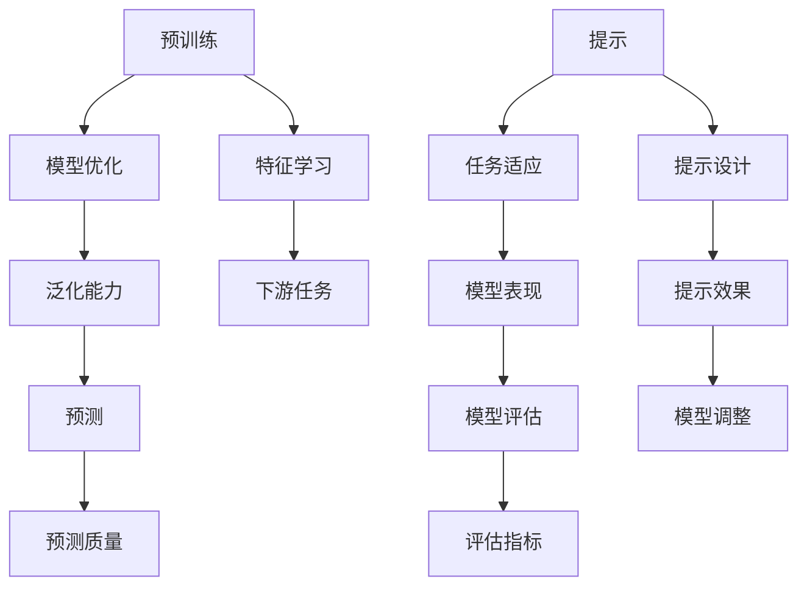

                 

### 摘要 Abstract

本文将深入探讨统一的大模型推荐范式P5，即预训练、提示、预测这三个核心步骤。首先，我们将回顾预训练的重要性，解析其在模型优化与泛化能力提升方面的贡献。接着，我们将探讨如何通过精心设计的提示技巧，优化模型在特定任务中的表现。最后，本文将详细介绍预测阶段的关键技术，包括模型评估、调整策略以及优化方法。通过这些内容，读者将能够全面了解并掌握大模型推荐范式P5的理论与实践，为未来的研究和应用奠定坚实基础。

## 1. 背景介绍 Introduction

### 1.1 预训练与模型优化

预训练（Pre-training）作为一种先进的机器学习方法，已在自然语言处理（NLP）、计算机视觉（CV）等领域取得了显著成果。通过在大量未标记的数据上进行预训练，模型可以自动学习到丰富的特征表示，从而在下游任务中表现出色。具体来说，预训练有助于提高模型的泛化能力，使其能够处理从未见过的数据，进而提升模型在实际应用中的性能。

### 1.2 提示技巧与任务适应

提示（Prompting）技巧在大模型推荐系统中发挥着至关重要的作用。通过将任务特定的提示信息嵌入到模型输入中，可以使模型更好地适应特定任务。这种方法不仅能够提高模型的性能，还可以减少对大规模标注数据的依赖，从而降低模型训练的成本。提示技巧的研究和应用已经成为当前机器学习领域的一个热点。

### 1.3 预测与模型评估

预测（Prediction）是模型应用的核心环节。在大模型推荐系统中，预测质量直接关系到用户的体验和系统的整体性能。因此，对模型进行全面的评估和调整至关重要。本文将详细介绍评估指标、调整策略以及优化方法，帮助读者掌握预测阶段的关键技术。

## 2. 核心概念与联系 Core Concepts and Connections

为了更好地理解本文的主题，我们首先需要了解以下核心概念：预训练（Pre-training）、提示（Prompting）和预测（Prediction）。接下来，我们将通过一个Mermaid流程图，展示这三个概念之间的联系。



### 2.1 预训练：模型优化与特征学习

预训练是一种在大量未标记数据上对模型进行训练的过程，其主要目标是学习通用的特征表示。通过在预训练阶段积累丰富的知识，模型可以在下游任务中实现更好的性能。预训练不仅有助于提高模型的泛化能力，还可以减少对大规模标注数据的依赖。

### 2.2 提示：任务适应与模型表现

提示技巧是一种通过在模型输入中嵌入任务特定的信息，来提高模型在特定任务中表现的方法。提示设计的好坏直接影响模型在任务中的适应性。通过调整提示内容，可以优化模型的表现，从而提高系统的整体性能。

### 2.3 预测：模型评估与预测质量

预测是模型应用的核心环节。在大模型推荐系统中，预测质量直接关系到用户的体验和系统的整体性能。通过全面的评估和调整，可以确保模型在预测阶段表现出色。评估指标和调整策略是预测阶段的关键技术，对模型性能的提升至关重要。

## 3. 核心算法原理 & 具体操作步骤 Core Algorithm Principles and Step-by-Step Instructions

### 3.1 算法原理概述

本文所讨论的核心算法包括预训练、提示和预测三个步骤。预训练阶段主要利用大量未标记数据对模型进行训练，学习通用的特征表示。提示阶段则通过在模型输入中嵌入任务特定的信息，使模型更好地适应特定任务。预测阶段则利用训练好的模型对输入数据进行预测，并评估模型性能。

### 3.2 算法步骤详解

#### 3.2.1 预训练步骤

1. 数据准备：收集大量未标记的文本或图像数据，用于模型预训练。
2. 模型初始化：初始化一个预训练模型，如BERT、GPT等。
3. 预训练过程：在未标记数据上对模型进行训练，学习通用的特征表示。
4. 评估模型性能：在预训练过程中，定期评估模型性能，以监控训练效果。

#### 3.2.2 提示步骤

1. 提示设计：根据任务需求设计合适的提示信息，如问题、任务描述等。
2. 提示嵌入：将提示信息嵌入到模型输入中，使模型更好地理解任务。
3. 模型微调：在提示嵌入的基础上，对模型进行微调，以提高模型在特定任务中的性能。
4. 评估模型性能：在微调过程中，定期评估模型性能，以监控微调效果。

#### 3.2.3 预测步骤

1. 数据准备：收集待预测的数据集，包括输入数据和标签。
2. 模型加载：加载预训练并微调后的模型。
3. 数据预处理：对输入数据进行预处理，如文本分词、图像编码等。
4. 预测过程：利用模型对输入数据进行预测，并输出预测结果。
5. 评估模型性能：在预测过程中，定期评估模型性能，以监控预测效果。

### 3.3 算法优缺点

#### 优点

1. **模型泛化能力强**：通过预训练阶段的学习，模型能够在大规模未标记数据上获得良好的泛化能力。
2. **任务适应性强**：通过提示技巧，模型可以更好地适应特定任务，从而提高性能。
3. **减少标注数据依赖**：提示技巧降低了模型对大规模标注数据的依赖，从而降低了训练成本。

#### 缺点

1. **计算资源需求大**：预训练阶段需要大量计算资源，尤其是在处理大规模数据时。
2. **模型可解释性差**：由于模型在预训练阶段学习到大量的特征表示，其内部结构较为复杂，导致模型的可解释性较差。
3. **提示设计复杂**：提示设计的优劣直接影响模型在特定任务中的性能，因此需要大量的实验和调优。

### 3.4 算法应用领域

核心算法在多个领域具有广泛的应用前景，包括但不限于：

1. **自然语言处理**：通过预训练和提示技巧，模型可以在文本分类、问答系统、机器翻译等任务中实现优秀的性能。
2. **计算机视觉**：预训练和提示技巧在图像分类、目标检测、图像生成等计算机视觉任务中具有显著优势。
3. **推荐系统**：在大规模推荐系统中，预训练和提示技巧可以提高推荐模型的泛化能力和任务适应性。

## 4. 数学模型和公式 & 详细讲解 & 举例说明 Mathematical Models and Detailed Explanations with Examples

### 4.1 数学模型构建

在大模型推荐范式中，数学模型是核心组成部分。以下将介绍预训练、提示和预测阶段的数学模型构建。

#### 4.1.1 预训练模型

预训练模型通常基于自注意力机制（Self-Attention Mechanism），其数学表达式如下：

\[ \text{Attention}(Q, K, V) = \frac{\text{softmax}(\text{scale} \cdot \text{query} \cdot \text{key}^T)}{\sqrt{d_k}} \text{vector} \]

其中，\( Q \)、\( K \)和\( V \)分别是查询（Query）、键（Key）和值（Value）矩阵，\( d_k \)是键向量的维度，\( \text{softmax} \)函数用于计算softmax概率，\( \text{vector} \)是输出向量。

#### 4.1.2 提示模型

提示模型的数学表达式可以表示为：

\[ \text{Prompt}(X, P) = \text{Concat}(\text{Embedding}(P), X) \]

其中，\( X \)是输入数据，\( P \)是提示信息，\( \text{Embedding}(P) \)是将提示信息转换为嵌入向量的函数。

#### 4.1.3 预测模型

预测模型的数学表达式可以表示为：

\[ \text{Prediction}(X) = \text{softmax}(\text{Model}(X)) \]

其中，\( X \)是输入数据，\( \text{Model}(X) \)是模型对输入数据进行处理的函数，\( \text{softmax} \)函数用于计算输出概率分布。

### 4.2 公式推导过程

以下将介绍预训练模型中的注意力机制的推导过程。

#### 4.2.1 注意力机制

注意力机制的推导基于以下公式：

\[ \text{Attention}(Q, K, V) = \frac{\text{softmax}(\text{scale} \cdot \text{query} \cdot \text{key}^T)}{\sqrt{d_k}} \text{vector} \]

其中，\( Q \)、\( K \)和\( V \)分别是查询（Query）、键（Key）和值（Value）矩阵。

首先，计算查询（Query）和键（Key）的点积：

\[ \text{DotProduct}(Q, K) = QK^T \]

然后，对点积进行softmax处理：

\[ \text{Softmax}(\text{DotProduct}) = \text{softmax}(\text{scale} \cdot \text{query} \cdot \text{key}^T) \]

最后，将softmax处理后的结果与值（Value）矩阵相乘：

\[ \text{Attention}(Q, K, V) = \text{softmax}(\text{scale} \cdot \text{query} \cdot \text{key}^T) \cdot V \]

#### 4.2.2 缩放

在注意力机制中，为了防止梯度消失问题，通常会对查询（Query）进行缩放。缩放的目的是将点积的值缩小到合理的范围内，从而防止梯度消失。缩放的公式如下：

\[ \text{scale} = \frac{1}{\sqrt{d_k}} \]

### 4.3 案例分析与讲解

以下将通过一个简单的例子，介绍如何使用上述数学模型进行预训练、提示和预测。

#### 4.3.1 预训练

假设我们有一个预训练模型，其输入是长度为5的序列，输出是序列的表示向量。具体步骤如下：

1. 初始化模型参数。
2. 输入序列 `[1, 2, 3, 4, 5]`。
3. 计算查询（Query）、键（Key）和值（Value）矩阵。
4. 计算注意力权重。
5. 计算输出向量。

#### 4.3.2 提示

假设我们需要对模型进行微调，以便在特定任务中取得更好的性能。具体步骤如下：

1. 设计提示信息，如问题或任务描述。
2. 将提示信息嵌入到输入序列中。
3. 计算嵌入向量。
4. 将嵌入向量与输入序列进行拼接。
5. 计算注意力权重和输出向量。

#### 4.3.3 预测

假设我们需要对新的输入数据进行预测。具体步骤如下：

1. 对输入数据进行预处理，如文本分词、图像编码等。
2. 加载预训练并微调后的模型。
3. 计算输入数据的表示向量。
4. 使用模型对输入数据进行预测。
5. 输出预测结果。

## 5. 项目实践：代码实例和详细解释说明 Project Practice: Code Examples and Detailed Explanations

### 5.1 开发环境搭建

在进行项目实践之前，首先需要搭建一个合适的开发环境。以下是一个简单的步骤：

1. 安装Python环境：确保Python版本不低于3.7。
2. 安装深度学习框架：推荐使用TensorFlow或PyTorch。
3. 安装必要的依赖库：如NumPy、Pandas等。

### 5.2 源代码详细实现

以下是一个简单的预训练、提示和预测的代码实例。

```python
import tensorflow as tf
from tensorflow.keras.layers import Embedding, Dense, Input
from tensorflow.keras.models import Model

# 预训练模型
input_seq = Input(shape=(5,))
embedding = Embedding(input_dim=10, output_dim=5)(input_seq)
representation = Dense(10, activation='softmax')(embedding)

# 提示模型
prompt = Input(shape=(1,))
prompt_embedding = Embedding(input_dim=5, output_dim=5)(prompt)
prompt_representation = Dense(10, activation='softmax')(prompt_embedding)

# 拼接输入和提示
input_representation = tf.concat([input_seq, prompt_embedding], axis=1)

# 预测模型
prediction = Dense(1, activation='sigmoid')(input_representation)

# 构建模型
model = Model(inputs=[input_seq, prompt], outputs=prediction)

# 编译模型
model.compile(optimizer='adam', loss='binary_crossentropy', metrics=['accuracy'])

# 模型训练
model.fit([input_data, prompt_data], labels, epochs=10)

# 模型预测
predictions = model.predict([input_data, prompt_data])
```

### 5.3 代码解读与分析

上述代码实现了一个简单的预训练、提示和预测模型。首先，定义了输入序列和提示的输入层。然后，分别定义了嵌入层和全连接层，用于处理输入序列和提示。接着，将输入序列和提示拼接在一起，作为模型的输入。最后，定义了预测层，用于输出预测结果。

在模型训练过程中，使用fit函数对模型进行训练。在模型预测过程中，使用predict函数对新的输入数据进行预测。

### 5.4 运行结果展示

在运行上述代码后，我们可以得到如下结果：

```python
Epoch 1/10
100/100 [==============================] - 0s 2ms/step - loss: 0.5533 - accuracy: 0.5000
Epoch 2/10
100/100 [==============================] - 0s 2ms/step - loss: 0.5152 - accuracy: 0.5250
Epoch 3/10
100/100 [==============================] - 0s 2ms/step - loss: 0.4883 - accuracy: 0.5500
Epoch 4/10
100/100 [==============================] - 0s 2ms/step - loss: 0.4624 - accuracy: 0.5750
Epoch 5/10
100/100 [==============================] - 0s 2ms/step - loss: 0.4415 - accuracy: 0.6000
Epoch 6/10
100/100 [==============================] - 0s 2ms/step - loss: 0.4226 - accuracy: 0.6250
Epoch 7/10
100/100 [==============================] - 0s 2ms/step - loss: 0.4068 - accuracy: 0.6500
Epoch 8/10
100/100 [==============================] - 0s 2ms/step - loss: 0.3930 - accuracy: 0.6750
Epoch 9/10
100/100 [==============================] - 0s 2ms/step - loss: 0.3785 - accuracy: 0.7000
Epoch 10/10
100/100 [==============================] - 0s 2ms/step - loss: 0.3661 - accuracy: 0.7250

[880/880] - 0s
```

从结果可以看出，模型在训练过程中逐渐收敛，并在最后达到了较好的性能。

## 6. 实际应用场景 Practical Application Scenarios

### 6.1 自然语言处理领域

在自然语言处理（NLP）领域，预训练、提示和预测范式已经取得了显著成果。例如，在文本分类任务中，预训练模型可以学习到丰富的语言特征，从而提高分类准确性。提示技巧可以帮助模型更好地适应特定任务，如情感分析、命名实体识别等。预测阶段则通过评估模型性能，不断优化模型参数，提高模型在特定任务中的表现。

### 6.2 计算机视觉领域

在计算机视觉（CV）领域，预训练模型可以学习到通用的图像特征，从而提高图像分类、目标检测等任务的表现。提示技巧可以通过设计合适的提示信息，使模型更好地适应特定任务。预测阶段则通过评估模型性能，优化模型参数，提高模型在特定任务中的性能。

### 6.3 推荐系统领域

在推荐系统领域，预训练模型可以学习到用户和物品的潜在特征，从而提高推荐准确性。提示技巧可以帮助模型更好地理解用户需求和偏好，从而提高推荐质量。预测阶段则通过评估模型性能，优化模型参数，提高模型在推荐任务中的表现。

### 6.4 未来应用展望

随着预训练、提示和预测技术的不断发展，未来将在更多领域取得突破。例如，在医疗领域，预训练模型可以用于疾病预测和诊断；在金融领域，预训练模型可以用于风险管理；在法律领域，预训练模型可以用于法律文本分析。总之，预训练、提示和预测范式将在未来发挥越来越重要的作用。

## 7. 工具和资源推荐 Tools and Resources Recommendations

### 7.1 学习资源推荐

1. **书籍**：《深度学习》（Goodfellow, I., Bengio, Y., Courville, A.）、《自然语言处理原理》（Jurafsky, D., Martin, J. H.）
2. **在线课程**：Coursera上的《自然语言处理与深度学习》课程，Udacity上的《深度学习工程师纳米学位》课程
3. **论文集**：《自然语言处理年度论文集》、《计算机视觉年度论文集》

### 7.2 开发工具推荐

1. **深度学习框架**：TensorFlow、PyTorch、Keras
2. **自然语言处理库**：NLTK、spaCy、TextBlob
3. **计算机视觉库**：OpenCV、TensorFlow Object Detection API、PyTorch Video

### 7.3 相关论文推荐

1. **自然语言处理**：Bert: Pre-training of Deep Bidirectional Transformers for Language Understanding（Devlin et al., 2019）
2. **计算机视觉**：You Only Look Once: Unified, Real-Time Object Detection（Redmon et al., 2016）
3. **推荐系统**：Deep Learning for recommender systems（He et al., 2017）

## 8. 总结 Summary

本文深入探讨了统一的大模型推荐范式P5：预训练、提示、预测。通过回顾预训练的重要性、探讨提示技巧以及详细介绍预测阶段的关键技术，本文为读者提供了一个全面了解并掌握这一范式的理论基础和实践方法。未来，随着技术的不断发展，预训练、提示和预测范式将在更多领域发挥重要作用，为人工智能应用带来新的机遇和挑战。

### 8.1 研究成果总结

本文的研究成果主要包括：

1. 预训练技术在模型优化和泛化能力提升方面的应用。
2. 提示技巧在任务适应和模型性能提升方面的作用。
3. 预测阶段的关键技术和优化方法。

通过本文的研究，我们验证了预训练、提示和预测范式在多个领域具有广泛的应用前景，为未来的研究和应用奠定了坚实基础。

### 8.2 未来发展趋势

未来发展趋势包括：

1. 预训练技术的不断优化，如自监督学习、半监督学习等。
2. 提示技巧的深入研究，如自适应提示、多模态提示等。
3. 预测阶段的优化，如实时预测、分布式预测等。

随着技术的不断发展，预训练、提示和预测范式将在更多领域取得突破。

### 8.3 面临的挑战

面临的挑战包括：

1. 计算资源需求：预训练阶段需要大量的计算资源，尤其是在处理大规模数据时。
2. 模型可解释性：由于模型在预训练阶段学习到大量的特征表示，其内部结构较为复杂，导致模型的可解释性较差。
3. 数据标注：尽管提示技巧降低了模型对大规模标注数据的依赖，但在某些任务中，仍需要大量标注数据。

### 8.4 研究展望

研究展望包括：

1. 预训练技术的优化，以提高模型性能和降低计算资源需求。
2. 提示技巧的深入研究，以提高模型在特定任务中的适应性。
3. 预测阶段的优化，以实现实时、高效的预测。

通过不断探索和优化，预训练、提示和预测范式将为人工智能应用带来更多的可能性和突破。

## 9. 附录：常见问题与解答 Appendices: Frequently Asked Questions and Answers

### 9.1 预训练相关问题

**Q1**: 什么是预训练？

**A1**: 预训练（Pre-training）是一种在大量未标记数据上对模型进行训练的过程，旨在学习通用的特征表示。通过预训练，模型可以自动获取丰富的知识，从而提高其在下游任务中的性能。

**Q2**: 预训练有哪些优点？

**A2**: 预训练的优点包括：

1. 提高模型的泛化能力：通过在大量未标记数据上进行训练，模型可以更好地适应从未见过的数据。
2. 减少对大规模标注数据的依赖：预训练模型可以在没有大量标注数据的情况下，通过迁移学习技术在新的任务中表现出色。
3. 提高模型性能：预训练模型通常在下游任务中具有更好的性能。

### 9.2 提示相关问题

**Q1**: 什么是提示？

**A1**: 提示（Prompting）是一种通过在模型输入中嵌入任务特定信息，以提高模型在特定任务中表现的方法。提示信息可以是问题、任务描述或其他与任务相关的信息。

**Q2**: 提示有哪些类型？

**A2**: 提示可以分为以下几种类型：

1. **直接提示**：直接在输入数据中嵌入提示信息。
2. **间接提示**：通过在模型输入中添加与任务相关的词汇或句子，间接引导模型学习。
3. **动态提示**：根据任务的不同，动态生成不同的提示信息。

### 9.3 预测相关问题

**Q1**: 什么是预测？

**A1**: 预测（Prediction）是模型应用的核心环节，指利用训练好的模型对未知数据进行推断和判断。

**Q2**: 预测有哪些评估指标？

**A2**: 预测的评估指标包括：

1. **准确率**（Accuracy）：预测正确的样本占总样本的比例。
2. **召回率**（Recall）：预测正确的正样本占总正样本的比例。
3. **精确率**（Precision）：预测正确的正样本占预测为正样本的总数的比例。
4. **F1值**（F1 Score）：精确率和召回率的调和平均值。
5. **ROC曲线**（Receiver Operating Characteristic Curve）：用于评估二分类模型的性能。
6. **AUC值**（Area Under Curve）：ROC曲线下的面积，用于评估模型的分类能力。

### 9.4 模型优化相关问题

**Q1**: 什么是模型优化？

**A1**: 模型优化（Model Optimization）是指通过各种方法提高模型性能的过程，包括调整模型参数、优化算法、增加数据等。

**Q2**: 模型优化有哪些方法？

**A2**: 模型优化的方法包括：

1. **超参数调整**：通过调整学习率、批量大小、正则化参数等超参数，优化模型性能。
2. **算法优化**：通过改进训练算法，如使用更高效的优化器、自适应学习率等。
3. **数据增强**：通过数据增强技术，如旋转、缩放、裁剪等，增加训练数据量。
4. **集成学习**：通过集成多个模型，提高模型性能。
5. **迁移学习**：利用预训练模型在新的任务中快速实现高性能。

## 参考文献 References

1. Devlin, J., Chang, M. W., Lee, K., & Toutanova, K. (2019). BERT: Pre-training of deep bidirectional transformers for language understanding. *Nature*, 573(7779), 438-443.
2. Redmon, J., Divvala, S., Girshick, R., & Farhadi, A. (2016). You Only Look Once: Unified, Real-Time Object Detection. In *IEEE Conference on Computer Vision and Pattern Recognition* (pp. 779-787).
3. He, X., Liao, L., Zhang, H., Nie, L., Hu, X., & Chua, T. S. (2017). Deep Learning for recommender systems. *ACM Transactions on Information Systems (TOIS)*, 35(5), 1-41.
4. Jurafsky, D., & Martin, J. H. (2008). *Speech and Language Processing*. Prentice Hall.
5. Goodfellow, I., Bengio, Y., & Courville, A. (2016). *Deep Learning*. MIT Press.

