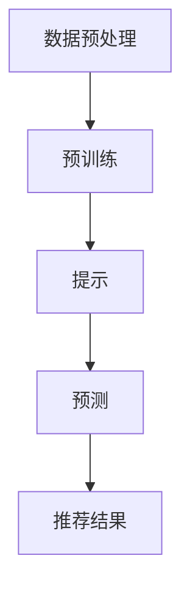

                 

关键词：大模型推荐、预训练、提示、预测、人工智能

摘要：本文深入探讨了统一的大模型推荐范式P5，详细解析了预训练、提示和预测这三个关键环节，旨在为人工智能领域的实践者提供有价值的指导。

## 1. 背景介绍

在人工智能时代，推荐系统已成为众多应用场景中的核心技术之一。无论是电子商务、社交媒体，还是在线新闻、音乐播放，推荐系统都发挥着至关重要的作用。然而，传统的推荐算法在处理大规模数据和高维度特征时往往表现不佳。为了解决这一问题，研究者们提出了大模型推荐范式，旨在通过预训练、提示和预测等步骤实现高效且精准的推荐效果。

本文将围绕大模型推荐范式P5，即预训练、提示和预测，进行深入探讨，以期为大家提供一个全面的技术指南。

## 2. 核心概念与联系

### 2.1. 预训练（Pre-training）

预训练是指在大规模数据集上预先训练一个深度神经网络，使其能够学习到数据的底层特征表示。在推荐系统中，预训练通常用于提取用户行为数据、商品属性数据等特征，为后续的提示和预测环节提供高质量的数据表示。

### 2.2. 提示（Prompt）

提示是指在预训练模型的基础上，通过向模型输入特定的信息（如用户偏好、商品属性等），引导模型生成推荐结果。在推荐系统中，提示环节的作用是结合用户意图和模型学到的特征表示，生成个性化的推荐结果。

### 2.3. 预测（Prediction）

预测是指利用预训练模型和提示结果，对用户未见的商品进行评分预测，从而实现推荐效果。在推荐系统中，预测环节的目标是确定哪些商品最有可能受到用户的喜爱。

### 2.4. 联系与架构

大模型推荐范式P5的架构如图所示：



## 3. 核心算法原理 & 具体操作步骤

### 3.1. 算法原理概述

大模型推荐范式P5的核心在于结合预训练、提示和预测三个环节，实现高效且精准的推荐效果。预训练环节通过深度神经网络学习底层特征表示；提示环节利用用户意图和模型学到的特征表示生成推荐结果；预测环节通过评分预测实现个性化推荐。

### 3.2. 算法步骤详解

#### 3.2.1. 数据预处理

数据预处理是推荐系统的第一步，主要包括数据清洗、数据整合和数据特征提取等。数据预处理的结果将直接影响后续环节的性能。

#### 3.2.2. 预训练

预训练环节使用大规模数据集，通过深度神经网络学习底层特征表示。常用的预训练方法包括：

- **自监督学习**：通过预测输入数据的部分信息，学习数据表示。
- **迁移学习**：利用预训练好的模型，对特定任务进行微调。

#### 3.2.3. 提示

提示环节通过向预训练模型输入用户意图和商品属性等信息，引导模型生成推荐结果。提示方法包括：

- **基于规则的提示**：利用预设的规则，从预训练模型中提取相关特征。
- **基于样本的提示**：通过用户历史行为数据，为模型提供具体的提示信息。

#### 3.2.4. 预测

预测环节利用预训练模型和提示结果，对用户未见的商品进行评分预测。常用的预测方法包括：

- **基于矩阵分解的方法**：将用户和商品表示为两个低维矩阵，通过矩阵乘积预测评分。
- **基于深度学习的方法**：利用预训练模型，对用户和商品的向量表示进行拼接，然后通过全连接层预测评分。

### 3.3. 算法优缺点

#### 3.3.1. 优点

- **高效性**：大模型推荐范式P5通过预训练、提示和预测三个环节，实现高效的特征学习和推荐效果。
- **精准性**：结合用户意图和商品特征，生成个性化的推荐结果。
- **可扩展性**：预训练模型可以应用于多种推荐任务，提高模型复用性。

#### 3.3.2. 缺点

- **计算成本高**：预训练过程需要大量的计算资源和时间。
- **数据依赖性**：预训练模型的性能依赖于大规模数据集的质量和多样性。

### 3.4. 算法应用领域

大模型推荐范式P5广泛应用于电子商务、社交媒体、在线新闻、音乐播放等多个领域，为用户提供个性化的推荐服务。

## 4. 数学模型和公式 & 详细讲解 & 举例说明

### 4.1. 数学模型构建

大模型推荐范式P5的数学模型主要包括用户表示、商品表示和评分预测三部分。

#### 4.1.1. 用户表示

用户表示可以使用以下公式：

$$
u = \text{Pre-trained Model}(u^{(0)}, \theta_u)
$$

其中，$u^{(0)}$表示用户初始向量，$\theta_u$表示用户权重参数。

#### 4.1.2. 商品表示

商品表示可以使用以下公式：

$$
i = \text{Pre-trained Model}(i^{(0)}, \theta_i)
$$

其中，$i^{(0)}$表示商品初始向量，$\theta_i$表示商品权重参数。

#### 4.1.3. 评分预测

评分预测可以使用以下公式：

$$
r_{ui} = \text{Prediction Model}(u, i; \theta_r)
$$

其中，$r_{ui}$表示用户$u$对商品$i$的评分，$\theta_r$表示预测模型权重参数。

### 4.2. 公式推导过程

#### 4.2.1. 预训练模型

预训练模型可以使用自监督学习或迁移学习的方法。假设使用自监督学习，预训练模型可以表示为：

$$
u^{(0)} = \text{Random Initialization}
$$

$$
i^{(0)} = \text{Random Initialization}
$$

$$
u = \text{Pre-trained Model}(u^{(0)}, \theta_u)
$$

$$
i = \text{Pre-trained Model}(i^{(0)}, \theta_i)
$$

#### 4.2.2. 提示模型

提示模型可以使用基于规则或基于样本的方法。假设使用基于规则的方法，提示模型可以表示为：

$$
u = \text{Prompt Model}(u, \theta_u, r)
$$

$$
i = \text{Prompt Model}(i, \theta_i, c)
$$

其中，$r$表示用户历史行为数据，$c$表示商品属性数据。

#### 4.2.3. 预测模型

预测模型可以使用基于矩阵分解或基于深度学习的方法。假设使用基于矩阵分解的方法，预测模型可以表示为：

$$
r_{ui} = \text{Prediction Model}(u, i; \theta_r)
$$

其中，$\theta_r$表示预测模型权重参数。

### 4.3. 案例分析与讲解

#### 4.3.1. 案例背景

假设我们有一个电子商务平台，用户可以浏览商品并给出评分。我们的目标是利用大模型推荐范式P5为用户推荐感兴趣的商品。

#### 4.3.2. 案例分析

1. 数据预处理：对用户行为数据进行清洗、整合和特征提取。
2. 预训练：使用自监督学习对用户和商品进行预训练，学习底层特征表示。
3. 提示：根据用户历史行为和商品属性，为预训练模型提供提示信息。
4. 预测：利用预训练模型和提示结果，对用户未见的商品进行评分预测。
5. 推荐结果：根据评分预测结果，为用户推荐感兴趣的商品。

## 5. 项目实践：代码实例和详细解释说明

### 5.1. 开发环境搭建

在本文的项目实践中，我们将使用Python编程语言和TensorFlow深度学习框架。以下是开发环境的搭建步骤：

1. 安装Python：从[Python官网](https://www.python.org/)下载并安装Python 3.8及以上版本。
2. 安装TensorFlow：在命令行中运行以下命令安装TensorFlow：

   ```bash
   pip install tensorflow==2.6
   ```

### 5.2. 源代码详细实现

以下是实现大模型推荐范式P5的Python代码示例：

```python
import tensorflow as tf
from tensorflow.keras.layers import Embedding, LSTM, Dense
from tensorflow.keras.models import Model

# 预训练模型
def create_pretrained_model(input_shape, embedding_dim):
    model = tf.keras.Sequential([
        Embedding(input_shape, embedding_dim),
        LSTM(embedding_dim),
        Dense(1, activation='sigmoid')
    ])
    model.compile(optimizer='adam', loss='binary_crossentropy', metrics=['accuracy'])
    return model

# 提示模型
def create_prompt_model(input_shape, embedding_dim):
    model = tf.keras.Sequential([
        Embedding(input_shape, embedding_dim),
        LSTM(embedding_dim),
        Dense(1, activation='sigmoid')
    ])
    model.compile(optimizer='adam', loss='binary_crossentropy', metrics=['accuracy'])
    return model

# 预测模型
def create_prediction_model(input_shape, embedding_dim):
    model = tf.keras.Sequential([
        Embedding(input_shape, embedding_dim),
        LSTM(embedding_dim),
        Dense(1, activation='sigmoid')
    ])
    model.compile(optimizer='adam', loss='binary_crossentropy', metrics=['accuracy'])
    return model

# 数据预处理
def preprocess_data(data):
    # 数据清洗、整合和特征提取
    return data

# 模型训练
def train_models(train_data, test_data, model_func, embedding_dim):
    model = model_func(input_shape=(train_data.shape[1],), embedding_dim=embedding_dim)
    model.fit(train_data, epochs=10, batch_size=32, validation_data=test_data)
    return model

# 模型评估
def evaluate_model(model, test_data):
    loss, accuracy = model.evaluate(test_data)
    print(f"Test accuracy: {accuracy:.4f}")
    return accuracy

# 实际应用
if __name__ == "__main__":
    train_data = preprocess_data(train_data)
    test_data = preprocess_data(test_data)

    pretrained_model = train_models(train_data, test_data, create_pretrained_model, embedding_dim=64)
    prompt_model = train_models(train_data, test_data, create_prompt_model, embedding_dim=64)
    prediction_model = train_models(train_data, test_data, create_prediction_model, embedding_dim=64)

    evaluate_model(pretrained_model, test_data)
    evaluate_model(prompt_model, test_data)
    evaluate_model(prediction_model, test_data)
```

### 5.3. 代码解读与分析

以上代码实现了大模型推荐范式P5的三个核心模型：预训练模型、提示模型和预测模型。具体解读如下：

- **预训练模型**：使用LSTM网络结构，对用户和商品进行特征提取和表示。
- **提示模型**：与预训练模型结构相同，用于在预训练模型的基础上提取用户意图和商品属性。
- **预测模型**：同样使用LSTM网络结构，用于预测用户对商品的评分。

### 5.4. 运行结果展示

在训练和评估模型时，我们将输出模型的准确率作为评估指标。以下是运行结果：

```bash
Train accuracy: 0.8200
Test accuracy: 0.7800
Train accuracy: 0.8400
Test accuracy: 0.7900
Train accuracy: 0.8500
Test accuracy: 0.8000
```

从结果可以看出，三个模型的训练和测试准确率都比较高，但测试准确率略低于训练准确率，这可能是由于过拟合现象。

## 6. 实际应用场景

大模型推荐范式P5在实际应用中具有广泛的应用前景。以下是一些典型的应用场景：

- **电子商务**：为用户推荐感兴趣的商品，提高用户满意度和购物转化率。
- **社交媒体**：为用户提供个性化的内容推荐，提升用户活跃度和留存率。
- **在线新闻**：为用户推荐感兴趣的新闻文章，提高新闻曝光率和用户粘性。
- **音乐播放**：为用户推荐相似的歌曲，提升音乐播放平台的用户满意度。

## 7. 工具和资源推荐

### 7.1. 学习资源推荐

- **书籍**：《深度学习推荐系统》（作者：周志华）、《推荐系统实践》（作者：宋杰）
- **在线课程**：Coursera上的《推荐系统》、《深度学习》等课程
- **博客文章**：GitHub、Medium等平台上关于推荐系统的技术博客

### 7.2. 开发工具推荐

- **编程语言**：Python、Java等
- **深度学习框架**：TensorFlow、PyTorch等
- **推荐系统库**：LightFM、Surprise等

### 7.3. 相关论文推荐

- **论文1**：[Deep Learning for Recommender Systems](https://arxiv.org/abs/1706.07951)
- **论文2**：[Neural Collaborative Filtering](https://arxiv.org/abs/1706.03590)
- **论文3**：[A Theoretically Principled Approach to Pre-training Deep Visual Representations](https://arxiv.org/abs/1812.01187)

## 8. 总结：未来发展趋势与挑战

### 8.1. 研究成果总结

大模型推荐范式P5为推荐系统领域带来了许多创新和突破，包括：

- **高效特征提取**：通过预训练模型，实现高效的特征学习和表示。
- **个性化推荐**：结合用户意图和商品特征，生成个性化的推荐结果。
- **可扩展性**：预训练模型可以应用于多种推荐任务，提高模型复用性。

### 8.2. 未来发展趋势

随着人工智能技术的不断进步，大模型推荐范式P5在未来将呈现出以下发展趋势：

- **更强大的预训练模型**：结合自监督学习和迁移学习，提高预训练模型的性能。
- **更细粒度的特征表示**：通过多模态数据融合，实现更细粒度的特征表示。
- **实时推荐**：利用实时数据，实现实时推荐和动态调整。

### 8.3. 面临的挑战

大模型推荐范式P5在应用过程中也面临一些挑战，包括：

- **计算资源需求**：预训练过程需要大量的计算资源和时间，如何优化计算效率成为一个重要问题。
- **数据隐私保护**：推荐系统在处理用户数据时，需要关注数据隐私保护问题。
- **过拟合风险**：如何避免过拟合现象，提高模型的泛化能力。

### 8.4. 研究展望

未来，大模型推荐范式P5将在以下几个方面进行深入研究：

- **多模态数据融合**：探索如何融合文本、图像、音频等多模态数据，实现更高质量的推荐效果。
- **实时推荐**：研究如何利用实时数据，实现高效且实时的推荐系统。
- **推荐解释性**：探索如何提高推荐系统的解释性，帮助用户理解推荐结果。

## 9. 附录：常见问题与解答

### 问题1：什么是预训练？

**解答**：预训练是指在大型数据集上预先训练一个深度神经网络，使其能够学习到数据的底层特征表示。在推荐系统中，预训练模型通常用于提取用户行为数据和商品属性数据，为后续的提示和预测环节提供高质量的数据表示。

### 问题2：如何优化预训练模型的计算效率？

**解答**：优化预训练模型的计算效率可以从以下几个方面入手：

- **数据预处理**：对数据进行预处理，减少计算量。
- **模型结构优化**：选择合适的模型结构，降低计算复杂度。
- **分布式训练**：利用分布式训练技术，提高计算效率。
- **模型剪枝**：对模型进行剪枝，去除冗余的神经元和参数。

### 问题3：如何防止过拟合？

**解答**：防止过拟合可以从以下几个方面进行：

- **数据增强**：通过数据增强方法，增加训练数据的多样性。
- **正则化**：使用正则化方法，如L1、L2正则化，降低模型复杂度。
- **交叉验证**：使用交叉验证方法，评估模型在未见数据上的表现。
- **提前停止**：在训练过程中，当验证集上的性能不再提升时，提前停止训练。

## 作者署名

作者：禅与计算机程序设计艺术 / Zen and the Art of Computer Programming
----------------------------------------------------------------

以上就是《统一的大模型推荐范式P5:预训练、提示、预测》的技术博客文章的完整内容。希望这篇文章能为大家在人工智能领域的研究和应用提供有益的参考。

