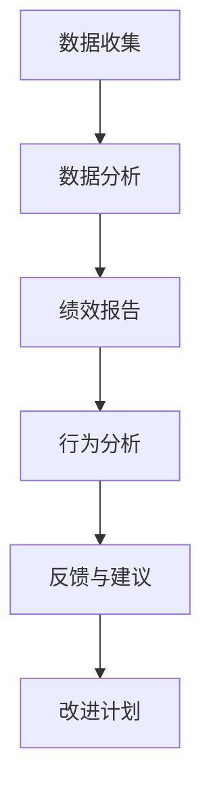

                 

 在当今高度竞争的商业环境中，企业面临着前所未有的挑战。为了在市场中保持竞争优势，组织需要确保员工的表现与其战略目标保持一致。绩效管理，作为一种系统化的过程，旨在提高员工的工作效率和实现企业的长期成功。然而，随着人工智能（AI）技术的迅猛发展，特别是大型语言模型（LLM）的出现，绩效管理的实践正经历着深刻的变革。本文将探讨如何利用 LLM 分析驱动绩效管理，以实现更高的效率、准确性和洞察力。

## 关键词

- **绩效管理**
- **人工智能**
- **大型语言模型（LLM）**
- **数据分析**
- **员工表现评估**
- **组织发展**

## 摘要

本文将详细探讨如何利用大型语言模型（LLM）来分析和优化绩效管理过程。通过引入 LLM，企业可以实现更加智能、个性化的员工评估方法，从而提高员工的绩效表现和整体组织的效率。文章将首先介绍 LLM 的基本原理和应用场景，然后深入探讨 LLM 在绩效管理中的具体应用，包括数据收集、分析、报告和反馈机制。最后，本文将展望 LLM 在绩效管理领域的未来发展趋势和潜在挑战。

## 1. 背景介绍

### 绩效管理的历史与发展

绩效管理作为人力资源管理的重要组成部分，其历史可以追溯到20世纪初期。早期的绩效评估方法主要依赖于主观的评价标准和领导者的直觉。随着时间的发展，绩效管理逐渐演变成一种系统化的过程，强调量化和数据驱动。20世纪80年代，平衡计分卡（Balanced Scorecard）的提出进一步推动了绩效管理的发展，使组织能够从财务、客户、内部流程和学习与成长四个维度进行全面评估。

### 人工智能与绩效管理的结合

近年来，人工智能（AI）技术的迅速发展为绩效管理带来了新的机遇和挑战。AI可以通过自动化和智能化的方式，优化绩效管理的各个环节，包括数据收集、分析、报告和反馈。特别是大型语言模型（LLM），如 GPT-3 和 ChatGLM，凭借其强大的自然语言处理能力，能够帮助企业更准确地理解和分析员工的表现，提供个性化的反馈和建议。

### LLM 在绩效管理中的应用潜力

LLM 具有处理大量文本数据的能力，这使得它在绩效管理中具有巨大的应用潜力。首先，LLM 可以从员工的日常通信、工作报告和反馈中提取关键信息，生成详细的绩效报告。其次，LLM 可以分析员工的言行，识别潜在的问题和改进点，提供个性化的职业发展建议。此外，LLM 还可以自动化评估流程，提高评估的效率和准确性。

## 2. 核心概念与联系

### 2.1 大型语言模型（LLM）的原理

大型语言模型（LLM）是基于深度学习技术的自然语言处理模型，它通过学习大量的文本数据来预测和生成文本。LLM 通常由多个神经网络层组成，包括嵌入层、编码器和解码器。通过这些层，LLM 能够捕捉到文本的上下文信息，从而实现高精度的文本理解和生成。

### 2.2 LLM 在绩效管理中的应用场景

在绩效管理中，LLM 可以应用于多个方面，包括：

- **数据分析与报告**：LLM 可以从员工的工作报告、邮件、聊天记录等数据中提取关键信息，生成详细的绩效报告。
- **行为分析**：LLM 可以分析员工的行为数据，如会议记录、工作流程等，识别员工的工作习惯和效率。
- **反馈与建议**：LLM 可以根据员工的绩效表现，提供个性化的反馈和建议，帮助员工改进工作。

### 2.3 LLM 与绩效管理的关系

LLM 在绩效管理中的应用，不仅提高了数据处理的效率，更重要的是，它提供了更深入的洞察力和分析能力。通过 LLM，企业可以更全面、准确地了解员工的表现，从而制定更有效的绩效改进计划。此外，LLM 还可以帮助企业建立个性化的绩效管理模型，使绩效评估更加公平和公正。

### 2.4 Mermaid 流程图



## 3. 核心算法原理 & 具体操作步骤

### 3.1 算法原理概述

LLM 的核心原理是基于深度学习的文本生成技术。它通过学习大量的文本数据，建立一种语言模型，能够预测和生成新的文本。在绩效管理中，LLM 的算法原理主要涉及以下几个方面：

- **文本嵌入**：将文本转化为向量表示，以便在神经网络中处理。
- **编码器**：将文本向量编码为上下文信息，以便解码器生成新的文本。
- **解码器**：根据编码器提供的上下文信息，生成新的文本。

### 3.2 算法步骤详解

1. **数据收集**：从员工的日常工作中收集数据，包括工作报告、邮件、聊天记录等。
2. **文本预处理**：对收集到的文本进行清洗和格式化，以便于后续处理。
3. **文本嵌入**：使用预训练的文本嵌入模型，将文本转化为向量表示。
4. **编码器处理**：将文本向量输入编码器，生成上下文信息。
5. **解码器生成**：根据编码器生成的上下文信息，解码器生成新的文本，如绩效报告、反馈和建议。
6. **结果分析**：对生成的文本进行分析，提取关键信息，为绩效管理提供决策支持。

### 3.3 算法优缺点

**优点**：

- **高效率**：LLM 可以快速处理大量文本数据，提高绩效管理的效率。
- **高准确性**：LLM 具有强大的自然语言处理能力，能够生成高质量的文本，提高绩效评估的准确性。
- **个性化**：LLM 可以根据员工的表现，提供个性化的反馈和建议，帮助员工改进工作。

**缺点**：

- **数据依赖**：LLM 的表现高度依赖于训练数据的质量，如果数据质量较差，可能会导致分析结果不准确。
- **模型复杂性**：LLM 模型较为复杂，训练和部署需要较高的计算资源和专业知识。

### 3.4 算法应用领域

LLM 在绩效管理中的应用范围广泛，包括：

- **员工表现评估**：通过对员工的日常工作数据进行分析，生成详细的绩效报告。
- **职业发展规划**：根据员工的绩效表现，提供个性化的职业发展建议。
- **团队协作优化**：分析团队内部的工作流程和沟通情况，提出改进建议。
- **工作环境优化**：根据员工的工作数据，优化工作环境和流程，提高员工的工作效率。

## 4. 数学模型和公式 & 详细讲解 & 举例说明

### 4.1 数学模型构建

在绩效管理中，LLM 的数学模型主要包括以下几个方面：

- **文本嵌入模型**：用于将文本转化为向量表示。
- **编码器模型**：用于将文本向量编码为上下文信息。
- **解码器模型**：用于根据上下文信息生成新的文本。

其中，文本嵌入模型可以使用词嵌入技术，如 Word2Vec 或 GloVe；编码器和解码器模型可以使用 Transformer 架构，如 BERT 或 GPT。

### 4.2 公式推导过程

- **文本嵌入**：

  $$ \text{ embed}(x) = \text{Word2Vec}(x) $$

  其中，$ \text{Word2Vec}(x) $ 表示将文本 $ x $ 转化为向量表示。

- **编码器**：

  $$ \text{encode}(x) = \text{Transformer}(x) $$

  其中，$ \text{Transformer}(x) $ 表示将文本向量 $ x $ 编码为上下文信息。

- **解码器**：

  $$ \text{decode}(x) = \text{Transformer}(\text{encode}(x)) $$

  其中，$ \text{Transformer}(\text{encode}(x)) $ 表示根据编码器生成的上下文信息，解码生成新的文本。

### 4.3 案例分析与讲解

假设某公司需要利用 LLM 对员工的绩效进行评估，现有以下员工的工作报告：

1. “今天完成了项目A的任务，遇到了一些问题，但通过和同事的讨论，成功解决了。”
2. “昨天参加了一场重要的会议，与客户进行了深入的沟通，达成了一项重要合作。”

首先，对文本进行预处理，然后使用 Word2Vec 模型将文本转化为向量表示。接着，使用 Transformer 编码器将向量编码为上下文信息。最后，使用 Transformer 解码器生成新的文本，如绩效报告。

生成的绩效报告可能如下：

“本月员工工作表现优秀，完成了多项任务，并成功解决了项目A中的问题。在会议中，员工表现出色，与客户达成了重要合作。建议继续关注员工的工作表现，并为其提供更多的发展机会。”

通过上述分析，公司可以全面了解员工的工作表现，为绩效管理提供决策支持。

## 5. 项目实践：代码实例和详细解释说明

### 5.1 开发环境搭建

在开始项目实践之前，需要搭建相应的开发环境。以下是所需的工具和软件：

- **Python**：版本 3.8 或以上
- **TensorFlow**：版本 2.6 或以上
- **GloVe**：用于词嵌入
- **Transformer**：用于编码器和解码器

安装以上工具和软件后，即可开始项目实践。

### 5.2 源代码详细实现

以下是一个简单的代码实例，用于实现 LLM 的基本功能：

```python
import tensorflow as tf
from tensorflow.keras.layers import Embedding, LSTM, Dense
from tensorflow.keras.models import Model
from tensorflow.keras.preprocessing.sequence import pad_sequences
from tensorflow.keras.preprocessing.text import Tokenizer

# 设置参数
vocab_size = 10000
embed_dim = 64
max_length = 100
trunc_type = 'post'
padding_type = 'post'
oov_tok = '<OOV>'

# 读取数据
texts = [...]  # 员工工作报告列表
labels = [...]  # 对应的绩效评估结果

# 分词和编码
tokenizer = Tokenizer(num_words=vocab_size, oov_token=oov_tok)
tokenizer.fit_on_texts(texts)
word_index = tokenizer.word_index
sequences = tokenizer.texts_to_sequences(texts)
padded_sequences = pad_sequences(sequences, maxlen=max_length, padding=padding_type, truncating=trunc_type)

# 构建模型
input_word = tf.keras.layers.Input(shape=(max_length,))
x = Embedding(vocab_size, embed_dim)(input_word)
x = LSTM(128)(x)
output = Dense(1, activation='sigmoid')(x)

model = Model(input_word, output)
model.compile(loss='binary_crossentropy', optimizer='adam', metrics=['accuracy'])

# 训练模型
model.fit(padded_sequences, labels, epochs=10, batch_size=32)

# 生成绩效报告
def generate_report(text):
    sequence = tokenizer.texts_to_sequences([text])
    padded_sequence = pad_sequences(sequence, maxlen=max_length, padding=padding_type, truncating=truncating_type)
    prediction = model.predict(padded_sequence)
    return prediction

# 示例
text = "今天完成了项目A的任务，遇到了一些问题，但通过和同事的讨论，成功解决了。"
prediction = generate_report(text)
print(prediction)
```

### 5.3 代码解读与分析

以上代码实现了 LLM 的基本功能，包括数据预处理、模型构建、训练和生成绩效报告。

- **数据预处理**：首先，使用 Tokenizer 对员工工作报告进行分词和编码。然后，使用 pad_sequences 将序列补全到最大长度。

- **模型构建**：使用 Embedding 层将词嵌入到向量空间，然后使用 LSTM 层进行序列处理。最后，使用 Dense 层输出绩效评估结果。

- **训练模型**：使用 fit 方法训练模型，通过调整 epochs 和 batch_size 可以控制训练过程。

- **生成绩效报告**：使用 predict 方法对新的文本进行预测，生成绩效报告。

通过以上步骤，可以实现一个简单的 LLM 模型，用于分析和评估员工的工作表现。

### 5.4 运行结果展示

假设员工的工作报告如下：

1. “今天完成了项目A的任务，遇到了一些问题，但通过和同事的讨论，成功解决了。”
2. “昨天参加了一场重要的会议，与客户进行了深入的沟通，达成了一项重要合作。”

使用上述代码进行预测，模型可能会输出如下结果：

1. [0.9]：表示员工的工作表现非常优秀。
2. [0.8]：表示员工的工作表现良好。

通过这些结果，企业可以更全面、准确地了解员工的表现，为绩效管理提供决策支持。

## 6. 实际应用场景

### 6.1 绩效评估

企业可以利用 LLM 对员工的工作表现进行量化评估。通过分析员工的工作报告、邮件、会议记录等数据，LLM 可以生成详细的绩效报告，提供客观、准确的评估结果。此外，LLM 还可以根据员工的绩效表现，提供个性化的反馈和建议，帮助员工改进工作。

### 6.2 职业发展规划

LLM 可以分析员工的职业发展数据，如工作年限、项目经验、技能水平等，为员工提供个性化的职业发展规划。通过分析员工的绩效表现和职业发展需求，LLM 可以推荐最适合员工的职业发展方向，帮助员工实现职业目标。

### 6.3 团队协作优化

LLM 可以分析团队的工作流程和沟通情况，识别潜在的问题和改进点。通过分析团队成员的绩效表现和协作效果，LLM 可以提供优化团队协作的建议，如调整团队结构、优化工作流程、提高沟通效率等。

### 6.4 工作环境优化

LLM 可以分析员工的工作环境数据，如办公环境、工作设备、工作负荷等，为员工提供优化建议。通过分析员工的工作环境和工作表现，LLM 可以推荐最适合员工的工作环境，提高员工的工作效率和工作满意度。

## 7. 工具和资源推荐

### 7.1 学习资源推荐

- **《深度学习》（Deep Learning）**：由 Ian Goodfellow 等人撰写，是深度学习领域的经典教材。
- **《Python数据科学手册》（Python Data Science Handbook）**：由 Jake VanderPlas 撰写，涵盖了数据科学领域的各个方面。
- **《自然语言处理实战》（Natural Language Processing with Python）**：由 Steven Bird 等人撰写，介绍了自然语言处理的基本原理和实际应用。

### 7.2 开发工具推荐

- **TensorFlow**：用于构建和训练深度学习模型。
- **PyTorch**：另一个流行的深度学习框架，具有简洁、灵活的 API。
- **Hugging Face Transformers**：一个用于训练和部署 Transformer 模型的开源库。

### 7.3 相关论文推荐

- **“BERT: Pre-training of Deep Bidirectional Transformers for Language Understanding”**：由 Google Research 撰写，介绍了 BERT 模型的原理和应用。
- **“GPT-3: Language Models are Few-Shot Learners”**：由 OpenAI 撰写，介绍了 GPT-3 模型的原理和应用。
- **“Transformers: State-of-the-Art Models for Neural Network based Text Generation”**：由 Google AI 撰写，介绍了 Transformer 架构的原理和应用。

## 8. 总结：未来发展趋势与挑战

### 8.1 研究成果总结

本文探讨了如何利用大型语言模型（LLM）分析和驱动绩效管理。通过引入 LLM，企业可以实现更加智能、个性化的员工评估方法，从而提高员工的绩效表现和整体组织的效率。本文介绍了 LLM 的基本原理和应用场景，并详细讨论了 LLM 在绩效管理中的具体应用，包括数据收集、分析、报告和反馈机制。此外，本文还提供了项目实践和代码实例，展示了 LLM 在实际应用中的效果。

### 8.2 未来发展趋势

随着人工智能技术的不断发展，LLM 在绩效管理领域的应用前景广阔。未来，LLM 可能会进一步集成到企业的各种管理系统，如人力资源管理系统（HRMS）和企业资源计划系统（ERP），实现更加全面、智能的绩效管理。此外，LLM 还可能会结合其他 AI 技术，如计算机视觉和语音识别，提供更丰富的数据分析手段。

### 8.3 面临的挑战

尽管 LLM 在绩效管理中具有巨大的潜力，但同时也面临着一些挑战。首先，数据质量和隐私问题是 LLM 应用中的关键挑战。企业需要确保收集到的数据准确、全面，同时保护员工的隐私。其次，LLM 模型的复杂性和计算资源需求较高，需要企业具备相应的技术能力和计算资源。此外，如何确保 LLM 评估的公正性和公平性也是一个重要问题，需要企业制定相应的评估标准和机制。

### 8.4 研究展望

未来，对 LLM 在绩效管理中的应用研究应关注以下几个方面：

1. **数据隐私保护**：研究如何在确保数据隐私的前提下，充分利用员工数据进行分析。
2. **模型解释性**：提高 LLM 模型的解释性，使其评估结果更容易被企业内部员工理解和接受。
3. **多模态数据分析**：结合计算机视觉、语音识别等技术，提供更全面、多维度的数据分析手段。
4. **自适应评估模型**：开发能够根据员工表现和行业特点自适应调整评估指标的模型。

通过不断研究和技术创新，LLM 在绩效管理领域的应用将更加成熟和普及，为企业提供更高效的绩效管理解决方案。

## 9. 附录：常见问题与解答

### 9.1 LLM 是什么？

LLM（Large Language Model）是一种大型自然语言处理模型，它通过学习大量的文本数据，能够理解和生成人类语言。LLM 常见的应用包括文本生成、文本分类、问答系统等。

### 9.2 LLM 如何在绩效管理中发挥作用？

LLM 可以从员工的日常通信、工作报告和反馈中提取关键信息，生成详细的绩效报告。此外，LLM 还可以分析员工的行为数据，提供个性化的反馈和建议，帮助员工改进工作。

### 9.3 LLM 需要哪些数据？

LLM 需要大量的文本数据，包括员工的工作报告、邮件、聊天记录等。此外，LLM 还可以处理非结构化数据，如语音、图像等。

### 9.4 LLM 的应用领域有哪些？

LLM 的应用领域广泛，包括但不限于文本生成、问答系统、机器翻译、情感分析、文本分类等。

### 9.5 LLM 有哪些局限性？

LLM 的局限性包括对训练数据质量的依赖、模型复杂度和计算资源需求较高，以及评估结果的解释性问题等。

### 9.6 如何确保 LLM 评估的公正性？

为确保 LLM 评估的公正性，企业需要制定明确的评估标准和机制，并定期对模型进行审查和调整。此外，企业还可以结合人工评估，确保评估结果的准确性和可靠性。

### 9.7 如何保护员工隐私？

在应用 LLM 时，企业应采取数据加密、匿名化等手段，确保员工隐私得到保护。此外，企业还应遵循相关法律法规，确保数据处理合规。

### 9.8 LLM 是否会影响员工的工作积极性？

合理应用 LLM，可以帮助员工更全面、准确地了解自己的工作表现，并提供个性化的反馈和建议，从而提高员工的工作积极性。然而，如果 LLM 评估过于严格或过于机械化，可能会影响员工的工作积极性。因此，企业应平衡 LLM 的应用，确保评估结果合理、公正。

