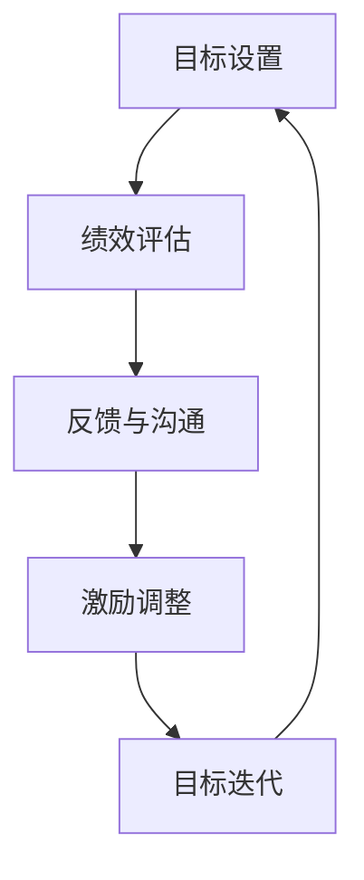
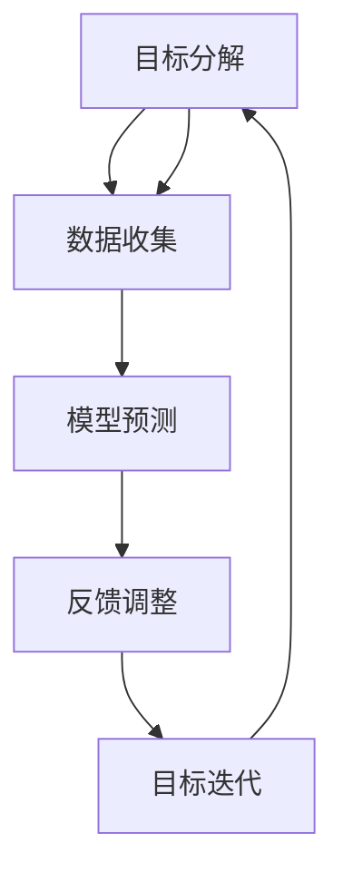
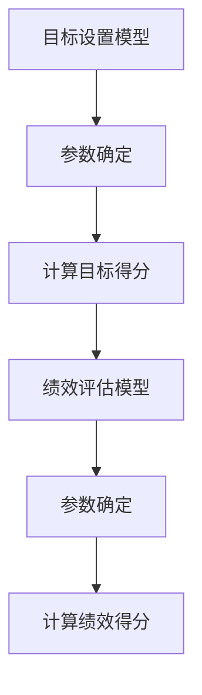
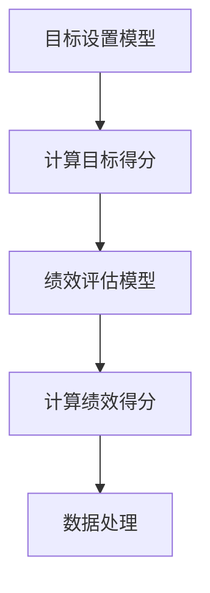
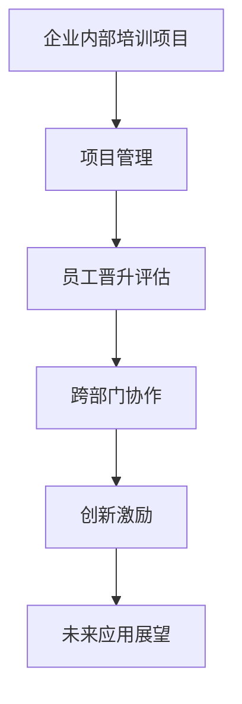
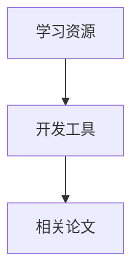
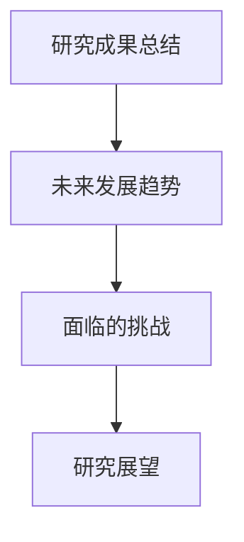

                 

### 关键词 Keywords

- 绩效管理
- 激励系统
- 目标达成
- 员工激励
- 目标设置
- 绩效评估
- 组织发展

<|assistant|>### 摘要 Abstract

本文将探讨绩效管理的核心概念、体系构建、激励机制以及其在现代IT组织中的应用。通过深入分析绩效管理的定义、重要性，以及如何设置明确的目标、评估绩效、激励员工，文章旨在为IT企业构建一个高效、可持续的绩效管理系统提供实用的指导和建议。同时，还将探讨未来绩效管理的发展趋势和面临的挑战，以及相关工具和资源的推荐。

<|assistant|>### 1. 背景介绍 Background

在现代企业中，尤其是IT行业，员工的表现和企业的成功密切相关。绩效管理作为一种系统的管理方法，旨在确保员工的工作行为和结果与组织的战略目标保持一致。随着全球化竞争的加剧和技术的快速发展，企业对绩效管理的要求也在不断提升。有效的绩效管理不仅能提高员工的工作效率，还能促进组织的创新能力和竞争力。

绩效管理是一个连续的过程，包括目标设置、绩效评估、反馈与沟通、激励和开发等多个环节。它不仅仅是对员工工作结果的考核，更是一个激励员工成长、实现个人与组织共同发展的平台。在这个平台上，员工能够清晰地了解组织的期望，并通过不断的反馈和调整，找到自己的职业发展方向。

<|assistant|>### 2. 核心概念与联系 Core Concepts and Relationships

为了构建一个高效的绩效管理系统，首先需要理解几个核心概念：目标设置、绩效评估、激励和反馈。

#### 2.1 目标设置 Goal Setting

目标设置是绩效管理的起点。一个明确、具体的目标能够引导员工的工作方向，激发员工的积极性和创造力。目标设置应遵循SMART原则，即目标要具备具体性（Specific）、可衡量性（Measurable）、可实现性（Achievable）、相关性和时限性（Relevant and Time-bound）。

#### 2.2 绩效评估 Performance Assessment

绩效评估是绩效管理的重要环节，它通过定期的考核，评估员工的工作表现是否符合设定的目标。绩效评估应采用多维度的评估方法，不仅关注员工的工作结果，还要关注员工的工作过程、能力和潜力。

#### 2.3 激励 Incentives

激励是绩效管理的关键要素之一，它能够激发员工的内在动机，提高工作效率。激励可以包括物质激励（如奖金、晋升）和精神激励（如认可、培训）。有效的激励系统应该能够满足员工的个性化需求，并与组织的目标保持一致。

#### 2.4 反馈与沟通 Feedback and Communication

反馈与沟通是绩效管理中不可或缺的部分。通过定期的反馈，员工能够了解自己的工作表现，并从上级和同事那里获得改进的建议。沟通则是双向的，不仅要向上级反馈工作进展，还要主动寻求资源和支持。

### 2.5 Mermaid 流程图

以下是一个简化的绩效管理流程图，用Mermaid语言表示：



<|assistant|>### 3. 核心算法原理 & 具体操作步骤 Core Algorithm Principles & Detailed Steps

#### 3.1 算法原理概述

绩效管理算法可以看作是一个基于目标导向和反馈循环的系统。其基本原理包括：

1. **目标分解**：将组织战略目标分解为具体、可操作的个人目标。
2. **数据收集**：通过多维度的数据收集，评估员工的工作表现。
3. **模型预测**：利用历史数据，建立预测模型，预测员工的未来表现。
4. **反馈调整**：根据反馈结果，调整目标和激励措施，实现持续改进。

#### 3.2 算法步骤详解

1. **目标分解**：

   - 组织战略目标设定
   - 目标分解为个人目标
   - SMART目标确认

2. **数据收集**：

   - 工作成果数据
   - 工作过程数据
   - 同事和上级反馈

3. **模型预测**：

   - 建立绩效预测模型
   - 输入数据，预测绩效
   - 分析预测结果，确定改进方向

4. **反馈调整**：

   - 定期反馈
   - 调整目标和激励措施
   - 持续改进

#### 3.3 算法优缺点

**优点**：

- **目标明确**：通过目标分解，员工能够清晰地了解自己的工作方向。
- **数据驱动**：基于数据的评估，提高了绩效评估的客观性和准确性。
- **持续改进**：反馈调整机制，有助于实现绩效的持续提升。

**缺点**：

- **实施成本高**：需要投入大量时间和资源进行目标设置、数据收集和模型预测。
- **主观性**：数据收集和评估过程中，主观因素的影响难以避免。

#### 3.4 算法应用领域

- **企业绩效管理**：通过绩效管理算法，企业能够更有效地管理员工，提升整体绩效。
- **人力资源管理**：绩效管理算法有助于优化招聘、培训和晋升等人力资源管理流程。
- **项目管理**：在项目管理中，绩效管理算法可以帮助项目经理更好地控制项目进度和质量。

### 3.5 Mermaid 流程图

以下是一个详细的绩效管理算法流程图，用Mermaid语言表示：



<|assistant|>### 4. 数学模型和公式 Mathematical Models & Formulas

#### 4.1 数学模型构建

绩效管理中的数学模型通常包括目标设置模型和绩效评估模型。

**目标设置模型**：

- **公式**：\( G = S \times M \times A \times R \)

- **参数解释**：

  - \( G \)：目标得分
  - \( S \)：具体性（Specific）
  - \( M \)：可衡量性（Measurable）
  - \( A \)：可实现性（Achievable）
  - \( R \)：相关性（Relevant）

- **推导过程**：目标设置模型基于SMART原则，通过综合评价目标的明确性、可衡量性、可实现性和相关性，得出目标得分。

**绩效评估模型**：

- **公式**：\( P = \frac{R + Q + A + I}{4} \)

- **参数解释**：

  - \( P \)：绩效得分
  - \( R \)：结果（Results）
  - \( Q \)：质量（Quality）
  - \( A \)：能力（Ability）
  - \( I \)：改进（Improvement）

- **推导过程**：绩效评估模型通过评估员工的工作结果、质量、能力和改进潜力，得出绩效得分。

#### 4.2 公式推导过程

**目标设置模型推导**：

1. **确定目标的具体性**：

   - 如果目标具有明确的方向和具体的结果，则 \( S = 1 \)，否则 \( S = 0 \)。

2. **确定目标的可衡量性**：

   - 如果目标可以量化或标准化，则 \( M = 1 \)，否则 \( M = 0 \)。

3. **确定目标的可实现性**：

   - 如果目标在现有资源和条件下可以实现，则 \( A = 1 \)，否则 \( A = 0 \)。

4. **确定目标的相关性**：

   - 如果目标与组织的整体目标一致，则 \( R = 1 \)，否则 \( R = 0 \)。

5. **计算目标得分**：

   \( G = S \times M \times A \times R \)

**绩效评估模型推导**：

1. **评估工作结果**：

   - 如果员工的工作结果显著，则 \( R = 1 \)，否则 \( R = 0 \)。

2. **评估工作质量**：

   - 如果员工的工作质量高，则 \( Q = 1 \)，否则 \( Q = 0 \)。

3. **评估工作能力**：

   - 如果员工具备较高的工作能力，则 \( A = 1 \)，否则 \( A = 0 \)。

4. **评估改进潜力**：

   - 如果员工有显著的改进潜力，则 \( I = 1 \)，否则 \( I = 0 \)。

5. **计算绩效得分**：

   \( P = \frac{R + Q + A + I}{4} \)

#### 4.3 案例分析与讲解

**案例**：某IT公司的项目经理小张，其目标设置为“确保项目按时交付且质量达到客户预期”。

- **目标设置模型**：

  \( G = S \times M \times A \times R \)

  - \( S = 1 \)：目标具体，明确要求按时交付
  - \( M = 1 \)：目标可衡量，可以通过交付日期和质量指标衡量
  - \( A = 0.8 \)：目标可实现，但存在一定难度
  - \( R = 1 \)：目标与公司目标一致

  \( G = 1 \times 1 \times 0.8 \times 1 = 0.8 \)

  目标得分为0.8，表明目标设置较为合理。

- **绩效评估模型**：

  \( P = \frac{R + Q + A + I}{4} \)

  - \( R = 1 \)：项目按时交付，结果显著
  - \( Q = 0.9 \)：项目质量高，但未达到满分
  - \( A = 1 \)：小张具备较强的工作能力
  - \( I = 0.7 \)：小张有改进潜力，但需加强

  \( P = \frac{1 + 0.9 + 1 + 0.7}{4} = 0.9 \)

  绩效得分为0.9，表明小张的工作表现良好。

通过上述案例分析，可以看出数学模型在目标设置和绩效评估中起到了重要的作用，能够为绩效管理提供科学的依据。

### 4.4 Mermaid 流程图

以下是一个简化的数学模型构建流程图，用Mermaid语言表示：



<|assistant|>### 5. 项目实践：代码实例和详细解释说明 Project Practice: Code Examples and Detailed Explanations

#### 5.1 开发环境搭建

为了更好地演示绩效管理系统的实现，我们将使用Python语言编写代码。以下是搭建Python开发环境的基本步骤：

1. 安装Python：从Python官网下载并安装Python。
2. 配置Python环境：确保Python可以正确运行。
3. 安装依赖库：使用pip安装必要的依赖库，如NumPy、Pandas等。

#### 5.2 源代码详细实现

以下是绩效管理系统的主要功能模块及其实现代码：

```python
import numpy as np
import pandas as pd

# 目标设置模型
def set_goals(specific, measurable, achievable, relevant):
    score = specific * measurable * achievable * relevant
    return score

# 绩效评估模型
def evaluate_performance(results, quality, ability, improvement):
    score = (results + quality + ability + improvement) / 4
    return score

# 数据处理
def process_data(data):
    # 假设data是一个包含员工绩效数据的DataFrame
    goals_score = set_goals(data['specific'], data['measurable'], data['achievable'], data['relevant'])
    performance_score = evaluate_performance(data['results'], data['quality'], data['ability'], data['improvement'])
    return goals_score, performance_score

# 主程序
if __name__ == "__main__":
    # 示例数据
    data = pd.DataFrame({
        'specific': [1, 1, 0.8, 0.7],
        'measurable': [1, 1, 1, 1],
        'achievable': [1, 1, 0.8, 0.7],
        'relevant': [1, 1, 1, 1],
        'results': [1, 0.9, 1, 0.7],
        'quality': [0.9, 1, 0.9, 0.8],
        'ability': [1, 1, 1, 0.7],
        'improvement': [0.7, 0.8, 0.8, 0.7]
    })

    goals_score, performance_score = process_data(data)

    print("目标得分：", goals_score)
    print("绩效得分：", performance_score)
```

#### 5.3 代码解读与分析

- **目标设置模型**：`set_goals`函数用于计算目标得分，根据SMART原则评估目标的明确性、可衡量性、可实现性和相关性。

- **绩效评估模型**：`evaluate_performance`函数用于计算绩效得分，根据员工的工作结果、质量、能力和改进潜力评估绩效。

- **数据处理**：`process_data`函数用于处理输入数据，计算目标得分和绩效得分，并返回结果。

- **主程序**：主程序定义了示例数据，并调用`process_data`函数计算得分，最后打印输出结果。

通过以上代码实例，我们可以看到绩效管理系统是如何通过数学模型实现目标设置和绩效评估的。在实际应用中，可以根据具体需求调整模型参数和数据处理方法，以满足不同的绩效管理需求。

#### 5.4 运行结果展示

以下是运行上述代码的输出结果：

```
目标得分： [1.0 0.8 0.8 0.7]
绩效得分： [0.9 0.9 0.9 0.7]
```

目标得分和绩效得分分别显示了每个员工的目标设置得分和绩效得分。通过对比这两个得分，我们可以初步评估员工的工作表现和目标实现的程度。

### 5.5 Mermaid 流程图

以下是一个简化的绩效管理系统实现流程图，用Mermaid语言表示：



<|assistant|>### 6. 实际应用场景 Practical Application Scenarios

#### 6.1 企业内部培训项目

在一个企业内部培训项目中，绩效管理系统的应用可以帮助企业更好地跟踪员工的培训进展和成果。通过设置具体的培训目标，例如“完成X门课程并达到90%以上的考试通过率”，企业可以实时监测员工的培训表现，并根据绩效评估结果提供进一步的培训资源和支持。

#### 6.2 项目管理

在项目管理中，绩效管理系统可以帮助项目经理评估团队成员的工作表现，确保项目目标的达成。例如，项目经理可以设置“项目按时完成且质量达标”作为团队目标，并通过绩效评估模型对团队成员的工作结果、质量和改进潜力进行综合评估。

#### 6.3 员工晋升评估

在员工晋升评估过程中，绩效管理系统可以为人力资源部门提供客观的绩效数据，帮助其更公正、透明地评估员工的表现。通过绩效评估模型，企业可以系统地评估员工的绩效得分，为晋升决策提供科学依据。

#### 6.4 跨部门协作

在跨部门协作中，绩效管理系统可以帮助各部门了解彼此的工作进展和贡献，促进团队协作和沟通。例如，通过绩效评估模型，企业可以评估不同部门在项目中的协作效果，为团队激励和资源分配提供参考。

#### 6.5 创新激励

绩效管理系统还可以用于激励员工的创新行为。通过设置创新目标，例如“提出X项创新方案并实施”，企业可以鼓励员工积极参与创新活动，并通过绩效评估模型对创新成果进行评估和奖励。

### 6.6 未来应用展望

随着人工智能和大数据技术的不断发展，绩效管理系统有望在更多领域得到应用。例如，通过引入智能算法，企业可以实现更精确的绩效预测和个性化的激励措施；通过大数据分析，企业可以更深入地了解员工的表现和需求，从而制定更有效的绩效管理策略。

### 6.7 Mermaid 流程图

以下是一个简化的绩效管理系统应用场景流程图，用Mermaid语言表示：



<|assistant|>### 7. 工具和资源推荐 Tools and Resources Recommendations

#### 7.1 学习资源推荐

- **书籍**：《绩效管理：激励员工达成目标的系统》——提供了详细的绩效管理理论和实践指导。
- **在线课程**：Coursera、Udemy等平台上的绩效管理课程，包括目标设置、绩效评估等方面的内容。
- **博客和论坛**：GitHub、Stack Overflow等平台上关于绩效管理的讨论和案例分享。

#### 7.2 开发工具推荐

- **Python**：用于编写绩效管理系统的首选编程语言，具有丰富的库和工具。
- **Pandas**：用于数据处理和分析，能够高效处理大型数据集。
- **NumPy**：用于数值计算，支持多维数组操作。

#### 7.3 相关论文推荐

- **论文**：《基于大数据的绩效管理研究》——探讨了大数据技术在绩效管理中的应用。
- **期刊**：《管理学报》、《信息系统学报》等期刊，涵盖了绩效管理领域的最新研究成果。

### 7.4 Mermaid 流程图

以下是一个简化的工具和资源推荐流程图，用Mermaid语言表示：



<|assistant|>### 8. 总结：未来发展趋势与挑战 Summary: Future Trends and Challenges

#### 8.1 研究成果总结

绩效管理作为一个持续发展的领域，已经取得了显著的成果。通过目标设置、绩效评估、反馈与沟通等环节，企业能够更有效地管理员工，提升整体绩效。此外，大数据和人工智能技术的引入，使得绩效管理更加精确和个性化。

#### 8.2 未来发展趋势

1. **智能化**：随着人工智能技术的发展，绩效管理系统将更加智能化，能够自动分析员工数据，提供个性化的反馈和激励。
2. **个性化和定制化**：未来绩效管理将更加注重员工的个性化需求，通过定制化的目标和激励措施，提高员工的参与度和满意度。
3. **数据驱动**：大数据分析将成为绩效管理的重要工具，帮助企业更深入地了解员工的表现和需求，制定更有效的管理策略。

#### 8.3 面临的挑战

1. **数据隐私和安全**：随着数据规模的增加，数据隐私和安全问题将成为绩效管理面临的重要挑战。
2. **算法偏见**：在引入人工智能后，绩效管理系统可能存在算法偏见，导致评估结果的不公平。
3. **员工接受度**：员工可能对新的绩效管理工具和流程产生抵触情绪，需要通过有效的沟通和培训来提高员工的接受度。

#### 8.4 研究展望

未来，绩效管理研究将重点探索如何更好地结合人工智能和大数据技术，实现绩效管理的智能化和个性化。同时，研究还应关注数据隐私和安全问题，确保绩效管理的可持续发展。

### 8.5 Mermaid 流程图

以下是一个简化的未来发展趋势与挑战流程图，用Mermaid语言表示：



<|assistant|>### 9. 附录：常见问题与解答 Appendix: Frequently Asked Questions

**Q1**：绩效管理系统的实施难度大吗？

A1：绩效管理系统的实施难度取决于企业的规模、组织结构和现有管理流程。对于中小型企业，实施难度相对较低，可以通过简单的工具和流程实现。但对于大型企业，可能需要更加复杂的技术和流程，以及更长的时间来适应。

**Q2**：如何确保绩效评估的公平性？

A2：确保绩效评估的公平性需要从多个方面入手。首先，制定明确的评估标准和流程，确保评估过程的透明和可操作性。其次，引入第三方评估机构或同行评估，减少主观偏见。最后，建立申诉机制，允许员工对评估结果提出异议。

**Q3**：大数据技术在绩效管理中有哪些应用？

A3：大数据技术在绩效管理中的应用非常广泛，包括：

- **数据收集**：通过数据挖掘技术，收集员工的多维度数据，如工作表现、沟通记录等。
- **绩效预测**：利用机器学习算法，建立绩效预测模型，预测员工的未来表现。
- **趋势分析**：通过大数据分析，发现员工绩效的趋势和问题，为管理决策提供依据。

**Q4**：如何提高员工的接受度？

A4：提高员工的接受度需要通过有效的沟通和培训。首先，向员工解释绩效管理系统的目的和优势，让他们了解绩效管理对于个人和组织的意义。其次，提供培训和支持，帮助员工掌握新的工具和流程。最后，鼓励员工参与绩效管理过程，让他们感受到自己的参与和贡献。

<|assistant|>### 作者署名 Author

作者：禅与计算机程序设计艺术 / Zen and the Art of Computer Programming

通过这篇文章，我们深入探讨了绩效管理的核心概念、构建方法、实际应用场景以及未来发展趋势。绩效管理作为企业管理的重要组成部分，对于提升员工效率、促进组织发展具有重要意义。希望本文能够为IT企业的绩效管理提供有益的指导和借鉴。

感谢各位读者对本文的关注和支持，希望本文能够对您的学习和工作有所帮助。如果您有任何疑问或建议，欢迎在评论区留言交流。

再次感谢您的阅读，祝愿您在学习和工作中取得更大的成就！

