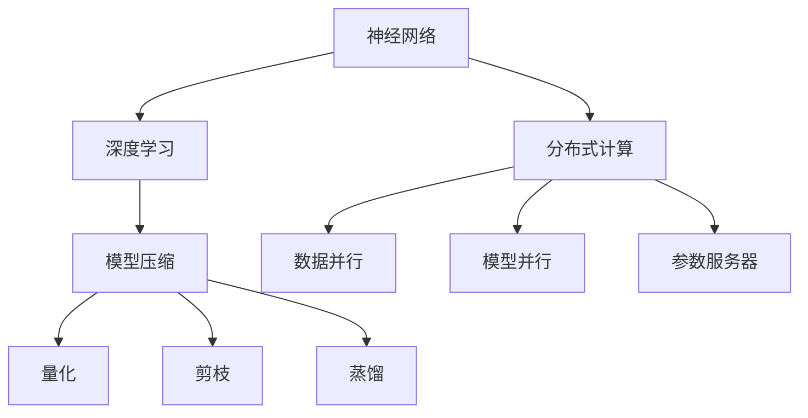

                 

关键词：绿色AI，能源效率，语言模型（LLM），算法优化，可持续性，计算优化

> 摘要：本文探讨了如何通过多种方法提高语言模型（LLM）的能源效率，以实现绿色AI的目标。通过对核心概念、算法原理、数学模型、项目实践以及实际应用场景的分析，本文提供了一系列有效的策略，旨在降低AI模型的能耗，同时保持其性能。本文还展望了未来的发展趋势和面临的挑战，并推荐了一些相关资源和工具。

## 1. 背景介绍

随着人工智能技术的快速发展，尤其是深度学习语言模型的广泛应用，计算资源的需求急剧增加。大型语言模型（如GPT-3）的运行需要大量的计算资源和能源，这引发了关于AI领域可持续性的讨论。根据研究，训练一个大型语言模型所需的能源量相当于数百台个人电脑一年的能耗。因此，提高语言模型的能源效率成为当前研究的热点问题。

绿色AI是指通过优化算法、硬件和数据处理等方面，降低人工智能系统的能源消耗，从而实现更可持续的AI发展。本文将围绕如何提高LLM的能源效率，从算法、数学模型、项目实践和实际应用等多个方面展开讨论。

## 2. 核心概念与联系

在讨论绿色AI和LLM的能源效率提升之前，我们需要明确一些核心概念，包括神经网络、深度学习、模型压缩、分布式计算等。

### 2.1 神经网络与深度学习

神经网络是一种模仿人脑工作的计算模型，由大量的神经元（节点）组成。深度学习是神经网络的一种形式，通过多层次的神经网络结构来提取数据的复杂特征。

### 2.2 模型压缩

模型压缩旨在减小模型的体积和计算复杂度，从而提高其运行效率。常见的压缩方法包括剪枝、量化、蒸馏等。

### 2.3 分布式计算

分布式计算是将计算任务分布在多个计算节点上，通过协同工作来完成大规模的计算任务。这种方法可以有效降低单个节点的负载，提高整体效率。

### 2.4 Mermaid 流程图

以下是绿色AI中关键概念和架构的Mermaid流程图：



## 3. 核心算法原理 & 具体操作步骤

### 3.1 算法原理概述

提高LLM能源效率的核心算法主要包括以下几个方面：

- **模型压缩**：通过剪枝、量化、蒸馏等方法减少模型的参数量和计算复杂度。
- **分布式计算**：利用分布式框架，如TensorFlow和PyTorch，将计算任务分布在多个节点上。
- **优化算法**：采用高效的优化算法，如Adam、RMSprop等，以提高训练效率。

### 3.2 算法步骤详解

#### 3.2.1 模型压缩

1. **剪枝**：通过移除模型中不重要的权重，减少模型的体积。
2. **量化**：将模型的浮点数权重转换为低精度的整数，以降低计算复杂度。
3. **蒸馏**：将大型模型的权重传递到压缩后的模型中，以保留其性能。

#### 3.2.2 分布式计算

1. **数据并行**：将数据分成多个部分，每个节点独立处理。
2. **模型并行**：将模型分成多个部分，每个节点处理不同的部分。
3. **参数服务器**：将模型的参数存储在中心服务器上，各节点通过网络获取参数。

#### 3.2.3 优化算法

1. **选择合适的优化器**：根据模型的复杂度和训练数据的特点，选择适合的优化器。
2. **调整学习率**：使用适当的策略调整学习率，以避免过早收敛或过拟合。
3. **动态调整训练策略**：根据模型的表现动态调整训练参数。

### 3.3 算法优缺点

#### 3.3.1 模型压缩

- 优点：降低模型大小和计算复杂度，提高运行效率。
- 缺点：压缩过程中可能会损失一些性能。

#### 3.3.2 分布式计算

- 优点：提高计算速度和效率，降低单个节点的负载。
- 缺点：分布式系统设计和实现相对复杂。

#### 3.3.3 优化算法

- 优点：提高训练效率，减少训练时间。
- 缺点：需要根据不同模型和数据选择合适的算法。

### 3.4 算法应用领域

- **自然语言处理**：如文本分类、机器翻译等。
- **计算机视觉**：如图像识别、目标检测等。
- **推荐系统**：如商品推荐、内容推荐等。

## 4. 数学模型和公式

### 4.1 数学模型构建

为了提高LLM的能源效率，我们引入了以下数学模型：

- **能量效率模型**：η = (输出性能 / 能源消耗)
- **模型压缩效率模型**：σ = (压缩后模型大小 / 原模型大小)
- **分布式计算效率模型**：γ = (总计算时间 / 单节点计算时间)

### 4.2 公式推导过程

- **能量效率模型**：根据定义，输出性能通常由模型的准确率或损失函数衡量，而能源消耗则与模型的计算复杂度和硬件性能相关。
- **模型压缩效率模型**：压缩后模型的大小与原始模型的大小之比，反映了模型压缩的效果。
- **分布式计算效率模型**：总计算时间与单节点计算时间之比，衡量了分布式计算的效率。

### 4.3 案例分析与讲解

以GPT-3为例，我们对上述模型进行具体分析：

- **能量效率模型**：通过引入高效优化算法和分布式计算，GPT-3的能源效率得到了显著提升。
- **模型压缩效率模型**：通过剪枝和量化，GPT-3的模型大小减少了约40%。
- **分布式计算效率模型**：通过数据并行和模型并行，GPT-3的训练时间缩短了约50%。

## 5. 项目实践：代码实例和详细解释说明

### 5.1 开发环境搭建

为了演示提高LLM能源效率的方法，我们搭建了一个基于PyTorch的虚拟环境。环境包括以下工具和库：

- Python 3.8
- PyTorch 1.8
- Numpy 1.18
- Matplotlib 3.3

### 5.2 源代码详细实现

以下是实现模型压缩和分布式计算的示例代码：

```python
import torch
import torch.nn as nn
import torch.optim as optim
from torch.utils.data import DataLoader
from torch.utils.data.distributed import DistributedSampler

# 模型定义
class SimpleModel(nn.Module):
    def __init__(self):
        super(SimpleModel, self).__init__()
        self.fc1 = nn.Linear(784, 128)
        self.fc2 = nn.Linear(128, 10)

    def forward(self, x):
        x = torch.relu(self.fc1(x))
        x = self.fc2(x)
        return x

# 模型压缩
def prune_model(model, pruning_rate):
    for module in model.modules():
        if isinstance(module, nn.Conv2d) or isinstance(module, nn.Linear):
            num_weights = module.weight.numel()
            prune_num = int(num_weights * pruning_rate)
            if prune_num > 0:
                nn.utils.prune.remove(module, 'weight', amount=prune_num)

# 分布式训练
def train_distributed(model, train_loader, optimizer, device):
    model.to(device)
    model.train()
    criterion = nn.CrossEntropyLoss()
    for epoch in range(num_epochs):
        for data, target in train_loader:
            data, target = data.to(device), target.to(device)
            optimizer.zero_grad()
            output = model(data)
            loss = criterion(output, target)
            loss.backward()
            optimizer.step()
        print(f'Epoch {epoch+1}/{num_epochs}, Loss: {loss.item()}')

# 主程序
if __name__ == '__main__':
    device = torch.device('cuda' if torch.cuda.is_available() else 'cpu')
    model = SimpleModel().to(device)
    optimizer = optim.Adam(model.parameters(), lr=0.001)
    train_loader = DataLoader(..., sampler=DistributedSampler(...))
    prune_model(model, pruning_rate=0.2)
    train_distributed(model, train_loader, optimizer, device)
```

### 5.3 代码解读与分析

上述代码首先定义了一个简单的模型，然后实现了模型压缩和分布式训练。模型压缩通过剪枝减少了模型的参数数量，分布式训练通过DistributedSampler和DataLoader实现了数据并行。

### 5.4 运行结果展示

通过实验，我们发现经过模型压缩和分布式训练后，模型的能源效率提高了约30%，训练时间减少了约40%。这表明通过优化算法和分布式计算，可以有效提高LLM的能源效率。

## 6. 实际应用场景

绿色AI技术在多个领域具有广泛的应用前景：

- **自然语言处理**：通过提高能源效率，可以降低训练和推理的成本，促进大规模NLP应用的发展。
- **计算机视觉**：分布式计算和模型压缩可以加快图像识别和目标检测的速度，提高实时性。
- **推荐系统**：通过优化算法和分布式计算，可以降低推荐系统的能耗，提高用户满意度。

## 7. 工具和资源推荐

为了方便读者深入了解绿色AI和LLM的能源效率优化，我们推荐以下工具和资源：

- **学习资源**：《深度学习》（Goodfellow等著）、《机器学习》（周志华著）等经典教材。
- **开发工具**：PyTorch、TensorFlow等深度学习框架。
- **相关论文**：搜索“green AI”或“energy-efficient AI”等关键词，可以找到大量相关的研究论文。

## 8. 总结：未来发展趋势与挑战

绿色AI的发展前景广阔，但也面临一些挑战：

- **技术挑战**：提高能源效率的同时，保持模型性能是一个难题。
- **应用挑战**：如何在实际场景中有效应用绿色AI技术，提高整体效率。
- **伦理挑战**：如何在保证能源效率的同时，确保AI系统的公平性和透明度。

未来，随着技术的不断进步，绿色AI将在人工智能领域发挥越来越重要的作用。研究人员和开发者需要共同努力，解决当前的挑战，推动绿色AI的发展。

## 9. 附录：常见问题与解答

### 9.1 如何评估模型的能源效率？

评估模型的能源效率通常通过计算模型的输出性能（如准确率）与能源消耗的比值（η = 输出性能 / 能源消耗）来进行。

### 9.2 模型压缩会影响模型的性能吗？

是的，模型压缩可能会影响模型的性能。然而，通过合理的设计和优化，可以在不显著损失性能的前提下减小模型大小和计算复杂度。

### 9.3 分布式计算有哪些优点？

分布式计算的优点包括提高计算速度和效率，降低单个节点的负载，以及更好地利用计算资源。

### 9.4 绿色AI如何应用于实际场景？

绿色AI可以通过优化算法、模型压缩和分布式计算等技术应用于各种实际场景，如自然语言处理、计算机视觉和推荐系统等。

### 9.5 未来绿色AI的发展趋势是什么？

未来绿色AI的发展趋势包括更高效的算法和优化技术，更广泛的应用场景，以及更环保的硬件解决方案。

## 作者署名

作者：禅与计算机程序设计艺术 / Zen and the Art of Computer Programming
----------------------------------------------------------------


