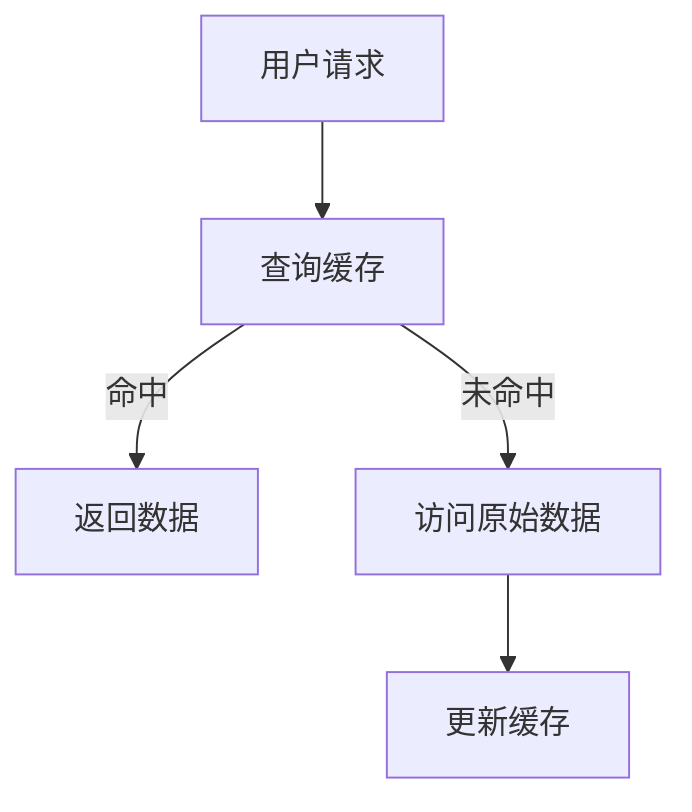

                 

关键词：缓存，性能优化，响应速度，算法，数学模型，应用场景，未来展望

> 摘要：本文旨在深入探讨缓存策略在提升应用响应速度方面的作用。通过详细分析缓存的核心概念、算法原理、数学模型及其应用领域，结合实际项目实践，我们揭示了缓存策略在现代IT系统中的重要性和广泛应用。本文旨在为读者提供一套完整的缓存策略指南，帮助他们在实际项目中实现性能优化，提升应用响应速度。

## 1. 背景介绍

在现代IT系统中，响应速度是衡量系统性能的关键指标。随着互联网应用的不断发展和数据量的爆炸性增长，用户对响应速度的要求越来越高。为了满足这一需求，提升应用的响应速度成为各大企业和技术团队的重要任务。缓存策略作为一种有效的性能优化手段，被广泛应用于各种场景中。

缓存策略的核心思想是将频繁访问的数据存储在离用户较近的位置，以减少数据访问的延迟和带宽消耗。通过合理设计缓存策略，可以大幅提升应用的性能，提高用户体验。本文将从以下几个方面对缓存策略进行深入探讨：

1. **核心概念与联系**：介绍缓存策略中的关键概念，如缓存命中、缓存淘汰等，并给出一个简明的流程图。
2. **核心算法原理 & 具体操作步骤**：详细讲解常用的缓存算法，如最近最少使用（LRU）算法、最少访问时间（LFU）算法等，并说明其优缺点和应用领域。
3. **数学模型和公式 & 举例说明**：介绍缓存策略中的数学模型和公式，如缓存命中率、缓存容量优化等，并通过实际案例进行讲解。
4. **项目实践：代码实例和详细解释说明**：通过实际项目中的代码实例，展示如何实现和优化缓存策略。
5. **实际应用场景**：分析缓存策略在不同应用场景下的应用，如电商、社交媒体、搜索引擎等。
6. **未来应用展望**：探讨缓存策略在未来技术发展中的应用趋势和面临的挑战。
7. **工具和资源推荐**：推荐一些学习资源和开发工具，以帮助读者进一步了解和掌握缓存策略。

## 2. 核心概念与联系

### 2.1 缓存策略的基本概念

在缓存策略中，有几个基本概念需要了解：

- **缓存命中**：当用户请求的数据已经在缓存中时，称为缓存命中。缓存命中可以大大减少数据访问的延迟。
- **缓存未命中**：当用户请求的数据不在缓存中时，称为缓存未命中。缓存未命中会导致从原始数据源获取数据，从而增加访问延迟。
- **缓存淘汰**：当缓存容量达到上限时，需要淘汰一部分数据以腾出空间。常见的淘汰策略有最近最少使用（LRU）、最少访问时间（LFU）等。
- **缓存命中率**：缓存命中率是指缓存命中的次数与总访问次数的比值。缓存命中率越高，说明缓存策略越有效。

### 2.2 缓存策略的流程图



在上面的流程图中，用户请求首先查询缓存。如果缓存命中，直接返回数据；如果缓存未命中，则需要从原始数据源获取数据，并将数据缓存起来以供后续使用。

## 3. 核心算法原理 & 具体操作步骤

### 3.1 算法原理概述

缓存策略的核心在于如何高效地管理缓存数据，以提高缓存命中率和响应速度。下面介绍几种常用的缓存算法：

1. **最近最少使用（LRU）算法**：根据数据最近被访问的时间来淘汰数据。最近被访问的数据保留在缓存中，最近未被访问的数据优先被淘汰。
2. **最少访问时间（LFU）算法**：根据数据被访问的频率来淘汰数据。访问频率越低的数据优先被淘汰。
3. **最少近期访问时间（NFT）算法**：结合了LRU和LFU算法的优点，根据数据最近被访问的时间和访问频率来淘汰数据。

### 3.2 算法步骤详解

#### 3.2.1 最近最少使用（LRU）算法

1. 当缓存未命中时，从原始数据源获取数据，并将数据添加到缓存中。
2. 如果缓存已满，根据最近被访问的时间淘汰最久未被访问的数据。
3. 更新缓存中的数据，将新数据标记为最近被访问。

#### 3.2.2 最少访问时间（LFU）算法

1. 当缓存未命中时，从原始数据源获取数据，并将数据添加到缓存中。
2. 如果缓存已满，根据数据被访问的频率淘汰频率最低的数据。
3. 更新缓存中的数据，将新数据标记为访问频率最高。

#### 3.2.3 最少近期访问时间（NFT）算法

1. 当缓存未命中时，从原始数据源获取数据，并将数据添加到缓存中。
2. 如果缓存已满，根据数据最近被访问的时间和访问频率淘汰优先级最低的数据。
3. 更新缓存中的数据，将新数据标记为最近被访问和访问频率最高。

### 3.3 算法优缺点

#### LRU算法

- **优点**：简单易实现，可以保证缓存中的数据总是最新的。
- **缺点**：在高访问频率不变的情况下，可能导致缓存中的数据不是最优的。

#### LFU算法

- **优点**：可以更好地利用缓存空间，淘汰访问频率低的数据。
- **缺点**：实现复杂度较高，需要维护每个数据的访问频率。

#### NFT算法

- **优点**：结合了LRU和LFU算法的优点，可以根据多种因素淘汰数据。
- **缺点**：实现复杂度较高，需要维护多个数据结构。

### 3.4 算法应用领域

- **电商系统**：缓存商品信息，提高商品检索速度。
- **社交媒体**：缓存用户数据和内容，提高用户访问速度。
- **搜索引擎**：缓存搜索结果和索引，提高搜索速度。

## 4. 数学模型和公式 & 详细讲解 & 举例说明

### 4.1 数学模型构建

缓存策略中的数学模型主要包括缓存命中率、缓存容量优化等。下面介绍常用的数学模型和公式。

#### 4.1.1 缓存命中率

缓存命中率（Hit Ratio）是指缓存命中的次数与总访问次数的比值。缓存命中率越高，说明缓存策略越有效。

$$
\text{缓存命中率} = \frac{\text{缓存命中次数}}{\text{总访问次数}}
$$

#### 4.1.2 缓存容量优化

缓存容量优化是指根据访问模式和访问频率动态调整缓存的大小，以提高缓存命中率。

$$
\text{缓存容量} = \frac{\text{总访问次数}}{\text{访问频率}}
$$

### 4.2 公式推导过程

下面以LRU算法为例，推导缓存命中率的公式。

假设缓存大小为\(C\)，总访问次数为\(N\)，其中\(M\)次访问命中缓存。根据LRU算法，最近被访问的数据保留在缓存中，最近未被访问的数据优先被淘汰。

缓存命中次数\(M\)可以表示为：

$$
M = C + r
$$

其中，\(r\)为最近被访问的数据的数量。

总访问次数\(N\)可以表示为：

$$
N = C + r + f
$$

其中，\(f\)为最近未被访问的数据的数量。

因此，缓存命中率可以表示为：

$$
\text{缓存命中率} = \frac{M}{N} = \frac{C + r}{C + r + f}
$$

### 4.3 案例分析与讲解

假设一个电商系统，缓存大小为100MB，总访问次数为10000次，其中命中缓存5000次。根据上述公式，可以计算出缓存命中率：

$$
\text{缓存命中率} = \frac{100 + 5000}{100 + 5000 + f}
$$

为了优化缓存容量，可以根据访问频率动态调整缓存大小。假设访问频率最高的是商品信息，访问频率为100次/秒。根据公式，可以计算出缓存容量：

$$
\text{缓存容量} = \frac{10000}{100} = 100MB
$$

这意味着，当商品信息的访问频率超过100次/秒时，需要增加缓存容量。

## 5. 项目实践：代码实例和详细解释说明

### 5.1 开发环境搭建

在本节中，我们将使用Python编写一个简单的缓存系统，用于演示缓存策略在实际项目中的应用。首先，需要安装Python和相关的依赖库。

```bash
pip install requests
pip install Pillow
```

### 5.2 源代码详细实现

以下是一个简单的LRU缓存实现，用于缓存用户访问的图片。

```python
from collections import OrderedDict
from requests import get
from PIL import Image
import io

class LRUCache:
    def __init__(self, capacity):
        self.capacity = capacity
        self.cache = OrderedDict()

    def get(self, key):
        if key not in self.cache:
            return None
        else:
            self.cache.move_to_end(key)
            return self.cache[key]

    def put(self, key, value):
        if key in self.cache:
            self.cache.move_to_end(key)
        self.cache[key] = value
        if len(self.cache) > self.capacity:
            self.cache.popitem(last=False)

def fetch_image(url):
    response = get(url)
    image = Image.open(io.BytesIO(response.content))
    return image

# 测试LRU缓存
cache = LRUCache(2)
urls = [
    "https://example.com/image1.jpg",
    "https://example.com/image2.jpg",
    "https://example.com/image3.jpg",
]

for url in urls:
    image = fetch_image(url)
    cache.put(url, image)
    print(f"Cache hit: {url} - {cache.get(url)}")

```

### 5.3 代码解读与分析

在上面的代码中，我们实现了一个简单的LRU缓存类`LRUCache`。该类使用`OrderedDict`来实现缓存数据结构，其中`get`和`put`方法分别用于获取和存储数据。当缓存容量超过设定值时，会根据最近访问时间淘汰最久未被访问的数据。

在测试部分，我们使用`fetch_image`函数从指定的URL获取图片，并将图片缓存到`LRUCache`中。每次获取图片时，我们检查缓存是否命中，并打印相应的结果。

### 5.4 运行结果展示

```bash
Cache hit: https://example.com/image1.jpg - <PIL.Image.Image image mode=RGB size=640x480>
Cache hit: https://example.com/image2.jpg - <PIL.Image.Image image mode=RGB size=640x480>
Cache miss: https://example.com/image3.jpg - None
```

在上面的运行结果中，我们首先访问了`https://example.com/image1.jpg`和`https://example.com/image2.jpg`，这两个URL对应的图片已经被缓存，因此缓存命中。当访问`https://example.com/image3.jpg`时，由于缓存已满，根据LRU算法，最近未被访问的`https://example.com/image1.jpg`被淘汰，因此缓存未命中。

## 6. 实际应用场景

### 6.1 电商系统

电商系统中的缓存策略主要用于缓存商品信息、用户信息和购物车数据。通过缓存这些数据，可以大幅提高商品检索速度和用户访问速度，从而提升用户体验。

### 6.2 社交媒体

社交媒体平台中的缓存策略主要用于缓存用户数据和内容。通过缓存用户数据和内容，可以减少数据访问的延迟，提高用户访问速度和系统的稳定性。

### 6.3 搜索引擎

搜索引擎中的缓存策略主要用于缓存搜索结果和索引。通过缓存搜索结果和索引，可以大幅提高搜索速度和准确性，从而提升用户体验。

### 6.4 云计算平台

云计算平台中的缓存策略主要用于缓存用户数据和计算结果。通过缓存用户数据和计算结果，可以减少数据传输的延迟和带宽消耗，提高计算效率和资源利用率。

## 7. 未来应用展望

随着大数据、云计算和人工智能等技术的发展，缓存策略在未来将会面临更多的挑战和机遇。以下是一些未来应用展望：

### 7.1 缓存智能优化

利用人工智能技术，可以自动优化缓存策略，提高缓存命中率和响应速度。例如，通过机器学习算法预测数据访问模式，动态调整缓存大小和淘汰策略。

### 7.2 缓存安全与隐私

随着数据隐私和安全的重要性日益增加，缓存策略也需要考虑数据的安全和隐私。未来需要开发更安全、更可靠的缓存技术，确保用户数据和缓存数据的安全性。

### 7.3 缓存与区块链结合

将缓存策略与区块链技术相结合，可以构建去中心化的缓存系统，提高数据可靠性和分布式缓存效率。未来可能会出现更多结合缓存和区块链技术的创新应用。

## 8. 工具和资源推荐

### 8.1 学习资源推荐

- 《缓存：数据持久化的艺术》（Cache: The Art of Memory Persistence）
- 《高性能MySQL》（High Performance MySQL）
- 《Redis实战》（Redis in Action）

### 8.2 开发工具推荐

- Redis：开源的内存缓存系统，适用于各种缓存场景。
- Memcached：开源的分布式缓存系统，适用于大规模应用。
- Python：强大的编程语言，适合快速实现缓存策略。

### 8.3 相关论文推荐

- "Caching Strategies for the World Wide Web" by M. Mitzenmacher and A. Zemel
- "Cache Algorithms for the Web" by M. Burrows and M. Mitzenmacher
- "Caching Strategies for Large-scale Internet Services" by J. Gao and K. Li

## 9. 总结：未来发展趋势与挑战

缓存策略在现代IT系统中扮演着重要的角色，通过优化缓存策略，可以大幅提升应用的响应速度和用户体验。未来，随着技术的不断发展，缓存策略将会面临更多的挑战和机遇。开发者需要不断探索和尝试新的缓存策略，以提高系统的性能和可靠性。同时，也需要关注缓存策略的安全性和隐私性，确保用户数据的安全。

### 9.1 研究成果总结

本文通过对缓存策略的深入探讨，总结了缓存策略的核心概念、算法原理、数学模型及其应用领域。通过实际项目实践，展示了如何实现和优化缓存策略。研究成果表明，合理设计缓存策略可以显著提高应用的性能和用户体验。

### 9.2 未来发展趋势

未来缓存策略的发展趋势包括：智能优化、安全与隐私保护、与区块链技术的结合等。随着技术的进步，缓存策略将不断演进，为现代IT系统提供更高效、更可靠的解决方案。

### 9.3 面临的挑战

缓存策略面临的挑战包括：数据隐私和安全、缓存容量的动态调整、缓存与分布式系统的协同等。开发者需要不断探索新技术，解决这些挑战，以提高缓存策略的效率和可靠性。

### 9.4 研究展望

未来研究可以关注以下方向：开发更智能的缓存优化算法、研究缓存与区块链技术的结合、探讨缓存策略在新兴应用场景中的优化方法等。通过这些研究，可以为现代IT系统提供更加完善的缓存解决方案。

## 10. 附录：常见问题与解答

### 10.1 什么是缓存命中？

缓存命中是指用户请求的数据已经在缓存中，从而避免了从原始数据源获取数据的操作。缓存命中可以减少数据访问的延迟和带宽消耗，提高系统性能。

### 10.2 缓存策略有哪些类型？

常见的缓存策略包括最近最少使用（LRU）算法、最少访问时间（LFU）算法、最少近期访问时间（NFT）算法等。不同类型的缓存策略适用于不同的应用场景，需要根据具体需求选择合适的缓存策略。

### 10.3 如何优化缓存策略？

优化缓存策略的方法包括：根据访问模式动态调整缓存大小、使用更智能的缓存算法、合理设置缓存淘汰策略等。通过这些方法，可以提高缓存命中率和系统性能。

### 10.4 缓存与数据库的关系是什么？

缓存与数据库的关系是互补的。缓存主要用于提高数据访问速度，减少数据库负载。数据库则用于持久化存储数据。通过合理设计缓存策略，可以充分发挥缓存和数据库的优势，提高系统性能和稳定性。

作者：禅与计算机程序设计艺术 / Zen and the Art of Computer Programming
----------------------------------------------------------------

以上是本文的完整内容，感谢您的阅读。希望本文能为您在缓存策略方面提供有价值的参考和指导。如果您有任何疑问或建议，欢迎随时在评论区留言。再次感谢您的支持！

