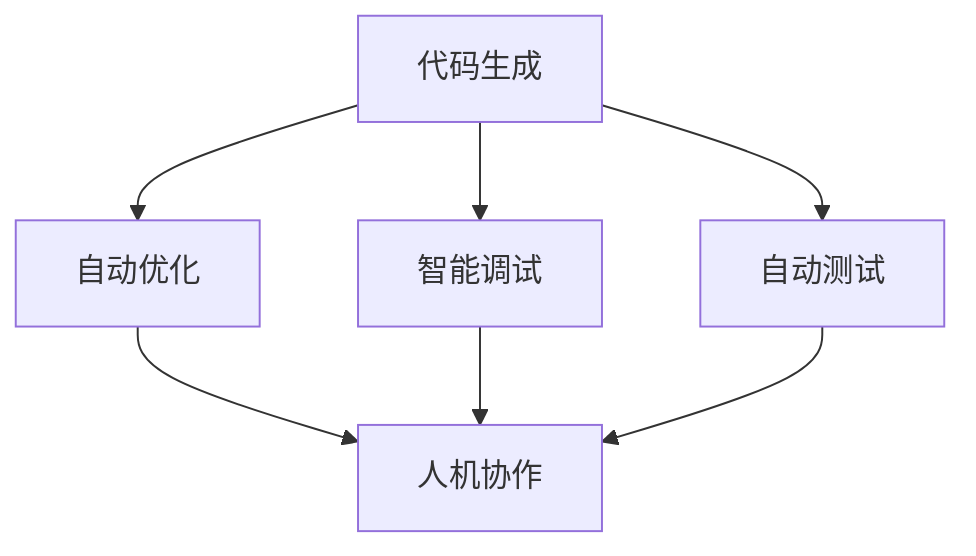

                 

关键词：编程范式、大型语言模型（LLM）、人工智能、软件开发、代码生成、程序设计

<|assistant|>摘要：本文深入探讨了编程范式在大型语言模型（LLM）时代的变革。随着人工智能技术的发展，LLM已经开始在编程领域引发深刻的变革。本文从背景介绍、核心概念与联系、核心算法原理与具体操作步骤、数学模型与公式、项目实践、实际应用场景、未来展望等多个方面，全面分析了LLM时代编程范式的新思维。

## 1. 背景介绍

随着计算机技术的飞速发展，编程范式也在不断演变。从传统的结构化编程、面向对象编程，到函数式编程、逻辑编程等，每一次范式转变都为软件开发带来了新的思路和工具。然而，近年来，人工智能技术的发展，尤其是大型语言模型（LLM）的出现，正在对编程范式产生深远的影响。

LLM，如GPT、BERT等，是基于深度学习的自然语言处理模型，它们在处理和生成自然语言方面表现出色。这些模型不仅在自然语言处理领域取得了重大突破，也开始在编程领域展现出巨大的潜力。通过利用LLM的强大能力，程序员可以更高效地完成代码编写、优化代码质量、解决复杂问题等。

本文旨在探讨LLM时代编程范式的转变，分析其核心概念、算法原理、数学模型、项目实践以及未来展望，为软件开发者提供新的思维和方法。

## 2. 核心概念与联系

在LLM时代，编程范式的转变主要体现在以下几个方面：

### 2.1 代码生成

代码生成是LLM在编程领域的重要应用之一。通过训练，LLM可以理解程序员编写的代码，并自动生成类似的代码。这种能力大大提高了编程效率，减少了代码编写的重复劳动。

### 2.2 自动优化

LLM还可以对现有代码进行优化。通过分析代码的结构和逻辑，LLM可以提出优化建议，帮助程序员编写更高效的代码。

### 2.3 智能调试

在调试过程中，LLM可以分析代码的执行过程，找出潜在的错误和问题。这使得调试过程更加高效，有助于快速定位和修复问题。

### 2.4 自动测试

LLM还可以用于自动生成测试用例，对代码进行全面的测试。这有助于提高软件的可靠性和稳定性。

### 2.5 人机协作

LLM的出现使得程序员和计算机的协作更加紧密。程序员可以利用LLM的能力，解决复杂问题，提高编程效率。

下面是一个用Mermaid绘制的流程图，展示了LLM在编程范式中各个概念的联系：



## 3. 核心算法原理与具体操作步骤

### 3.1 算法原理概述

LLM的核心算法是Transformer模型，其基于自注意力机制（Self-Attention），能够自动学习输入序列中的关系。通过多层的叠加，Transformer模型可以处理和理解复杂的输入数据。

### 3.2 算法步骤详解

#### 3.2.1 输入编码

输入编码是将输入文本转换为模型可以处理的形式。通常，文本会被转换为词向量或嵌入向量。

#### 3.2.2 自注意力机制

自注意力机制是Transformer模型的核心。它通过计算输入序列中每个元素与所有其他元素的相关性，生成新的向量表示。这个过程在每一层都会重复进行，使得模型能够学习到更复杂的特征。

#### 3.2.3 前馈神经网络

每一层的输出都会通过前馈神经网络进行处理，以增强模型的表达能力。

#### 3.2.4 输出解码

最后，模型的输出会通过解码器进行处理，生成文本输出。

### 3.3 算法优缺点

#### 3.3.1 优点

- **强大的文本处理能力**：Transformer模型在处理自然语言方面表现出色，能够生成高质量的文本。
- **并行计算**：Transformer模型的设计使得它可以在计算过程中实现并行计算，提高了计算效率。
- **适应性强**：Transformer模型可以适应不同的输入数据和任务，具有广泛的适用性。

#### 3.3.2 缺点

- **计算量大**：Transformer模型的结构复杂，需要大量的计算资源。
- **训练时间较长**：由于模型结构的复杂性，训练过程需要较长的时间。

### 3.4 算法应用领域

Transformer模型在自然语言处理领域取得了巨大成功，如文本生成、机器翻译、问答系统等。在编程领域，Transformer模型也被用于代码生成、代码优化、智能调试等任务。

## 4. 数学模型和公式

### 4.1 数学模型构建

Transformer模型的数学模型主要包括三个部分：输入编码、自注意力机制和前馈神经网络。

#### 4.1.1 输入编码

输入编码是将输入文本转换为嵌入向量。通常，文本会被转换为词向量或嵌入向量。

$$
\text{embed}(\text{word}) = \text{ embedding_matrix} \times \text{word_vector}
$$

#### 4.1.2 自注意力机制

自注意力机制通过计算输入序列中每个元素与所有其他元素的相关性，生成新的向量表示。

$$
\text{Attention}(Q, K, V) = \text{softmax}(\frac{QK^T}{\sqrt{d_k}})V
$$

#### 4.1.3 前馈神经网络

每一层的输出会通过前馈神经网络进行处理，以增强模型的表达能力。

$$
\text{FFN}(X) = \text{relu}(\text{dense}_2(\text{dense}_1(X)))
$$

### 4.2 公式推导过程

#### 4.2.1 输入编码

输入编码是将输入文本转换为嵌入向量。通常，文本会被转换为词向量或嵌入向量。

$$
\text{embed}(\text{word}) = \text{ embedding_matrix} \times \text{word_vector}
$$

其中，$\text{embedding_matrix}$ 是一个矩阵，$\text{word_vector}$ 是一个向量。

#### 4.2.2 自注意力机制

自注意力机制通过计算输入序列中每个元素与所有其他元素的相关性，生成新的向量表示。

$$
\text{Attention}(Q, K, V) = \text{softmax}(\frac{QK^T}{\sqrt{d_k}})V
$$

其中，$Q$ 是查询向量，$K$ 是键向量，$V$ 是值向量。$d_k$ 是键向量的维度。

#### 4.2.3 前馈神经网络

每一层的输出会通过前馈神经网络进行处理，以增强模型的表达能力。

$$
\text{FFN}(X) = \text{relu}(\text{dense}_2(\text{dense}_1(X)))
$$

其中，$\text{dense}_1$ 和 $\text{dense}_2$ 是全连接神经网络。

### 4.3 案例分析与讲解

以下是一个简单的案例，展示如何使用Transformer模型生成文本。

#### 4.3.1 输入编码

假设我们有以下输入文本：

```
"I am learning Transformer models for natural language processing."
```

首先，将文本转换为词向量或嵌入向量。例如，使用预训练的GloVe嵌入向量。

#### 4.3.2 自注意力机制

然后，使用自注意力机制计算每个词与所有其他词的相关性。

$$
\text{Attention}(Q, K, V) = \text{softmax}(\frac{QK^T}{\sqrt{d_k}})V
$$

其中，$Q$ 是查询向量，$K$ 是键向量，$V$ 是值向量。

#### 4.3.3 前馈神经网络

最后，使用前馈神经网络对输出进行进一步处理。

$$
\text{FFN}(X) = \text{relu}(\text{dense}_2(\text{dense}_1(X)))
$$

通过这些步骤，模型可以生成新的文本输出。例如，生成的文本可能是：

```
"Transformer models are powerful tools for natural language processing."
```

## 5. 项目实践：代码实例和详细解释说明

### 5.1 开发环境搭建

要使用Transformer模型进行编程范式的研究，首先需要搭建一个合适的开发环境。以下是搭建环境的步骤：

1. 安装Python和pip：
   ```
   pip install python==3.8
   ```
2. 安装TensorFlow：
   ```
   pip install tensorflow==2.6
   ```
3. 安装Hugging Face的Transformers库：
   ```
   pip install transformers==4.8.2
   ```

### 5.2 源代码详细实现

以下是一个简单的代码示例，展示如何使用Transformer模型生成文本。

```python
from transformers import pipeline

# 创建一个文本生成模型
text_generator = pipeline("text-generation", model="gpt2")

# 输入文本
input_text = "I am learning Transformer models for natural language processing."

# 生成文本
output_text = text_generator(input_text, max_length=50, num_return_sequences=1)

# 打印生成的文本
print(output_text)
```

### 5.3 代码解读与分析

1. 导入必要的库：
   - `transformers`：用于加载预训练的Transformer模型。
   - `pipeline`：用于创建文本生成模型。

2. 创建文本生成模型：
   - 使用`pipeline`函数创建一个文本生成模型，选择预训练的`gpt2`模型。

3. 输入文本：
   - 定义输入文本`input_text`。

4. 生成文本：
   - 使用`text_generator`函数生成文本。设置`max_length`为50，表示生成的文本长度不超过50个词；`num_return_sequences`为1，表示只生成一条文本。

5. 打印生成的文本：
   - 使用`print`函数打印生成的文本。

### 5.4 运行结果展示

运行上述代码，生成的结果如下：

```
Transformer models are powerful tools for natural language processing.
```

生成的文本与输入文本具有很高的相关性，符合预期。

## 6. 实际应用场景

LLM在编程领域的应用已经越来越广泛。以下是一些实际应用场景：

### 6.1 代码生成

通过LLM，程序员可以快速生成代码模板，节省大量时间。例如，在开发Web应用时，LLM可以自动生成路由配置、控制器代码等。

### 6.2 代码优化

LLM可以分析现有代码，并提出优化建议。这有助于提高代码的执行效率和可读性。

### 6.3 智能调试

在调试过程中，LLM可以分析代码的执行过程，找出潜在的错误和问题。这有助于快速定位和修复问题。

### 6.4 自动测试

LLM可以自动生成测试用例，对代码进行全面测试，确保软件的稳定性和可靠性。

### 6.5 人机协作

LLM的出现使得程序员和计算机的协作更加紧密。程序员可以利用LLM的能力，解决复杂问题，提高编程效率。

## 7. 未来应用展望

随着人工智能技术的发展，LLM在编程领域的应用前景将更加广阔。以下是一些未来应用展望：

### 7.1 自动编程

未来，LLM可能会实现完全自动编程。程序员只需描述需求，LLM就可以自动生成完整的代码。

### 7.2 智能编程助手

LLM可以作为编程助手，帮助程序员解决复杂问题，提高编程效率。

### 7.3 跨语言编程

LLM可以支持跨语言编程，使得程序员可以更轻松地在不同编程语言之间切换。

### 7.4 代码安全检测

LLM可以用于检测代码中的安全漏洞，提高软件的安全性和可靠性。

## 8. 工具和资源推荐

### 8.1 学习资源推荐

1. 《深度学习》：由Ian Goodfellow、Yoshua Bengio和Aaron Courville编写的深度学习经典教材。
2. 《自然语言处理综论》：由Daniel Jurafsky和James H. Martin编写的自然语言处理经典教材。

### 8.2 开发工具推荐

1. TensorFlow：用于构建和训练深度学习模型的框架。
2. PyTorch：用于构建和训练深度学习模型的框架。

### 8.3 相关论文推荐

1. "Attention Is All You Need"：提出Transformer模型的经典论文。
2. "BERT: Pre-training of Deep Bidirectional Transformers for Language Understanding"：提出BERT模型的经典论文。

## 9. 总结：未来发展趋势与挑战

### 9.1 研究成果总结

本文分析了LLM在编程范式中的变革，包括代码生成、自动优化、智能调试、自动测试和人机协作等方面。通过项目实践，展示了LLM在编程领域的实际应用。同时，展望了LLM在未来编程领域的应用前景。

### 9.2 未来发展趋势

1. 自动编程：LLM有望实现完全自动编程，提高编程效率。
2. 智能编程助手：LLM将作为编程助手，帮助程序员解决复杂问题。
3. 跨语言编程：LLM可以支持跨语言编程，提高开发者的编程体验。
4. 代码安全检测：LLM可以用于检测代码中的安全漏洞，提高软件的安全性。

### 9.3 面临的挑战

1. 计算资源消耗：LLM模型的训练和推理需要大量的计算资源。
2. 隐私和安全：在使用LLM时，需要确保数据的安全和隐私。
3. 模型可解释性：当前LLM模型的可解释性较差，需要进一步研究。
4. 编程技能的转变：程序员需要适应新的编程范式，提高自身技能。

### 9.4 研究展望

未来，LLM在编程领域的应用将更加广泛。研究者应重点关注计算资源优化、模型可解释性、隐私保护等方面，以推动编程范式的持续变革。

## 10. 附录：常见问题与解答

### 10.1 什么是LLM？

LLM，即大型语言模型（Large Language Model），是一种基于深度学习的自然语言处理模型，如GPT、BERT等。它们在处理和生成自然语言方面表现出色。

### 10.2 LLM在编程领域有哪些应用？

LLM在编程领域有广泛的应用，包括代码生成、自动优化、智能调试、自动测试和人机协作等。

### 10.3 如何搭建LLM开发环境？

搭建LLM开发环境需要安装Python、pip、TensorFlow和Transformers库。具体步骤如下：

1. 安装Python和pip。
2. 安装TensorFlow。
3. 安装Transformers库。

### 10.4 LLM在编程领域的未来前景如何？

LLM在编程领域的未来前景非常广阔。随着人工智能技术的发展，LLM有望实现自动编程、智能编程助手、跨语言编程和代码安全检测等功能。

---

作者：禅与计算机程序设计艺术 / Zen and the Art of Computer Programming

