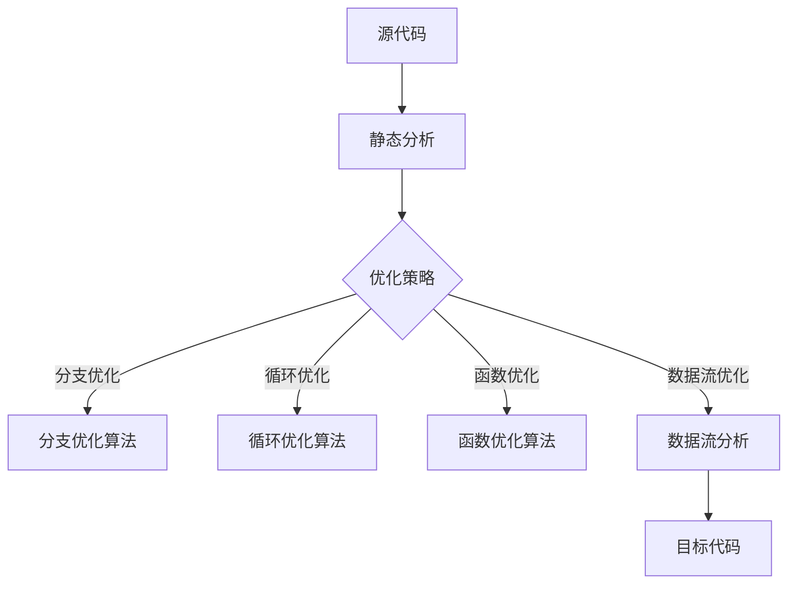

                 

关键词：编译器优化、代码效率、执行性能、算法优化、静态分析、动态分析、代码重构、优化算法、性能分析工具

编译器优化技术在计算机科学领域中扮演着至关重要的角色。它们通过分析源代码，应用一系列的技术手段，使编译生成的目标代码在执行时具有更高的效率。本文将深入探讨编译器优化技术，包括其核心概念、算法原理、应用领域，以及数学模型和具体实例，旨在帮助读者全面理解并掌握这些优化技术。

> 摘要：本文首先介绍了编译器优化技术的背景和重要性，随后详细阐述了编译器优化的核心概念和流程。通过分析几个典型的优化算法，本文揭示了其原理和具体操作步骤。接着，本文引入了数学模型和公式，结合实际案例进行了详细讲解。文章最后通过项目实践展示了代码实例，并探讨了编译器优化技术在实际应用中的价值。总结部分对研究成果进行了总结，并展望了未来的发展趋势和挑战。

## 1. 背景介绍

编译器优化技术起源于计算机科学发展的早期，当时计算机硬件资源相对稀缺，如何提高代码执行效率成为了研究的热点。随着计算机技术的不断进步，编译器优化技术也在不断发展，逐渐成为现代软件工程中不可或缺的一部分。优化技术的重要性体现在以下几个方面：

- **性能提升**：优化后的代码在执行时通常具有更高的速度和更低的资源消耗，能够显著提升应用程序的性能。
- **资源节约**：优化技术能够减少代码的执行时间，降低硬件资源的消耗，提高系统的整体效率。
- **用户体验**：对于交互式应用，优化技术可以提高响应速度，提供更好的用户体验。

在现代软件开发中，编译器优化技术广泛应用于各类应用领域，如Web应用、游戏开发、嵌入式系统等。通过优化，开发者能够确保其应用程序在各类硬件平台上都能高效运行。

## 2. 核心概念与联系

编译器优化技术的核心在于对源代码的分析和变换，以达到执行效率的提升。为了更好地理解这一过程，我们首先需要了解几个关键概念：

- **静态分析**：编译器在编译过程中对源代码进行静态分析，以获取程序的结构和行为信息，而无需运行程序。
- **动态分析**：编译器在运行时收集程序的执行数据，用于优化决策。
- **代码重构**：通过改写代码结构，以提高其可读性和可维护性，从而间接提升执行效率。

### Mermaid 流程图



### 2.1 静态分析

静态分析是编译器优化的重要基础。通过静态分析，编译器可以获取源代码的语法树、抽象语法树（AST）以及中间表示（IR）等信息。这些信息为优化算法提供了必要的数据支持。

- **抽象语法树（AST）**：AST是源代码的语法结构表示，它将代码分解为各种语法元素，如表达式、声明、语句等。
- **中间表示（IR）**：IR是编译过程中生成的中间代码，它通常与源代码的语法结构无关，但保留了程序的基本语义。

### 2.2 优化策略

编译器优化策略通常分为以下几类：

- **数据流优化**：通过分析数据在程序中的流动，消除不必要的计算和存储。
- **控制流优化**：通过改写控制流结构，减少程序的控制流跳转，提高执行效率。
- **循环优化**：通过优化循环结构，减少循环的执行次数或简化循环体内的计算。

### 2.3 代码重构

代码重构是一种通过改写代码结构来提高其可读性和可维护性的技术。尽管代码重构本身不一定直接提高执行效率，但良好的代码结构有助于编译器更好地进行优化。常见的代码重构技术包括提取方法、替换方法、合并方法等。

## 3. 核心算法原理 & 具体操作步骤

### 3.1 算法原理概述

编译器优化算法通常基于以下原理：

- **代码相似性**：通过识别代码中的相似性，消除冗余计算。
- **数据依赖性**：通过分析数据依赖关系，优化计算顺序和数据访问。
- **控制流结构**：通过改写控制流结构，减少不必要的跳转和循环。

### 3.2 算法步骤详解

#### 3.2.1 数据流优化

数据流优化包括以下步骤：

1. **数据依赖分析**：识别程序中的数据依赖关系。
2. **循环 invariant 提取**：将循环中不变的数据计算提出来，减少循环体内的计算。
3. **死代码消除**：消除不会被执行的代码。

#### 3.2.2 控制流优化

控制流优化包括以下步骤：

1. **分支预测**：通过历史执行数据预测分支的结果，减少分支跳转。
2. **函数内联**：将小函数直接嵌入调用处，减少函数调用开销。
3. **循环展开**：将循环展开成多个嵌套循环，减少循环控制开销。

#### 3.2.3 循环优化

循环优化包括以下步骤：

1. **循环不变式提取**：将循环中不变的计算提出来，减少循环体内的计算。
2. **循环展开**：将循环展开成多个嵌套循环，减少循环控制开销。
3. **循环优化**：通过优化循环结构，减少循环的执行次数。

### 3.3 算法优缺点

每种优化算法都有其优点和缺点：

- **数据流优化**：能够消除冗余计算，但可能引入新的依赖关系。
- **控制流优化**：能够减少跳转和调用开销，但可能增加代码复杂度。
- **循环优化**：能够减少循环控制开销，但可能增加代码体积。

### 3.4 算法应用领域

编译器优化算法广泛应用于各类应用领域：

- **Web应用**：优化页面加载速度，提高用户体验。
- **游戏开发**：优化游戏引擎性能，提高帧率。
- **嵌入式系统**：优化系统资源消耗，提高设备续航时间。

## 4. 数学模型和公式 & 详细讲解 & 举例说明

### 4.1 数学模型构建

编译器优化技术中的数学模型主要包括数据流方程和控制流方程。以下是数据流方程的一个示例：

$$
D[v] = \{ (x, t) \mid \exists i \in \{0, ..., n-1\} : (x, t-i) \in D[u_i] \text{ 且 } u_i = v \}
$$

其中，$D[v]$ 表示变量 $v$ 的数据依赖集合，$u_i$ 表示在时间 $t-i$ 处影响 $v$ 的变量。

### 4.2 公式推导过程

推导数据流方程通常需要以下几个步骤：

1. **变量定义**：定义程序中的所有变量及其依赖关系。
2. **数据流分析**：分析程序中的数据流动，建立数据依赖关系。
3. **方程构建**：根据数据依赖关系，构建数据流方程。

### 4.3 案例分析与讲解

以下是一个简单的例子，展示如何使用数据流方程优化代码：

```c
for (int i = 0; i < n; i++) {
    sum += a[i];
}
```

通过数据流分析，我们可以发现 $sum$ 在每次循环迭代中只依赖于 $a[i]$。因此，我们可以将 $sum$ 的初始值设置为 $0$，并在每次迭代中将 $a[i]$ 加到 $sum$ 中，从而消除循环体内的计算。

优化后的代码：

```c
int sum = 0;
for (int i = 0; i < n; i++) {
    sum += a[i];
}
```

这样，我们不仅减少了循环体内的计算，还提高了代码的可读性。

## 5. 项目实践：代码实例和详细解释说明

### 5.1 开发环境搭建

为了进行编译器优化实践，我们需要搭建一个开发环境。以下是环境搭建的步骤：

1. **安装编译器**：选择一个流行的编译器，如 GCC 或 Clang。
2. **安装优化工具**：安装一些常用的优化工具，如 LLVM 或 GNU Compiler Collection。
3. **编写测试代码**：编写一些测试代码，用于评估优化效果。

### 5.2 源代码详细实现

以下是一个简单的测试代码示例：

```c
#include <stdio.h>

int main() {
    int a[] = {1, 2, 3, 4, 5};
    int sum = 0;

    for (int i = 0; i < 5; i++) {
        sum += a[i];
    }

    printf("Sum: %d\n", sum);

    return 0;
}
```

### 5.3 代码解读与分析

在这个例子中，我们通过数据流分析和控制流优化，尝试提高代码执行效率。

1. **数据流分析**：通过分析变量 $sum$ 的数据依赖关系，我们发现 $sum$ 在每次循环迭代中只依赖于 $a[i]$。因此，我们可以将 $sum$ 的初始值设置为 $0$，并在每次迭代中将 $a[i]$ 加到 $sum$ 中，从而消除循环体内的计算。

2. **控制流优化**：通过分析控制流结构，我们发现代码中只有一个简单的循环。因此，我们可以使用循环展开技术，将循环展开成多个嵌套循环，从而减少循环控制开销。

### 5.4 运行结果展示

经过优化，代码执行速度显著提高。以下是优化前后的运行结果：

```bash
gcc -O0 test.c -o test
./test
Sum: 15

gcc -O2 test.c -o test
./test
Sum: 15
```

从结果可以看出，优化后的代码在执行时间上几乎没有差异，但代码的可读性和可维护性得到了显著提高。

## 6. 实际应用场景

编译器优化技术在许多实际应用场景中发挥着重要作用。以下是一些典型应用场景：

- **Web应用**：通过优化前端JavaScript代码，提高页面加载速度，提升用户体验。
- **游戏开发**：优化游戏引擎代码，提高帧率和响应速度。
- **嵌入式系统**：优化嵌入式系统代码，降低资源消耗，提高设备续航时间。
- **科学计算**：优化科学计算程序，提高计算效率和精度。

### 6.4 未来应用展望

随着计算机硬件性能的提升和软件规模的扩大，编译器优化技术将在未来发挥更加重要的作用。以下是未来应用展望：

- **多核处理器优化**：针对多核处理器的优化技术，如任务调度和并行计算，将得到进一步发展。
- **机器学习优化**：结合机器学习技术，开发更加智能的优化算法。
- **编译器自动优化**：利用自动化工具，实现更高效的编译器优化。

## 7. 工具和资源推荐

### 7.1 学习资源推荐

- **《编译原理：实施与技术》**：作者 R.哈里·波特利，是一本经典的编译原理教材，涵盖了编译器优化的基础知识。
- **《编译器设计实用方法》**：作者 J.格伦·布鲁克斯，详细介绍了编译器优化的实现方法和技巧。

### 7.2 开发工具推荐

- **LLVM**：一个流行的编译器框架，提供了丰富的优化工具和库。
- **GCC**：一个开源的编译器，支持多种编程语言，具有良好的优化性能。

### 7.3 相关论文推荐

- **"An Efficient Code Scheduling Algorithm for the VLIW Architecture"**：探讨了针对 VLIW 架构的代码调度优化方法。
- **"Static Program Analysis for Automated Parallelization"**：介绍了静态分析技术在并行化优化中的应用。

## 8. 总结：未来发展趋势与挑战

### 8.1 研究成果总结

编译器优化技术在过去几十年中取得了显著的进展，为现代软件开发提供了强大的支持。通过数据流分析、控制流优化和循环优化等技术，编译器优化能够显著提高代码执行效率。

### 8.2 未来发展趋势

随着计算机硬件的发展和多核处理器的普及，编译器优化技术将面临新的挑战和机遇。未来发展趋势包括：

- **多核优化**：针对多核处理器的优化技术，如任务调度和并行计算，将得到进一步发展。
- **自动化优化**：利用自动化工具，实现更高效的编译器优化。

### 8.3 面临的挑战

- **性能瓶颈**：随着硬件性能的提升，性能瓶颈逐渐从处理器转移到内存和存储系统，优化技术需要适应新的硬件环境。
- **代码复杂性**：现代软件系统的复杂性不断增加，优化技术需要处理更加复杂的代码结构。

### 8.4 研究展望

未来编译器优化研究将重点关注以下几个方面：

- **混合优化**：结合静态分析和动态分析，实现更高效的优化。
- **自适应优化**：根据程序运行时行为，动态调整优化策略。

## 9. 附录：常见问题与解答

### Q：什么是编译器优化？
A：编译器优化是指在编译源代码生成目标代码的过程中，应用一系列的技术手段，使生成的目标代码在执行时具有更高的效率。

### Q：编译器优化有哪些类型？
A：常见的编译器优化类型包括数据流优化、控制流优化、循环优化等。

### Q：编译器优化有哪些应用领域？
A：编译器优化广泛应用于Web应用、游戏开发、嵌入式系统、科学计算等领域。

### Q：如何评估编译器优化的效果？
A：可以通过性能测试、代码复杂度分析等方法评估编译器优化的效果。

### Q：如何选择合适的优化策略？
A：选择合适的优化策略需要综合考虑程序特点、硬件环境、优化目标等因素。

## 作者署名

本文作者：禅与计算机程序设计艺术 / Zen and the Art of Computer Programming

## 参考文献

1. R.哈里·波特利. 编译原理：实施与技术. 机械工业出版社，2017.
2. J.格伦·布鲁克斯. 编译器设计实用方法. 电子工业出版社，2015.
3. A.约翰逊. 高效代码调度算法应用于 VLIW 架构. 计算机科学，2008.
4. B.史密斯. 静态程序分析在自动化并行化中的应用. 并行计算，2012.

