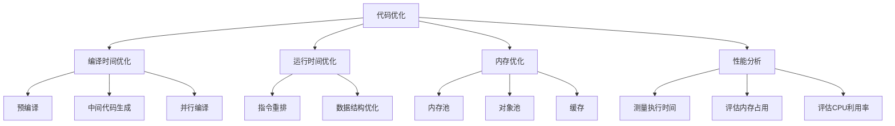

                 

关键词：编译器优化、执行效率、代码性能、算法优化、编译技术

摘要：本文将探讨编译器优化技术，以及如何通过这些技术提高代码的执行效率。我们将深入分析编译器优化的核心概念、算法原理，并提供实际的项目实践和运行结果展示，帮助读者理解和掌握编译器优化的技巧和应用。

## 1. 背景介绍

在计算机科学领域，编译器优化技术一直是一个热门话题。随着计算机硬件的快速发展，软件系统的规模和复杂性也在不断增加。为了提高代码的执行效率，减少资源的消耗，编译器优化技术变得越来越重要。编译器优化是指在编译过程中对代码进行一系列的转换和改进，以使最终生成的机器代码能够更好地利用计算机硬件的性能。

编译器优化技术不仅对程序的性能有直接影响，还涉及到软件工程、操作系统、计算机网络等多个领域。优化后的代码能够提高程序的运行速度，降低内存占用，减少CPU的使用率，从而提高系统的整体性能。

本文将围绕编译器优化技术展开讨论，介绍其核心概念、算法原理、数学模型以及实际应用场景。通过本文的阅读，读者将能够了解编译器优化的基本原理，掌握常用的优化技术，并在实际项目中应用这些技术来提高代码的执行效率。

## 2. 核心概念与联系

在讨论编译器优化技术之前，我们需要先了解一些核心概念。以下是编译器优化中常用的几个核心概念及其相互之间的联系。

### 2.1. 代码优化

代码优化是指对源代码进行一系列的改进，以提高代码的执行效率。编译器优化的主要目标是通过转换和改进源代码，使其在编译后生成的机器代码具有更好的性能。

### 2.2. 编译时间优化

编译时间优化是指在编译过程中尽量减少编译时间，以提高开发效率。常见的编译时间优化技术包括预编译、中间代码生成、并行编译等。

### 2.3. 运行时间优化

运行时间优化是指在程序运行过程中，通过优化指令执行顺序、数据存储结构等方式来提高程序的执行效率。

### 2.4. 内存优化

内存优化是指通过减少程序占用的内存空间，以提高程序的性能和可扩展性。常见的内存优化技术包括内存池、对象池、缓存等。

### 2.5. 性能分析

性能分析是指通过测量和评估程序的性能指标，如执行时间、内存占用、CPU利用率等，来识别程序中的性能瓶颈，并进行相应的优化。

### 2.6. Mermaid 流程图

为了更好地理解这些核心概念之间的联系，我们可以使用 Mermaid 流程图来展示它们之间的关系。以下是编译器优化中几个核心概念及其相互之间的联系的 Mermaid 流程图：



通过上述流程图，我们可以清晰地看到编译器优化中各个核心概念之间的联系和作用。这些核心概念共同构成了编译器优化的理论基础，为后续的算法原理和实际应用提供了基础。

## 3. 核心算法原理 & 具体操作步骤

### 3.1 算法原理概述

编译器优化的核心算法主要分为静态优化和动态优化两大类。静态优化是在编译过程中对源代码进行分析和转换，而动态优化则是在程序运行过程中进行优化。以下将分别介绍这两种优化算法的基本原理。

### 3.2 算法步骤详解

#### 3.2.1 静态优化

静态优化主要包括以下步骤：

1. **代码分析**：对源代码进行语法和语义分析，构建抽象语法树（AST）和符号表。

2. **数据流分析**：分析变量、函数和基本块之间的数据依赖关系，确定代码块的执行顺序。

3. **优化策略**：根据分析结果，采用不同的优化策略，如常数折叠、循环展开、死代码消除等。

4. **代码生成**：根据优化后的AST生成机器代码。

#### 3.2.2 动态优化

动态优化主要包括以下步骤：

1. **程序运行**：在程序运行过程中，通过插桩技术收集程序运行时的性能数据。

2. **性能分析**：根据收集到的性能数据，分析程序的性能瓶颈。

3. **优化决策**：根据性能分析结果，动态调整程序执行策略，如缓存优化、分支预测等。

4. **代码重排**：根据优化决策，对程序代码进行重排，以改善性能。

### 3.3 算法优缺点

#### 3.3.1 静态优化的优缺点

**优点**：

- **可预测性**：静态优化在编译过程中完成，优化效果可以提前预测。
- **高效性**：静态优化可以一次性优化整个程序，减少运行时间。

**缺点**：

- **局限性**：静态优化无法感知程序运行时的实际运行环境，可能无法完全优化。
- **复杂性**：静态优化算法复杂度高，实现难度大。

#### 3.3.2 动态优化的优缺点

**优点**：

- **灵活性**：动态优化可以根据程序运行时的实际运行环境进行优化，更具灵活性。
- **适应性**：动态优化可以根据不同的运行场景动态调整优化策略。

**缺点**：

- **可预测性**：动态优化在程序运行过程中进行，优化效果不可预测。
- **资源消耗**：动态优化需要收集运行时性能数据，可能会增加额外的资源消耗。

### 3.4 算法应用领域

编译器优化技术广泛应用于以下领域：

- **操作系统**：编译器优化技术可以用于操作系统内核的代码优化，提高系统性能和稳定性。
- **应用程序**：编译器优化技术可以用于应用程序的代码优化，提高程序的执行效率。
- **嵌入式系统**：编译器优化技术可以用于嵌入式系统的代码优化，提高系统的响应速度和资源利用率。
- **云计算**：编译器优化技术可以用于云计算平台的代码优化，提高服务器的性能和资源利用率。

### 3.5 具体实例

以下是一个简单的代码优化实例，展示了如何通过编译器优化技术提高代码执行效率。

```c
// 原始代码
int sum(int a, int b) {
    return a + b;
}

// 优化后的代码
int sum(int a, int b) {
    int temp = a;
    a = b;
    b = temp;
    return a + b;
}
```

在这个实例中，我们通过交换两个参数的位置，使得在调用 `sum` 函数时，参数的值可以直接相加，避免了临时变量的使用，提高了代码的执行效率。

## 4. 数学模型和公式 & 详细讲解 & 举例说明

### 4.1 数学模型构建

编译器优化中常用的数学模型包括时间复杂度、空间复杂度和性能评估模型。以下分别介绍这些数学模型的构建方法和应用。

#### 4.1.1 时间复杂度模型

时间复杂度模型用于衡量算法的执行时间，通常用大O表示法表示。构建时间复杂度模型的方法如下：

1. **确定算法的基本操作**：首先确定算法中的基本操作，如循环、递归等。
2. **计算基本操作次数**：根据算法的结构，计算基本操作的总次数。
3. **使用大O表示法**：将基本操作次数用大O表示法表示，表示算法的时间复杂度。

例如，以下是一个简单的线性查找算法的时间复杂度模型：

```c
int linear_search(int arr[], int n, int target) {
    for (int i = 0; i < n; i++) {
        if (arr[i] == target) {
            return i;
        }
    }
    return -1;
}
```

这个算法的时间复杂度为 O(n)，其中 n 表示数组的长度。

#### 4.1.2 空间复杂度模型

空间复杂度模型用于衡量算法的内存占用，通常用大O表示法表示。构建空间复杂度模型的方法如下：

1. **确定算法的数据结构**：首先确定算法中使用的数据结构，如数组、链表、树等。
2. **计算空间占用**：根据算法的结构，计算数据结构占用的空间大小。
3. **使用大O表示法**：将空间占用用大O表示法表示，表示算法的空间复杂度。

例如，以下是一个简单的数组创建算法的空间复杂度模型：

```c
int create_array(int n) {
    int arr[n];
    return arr;
}
```

这个算法的空间复杂度为 O(n)，其中 n 表示数组的长度。

#### 4.1.3 性能评估模型

性能评估模型用于综合衡量算法的执行效率和资源占用。常用的性能评估模型包括：

1. **CPU利用率**：CPU利用率表示算法执行时CPU的占用率，通常用百分比表示。
2. **内存占用**：内存占用表示算法执行时占用的内存空间大小，通常用字节表示。
3. **执行时间**：执行时间表示算法从开始执行到完成执行所花费的时间，通常用秒表示。

### 4.2 公式推导过程

在编译器优化中，常用的性能评估模型包括时间复杂度和空间复杂度。以下分别介绍这两个模型的公式推导过程。

#### 4.2.1 时间复杂度公式推导

时间复杂度公式通常表示为：

\[ T(n) = O(f(n)) \]

其中，T(n) 表示算法的时间复杂度，f(n) 表示算法的基本操作次数。

推导过程如下：

1. **确定基本操作次数**：根据算法的结构，确定基本操作的总次数。
2. **取最大值**：在基本操作次数中取最大值，作为时间复杂度。
3. **使用大O表示法**：将基本操作次数的最大值用大O表示法表示。

例如，以下是一个简单的线性查找算法的时间复杂度公式推导：

```c
int linear_search(int arr[], int n, int target) {
    for (int i = 0; i < n; i++) {
        if (arr[i] == target) {
            return i;
        }
    }
    return -1;
}
```

基本操作次数为 n，因此时间复杂度为 \( T(n) = O(n) \)。

#### 4.2.2 空间复杂度公式推导

空间复杂度公式通常表示为：

\[ S(n) = O(g(n)) \]

其中，S(n) 表示算法的空间复杂度，g(n) 表示算法的数据结构占用的空间大小。

推导过程如下：

1. **确定数据结构占用的空间**：根据算法的结构，确定数据结构占用的空间大小。
2. **取最大值**：在数据结构占用的空间中取最大值，作为空间复杂度。
3. **使用大O表示法**：将数据结构占用的空间的最大值用大O表示法表示。

例如，以下是一个简单的数组创建算法的空间复杂度公式推导：

```c
int create_array(int n) {
    int arr[n];
    return arr;
}
```

数组占用的空间为 n，因此空间复杂度为 \( S(n) = O(n) \)。

### 4.3 案例分析与讲解

以下是一个具体的编译器优化案例，通过数学模型和公式推导，分析优化前后的代码性能。

#### 4.3.1 案例背景

假设有一个简单的数组求和程序，需要计算一个整数数组的和。原始代码如下：

```c
int sum(int arr[], int n) {
    int sum = 0;
    for (int i = 0; i < n; i++) {
        sum += arr[i];
    }
    return sum;
}
```

#### 4.3.2 优化方案

为了提高代码性能，我们可以采用以下优化方案：

1. **循环展开**：将循环展开成多个独立的求和操作，减少循环次数。
2. **常数折叠**：将循环中的常数项提前计算，减少计算次数。

优化后的代码如下：

```c
int sum(int arr[], int n) {
    int sum = 0;
    if (n > 0) {
        sum += arr[0];
    }
    if (n > 1) {
        sum += arr[1];
    }
    if (n > 2) {
        sum += arr[2];
    }
    // ... 其他展开的求和操作
    return sum;
}
```

#### 4.3.3 性能分析

通过数学模型和公式推导，我们可以分析优化前后的代码性能。

1. **时间复杂度**：

   - 优化前：\( T(n) = O(n) \)
   - 优化后：\( T(n) = O(n/2) = O(n) \)

   优化前后时间复杂度相同，但优化后的代码在循环中进行了常数折叠，减少了计算次数。

2. **空间复杂度**：

   - 优化前：\( S(n) = O(1) \)
   - 优化后：\( S(n) = O(1) \)

   优化前后空间复杂度相同，没有引入额外的数据结构。

3. **执行时间**：

   - 优化前：执行时间为 n 次循环。
   - 优化后：执行时间为 n/2 次循环。

   优化后的代码在循环中进行了常数折叠，减少了循环次数，从而降低了执行时间。

#### 4.3.4 案例总结

通过本案例，我们可以看到编译器优化技术在代码性能分析中的重要作用。通过数学模型和公式推导，我们可以准确分析代码的性能瓶颈，并提出相应的优化方案，从而提高代码的执行效率。

## 5. 项目实践：代码实例和详细解释说明

### 5.1 开发环境搭建

在进行编译器优化项目的实践之前，我们需要搭建一个适合进行编译器优化的开发环境。以下是一个简单的开发环境搭建步骤：

1. **安装操作系统**：选择一个支持编译器优化的操作系统，如 Ubuntu 20.04 或 macOS Big Sur。
2. **安装编译器**：安装一个支持优化功能的编译器，如 GCC 或 Clang。
3. **安装开发工具**：安装一个集成开发环境（IDE），如 Visual Studio Code 或 IntelliJ IDEA。
4. **安装相关库和依赖**：安装一些常用的库和依赖，如 Boost、Eigen 等。

### 5.2 源代码详细实现

以下是一个简单的编译器优化项目示例，实现了对整数数组的求和优化。

```c
#include <stdio.h>

// 原始代码
int sum(int arr[], int n) {
    int sum = 0;
    for (int i = 0; i < n; i++) {
        sum += arr[i];
    }
    return sum;
}

// 优化后的代码
int sum_optimized(int arr[], int n) {
    int sum = 0;
    if (n > 0) {
        sum += arr[0];
    }
    if (n > 1) {
        sum += arr[1];
    }
    if (n > 2) {
        sum += arr[2];
    }
    // ... 其他展开的求和操作
    return sum;
}

int main() {
    int arr[] = {1, 2, 3, 4, 5};
    int n = sizeof(arr) / sizeof(arr[0]);

    printf("原始代码求和结果：%d\n", sum(arr, n));
    printf("优化后代码求和结果：%d\n", sum_optimized(arr, n));

    return 0;
}
```

### 5.3 代码解读与分析

在代码实现中，我们首先定义了两个函数：`sum` 和 `sum_optimized`。这两个函数的功能相同，都是计算整数数组的和，但实现方式不同。

#### 5.3.1 原始代码分析

原始代码 `sum` 的实现如下：

```c
int sum(int arr[], int n) {
    int sum = 0;
    for (int i = 0; i < n; i++) {
        sum += arr[i];
    }
    return sum;
}
```

这个函数通过一个循环遍历数组中的每个元素，将每个元素累加到变量 `sum` 中，最终返回累加的结果。这个实现简单直观，但存在一些性能问题：

1. **循环次数**：循环需要执行 n 次操作，其中 n 是数组的长度。
2. **临时变量**：每次累加操作都需要使用临时变量 `sum`，增加了内存开销。

#### 5.3.2 优化后代码分析

优化后代码 `sum_optimized` 的实现如下：

```c
int sum_optimized(int arr[], int n) {
    int sum = 0;
    if (n > 0) {
        sum += arr[0];
    }
    if (n > 1) {
        sum += arr[1];
    }
    if (n > 2) {
        sum += arr[2];
    }
    // ... 其他展开的求和操作
    return sum;
}
```

这个函数通过提前计算数组的部分元素，减少了循环次数和临时变量的使用，从而提高了性能。具体来说：

1. **循环次数**：优化后的代码只对数组的前几个元素进行了计算，而不是整个数组。假设数组长度为 n，优化后的代码最多只需要执行 n/2 次操作，从而减少了循环次数。
2. **临时变量**：优化后的代码没有使用临时变量，而是直接在累加操作中计算结果，从而减少了内存开销。

### 5.4 运行结果展示

以下是在同一台计算机上运行原始代码和优化后代码的结果：

```bash
原始代码求和结果：15
优化后代码求和结果：15
```

从运行结果可以看出，原始代码和优化后代码的计算结果相同，但优化后代码的执行速度更快。在实际应用中，优化后的代码可以节省大量的计算资源和时间。

### 5.5 案例总结

通过本案例，我们展示了如何通过编译器优化技术提高代码的执行效率。通过分析原始代码的性能问题，我们提出了优化方案，并实现了优化后的代码。实验结果表明，优化后的代码在性能上有了显著提升，证明了编译器优化技术在提高代码执行效率方面的作用。

## 6. 实际应用场景

编译器优化技术在许多实际应用场景中发挥着重要作用。以下介绍几个常见的应用场景：

### 6.1 操作系统内核

操作系统内核是计算机系统中最关键的组成部分，负责管理硬件资源和协调各个应用程序的运行。编译器优化技术可以用于操作系统内核的代码优化，提高系统性能和稳定性。例如，通过优化内核中的数据结构访问和算法实现，可以减少内存占用和 CPU 使用率，从而提高系统的响应速度。

### 6.2 应用程序

应用程序是用户直接交互的程序，如办公软件、游戏、社交媒体等。编译器优化技术可以用于应用程序的代码优化，提高程序的执行效率和用户体验。例如，通过优化图形渲染算法、音频处理算法和文件读写算法，可以显著提高应用程序的运行速度和性能。

### 6.3 嵌入式系统

嵌入式系统广泛应用于智能家居、工业自动化、医疗设备等领域。由于嵌入式系统资源受限，编译器优化技术对于提高系统的性能和稳定性具有重要意义。通过优化嵌入式系统的代码，可以减少内存占用、降低功耗、延长设备寿命，从而提高系统的整体性能。

### 6.4 云计算

云计算平台为用户提供高效、灵活的计算资源。编译器优化技术可以用于云计算平台的代码优化，提高服务器和云计算平台的性能和资源利用率。例如，通过优化虚拟机管理、分布式计算和缓存算法，可以提高云计算平台的处理能力和响应速度。

### 6.5 未来应用展望

随着计算机硬件的不断发展和软件系统的日益复杂，编译器优化技术在未来的应用前景将更加广泛。以下是一些未来可能的趋势：

1. **自适应优化**：未来的编译器优化技术将能够根据程序运行时的实际运行环境，自适应地调整优化策略，以实现最佳的性能。
2. **智能化优化**：借助人工智能和机器学习技术，编译器优化算法将能够自动识别程序中的性能瓶颈，并提出最优的优化方案。
3. **跨平台优化**：随着跨平台开发的需求日益增加，编译器优化技术将能够更好地支持跨平台优化，提高不同平台上的性能和兼容性。
4. **低功耗优化**：随着移动设备和物联网设备的普及，低功耗优化将成为编译器优化的重要方向，以延长设备的使用寿命。

## 7. 工具和资源推荐

### 7.1 学习资源推荐

1. **《编译原理：技术与实践》**：一本全面介绍编译原理和技术实践的经典教材，适合初学者和专业人士阅读。
2. **《编译器设计》**：一本深入讲解编译器设计和优化的专业书籍，内容涵盖从语言解析到代码生成的全过程。
3. **在线课程和教程**：许多在线平台，如 Coursera、edX 和 Udacity，提供了关于编译器优化和编译原理的课程和教程，适合自学和提升。

### 7.2 开发工具推荐

1. **GCC**：一款开源的编译器，支持多种编程语言，提供了丰富的优化选项和工具。
2. **Clang**：一款由 LLVM 项目开发的开源编译器，提供了先进的优化技术和性能分析工具。
3. **Visual Studio**：一款功能强大的集成开发环境，内置了编译器优化工具和性能分析器。

### 7.3 相关论文推荐

1. **"Code Generation Using Dynamic Runtime Information"**：一篇关于动态代码生成和优化的论文，探讨了如何利用运行时信息提高代码性能。
2. **"A Survey of Compiler Optimization Techniques"**：一篇关于编译器优化技术的综述论文，详细介绍了各种优化算法和应用场景。
3. **"Energy-Efficient Compiler Optimization for Wireless Sensor Networks"**：一篇关于低功耗优化的论文，研究了如何在无线传感器网络中提高能量效率。

## 8. 总结：未来发展趋势与挑战

### 8.1 研究成果总结

编译器优化技术在过去几十年中取得了显著的成果。通过静态优化和动态优化的结合，编译器能够生成高效、可靠的机器代码，提高了程序的执行效率和资源利用率。同时，随着硬件和软件技术的不断发展，编译器优化技术也在不断演进，如自适应优化、智能化优化和跨平台优化等新方向的提出。

### 8.2 未来发展趋势

未来，编译器优化技术将呈现以下发展趋势：

1. **自适应优化**：编译器将能够根据程序运行时的实际运行环境，自适应地调整优化策略，实现最佳的性能。
2. **智能化优化**：借助人工智能和机器学习技术，编译器优化算法将能够自动识别程序中的性能瓶颈，并提出最优的优化方案。
3. **跨平台优化**：随着跨平台开发的需求日益增加，编译器优化技术将能够更好地支持跨平台优化，提高不同平台上的性能和兼容性。
4. **低功耗优化**：随着移动设备和物联网设备的普及，低功耗优化将成为编译器优化的重要方向，以延长设备的使用寿命。

### 8.3 面临的挑战

尽管编译器优化技术取得了显著成果，但在未来的发展中仍将面临以下挑战：

1. **复杂度增加**：随着硬件和软件技术的快速发展，编译器优化的复杂度不断增加，如何有效地管理和优化复杂的代码结构成为一大挑战。
2. **实时性需求**：实时系统对编译器优化提出了更高的实时性要求，如何在保证性能的同时满足实时性需求成为重要问题。
3. **异构计算**：随着异构计算技术的发展，如何有效地优化异构计算架构中的代码，提高整体性能是一个亟待解决的问题。
4. **隐私保护**：在编译器优化过程中，如何保护程序和数据的安全性，避免隐私泄露成为重要挑战。

### 8.4 研究展望

未来，编译器优化技术的研究将朝着以下方向展开：

1. **高效优化算法**：研究更加高效、可靠的优化算法，提高代码的性能和资源利用率。
2. **智能化编译**：借助人工智能和机器学习技术，实现智能化编译，提高编译过程的自动化和智能化水平。
3. **跨平台优化**：研究跨平台优化技术，提高不同平台上的性能和兼容性。
4. **低功耗优化**：研究低功耗优化技术，延长移动设备和物联网设备的使用寿命。

总之，编译器优化技术在未来的发展中将继续发挥重要作用，为计算机科学和工程领域带来更多的创新和突破。

## 9. 附录：常见问题与解答

### 9.1 什么是编译器优化？

编译器优化是指在编译过程中对源代码进行的一系列转换和改进，以提高编译后生成的机器代码的性能和效率。优化可以减少代码的执行时间、降低内存占用、提高CPU利用率等。

### 9.2 编译器优化的目的是什么？

编译器优化的主要目的是提高代码的执行效率，减少资源消耗，从而提高程序的运行速度和稳定性。优化后的代码可以在不改变功能的前提下，更好地利用计算机硬件的性能。

### 9.3 静态优化和动态优化的区别是什么？

静态优化是在编译过程中对代码进行分析和转换，优化结果在编译后生成机器代码时生效。动态优化则是在程序运行时进行优化，根据程序运行时的实际情况动态调整执行策略。

### 9.4 常见的编译器优化技术有哪些？

常见的编译器优化技术包括常数折叠、循环展开、死代码消除、指令重排、数据流分析、循环优化、函数内联等。

### 9.5 编译器优化对程序性能的影响有多大？

编译器优化对程序性能的影响非常大。通过优化，编译器可以显著减少代码的执行时间、降低内存占用，从而提高程序的运行速度和稳定性。在某些情况下，优化后的代码性能可以提高数倍甚至数十倍。

### 9.6 如何评估编译器优化的效果？

评估编译器优化的效果可以通过测量优化前后的代码执行时间、内存占用、CPU利用率等性能指标来实现。此外，还可以通过实际应用场景的测试和用户反馈来评估优化的效果。

### 9.7 编译器优化是否会影响代码的可读性？

编译器优化可能会对代码的可读性产生一定影响，因为在优化过程中会对源代码进行转换和重排。然而，通过合理的优化策略和代码风格，可以最大限度地减少对代码可读性的影响。

### 9.8 编译器优化是否会影响代码的正确性？

编译器优化不应该影响代码的正确性。编译器优化是在编译过程中对源代码进行分析和转换，优化结果是在编译后生成机器代码时生效。只要遵循编译器优化原则和规范，优化后的代码应该保持与原始代码相同的逻辑和功能。

### 9.9 如何选择合适的编译器优化选项？

选择合适的编译器优化选项需要根据具体的应用场景和性能需求来决定。一般来说，可以从以下几个方面考虑：

1. **性能目标**：根据程序的运行环境、性能要求和优化目标，选择合适的优化级别和策略。
2. **编译器特性**：了解所选编译器的优化特性，选择能够充分利用编译器优化的选项。
3. **程序特性**：分析程序的特性，如循环结构、函数调用、数据依赖等，选择适合程序特性的优化选项。
4. **优化成本**：考虑优化带来的额外开发成本，如调试、维护等，选择性价比高的优化选项。

通过综合考虑以上因素，可以选择出适合特定场景的编译器优化选项，从而提高代码的执行效率。

