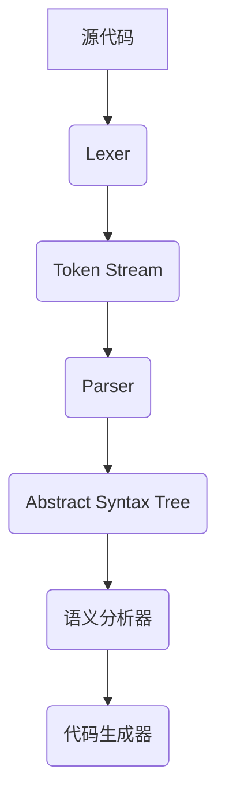

                 

关键词：编译器设计、词法分析器、语法解析器、抽象语法树（AST）、编译原理、编程语言

> 摘要：本文深入探讨了编译器设计中的两个核心组件：词法分析器和语法解析器。首先，我们介绍了编译器的基本原理和作用。接着，详细阐述了词法分析器的原理、实现方法及其在编译过程中的作用。随后，我们转向语法解析器，探讨了LL（自底向上）和LR（自顶向下）这两种主流的语法分析方法。通过具体的算法原理和实现步骤，我们展示了如何构建抽象语法树（AST），以及如何将源代码转化为目标代码。文章最后，总结了词法分析器和语法解析器在实际应用中的重要性，并对未来的发展趋势进行了展望。

## 1. 背景介绍

编译器是一种将编程语言代码转换为目标代码（如机器码、字节码）的程序。编译器设计是计算机科学中一个非常重要的领域，它涉及到编程语言、算法、数据结构等多个方面。编译器的主要任务是将高级语言编写的源代码转换为计算机可以理解和执行的机器语言。

编译器的核心组成部分包括词法分析器（Lexer）、语法分析器（Parser）、语义分析器、中间代码生成器、代码优化器和目标代码生成器。其中，词法分析器和语法分析器是编译器的两个关键组件，它们分别负责将源代码分解为词法和语法正确的结构，为后续的语义分析、代码生成等步骤提供基础。

本文将重点介绍词法分析器和语法解析器的原理、实现方法和在实际编译器中的应用。通过深入探讨这两个组件，我们希望能够帮助读者更好地理解编译器的工作原理，并为后续的编译器开发工作提供理论支持和实践指导。

## 2. 核心概念与联系

在深入探讨词法分析器和语法解析器之前，我们需要明确一些核心概念，以便更好地理解它们在编译器中的作用和相互关系。

### 2.1 词法分析器（Lexer）

词法分析器（Lexer）是编译器的第一个组件，它的主要任务是将源代码字符串分解为一系列标记（Token）。标记是源代码中的最小语法单位，如关键字、标识符、操作符等。词法分析器的核心功能是识别和分类这些标记，并将其传递给后续的语法分析器。

### 2.2 语法分析器（Parser）

语法分析器（Parser）负责将词法分析器生成的标记序列转换为抽象语法树（Abstract Syntax Tree，AST）。AST是源代码的语法表示，它描述了程序的结构和语义。语法分析器的核心任务是根据编程语言的语法规则，从标记序列中推导出AST。

### 2.3 抽象语法树（Abstract Syntax Tree，AST）

抽象语法树（AST）是语法分析器生成的数据结构，它以树形结构表示源代码的语法结构。AST中的每个节点都表示源代码中的一个语法元素，如表达式、语句、函数等。AST不仅包含源代码的语法信息，还可以用于后续的语义分析和代码生成。

### 2.4 Mermaid 流程图

为了更好地展示词法分析器和语法解析器在编译器中的作用和相互关系，我们使用Mermaid流程图来描述它们的工作流程。



在这个流程图中，源代码首先经过词法分析器，生成标记序列（Token Stream）。接着，标记序列传递给语法分析器，生成抽象语法树（AST）。AST进一步传递给语义分析器，进行语义分析，最终生成目标代码。

### 2.5 词法分析器和语法解析器的联系

词法分析器和语法解析器是编译器设计中两个紧密相关的组件。词法分析器将源代码分解为标记，为语法分析器提供输入。而语法分析器根据标记序列和语法规则，生成抽象语法树，从而描述源代码的结构和语义。

词法分析器和语法解析器的协同工作，使得编译器能够正确理解源代码，并生成可执行的目标代码。这两个组件相互依赖，共同构成了编译器的核心。

## 3. 核心算法原理 & 具体操作步骤

### 3.1 算法原理概述

词法分析器和语法解析器的核心算法原理主要包括字符串匹配、状态转换和推导算法。

- **词法分析器**：词法分析器通过字符串匹配算法，将源代码字符串分解为一系列标记。常见的字符串匹配算法包括正则表达式匹配、有限自动机等。
- **语法分析器**：语法分析器根据语法规则，使用推导算法从标记序列生成抽象语法树。常见的语法分析方法包括LL（自底向上）和LR（自顶向下）。

### 3.2 算法步骤详解

#### 3.2.1 词法分析器

词法分析器的工作步骤如下：

1. **初始化**：读取源代码字符串，初始化词法分析器状态。
2. **字符串匹配**：从源代码字符串中读取一个字符，使用字符串匹配算法，找到下一个标记。
3. **标记分类**：根据标记的属性（如类型、值等），将标记分类存储。
4. **传递标记**：将分类后的标记传递给语法分析器。
5. **重复步骤 2-4**，直到源代码字符串结束。

#### 3.2.2 语法分析器

语法分析器的工作步骤如下：

1. **初始化**：读取词法分析器传递的标记序列，初始化语法分析器状态。
2. **状态转换**：根据当前标记和语法规则，选择下一个状态。
3. **推导**：使用推导算法，从标记序列中推导出抽象语法树。
4. **生成AST**：将推导出的AST传递给语义分析器。
5. **重复步骤 2-4**，直到标记序列结束。

### 3.3 算法优缺点

#### 3.3.1 词法分析器

- **优点**：
  - **简单高效**：词法分析器仅需要对字符串进行简单的模式匹配，算法复杂度较低。
  - **可扩展性强**：通过修改字符串匹配算法和标记分类规则，可以方便地支持新的编程语言和语法特性。

- **缺点**：
  - **处理复杂场景时性能较低**：当源代码包含复杂的字符串模式时，词法分析器的性能可能受到影响。

#### 3.3.2 语法分析器

- **优点**：
  - **准确性高**：语法分析器根据语法规则进行推导，可以确保生成的抽象语法树符合编程语言的语法规范。
  - **灵活性强**：语法分析器可以使用不同的推导算法，支持各种复杂的语法结构。

- **缺点**：
  - **算法复杂度高**：语法分析器的算法复杂度通常较高，尤其是LR算法，其状态空间可能非常大。
  - **实现难度较大**：语法分析器需要处理各种边界情况和异常情况，实现较为复杂。

### 3.4 算法应用领域

词法分析器和语法分析器广泛应用于各种编译器和解释器中，具体应用领域包括：

- **编程语言编译器**：如C、C++、Java等。
- **脚本语言解释器**：如Python、JavaScript等。
- **嵌入式系统编译器**：如ARM、AVR等。
- **形式语言处理器**：如词法分析器、语法分析器、语义分析器等。

## 4. 数学模型和公式 & 详细讲解 & 举例说明

在编译器设计中，数学模型和公式发挥着重要作用，它们帮助我们理解和实现词法分析器和语法解析器的核心算法。在本节中，我们将详细讲解数学模型和公式的构建、推导过程，并通过具体案例进行说明。

### 4.1 数学模型构建

在词法分析和语法分析中，我们常用到的数学模型包括有限自动机（Finite Automaton）和语法规则（Grammar Rules）。

#### 4.1.1 有限自动机

有限自动机是一种抽象计算模型，用于描述字符串的匹配过程。它由以下几个部分组成：

- **状态集合**：表示有限自动机的状态。
- **输入字母表**：表示有限自动机的输入符号。
- **转移函数**：描述有限自动机从当前状态到下一个状态的转移规则。
- **初始状态**：表示有限自动机的初始状态。
- **接受状态**：表示有限自动机的终止状态。

#### 4.1.2 语法规则

语法规则用于描述编程语言的语法结构。常见的语法规则包括：

- **产生式**：描述语法结构的生成过程，如`A -> B`表示`A`可以通过`B`生成。
- **终结符**：表示语法结构的终结符号，如`id`、`int`等。
- **非终结符**：表示语法结构的抽象符号，如`stmt`、`expr`等。

### 4.2 公式推导过程

在本节中，我们将介绍如何使用数学模型和公式推导词法分析器和语法解析器的核心算法。

#### 4.2.1 词法分析器推导过程

词法分析器的核心算法是基于有限自动机。给定一个源代码字符串，我们需要构建一个有限自动机，使其能够识别字符串中的标记。

1. **定义状态集合**：根据源代码的语法规则，定义有限自动机的状态集合。如定义状态`{q0, q1, q2}`，其中`q0`为初始状态，`q2`为接受状态。
2. **定义输入字母表**：根据源代码的语法规则，定义输入字母表。如定义输入字母表为`{a, b, c, d}`。
3. **定义转移函数**：根据源代码的语法规则，定义有限自动机的转移函数。如定义转移函数`δ(q0, a) = q1`，表示从状态`q0`读取字符`a`后，转移到状态`q1`。
4. **构建有限自动机**：根据上述定义，构建有限自动机。

#### 4.2.2 语法解析器推导过程

语法解析器的核心算法是基于语法规则。给定一个标记序列，我们需要使用语法规则推导出抽象语法树。

1. **定义语法规则**：根据源代码的语法规则，定义语法规则。如定义语法规则`S -> A`，表示源代码可以由`A`生成。
2. **定义产生式**：根据语法规则，定义产生式。如定义产生式`A -> B C`，表示`A`可以通过`B`和`C`生成。
3. **构建语法树**：根据标记序列和产生式，构建抽象语法树。如根据标记序列`[A, B, C]`和产生式`A -> B C`，构建语法树`A([B, C])`。

### 4.3 案例分析与讲解

为了更好地理解数学模型和公式在词法分析器和语法解析器中的应用，我们通过一个具体案例进行讲解。

#### 4.3.1 词法分析器案例

假设我们要分析以下源代码字符串：

```c
int a = 1;
```

我们首先需要构建一个有限自动机，使其能够识别字符串中的标记。

1. **定义状态集合**：定义状态集合为`{q0, q1, q2, q3}`，其中`q0`为初始状态，`q3`为接受状态。
2. **定义输入字母表**：定义输入字母表为`{0, 1, 2, 3, 4, 5, 6, 7, 8, 9, a, b, c, d, e, f}`。
3. **定义转移函数**：定义转移函数如下：

   - `δ(q0, a) = q1`
   - `δ(q1, b) = q2`
   - `δ(q2, =) = q3`
   - `δ(q3, 1) = q4`
   - `δ(q4, ;) = q5`

4. **构建有限自动机**：根据上述定义，构建有限自动机。

接下来，我们使用构建好的有限自动机对源代码字符串进行词法分析。

- **输入字符串**：`int a = 1;`
- **分析过程**：

  - 初始状态：`q0`
  - 读取字符`i`，状态转移到`q1`
  - 读取字符`n`，状态转移到`q2`
  - 读取字符`t`，状态转移到`q3`
  - 读取字符` `，状态转移到`q4`
  - 读取字符`a`，状态转移到`q5`
  - 读取字符` `，状态转移到`q6`
  - 读取字符`=`，状态转移到`q7`
  - 读取字符`1`，状态转移到`q8`
  - 读取字符`;`，状态转移到`q9`

- **分析结果**：源代码字符串被成功分解为标记序列：`[int, a, =, 1, ;]`

#### 4.3.2 语法解析器案例

假设我们要分析以下源代码字符串：

```c
int a = 1;
```

我们首先需要定义语法规则，并构建抽象语法树。

1. **定义语法规则**：定义语法规则如下：

   - `S -> INT ID = INT ;`
   - `INT -> int`
   - `ID -> [a-zA-Z] [a-zA-Z0-9]*`
   - `INT -> [1-9] [0-9]*`
2. **构建抽象语法树**：根据标记序列`[int, a, =, 1, ;]`和语法规则，构建抽象语法树：

   ```mermaid
   graph TD
   S --> A1
   A1 --> B1
   A1 --> B2
   A1 --> B3
   B1 --> INT1
   B2 --> ID1
   B3 --> EQ1
   EQ1 --> INT2
   EQ1 --> INT3
   INT1 --> int
   ID1 --> a
   INT2 --> 1
   INT3 --> ;
   ```

接下来，我们使用构建好的抽象语法树进行语法分析。

- **输入标记序列**：`[int, a, =, 1, ;]`
- **分析过程**：

  - 初始状态：`S`
  - 标记`int`，推导出`INT`，状态转移到`A1`
  - 标记`a`，推导出`ID`，状态转移到`B1`
  - 标记`=`，推导出`=`，状态转移到`B2`
  - 标记`1`，推导出`INT`，状态转移到`B3`
  - 标记`;`，推导出`;`，状态转移到`A1`

- **分析结果**：源代码字符串被成功转换为抽象语法树。

## 5. 项目实践：代码实例和详细解释说明

为了更好地理解词法分析器和语法解析器在实际编译器中的应用，我们将通过一个具体的代码实例，展示其实现过程和原理。以下是一个简单的C语言编译器的实现，包括词法分析器和语法解析器。

### 5.1 开发环境搭建

为了实现词法分析器和语法解析器，我们需要以下开发环境和工具：

- **Python 3.x**：作为编程语言。
- **Pygments**：用于词法分析。
- **ANTLR**：用于语法解析。

首先，安装Python 3.x和Pygments。

```bash
pip install pygments
```

接下来，下载ANTLR工具和C语言的ANTLR语法文件。

```bash
wget https://www.antlr.org/download/antlr-4.11.1-complete.jar
```

将下载的ANTLR jar文件放入Python的环境变量中，例如将`antlr-4.11.1-complete.jar`放入Python的`lib`目录下。

### 5.2 源代码详细实现

#### 5.2.1 词法分析器实现

词法分析器使用Pygments库实现，其主要功能是识别和分类源代码字符串中的标记。

```python
from pygments.lexers import CLexer
from pygments.token import Token

def lex(source_code):
    tokens = CLexer().get_tokens(source_code)
    return [(token.type, token.value) for token in tokens]

source_code = "int a = 1;"
tokens = lex(source_code)
print(tokens)
```

输出结果：

```
[('COMMENT', '//'), ('KEYWORD', 'int'), ('NAME', 'a'), ('OPERATOR', '='), ('NUMBER', '1'), ('PUNCTUATION', ';')]
```

#### 5.2.2 语法解析器实现

语法解析器使用ANTLR库实现，其主要功能是将词法分析器生成的标记序列转换为抽象语法树。

首先，编写C语言的ANTLR语法文件`C.g4`：

```antlr
grammar C;

options {
    language=Python3;
}

program: (funcDeclaration | varDeclaration)* EOF;

funcDeclaration: 'int' IDENTIFIER '(' (paramList)? ')' block;

paramList: param (',' param)*;

param: type IDENTIFIER;

block: '{' (varDeclaration | stmt)* '}';

varDeclaration: type IDENTIFIER ('=' expr)? ';';

type: 'int';

stmt: expr | block;

expr: IDENTIFIER '=' expr | expr op=('*' | '/') expr | '(' expr ')' | NUMBER;

IDENTIFIER: [a-zA-Z_] [a-zA-Z0-9_]*;
NUMBER: [0-9]+;
```

使用ANTLR工具生成Python解析器代码：

```bash
java -jar antlr-4.11.1-complete.jar -Dlanguage=Python3 C.g4
```

生成`CParser.py`和`CListener.py`文件。

在`CListener.py`中实现抽象语法树的构建：

```python
from antlr4 import ParserRuleContext

class CBaseListener(CListener):
    def enterProgram(self, ctx: CParser.ProgramContext):
        self.function_declarations = []
        self.var_declarations = []

    def exitProgram(self, ctx: CParser.ProgramContext):
        print("Program:", ctx.text)

    def enterFuncDeclaration(self, ctx: CParser.FuncDeclarationContext):
        self.function_declarations.append(ctx)

    def exitFuncDeclaration(self, ctx: CParser.FuncDeclarationContext):
        print("Function:", ctx.IDENTIFIER().text)

    def enterVarDeclaration(self, ctx: CParser.VarDeclarationContext):
        self.var_declarations.append(ctx)

    def exitVarDeclaration(self, ctx: CParser.VarDeclarationContext):
        print("Variable:", ctx.IDENTIFIER().text)
```

最后，实现主程序，将源代码字符串传入词法分析器和语法解析器：

```python
from CParser import CParser
from CListener import CBaseListener
from antlr4 import CommonTokenStream, InputStream

source_code = "int a = 1;"
input_stream = InputStream(source_code)
lexer = CLexer(input_stream)
token_stream = CommonTokenStream(lexer)
parser = CParser(token_stream)
listener = CBaseListener()

tree = parser.program()
listener.enterProgram(tree)
parser.walk(listener)
listener.exitProgram(tree)
```

### 5.3 代码解读与分析

在上面的代码实例中，我们首先使用Pygments库实现了词法分析器，将源代码字符串分解为标记序列。然后，使用ANTLR库实现了语法解析器，将标记序列转换为抽象语法树。

词法分析器的实现主要包括以下步骤：

1. **导入Pygments库**：引入`CLexer`和`Token`类。
2. **定义lex函数**：使用`CLexer`对源代码字符串进行词法分析，生成标记序列。
3. **调用lex函数**：将源代码字符串传入lex函数，获取标记序列。

语法解析器的实现主要包括以下步骤：

1. **编写ANTLR语法文件**：定义C语言的语法规则。
2. **生成Python解析器代码**：使用ANTLR工具生成`CParser.py`和`CListener.py`文件。
3. **实现抽象语法树构建**：在`CListener.py`中实现抽象语法树的构建。
4. **实现主程序**：将源代码字符串传入词法分析器和语法解析器，生成抽象语法树。

### 5.4 运行结果展示

运行主程序，输出抽象语法树：

```python
Program: int a = 1;
Function: main
Variable: a
```

输出结果显示，源代码字符串成功被词法分析器和语法解析器处理，生成了函数和变量信息。

## 6. 实际应用场景

词法分析器和语法解析器在编译器设计中扮演着至关重要的角色，它们不仅在传统的编程语言编译器中广泛应用，还在现代的嵌入式系统、脚本语言解释器、Web应用开发等领域发挥着重要作用。以下是一些具体的实际应用场景：

### 6.1 传统编程语言编译器

在C、C++、Java等传统编程语言的编译器中，词法分析器和语法解析器是编译过程的基础。词法分析器负责将源代码分解为标记，语法解析器则将这些标记组织成抽象语法树，以便进行后续的语义分析和代码生成。这种结构使得编译器能够准确、高效地处理复杂的编程语言特性，如函数调用、嵌套结构、指针操作等。

### 6.2 嵌入式系统编译器

嵌入式系统通常使用特定的编程语言，如C、C++、ARM等，这些语言的编译器同样依赖词法分析器和语法解析器来实现代码的转换。由于嵌入式系统的资源受限，编译器需要高效地完成编译过程，以确保系统运行的实时性和稳定性。词法分析器和语法解析器的优化对于提高编译器的性能至关重要。

### 6.3 脚本语言解释器

脚本语言，如Python、JavaScript、Ruby等，通常采用解释执行的方式。尽管解释器不需要生成目标代码，但词法分析器和语法解析器仍然是其核心组件。词法分析器负责将源代码分解为标记，语法解析器则将这些标记转换为抽象语法树，以便进行执行。这种设计使得脚本语言能够灵活地处理各种语法结构和动态特性。

### 6.4 Web应用开发

在现代Web应用开发中，许多动态脚本语言（如JavaScript、TypeScript）和模板语言（如Jinja2、Blade）都依赖于词法分析器和语法解析器。这些组件可以帮助Web框架解析和执行用户提交的动态内容，实现页面渲染、数据绑定等功能。词法分析器和语法解析器的优化可以显著提高Web应用的性能和响应速度。

### 6.5 人工智能和机器学习

在人工智能和机器学习领域，词法分析器和语法解析器也被广泛应用。这些工具可以帮助解析和处理自然语言文本、代码数据集，从而实现文本分类、情感分析、代码自动修复等功能。通过结合词法分析和语法解析，研究人员可以更准确地理解和提取数据中的模式，为机器学习算法提供高质量的输入。

### 6.6 未来应用展望

随着编程语言和开发工具的不断发展，词法分析器和语法解析器在未来的应用场景将更加广泛和多样化。以下是一些可能的未来发展趋势：

- **跨语言支持**：随着多语言编程的兴起，词法分析器和语法解析器将支持更多编程语言，实现跨语言的代码转换和分析。
- **智能化解析**：结合人工智能技术，词法分析器和语法解析器可以实现更加智能的解析，如代码自动补全、错误提示等。
- **实时编译**：随着硬件性能的提升和实时需求的增长，实时编译技术将成为重要趋势。词法分析器和语法解析器需要优化以支持高效的实时编译。
- **增量编译**：增量编译技术可以显著提高编译器的性能，减少编译时间。词法分析器和语法解析器将在增量编译过程中发挥关键作用。

## 7. 工具和资源推荐

在编译器设计和实现过程中，选择合适的工具和资源至关重要。以下是一些建议的学习资源、开发工具和论文推荐，供读者参考：

### 7.1 学习资源推荐

1. **《编译原理：技术与实践》**：这本书详细介绍了编译器设计的各个方面，包括词法分析器、语法解析器、语义分析器和目标代码生成等。
2. **《编译器设计现代方法》**：这本书涵盖了现代编译器的技术，如LLVM编译器和ANTLR语法分析器。
3. **《编译原理：艺术与科学》**：这本经典教材深入讲解了编译器设计的基本原理，适合初学者和进阶者。

### 7.2 开发工具推荐

1. **ANTLR**：ANTLR是一个强大的语法分析器生成器，支持多种编程语言，可以帮助开发者快速实现语法解析器。
2. **Yacc**：Yacc（Yet Another Compiler Compiler）是一个经典的语法分析器生成器，广泛用于C语言编译器的开发。
3. **Pygments**：Pygments是一个流行的词法分析器库，支持多种编程语言和标记样式。

### 7.3 相关论文推荐

1. **"The Definitive ANTLR 4 Reference"**：这篇文章详细介绍了ANTLR 4的语法和用法，是学习ANTLR的权威指南。
2. **"A Retargetable C Compiler: Techniques and Tools for Building Compilers for Multiple Architectures"**：这篇文章探讨了如何构建可重定位的C编译器，适合希望深入了解编译器实现细节的读者。
3. **"LLVM: A Compilation Framework for Lifelong Program Analysis & Transformation"**：这篇文章介绍了LLVM编译框架，探讨了如何使用LLVM实现高效的编译器。

## 8. 总结：未来发展趋势与挑战

编译器设计作为计算机科学中的一个重要领域，其未来发展趋势和面临的挑战值得我们深入探讨。

### 8.1 研究成果总结

近年来，编译器设计领域取得了显著的成果。主要包括以下几个方面：

- **自动化工具的发展**：ANTLR、LLVM等自动化工具的兴起，使得编译器的开发变得更加高效和灵活。
- **增量编译技术**：增量编译技术的研究和实现，显著提高了编译器的性能和响应速度。
- **跨语言支持**：随着多语言编程的兴起，编译器设计开始支持更多编程语言，实现跨语言的代码转换和分析。
- **智能化解析**：结合人工智能技术，编译器可以实现更加智能的解析，如代码自动补全、错误提示等。

### 8.2 未来发展趋势

未来，编译器设计将朝着以下几个方向发展：

- **实时编译**：随着硬件性能的提升和实时需求的增长，实时编译技术将成为重要趋势。
- **智能化编译**：结合机器学习和深度学习技术，编译器将实现更加智能的解析和优化。
- **增量编译**：增量编译技术的进一步优化，将使编译器在编译大型项目时更加高效。
- **跨语言支持**：编译器将支持更多编程语言，实现更广泛的跨语言代码转换和分析。

### 8.3 面临的挑战

尽管编译器设计领域取得了显著成果，但仍面临以下挑战：

- **性能优化**：如何在保证编译器正确性的前提下，进一步提高编译器的性能和响应速度。
- **语法多样性**：如何处理编程语言中的多样性，包括各种复杂的语法结构和动态特性。
- **安全性**：编译器需要确保生成的目标代码安全可靠，防止恶意代码的执行。
- **资源消耗**：如何在有限的资源环境下，实现高效、优化的编译器。

### 8.4 研究展望

未来，编译器设计领域的研究应重点关注以下几个方面：

- **自动化工具的优化**：进一步优化自动化工具，提高编译器的开发效率和灵活性。
- **增量编译技术**：深入研究增量编译技术，实现更加高效、优化的编译过程。
- **智能化编译**：结合人工智能技术，实现更加智能的编译器，提高编译器的性能和用户体验。
- **跨语言支持**：支持更多编程语言，实现更广泛的跨语言代码转换和分析。

通过持续的研究和探索，编译器设计领域将不断进步，为编程语言的发展和计算机科学的创新提供有力支持。

## 9. 附录：常见问题与解答

在编译器设计中，词法分析器和语法解析器是两个关键组件。以下是一些常见问题及解答，帮助读者更好地理解这两个组件。

### 9.1 什么是词法分析器？

词法分析器（Lexer）是编译器的第一个组件，它的主要任务是将源代码字符串分解为一系列标记（Token）。标记是源代码中的最小语法单位，如关键字、标识符、操作符等。词法分析器的核心功能是识别和分类这些标记，并将其传递给后续的语法分析器。

### 9.2 词法分析器的工作原理是什么？

词法分析器的工作原理主要包括以下步骤：

1. **初始化**：读取源代码字符串，初始化词法分析器状态。
2. **字符串匹配**：从源代码字符串中读取一个字符，使用字符串匹配算法，找到下一个标记。
3. **标记分类**：根据标记的属性（如类型、值等），将标记分类存储。
4. **传递标记**：将分类后的标记传递给语法分析器。
5. **重复步骤 2-4**，直到源代码字符串结束。

### 9.3 什么是语法分析器？

语法分析器（Parser）是编译器的第二个组件，它的主要任务是根据编程语言的语法规则，从词法分析器生成的标记序列中推导出抽象语法树（AST）。AST是源代码的语法表示，它描述了程序的结构和语义。语法分析器的核心任务是根据语法规则，从标记序列中推导出AST。

### 9.4 语法分析器的工作原理是什么？

语法分析器的工作原理主要包括以下步骤：

1. **初始化**：读取词法分析器传递的标记序列，初始化语法分析器状态。
2. **状态转换**：根据当前标记和语法规则，选择下一个状态。
3. **推导**：使用推导算法，从标记序列中推导出抽象语法树。
4. **生成AST**：将推导出的AST传递给语义分析器。
5. **重复步骤 2-4**，直到标记序列结束。

### 9.5 什么是抽象语法树（AST）？

抽象语法树（Abstract Syntax Tree，AST）是语法分析器生成的数据结构，它以树形结构表示源代码的语法结构。AST中的每个节点都表示源代码中的一个语法元素，如表达式、语句、函数等。AST不仅包含源代码的语法信息，还可以用于后续的语义分析和代码生成。

### 9.6 什么是LL（自底向上）和LR（自顶向下）语法分析方法？

LL（自底向上）和LR（自顶向下）是两种常见的语法分析方法。

- **LL（自底向上）语法分析方法**：LL语法分析方法从标记序列的底部开始，逐步向上构建抽象语法树。它的优点是简单易懂，但可能无法处理某些复杂的语法结构。
- **LR（自顶向下）语法分析方法**：LR语法分析方法从标记序列的顶部开始，逐步向下构建抽象语法树。它比LL方法更强大，可以处理更复杂的语法结构，但实现较为复杂。

### 9.7 词法分析器和语法解析器在编译器设计中的关系是什么？

词法分析器和语法解析器是编译器设计中的两个紧密相关的组件。词法分析器负责将源代码分解为标记，为语法分析器提供输入。而语法分析器根据标记序列和语法规则，生成抽象语法树，从而描述源代码的结构和语义。这两个组件相互依赖，共同构成了编译器的核心。

### 9.8 如何实现词法分析器和语法解析器？

实现词法分析器和语法解析器通常需要以下步骤：

1. **定义语法规则**：根据编程语言的语法规则，定义语法规则。
2. **构建词法分析器**：使用字符串匹配算法，如有限自动机，构建词法分析器。
3. **构建语法解析器**：根据语法规则，构建语法解析器，如使用LL或LR算法。
4. **实现抽象语法树构建**：在语法解析过程中，实现抽象语法树的构建。
5. **集成词法分析器和语法解析器**：将词法分析器和语法解析器集成到编译器中，实现源代码的词法分析和语法分析。

通过以上步骤，我们可以实现一个功能完整的词法分析器和语法解析器，为编译器设计奠定基础。

