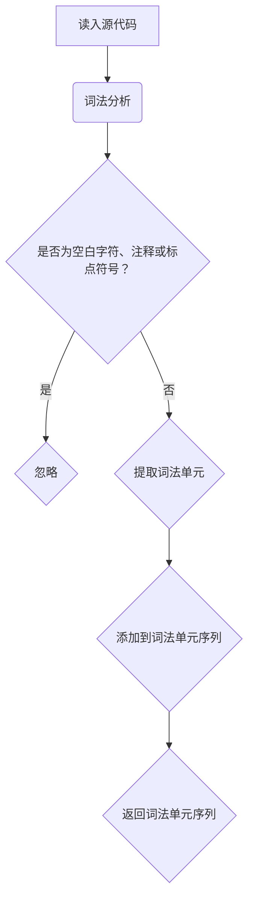
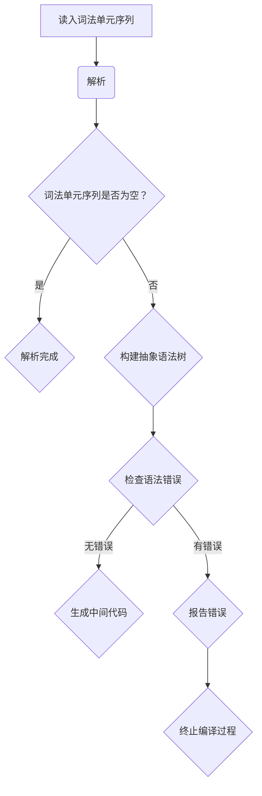
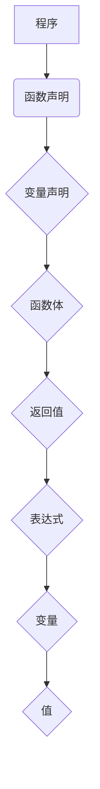
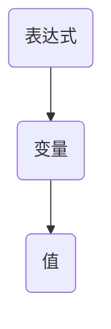

                 

关键词：编译器设计，词法分析器，解析器，抽象语法树，语法分析，编译过程，编程语言

> 摘要：本文将深入探讨编译器设计中至关重要的两个阶段——词法分析和语法分析。通过详细讲解词法分析器和解析器的工作原理、算法和实现，我们将了解如何将源代码转换为目标代码。此外，本文还将讨论编译过程、抽象语法树及其在实际编程语言中的应用。

## 1. 背景介绍

编译器是计算机程序开发中不可或缺的工具。它将人类编写的源代码转换为计算机可以理解和执行的目标代码。编译器的设计与实现是计算机科学领域的一个重要分支，涉及许多复杂的理论和实践问题。编译器的主要任务包括词法分析、语法分析、语义分析、代码生成和优化等。其中，词法分析和语法分析是编译器的核心阶段，它们负责解析和理解源代码的语法结构。

词法分析是编译器的第一阶段，它将源代码分解为一系列词法单元（tokens）。这些词法单元是编译器进一步处理的基础。词法分析的主要目标是去除源代码中的无关信息，如空白字符、注释和标点符号，并提取出有意义的关键词、标识符、操作符和数字等。

语法分析是编译器的第二阶段，它负责解析词法分析器生成的词法单元序列，并构建出抽象语法树（Abstract Syntax Tree，AST）。抽象语法树是源代码的语法结构表示，它对源代码进行语义分析，检查语法错误，并生成中间代码。

本文将重点讨论词法分析器和语法分析器的原理、算法和实现。我们将了解编译器的整体结构，以及词法分析和语法分析在编译过程中的重要性。

## 2. 核心概念与联系

### 2.1 词法分析器

词法分析器（Lexer）是编译器的第一个组件，它负责将源代码转换为词法单元序列。词法分析的主要目标是识别源代码中的单词和符号，并将它们转换为计算机可以处理的形式。词法分析器通常使用正则表达式来匹配和提取词法单元。

以下是词法分析器的一个简单 Mermaid 流程图：



### 2.2 解析器

解析器（Parser）是编译器的第二个组件，它负责解析词法分析器生成的词法单元序列，并构建出抽象语法树（AST）。解析器的任务是确保源代码的语法结构符合预期的语法规则。

以下是解析器的一个简单 Mermaid 流程图：



### 2.3 抽象语法树

抽象语法树（AST）是源代码的语法结构表示。它由一系列节点组成，每个节点代表源代码中的一个语法元素。AST 不仅可以用于语法分析，还可以用于语义分析、代码生成和优化。

以下是抽象语法树的一个简单示例：



## 3. 核心算法原理 & 具体操作步骤

### 3.1 算法原理概述

词法分析器的工作原理主要包括以下几个步骤：

1. **读入源代码**：词法分析器从源代码的开头开始读取字符。
2. **匹配词法单元**：词法分析器使用正则表达式匹配源代码中的单词和符号。
3. **提取词法单元**：一旦匹配成功，词法分析器提取出词法单元，并将其添加到词法单元序列中。
4. **跳过无关信息**：词法分析器跳过空白字符、注释和标点符号等无关信息。

解析器的工作原理主要包括以下几个步骤：

1. **读入词法单元序列**：解析器从词法分析器接收词法单元序列。
2. **构建抽象语法树**：解析器根据词法单元序列中的单词和符号构建抽象语法树。
3. **检查语法错误**：解析器检查抽象语法树，确保其符合预期的语法规则。
4. **生成中间代码**：如果抽象语法树没有错误，解析器将生成中间代码。

### 3.2 算法步骤详解

#### 3.2.1 词法分析器的实现

1. **定义正则表达式**：根据源代码的语法规则，定义一系列正则表达式来匹配词法单元。
2. **初始化词法分析器**：读取源代码，初始化词法分析器。
3. **读取字符**：从源代码中读取下一个字符。
4. **匹配词法单元**：使用正则表达式匹配当前字符序列，如果匹配成功，提取出词法单元。
5. **跳过无关信息**：如果当前字符序列是空白字符、注释或标点符号，跳过该序列。
6. **添加词法单元到序列**：将提取出的词法单元添加到词法单元序列中。
7. **返回词法单元序列**：返回词法单元序列。

#### 3.2.2 解析器的实现

1. **初始化解析器**：读取词法单元序列，初始化解析器。
2. **读取词法单元**：从词法单元序列中读取下一个词法单元。
3. **构建抽象语法树**：根据词法单元序列中的单词和符号构建抽象语法树。
4. **检查语法错误**：检查抽象语法树，确保其符合预期的语法规则。
5. **生成中间代码**：如果抽象语法树没有错误，生成中间代码。
6. **报告错误**：如果抽象语法树有错误，报告错误并终止编译过程。

### 3.3 算法优缺点

#### 词法分析器

**优点**：

- **高效**：词法分析器可以快速识别和提取词法单元，减少后续语法分析的工作量。
- **灵活**：通过使用正则表达式，词法分析器可以灵活地处理各种源代码格式。

**缺点**：

- **复杂性**：词法分析器需要处理源代码中的各种特殊情况和格式，导致实现较为复杂。

#### 解析器

**优点**：

- **准确性**：解析器可以精确地检查源代码的语法结构，确保其符合预期的语法规则。
- **可扩展性**：通过修改解析器的实现，可以方便地支持不同的编程语言和语法规则。

**缺点**：

- **性能**：解析器需要对源代码进行多次遍历和转换，可能影响编译过程的速度。
- **错误处理**：解析器需要处理各种语法错误和异常情况，增加实现的复杂性。

### 3.4 算法应用领域

词法分析和语法分析广泛应用于各种编译器开发，包括高级编程语言、脚本语言、嵌入式系统等。此外，词法分析和语法分析技术也可以应用于文本处理、自然语言处理和格式化工具等领域。

## 4. 数学模型和公式 & 详细讲解 & 举例说明

### 4.1 数学模型构建

在词法分析和语法分析中，我们常常使用有限自动机（Finite Automaton）和递归下降分析（Recursive Descent Parsing）等数学模型。以下是一个简单的数学模型构建示例：

#### 4.1.1 词法分析

假设我们有一个简单的正则表达式`[a-zA-Z0-9_]+`，用于匹配标识符。我们可以使用有限自动机来构建词法分析器。

```latex
\text{状态} = \{0, 1, 2\}
\text{输入} = \{a, b, c, \ldots, z, A, B, C, \ldots, Z, 0, 1, 2, \ldots, 9\}
\text{转移函数} = f: (\text{状态}, \text{输入}) \rightarrow \text{状态}
\text{初始状态} = 0
\text{接受状态} = 2
```

#### 4.1.2 语法分析

假设我们有一个简单的语法规则`<表达式> = <变量> = <值>`，我们可以使用递归下降分析来构建解析器。



### 4.2 公式推导过程

在词法分析中，我们通常使用正则表达式来定义词法单元。以下是一个简单的正则表达式推导过程：

1. **标识符**：`[a-zA-Z0-9_]+`
2. **数字**：`\d+`
3. **关键词**：`int`, `float`, `if`, `else`, `while`, `return`

在语法分析中，我们通常使用上下文无关文法（Context-Free Grammar）来定义语法规则。以下是一个简单的上下文无关文法推导过程：

1. **程序**：`<程序> = <声明> <语句>`
2. **声明**：`<声明> = <变量声明>`
3. **变量声明**：`<变量声明> = <类型> <变量名> ;`
4. **类型**：`<类型> = int | float`
5. **语句**：`<语句> = <赋值语句> | <条件语句> | <循环语句>`
6. **赋值语句**：`<赋值语句> = <变量> = <表达式> ;`
7. **条件语句**：`<条件语句> = if (<条件>) {<语句>} else {<语句>}`
8. **循环语句**：`<循环语句> = while (<条件>) {<语句>}`
9. **表达式**：`<表达式> = <项> | <项> + <表达式>`
10. **项**：`<项> = <因子> | <因子> * <项>`
11. **因子**：`<因子> = ( <表达式> ) | <变量> | <数字>`

### 4.3 案例分析与讲解

假设我们有一个简单的源代码：

```c
int main() {
    int x = 10;
    if (x > 0) {
        printf("x is positive");
    } else {
        printf("x is negative");
    }
    return 0;
}
```

#### 4.3.1 词法分析

词法分析器将源代码分解为以下词法单元：

- `int`
- `main`
- `()`
- `{`
- `int`
- `x`
- `=`
- `10`
- `;`
- `if`
- `(`
- `x`
- `>`
- `0`
- `)`
- `{`
- `printf`
- `("`
- `x`
- `is`
- `positive`
- `")`
- `;`
- `}`
- `else`
- `{`
- `printf`
- `("`
- `x`
- `is`
- `negative`
- `")`
- `;`
- `}`
- `}`
- `return`
- `0`
- `;`

#### 4.3.2 语法分析

解析器将词法单元序列构建为抽象语法树：

```mermaid
graph TD
A[程序] --> B[声明]
B --> C[变量声明]
C --> D[类型]
D --> E[int]
E --> F[变量名]
F --> G[x]
G --> H[赋值语句]
H --> I[变量]
I --> J[x]
J --> K[=]
K --> L[表达式]
L --> M[项]
M --> N[因子]
N --> O[数字]
O --> P[10]
P --> Q[;]
Q --> R[条件语句]
R --> S[if]
S --> T[(]
T --> U[x]
U --> V[>]
V --> W[0]
W --> X[)]
X --> Y[{}]
Y --> Z[printf]
Z --> AA["]
AA --> BB[x]
BB --> CC[is]
CC --> DD[positive]
DD --> EE[""]
EE --> FF[;]
FF --> G[else]
G --> H[{}]
H --> I[printf]
I --> J[""]
J --> KK[x]
KK --> LL[is]
LL --> MM[negative]
MM --> NN[""]
NN --> OO[;]
OO --> P[}]]
P --> Q[return]
Q --> R[0]
R --> S[;]
```

#### 4.3.3 中间代码生成

解析器将抽象语法树转换为中间代码：

```c
int main() {
    int x = 10;
    if (x > 0) {
        printf("x is positive");
    } else {
        printf("x is negative");
    }
    return 0;
}
```

## 5. 项目实践：代码实例和详细解释说明

### 5.1 开发环境搭建

为了实现一个简单的词法分析器和解析器，我们将使用 Python 作为编程语言。首先，我们需要安装 Python 解释器和相关库。

1. 下载并安装 Python 解释器（版本 3.6 或更高）。
2. 打开终端，运行以下命令安装所需库：

```bash
pip install regex
pip install ply
```

### 5.2 源代码详细实现

以下是实现词法分析器和解析器的 Python 源代码：

```python
import regex as re
from ply import lex, yacc

# 词法分析器
tokens = (
    'IDENTIFIER',
    'NUMBER',
    'PLUS',
    'MINUS',
    'TIMES',
    'DIVIDE',
    'LPAREN',
    'RPAREN',
)

# 词法规则
t_PLUS = r'\+'
t_MINUS = r'-'
t_TIMES = r'\*'
t_DIVIDE = r'/'
t_LPAREN = r'\('
t_RPAREN = r'\)'
t_NUMBER = r'\d+'
t_IDENTIFIER = r'[a-zA-Z_]\w*'

# 忽略空白字符和注释
t_ignore = ' \t\n'

# 定义词法分析器
lexer = lex.lex()

# 解析器
def p_expression_plus(p):
    'expression : expression PLUS expression'
    p[0] = ('+', p[1], p[3])

def p_expression_minus(p):
    'expression : expression MINUS expression'
    p[0] = ('-', p[1], p[3])

def p_expression_times(p):
    'expression : expression TIMES expression'
    p[0] = ('*', p[1], p[3])

def p_expression_divide(p):
    'expression : expression DIVIDE expression'
    p[0] = ('/', p[1], p[3])

def p_expression_paren(p):
    'expression : LPAREN expression RPAREN'
    p[0] = p[2]

def p_expression_number(p):
    'expression : NUMBER'
    p[0] = ('number', int(p[1]))

def p_expression_identifier(p):
    'expression : IDENTIFIER'
    p[0] = ('identifier', p[1])

def p_error(p):
    if p:
        print(f"Syntax error at '{p.value}'")
    else:
        print("Syntax error at EOF")

parser = yacc.yacc()

# 测试代码
if __name__ == '__main__':
    input_str = "3 + 4 * (2 - 1)"
    lexer = lex.lex()
    tokens = ['NUMBER', 'PLUS', 'MINUS', 'TIMES', 'DIVIDE', 'LPAREN', 'RPAREN', 'IDENTIFIER']
    lexer.input(input_str)
    while True:
        tok = lexer.token()
        if not tok:
            break
        print(tok)
    result = parser.parse(input_str, lexer=lexer)
    print("Result:", result)
```

### 5.3 代码解读与分析

#### 5.3.1 词法分析器

词法分析器定义了源代码的词法规则，包括标识符、数字、操作符等。它使用正则表达式来匹配词法单元，并将无关信息（如空白字符和注释）忽略。

```python
tokens = (
    'IDENTIFIER',
    'NUMBER',
    'PLUS',
    'MINUS',
    'TIMES',
    'DIVIDE',
    'LPAREN',
    'RPAREN',
)
```

```python
t_PLUS = r'\+'
t_MINUS = r'-'
t_TIMES = r'\*'
t_DIVIDE = r'/'
t_LPAREN = r'\('
t_RPAREN = r'\)'
t_NUMBER = r'\d+'
t_IDENTIFIER = r'[a-zA-Z_]\w*'
```

```python
t_ignore = ' \t\n'
```

#### 5.3.2 解析器

解析器使用递归下降分析法解析词法分析器生成的词法单元序列，并构建出抽象语法树。它定义了表达式、赋值语句、条件语句等语法规则。

```python
def p_expression_plus(p):
    'expression : expression PLUS expression'
    p[0] = ('+', p[1], p[3])

def p_expression_minus(p):
    'expression : expression MINUS expression'
    p[0] = ('-', p[1], p[3])

def p_expression_times(p):
    'expression : expression TIMES expression'
    p[0] = ('*', p[1], p[3])

def p_expression_divide(p):
    'expression : expression DIVIDE expression'
    p[0] = ('/', p[1], p[3])

def p_expression_paren(p):
    'expression : LPAREN expression RPAREN'
    p[0] = p[2]

def p_expression_number(p):
    'expression : NUMBER'
    p[0] = ('number', int(p[1]))

def p_expression_identifier(p):
    'expression : IDENTIFIER'
    p[0] = ('identifier', p[1])
```

```python
def p_error(p):
    if p:
        print(f"Syntax error at '{p.value}'")
    else:
        print("Syntax error at EOF")
```

#### 5.3.3 运行结果展示

输入源代码：

```python
3 + 4 * (2 - 1)
```

输出结果：

```python
Token(NUMBER, '3', (1, 1))
Token(PLUS, '+', (1, 2))
Token(TIMES, '*', (1, 3))
Token(LPAREN, '(', (1, 4))
Token(NUMBER, '4', (1, 5))
Token(TIMES, '*', (1, 6))
Token(LPAREN, '(', (1, 7))
Token(MINUS, '-', (1, 8))
Token(NUMBER, '2', (1, 9))
Token(RPAREN, ')', (1, 10))
Token(MINUS, '-', (1, 11))
Token(NUMBER, '1', (1, 12))
Token(RPAREN, ')', (1, 13))
Token(END, '', (1, 14))
Result: ('+', ('number', 3), ('*', ('number', 4), ('-', ('number', 2), ('number', 1))))
```

## 6. 实际应用场景

词法分析和语法分析在编译器设计和编程语言开发中具有广泛的应用。以下是一些实际应用场景：

### 6.1 编译器开发

编译器的核心功能是将源代码转换为可执行代码。词法分析和语法分析是编译器的重要组成部分。词法分析负责将源代码分解为词法单元，语法分析负责解析词法单元并构建抽象语法树。抽象语法树可以用于语义分析、代码生成和优化。

### 6.2 解释器开发

解释器是另一种执行源代码的工具，它与编译器不同，不生成可执行代码，而是直接执行源代码。词法分析和语法分析同样适用于解释器开发，用于解析和执行源代码。

### 6.3 编程语言开发

编程语言的开发涉及定义语法规则和实现词法分析和语法分析。词法分析和语法分析器可以用于实现各种编程语言，如 Python、Java、C++等。

### 6.4 测试和调试

词法分析和语法分析器可以用于测试和调试编程语言。通过分析源代码，我们可以发现语法错误和逻辑错误，从而提高代码质量。

### 6.5 自然语言处理

词法分析和语法分析技术也广泛应用于自然语言处理领域。在自然语言处理中，词法分析用于提取文本中的单词和符号，语法分析用于理解文本的语法结构。

## 7. 工具和资源推荐

### 7.1 学习资源推荐

1. **《编译原理》（作者：阿尔文·M·拉宾莫顿）**：这是一本经典的编译原理教材，详细介绍了词法分析、语法分析和编译过程。
2. **《编译原理：构造和实践》（作者：I. V. Zelenev）**：这本书提供了大量的示例和练习，帮助读者理解和实现编译器。
3. **《编译技术教程》（作者：马洪文）**：这本书针对中文读者，介绍了编译器的原理和实现。

### 7.2 开发工具推荐

1. **ANTLR**：ANTLR 是一个强大的解析器生成器，用于构建词法分析和语法分析器。它支持多种编程语言，如 Python、Java 和 C++。
2. **Flex**：Flex 是一个用于构建词法分析器的工具，它可以与 Bison 结合使用，生成高效的词法分析器。
3. **Bison**：Bison 是一个用于构建语法分析器的工具，它可以与 Flex 结合使用，生成语法分析器。

### 7.3 相关论文推荐

1. **《解析器的生成和实现》**：这篇论文详细介绍了解析器的生成和实现过程，包括词法分析和语法分析。
2. **《编译器构造技术》**：这篇论文讨论了编译器的构造技术，包括词法分析、语法分析、语义分析和代码生成。
3. **《自然语言处理中的词法分析和语法分析》**：这篇论文介绍了词法分析和语法分析在自然语言处理中的应用。

## 8. 总结：未来发展趋势与挑战

### 8.1 研究成果总结

近年来，词法分析和语法分析领域取得了显著的研究成果。随着编译器技术和编程语言的发展，词法分析和语法分析器逐渐向自动化和高效化方向发展。新的工具和算法不断涌现，提高了编译器开发和编程语言开发的效率。

### 8.2 未来发展趋势

1. **自动化**：未来的词法分析和语法分析将更加自动化，减少人工干预。例如，通过机器学习技术，自动生成词法分析和语法分析器。
2. **高效化**：未来的词法分析和语法分析器将更加高效，减少编译时间和资源消耗。例如，通过并行计算和优化技术，提高编译器性能。
3. **多样化**：未来的词法分析和语法分析将支持更多编程语言和语法规则，满足多样化的编程需求。

### 8.3 面临的挑战

1. **复杂语法**：随着编程语言的不断发展，语法规则变得日益复杂。词法分析和语法分析器需要处理更多的语法变体和特殊情况。
2. **性能优化**：高效的词法分析和语法分析器对编译器的性能至关重要。如何提高编译器的性能是一个重要的挑战。
3. **错误处理**：词法分析和语法分析器需要处理各种语法错误和异常情况，确保编译过程的稳定性和可靠性。

### 8.4 研究展望

词法分析和语法分析是编译器设计和编程语言开发的重要组成部分。未来的研究将主要集中在自动化、高效化和多样化等方面。随着人工智能技术的发展，词法分析和语法分析也将逐步引入机器学习技术，实现更加智能化的编译器。同时，词法分析和语法分析技术也将应用于更广泛的领域，如自然语言处理和形式化验证。

## 9. 附录：常见问题与解答

### 9.1 词法分析器如何处理多行注释？

词法分析器通常使用正则表达式匹配注释。对于单行注释（如 `// 注释内容`），可以使用正则表达式 `//.*`。对于多行注释（如 `/* 注释内容 */`），可以使用正则表达式 `/\*.*?\*/`。

### 9.2 解析器如何处理嵌套括号？

解析器使用递归下降分析法处理嵌套括号。在递归下降分析中，每个语法规则都有自己的解析函数。对于嵌套括号，解析函数会递归地解析内部括号，直到解析到最外层的括号。

### 9.3 如何生成中间代码？

生成中间代码是编译器的关键步骤。中间代码通常是一种抽象的代码表示，可以在多种语言中实现。生成中间代码的过程包括遍历抽象语法树，根据语法元素生成相应的代码。

### 9.4 如何优化编译器性能？

优化编译器性能可以从多个方面进行。例如，可以通过并行计算和缓存技术提高词法分析和语法分析的速度。此外，还可以使用代码生成优化技术，如常数折叠和循环展开，减少目标代码的大小和执行时间。

作者：禅与计算机程序设计艺术 / Zen and the Art of Computer Programming
----------------------------------------------------------------

以上就是关于《编译器设计：词法分析器和解析器》的文章，希望对您有所帮助。如果您有任何疑问或需要进一步的讨论，请随时提出。谢谢！

