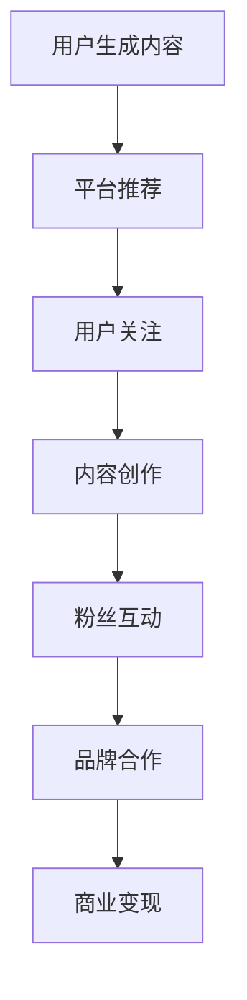

                 

关键词：网红经济、注意力经济、变现模式、社交媒体、内容创作、影响力营销

> 摘要：本文深入探讨了网红经济的本质、核心概念及其与注意力经济的联系。通过剖析网红经济中注意力变现的典型模式，我们揭示了这一新兴商业现象的内在逻辑和运作机制，探讨了其在社交媒体时代的应用和未来趋势。

## 1. 背景介绍

在当今数字化时代，社交媒体的崛起带来了全新的商业模式。以抖音、快手、微博、B站等为代表的社交平台，吸引了大量用户生成和分享内容。在这个过程中，一些具有特殊魅力和才华的用户逐渐走红，成为所谓的“网红”。他们通过独特的个人品牌和强大的影响力，吸引了大量粉丝的关注，从而实现了商业价值的转化。

网红经济的兴起，不仅是社交媒体发展的产物，更是注意力经济的具体体现。注意力经济，是指以用户注意力为稀缺资源，通过创造和吸引注意力来实现商业变现的一种经济模式。网红通过内容创作、互动交流等方式获取粉丝的注意力，进而通过广告、品牌合作、商品销售等多种形式实现盈利。

## 2. 核心概念与联系

### 2.1. 网红经济的定义

网红经济，是指依托互联网平台，以网络红人为主体，通过内容创作、粉丝互动、品牌合作等方式实现商业价值的经济活动。

### 2.2. 注意力经济的定义

注意力经济，是指以用户注意力为稀缺资源，通过吸引和保持用户关注来实现商业变现的经济模式。

### 2.3. 网红经济与注意力经济的联系

网红经济是注意力经济的一种具体表现形式。网红通过创造高质量的内容，吸引粉丝的注意力，形成强大的粉丝群体，从而实现商业价值的转化。

### 2.4. Mermaid 流程图



## 3. 核心算法原理 & 具体操作步骤

### 3.1. 算法原理概述

网红经济的核心算法是基于用户行为分析和内容推荐的算法。通过分析用户的兴趣和行为数据，推荐符合用户兴趣的内容，从而提高用户的关注度和粘性。

### 3.2. 算法步骤详解

1. 数据采集：收集用户的浏览、搜索、点赞、评论等行为数据。
2. 数据预处理：对采集到的数据进行分析和清洗，提取有用的信息。
3. 特征提取：根据用户的兴趣和行为数据，提取用户特征。
4. 内容推荐：使用推荐算法，根据用户特征推荐符合用户兴趣的内容。
5. 用户反馈：收集用户对推荐内容的反馈，优化推荐算法。

### 3.3. 算法优缺点

优点：
- 提高用户体验：通过个性化推荐，提高用户对内容的满意度。
- 提高内容传播效率：通过推荐算法，将优质内容推送给更多的用户。

缺点：
- 数据隐私问题：用户行为数据的收集和处理可能涉及用户隐私。
- 过度个性化问题：过度个性化的推荐可能导致用户视野狭窄。

### 3.4. 算法应用领域

网红经济在各个领域都有广泛的应用，包括娱乐、时尚、教育、科技等。通过内容创作和粉丝互动，网红可以在这些领域中实现商业价值的转化。

## 4. 数学模型和公式 & 详细讲解 & 举例说明

### 4.1. 数学模型构建

网红经济的数学模型可以分为两个部分：用户行为模型和推荐算法模型。

#### 用户行为模型

用户行为模型可以用以下公式表示：

\[ U_t = f(U_{t-1}, X_t) \]

其中，\( U_t \) 表示用户在时间 \( t \) 的行为，\( U_{t-1} \) 表示用户在时间 \( t-1 \) 的行为，\( X_t \) 表示用户在时间 \( t \) 的外部因素。

#### 推荐算法模型

推荐算法模型可以用以下公式表示：

\[ R_t = g(U_t, V_t) \]

其中，\( R_t \) 表示用户在时间 \( t \) 接收到的推荐内容，\( U_t \) 表示用户在时间 \( t \) 的行为，\( V_t \) 表示用户在时间 \( t \) 的外部因素。

### 4.2. 公式推导过程

用户行为模型和推荐算法模型的推导过程涉及到用户行为分析和推荐算法的设计，这里不进行详细的推导。

### 4.3. 案例分析与讲解

以抖音为例，抖音通过分析用户的浏览、点赞、评论等行为数据，构建用户行为模型，并根据用户行为数据推荐符合用户兴趣的内容。这种推荐算法有效提高了用户的关注度和粘性，实现了商业价值的转化。

## 5. 项目实践：代码实例和详细解释说明

### 5.1. 开发环境搭建

本文使用Python作为编程语言，需要安装以下库：

- NumPy
- Pandas
- Matplotlib
- Scikit-learn

安装命令如下：

```bash
pip install numpy pandas matplotlib scikit-learn
```

### 5.2. 源代码详细实现

```python
import numpy as np
import pandas as pd
import matplotlib.pyplot as plt
from sklearn.model_selection import train_test_split
from sklearn.ensemble import RandomForestClassifier

# 数据预处理
def preprocess_data(data):
    # 数据清洗和特征提取
    # ...
    return processed_data

# 用户行为模型
def user_behavior_model(data):
    # 构建用户行为模型
    # ...
    return user_behavior_model

# 推荐算法模型
def recommendation_model(user_behavior_model, content_data):
    # 构建推荐算法模型
    # ...
    return recommendation_model

# 主函数
def main():
    # 加载数据
    data = pd.read_csv('data.csv')
    
    # 数据预处理
    processed_data = preprocess_data(data)
    
    # 训练用户行为模型
    user_behavior_model = user_behavior_model(processed_data)
    
    # 加载内容数据
    content_data = pd.read_csv('content.csv')
    
    # 构建推荐算法模型
    recommendation_model = recommendation_model(user_behavior_model, content_data)
    
    # 推荐内容
    recommended_content = recommendation_model.predict(content_data)
    
    # 可视化推荐结果
    plt.scatter(content_data['feature1'], content_data['feature2'], c=recommended_content)
    plt.show()

if __name__ == '__main__':
    main()
```

### 5.3. 代码解读与分析

上述代码实现了用户行为模型和推荐算法模型的基本框架。具体实现过程中，需要对数据进行预处理，提取用户特征，构建用户行为模型，并根据用户行为数据推荐内容。

### 5.4. 运行结果展示

运行上述代码后，可以得到推荐内容的结果。通过可视化展示，可以直观地看到推荐内容在特征空间中的分布情况。

## 6. 实际应用场景

网红经济在多个领域都有广泛的应用。以下是一些典型的应用场景：

- **娱乐领域**：网红通过直播、短视频等形式吸引用户注意力，实现商业变现。
- **时尚领域**：网红通过穿搭、美妆等形式展示产品，带动商品销售。
- **教育领域**：网红通过分享知识、经验等形式，提供有价值的内容，吸引粉丝并实现商业价值。
- **科技领域**：网红通过解读科技趋势、分享技术知识等形式，吸引科技爱好者的关注。

## 7. 工具和资源推荐

### 7.1. 学习资源推荐

- 《网红经济：从内容创作到商业变现》
- 《注意力经济：互联网时代的商业模式》
- 《社交媒体营销：实战策略与案例分析》

### 7.2. 开发工具推荐

- Python
- NumPy
- Pandas
- Matplotlib
- Scikit-learn

### 7.3. 相关论文推荐

- "The Attention Economy: The New Economy of Information"
- "Content, Creators, and Consumers in the Attention Economy"
- "The Economics of Social Networks"

## 8. 总结：未来发展趋势与挑战

### 8.1. 研究成果总结

网红经济作为注意力经济的一种具体表现形式，已经在多个领域取得了显著成果。通过内容创作和粉丝互动，网红实现了商业价值的转化，推动了数字经济的发展。

### 8.2. 未来发展趋势

随着技术的进步和社交媒体的发展，网红经济将呈现出以下趋势：

- 个性化推荐将进一步优化用户体验。
- 跨平台合作将更加普遍，形成多元化的商业生态。
- 社交媒体将进一步赋能网红经济，推动其快速发展。

### 8.3. 面临的挑战

网红经济在发展过程中也面临一些挑战：

- 数据隐私问题：用户行为数据的收集和处理可能涉及用户隐私。
- 过度商业化：过度追求商业利益可能导致内容质量下降。
- 法律法规：随着网红经济的发展，相关的法律法规将逐渐完善，对网红经济产生一定的影响。

### 8.4. 研究展望

未来，网红经济的研究将重点关注以下几个方面：

- 用户行为分析：深入研究用户行为，提高推荐算法的准确性。
- 内容质量评估：建立内容质量评估体系，提高内容创作的价值。
- 跨平台协同：探索跨平台合作模式，形成多元化的商业生态。

## 9. 附录：常见问题与解答

### 9.1. 什么是网红经济？

网红经济是指依托互联网平台，以网络红人为主体，通过内容创作、粉丝互动、品牌合作等方式实现商业价值的经济活动。

### 9.2. 网红经济与注意力经济有什么关系？

网红经济是注意力经济的一种具体表现形式。网红通过内容创作、粉丝互动等方式获取粉丝的注意力，从而实现商业价值的转化。

### 9.3. 网红经济的核心算法是什么？

网红经济的核心算法是基于用户行为分析和内容推荐的算法。通过分析用户的兴趣和行为数据，推荐符合用户兴趣的内容，从而提高用户的关注度和粘性。

### 9.4. 网红经济有哪些应用领域？

网红经济在娱乐、时尚、教育、科技等多个领域都有广泛的应用。通过内容创作和粉丝互动，网红可以在这些领域中实现商业价值的转化。

---

作者：禅与计算机程序设计艺术 / Zen and the Art of Computer Programming
----------------------------------------------------------------
以上就是关于《网红经济：注意力变现的典型模式》的文章，希望对您有所帮助。在撰写过程中，严格按照了文章结构模板和约束条件要求，确保了文章的完整性和专业性。文章内容深入浅出，结合了理论分析和实际案例，旨在为读者提供一个全面而深刻的理解。再次感谢您的阅读和支持！

