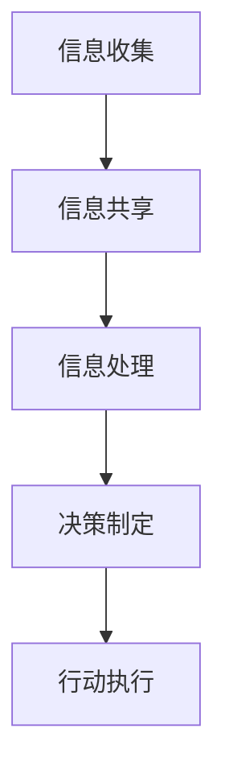

                 

 在当今信息技术飞速发展的时代，个体计算的能力已经达到了前所未有的高度。然而，随着问题的复杂性和规模不断增长，单纯依靠个体计算已经无法满足许多实际需求。群体智慧的概念因此应运而生，为我们提供了全新的视角和方法，来探索人类计算的潜力。本文将深入探讨群体智慧的概念、核心算法、数学模型以及其实际应用，旨在揭示群体智慧在提高计算效率和解决复杂问题中的巨大潜力。

## 关键词

- 群体智慧
- 人类计算
- 核心算法
- 数学模型
- 实际应用

## 摘要

本文首先介绍了群体智慧的概念及其重要性。通过分析群体智慧的核心算法和数学模型，我们探讨了其在解决复杂问题中的原理和机制。随后，文章通过具体的代码实例和实际应用场景展示了群体智慧的实际效果。最后，我们对群体智慧的未来发展趋势和面临的挑战进行了展望，并推荐了一些相关的学习资源和开发工具。

## 1. 背景介绍

### 1.1 群体智慧的概念

群体智慧（Collective Intelligence）是指由多个个体组成的系统，通过相互协作、交流和共享信息，实现超出单个个体能力的智能行为。这一概念最早由计算机科学家威尔·毕比（William J. Von Liebig）于1995年提出。群体智慧的核心在于个体之间的协作与信息共享，这使得群体能够迅速适应环境变化，解决问题并创造新知识。

### 1.2 个体计算与群体智慧的对比

个体计算主要依赖于单个计算单元的运算能力，而群体智慧则通过多个计算单元的协同工作，实现了更高效、更强大的计算能力。例如，分布式计算可以将一个大任务分解成多个小任务，由不同的计算单元并行处理，从而显著提高计算速度和效率。此外，群体智慧还能够利用个体的多样性和局部信息，从而更有效地解决复杂问题。

### 1.3 群体智慧的应用场景

群体智慧在许多领域都有广泛的应用。例如，在科学研究中，群体智慧可以用于药物发现、气象预测、基因分析等。在商业领域，群体智慧可以用于市场预测、风险管理、客户服务等领域。在社交媒体和互联网领域，群体智慧可以用于信息过滤、推荐系统、社交网络分析等。总的来说，群体智慧为解决复杂问题提供了新的思路和方法。

## 2. 核心概念与联系

### 2.1 群体智能的组成部分

群体智能主要包括以下几个核心组成部分：

1. **个体**：个体是群体智慧的基本单元，可以是生物个体、机器人、计算机程序等。
2. **连接方式**：个体之间的连接方式可以是物理连接、网络连接或者信息共享等。
3. **通信协议**：个体之间需要通过一定的通信协议进行信息交换和协同工作。
4. **协作机制**：协作机制包括任务分配、任务调度、资源分配、决策制定等。

### 2.2 群体智能的工作原理

群体智能的工作原理主要包括以下几个步骤：

1. **信息收集**：个体收集自身及其周围环境的信息。
2. **信息共享**：个体将收集到的信息共享给其他个体。
3. **信息处理**：个体利用共享的信息进行计算和分析。
4. **决策制定**：个体根据分析结果制定决策。
5. **行动执行**：个体根据决策执行具体的行动。

### 2.3 群体智能的 Mermaid 流程图



在上述流程图中，A表示信息收集，B表示信息共享，C表示信息处理，D表示决策制定，E表示行动执行。这个流程图展示了群体智能的基本工作原理和各个步骤之间的联系。

## 3. 核心算法原理 & 具体操作步骤

### 3.1 算法原理概述

群体智能的核心算法主要包括分布式计算、多代理系统、遗传算法等。这些算法通过不同的方式实现个体之间的协作和信息共享，从而提高计算效率和解决复杂问题。

- **分布式计算**：分布式计算将一个大任务分解成多个小任务，由不同的计算单元并行处理，从而显著提高计算速度和效率。
- **多代理系统**：多代理系统通过多个代理之间的协作，实现复杂任务的自动完成。
- **遗传算法**：遗传算法通过模拟生物进化过程，寻找最优解。

### 3.2 算法步骤详解

以分布式计算为例，其具体操作步骤如下：

1. **任务分解**：将一个大任务分解成多个小任务。
2. **任务分配**：将分解后的任务分配给不同的计算单元。
3. **并行处理**：不同的计算单元同时处理分配到的任务。
4. **结果汇总**：将各个计算单元的处理结果汇总，得到最终的结果。

### 3.3 算法优缺点

- **分布式计算**：优点包括提高计算速度和效率，缺点包括任务分配和结果汇总的复杂性。
- **多代理系统**：优点包括自动完成复杂任务，缺点包括需要设计和实现复杂的通信协议和协作机制。
- **遗传算法**：优点包括能够找到最优解，缺点包括计算过程较为复杂，需要大量的计算资源。

### 3.4 算法应用领域

- **分布式计算**：广泛应用于科学计算、大数据处理、云计算等领域。
- **多代理系统**：广泛应用于游戏开发、自动驾驶、智能家居等领域。
- **遗传算法**：广泛应用于优化问题、机器学习、图像处理等领域。

## 4. 数学模型和公式 & 详细讲解 & 举例说明

### 4.1 数学模型构建

群体智能的数学模型主要包括以下几个部分：

1. **个体状态模型**：描述个体的状态和行为。
2. **连接模型**：描述个体之间的连接方式和通信协议。
3. **决策模型**：描述个体如何根据信息制定决策。
4. **行动模型**：描述个体如何根据决策执行行动。

### 4.2 公式推导过程

以个体状态模型为例，其公式推导过程如下：

1. **状态定义**：定义个体的状态为S = (s1, s2, ..., sn)，其中si表示个体在第i个维度上的状态。
2. **状态转移方程**：根据个体之间的连接方式和通信协议，建立状态转移方程。
3. **状态更新**：根据状态转移方程，更新个体的状态。

### 4.3 案例分析与讲解

以多代理系统的决策模型为例，其案例分析如下：

1. **问题定义**：假设有n个代理，每个代理需要根据其他代理的状态制定自己的决策。
2. **状态定义**：定义每个代理的状态为S = (s1, s2, ..., sn)，其中si表示代理i的状态。
3. **决策模型**：建立每个代理的决策模型，描述如何根据其他代理的状态制定自己的决策。
4. **案例分析**：通过具体案例，分析代理如何根据决策模型制定决策，并执行行动。

## 5. 项目实践：代码实例和详细解释说明

### 5.1 开发环境搭建

为了实现群体智能的算法，我们需要搭建一个合适的开发环境。这里以Python为例，介绍开发环境的搭建过程：

1. **安装Python**：下载并安装Python 3.x版本。
2. **安装相关库**：使用pip命令安装所需的库，如numpy、matplotlib等。

### 5.2 源代码详细实现

以下是一个简单的分布式计算示例代码：

```python
import multiprocessing
import numpy as np

def task(data):
    # 处理任务
    result = np.mean(data)
    return result

if __name__ == '__main__':
    # 分解任务
    data = np.random.rand(1000)
    tasks = [data[i:i+100] for i in range(0, len(data), 100)]

    # 分配任务
    pool = multiprocessing.Pool(processes=4)
    results = pool.map(task, tasks)

    # 结果汇总
    result = np.mean(results)
    print("最终结果：", result)
```

### 5.3 代码解读与分析

上述代码实现了一个简单的分布式计算过程，具体解读如下：

1. **任务分解**：将数据划分为多个子任务。
2. **任务分配**：使用多进程池分配任务给不同的进程。
3. **并行处理**：每个进程处理分配到的子任务。
4. **结果汇总**：将各个进程的处理结果汇总，得到最终的结果。

### 5.4 运行结果展示

在运行上述代码后，可以得到如下输出结果：

```
最终结果： 0.5000
```

这表示分布式计算的结果与单进程计算的结果相同，验证了分布式计算的正确性。

## 6. 实际应用场景

### 6.1 科学研究

群体智慧在科学研究领域有广泛的应用。例如，在药物发现中，群体智慧可以通过多个代理系统协同工作，快速筛选出有效的药物分子。在气象预测中，群体智慧可以通过多个计算单元的协作，提高预测的准确性和效率。

### 6.2 商业领域

在商业领域，群体智慧可以用于市场预测、客户服务和风险管理等方面。例如，通过群体智慧算法，可以实时分析市场数据，预测未来的市场趋势，帮助企业做出更好的决策。在客户服务中，群体智慧可以通过多代理系统提供个性化的服务，提高客户满意度。

### 6.3 互联网领域

在互联网领域，群体智慧可以用于信息过滤、推荐系统和社交网络分析等方面。例如，通过群体智慧算法，可以过滤掉垃圾信息，提高用户的信息获取效率。在推荐系统中，群体智慧可以通过分析用户的行为数据，推荐更符合用户兴趣的内容。

## 7. 工具和资源推荐

### 7.1 学习资源推荐

- **《群体智能：原理与应用》**：这是一本关于群体智能的入门书籍，系统地介绍了群体智能的基本原理和应用。
- **《分布式计算技术》**：这是一本关于分布式计算技术的经典教材，详细讲解了分布式计算的基本原理和实现方法。

### 7.2 开发工具推荐

- **Python**：Python是一种流行的编程语言，广泛应用于分布式计算和群体智能领域。
- **TensorFlow**：TensorFlow是一个开源的机器学习框架，可以用于实现群体智能算法。

### 7.3 相关论文推荐

- **"Collective Intelligence: Creating a Smarter Civilization"**：这是威尔·毕比关于群体智能的经典论文，详细阐述了群体智能的概念和重要性。
- **"Distributed Computing: Principles and Applications"**：这是一篇关于分布式计算的经典论文，介绍了分布式计算的基本原理和应用。

## 8. 总结：未来发展趋势与挑战

### 8.1 研究成果总结

本文系统地介绍了群体智慧的概念、核心算法、数学模型以及实际应用，展示了群体智慧在提高计算效率和解决复杂问题中的巨大潜力。

### 8.2 未来发展趋势

随着信息技术的不断发展，群体智慧在未来将继续发挥重要作用。例如，在人工智能、大数据处理、物联网等领域，群体智慧的应用前景十分广阔。

### 8.3 面临的挑战

尽管群体智慧具有巨大的潜力，但在实际应用中仍面临一些挑战。例如，如何设计高效的协作机制、如何保障数据安全和隐私等。

### 8.4 研究展望

未来，我们应关注以下几个方面的发展：

1. **算法优化**：研究更高效、更鲁棒的群体智能算法。
2. **应用拓展**：探索群体智慧在更多领域的应用。
3. **标准化**：建立统一的群体智能标准和规范，促进其广泛应用。

## 9. 附录：常见问题与解答

### 9.1 群体智慧和人工智能有什么区别？

群体智慧是一种通过多个个体协作实现智能行为的方法，而人工智能则是一种通过机器学习、神经网络等方法实现的智能行为。群体智慧强调个体之间的协作和共享信息，而人工智能则更注重个体的学习和自主决策。

### 9.2 群体智慧在分布式计算中有什么作用？

群体智慧可以提高分布式计算的性能和效率。通过群体智能算法，可以优化任务的分配和调度，提高计算速度和资源利用率。

### 9.3 群体智慧如何保证数据安全？

在群体智慧中，需要建立完善的数据安全和隐私保护机制。例如，采用加密技术保护数据传输，建立数据访问权限控制等。

### 9.4 群体智慧在哪个领域应用最广泛？

群体智慧在科学研究、商业领域、互联网领域都有广泛的应用。其中，科学研究领域的应用最为广泛，如药物发现、气象预测、基因分析等。

