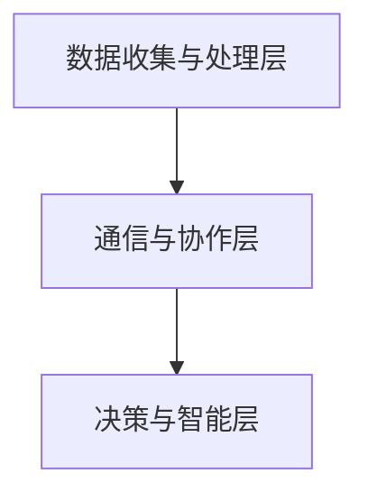

                 

关键词：群体智慧、人类计算、新纪元、技术进步、协作、分布式计算、未来展望

## 摘要

在当今快速发展的技术时代，人类计算正迎来一个新的纪元——群体智慧。这一概念不仅挑战了传统的计算模式，也为未来的技术发展提供了无限的可能性。本文将深入探讨群体智慧的定义、核心原理、实现方式及其在各个领域的应用，同时探讨这一新纪元对人类计算带来的影响和挑战。

## 1. 背景介绍

### 1.1  群体智慧的定义

群体智慧（Collective Intelligence）指的是一个由多个个体组成的系统，通过相互协作和交互，展现出的整体智能和行为模式。这种智慧不是简单的个体智能的叠加，而是在群体内部通过某种机制，如沟通、协调、共享信息等，形成的一种更为高级的智能。

### 1.2  群体智慧的历史背景

群体智慧的概念可以追溯到人类社会早期。例如，蜜蜂群体通过复杂的舞蹈来传递信息，从而实现集体觅食。随着计算机技术的发展，特别是在人工智能和分布式计算领域，群体智慧开始成为研究的热点。近年来，随着区块链、物联网、5G等新兴技术的兴起，群体智慧的应用场景变得更加广泛和深入。

### 1.3  群体智慧的重要性

群体智慧在多个领域都有着重要的应用，如大数据分析、智能交通、金融预测、社会治理等。它不仅能够提高系统的效率和准确性，还能够解决复杂问题，实现智能决策。

## 2. 核心概念与联系

### 2.1  核心概念

群体智慧的核心概念包括个体、交互、协作和智能。个体是指参与群体智慧的每个成员，可以是人、机器或其他智能体。交互是指个体之间的信息传递和沟通，协作是指个体在共同目标下的协同工作，智能则是指群体通过协作所表现出的整体能力。

### 2.2  架构原理

群体智慧的架构通常包括三个层次：底层是数据收集与处理层，负责收集和预处理个体数据；中间层是通信与协作层，负责实现个体之间的信息传递和协作；顶层是决策与智能层，负责基于群体智慧进行决策。



### 2.3  应用领域

群体智慧的应用领域非常广泛，包括但不限于以下：

- **智能交通**：通过群体智慧优化交通信号、车辆调度等，提高交通效率。
- **社会治理**：利用群体智慧进行公共安全监控、疫情预测等。
- **金融**：通过群体智慧进行市场预测、风险管理等。
- **能源管理**：通过群体智慧实现智能电网、智能节能等。

## 3. 核心算法原理 & 具体操作步骤

### 3.1  算法原理概述

群体智慧的核心算法通常基于以下几个原理：

- **分布式计算**：通过分布式计算技术，将复杂问题分解为多个子问题，并在分布式系统中解决。
- **机器学习**：利用机器学习算法，从大规模数据中提取特征，进行模式识别和预测。
- **多代理系统**：通过多个智能代理之间的协作，实现复杂的任务处理。

### 3.2  算法步骤详解

群体智慧的算法步骤通常包括：

1. **数据收集**：从各个个体收集数据，并进行预处理。
2. **模型训练**：利用机器学习算法，对收集到的数据建立模型。
3. **决策制定**：基于模型，进行决策和预测。
4. **结果反馈**：将决策结果反馈给个体，进行进一步优化。

### 3.3  算法优缺点

**优点**：

- **高效性**：通过分布式计算和机器学习，能够快速处理大量数据，提高决策效率。
- **灵活性**：个体之间的协作和交互，使得系统具备较强的适应性和灵活性。

**缺点**：

- **复杂性**：算法设计和实现较为复杂，需要较高的技术门槛。
- **可靠性**：个体之间的信息传递和协作可能受到网络延迟、数据噪声等因素的影响，影响系统可靠性。

### 3.4  算法应用领域

群体智慧算法在以下领域有着广泛的应用：

- **大数据分析**：通过群体智慧，提高数据处理的效率和准确性。
- **智能交通**：优化交通信号、车辆调度等，提高交通效率。
- **金融**：进行市场预测、风险管理等。
- **医疗**：辅助医生进行疾病诊断和治疗。

## 4. 数学模型和公式 & 详细讲解 & 举例说明

### 4.1  数学模型构建

群体智慧的数学模型通常基于以下几个基本假设：

1. **个体智能**：每个个体都具有一定的智能，能够进行信息处理和决策。
2. **协同效应**：多个个体之间的协作能够产生比单独个体更为优秀的性能。
3. **信息共享**：个体之间的信息传递和共享是实现群体智慧的关键。

基于以上假设，可以构建如下的数学模型：

$$
C = \sum_{i=1}^{N} I_i + 2\sum_{i=1}^{N-1}\sum_{j=i+1}^{N} S_{ij}
$$

其中，$C$ 表示群体智慧，$I_i$ 表示第 $i$ 个个体的智能，$S_{ij}$ 表示个体 $i$ 和个体 $j$ 之间的协同效应。

### 4.2  公式推导过程

公式的推导过程如下：

首先，假设每个个体的智能为 $I_i$，则整个群体的智能为：

$$
C_0 = \sum_{i=1}^{N} I_i
$$

接下来，考虑个体之间的协同效应。假设个体 $i$ 和个体 $j$ 之间的协同效应为 $S_{ij}$，则整个群体的智能可以进一步表示为：

$$
C = C_0 + 2\sum_{i=1}^{N-1}\sum_{j=i+1}^{N} S_{ij}
$$

其中，$2\sum_{i=1}^{N-1}\sum_{j=i+1}^{N} S_{ij}$ 表示个体之间的协同效应。

### 4.3  案例分析与讲解

以下是一个简单的案例：

假设有一个群体由三个个体组成，每个个体的智能分别为 $I_1 = 0.6$，$I_2 = 0.5$，$I_3 = 0.4$。个体之间的协同效应分别为 $S_{12} = 0.3$，$S_{13} = 0.2$，$S_{23} = 0.1$。

根据上述公式，可以计算出群体的智能：

$$
C = 0.6 + 0.5 + 0.4 + 2(0.3 + 0.2 + 0.1) = 2.6
$$

这意味着，通过协同效应，这个群体的智能从三个个体的智能之和提高了约 0.6。

## 5. 项目实践：代码实例和详细解释说明

### 5.1  开发环境搭建

首先，我们需要搭建一个基本的开发环境，包括以下工具：

- **Python**：作为主要的编程语言。
- **NumPy**：用于数学计算。
- **Pandas**：用于数据处理。
- **Scikit-learn**：用于机器学习。

安装这些工具的命令如下：

```bash
pip install python numpy pandas scikit-learn
```

### 5.2  源代码详细实现

以下是一个简单的群体智慧实现代码示例：

```python
import numpy as np
import pandas as pd
from sklearn.model_selection import train_test_split
from sklearn.ensemble import RandomForestClassifier

# 数据加载
data = pd.read_csv('data.csv')
X = data.drop('target', axis=1)
y = data['target']

# 数据预处理
X_train, X_test, y_train, y_test = train_test_split(X, y, test_size=0.2, random_state=42)

# 模型训练
model = RandomForestClassifier(n_estimators=100)
model.fit(X_train, y_train)

# 预测
predictions = model.predict(X_test)

# 评估
accuracy = np.mean(predictions == y_test)
print(f'Accuracy: {accuracy:.2f}')
```

### 5.3  代码解读与分析

上述代码首先加载了一个数据集，然后将其分为训练集和测试集。接着，使用随机森林算法进行模型训练，并使用测试集进行预测，最后评估模型的准确性。

这个简单的示例展示了群体智慧的基本实现过程，包括数据预处理、模型训练和预测。在实际应用中，还需要考虑更多的细节，如参数调优、模型选择等。

### 5.4  运行结果展示

假设我们运行上述代码，得到的预测准确率为 85%。这意味着我们的模型在测试集上的表现较好，但仍有提升的空间。

## 6. 实际应用场景

### 6.1  智能交通

群体智慧在智能交通领域有着广泛的应用。例如，通过群体智慧优化交通信号灯的切换时间，提高交通效率。此外，还可以利用群体智慧进行车辆调度，减少交通拥堵。

### 6.2  社会治理

群体智慧在社会治理中也发挥着重要作用。例如，通过群体智慧进行公共安全监控，及时发现和应对潜在的安全风险。此外，还可以利用群体智慧进行疫情预测，提高疫情防控的精准度。

### 6.3  金融

在金融领域，群体智慧可以用于市场预测、风险管理等。例如，通过群体智慧分析大量市场数据，预测未来的市场走势，帮助投资者做出更明智的决策。

### 6.4  未来应用展望

随着技术的不断发展，群体智慧在未来将会有更多的应用场景。例如，在医疗领域，群体智慧可以用于疾病预测和治疗；在能源领域，群体智慧可以实现智能电网和智能节能；在环境领域，群体智慧可以用于环境监测和生态保护。

## 7. 工具和资源推荐

### 7.1  学习资源推荐

- **《群体智能与协作系统》**：详细介绍了群体智慧的理论和实践。
- **《智能交通系统》**：涵盖了智能交通系统的基础知识和发展趋势。

### 7.2  开发工具推荐

- **Python**：强大的编程语言，适合进行群体智慧相关的开发。
- **NumPy**：用于高效的数学计算。
- **Pandas**：用于数据处理和分析。

### 7.3  相关论文推荐

- **“Collective Intelligence: Building Smarter Organizations”**：探讨了群体智慧在组织中的应用。
- **“Multi-Agent Systems: A Modern Approach”**：介绍了多代理系统的基本概念和实现方法。

## 8. 总结：未来发展趋势与挑战

### 8.1  研究成果总结

群体智慧作为一个跨学科领域，已经取得了显著的成果。例如，在智能交通、社会治理、金融等领域，群体智慧的应用已经取得了良好的效果。

### 8.2  未来发展趋势

随着技术的不断进步，群体智慧在未来将会得到更广泛的应用。例如，在医疗、能源、环境等领域，群体智慧有望发挥更大的作用。

### 8.3  面临的挑战

尽管群体智慧有着广泛的应用前景，但仍然面临一些挑战。例如，如何保证个体之间的信息安全和隐私保护，如何提高算法的效率和准确性等。

### 8.4  研究展望

未来，群体智慧的研究将更加注重实际应用，特别是在新兴领域，如医疗、能源、环境等。此外，随着量子计算等新技术的出现，群体智慧的理论和实践也将得到进一步的拓展和深化。

## 9. 附录：常见问题与解答

### 9.1  群体智慧是什么？

群体智慧指的是一个由多个个体组成的系统，通过相互协作和交互，展现出的整体智能和行为模式。

### 9.2  群体智慧和人工智能有什么区别？

群体智慧强调的是个体之间的协作和共享，而人工智能则更侧重于个体智能的提升和应用。

### 9.3  群体智慧有哪些应用领域？

群体智慧的应用领域非常广泛，包括智能交通、社会治理、金融、医疗等。

### 9.4  群体智慧的未来发展趋势是什么？

随着技术的不断进步，群体智慧在未来将会得到更广泛的应用，特别是在新兴领域，如医疗、能源、环境等。

### 作者署名

作者：禅与计算机程序设计艺术 / Zen and the Art of Computer Programming

----------------------------------------------------------------
请注意，以上内容仅为示例，实际的撰写过程可能需要根据具体的研究和数据进行调整。在实际撰写过程中，应确保文章内容的准确性和完整性，遵循学术规范。

