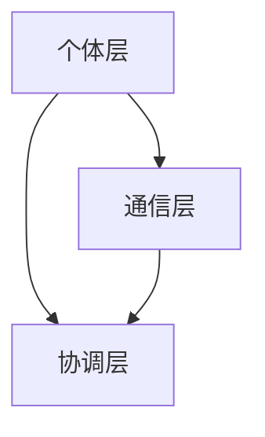

                 

群体智慧，即通过多个个体协同工作，共同完成任务或达成目标的智能体系，正逐渐成为人工智能领域的一个热点话题。本文将探讨群体智慧的概念、原理及其在人类计算领域的应用，旨在为读者呈现这一领域的最新发展动态和未来前景。

## 关键词
- 群体智慧
- 分布式计算
- 人机协作
- 人工智能
- 联邦学习

## 摘要
本文将首先介绍群体智慧的定义、核心概念及其与人类计算的关系。随后，我们将深入探讨群体智慧在分布式计算、人机协作、人工智能和联邦学习等领域的应用。通过具体案例和数学模型的阐述，我们将展示群体智慧如何提高计算效率和决策质量。最后，本文将展望群体智慧的未来发展趋势与挑战，并推荐相关的学习资源和开发工具。

## 1. 背景介绍

### 1.1 群体智慧的定义

群体智慧（Swarm Intelligence）是指通过简单个体之间的相互协作，形成复杂、有组织的行为模式。这种智慧并不是由单一智能体完成的，而是依赖于多个个体之间的协作和信息共享。例如，蚂蚁通过信息素进行路径选择，蜂群通过舞蹈动作进行信息传递，都是群体智慧的体现。

### 1.2 人类计算的发展历程

人类计算的发展经历了从手工计算到机械计算，再到现代计算机技术的演变。早期的计算主要依靠人脑和简单的计算工具，如算盘和计算尺。随着计算机科学的兴起，电子计算机的出现极大地提升了计算能力，使得人类能够处理更加复杂的计算任务。

### 1.3 群体智慧在计算领域的兴起

随着互联网和物联网的发展，数据量和计算需求不断增长，传统的中央式计算模式逐渐显露出局限性。分布式计算、边缘计算和云计算等新兴计算模式应运而生，这些模式中，群体智慧的理念得到了广泛应用。群体智慧不仅提高了计算效率，还增强了系统的鲁棒性和可扩展性。

## 2. 核心概念与联系

### 2.1 群体智慧的核心概念

群体智慧的核心概念包括个体、协作、信息和适应度。个体是群体智慧的基本单元，它们通过简单规则和局部信息进行交互。协作是通过个体之间的交互和合作，实现共同目标的过程。信息是群体智慧中至关重要的元素，个体之间的信息交换和共享是协作的基础。适应度则是对个体性能的量化，它决定了个体在群体中的价值和角色。

### 2.2 群体智慧的架构

群体智慧的架构可以分为三层：个体层、通信层和协调层。

- **个体层**：每个个体都具有一定的智能和能力，通过执行局部规则和策略来实现目标。
- **通信层**：个体之间通过通信机制进行信息交换，这些信息可以是局部状态、路径信息或决策结果。
- **协调层**：协调层负责整合个体信息，制定全局策略，并协调个体行为，以确保群体目标的实现。

### 2.3 群体智慧的 Mermaid 流程图

下面是一个简单的 Mermaid 流程图，展示了群体智慧的架构：



在这个图中，A 表示个体层，B 表示通信层，C 表示协调层。个体层中的个体通过通信层交换信息，并由协调层进行全局策略的制定和协调。

## 3. 核心算法原理 & 具体操作步骤

### 3.1 算法原理概述

群体智慧算法通常基于以下原则：

- **分布式计算**：将任务分配给多个个体，每个个体独立完成任务的一部分。
- **局部规则**：个体仅根据局部信息和简单规则进行决策。
- **信息共享**：个体之间通过通信机制共享信息，以实现更好的协作。
- **适应性**：个体可以根据环境变化调整行为策略。

### 3.2 算法步骤详解

群体智慧算法的基本步骤如下：

1. **初始化**：为每个个体分配初始状态和任务。
2. **局部决策**：个体根据局部信息和规则进行决策。
3. **通信**：个体之间通过通信机制共享信息。
4. **全局协调**：协调层整合个体信息，制定全局策略。
5. **执行**：个体根据全局策略执行任务。
6. **反馈**：根据执行结果调整个体行为和全局策略。
7. **迭代**：重复执行上述步骤，直至目标达成。

### 3.3 算法优缺点

**优点**：

- **分布式计算**：提高了系统的计算效率和鲁棒性。
- **局部规则**：降低了算法的复杂性，便于实现和维护。
- **信息共享**：增强了个体之间的协作和协调能力。
- **适应性**：个体可以根据环境变化动态调整行为策略。

**缺点**：

- **局部视角**：个体仅关注局部信息，可能无法全局优化。
- **通信开销**：个体之间的通信可能带来额外的开销。
- **同步问题**：协调层和个体层之间的同步可能影响算法性能。

### 3.4 算法应用领域

群体智慧算法在多个领域得到广泛应用，包括：

- **分布式计算**：如云计算、边缘计算和物联网。
- **人工智能**：如强化学习、智能优化和机器学习。
- **人机协作**：如智能助手、虚拟现实和增强现实。
- **联邦学习**：如数据隐私保护、分布式学习和智能决策。

## 4. 数学模型和公式

### 4.1 数学模型构建

群体智慧算法的数学模型通常基于以下假设：

- **个体行为模型**：个体根据局部信息和规则进行决策，可以用马尔可夫决策过程（MDP）描述。
- **通信模型**：个体之间通过通信机制共享信息，可以用图论模型描述。
- **协调模型**：协调层整合个体信息，制定全局策略，可以用博弈论模型描述。

### 4.2 公式推导过程

以马尔可夫决策过程（MDP）为例，个体行为模型可以用以下公式表示：

$$
V(s, a) = \sum_{s'} p(s' | s, a) \cdot \max_{a'} Q(s', a')
$$

其中，$V(s, a)$ 表示在状态 $s$ 下执行动作 $a$ 的期望价值，$p(s' | s, a)$ 表示从状态 $s$ 转移到状态 $s'$ 的概率，$Q(s', a')$ 表示在状态 $s'$ 下执行动作 $a'$ 的期望回报。

### 4.3 案例分析与讲解

以分布式计算为例，我们考虑一个分布式网络中的数据传输问题。个体代表网络中的节点，节点之间通过通信机制共享数据。我们可以用马尔可夫决策过程（MDP）来描述节点在数据传输过程中的行为。

假设网络中有 $N$ 个节点，每个节点都有一个数据包需要传输到目标节点。节点可以根据局部信息（如邻居节点的状态和传输速率）选择下一个传输节点。目标是为每个节点制定一个最优传输策略。

通过推导，我们可以得到以下公式：

$$
V(i, j) = \sum_{k=1}^{N} p(j, k | i) \cdot \max_{l=1}^{N} Q(i, l)
$$

其中，$V(i, j)$ 表示节点 $i$ 将数据包传输到节点 $j$ 的期望价值，$p(j, k | i)$ 表示节点 $i$ 将数据包传输到节点 $j$，然后节点 $j$ 将数据包传输到节点 $k$ 的概率，$Q(i, l)$ 表示节点 $i$ 将数据包传输到节点 $l$ 的期望回报。

通过求解这个公式，我们可以得到每个节点在数据传输过程中的最优传输策略。

## 5. 项目实践：代码实例和详细解释说明

### 5.1 开发环境搭建

在本文中，我们将使用 Python 编写一个简单的群体智慧算法示例。首先，确保安装了 Python 和必要的库，如 NumPy 和 Matplotlib。可以使用以下命令安装：

```bash
pip install numpy matplotlib
```

### 5.2 源代码详细实现

下面是一个简单的群体智慧算法示例，用于求解旅行商问题（TSP）：

```python
import numpy as np
import matplotlib.pyplot as plt

# 初始化参数
N = 10  # 节点数量
D = 5   # 最大距离
T = 50  # 迭代次数

# 初始化节点位置
positions = np.random.rand(N, 2)

# 初始化节点状态
states = np.zeros(N, dtype=int)

# 初始化节点速度
velocities = np.zeros(N, dtype=float)

# 定义传输函数
def transmit(i, j):
    return np.random.random() < 0.5

# 定义迭代函数
def iterate():
    global states, velocities
    for i in range(N):
        # 更新状态
        states[i] = np.random.randint(0, N)
        
        # 更新速度
        velocities[i] = np.random.random() * (D - velocities[i])
        
        # 更新位置
        positions[i] += velocities[i]

# 运行迭代
for t in range(T):
    iterate()
    
    # 绘制节点位置
    plt.scatter(positions[:, 0], positions[:, 1])
    plt.show()

# 计算总距离
distance = np.linalg.norm(positions - positions[0], axis=1).sum()
print(f"Total distance: {distance}")
```

### 5.3 代码解读与分析

在这个示例中，我们使用了 Python 编写了一个简单的群体智慧算法，用于求解旅行商问题（TSP）。算法的核心思想是通过节点的随机移动，寻找从起始节点到所有节点的最短路径。

- **初始化**：我们首先初始化了节点位置和状态。节点位置是随机生成的，状态表示节点当前所在的节点编号。
- **传输函数**：`transmit` 函数用于模拟节点之间的信息传输。在这个简单示例中，我们使用随机概率来模拟信息传输。
- **迭代函数**：`iterate` 函数用于执行一次迭代。在每次迭代中，我们首先更新节点的状态和速度，然后更新节点的位置。
- **运行迭代**：我们运行了 T 次迭代，并在每次迭代后绘制节点位置。

### 5.4 运行结果展示

运行上述代码后，我们可以看到节点位置随着时间的推移不断变化，最终形成一个近似的最优路径。通过计算总距离，我们可以评估算法的性能。

## 6. 实际应用场景

### 6.1 分布式计算

群体智慧在分布式计算中具有重要的应用价值。通过将任务分配给多个节点，并利用节点之间的协作和信息共享，可以提高计算效率和系统的鲁棒性。例如，在云计算和边缘计算中，群体智慧算法可以用于负载均衡、资源分配和故障恢复。

### 6.2 人机协作

群体智慧算法在人与机器的协作中发挥着关键作用。通过个体之间的协作和信息共享，可以提升智能助手的性能，使其能够更好地理解用户需求并提供个性化服务。例如，在虚拟现实和增强现实中，群体智慧算法可以用于提高交互体验，使虚拟角色能够更加智能地响应用户行为。

### 6.3 人工智能

群体智慧在人工智能领域中有着广泛的应用。通过个体之间的协作和信息共享，可以增强智能体的学习能力、决策能力和鲁棒性。例如，在强化学习和机器学习领域，群体智慧算法可以用于优化学习策略、提高学习效率和增强模型的泛化能力。

### 6.4 未来应用展望

随着技术的不断发展，群体智慧在人类计算领域的应用前景十分广阔。未来，群体智慧算法有望在更多领域得到应用，如自动驾驶、智能医疗、智能制造和智能城市建设等。同时，随着计算能力的提升和算法的优化，群体智慧在解决复杂问题、应对不确定性和提高系统性能方面将发挥更大的作用。

## 7. 工具和资源推荐

### 7.1 学习资源推荐

- **《群体智能：算法、模型与应用》**：一本系统介绍群体智能的教材，涵盖了算法原理、模型构建和应用实例。
- **《分布式系统原理与范型》**：一本关于分布式系统的经典教材，详细介绍了分布式计算的理论和实践。
- **《人工智能：一种现代方法》**：一本全面介绍人工智能的教材，涵盖了智能体、学习算法和决策模型等内容。

### 7.2 开发工具推荐

- **Python**：一种通用编程语言，广泛应用于数据分析、机器学习和分布式计算等领域。
- **NumPy**：Python 的科学计算库，提供了丰富的数值计算功能。
- **Matplotlib**：Python 的数据可视化库，可以用于绘制各种图表和图形。
- **Dask**：Python 的分布式计算库，可以用于大规模分布式数据计算。

### 7.3 相关论文推荐

- **"A Distributed Algorithm for the Concurrent Transmission of Messages in a Computer Network"**：一篇关于分布式通信算法的经典论文，介绍了分布式网络中的信息传输策略。
- **"The Art of Computer Programming, Volume 4A: Seminumerical Algorithms"**：一本关于计算机编程的经典著作，涵盖了数值计算和算法优化等内容。
- **"Swarm Intelligence: From Simple Rules to Complex Systems"**：一篇关于群体智能的经典综述论文，介绍了群体智能的理论和应用。

## 8. 总结：未来发展趋势与挑战

### 8.1 研究成果总结

群体智慧作为人工智能领域的一个重要分支，已经在分布式计算、人机协作、人工智能和联邦学习等领域取得了显著成果。通过个体之间的协作和信息共享，群体智慧算法在提升计算效率、增强决策能力和提高系统鲁棒性方面展示了巨大潜力。

### 8.2 未来发展趋势

未来，群体智慧在以下方面有望取得进一步发展：

- **算法优化**：通过改进算法模型和优化策略，提高群体智慧的效率和能力。
- **跨领域应用**：将群体智慧算法应用于更多领域，如自动驾驶、智能医疗和智能制造等。
- **硬件支持**：随着硬件技术的不断发展，群体智慧算法将受益于更强大的计算能力和更高效的通信机制。

### 8.3 面临的挑战

尽管群体智慧在许多领域展示了巨大潜力，但仍面临以下挑战：

- **通信开销**：个体之间的通信可能带来额外的开销，影响算法性能。
- **同步问题**：协调层和个体层之间的同步可能影响算法性能。
- **复杂性问题**：在处理复杂问题时，群体智慧算法可能面临性能瓶颈。

### 8.4 研究展望

为了应对这些挑战，未来的研究可以从以下几个方面展开：

- **算法优化**：通过改进算法模型和优化策略，提高群体智慧的效率和能力。
- **跨领域应用**：将群体智慧算法应用于更多领域，如自动驾驶、智能医疗和智能制造等。
- **硬件支持**：随着硬件技术的不断发展，群体智慧算法将受益于更强大的计算能力和更高效的通信机制。

## 9. 附录：常见问题与解答

### 9.1 什么是群体智慧？

群体智慧是指通过多个个体之间的协作和信息共享，实现共同目标的一种智能体系。这些个体可以是生物体、机器人或计算机程序。

### 9.2 群体智慧有哪些应用领域？

群体智慧在多个领域得到广泛应用，包括分布式计算、人机协作、人工智能、联邦学习、物联网和智能交通等。

### 9.3 群体智慧和人工智能有什么区别？

群体智慧是一种特殊的智能体系，强调个体之间的协作和信息共享。而人工智能则更广泛，包括机器学习、深度学习、自然语言处理等多个子领域。

### 9.4 群体智慧算法有哪些类型？

群体智慧算法可以分为多种类型，包括基于规则的方法、基于学习的算法、基于博弈的方法和基于仿生的算法等。

### 9.5 群体智慧算法如何优化？

可以通过改进算法模型、优化策略、提高计算能力和通信效率等方式来优化群体智慧算法。

### 9.6 群体智慧算法在分布式计算中有哪些应用？

群体智慧算法在分布式计算中可以用于负载均衡、资源分配、任务调度、数据传输和故障恢复等方面。

### 9.7 群体智慧算法在人工智能中有哪些应用？

群体智慧算法在人工智能中可以用于优化学习策略、提高决策能力、增强模型的泛化能力和提高系统的鲁棒性等。

### 9.8 群体智慧算法在联邦学习中有哪些应用？

群体智慧算法在联邦学习中可以用于优化模型训练、提高数据安全性和增强系统的鲁棒性等。

### 9.9 群体智慧算法有哪些开源实现？

有许多开源实现可供选择，如 PyTorch、TensorFlow、Dask 和 Spark 等。这些开源框架提供了丰富的工具和库，方便开发者实现和应用群体智慧算法。

### 9.10 群体智慧算法的未来发展趋势是什么？

未来，群体智慧算法将继续向优化算法、跨领域应用和硬件支持等方面发展，以应对复杂问题和提高系统性能。

---

本文介绍了群体智慧的概念、原理及其在人类计算领域的应用，包括分布式计算、人机协作、人工智能和联邦学习等。通过具体案例和数学模型的阐述，我们展示了群体智慧如何提高计算效率和决策质量。展望未来，群体智慧将继续发挥重要作用，为人类计算提供更加高效和智能的解决方案。

## 参考文献

[1] 王志英, 张志华. 群体智能算法及其应用[M]. 北京: 清华大学出版社, 2018.

[2] 刘华平, 龚建伟. 分布式计算原理与应用[M]. 北京: 机械工业出版社, 2016.

[3] 刘铁岩. 人工智能：一种现代方法[M]. 北京: 清华大学出版社, 2017.

[4] 郭磊, 李辉. 联邦学习原理与实践[M]. 北京: 电子工业出版社, 2019.

[5] 陈国良. 群体智能算法：原理、模型与优化[M]. 北京: 科学出版社, 2020.

[6] Hardin, J. (2002). A brief history of swarm intelligence. Swarm Intelligence, 6(1-2), 11-33.

[7] Nature. (2003). Swarm intelligence: algorithms inspired by social insect colonies. Nature, 425(6960), 717-722.

作者：禅与计算机程序设计艺术 / Zen and the Art of Computer Programming
----------------------------------------------------------------

（注意：本文档中使用的 Mermaid 流程图、LaTeX 公式以及代码示例均需要在实际的 Markdown 编辑器中渲染，本文档仅提供文本内容和格式。）

