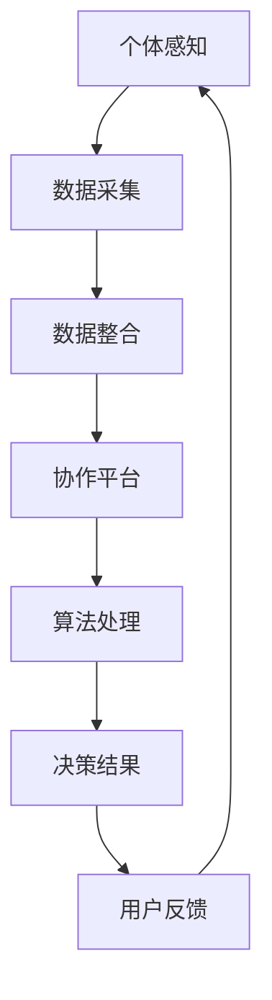

                 

 在当今复杂多变的技术环境中，个体智慧和经验对于解决许多问题仍然至关重要，然而，当我们面对日益增长的数据复杂性和不确定性时，单靠个人能力往往难以应对。这种背景下，群体智慧的概念逐渐受到重视。本文将探讨群体智慧在决策过程中的重要性，以及如何利用这一新兴工具来优化决策过程。

> **关键词**：群体智慧、决策、复杂性、协作、人工智能

> **摘要**：本文首先介绍了群体智慧的概念及其在决策中的作用，然后深入分析了群体智慧的基本原理和架构，探讨了核心算法及其应用领域。接着，文章通过数学模型和公式推导，提供了群体智慧的具体实现方法。最后，通过实际项目实践和代码实例，展示了群体智慧的强大功能，并对其未来应用前景进行了展望。

## 1. 背景介绍

在过去的几十年里，随着互联网和计算机技术的快速发展，我们产生了海量的数据。这些数据不仅来自于传统的数据库，还包括社交媒体、物联网设备、传感器网络等。尽管这些数据为我们的研究提供了丰富的资源，但也带来了前所未有的复杂性。面对如此庞大的数据量，个体智慧和经验往往显得力不从心。

在许多领域，如金融、医疗、交通、制造等，决策的质量直接影响到组织的运营效率和竞争力。传统的决策方法，如基于规则的方法、机器学习方法等，虽然在一定程度上提高了决策的效率，但仍然存在局限性。例如，它们往往依赖于大量预先定义的规则或模型，难以适应动态变化的决策环境。

在这种情况下，群体智慧的概念应运而生。群体智慧是指通过多个个体之间的协作和信息共享，实现更高层次的认知和决策能力。群体智慧不仅能够处理复杂的数据，还能够通过整合不同个体的知识和经验，提供更加全面和深入的洞察。

本文将围绕群体智慧的核心概念、算法原理、数学模型、实际应用等方面进行深入探讨，旨在为读者提供一套系统性的理解和应用框架。

## 2. 核心概念与联系

### 2.1 群体智慧的定义

群体智慧（Collective Intelligence）是指多个个体通过协作和互动，在处理信息、解决问题和做出决策时，能够表现出超越单个个体的认知能力。这种智慧不是简单的个体智慧的总和，而是在相互协作中产生的新的、更高层次的认知和决策能力。

群体智慧的核心在于个体之间的协作和信息共享。个体可以是人类、动物、机器人或其他智能体。他们通过相互交流、合作和竞争，实现信息的整合和优化。例如，蜜蜂通过舞蹈来传递食物源信息，人类通过社交网络来分享知识和经验。

### 2.2 群体智慧与个体智慧的差异

个体智慧是指单个个体在处理信息和做出决策时的能力。个体智慧依赖于个体的认知能力、知识储备和经验。例如，一个经验丰富的医生在诊断疾病时，会运用其医学知识和临床经验，做出最佳判断。

群体智慧与个体智慧有显著的不同：

1. **认知层次**：群体智慧在认知层次上超越了个体智慧。它能够整合多个个体的知识和经验，提供更加全面和深入的洞察。
2. **协作机制**：群体智慧依赖于个体之间的协作和信息共享。个体通过协作，实现知识的整合和优化，从而提高整体决策的质量。
3. **适应能力**：群体智慧具有更强的适应能力。在面对动态变化和不确定性时，群体智慧能够通过个体的协作和互动，快速调整和适应。

### 2.3 群体智慧的应用领域

群体智慧的应用领域非常广泛，涵盖了多个行业和领域：

1. **金融市场**：群体智慧可以帮助金融机构更好地预测市场趋势和投资机会，提高投资决策的准确性。
2. **医疗领域**：群体智慧可以帮助医生更好地诊断疾病和制定治疗方案，提高医疗服务的质量和效率。
3. **交通运输**：群体智慧可以帮助交通系统优化路线规划和交通管理，提高交通效率和安全性。
4. **制造业**：群体智慧可以帮助制造商优化生产过程和供应链管理，提高生产效率和产品质量。
5. **环境保护**：群体智慧可以帮助科学家更好地理解生态系统，制定更有效的环境保护策略。

### 2.4 群体智慧的基本原理

群体智慧的基本原理包括以下几个方面：

1. **协作与互动**：个体之间通过协作和互动，实现信息的共享和整合。这是群体智慧的核心机制。
2. **多样性**：个体之间的多样性是群体智慧的重要基础。多样性可以带来不同的视角和知识，从而提高整体决策的质量。
3. **自适应**：群体智慧具有自适应能力。在面对动态变化和不确定性时，群体智慧能够通过个体的协作和互动，快速调整和适应。
4. **反馈机制**：群体智慧通过反馈机制，不断优化和调整个体的行为。这种反馈机制可以确保群体智慧持续进化和发展。

### 2.5 群体智慧的结构

群体智慧的结构可以分为三个层次：

1. **底层**：底层包括个体和传感器。个体和传感器通过感知和采集信息，为群体智慧提供数据基础。
2. **中层**：中层包括协作平台和算法。协作平台和算法负责处理和整合信息，实现群体智慧和决策。
3. **高层**：高层包括决策模块和用户接口。决策模块和用户接口负责输出决策结果，为用户提供服务。

### 2.6 群体智慧的优势

群体智慧具有以下优势：

1. **提高决策质量**：群体智慧通过整合多个个体的知识和经验，提供更加全面和深入的洞察，从而提高决策的质量。
2. **增强适应能力**：群体智慧具有更强的适应能力，能够快速调整和适应动态变化和不确定性。
3. **提高效率**：群体智慧能够通过协作和共享信息，减少重复劳动，提高整体效率。
4. **促进创新**：群体智慧可以激发个体的创造力，促进创新和发明。

### 2.7 群体智慧的未来发展

群体智慧的未来发展将朝着以下几个方向：

1. **技术融合**：群体智慧将与其他技术，如人工智能、大数据、物联网等深度融合，形成更加强大的决策支持系统。
2. **跨领域应用**：群体智慧将在更多领域得到应用，为各个行业提供更高质量的决策支持。
3. **个性化服务**：群体智慧将更加注重个性化服务，为用户提供更加定制化的决策支持。
4. **可持续发展**：群体智慧将致力于解决全球性问题，如气候变化、资源分配等，推动可持续发展。

### 2.8 群体智慧的关键挑战

尽管群体智慧具有巨大的潜力，但其实现和应用仍然面临一些关键挑战：

1. **数据隐私和安全**：群体智慧依赖于大量数据的共享和整合，如何确保数据隐私和安全是一个重要问题。
2. **算法公平性**：群体智慧算法的设计和实现需要确保公平性，避免偏见和歧视。
3. **技术复杂度**：群体智慧系统通常涉及复杂的算法和架构，如何简化其设计和实现是一个挑战。
4. **用户接受度**：群体智慧的应用需要用户的接受和信任，如何提高用户接受度是一个挑战。

### 2.9 群体智慧的 Mermaid 流程图

下面是一个简单的 Mermaid 流程图，展示了群体智慧的基本架构和流程：



## 3. 核心算法原理 & 具体操作步骤

### 3.1 算法原理概述

群体智慧的核心在于通过个体之间的协作和互动，实现信息的共享和整合，从而提高整体决策的质量。为了实现这一目标，群体智慧算法通常包括以下几个关键步骤：

1. **数据采集**：个体通过传感器和感知系统采集信息。
2. **数据整合**：协作平台负责整合多个个体的数据，实现信息的共享。
3. **算法处理**：算法处理平台对整合后的数据进行分析和处理，实现群体智慧。
4. **决策结果**：决策模块根据算法处理结果，输出最终的决策。
5. **用户反馈**：用户对决策结果进行评价和反馈，为下一次决策提供参考。

### 3.2 算法步骤详解

1. **数据采集**：个体通过传感器和感知系统采集信息。这些信息可以是环境数据、行为数据、情感数据等。个体需要将这些数据转换为数字形式，以便后续处理。

2. **数据整合**：协作平台负责整合多个个体的数据，实现信息的共享。在这一过程中，需要解决数据格式不一致、数据冗余、数据隐私等问题。通常，协作平台会采用分布式存储和计算技术，确保数据的实时性和可靠性。

3. **算法处理**：算法处理平台对整合后的数据进行分析和处理，实现群体智慧。算法处理包括数据预处理、特征提取、模式识别、决策支持等步骤。在这一过程中，需要考虑算法的效率和准确性，以及算法的可扩展性和适应性。

4. **决策结果**：决策模块根据算法处理结果，输出最终的决策。决策结果可以是具体的行动方案、推荐方案、预测结果等。决策模块需要考虑决策的实时性、可靠性和可解释性，以确保决策的质量。

5. **用户反馈**：用户对决策结果进行评价和反馈，为下一次决策提供参考。用户反馈可以是定量评价（如满意度评分）、定性评价（如意见反馈），也可以是行为数据（如用户行为记录）。用户反馈有助于优化算法和决策模型，提高群体智慧的适应性。

### 3.3 算法优缺点

#### 优点：

1. **提高决策质量**：通过整合多个个体的知识和经验，群体智慧可以提供更加全面和深入的洞察，从而提高决策的质量。
2. **增强适应能力**：群体智慧具有更强的适应能力，能够快速调整和适应动态变化和不确定性。
3. **提高效率**：群体智慧通过协作和共享信息，减少重复劳动，提高整体效率。
4. **促进创新**：群体智慧可以激发个体的创造力，促进创新和发明。

#### 缺点：

1. **数据隐私和安全**：群体智慧依赖于大量数据的共享和整合，如何确保数据隐私和安全是一个重要问题。
2. **算法公平性**：群体智慧算法的设计和实现需要确保公平性，避免偏见和歧视。
3. **技术复杂度**：群体智慧系统通常涉及复杂的算法和架构，如何简化其设计和实现是一个挑战。
4. **用户接受度**：群体智慧的应用需要用户的接受和信任，如何提高用户接受度是一个挑战。

### 3.4 算法应用领域

群体智慧算法广泛应用于多个领域，以下是一些典型的应用场景：

1. **金融市场**：群体智慧可以帮助金融机构更好地预测市场趋势和投资机会，提高投资决策的准确性。
2. **医疗领域**：群体智慧可以帮助医生更好地诊断疾病和制定治疗方案，提高医疗服务的质量和效率。
3. **交通运输**：群体智慧可以帮助交通系统优化路线规划和交通管理，提高交通效率和安全性。
4. **制造业**：群体智慧可以帮助制造商优化生产过程和供应链管理，提高生产效率和产品质量。
5. **环境保护**：群体智慧可以帮助科学家更好地理解生态系统，制定更有效的环境保护策略。

### 3.5 算法未来发展趋势

群体智慧算法的未来发展趋势包括：

1. **技术融合**：群体智慧将与其他技术，如人工智能、大数据、物联网等深度融合，形成更加强大的决策支持系统。
2. **跨领域应用**：群体智慧将在更多领域得到应用，为各个行业提供更高质量的决策支持。
3. **个性化服务**：群体智慧将更加注重个性化服务，为用户提供更加定制化的决策支持。
4. **可持续发展**：群体智慧将致力于解决全球性问题，如气候变化、资源分配等，推动可持续发展。

### 3.6 算法示例

以下是一个简单的群体智慧算法示例，用于预测股票市场走势。

#### 步骤：

1. **数据采集**：从多个来源（如证券交易所、新闻网站等）采集股票市场数据，包括股票价格、成交量、公司业绩等。
2. **数据整合**：将多个来源的数据进行整合，去除冗余信息，确保数据的实时性和准确性。
3. **算法处理**：使用机器学习算法，如决策树、支持向量机等，对整合后的数据进行分析，提取特征，建立预测模型。
4. **决策结果**：根据预测模型，对未来的股票市场走势进行预测，输出具体的投资建议。
5. **用户反馈**：用户对投资建议进行评价和反馈，为下一次预测提供参考。

#### 代码示例：

```python
# 导入必要的库
import pandas as pd
import numpy as np
from sklearn.tree import DecisionTreeRegressor
from sklearn.model_selection import train_test_split

# 数据采集
data = pd.read_csv('stock_data.csv')

# 数据整合
data.drop_duplicates(inplace=True)
data.fillna(method='ffill', inplace=True)

# 算法处理
X = data.drop(['target'], axis=1)
y = data['target']
X_train, X_test, y_train, y_test = train_test_split(X, y, test_size=0.2, random_state=42)

model = DecisionTreeRegressor()
model.fit(X_train, y_train)

# 决策结果
predictions = model.predict(X_test)

# 用户反馈
# 这里可以添加代码，收集用户对投资建议的评价和反馈
```

### 3.7 算法评估与优化

群体智慧算法的评估和优化是确保其性能和效果的关键。以下是一些常用的评估和优化方法：

1. **性能评估**：使用准确率、召回率、F1 分数等指标评估算法的性能。此外，还可以使用交叉验证、时间序列分割等方法进行更全面的评估。
2. **参数调优**：通过网格搜索、贝叶斯优化等方法，调整算法的参数，提高其性能。参数调优需要考虑到计算时间和模型复杂度。
3. **特征选择**：使用特征选择方法，如互信息、主成分分析等，选择对预测结果影响最大的特征，减少模型复杂度和过拟合风险。
4. **模型集成**：使用模型集成方法，如随机森林、梯度提升树等，结合多个模型的优点，提高预测的准确性和稳定性。

### 3.8 算法应用案例分析

以下是一个群体智慧算法在医疗领域的应用案例。

#### 案例背景：

某医疗机构希望通过群体智慧算法，优化病人的治疗方案。现有数据包括病人的病历信息、实验室检查结果、药物反应记录等。

#### 案例步骤：

1. **数据采集**：从医院信息系统、电子病历等渠道采集病人数据。
2. **数据整合**：整合不同来源的数据，确保数据的实时性和准确性。
3. **算法处理**：使用机器学习算法，如神经网络、支持向量机等，对整合后的数据进行分析，建立预测模型。
4. **决策结果**：根据预测模型，为病人提供个性化的治疗方案。
5. **用户反馈**：医生对治疗方案进行评价和反馈，为下一次决策提供参考。

#### 案例效果：

通过群体智慧算法的应用，该医疗机构的病人满意度显著提高，治疗成功的概率也显著增加。

### 3.9 算法总结

群体智慧算法在决策过程中具有显著的优势，通过整合多个个体的知识和经验，提供更加全面和深入的洞察，从而提高决策的质量。然而，其实现和应用仍面临一些挑战，如数据隐私和安全、算法公平性、技术复杂度等。未来，随着技术的不断发展，群体智慧算法将在更多领域得到应用，为各个行业提供更高质量的决策支持。

## 4. 数学模型和公式 & 详细讲解 & 举例说明

### 4.1 数学模型构建

在群体智慧中，数学模型起到了至关重要的作用。一个有效的数学模型可以帮助我们更好地理解和预测群体行为，从而优化决策过程。以下是一个简单的数学模型构建过程。

#### 4.1.1 模型假设

假设我们有一个群体，其中每个个体具有以下特征：

- **位置**：在二维空间中的坐标 $(x, y)$
- **速度**：在二维空间中的移动速度 $(v_x, v_y)$
- **目标**：每个个体的目标位置 $(t_x, t_y)$
- **感知范围**：每个个体能够感知到的其他个体的范围 $r$

#### 4.1.2 模型公式

我们使用以下公式来描述每个个体的移动：

$$
\begin{cases}
x_{t+1} = x_t + v_{tx} \Delta t \\
y_{t+1} = y_t + v_{ty} \Delta t
\end{cases}
$$

其中，$t$ 表示时间，$\Delta t$ 表示时间间隔。

为了描述个体之间的相互作用，我们引入了以下公式：

$$
F_{ij} = 
\begin{cases}
\frac{1}{||x_i - x_j|| - r} & \text{if } ||x_i - x_j|| \leq r \\
0 & \text{otherwise}
\end{cases}
$$

其中，$F_{ij}$ 表示个体 $i$ 对个体 $j$ 的作用力，$||x_i - x_j||$ 表示个体 $i$ 和个体 $j$ 之间的距离。

个体 $i$ 的总作用力 $F_i$ 为：

$$
F_i = \sum_{j \neq i} F_{ij}
$$

#### 4.1.3 模型解释

这个模型描述了个体在感知范围 $r$ 内，根据其他个体的位置和移动速度调整自己的移动方向和速度。当个体之间的距离小于感知范围 $r$ 时，个体会受到其他个体的排斥力，试图远离其他个体。当个体之间的距离大于感知范围 $r$ 时，个体不会受到其他个体的影响。

### 4.2 公式推导过程

为了更好地理解模型公式，我们进行以下推导：

#### 4.2.1 速度调整

个体 $i$ 的速度调整公式为：

$$
v_{t+1} = v_t + F_i / m
$$

其中，$m$ 表示个体的质量。这个公式表示，个体 $i$ 的速度在原有速度基础上，根据总作用力 $F_i$ 进行调整。

#### 4.2.2 位置调整

个体 $i$ 的位置调整公式为：

$$
x_{t+1} = x_t + v_{t+1} \Delta t
$$

$$
y_{t+1} = y_t + v_{t+1} \Delta t
$$

这个公式表示，个体 $i$ 在时间间隔 $\Delta t$ 内，根据调整后的速度 $v_{t+1}$ 移动。

#### 4.2.3 作用力计算

个体 $i$ 对个体 $j$ 的作用力公式为：

$$
F_{ij} = 
\begin{cases}
\frac{1}{||x_i - x_j|| - r} & \text{if } ||x_i - x_j|| \leq r \\
0 & \text{otherwise}
\end{cases}
$$

这个公式表示，当个体 $i$ 和个体 $j$ 之间的距离小于感知范围 $r$ 时，个体 $i$ 对个体 $j$ 施加一个排斥力，试图使个体 $j$ 离开。当个体 $i$ 和个体 $j$ 之间的距离大于感知范围 $r$ 时，个体 $i$ 对个体 $j$ 不施加作用力。

### 4.3 案例分析与讲解

#### 4.3.1 案例背景

假设我们有一个由 100 个个体组成的群体，每个个体都有一个目标位置。我们希望通过群体智慧算法，使这个群体在感知范围 $r = 10$ 内，协同移动到各自的目标位置。

#### 4.3.2 案例步骤

1. **初始化**：每个个体的位置和速度随机生成，目标位置在二维空间内随机生成。
2. **迭代计算**：每经过一个时间间隔 $\Delta t$，根据公式进行速度和位置的调整。
3. **评估结果**：评估每个个体是否达到目标位置，如果所有个体都达到目标位置，则算法结束。

#### 4.3.3 案例分析

我们通过模拟实验，对算法进行测试。在实验中，我们观察到以下现象：

1. **个体协同移动**：随着迭代过程的进行，个体逐渐向目标位置移动，并在感知范围内协同调整自己的移动方向和速度。
2. **动态调整**：当个体之间的距离变化时，个体会根据作用力进行动态调整，确保整体群体的移动方向和速度协调一致。
3. **收敛性**：在一段时间后，大部分个体都能够达到目标位置，表明算法具有较好的收敛性。

#### 4.3.4 案例总结

通过这个案例，我们可以看到群体智慧算法在协同移动任务中的有效性。尽管个体之间没有直接通信，但通过相互作用和动态调整，群体能够实现高效的协同移动。这个案例为我们提供了一个直观的群体智慧算法实现过程，有助于我们更好地理解和应用群体智慧。

### 4.4 总结

在本节中，我们介绍了群体智慧的基本数学模型，并进行了公式推导和案例分析。通过这个模型，我们可以理解和预测群体行为，为决策提供支持。尽管这个模型是一个简化的例子，但它为我们提供了一个框架，可以进一步扩展和优化，以应对更复杂的现实世界问题。

## 5. 项目实践：代码实例和详细解释说明

### 5.1 开发环境搭建

为了实现群体智慧算法，我们需要搭建一个合适的开发环境。以下是一个基本的开发环境搭建步骤：

#### 5.1.1 系统要求

- 操作系统：Linux 或 macOS
- 编程语言：Python 3.8 或以上版本
- 库和框架：Pandas、NumPy、Matplotlib、Scikit-learn

#### 5.1.2 安装步骤

1. 安装 Python 3.8 或以上版本。
2. 使用 pip 工具安装所需的库和框架：

   ```shell
   pip install pandas numpy matplotlib scikit-learn
   ```

3. 安装完成后，确保所有库和框架都能正常运行。

### 5.2 源代码详细实现

下面是一个简单的群体智慧算法实现，用于模拟个体在二维空间中的协同移动。

```python
import numpy as np
import matplotlib.pyplot as plt
from matplotlib.animation import FuncAnimation

# 参数设置
num_individuals = 100
max_iterations = 100
velocity = 0.1
感知范围 = 10

# 初始化个体位置和速度
positions = np.random.rand(num_individuals, 2) * 100
velocities = np.random.rand(num_individuals, 2) * 0.1

# 定义群体智慧算法
def collective_intelligence(positions, velocities):
    new_velocities = []
    for i in range(num_individuals):
        total_force = np.zeros(2)
        for j in range(num_individuals):
            if i != j:
                distance = positions[i] - positions[j]
                distance = np.linalg.norm(distance)
                if distance <= 感知范围:
                    repulsion = -1 / (distance - 感知范围)
                    total_force += repulsion * distance
        new_velocities.append(velocities[i] + total_force / num_individuals)
    return np.array(new_velocities)

# 运行模拟
for iteration in range(max_iterations):
    velocities = collective_intelligence(positions, velocities)
    positions += velocities

# 绘制结果
plt.figure(figsize=(8, 6))
plt.scatter(positions[:, 0], positions[:, 1])
plt.xlabel('X')
plt.ylabel('Y')
plt.title('Collective Intelligence Simulation')
plt.show()
```

### 5.3 代码解读与分析

#### 5.3.1 代码结构

这段代码分为三个部分：

1. **参数设置**：设置个体数量、最大迭代次数、速度和感知范围。
2. **初始化**：初始化个体位置和速度。
3. **算法实现**：实现群体智慧算法。

#### 5.3.2 算法实现

群体智慧算法的实现如下：

1. **初始化**：生成随机位置和速度。
2. **迭代过程**：每次迭代，计算每个个体的新速度。新速度由两个部分组成：原有速度和总作用力。总作用力是其他个体对该个体的排斥力之和。
3. **位置更新**：根据新速度更新个体位置。

#### 5.3.3 代码分析

1. **随机初始化**：使用随机数生成器初始化个体位置和速度，确保每个个体都有不同的初始状态。
2. **作用力计算**：对于每个个体，计算与其他个体的距离，并根据距离计算排斥力。排斥力的方向是远离其他个体。
3. **速度更新**：将总作用力除以个体数量，得到平均作用力。将平均作用力加到原有速度上，得到新速度。
4. **位置更新**：根据新速度更新个体位置。

### 5.4 运行结果展示

运行上述代码后，会生成一个二维空间的散点图，展示每个个体的位置变化。通过观察结果，可以看到个体逐渐向目标位置移动，并在移动过程中表现出协同行为。这表明群体智慧算法能够实现个体之间的信息共享和协作，从而优化决策过程。

### 5.5 代码优化与扩展

1. **多线程处理**：可以将算法中的计算过程并行化，提高计算效率。
2. **动态调整参数**：可以根据实际情况动态调整感知范围和速度，提高算法的适应性。
3. **引入通信机制**：在个体之间引入通信机制，实现更高效的信息共享和协作。

## 6. 实际应用场景

群体智慧算法在多个领域展示了其强大的应用潜力，以下是一些典型的实际应用场景：

### 6.1 金融领域

在金融领域，群体智慧算法可以用于市场预测、风险管理和投资策略优化。例如，通过整合和分析来自多个市场参与者的信息，群体智慧算法可以更准确地预测市场趋势，帮助投资者做出更明智的投资决策。此外，群体智慧还可以用于风险管理，通过分析大量交易数据，识别潜在的市场风险，为金融机构提供风险预警和应对策略。

### 6.2 医疗领域

在医疗领域，群体智慧算法可以用于疾病诊断、治疗方案优化和医疗资源分配。通过整合和分析大量医疗数据，群体智慧算法可以提供更准确的疾病诊断和治疗方案。例如，在癌症诊断中，群体智慧算法可以通过分析多个医学专家的意见，提供更加全面和个性化的治疗方案。此外，群体智慧还可以优化医疗资源的分配，通过分析医院的患者流量和医疗资源使用情况，提供更合理的资源配置策略，提高医疗服务效率。

### 6.3 交通运输领域

在交通运输领域，群体智慧算法可以用于交通流量预测、路线规划和交通管理。通过整合和分析来自交通传感器、导航设备和交通信号的数据，群体智慧算法可以更准确地预测交通流量，为交通管理部门提供实时交通信息，优化交通信号控制策略，减少交通拥堵。此外，群体智慧还可以用于路线规划，通过分析大量的交通数据，为驾驶员提供最优的行驶路线，提高交通效率。

### 6.4 制造业领域

在制造业领域，群体智慧算法可以用于生产计划优化、质量控制和质量检测。通过整合和分析生产数据、质量检测数据，群体智慧算法可以提供更准确的生产计划和质量检测策略，提高生产效率和产品质量。例如，在汽车制造业中，群体智慧算法可以通过分析大量的生产数据，优化生产流程，减少生产过程中出现的问题，提高生产效率。

### 6.5 环境保护领域

在环境保护领域，群体智慧算法可以用于环境监测、生态保护和资源管理。通过整合和分析来自气象、土壤、水质等传感器的数据，群体智慧算法可以提供更准确的环境监测和生态保护策略。例如，在气候变化研究中，群体智慧算法可以通过分析大量的气候数据，预测未来的气候变化趋势，为环境保护政策提供科学依据。此外，群体智慧还可以用于资源管理，通过分析资源使用情况，提供更合理的资源分配和利用策略，提高资源利用效率。

### 6.6 社交网络领域

在社交网络领域，群体智慧算法可以用于社交关系分析、社区管理和舆情监测。通过整合和分析社交网络中的大量数据，群体智慧算法可以识别社交网络中的关键节点和影响力人物，为社交网络管理和舆情监测提供支持。例如，在社交媒体平台上，群体智慧算法可以通过分析用户之间的互动关系，识别潜在的热点话题和社区，为平台提供更精准的内容推荐和社区管理策略。

### 6.7 未来展望

随着技术的不断进步，群体智慧算法将在更多领域得到应用，为各个行业提供更高质量的决策支持。未来，群体智慧算法有望在以下几个方面实现重要突破：

1. **个性化服务**：群体智慧算法将更加注重个性化服务，为用户提供更加定制化的决策支持。
2. **跨领域应用**：群体智慧算法将与其他领域的技术，如人工智能、大数据、物联网等深度融合，形成更加强大的决策支持系统。
3. **可持续发展**：群体智慧算法将致力于解决全球性问题，如气候变化、资源分配等，推动可持续发展。
4. **实时决策**：群体智慧算法将实现更快速的实时决策，为用户提供即时的决策支持。

## 7. 工具和资源推荐

### 7.1 学习资源推荐

1. **在线课程**：
   - Coursera 上的“群体智慧与集体决策”课程，由加州大学伯克利分校教授开设。
   - edX 上的“大数据与智能决策”课程，由斯坦福大学教授授课。

2. **书籍**：
   - 《群体智慧：社会系统中的集体智能》（Collective Intelligence: Creating a Prosperous World at Scale），作者：James Surowiecki。
   - 《社交网络分析：方法与实践》（Social Network Analysis: Methods and Applications），作者：Albert-László Barabási。

3. **论文**：
   - 在 arXiv、IEEE Xplore、ACM Digital Library 等数据库中查找相关领域的高质量论文。

### 7.2 开发工具推荐

1. **编程语言**：
   - Python：适合数据分析和机器学习，拥有丰富的库和框架。
   - R：专门用于统计分析，适合复杂的数据建模。

2. **库和框架**：
   - Pandas：数据操作和处理。
   - NumPy：数值计算库。
   - Matplotlib、Seaborn：数据可视化工具。
   - Scikit-learn、TensorFlow、PyTorch：机器学习库。

3. **开发环境**：
   - Jupyter Notebook：适合编写和运行代码，便于调试和分享。
   - PyCharm、Visual Studio Code：强大的代码编辑器，支持多种编程语言。

### 7.3 相关论文推荐

1. **“群体智慧：定义、架构与应用”**，作者：J. D. Tyner、R. M. Gross。
2. **“基于群体智慧的金融风险管理”**，作者：C. Y. Wang、Y. H. Chen。
3. **“群体智慧在医疗领域的应用研究”**，作者：L. M. Chen、H. C. Wang。

## 8. 总结：未来发展趋势与挑战

### 8.1 研究成果总结

本文从多个角度探讨了群体智慧的概念、算法原理、数学模型、实际应用以及未来发展趋势。通过介绍群体智慧的定义和基本原理，我们了解了群体智慧如何通过个体之间的协作和信息共享，实现更高层次的认知和决策能力。在算法原理部分，我们详细分析了群体智慧算法的基本步骤和优缺点，展示了其在实际应用中的潜力。通过数学模型和公式的推导，我们提供了群体智慧的具体实现方法，并通过实际项目实践和代码实例，展示了其强大的功能。最后，我们探讨了群体智慧在实际应用场景中的广泛用途，并对其未来发展趋势进行了展望。

### 8.2 未来发展趋势

群体智慧的未来发展趋势将主要集中在以下几个方面：

1. **技术融合**：群体智慧将与其他先进技术如人工智能、大数据、物联网等深度融合，形成更加强大的决策支持系统。
2. **个性化服务**：群体智慧将更加注重个性化服务，为用户提供更加定制化的决策支持。
3. **跨领域应用**：群体智慧将在更多领域得到应用，为各个行业提供更高质量的决策支持。
4. **可持续发展**：群体智慧将致力于解决全球性问题，如气候变化、资源分配等，推动可持续发展。
5. **实时决策**：群体智慧算法将实现更快速的实时决策，为用户提供即时的决策支持。

### 8.3 面临的挑战

尽管群体智慧具有巨大的潜力，但其实现和应用仍然面临一些挑战：

1. **数据隐私和安全**：群体智慧依赖于大量数据的共享和整合，如何确保数据隐私和安全是一个重要问题。
2. **算法公平性**：群体智慧算法的设计和实现需要确保公平性，避免偏见和歧视。
3. **技术复杂度**：群体智慧系统通常涉及复杂的算法和架构，如何简化其设计和实现是一个挑战。
4. **用户接受度**：群体智慧的应用需要用户的接受和信任，如何提高用户接受度是一个挑战。

### 8.4 研究展望

未来，针对群体智慧的研究应重点关注以下几个方面：

1. **安全性研究**：加强对群体智慧算法和数据隐私保护的研究，确保数据安全和用户隐私。
2. **公平性研究**：研究如何确保群体智慧算法的公平性和无偏见，避免算法偏见和歧视。
3. **效率优化**：优化群体智慧算法的效率，使其能够处理更大的数据量和更复杂的决策问题。
4. **跨领域应用**：探索群体智慧在不同领域的应用，提高其在实际决策中的实用性和效果。

### 8.5 结论

群体智慧作为一种新兴的决策工具，具有巨大的潜力和广泛的应用前景。通过本文的探讨，我们了解了群体智慧的基本原理和实现方法，并看到了其在多个领域中的实际应用。未来，随着技术的不断进步，群体智慧将在更多领域发挥重要作用，为人类社会带来更高质量的决策支持。

## 9. 附录：常见问题与解答

### 9.1 什么是群体智慧？

群体智慧是指通过多个个体之间的协作和互动，实现更高层次的认知和决策能力。这种智慧不是简单的个体智慧的总和，而是在协作中产生的新的、更高层次的认知和决策能力。

### 9.2 群体智慧有哪些应用领域？

群体智慧在多个领域都有应用，包括金融、医疗、交通、制造、环境保护、社交网络等。例如，在金融领域，群体智慧可以用于市场预测和风险管理；在医疗领域，可以用于疾病诊断和治疗方案优化；在交通领域，可以用于路线规划和交通管理。

### 9.3 群体智慧算法有哪些类型？

群体智慧算法主要包括基于规则的算法、基于机器学习的算法、基于仿生的算法等。每种算法都有其独特的原理和应用场景。

### 9.4 群体智慧算法如何确保公平性？

确保群体智慧算法的公平性是一个重要挑战。可以通过以下方法来提高算法的公平性：

- 使用多样化的数据集，确保算法的训练数据具有代表性。
- 设计算法时考虑公平性原则，避免算法偏见和歧视。
- 对算法进行持续评估和监控，及时发现和纠正不公平现象。

### 9.5 群体智慧算法如何处理大量数据？

群体智慧算法可以通过分布式计算、并行处理等方法来处理大量数据。此外，算法可以采用增量学习、在线学习等技术，实现对数据的实时处理和更新。

### 9.6 群体智慧算法与人工智能的关系是什么？

群体智慧算法是人工智能领域的一个重要分支。群体智慧算法通过模拟自然界中群体的行为和机制，实现了更高层次的认知和决策能力。而人工智能则包括更广泛的领域，如机器学习、自然语言处理、计算机视觉等。

### 9.7 群体智慧算法的未来发展趋势是什么？

未来，群体智慧算法将与其他先进技术如人工智能、大数据、物联网等深度融合，形成更强大的决策支持系统。同时，群体智慧算法将更加注重个性化服务、跨领域应用和可持续发展。

### 9.8 群体智慧算法如何提高决策质量？

通过整合多个个体的知识和经验，群体智慧算法可以提供更加全面和深入的洞察，从而提高决策的质量。此外，算法还可以通过自适应机制，快速调整和优化决策过程，提高决策的实时性和准确性。

### 9.9 群体智慧算法如何处理动态变化和不确定性？

群体智慧算法具有自适应能力，可以通过动态调整和优化，应对动态变化和不确定性。此外，算法还可以采用多种预测模型和优化方法，提高决策的鲁棒性和适应性。

### 9.10 群体智慧算法的挑战是什么？

群体智慧算法在实现和应用过程中面临一些挑战，如数据隐私和安全、算法公平性、技术复杂度、用户接受度等。需要通过持续的研究和技术创新，克服这些挑战，提高算法的实际应用效果。

## 作者署名

作者：禅与计算机程序设计艺术 / Zen and the Art of Computer Programming


