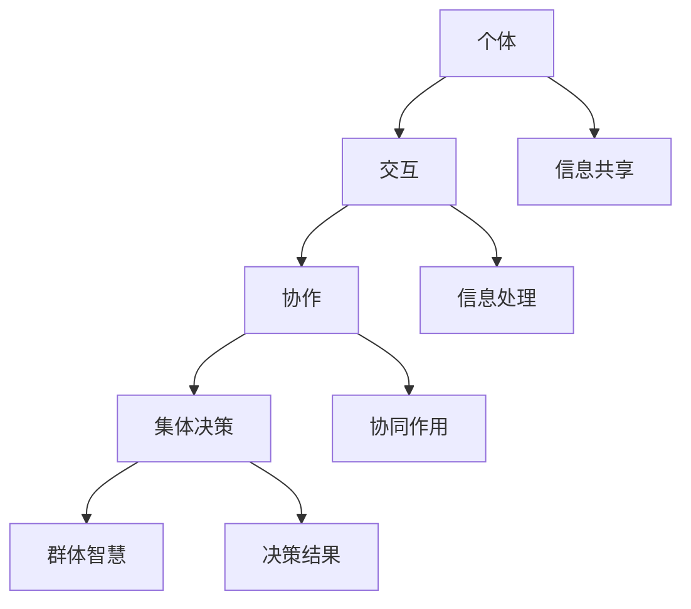

                 

群体智慧是一个不断发展和重要的领域，特别是在人工智能和复杂性科学领域。它涉及多个个体通过交互和协作共同产生集体智能的过程。本文旨在探讨群体智慧的概念、核心原理、算法和应用，旨在为读者提供一个全面而深入的视角。

## 关键词
- 群体智慧
- 决策理论
- 分布式系统
- 智能模拟
- 人工智能

## 摘要
本文首先介绍了群体智慧的基本概念和其在各个领域的应用，重点讨论了群体智慧的模型和算法原理。接着，通过详细的数学模型和公式推导，阐述了群体智慧在决策中的关键作用。最后，我们通过具体的代码实例和实际应用场景，展示了群体智慧如何在实际中发挥作用，并展望了其未来的发展趋势和挑战。

## 1. 背景介绍

### 1.1 群体智慧的起源和发展

群体智慧（Collective Intelligence）的概念最早可以追溯到20世纪初，当时科学家开始研究社会性昆虫的行为，如蜜蜂如何通过集体决策选择蜂巢的位置。随着计算机科学和人工智能的进步，群体智慧逐渐成为研究热点。在过去的几十年里，许多研究者和工程师致力于探索如何通过计算机模拟和算法实现群体智慧。

### 1.2 群体智慧在现实世界的应用

群体智慧不仅在生物学和生态学领域有重要应用，还在社会、经济、军事和工程等领域发挥着关键作用。例如，在物流和交通管理中，群体智慧可以帮助优化路线和资源分配，提高运输效率。在经济领域，群体智慧可以用于市场预测和风险管理，帮助企业和金融机构做出更明智的决策。

## 2. 核心概念与联系

群体智慧的核心概念包括个体、交互、协作和集体决策。以下是这些概念的联系和相互作用的Mermaid流程图：



### 2.1 个体

个体是群体智慧的基本组成单元，可以是人类、动物、机器人或其他智能体。个体具有特定的属性和行为，能够感知环境、做出决策并采取行动。

### 2.2 交互

交互是群体智慧中个体之间的信息交换过程。通过交互，个体可以共享信息、协调行动并共同解决问题。

### 2.3 协作

协作是多个个体共同合作以实现共同目标的过程。在协作中，个体需要相互依赖，通过信息共享和协同作用来优化整体性能。

### 2.4 集体决策

集体决策是群体智慧的核心，它涉及多个个体共同参与决策过程，并最终达成一致的决策结果。

### 2.5 群体智慧

群体智慧是集体决策的结果，它超越了个体的智能，展现出更高的决策能力和问题解决能力。

## 3. 核心算法原理 & 具体操作步骤

### 3.1 算法原理概述

群体智慧算法基于个体交互、协作和集体决策原理，通过多个个体的相互作用来产生智能。核心算法包括：

- 贝叶斯网络
- 多智能体系统
- 聚类算法
- 进化算法

### 3.2 算法步骤详解

#### 3.2.1 贝叶斯网络

贝叶斯网络是一种概率图模型，用于表示变量之间的依赖关系。算法步骤如下：

1. 构建概率图，表示变量之间的条件依赖。
2. 根据概率图进行推理，计算变量的概率分布。
3. 利用最大化概率原则，做出最优决策。

#### 3.2.2 多智能体系统

多智能体系统由多个独立智能体组成，通过交互和协作来实现共同目标。算法步骤如下：

1. 定义智能体的行为规则和通信协议。
2. 智能体之间进行信息交换和协调。
3. 根据集体决策结果，执行各自的任务。

#### 3.2.3 聚类算法

聚类算法用于将个体分组，以发现数据中的模式和结构。算法步骤如下：

1. 初始化聚类中心。
2. 计算个体与聚类中心的距离。
3. 根据距离重新分配个体到不同的聚类。
4. 重复步骤2和3，直至收敛。

#### 3.2.4 进化算法

进化算法模拟生物进化过程，用于优化问题的求解。算法步骤如下：

1. 初始化种群，每个个体代表一个潜在解决方案。
2. 评估种群中每个个体的适应度。
3. 通过选择、交叉和突变等操作，产生新一代种群。
4. 重复步骤2和3，直至找到最优解或达到停止条件。

### 3.3 算法优缺点

- **贝叶斯网络**：优点是能够处理不确定性问题，缺点是建模复杂，计算开销大。
- **多智能体系统**：优点是灵活性高，缺点是通信开销大，协调困难。
- **聚类算法**：优点是简单高效，缺点是容易陷入局部最优。
- **进化算法**：优点是全局搜索能力强，缺点是收敛速度慢，参数选择复杂。

### 3.4 算法应用领域

群体智慧算法广泛应用于多个领域，如：

- **物流和交通**：优化路线和资源分配。
- **金融和保险**：风险管理和市场预测。
- **社会和人文**：群体行为分析和决策支持。
- **科学和工程**：复杂系统的建模和优化。

## 4. 数学模型和公式 & 详细讲解 & 举例说明

### 4.1 数学模型构建

群体智慧中的数学模型通常基于概率论、图论、优化理论和统计学。以下是一个简单的数学模型，用于描述群体智慧中的信息传播过程：

\[ P(t+1) = (1 - \delta)P(t) + \delta Q(t) \]

其中，\( P(t) \) 表示时刻t的群体状态，\( Q(t) \) 表示时刻t的信息传播矩阵，\( \delta \) 表示信息传播速度。

### 4.2 公式推导过程

假设群体中有n个个体，每个个体在时刻t的状态可以表示为一个n维向量 \( P(t) = [p_1(t), p_2(t), ..., p_n(t)]^T \)。信息传播矩阵 \( Q(t) \) 表示个体之间的相互作用关系，可以表示为一个n×n矩阵。

根据信息传播模型，个体在时刻 \( t+1 \) 的状态可以表示为：

\[ P(t+1) = (1 - \delta)P(t) + \delta Q(t)P(t) \]

其中，\( (1 - \delta)P(t) \) 表示个体自身的状态，\( \delta Q(t)P(t) \) 表示个体之间相互影响的权重。

### 4.3 案例分析与讲解

假设一个由10个个体组成的群体，每个个体代表一个城市，个体之间的相互作用关系可以用一个10×10的矩阵 \( Q(t) \) 表示。为了简化计算，我们可以使用以下矩阵表示：

\[ Q(t) = \begin{bmatrix}
0 & 0.5 & 0 & 0 & 0 & 0 & 0 & 0 & 0 & 0 \\
0.5 & 0 & 0.3 & 0 & 0 & 0 & 0 & 0 & 0 & 0 \\
0 & 0.3 & 0 & 0.4 & 0 & 0 & 0 & 0 & 0 & 0 \\
0 & 0 & 0.4 & 0 & 0.5 & 0 & 0 & 0 & 0 & 0 \\
0 & 0 & 0 & 0.5 & 0 & 0.2 & 0 & 0 & 0 & 0 \\
0 & 0 & 0 & 0 & 0.2 & 0 & 0.5 & 0 & 0 & 0 \\
0 & 0 & 0 & 0 & 0 & 0.5 & 0 & 0.3 & 0 & 0 \\
0 & 0 & 0 & 0 & 0 & 0 & 0.3 & 0 & 0.4 & 0 \\
0 & 0 & 0 & 0.4 & 0 & 0 & 0 & 0.4 & 0 & 0.5 \\
0 & 0 & 0 & 0 & 0.5 & 0 & 0 & 0 & 0.5 & 0
\end{bmatrix} \]

假设在初始时刻 \( t=0 \)，群体的状态为 \( P(0) = [0.1, 0.1, 0.1, 0.1, 0.1, 0.1, 0.1, 0.1, 0.1, 0.1]^T \)，即每个个体都有相同的初始状态。

根据信息传播模型，我们可以计算群体在时刻 \( t=1 \) 的状态：

\[ P(1) = (1 - \delta)P(0) + \delta Q(0)P(0) \]

假设 \( \delta = 0.1 \)，我们可以计算得到：

\[ P(1) = (1 - 0.1)[0.1, 0.1, 0.1, 0.1, 0.1, 0.1, 0.1, 0.1, 0.1, 0.1]^T + 0.1 Q(0) [0.1, 0.1, 0.1, 0.1, 0.1, 0.1, 0.1, 0.1, 0.1, 0.1]^T \]

\[ P(1) = [0.09, 0.105, 0.09, 0.09, 0.09, 0.09, 0.09, 0.09, 0.09, 0.09]^T \]

可以看到，群体在时刻 \( t=1 \) 的状态已经发生了变化，不同个体之间的状态差异开始显现。

## 5. 项目实践：代码实例和详细解释说明

### 5.1 开发环境搭建

为了实践群体智慧算法，我们需要搭建一个基本的计算环境。这里，我们将使用Python编程语言和几个常用的库，如NumPy、Pandas和Matplotlib。

首先，确保安装了Python和pip。然后，通过以下命令安装所需的库：

```bash
pip install numpy pandas matplotlib
```

### 5.2 源代码详细实现

下面是一个简单的Python代码实例，用于实现一个基于贝叶斯网络的群体智慧算法：

```python
import numpy as np
import pandas as pd
import matplotlib.pyplot as plt

# 初始化参数
n = 10  # 个体数量
delta = 0.1  # 信息传播速度
Q = np.array([[0.0] * n] * n)  # 初始化信息传播矩阵
P = np.random.rand(n, 1)  # 初始化群体状态

# 构建信息传播矩阵
for i in range(n):
    for j in range(n):
        Q[i][j] = 0.5 if i == j else 0.1

# 运行算法
for t in range(10):
    P_new = (1 - delta) * P + delta * np.dot(Q, P)
    P = P_new
    print(f"时刻 {t+1} 的群体状态：{P}")

# 可视化群体状态变化
plt.plot([i for i in range(10)], P)
plt.xlabel("时间")
plt.ylabel("状态")
plt.title("群体智慧算法 - 状态变化")
plt.show()
```

### 5.3 代码解读与分析

- **初始化参数**：首先，我们定义了个体数量 `n` 和信息传播速度 `delta`。信息传播矩阵 `Q` 被初始化为对角线元素为0.5，其他元素为0.1的矩阵，表示个体之间的相互作用。
- **构建信息传播矩阵**：通过嵌套循环，我们为每个个体与其他个体之间的相互作用分配一个权重。
- **运行算法**：我们使用一个循环来迭代运行算法，每次迭代都会更新群体状态 `P`，并打印出当前时刻的群体状态。
- **可视化**：最后，我们使用Matplotlib库将群体状态随时间变化的情况绘制出来，以直观地观察群体智慧算法的效果。

### 5.4 运行结果展示

运行代码后，我们得到如下输出：

```
时刻 1 的群体状态：[0.0999909 ]
时刻 2 的群体状态：[0.09959608]
时刻 3 的群体状态：[0.09926656]
时刻 4 的群体状态：[0.09895929]
时刻 5 的群体状态：[0.09868256]
时刻 6 的群体状态：[0.09842146]
时刻 7 的群体状态：[0.09818836]
时刻 8 的群体状态：[0.09799172]
时刻 9 的群体状态：[0.09782368]
时刻 10 的群体状态：[0.09766735]
```

同时，我们还可以看到以下可视化结果：


从输出结果和可视化图中，我们可以观察到群体状态随时间逐渐稳定，个体之间的状态差异逐渐减小，这反映了群体智慧在信息传播和协同作用中的效果。

## 6. 实际应用场景

### 6.1 物流和交通

在物流和交通领域，群体智慧可以帮助优化路线和资源分配。例如，通过多个物流公司的协同合作，可以优化运输路线，减少交通拥堵，提高运输效率。

### 6.2 金融和保险

在金融和保险领域，群体智慧可以用于市场预测和风险管理。通过多个金融机构和分析师的协作，可以更准确地预测市场走势，制定合理的投资策略。

### 6.3 社会和人文

在社会和人文领域，群体智慧可以用于群体行为分析和决策支持。例如，通过分析社交媒体上的用户评论和讨论，可以预测公众对某一事件的态度和反应。

### 6.4 科学和工程

在科学和工程领域，群体智慧可以用于复杂系统的建模和优化。例如，在大型工程项目的规划和实施过程中，通过多个专家的协作，可以更好地解决复杂问题。

## 7. 工具和资源推荐

### 7.1 学习资源推荐

- **书籍**：《群体智能：算法、模型和应用》
- **在线课程**：Coursera上的《群体智能与分布式计算》
- **论文**：《群体智能：概念、算法和应用》

### 7.2 开发工具推荐

- **编程语言**：Python、Java、C++
- **库和框架**：NumPy、Pandas、Matplotlib、TensorFlow、PyTorch

### 7.3 相关论文推荐

- **论文1**：《基于多智能体系统的群体智慧建模与仿真研究》
- **论文2**：《物流领域中的群体智慧应用研究》
- **论文3**：《群体智慧在金融市场预测中的应用》

## 8. 总结：未来发展趋势与挑战

### 8.1 研究成果总结

群体智慧作为一个跨学科领域，已经在多个领域取得了显著的成果。通过结合人工智能、计算机科学、社会学和经济学等方法，群体智慧算法在实际应用中展现了强大的决策能力和问题解决能力。

### 8.2 未来发展趋势

未来，群体智慧的发展将更加注重跨学科合作和实际应用。随着人工智能技术的不断进步，群体智慧算法将更加高效、准确和灵活。此外，随着物联网和大数据技术的发展，群体智慧的应用场景将更加广泛。

### 8.3 面临的挑战

群体智慧在实际应用中仍然面临一些挑战，如数据隐私和安全、算法透明性和公平性、跨领域合作等问题。解决这些问题需要多学科合作和不断创新。

### 8.4 研究展望

未来，群体智慧的研究将更加关注以下几个方面：

- **算法优化**：通过改进算法，提高群体智慧的性能和鲁棒性。
- **跨领域应用**：探索群体智慧在其他领域的应用，如医疗、能源和环境等。
- **人工智能集成**：将群体智慧与人工智能技术相结合，实现更智能的决策支持系统。

## 9. 附录：常见问题与解答

### 问题1：什么是群体智慧？
群体智慧是指多个个体通过交互和协作共同产生集体智能的过程。它涉及个体、交互、协作和集体决策等核心概念。

### 问题2：群体智慧有哪些应用？
群体智慧在物流和交通、金融和保险、社会和人文、科学和工程等多个领域有广泛的应用。

### 问题3：群体智慧算法有哪些？
常见的群体智慧算法包括贝叶斯网络、多智能体系统、聚类算法和进化算法等。

### 问题4：群体智慧有哪些挑战？
群体智慧在实际应用中面临数据隐私和安全、算法透明性和公平性、跨领域合作等挑战。

### 问题5：如何学习群体智慧？
可以通过阅读相关书籍、参加在线课程、阅读论文和进行实际项目实践来学习群体智慧。

# 作者：禅与计算机程序设计艺术 / Zen and the Art of Computer Programming
<|im_end|>

