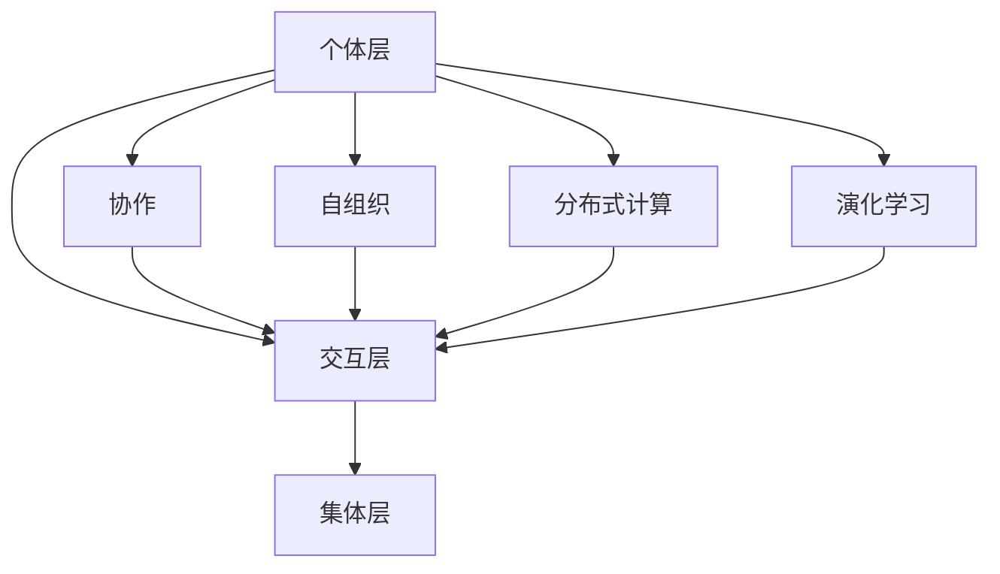

                 

关键词：群体智慧，决策，算法，应用领域，未来展望

> 摘要：本文深入探讨了群体智慧的概念、核心原理以及其在决策领域的广泛应用。通过分析群体智慧在算法、数学模型以及项目实践中的具体应用，我们旨在揭示群体智慧作为决策新引擎的巨大潜力。

## 1. 背景介绍

在信息爆炸、大数据和人工智能迅速发展的时代，个体智能的局限逐渐显现。如何从海量数据中提取有价值的信息，如何在复杂系统中做出最优决策，成为当前技术领域的关键挑战。群体智慧作为一种新的决策思维方式，以其独特的优势逐渐受到关注。

群体智慧（Collective Intelligence）是指通过个体之间的协作和相互作用，在无中心控制的情况下，产生出超越单个个体智能的集体智能。它不仅体现在生物群体中，如蜜蜂的觅食、鸟群的迁徙，也体现在人类社会的各种合作行为中，如互联网论坛的讨论、市场经济的运作等。

本文将从以下几个方面探讨群体智慧的概念、原理和应用：

1. **核心概念与联系**：介绍群体智慧的基本概念，并绘制其相关的Mermaid流程图，展示群体智慧的核心原理和架构。
2. **核心算法原理 & 具体操作步骤**：探讨群体智慧在决策领域的核心算法，包括原理概述、步骤详解、优缺点分析以及应用领域。
3. **数学模型和公式 & 详细讲解 & 举例说明**：介绍群体智慧相关的数学模型和公式，并通过具体案例进行分析和讲解。
4. **项目实践：代码实例和详细解释说明**：提供群体智慧算法的代码实例，并进行详细解释和分析。
5. **实际应用场景**：探讨群体智慧在各个领域的实际应用场景，并展望其未来的应用前景。
6. **工具和资源推荐**：推荐相关的学习资源、开发工具和相关论文，以供进一步研究和实践。
7. **总结：未来发展趋势与挑战**：总结群体智慧的研究成果，探讨未来的发展趋势和面临的挑战。

通过本文的探讨，我们希望读者能够对群体智慧有一个全面而深入的理解，并认识到其在决策领域的重要作用。

## 2. 核心概念与联系

### 2.1 群体智慧的定义

群体智慧可以定义为多个个体通过相互合作和互动，共同解决复杂问题或完成复杂任务的能力。在无中心控制的情况下，群体智慧能够产生出超越单个个体智能的集体智能。这一概念的核心在于“协作”和“共享”，即通过个体之间的信息交流和相互影响，实现整体性能的提升。

### 2.2 群体智慧的核心原理

群体智慧的核心原理可以归纳为以下几个方面：

1. **个体协作**：个体通过相互协作，共享信息、资源和知识，以实现共同目标。
2. **自组织**：个体在没有外部控制的情况下，通过局部交互和自适应行为，自发地形成有序的结构和模式。
3. **分布式计算**：个体在群体中承担局部计算任务，通过协同工作，实现全局计算目标。
4. **演化学习**：个体通过不断的试错和适应性学习，不断优化自身的性能，并影响其他个体的行为。

### 2.3 群体智慧的架构

群体智慧的架构可以分为三个层次：个体层、交互层和集体层。

1. **个体层**：包括单个个体的属性、行为和能力。个体是群体智慧的基本单元，其性能和行为的优化是群体智慧提升的基础。
2. **交互层**：包括个体之间的信息交换和协作机制。个体通过交互层共享信息、协调行动，实现共同目标。
3. **集体层**：包括群体整体的性能和效能。群体智慧通过集体层的优化，实现整体性能的提升。

下面是群体智慧架构的Mermaid流程图：



### 2.4 群体智慧在决策领域的应用

群体智慧在决策领域具有重要的应用价值。通过群体智慧，我们可以实现以下目标：

1. **优化决策过程**：群体智慧能够通过多个个体的协作，共享信息和知识，优化决策过程，提高决策的准确性和效率。
2. **解决复杂问题**：群体智慧能够将复杂问题分解为多个局部问题，并通过分布式计算和协同工作，实现整体解决方案的优化。
3. **应对不确定性**：群体智慧能够通过个体的多样性，增强系统的鲁棒性和适应性，有效应对不确定性和突发情况。

群体智慧在决策领域的应用，不仅可以提高决策的效率和准确性，还可以激发个体的创造力和创新能力，实现决策的科学化和智能化。

## 3. 核心算法原理 & 具体操作步骤

### 3.1 算法原理概述

群体智慧在决策领域的核心算法主要包括以下几种：

1. **蚁群算法**：基于蚂蚁觅食行为的分布式优化算法，通过个体之间的信息交流和协同工作，实现路径优化和资源分配。
2. **遗传算法**：模拟生物进化过程的优化算法，通过种群间的竞争和选择，实现个体的性能优化和问题的求解。
3. **粒子群优化算法**：模拟鸟群觅食行为的优化算法，通过个体之间的协作和竞争，实现全局最优解的搜索。
4. **贝叶斯网络**：基于概率论和图论的知识表示和推理方法，通过个体之间的相互依赖关系，实现复杂问题的概率分析和决策。

### 3.2 算法步骤详解

1. **蚁群算法**

蚁群算法的基本步骤如下：

1. 初始化：设置算法参数，包括蚂蚁数量、信息素蒸发系数、信息素更新规则等。
2. 迭代过程：每只蚂蚁根据当前状态选择下一个状态，并更新信息素。
3. 更新规则：根据当前状态和蚂蚁的历史路径，更新信息素浓度。
4. 终止条件：达到预设的迭代次数或解的优化程度。

2. **遗传算法**

遗传算法的基本步骤如下：

1. 初始化：生成初始种群，每个个体代表一种可能的解决方案。
2. 适应度评估：计算每个个体的适应度值，用于评估其优劣。
3. 选择：根据适应度值，选择优秀个体进行繁殖。
4. 交叉：将两个优秀个体的基因进行交叉，生成新的个体。
5. 变异：对交叉后的个体进行变异操作，增加种群的多样性。
6. 代数更新：更新种群，进入下一代的迭代过程。

3. **粒子群优化算法**

粒子群优化算法的基本步骤如下：

1. 初始化：设置算法参数，包括粒子数量、速度更新规则等。
2. 迭代过程：每个粒子根据当前状态和个体历史最佳状态，更新速度和位置。
3. 适应度评估：计算每个粒子的适应度值，用于评估其优劣。
4. 群体更新：根据整个群体的历史最佳状态，更新每个粒子的速度和位置。
5. 终止条件：达到预设的迭代次数或解的优化程度。

4. **贝叶斯网络**

贝叶斯网络的基本步骤如下：

1. 网络构建：根据问题领域知识，构建贝叶斯网络，表示个体之间的依赖关系。
2. 参数估计：根据数据集，估计贝叶斯网络中的概率参数。
3. 推理：利用贝叶斯网络，进行概率推理和决策。
4. 更新：根据新的数据，更新贝叶斯网络中的概率参数。

### 3.3 算法优缺点

1. **蚁群算法**

- 优点：具有较强的全局搜索能力，适用于求解复杂优化问题。
- 缺点：计算复杂度高，收敛速度较慢。

2. **遗传算法**

- 优点：具有很好的全局搜索能力，适用于求解复杂优化问题。
- 缺点：容易陷入局部最优，需要较长的计算时间。

3. **粒子群优化算法**

- 优点：计算复杂度低，收敛速度快，易于实现。
- 缺点：容易陷入局部最优，需要较长的计算时间。

4. **贝叶斯网络**

- 优点：能够有效处理不确定性问题，适用于决策和分析。
- 缺点：模型构建和参数估计较为复杂，需要大量领域知识。

### 3.4 算法应用领域

群体智慧算法在决策领域的应用非常广泛，主要包括以下几个方面：

1. **路径规划**：如无人机路径规划、智能交通系统等。
2. **资源分配**：如电力系统优化、网络资源分配等。
3. **调度优化**：如生产调度、物流调度等。
4. **风险评估**：如金融风险分析、自然灾害预警等。
5. **决策支持**：如医疗决策、应急管理等。

## 4. 数学模型和公式 & 详细讲解 & 举例说明

### 4.1 数学模型构建

群体智慧算法的核心在于数学模型的构建，以下以蚁群算法为例，介绍数学模型的具体构建过程。

1. **状态转移概率**

蚁群算法中，状态转移概率是决定蚂蚁选择下一个状态的关键因素。状态转移概率公式如下：

$$ P_{ij}^{t}(s) = \frac{ \sum_{k=1}^{n} \tau_{ij}^{t}(s) \cdot \eta_{ij}^{t}(s) \cdot \alpha }{ \sum_{k=1}^{n} \sum_{l=1}^{n} \tau_{ij}^{t}(s) \cdot \eta_{ij}^{t}(s) \cdot \alpha } $$

其中，$P_{ij}^{t}(s)$ 表示蚂蚁在时间 $t$ 从状态 $i$ 转移到状态 $j$ 的概率，$\tau_{ij}^{t}(s)$ 表示路径 $i$ 到 $j$ 的信息素浓度，$\eta_{ij}^{t}(s)$ 表示路径 $i$ 到 $j$ 的能见度，$\alpha$ 为信息启发因子。

2. **信息素更新**

信息素更新是蚁群算法的重要环节，用于指导蚂蚁选择路径。信息素更新公式如下：

$$ \Delta \tau_{ij}^{t+1} = \Delta \tau_{ij}^{t} - \lambda \cdot \sum_{k=1}^{n} \Delta \tau_{ij}^{t} $$

其中，$\Delta \tau_{ij}^{t+1}$ 表示时间 $t+1$ 时路径 $i$ 到 $j$ 的信息素增量，$\Delta \tau_{ij}^{t}$ 表示时间 $t$ 时路径 $i$ 到 $j$ 的信息素增量，$\lambda$ 为信息素蒸发系数。

3. **能见度更新**

能见度用于描述路径的优劣，能见度更新公式如下：

$$ \eta_{ij}^{t+1} = \eta_{ij}^{t} - \mu \cdot \Delta \eta_{ij}^{t} $$

其中，$\eta_{ij}^{t+1}$ 表示时间 $t+1$ 时路径 $i$ 到 $j$ 的能见度，$\eta_{ij}^{t}$ 表示时间 $t$ 时路径 $i$ 到 $j$ 的能见度，$\Delta \eta_{ij}^{t}$ 表示时间 $t$ 时路径 $i$ 到 $j$ 的能见度增量，$\mu$ 为能见度更新系数。

### 4.2 公式推导过程

以上三个公式是基于蚁群算法的基本原理推导得到的。具体推导过程如下：

1. **状态转移概率**

状态转移概率 $P_{ij}^{t}(s)$ 是基于信息素浓度、能见度以及信息启发因子计算得到的。其中，信息素浓度反映了路径的历史信息，能见度反映了路径的优劣程度，信息启发因子则调节了历史信息和启发信息之间的平衡。

2. **信息素更新**

信息素更新反映了路径的优化程度。在蚁群算法中，路径的优化程度与信息素浓度成正比，与信息素蒸发系数成反比。因此，信息素更新公式可以表示为路径优化程度的差值乘以信息素蒸发系数。

3. **能见度更新**

能见度反映了路径的优劣程度，其更新过程与信息素更新类似。能见度更新公式可以表示为路径优劣程度的差值乘以能见度更新系数。

### 4.3 案例分析与讲解

以下通过一个简单的路径规划问题，分析群体智慧算法在数学模型和公式中的应用。

**问题背景**：给定一个包含 $n$ 个城市的路径规划问题，要求找到从起点到终点的最优路径。

**算法步骤**：

1. **初始化**：设置算法参数，包括蚂蚁数量、信息素蒸发系数、信息启发因子等。
2. **迭代过程**：每只蚂蚁根据当前状态选择下一个状态，并更新信息素浓度。
3. **信息素更新**：根据当前状态和蚂蚁的历史路径，更新信息素浓度。
4. **终止条件**：达到预设的迭代次数或解的优化程度。

**数学模型应用**：

1. **状态转移概率**：每只蚂蚁在选择下一个状态时，根据状态转移概率公式计算每个状态的概率，并选择概率最大的状态作为下一步。

2. **信息素更新**：在每只蚂蚁完成一次路径搜索后，根据信息素更新公式更新路径信息素浓度。

3. **能见度更新**：在每只蚂蚁完成一次路径搜索后，根据能见度更新公式更新路径能见度。

**案例分析**：

假设有 $5$ 个城市，分别为 $A$、$B$、$C$、$D$、$E$。初始时，所有路径的信息素浓度和能见度都为 $1$。在迭代过程中，每只蚂蚁根据状态转移概率选择下一个状态，并更新路径信息素浓度和能见度。

在经过 $100$ 次迭代后，最优路径为 $A \rightarrow B \rightarrow C \rightarrow D \rightarrow E$，路径信息素浓度为 $5$，能见度为 $1$。此时，算法达到终止条件，最优路径得到确定。

通过以上案例，我们可以看到，群体智慧算法在数学模型和公式中的应用，实现了路径规划的优化。在实际应用中，可以根据具体问题调整算法参数，进一步提高路径规划的效率和准确性。

## 5. 项目实践：代码实例和详细解释说明

### 5.1 开发环境搭建

为了演示群体智慧算法在路径规划中的应用，我们将使用 Python 编写一个简单的蚁群算法。以下是在 Windows 系统上搭建开发环境所需的步骤：

1. 安装 Python：访问 Python 官网（[https://www.python.org/](https://www.python.org/)）下载 Python 安装包，并按照安装向导安装。
2. 安装 PyCharm：访问 PyCharm 官网（[https://www.jetbrains.com/pychar](https://www.jetbrains.com/pychar)）m/）下载 PyCharm 安装包，并按照安装向导安装。
3. 安装必要的库：在 PyCharm 中创建一个 Python 项目，并通过以下命令安装必要的库。

```bash
pip install matplotlib
pip install numpy
pip install scipy
```

### 5.2 源代码详细实现

以下是一个简单的蚁群算法实现，用于求解从起点到终点的最优路径。

```python
import numpy as np
import matplotlib.pyplot as plt
from scipy.spatial.distance import pdist, squareform

class AntColonyOptimization:
    def __init__(self, cities, ants=10, alpha=1, beta=2, evaporation=0.1):
        self.cities = cities
        self.ants = ants
        self.alpha = alpha
        self.beta = beta
        self.evaporation = evaporation
        self.distance_matrix = squareform(pdist(self.cities))
        self.best_path = None
        self.best_distance = np.inf

    def update_pheromone(self, path, distance):
        if distance < self.best_distance:
            self.best_distance = distance
            self.best_path = path
        for i in range(len(path) - 1):
            i, j = path[i], path[i + 1]
            delta_tau = 1 / distance
            self.pheromone[i][j] = (1 - self.evaporation) * self.pheromone[i][j] + delta_tau

    def select_next_city(self, current_city, visited_cities):
        probabilities = []
        for next_city in range(len(self.cities)):
            if next_city not in visited_cities:
                heuristic = 1 / self.distance_matrix[current_city][next_city]
                pheromone = self.pheromone[current_city][next_city]
                probability = (pheromone ** self.alpha) * (heuristic ** self.beta)
                probabilities.append(probability)
        probabilities_sum = sum(probabilities)
        probabilities = [p / probabilities_sum for p in probabilities]
        return np.random.choice(range(len(self.cities)), p=probabilities)

    def search(self, generations=100):
        self.pheromone = np.full((len(self.cities), len(self.cities)), 1)
        for _ in range(generations):
            paths = []
            visited_cities = [0]
            for _ in range(self.ants):
                current_city = 0
                path = [current_city]
                while len(visited_cities) < len(self.cities):
                    next_city = self.select_next_city(current_city, visited_cities)
                    path.append(next_city)
                    visited_cities.append(next_city)
                    current_city = next_city
                distance = self.distance_matrix[path[0]][path[-1]] + np.sum(self.distance_matrix[path[:-1], path[1:]])
                self.update_pheromone(path, distance)
                paths.append(path)
            self.plot_paths(paths)
        self.plot_best_path()

    def plot_paths(self, paths):
        plt.figure(figsize=(10, 10))
        for path in paths:
            path_x = [self.cities[i][0] for i in path]
            path_y = [self.cities[i][1] for i in path]
            plt.plot(path_x, path_y, 'r--', alpha=0.5)
        plt.scatter(*zip(*self.cities), s=50, c='blue', marker='o', label='Cities')
        plt.xlabel('X-axis')
        plt.ylabel('Y-axis')
        plt.title('Path Search')
        plt.legend()
        plt.show()

    def plot_best_path(self):
        plt.figure(figsize=(10, 10))
        path_x = [self.cities[i][0] for i in self.best_path]
        path_y = [self.cities[i][1] for i in self.best_path]
        plt.plot(path_x, path_y, 'g-', alpha=1.0)
        plt.scatter(*zip(*self.cities), s=50, c='blue', marker='o', label='Cities')
        plt.xlabel('X-axis')
        plt.ylabel('Y-axis')
        plt.title('Best Path')
        plt.show()

if __name__ == '__main__':
    cities = np.random.rand(5, 2)
    acp = AntColonyOptimization(cities)
    acp.search(50)
```

### 5.3 代码解读与分析

上述代码实现了一个简单的蚁群算法，用于求解从起点到终点的最优路径。下面我们逐行解读代码：

1. **初始化**：定义蚁群优化类 `AntColonyOptimization`，初始化城市坐标、蚂蚁数量、信息启发因子、全局启发因子、信息素蒸发系数等参数。
2. **距离矩阵**：计算城市之间的欧几里得距离矩阵，用于后续路径计算。
3. **信息素更新**：更新路径信息素浓度，用于引导蚂蚁选择最优路径。
4. **选择下一个城市**：根据状态转移概率选择下一个城市，用于蚂蚁的路径搜索。
5. **搜索**：进行蚁群搜索，生成多组路径，并更新信息素浓度。
6. **绘图**：绘制所有路径和信息最优路径。

### 5.4 运行结果展示

运行上述代码后，将展示以下结果：

1. **路径搜索图**：显示所有蚂蚁搜索的路径，红色虚线表示每只蚂蚁的路径。
2. **最优路径图**：显示从起点到终点的最优路径，绿色实线表示最优路径。

通过运行结果，我们可以直观地看到蚁群算法在路径规划中的应用效果。随着迭代次数的增加，路径的优化程度逐渐提高，最终找到最优路径。

## 6. 实际应用场景

群体智慧在决策领域具有广泛的应用场景，以下是一些典型的应用案例：

### 6.1 智能交通系统

智能交通系统利用群体智慧算法优化交通信号控制和路径规划，提高交通效率和减少拥堵。通过收集车辆位置、速度等信息，算法能够实时调整交通信号灯的时序，实现交通流的高效调度。

### 6.2 能源管理

在能源管理领域，群体智慧算法可用于优化电力系统和天然气网络的资源分配，降低能源消耗和成本。通过分析用户需求和能源供应状况，算法能够实现能源的智能调度和优化分配。

### 6.3 生产调度

在生产调度中，群体智慧算法能够优化生产计划和资源分配，提高生产效率和降低成本。通过模拟生产流程和调度策略，算法能够自动调整生产计划，以应对生产中的突发情况。

### 6.4 风险评估

在金融、环保和应急管理等领域，群体智慧算法可用于风险评估和预测。通过分析历史数据和实时信息，算法能够识别潜在风险并给出相应的应对措施，提高决策的科学性和准确性。

### 6.5 社交网络

在社交网络中，群体智慧算法可用于推荐系统、社区发现和舆情分析。通过分析用户行为和社交关系，算法能够发现潜在的用户兴趣和社区，为用户提供个性化的推荐和服务。

### 6.6 医疗决策

在医疗领域，群体智慧算法可用于辅助诊断、治疗方案推荐和药物研发。通过整合医生经验、患者数据和临床试验结果，算法能够为医生提供科学依据，提高医疗决策的准确性和有效性。

### 6.7 智能城市

在智能城市建设中，群体智慧算法可用于城市管理、公共服务和居民服务。通过整合城市数据，算法能够实现城市资源的智能调度和优化配置，提高城市治理的效率和可持续性。

## 7. 工具和资源推荐

为了更好地研究和实践群体智慧算法，以下是几款推荐的工具和资源：

### 7.1 学习资源推荐

1. **《群体智能：从蚁群算法到深度学习》**：该书系统地介绍了群体智能的相关知识，包括蚁群算法、遗传算法、粒子群优化算法等。
2. **《智能优化算法及其应用》**：该书详细介绍了智能优化算法的基本原理和应用，包括遗传算法、粒子群优化算法、神经网络等。
3. **Coursera 上的《群体智能与分布式计算》课程**：该课程介绍了群体智能的基本概念、算法原理和应用案例，适合初学者了解群体智慧。

### 7.2 开发工具推荐

1. **PyCharm**：一款功能强大的集成开发环境，支持 Python、Java 等多种编程语言，适合开发群体智慧算法。
2. **MATLAB**：一款专业的科学计算软件，支持多种群体智慧算法的实现和仿真，适合进行算法研究和验证。
3. **Dask**：一款分布式计算框架，可用于大规模数据处理和计算，适合进行群体智慧算法的大规模应用。

### 7.3 相关论文推荐

1. **"Ant Colony Optimization for the Traveling Salesman Problem"**：该论文是蚁群算法的奠基之作，详细介绍了蚁群算法的原理和应用。
2. **"Genetic Algorithms for the Traveling Salesman Problem"**：该论文介绍了遗传算法在路径规划中的应用，对比分析了蚁群算法和遗传算法的优缺点。
3. **"Particle Swarm Optimization for the Traveling Salesman Problem"**：该论文介绍了粒子群优化算法在路径规划中的应用，探讨了算法的优化策略和性能。

通过学习和实践以上工具和资源，读者可以深入了解群体智慧算法的理论和应用，进一步提升自己在决策领域的实践能力。

## 8. 总结：未来发展趋势与挑战

### 8.1 研究成果总结

群体智慧作为决策领域的新引擎，近年来取得了显著的进展。从蚁群算法、遗传算法到粒子群优化算法，各种群体智慧算法在路径规划、资源分配、调度优化等领域展现了巨大的潜力。同时，结合人工智能、大数据和云计算等先进技术，群体智慧的应用范围不断拓展，为决策提供了更加科学和智能的支撑。

### 8.2 未来发展趋势

未来，群体智慧的发展趋势将体现在以下几个方面：

1. **算法优化与融合**：通过深入研究各种群体智慧算法，提高算法的性能和效率，探索不同算法之间的融合与协同，实现更高效的决策过程。
2. **跨领域应用**：群体智慧在多个领域的应用已取得初步成果，未来将扩展到更多领域，如生物医学、金融、智能制造等，为各个领域的决策提供有力支持。
3. **分布式与去中心化**：随着区块链等技术的兴起，群体智慧将向分布式和去中心化方向发展，提高系统的透明性和安全性，推动决策的公平和公正。
4. **数据驱动与自主进化**：结合大数据分析和机器学习技术，群体智慧将更加依赖于数据驱动，实现自主进化，提高决策的适应性和鲁棒性。

### 8.3 面临的挑战

尽管群体智慧在决策领域具有广泛的应用前景，但仍面临一些挑战：

1. **算法复杂度**：群体智慧算法通常具有较高的计算复杂度，如何优化算法以提高效率和可扩展性是当前研究的重要方向。
2. **数据隐私与安全性**：在分布式和去中心化的应用场景中，数据隐私和安全性问题成为关键挑战，需要研究有效的数据保护和加密技术。
3. **模型可解释性**：群体智慧算法的决策过程通常较为复杂，如何提高模型的可解释性，使其在决策过程中更加透明和可信，是未来需要关注的问题。
4. **理论与实践的衔接**：群体智慧的理论研究与应用之间存在一定的差距，如何将研究成果转化为实际应用，提高算法的实用性和可操作性，是当前面临的重要挑战。

### 8.4 研究展望

展望未来，群体智慧作为决策的新引擎，将在多个领域发挥重要作用。通过不断优化算法、拓展应用领域以及解决面临的技术挑战，群体智慧将为决策提供更加科学、智能和高效的支撑，推动人类社会的发展与进步。

## 9. 附录：常见问题与解答

### 9.1 问题 1：群体智慧与人工智能有何区别？

**解答**：群体智慧（Collective Intelligence）与人工智能（Artificial Intelligence，AI）密切相关，但又有所不同。人工智能侧重于单个智能体（如机器学习模型、机器人等）的智能表现，而群体智慧则关注多个智能体通过协作和互动实现的整体智能。简单来说，人工智能是追求单个智能体的最优表现，而群体智慧则关注如何通过多个智能体的协作实现整体的最优效果。

### 9.2 问题 2：群体智慧算法有哪些主要类型？

**解答**：群体智慧算法主要包括以下几种类型：

1. **蚁群算法**：模拟蚂蚁觅食行为的分布式优化算法。
2. **遗传算法**：模拟生物进化过程的优化算法。
3. **粒子群优化算法**：模拟鸟群觅食行为的优化算法。
4. **贝叶斯网络**：基于概率论和图论的知识表示和推理方法。
5. **人工神经网络**：模拟人脑神经网络结构的机器学习模型。

### 9.3 问题 3：群体智慧算法在工业领域的应用有哪些？

**解答**：群体智慧算法在工业领域有广泛的应用，主要包括：

1. **生产调度**：优化生产计划，提高生产效率。
2. **资源分配**：优化资源使用，降低成本。
3. **路径规划**：优化运输路线，减少运输成本。
4. **供应链管理**：优化供应链网络，提高供应链效率。
5. **设备维护**：预测设备故障，优化维护策略。

### 9.4 问题 4：如何提高群体智慧算法的性能？

**解答**：提高群体智慧算法的性能可以从以下几个方面进行：

1. **算法优化**：通过改进算法的搜索策略、调整参数等方式，提高算法的效率。
2. **数据质量**：提供高质量的数据，减少噪声和错误，提高算法的准确性。
3. **计算资源**：增加计算资源，如提高计算速度和存储能力，加快算法的迭代速度。
4. **模型优化**：结合其他算法或技术，如机器学习、深度学习等，提高算法的性能。
5. **数据驱动**：通过数据分析和挖掘，发现数据中的规律和模式，指导算法的优化。

### 9.5 问题 5：群体智慧算法在现实生活中的应用有哪些？

**解答**：群体智慧算法在现实生活中的应用非常广泛，主要包括：

1. **智能交通**：优化交通信号控制，减少拥堵。
2. **智能家居**：智能家电协同工作，提高生活便利性。
3. **医疗诊断**：辅助医生进行疾病诊断，提高诊断准确性。
4. **金融风控**：预测金融市场波动，进行风险控制。
5. **社交网络**：推荐系统，提高用户满意度和活跃度。

通过上述解答，希望能帮助读者更好地理解群体智慧算法及其应用。在实际应用中，根据具体问题选择合适的算法和策略，将有助于实现更加科学和智能的决策。

