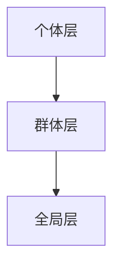

                 

群体智慧（ swarm intelligence）作为一种新兴的决策方法，正在逐渐改变着传统决策模型。在本文中，我们将探讨群体智慧的概念、原理及其在决策中的应用。

## 关键词

- 群体智慧
- 决策
- 人工社会
- 机器学习
- 分布式算法

## 摘要

本文旨在介绍群体智慧的概念及其在决策中的应用。通过对群体智慧的定义、原理及其与决策的联系进行深入探讨，我们希望能够为读者提供一个全面的理解。文章还将通过具体的算法和实例，展示群体智慧在实际决策中的强大应用潜力。

### 背景介绍

#### 群体智慧的起源

群体智慧这一概念起源于对自然界中昆虫群体的行为研究。例如，蚂蚁通过信息素进行路径优化，蜜蜂通过集体决策选择最优的觅食路径。这些群体行为表现出了一种超越个体智能的集体智能，被称为群体智慧。

#### 群体智慧与人工智能

随着人工智能技术的发展，群体智慧也逐渐被引入到人工智能领域。通过模拟自然界中的群体行为，人工智能系统能够在复杂环境中进行高效决策。群体智慧与人工智能的结合，为解决复杂问题提供了一种新的思路。

### 核心概念与联系

#### 定义

群体智慧是指由多个个体通过局部信息交互形成的整体智能。这些个体通常是简单的，但通过协作能够实现复杂的决策和任务执行。

#### 原理

群体智慧的核心原理是信息共享和协同进化。个体通过感知环境信息，将其传播给其他个体，从而形成一个整体信息网络。通过这个网络，个体能够共享资源、协调行动，实现整体的最优决策。

#### 架构

群体智慧的架构通常包括三个层次：个体层、群体层和全局层。个体层是群体智慧的基础，由简单个体组成；群体层负责个体之间的信息交互和协同；全局层则负责整体的决策和任务分配。



### 核心算法原理 & 具体操作步骤

#### 算法原理概述

群体智慧的核心算法是基于分布式计算和协同学习的。每个个体通过感知局部信息，使用简单的规则进行决策，并通过信息交互实现整体的最优行为。

#### 算法步骤详解

1. **初始化**：设置个体数量、环境参数和初始状态。
2. **感知与决策**：每个个体感知局部环境信息，根据预设规则进行决策。
3. **信息传播**：个体通过广播或链式传播方式，将决策信息传递给其他个体。
4. **协同进化**：个体根据接收到的信息调整自身行为，实现整体行为的优化。
5. **全局决策**：基于整体信息，进行全局决策和任务分配。

#### 算法优缺点

**优点**：

- **分布式计算**：不需要中央控制，适用于大规模分布式系统。
- **自适应性强**：能够快速适应环境变化，具有高度的鲁棒性。
- **高效性**：通过协同进化实现整体最优行为，具有高效性。

**缺点**：

- **局部优化**：个体只关注局部信息，可能无法实现全局最优。
- **通信开销**：信息传播需要消耗大量的通信资源。

#### 算法应用领域

群体智慧算法在多个领域都有广泛应用，如：

- **智能交通**：通过群体智慧优化交通流量，减少拥堵。
- **供应链管理**：通过群体智慧优化库存管理和物流调度。
- **社会计算**：通过群体智慧进行舆情分析和群体行为预测。

### 数学模型和公式 & 详细讲解 & 举例说明

#### 数学模型构建

群体智慧算法的数学模型通常包括以下几个部分：

- **个体状态模型**：描述个体在环境中的状态和行为。
- **信息传播模型**：描述个体之间的信息交互和传播。
- **协同进化模型**：描述个体行为的调整和整体行为的优化。

#### 公式推导过程

1. **个体状态模型**：$s_i = f(e_i, s_{i-1})$，其中 $s_i$ 为个体 $i$ 的状态，$e_i$ 为个体 $i$ 所处的环境，$s_{i-1}$ 为个体 $i$ 的上一个状态。
2. **信息传播模型**：$i_t = i_{t-1} + g_t(i_t - i_{t-1})$，其中 $i_t$ 为个体 $t$ 接收到的信息，$i_{t-1}$ 为个体 $t-1$ 接收到的信息，$g_t$ 为个体之间的信息传播系数。
3. **协同进化模型**：$s_{i,t+1} = s_{i,t} + \alpha(s_{i,t+1} - s_{i,t})$，其中 $s_{i,t+1}$ 为个体 $i$ 在 $t+1$ 时刻的状态，$s_{i,t}$ 为个体 $i$ 在 $t$ 时刻的状态，$\alpha$ 为个体行为的调整系数。

#### 案例分析与讲解

假设一个群体智慧算法应用于智能交通系统中，我们可以通过以下步骤进行案例分析：

1. **初始化**：设置交通网络中的车辆数量、道路状况和初始速度。
2. **感知与决策**：每个车辆根据周围车辆的速度和距离，使用预设的规则进行加速或减速。
3. **信息传播**：车辆通过广播将决策信息传递给其他车辆。
4. **协同进化**：车辆根据接收到的信息调整自身速度，实现整个交通网络的优化。
5. **全局决策**：系统根据整体信息，优化交通流量和道路使用。

通过上述步骤，我们可以实现交通网络的优化，减少拥堵和提高通行效率。

### 项目实践：代码实例和详细解释说明

#### 开发环境搭建

1. 安装Python环境。
2. 安装必要的外部库，如NumPy、Matplotlib等。

#### 源代码详细实现

```python
import numpy as np
import matplotlib.pyplot as plt

def update_vehicle_speed(v, delta_v):
    """更新车辆速度"""
    new_v = v + delta_v
    return new_v

def vehicle_behavior(v_i, v_j, g):
    """车辆行为函数"""
    delta_v = g * (v_j - v_i)
    return delta_v

def simulate_traffic_network(vehicles, g):
    """模拟交通网络"""
    t = 0
    while t < 100:
        for i in range(len(vehicles)):
            for j in range(i + 1, len(vehicles)):
                delta_v = vehicle_behavior(vehicles[i], vehicles[j], g)
                vehicles[i] = update_vehicle_speed(vehicles[i], delta_v)
                vehicles[j] = update_vehicle_speed(vehicles[j], -delta_v)
        t += 1

    return vehicles

# 初始化车辆速度
vehicles = np.array([10, 10, 10, 10, 10])
g = 0.1

# 模拟交通网络
simulated_vehicles = simulate_traffic_network(vehicles, g)

# 绘制结果
plt.plot(simulated_vehicles)
plt.xlabel('Vehicle Index')
plt.ylabel('Speed')
plt.title('Traffic Network Simulation')
plt.show()
```

#### 代码解读与分析

1. **车辆速度更新**：`update_vehicle_speed` 函数用于更新车辆的速度。
2. **车辆行为函数**：`vehicle_behavior` 函数用于计算车辆之间的速度差，并根据预设的规则计算加速或减速量。
3. **模拟交通网络**：`simulate_traffic_network` 函数用于模拟交通网络中的车辆行为，实现交通网络的协同进化。
4. **绘制结果**：使用Matplotlib绘制模拟结果，展示车辆速度的变化。

通过上述代码实例，我们可以实现一个简单的交通网络模拟，展示群体智慧在交通管理中的应用。

### 实际应用场景

群体智慧在多个领域都有广泛的应用，如：

#### 智能交通

通过群体智慧优化交通流量，实现交通拥堵的缓解。

#### 供应链管理

通过群体智慧优化库存管理和物流调度，提高供应链效率。

#### 社会计算

通过群体智慧进行舆情分析和群体行为预测，为决策提供数据支持。

### 未来应用展望

随着人工智能技术的不断发展，群体智慧在决策领域的应用前景将更加广阔。未来，我们可以期待群体智慧在更多领域发挥重要作用，为人类社会带来更多的创新和进步。

### 工具和资源推荐

#### 学习资源推荐

1. 《群体智能：一种全新的科学方法》
2. 《人工社会：群体行为的建模与模拟》

#### 开发工具推荐

1. Python
2. Matplotlib

#### 相关论文推荐

1. "Swarm Intelligence: A New Approach to Distributed Decision-Making"
2. "Artificial Societies: Simulating Social Behavior with Agents"

### 总结：未来发展趋势与挑战

群体智慧作为一种新兴的决策方法，具有广泛的应用前景。未来，随着人工智能技术的不断进步，群体智慧将在更多领域发挥重要作用。然而，我们也需要面对一些挑战，如局部优化问题、通信开销等。通过不断的研究和探索，我们有信心解决这些挑战，推动群体智慧在决策领域的进一步发展。

### 附录：常见问题与解答

1. **什么是群体智慧？**
   群体智慧是指由多个个体通过局部信息交互形成的整体智能。这些个体通常是简单的，但通过协作能够实现复杂的决策和任务执行。

2. **群体智慧有哪些优点？**
   群体智慧具有分布式计算、自适应性强和高效性等优点。

3. **群体智慧在哪些领域有应用？**
   群体智慧在智能交通、供应链管理、社会计算等领域有广泛应用。

4. **如何实现群体智慧？**
   实现群体智慧的关键在于个体之间的信息交互和协同进化。常用的方法包括分布式计算、协同学习和信息传播等。

### 作者署名

作者：禅与计算机程序设计艺术 / Zen and the Art of Computer Programming
```

