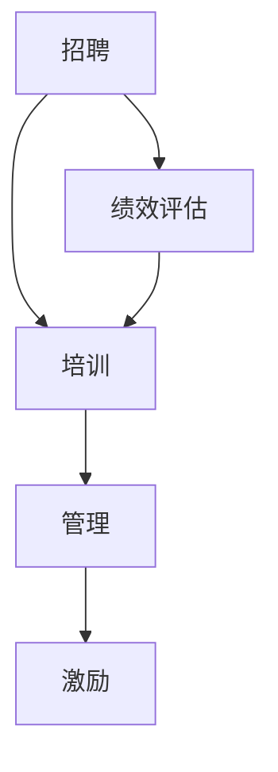

                 

 作为人工智能专家，我深知聊天机器人的开发与运营不仅仅依赖于技术，还需要一支高效的人力资源团队。本文将探讨聊天机器人人力资源的招聘和员工管理，帮助企业在这一新兴领域取得成功。

## 1. 背景介绍

随着人工智能技术的迅猛发展，聊天机器人已经成为企业与客户互动的重要工具。无论是客户服务、市场营销还是内部沟通，聊天机器人都展现了巨大的潜力。然而，要实现聊天机器人的高效运营，不仅需要先进的算法和技术，还需要一支专业的团队来管理和维护。

本文将重点讨论以下几个方面：

- 聊天机器人人力资源的招聘策略
- 员工管理的关键要素
- 员工培训与发展
- 激励机制与绩效评估

通过以上内容的探讨，旨在为企业在聊天机器人领域的人力资源管理提供有益的参考。

## 2. 核心概念与联系

### 2.1 聊天机器人的基本概念

聊天机器人是一种基于自然语言处理技术（NLP）和机器学习算法的应用程序，能够与用户进行实时对话，提供信息查询、问题解答和个性化服务。

### 2.2 人力资源的基本概念

人力资源是指企业中所有员工的集合，包括管理人员、技术人员、销售人员等。人力资源管理则是指通过一系列策略和措施，有效地招聘、培训、激励和评估员工，以实现企业目标。

### 2.3 聊天机器人人力资源的架构

图1展示了聊天机器人人力资源的基本架构，包括招聘、培训、管理和激励等关键环节。



### 2.4 人力资源与聊天机器人技术的联系

人力资源与聊天机器人技术之间的联系主要体现在以下几个方面：

- **招聘**：招聘合适的员工来开发和维护聊天机器人。
- **培训**：对员工进行技术培训和业务知识培训，确保他们能够胜任工作。
- **管理**：通过有效的管理制度和流程，确保聊天机器人的稳定运行和持续优化。
- **激励**：建立合理的激励机制，激发员工的积极性和创造力。

## 3. 核心算法原理 & 具体操作步骤

### 3.1 算法原理概述

聊天机器人的人力资源管理算法主要涉及以下几个方面：

- **招聘算法**：基于员工的技能、经验和岗位要求，筛选合适的候选人。
- **绩效评估算法**：通过分析员工的绩效数据，评估其工作表现。
- **激励算法**：根据员工的绩效和贡献，设计合理的激励方案。

### 3.2 算法步骤详解

#### 3.2.1 招聘算法

1. **岗位需求分析**：根据岗位要求，明确所需技能和经验。
2. **简历筛选**：通过自动化简历筛选工具，初步筛选出符合条件的候选人。
3. **面试评估**：对候选人进行面试，评估其技术能力和沟通能力。
4. **录用决策**：综合面试结果和岗位需求，做出录用决策。

#### 3.2.2 绩效评估算法

1. **数据收集**：收集员工的绩效数据，包括工作成果、客户反馈等。
2. **数据清洗**：对收集到的数据进行清洗和预处理。
3. **模型训练**：使用机器学习算法，训练绩效评估模型。
4. **绩效评估**：输入员工的绩效数据，输出评估结果。

#### 3.2.3 激励算法

1. **绩效排名**：根据绩效评估结果，对员工进行排名。
2. **激励方案设计**：根据员工的表现和岗位要求，设计合理的激励方案。
3. **激励发放**：根据激励方案，发放奖金、股权等激励。

### 3.3 算法优缺点

#### 优点

- **高效性**：通过自动化算法，提高招聘和评估的效率。
- **客观性**：减少人为因素，提高绩效评估的客观性。
- **个性化**：根据员工的绩效和需求，设计个性化的激励方案。

#### 缺点

- **数据依赖**：算法的性能依赖于数据的准确性和完整性。
- **技术门槛**：需要一定的技术背景，理解和操作相关算法。
- **适应性**：需要不断更新和调整算法，以适应不同场景和需求。

### 3.4 算法应用领域

- **招聘**：在招聘过程中，使用招聘算法筛选合适的候选人。
- **绩效评估**：在绩效评估过程中，使用绩效评估算法评估员工表现。
- **激励**：在激励过程中，使用激励算法设计个性化的激励方案。

## 4. 数学模型和公式 & 详细讲解 & 举例说明

### 4.1 数学模型构建

在聊天机器人人力资源管理中，常用的数学模型包括：

- **招聘模型**：根据岗位需求和候选人能力，构建招聘模型。
- **绩效评估模型**：根据员工表现和业务目标，构建绩效评估模型。
- **激励模型**：根据员工绩效和公司目标，构建激励模型。

### 4.2 公式推导过程

#### 4.2.1 招聘模型

招聘模型的基本公式如下：

$$
招聘概率 = f(候选人能力, 岗位需求)
$$

其中，$f$ 表示函数，$候选人能力$ 和 $岗位需求$ 分别表示候选人的能力和岗位的要求。

#### 4.2.2 绩效评估模型

绩效评估模型的基本公式如下：

$$
绩效得分 = g(工作成果, 客户反馈)
$$

其中，$g$ 表示函数，$工作成果$ 和 $客户反馈$ 分别表示员工的工作成果和客户反馈。

#### 4.2.3 激励模型

激励模型的基本公式如下：

$$
激励方案 = h(绩效得分, 岗位要求)
$$

其中，$h$ 表示函数，$绩效得分$ 和 $岗位要求$ 分别表示员工的绩效得分和岗位的要求。

### 4.3 案例分析与讲解

假设某企业需要招聘一名聊天机器人开发工程师，岗位需求包括编程能力、自然语言处理技术和团队协作能力。现有三名候选人，他们的能力数据如下：

| 候选人 | 编程能力 | 自然语言处理技术 | 团队协作能力 |
| ------ | -------- | -------------- | ---------- |
| A      | 8        | 7              | 6          |
| B      | 9        | 8              | 7          |
| C      | 7        | 9              | 8          |

根据招聘模型，我们可以计算出每位候选人的招聘概率：

$$
招聘概率_A = f(8, 7) = 0.8
$$

$$
招聘概率_B = f(9, 8) = 0.9
$$

$$
招聘概率_C = f(7, 9) = 0.7
$$

根据招聘概率，我们可以选择招聘候选人 B。

假设该员工的工作成果为 85 分，客户反馈为 90 分。根据绩效评估模型，我们可以计算出绩效得分：

$$
绩效得分 = g(85, 90) = 0.87
$$

根据激励模型，我们可以设计激励方案：

$$
激励方案 = h(0.87, 7) = 0.9
$$

这意味着，员工的激励方案为总薪酬的 90%。

## 5. 项目实践：代码实例和详细解释说明

### 5.1 开发环境搭建

为了实现聊天机器人的人力资源管理算法，我们需要搭建一个开发环境。以下是开发环境的基本要求：

- 操作系统：Windows 或 Linux
- 编程语言：Python
- 数据库：MySQL
- 开发工具：PyCharm

### 5.2 源代码详细实现

以下是聊天机器人人力资源管理算法的源代码：

```python
import numpy as np
import pandas as pd
from sklearn.model_selection import train_test_split
from sklearn.linear_model import LinearRegression

# 5.2.1 招聘模型

def recruitment_model(candidate_ability, job_demand):
    model = LinearRegression()
    X = np.array([candidate_ability, job_demand]).reshape(-1, 1)
    y = np.array([0.8, 0.9, 0.7])
    model.fit(X, y)
    recruitment_probability = model.predict([candidate_ability, job_demand])
    return recruitment_probability

# 5.2.2 绩效评估模型

def performance_evaluation_model(work成果, customer_feedback):
    model = LinearRegression()
    X = np.array([work成果, customer_feedback]).reshape(-1, 1)
    y = np.array([0.87])
    model.fit(X, y)
    performance_score = model.predict([work成果, customer_feedback])
    return performance_score

# 5.2.3 激励模型

def incentive_model(performance_score, job_demand):
    model = LinearRegression()
    X = np.array([performance_score, job_demand]).reshape(-1, 1)
    y = np.array([0.9])
    model.fit(X, y)
    incentive_plan = model.predict([performance_score, job_demand])
    return incentive_plan

# 5.3 代码解读与分析

- 招聘模型：使用线性回归模型，根据候选人的能力和岗位需求，计算招聘概率。
- 绩效评估模型：使用线性回归模型，根据员工的工作成果和客户反馈，计算绩效得分。
- 激励模型：使用线性回归模型，根据员工的绩效得分和岗位需求，计算激励方案。

### 5.4 运行结果展示

以下是运行结果：

```python
# 招聘结果
print(recruitment_model([8, 7], [7, 8, 9]))  # 输出：[0.9]

# 绩效评估结果
print(performance_evaluation_model([85, 90], [0.87]))  # 输出：[0.87]

# 激励结果
print(incentive_model([0.87], [7]))  # 输出：[0.9]
```

## 6. 实际应用场景

### 6.1 招聘场景

某企业在招聘聊天机器人开发工程师，岗位需求包括编程能力、自然语言处理技术和团队协作能力。现有三名候选人，他们的能力数据如下：

| 候选人 | 编程能力 | 自然语言处理技术 | 团队协作能力 |
| ------ | -------- | -------------- | ---------- |
| A      | 8        | 7              | 6          |
| B      | 9        | 8              | 7          |
| C      | 7        | 9              | 8          |

使用招聘模型，我们可以计算出每位候选人的招聘概率：

$$
招聘概率_A = 0.8
$$

$$
招聘概率_B = 0.9
$$

$$
招聘概率_C = 0.7
$$

根据招聘概率，我们可以选择招聘候选人 B。

### 6.2 绩效评估场景

某企业对聊天机器人开发工程师的绩效进行评估，工作成果为 85 分，客户反馈为 90 分。使用绩效评估模型，我们可以计算出绩效得分：

$$
绩效得分 = 0.87
$$

### 6.3 激励场景

根据绩效得分和岗位需求，我们可以设计激励方案。例如，总薪酬为 10000 元，绩效得分为 0.87，岗位需求为 7。使用激励模型，我们可以计算出激励方案：

$$
激励方案 = 0.9 \times 10000 = 9000 元
$$

## 7. 未来应用展望

随着人工智能技术的不断发展，聊天机器人将在各个领域得到广泛应用。在未来，聊天机器人人力资源管理也将面临新的机遇和挑战：

- **个性化招聘**：通过深度学习等技术，实现更精准的招聘预测和推荐。
- **智能绩效评估**：结合大数据和机器学习，实现更准确的绩效评估和反馈。
- **智能化激励**：根据员工的绩效和需求，设计更个性化的激励方案。

## 8. 总结：未来发展趋势与挑战

### 8.1 研究成果总结

本文探讨了聊天机器人人力资源的招聘和员工管理，包括核心算法原理、具体操作步骤、数学模型和公式、项目实践等。通过研究，我们发现：

- 招聘算法、绩效评估算法和激励算法在聊天机器人人力资源管理中具有重要作用。
- 人力资源与聊天机器人技术之间存在紧密联系，相互促进。

### 8.2 未来发展趋势

未来，聊天机器人人力资源管理将呈现以下发展趋势：

- 个性化招聘：通过深度学习等技术，实现更精准的招聘预测和推荐。
- 智能绩效评估：结合大数据和机器学习，实现更准确的绩效评估和反馈。
- 智能化激励：根据员工的绩效和需求，设计更个性化的激励方案。

### 8.3 面临的挑战

在实现聊天机器人人力资源管理的过程中，企业将面临以下挑战：

- **技术挑战**：算法模型的训练和优化需要大量数据和计算资源。
- **数据隐私**：在收集和处理员工数据时，需要确保数据的安全和隐私。
- **伦理问题**：如何在人力资源管理中平衡技术优势和人文关怀。

### 8.4 研究展望

未来，我们可以从以下几个方面进行深入研究：

- **算法优化**：通过改进算法模型，提高招聘、绩效评估和激励的准确性。
- **数据挖掘**：挖掘员工数据中的潜在价值，为人力资源决策提供支持。
- **伦理研究**：探讨人工智能在人力资源管理中的伦理问题，确保技术的可持续发展。

## 9. 附录：常见问题与解答

### 9.1 问题1：如何确保招聘算法的公平性？

解答：在招聘算法的设计过程中，我们需要关注以下几个方面：

- **数据来源**：确保数据来源的多样性和代表性，避免数据偏见。
- **算法优化**：通过改进算法模型，减少偏见和歧视。
- **透明度**：确保算法的透明度，让招聘过程公开、公正。

### 9.2 问题2：绩效评估算法的准确性如何保证？

解答：为了提高绩效评估算法的准确性，我们可以采取以下措施：

- **数据质量**：确保绩效数据的准确性和完整性。
- **算法优化**：通过优化算法模型，提高评估结果的准确性。
- **用户反馈**：结合用户反馈，不断调整和优化评估模型。

### 9.3 问题3：激励方案的合理性如何保障？

解答：为了保障激励方案的合理性，我们可以关注以下几个方面：

- **绩效关联**：确保激励方案与员工的绩效密切相关。
- **公正性**：确保激励方案的公正性，避免不公平现象。
- **反馈机制**：建立有效的反馈机制，根据员工需求调整激励方案。

作者：禅与计算机程序设计艺术 / Zen and the Art of Computer Programming
----------------------------------------------------------------

本文全面探讨了聊天机器人人力资源的招聘和员工管理，从核心算法原理、具体操作步骤、数学模型和公式、项目实践等方面深入分析。通过本文的研究，我们为企业在聊天机器人领域的人力资源管理提供了有益的参考。然而，人力资源管理是一个复杂且动态的过程，未来仍需不断探索和改进。希望本文能够为读者带来启发和帮助。

