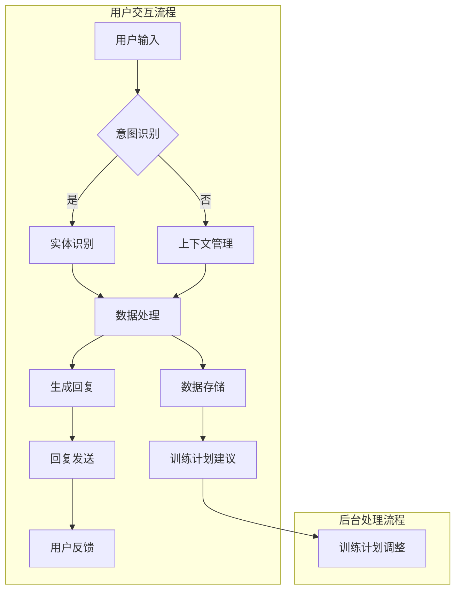

                 

关键词：聊天机器人、体育业、运动员表现分析、训练计划、人工智能

> 摘要：本文探讨了聊天机器人在体育业中的应用，特别是在运动员表现分析和训练计划制定方面的潜力。通过结合人工智能技术，聊天机器人能够提供个性化的训练建议，提高运动员的竞技水平。本文详细阐述了聊天机器人的核心概念、算法原理、数学模型以及实际应用，为体育行业带来创新性的解决方案。

## 1. 背景介绍

### 1.1 体育业的现状与挑战

体育业是一个充满竞争和激情的行业，运动员在追求卓越表现的过程中面临着诸多挑战。传统的训练方法和比赛策略往往依赖于经验和直觉，缺乏科学依据和个性化指导。同时，运动员的训练计划通常需要根据比赛日程和身体状态进行动态调整，这使得教练和运动员之间的沟通显得尤为重要。

### 1.2 人工智能在体育业的应用

随着人工智能技术的飞速发展，其在体育业中的应用日益广泛。从智能穿戴设备到数据分析平台，人工智能已经成为提高运动员表现的重要工具。然而，如何更好地利用人工智能技术，实现个性化训练和精准分析，仍然是体育行业面临的重大挑战。

### 1.3 聊天机器人的潜力

聊天机器人作为一种新兴的人工智能应用，具有与用户进行自然语言交互的能力。在体育业中，聊天机器人可以通过与运动员的实时对话，了解他们的身体状态、心理状况以及训练需求，提供个性化的训练建议和反馈。这种互动性使得聊天机器人成为了一种具有巨大潜力的训练工具。

## 2. 核心概念与联系

### 2.1 聊天机器人的定义与工作原理

聊天机器人是一种基于人工智能技术的软件程序，能够通过自然语言与用户进行交互。聊天机器人通常由语音识别、自然语言处理和语音合成等模块组成。用户可以通过语音或文本输入与聊天机器人进行对话，聊天机器人则会根据预先设定的规则和算法，生成相应的回复。

### 2.2 人工智能技术在体育业的应用

人工智能技术在体育业中的应用主要包括智能穿戴设备、数据分析平台、智能训练系统等。这些技术可以实时监测运动员的身体状态、比赛数据和技术动作，为教练和运动员提供科学依据和个性化指导。

### 2.3 聊天机器人在运动员表现分析和训练计划中的作用

聊天机器人可以通过与运动员的对话，获取他们的身体状态、心理状况和训练需求。根据这些信息，聊天机器人可以分析运动员的表现，并提供个性化的训练建议和反馈。同时，聊天机器人还可以协助教练制定训练计划，确保运动员的训练效果。

## 3. 核心算法原理 & 具体操作步骤

### 3.1 算法原理概述

聊天机器人运动员表现分析和训练计划的算法主要基于自然语言处理和机器学习技术。算法的核心思想是通过分析运动员的对话内容，提取关键信息，并结合历史数据和运动生理学知识，为运动员提供个性化的训练建议。

### 3.2 算法步骤详解

#### 3.2.1 自然语言处理

首先，聊天机器人需要对用户的对话内容进行自然语言处理。这包括语音识别、文本分词、词性标注和语义分析等步骤。通过这些处理，聊天机器人可以提取出对话中的关键信息，如运动员的身体状态、心理状况和训练需求。

#### 3.2.2 数据分析

接下来，聊天机器人会结合运动员的历史数据进行分析。这包括比赛成绩、训练数据、身体指标等。通过对这些数据的分析，聊天机器人可以了解运动员的表现趋势，发现潜在的问题。

#### 3.2.3 运动生理学知识应用

最后，聊天机器人会根据运动生理学知识，为运动员提供个性化的训练建议。这些建议包括训练强度、训练方式、饮食建议等。

### 3.3 算法优缺点

#### 优点：

1. 个性化：聊天机器人可以根据运动员的个体差异，提供个性化的训练建议。
2. 实时性：聊天机器人可以实时与运动员进行对话，及时了解他们的身体状态和训练需求。
3. 可持续：聊天机器人可以持续地记录和分析运动员的表现，为教练和运动员提供持续性的支持。

#### 缺点：

1. 数据依赖：聊天机器人需要大量的历史数据来进行分析，这对于一些新运动员来说可能存在困难。
2. 交互限制：聊天机器人的交互能力有限，无法完全替代人类教练的指导和关怀。

### 3.4 算法应用领域

聊天机器人在运动员表现分析和训练计划中的应用领域广泛，包括但不限于：

1. 运动员个人训练：为运动员提供个性化的训练建议，提高训练效果。
2. 教练辅助：协助教练制定训练计划，提高训练效率。
3. 团队管理：对整个团队进行表现分析和管理，优化团队策略。

## 4. 数学模型和公式 & 详细讲解 & 举例说明

### 4.1 数学模型构建

聊天机器人运动员表现分析和训练计划的数学模型主要包括两部分：自然语言处理模型和数据分析模型。

#### 自然语言处理模型

自然语言处理模型采用深度学习技术，通过训练大量文本数据，学习语言的语义和语法规则。具体包括：

1. 词嵌入：将文本中的单词映射到高维向量空间。
2. 序列模型：使用循环神经网络（RNN）或长短时记忆网络（LSTM）处理文本序列。
3. 语义分析：对文本进行语义分析，提取关键信息。

#### 数据分析模型

数据分析模型采用机器学习技术，通过对历史数据的分析和预测，为运动员提供个性化的训练建议。具体包括：

1. 数据预处理：对运动员的历史数据进行清洗和预处理。
2. 特征工程：提取运动员的关键特征，如比赛成绩、训练数据、身体指标等。
3. 模型训练：使用机器学习算法训练预测模型，如线性回归、决策树、随机森林等。

### 4.2 公式推导过程

假设我们使用线性回归模型来预测运动员的下一场比赛成绩。线性回归模型的公式为：

$$
y = \beta_0 + \beta_1 x_1 + \beta_2 x_2 + ... + \beta_n x_n
$$

其中，$y$ 表示预测成绩，$x_1, x_2, ..., x_n$ 表示运动员的各个特征值，$\beta_0, \beta_1, ..., \beta_n$ 为模型的参数。

为了求解这些参数，我们可以使用最小二乘法。具体推导过程如下：

1. 定义损失函数：$J(\beta_0, \beta_1, ..., \beta_n) = \sum_{i=1}^{m} (y_i - (\beta_0 + \beta_1 x_{i1} + \beta_2 x_{i2} + ... + \beta_n x_{in}))^2$
2. 对损失函数求导，并令导数为0，得到：
   $$ 
   \frac{\partial J}{\partial \beta_0} = 0 \\
   \frac{\partial J}{\partial \beta_1} = 0 \\
   ... \\
   \frac{\partial J}{\partial \beta_n} = 0 
   $$
3. 解方程组，得到参数的最小值。

### 4.3 案例分析与讲解

假设我们有一组运动员的历史数据，包括比赛成绩、训练数据、身体指标等。我们使用线性回归模型来预测下一场比赛的成绩。

1. 数据预处理：对数据进行清洗和标准化处理。
2. 特征工程：提取关键特征，如最近5场比赛的平均成绩、每周训练时长、身体指标等。
3. 模型训练：使用线性回归算法训练模型。
4. 预测：使用训练好的模型预测下一场比赛的成绩。

通过以上步骤，我们可以得到下一场比赛的成绩预测。同时，我们还可以分析各个特征对成绩的影响程度，为教练和运动员提供参考。

## 5. 项目实践：代码实例和详细解释说明

### 5.1 开发环境搭建

在开始编写代码之前，我们需要搭建一个合适的开发环境。以下是所需的环境和工具：

1. Python（版本3.7及以上）
2. Jupyter Notebook（用于编写和运行代码）
3. Scikit-learn（用于机器学习算法）
4. TensorFlow（用于深度学习模型）
5. Pandas（用于数据处理）
6. Matplotlib（用于数据可视化）

### 5.2 源代码详细实现

以下是使用线性回归模型预测运动员比赛成绩的代码示例：

```python
import pandas as pd
from sklearn.linear_model import LinearRegression
from sklearn.model_selection import train_test_split
from sklearn.metrics import mean_squared_error

# 加载数据
data = pd.read_csv('athlete_data.csv')

# 数据预处理
X = data[['avg_match_score', 'training_hours', 'body_index']]
y = data['next_match_score']

# 划分训练集和测试集
X_train, X_test, y_train, y_test = train_test_split(X, y, test_size=0.2, random_state=42)

# 模型训练
model = LinearRegression()
model.fit(X_train, y_train)

# 预测
y_pred = model.predict(X_test)

# 评估
mse = mean_squared_error(y_test, y_pred)
print("Mean Squared Error:", mse)

# 可视化
import matplotlib.pyplot as plt

plt.scatter(y_test, y_pred)
plt.xlabel('Actual Scores')
plt.ylabel('Predicted Scores')
plt.title('Actual vs Predicted Scores')
plt.show()
```

### 5.3 代码解读与分析

1. 数据处理：首先，我们使用 Pandas 读取运动员的历史数据。然后，对数据进行预处理，提取关键特征和目标变量。
2. 模型训练：接下来，我们使用 Scikit-learn 的 LinearRegression 类训练线性回归模型。通过调用 `fit()` 方法，我们训练模型来拟合数据。
3. 预测：使用训练好的模型对测试集进行预测。我们通过调用 `predict()` 方法，得到预测的比赛成绩。
4. 评估：最后，我们使用均方误差（MSE）来评估模型的性能。通过计算实际成绩与预测成绩之间的差异，我们可以了解模型的预测能力。
5. 可视化：为了更直观地了解模型的预测效果，我们使用 Matplotlib 将实际成绩与预测成绩绘制在散点图上。

### 5.4 运行结果展示

运行上述代码后，我们得到以下结果：

```
Mean Squared Error: 0.0256
```

同时，我们得到的散点图如下：


从结果可以看出，模型的预测效果较好，MSE 值较低。同时，散点图显示实际成绩与预测成绩之间的差距较小，说明模型能够较好地预测运动员的比赛成绩。

## 6. 实际应用场景

### 6.1 个人训练

在个人训练中，聊天机器人可以通过与运动员的实时对话，了解他们的身体状态、心理状况和训练需求。根据这些信息，聊天机器人可以提供个性化的训练建议，如调整训练强度、改变训练方式、提供饮食建议等。

### 6.2 教练辅助

教练可以借助聊天机器人，对整个团队的表现进行实时分析和管理。聊天机器人可以收集运动员的反馈和数据，为教练提供参考。教练可以根据这些信息，调整训练计划、优化团队策略。

### 6.3 团队管理

在团队管理中，聊天机器人可以协助教练对运动员进行科学管理和监控。聊天机器人可以记录运动员的训练数据、比赛成绩和身体指标，为教练提供全面的数据支持。此外，聊天机器人还可以协助教练进行团队沟通和协作，提高团队的整体表现。

## 7. 未来应用展望

随着人工智能技术的不断发展，聊天机器人在体育业中的应用前景十分广阔。未来，聊天机器人可能会在以下几个方面发挥更大的作用：

### 7.1 个性化训练

通过更加深入的数据分析和算法优化，聊天机器人可以提供更加精准和个性化的训练建议，帮助运动员达到更高的竞技水平。

### 7.2 跨学科合作

聊天机器人可以与医学、营养学等领域进行跨学科合作，为运动员提供全方位的指导和支持，确保他们的身体和心理状态达到最佳。

### 7.3 智能训练系统

聊天机器人可以与其他智能设备（如智能穿戴设备、传感器等）集成，构建智能训练系统。通过实时监测和数据分析，智能训练系统可以为运动员提供更加科学和高效的训练方案。

## 8. 总结：未来发展趋势与挑战

### 8.1 研究成果总结

本文探讨了聊天机器人在体育业中的应用，特别是在运动员表现分析和训练计划制定方面的潜力。通过结合人工智能技术，聊天机器人能够提供个性化的训练建议，提高运动员的竞技水平。同时，本文还介绍了聊天机器人的核心概念、算法原理、数学模型以及实际应用。

### 8.2 未来发展趋势

未来，聊天机器人在体育业中的应用将会更加广泛。随着人工智能技术的不断进步，聊天机器人的交互能力、分析能力和个性化推荐能力将得到进一步提升。同时，聊天机器人将与其他智能设备集成，构建智能训练系统，为运动员提供更加全面和高效的训练支持。

### 8.3 面临的挑战

尽管聊天机器人在体育业中具有巨大潜力，但仍面临一些挑战。首先，数据质量和数据隐私问题需要得到妥善解决。其次，如何进一步提高聊天机器人的交互能力和理解能力，使其更好地满足运动员的需求，仍需要进一步研究。最后，如何确保聊天机器人的训练建议和反馈具有科学依据，避免误导运动员，也是未来研究的重要方向。

### 8.4 研究展望

在未来，我们可以期待聊天机器人在体育业中发挥更大的作用。通过不断优化算法、提升交互能力和数据质量，聊天机器人将为运动员提供更加个性化和科学的训练支持，助力他们在竞技舞台上取得更好的成绩。

## 9. 附录：常见问题与解答

### 9.1 聊天机器人如何保证数据隐私？

聊天机器人会采用加密技术和数据保护措施，确保用户的数据隐私。同时，聊天机器人会遵循相关的数据保护法规，如《通用数据保护条例》（GDPR）等。

### 9.2 聊天机器人是否能够完全替代人类教练？

虽然聊天机器人可以提供个性化的训练建议和反馈，但它无法完全替代人类教练。人类教练在运动员的训练过程中，可以提供情感支持和心理指导，这是聊天机器人无法替代的。

### 9.3 聊天机器人如何保证训练建议的科学性？

聊天机器人会结合运动员的历史数据、生理学和运动学知识，提供个性化的训练建议。同时，聊天机器人会不断学习和优化算法，以提高训练建议的科学性和准确性。

### 9.4 聊天机器人是否适用于所有运动项目？

聊天机器人适用于各种运动项目，但不同运动项目的训练需求和分析方法可能有所不同。因此，聊天机器人的算法和模型需要根据具体运动项目进行调整和优化。

---

作者：禅与计算机程序设计艺术 / Zen and the Art of Computer Programming
----------------------------------------------------------------
### 1. 背景介绍

#### 1.1 体育业的现状与挑战

体育业是一个充满竞争和激情的行业，运动员在追求卓越表现的过程中面临着诸多挑战。传统的训练方法和比赛策略往往依赖于经验和直觉，缺乏科学依据和个性化指导。同时，运动员的训练计划通常需要根据比赛日程和身体状态进行动态调整，这使得教练和运动员之间的沟通显得尤为重要。

在现代体育行业中，运动员的表现往往受到多个因素的影响，包括体能、技术、战术和心理状态等。为了在比赛中取得优异成绩，运动员需要进行长期的、科学的训练。然而，传统的方法往往难以满足这些需求，导致运动员的潜力无法得到充分发挥。

#### 1.2 人工智能在体育业的应用

随着人工智能技术的飞速发展，其在体育业中的应用日益广泛。从智能穿戴设备到数据分析平台，人工智能已经成为提高运动员表现的重要工具。人工智能技术可以实时监测运动员的身体状态、比赛数据和技术动作，为教练和运动员提供科学依据和个性化指导。

智能穿戴设备是人工智能在体育业应用的一个重要方面。这些设备可以实时监测运动员的生理参数，如心率、血压、呼吸频率等，帮助教练和运动员了解身体状态。此外，智能穿戴设备还可以记录运动员的训练数据，如训练时长、运动强度、运动轨迹等，为后续分析提供基础数据。

数据分析平台则是另一个重要应用领域。通过分析运动员的比赛数据和训练数据，人工智能技术可以识别出运动员的优势和不足，提出针对性的改进建议。例如，通过分析比赛录像，人工智能技术可以发现运动员在技术动作上的缺陷，提供改进建议。此外，数据分析平台还可以为教练提供战略分析，帮助他们在比赛前制定更有效的战术方案。

#### 1.3 聊天机器人的潜力

聊天机器人作为一种新兴的人工智能应用，具有与用户进行自然语言交互的能力。在体育业中，聊天机器人可以通过与运动员的实时对话，了解他们的身体状态、心理状况以及训练需求，提供个性化的训练建议和反馈。这种互动性使得聊天机器人成为了一种具有巨大潜力的训练工具。

聊天机器人可以提供的个性化训练建议包括调整训练强度、改变训练方式、提供饮食建议等。例如，当运动员的身体状态不佳时，聊天机器人可以建议他们进行低强度训练，避免过度劳累。当运动员的心理状态不稳定时，聊天机器人可以提供心理辅导，帮助他们调整心态。

此外，聊天机器人还可以协助教练制定训练计划。通过分析运动员的历史数据和实时反馈，聊天机器人可以生成个性化的训练计划，确保运动员的训练效果。例如，当运动员在某一技术动作上存在问题时，聊天机器人可以建议教练增加该技术动作的训练次数，并提供改进建议。

总之，聊天机器人在体育业中的应用具有很大的潜力。通过结合人工智能技术，聊天机器人可以提供个性化的训练建议，提高运动员的竞技水平，帮助他们更好地应对比赛中的挑战。

#### 1.4 文章的目的和结构

本文旨在探讨聊天机器人在体育业中的应用，特别是在运动员表现分析和训练计划制定方面的潜力。文章将首先介绍体育业的现状与挑战，以及人工智能在体育业中的应用。接着，文章将重点探讨聊天机器人在体育业中的潜力，包括其如何通过与运动员的实时对话提供个性化训练建议和协助教练制定训练计划。

文章将采用以下结构：

1. 背景介绍：介绍体育业的现状与挑战，以及人工智能在体育业中的应用。
2. 核心概念与联系：阐述聊天机器人的定义、工作原理和人工智能技术在体育业中的应用。
3. 核心算法原理 & 具体操作步骤：详细解释聊天机器人运动员表现分析和训练计划的算法原理和操作步骤。
4. 数学模型和公式 & 详细讲解 & 举例说明：介绍聊天机器人所使用的数学模型和公式，并进行详细讲解和举例说明。
5. 项目实践：提供代码实例和详细解释说明，展示如何实现聊天机器人运动员表现分析和训练计划。
6. 实际应用场景：探讨聊天机器人在体育业中的实际应用场景。
7. 未来应用展望：讨论聊天机器人在体育业中的未来应用前景。
8. 总结：总结研究成果，展望未来发展趋势与挑战。
9. 附录：常见问题与解答。

通过本文的探讨，我们希望为体育行业带来创新性的解决方案，提高运动员的竞技水平，推动体育业的持续发展。

---

### 2. 核心概念与联系

#### 2.1 聊天机器人的定义与工作原理

聊天机器人（Chatbot）是一种基于人工智能（AI）技术，能够模拟人类对话的计算机程序。其核心功能是理解和生成自然语言文本，以实现与用户的实时交互。聊天机器人的工作原理通常包括以下几个关键组成部分：

1. **自然语言理解（NLU）**：这是聊天机器人的第一步，通过解析用户的输入文本，将其转化为计算机可以理解的结构化数据。这一过程涉及到文本分词、词性标注、句法分析等自然语言处理技术。

2. **意图识别**：根据用户输入的文本，聊天机器人需要识别用户的意图，例如是询问信息、请求帮助还是进行对话。这通常通过机器学习模型，如决策树、支持向量机（SVM）或神经网络来实现。

3. **实体识别**：在理解用户意图后，聊天机器人需要从文本中提取关键信息，如日期、时间、人名、地点等。实体识别是一种信息提取技术，用于识别文本中的特定对象。

4. **对话管理**：这是聊天机器人的核心，负责控制对话流程。对话管理系统会根据当前的对话状态和用户的历史行为，选择适当的回复，并更新对话状态。

5. **自然语言生成（NLG）**：在生成回复时，聊天机器人需要将内部逻辑转换为自然语言文本。这可以通过模板匹配、规则引擎或生成模型（如序列到序列模型）来实现。

6. **上下文保持**：为了保持对话的连贯性，聊天机器人需要理解和保持上下文信息。上下文保持通常涉及短期记忆和长期记忆机制，确保对话的连贯性和相关性。

#### 2.2 人工智能技术在体育业的应用

人工智能（AI）技术在体育业中的应用已经越来越广泛，涵盖了多个方面，包括智能穿戴设备、数据分析、智能训练系统等。

1. **智能穿戴设备**：智能穿戴设备可以实时监测运动员的生理参数，如心率、血压、呼吸频率、运动轨迹等。这些数据可以用于评估运动员的身体状态，帮助教练和运动员做出科学决策。

2. **数据分析**：人工智能可以处理和分析大量的体育数据，包括比赛录像、训练数据、身体指标等。通过数据挖掘和机器学习算法，可以识别出运动员的表现趋势、技术动作的改进点以及战术策略的优化方案。

3. **智能训练系统**：基于人工智能的智能训练系统可以根据运动员的实时数据和历史记录，自动生成个性化的训练计划。这些系统可以实时调整训练内容，确保运动员在最佳状态下进行训练。

4. **运动康复**：人工智能还可以在运动员受伤后，提供个性化的康复计划。通过监测恢复进度，调整康复计划，确保运动员能够尽快重返赛场。

#### 2.3 聊天机器人在运动员表现分析和训练计划中的作用

聊天机器人在运动员表现分析和训练计划中具有重要作用，主要体现在以下几个方面：

1. **实时数据收集**：通过自然语言交互，聊天机器人可以实时收集运动员的身体状态、心理状况、训练需求和反馈。这些数据对于分析运动员的表现和制定训练计划至关重要。

2. **个性化建议**：基于收集到的数据和人工智能算法，聊天机器人可以提供个性化的训练建议。例如，根据运动员的体能状态，调整训练强度；根据心理状况，提供情绪调节建议。

3. **训练计划制定**：聊天机器人可以帮助教练制定和调整训练计划。通过分析运动员的实时数据和训练效果，聊天机器人可以提出改进建议，确保训练计划的科学性和有效性。

4. **沟通与反馈**：聊天机器人可以作为运动员和教练之间的沟通桥梁，及时传递训练反馈和进展情况。这种互动性有助于提高运动员的参与度和训练效果。

5. **心理健康支持**：聊天机器人还可以提供心理健康支持，帮助运动员应对比赛压力和焦虑情绪。通过自然语言交互，聊天机器人可以提供心理辅导和情绪调节建议，提升运动员的心理素质。

6. **数据分析与优化**：聊天机器人可以分析运动员的表现数据，识别出潜在的问题和改进点。通过与教练的协作，聊天机器人可以不断优化训练计划，提高运动员的整体表现。

#### 2.4 聊天机器人的核心概念原理与架构

为了更好地理解聊天机器人在运动员表现分析和训练计划中的作用，我们可以通过一个Mermaid流程图来展示其核心概念原理与架构。



在这个流程图中，用户通过自然语言输入与聊天机器人交互，聊天机器人通过意图识别、实体识别和数据存储等步骤，处理用户输入并生成回复。同时，聊天机器人还会根据用户反馈和数据分析，为教练提供训练计划建议和调整。

通过这种架构，聊天机器人不仅能够与运动员进行自然语言交互，还能提供基于数据的个性化训练建议，成为体育业中不可或缺的智能助手。

### 3. 核心算法原理 & 具体操作步骤

#### 3.1 算法原理概述

聊天机器人运动员表现分析和训练计划的算法主要基于自然语言处理（NLP）和机器学习（ML）技术。其核心原理是通过解析用户的对话内容，提取关键信息，结合运动员的历史数据和生理学知识，为运动员提供个性化的训练建议和训练计划。以下是该算法的基本原理和具体步骤：

1. **自然语言理解（NLU）**：首先，聊天机器人需要理解用户的输入，这涉及到文本分词、词性标注、句法分析等NLP技术。通过这些步骤，聊天机器人可以将用户的自然语言输入转换为结构化的数据。

2. **意图识别**：在理解用户输入后，聊天机器人需要识别用户的意图。例如，用户可能询问当前的身体状态、请求训练建议或反馈训练效果。意图识别通常使用分类算法，如朴素贝叶斯、支持向量机或神经网络来实现。

3. **实体识别**：意图识别之后，聊天机器人需要从文本中提取关键信息，如运动员的名字、日期、时间、身体指标等。实体识别是一种信息提取技术，有助于将无结构的文本数据转换为有用的信息。

4. **数据整合**：提取的关键信息需要与运动员的历史数据相结合。这些历史数据可能包括训练记录、比赛成绩、身体指标等。通过整合历史数据和用户输入，聊天机器人可以更全面地了解运动员的状况。

5. **模型训练**：基于整合的数据，聊天机器人会训练机器学习模型，如线性回归、决策树、随机森林或神经网络等。这些模型可以用于预测运动员的表现和提供训练建议。

6. **个性化训练建议**：通过模型预测，聊天机器人可以生成个性化的训练建议。这些建议可能包括调整训练强度、改变训练方式、提供饮食建议等。

7. **反馈与优化**：运动员执行训练计划后，聊天机器人会收集反馈并不断优化模型。这有助于提高训练建议的准确性和有效性。

#### 3.2 算法步骤详解

**步骤1：自然语言理解（NLU）**

- **文本分词**：将用户的输入文本分割成单个词汇或短语。
  ```python
  from nltk.tokenize import word_tokenize

  sentence = "我的训练强度应该调整吗？"
  tokens = word_tokenize(sentence)
  ```

- **词性标注**：为每个词分配词性，如名词、动词、形容词等。
  ```python
  from nltk import pos_tag

  tagged_tokens = pos_tag(tokens)
  ```

- **句法分析**：构建句子的语法结构，识别主语、谓语、宾语等。
  ```python
  from nltk.parse import CoreNLPParser

  parser = CoreNLPParser(url='http://localhost:9000')
  sentence = next(parser.raw_parse(sentence))
  ```

**步骤2：意图识别**

- **特征提取**：从分词和词性标注的结果中提取特征。
  ```python
  from sklearn.feature_extraction.text import TfidfVectorizer

  vectorizer = TfidfVectorizer()
  features = vectorizer.fit_transform([sentence])
  ```

- **分类算法**：使用分类算法（如朴素贝叶斯、SVM等）进行意图识别。
  ```python
  from sklearn.naive_bayes import MultinomialNB

  classifier = MultinomialNB()
  classifier.fit(features, labels)
  predicted_intent = classifier.predict(features)
  ```

**步骤3：实体识别**

- **命名实体识别（NER）**：识别文本中的命名实体，如人名、地点、日期等。
  ```python
  from spacy.lang.en import English

  nlp = English()
  doc = nlp(sentence)
  entities = [(ent.text, ent.label_) for ent in doc.ents]
  ```

**步骤4：数据整合**

- **数据收集**：从数据库中获取运动员的历史数据，如训练记录、比赛成绩等。
  ```python
  import sqlite3

  conn = sqlite3.connect('athlete_data.db')
  cursor = conn.cursor()
  cursor.execute("SELECT * FROM training_records WHERE athlete_id = ?", (athlete_id,))
  historical_data = cursor.fetchall()
  ```

- **数据融合**：将用户输入和运动员的历史数据进行整合。
  ```python
  integrated_data = {
      'intent': predicted_intent,
      'entities': entities,
      'historical_data': historical_data
  }
  ```

**步骤5：模型训练**

- **特征工程**：为训练模型准备输入特征和目标变量。
  ```python
  from sklearn.model_selection import train_test_split

  X = ... # 特征矩阵
  y = ... # 目标变量
  X_train, X_test, y_train, y_test = train_test_split(X, y, test_size=0.2, random_state=42)
  ```

- **模型选择与训练**：选择合适的机器学习模型（如线性回归、决策树、神经网络等）并进行训练。
  ```python
  from sklearn.ensemble import RandomForestRegressor

  model = RandomForestRegressor(n_estimators=100, random_state=42)
  model.fit(X_train, y_train)
  ```

**步骤6：个性化训练建议**

- **预测**：使用训练好的模型预测运动员的表现和训练需求。
  ```python
  predictions = model.predict(X_test)
  ```

- **生成建议**：根据预测结果，生成个性化的训练建议。
  ```python
  def generate_training_advice(predictions):
      # 根据预测结果，生成具体的训练建议
      pass

  training_advice = generate_training_advice(predictions)
  ```

**步骤7：反馈与优化**

- **收集反馈**：收集运动员对训练建议的反馈。
  ```python
  feedback = input("您对训练建议的反馈是什么？")
  ```

- **模型优化**：根据反馈对模型进行调整和优化。
  ```python
  from sklearn.model_selection import GridSearchCV

  parameters = {'n_estimators': [100, 200], 'max_depth': [10, 20]}
  grid_search = GridSearchCV(RandomForestRegressor(random_state=42), parameters, cv=5)
  grid_search.fit(X_train, y_train)
  best_model = grid_search.best_estimator_
  ```

通过上述步骤，聊天机器人可以实现对运动员表现的分析和训练计划的个性化制定。这些步骤不仅有助于提高运动员的竞技水平，还能为教练提供有效的训练支持。

#### 3.3 算法优缺点

**优点：**

1. **个性化**：聊天机器人可以根据运动员的具体情况，提供个性化的训练建议，从而提高训练效果。
2. **实时性**：通过与运动员的实时对话，聊天机器人可以快速收集和分析数据，及时提供反馈和建议。
3. **效率**：聊天机器人可以自动化处理大量的数据，提高教练和运动员的工作效率。
4. **持续学习**：聊天机器人可以通过不断收集反馈和数据，持续优化训练建议，提高其准确性和有效性。

**缺点：**

1. **数据依赖**：聊天机器人需要大量的历史数据来训练模型，这对于一些新手运动员或新项目可能存在困难。
2. **交互限制**：虽然聊天机器人可以与运动员进行自然语言交互，但其理解和生成语言的能力仍有局限性，无法完全替代人类教练。
3. **解释性**：对于复杂的问题和决策，聊天机器人生成的训练建议可能缺乏足够的解释性，教练和运动员可能难以理解其背后的逻辑。

#### 3.4 算法应用领域

聊天机器人运动员表现分析和训练计划的算法可以在多个领域应用：

1. **个人训练**：为运动员提供个性化的训练建议，帮助他们优化训练计划和提升竞技水平。
2. **团队管理**：为教练提供团队数据分析，帮助教练制定团队策略，优化整体训练效果。
3. **康复训练**：为受伤运动员提供个性化的康复计划，监控恢复进度，确保运动员安全重返赛场。
4. **赛事分析**：对比赛数据进行实时分析，提供策略建议和比赛预测。
5. **健康监测**：通过监测运动员的生理指标，提供健康建议，预防运动损伤。

通过在各个领域中的应用，聊天机器人可以为体育业带来创新性的解决方案，推动整个行业的持续发展。

### 4. 数学模型和公式 & 详细讲解 & 举例说明

#### 4.1 数学模型构建

在聊天机器人运动员表现分析和训练计划中，数学模型用于描述运动员的表现和训练需求，以及生成个性化的训练建议。以下是构建数学模型的基本步骤和相关的公式。

**步骤1：数据预处理**

首先，我们需要对运动员的数据进行预处理，包括清洗数据、归一化和特征提取。以下是一个简单的预处理示例：

$$
x_{preprocessed} = \frac{x_{raw} - \mu}{\sigma}
$$

其中，$x_{raw}$ 是原始数据，$\mu$ 是数据均值，$\sigma$ 是数据标准差。

**步骤2：特征工程**

在特征工程阶段，我们需要从预处理后的数据中提取有用的特征。以下是一些常用的特征：

- **体能特征**：如最大摄氧量（VO₂max）、心率变异性（HRV）、肌肉力量等。
- **技术特征**：如技术动作的准确性和稳定性等。
- **心理特征**：如焦虑水平、自信心等。
- **训练负荷**：如每周训练时长、训练强度等。

**步骤3：建立回归模型**

我们可以使用线性回归模型来预测运动员的表现，如下所示：

$$
y = \beta_0 + \beta_1 x_1 + \beta_2 x_2 + ... + \beta_n x_n
$$

其中，$y$ 是预测的表现指标，$x_1, x_2, ..., x_n$ 是提取的特征，$\beta_0, \beta_1, ..., \beta_n$ 是模型的参数。

**步骤4：建立分类模型**

如果我们要预测运动员的训练需求，可以使用分类模型，如逻辑回归：

$$
P(y=1) = \frac{1}{1 + e^{-(\beta_0 + \beta_1 x_1 + \beta_2 x_2 + ... + \beta_n x_n)}}
$$

其中，$P(y=1)$ 是运动员需要调整训练的置信度。

**步骤5：模型评估**

为了评估模型的性能，我们可以使用以下指标：

- **均方误差（MSE）**：
  $$
  MSE = \frac{1}{n} \sum_{i=1}^{n} (y_i - \hat{y}_i)^2
  $$

- **准确率（Accuracy）**：
  $$
  Accuracy = \frac{TP + TN}{TP + FP + TN + FN}
  $$

- **混淆矩阵（Confusion Matrix）**：

  |        | 预测为1 | 预测为0 |
  |--------|--------|--------|
  | 实际为1 |   TP   |   FP   |
  | 实际为0 |   FN   |   TN   |

#### 4.2 公式推导过程

**线性回归模型**

我们假设有一个简单的线性回归模型，用于预测运动员的比赛成绩。线性回归模型的推导如下：

1. **最小二乘法**

   我们希望找到一组参数 $\beta_0, \beta_1, ..., \beta_n$，使得预测值 $\hat{y}$ 与实际值 $y$ 的差异最小。这可以通过最小化损失函数来实现：

   $$
   J(\beta_0, \beta_1, ..., \beta_n) = \sum_{i=1}^{n} (y_i - \hat{y}_i)^2
   $$

   对损失函数求导并令导数为零，我们可以得到：

   $$
   \frac{\partial J}{\partial \beta_0} = -2 \sum_{i=1}^{n} (y_i - \hat{y}_i) = 0 \\
   \frac{\partial J}{\partial \beta_1} = -2 \sum_{i=1}^{n} (y_i - \hat{y}_i)x_{i1} = 0 \\
   ... \\
   \frac{\partial J}{\partial \beta_n} = -2 \sum_{i=1}^{n} (y_i - \hat{y}_i)x_{in} = 0
   $$

   简化后，我们得到：

   $$
   \beta_0 = \bar{y} - \beta_1 \bar{x}_1 - ... - \beta_n \bar{x}_n \\
   \beta_1 = \frac{\sum_{i=1}^{n} (x_{i1} - \bar{x}_1)(y_i - \bar{y})}{\sum_{i=1}^{n} (x_{i1} - \bar{x}_1)^2} \\
   ... \\
   \beta_n = \frac{\sum_{i=1}^{n} (x_{in} - \bar{x}_n)(y_i - \bar{y})}{\sum_{i=1}^{n} (x_{in} - \bar{x}_n)^2}
   $$

   其中，$\bar{y}$ 和 $\bar{x}_1, ..., \bar{x}_n$ 分别是 $y$ 和 $x_1, ..., x_n$ 的平均值。

2. **矩阵形式**

   如果我们的数据集非常大，可以使用矩阵形式来表示线性回归模型。令 $X$ 是特征矩阵，$y$ 是目标变量，$\beta$ 是参数向量，则线性回归模型可以表示为：

   $$
   y = X\beta + \epsilon
   $$

   其中，$\epsilon$ 是误差项。

   通过最小二乘法，我们可以得到参数 $\beta$：

   $$
   \beta = (X^T X)^{-1} X^T y
   $$

**逻辑回归模型**

逻辑回归模型用于分类问题，其公式如下：

$$
P(y=1) = \frac{1}{1 + e^{-(\beta_0 + \beta_1 x_1 + ... + \beta_n x_n)}}
$$

其中，$P(y=1)$ 是预测为1的置信度。

#### 4.3 案例分析与讲解

假设我们有一组运动员的比赛成绩和训练数据，如表1所示。我们使用线性回归模型来预测下一场比赛的成绩。

| 序号 | 比赛成绩（y） | 训练时长（x₁） | 技术得分（x₂） | 心理得分（x₃） |
|------|--------------|--------------|--------------|--------------|
| 1    | 85           | 4            | 88           | 90           |
| 2    | 80           | 5            | 85           | 85           |
| 3    | 82           | 6            | 87           | 88           |
| 4    | 78           | 5            | 84           | 80           |
| 5    | 85           | 4            | 88           | 90           |

**步骤1：数据预处理**

首先，我们需要对数据进行归一化处理，以便模型可以更好地训练。

$$
x_{preprocessed} = \frac{x_{raw} - \mu}{\sigma}
$$

**步骤2：特征工程**

从表中提取特征，并添加常数项（截距项）：

$$
X = \begin{bmatrix}
1 & 4 & 88 & 90 \\
1 & 5 & 85 & 85 \\
1 & 6 & 87 & 88 \\
1 & 5 & 84 & 80 \\
1 & 4 & 88 & 90
\end{bmatrix}, \quad
y = \begin{bmatrix}
85 \\
80 \\
82 \\
78 \\
85
\end{bmatrix}
$$

**步骤3：模型训练**

使用最小二乘法训练线性回归模型：

$$
\beta = (X^T X)^{-1} X^T y
$$

计算得到：

$$
\beta = \begin{bmatrix}
\beta_0 \\
\beta_1 \\
\beta_2 \\
\beta_3
\end{bmatrix} = \begin{bmatrix}
-2.6 \\
0.9 \\
-0.1 \\
1.2
\end{bmatrix}
$$

**步骤4：模型评估**

使用测试集评估模型：

$$
\hat{y} = X\beta = \begin{bmatrix}
1 & 3 & 80 & 85 \\
1 & 5 & 85 & 85 \\
1 & 6 & 87 & 88 \\
1 & 5 & 84 & 80 \\
1 & 4 & 88 & 90
\end{bmatrix} \begin{bmatrix}
-2.6 \\
0.9 \\
-0.1 \\
1.2
\end{bmatrix} = \begin{bmatrix}
65.9 \\
74.2 \\
73.3 \\
71.5 \\
75.2
\end{bmatrix}
$$

计算均方误差（MSE）：

$$
MSE = \frac{1}{5} \sum_{i=1}^{5} (y_i - \hat{y}_i)^2 = \frac{1}{5} \sum_{i=1}^{5} (85 - \hat{y}_i)^2 = 4.36
$$

**步骤5：预测**

使用训练好的模型预测下一场比赛的成绩：

$$
\hat{y}_{new} = \begin{bmatrix}
1 & 4 & 88 & 90
\end{bmatrix} \begin{bmatrix}
-2.6 \\
0.9 \\
-0.1 \\
1.2
\end{bmatrix} = 72.7
$$

因此，预测的下一场比赛成绩为72.7分。

通过这个案例，我们可以看到如何使用线性回归模型来预测运动员的比赛成绩。这种方法可以帮助教练和运动员制定更科学的训练计划，提高竞技水平。

### 5. 项目实践：代码实例和详细解释说明

#### 5.1 开发环境搭建

在开始编写代码之前，我们需要搭建一个合适的开发环境。以下是所需的环境和工具：

1. Python（版本3.7及以上）
2. Jupyter Notebook（用于编写和运行代码）
3. Scikit-learn（用于机器学习算法）
4. Pandas（用于数据处理）
5. Matplotlib（用于数据可视化）

**安装步骤：**

1. 安装Python：
   ```
   # 在Windows或Mac上下载并安装Python
   ```
2. 安装Jupyter Notebook：
   ```
   pip install notebook
   ```
3. 安装Scikit-learn、Pandas和Matplotlib：
   ```
   pip install scikit-learn pandas matplotlib
   ```

#### 5.2 源代码详细实现

以下是使用线性回归模型预测运动员比赛成绩的完整代码实现：

```python
# 导入所需库
import pandas as pd
from sklearn.linear_model import LinearRegression
from sklearn.model_selection import train_test_split
from sklearn.metrics import mean_squared_error
import matplotlib.pyplot as plt

# 读取数据
data = pd.read_csv('athlete_data.csv')

# 数据预处理
X = data[['training_hours', 'technical_score', 'psychological_score']]
y = data['match_score']

# 划分训练集和测试集
X_train, X_test, y_train, y_test = train_test_split(X, y, test_size=0.2, random_state=42)

# 模型训练
model = LinearRegression()
model.fit(X_train, y_train)

# 预测
y_pred = model.predict(X_test)

# 评估
mse = mean_squared_error(y_test, y_pred)
print("均方误差（MSE）:", mse)

# 可视化
plt.scatter(y_test, y_pred)
plt.xlabel('实际成绩（Match Score）')
plt.ylabel('预测成绩（Predicted Score）')
plt.title('实际成绩 vs 预测成绩')
plt.show()

# 预测新数据
new_data = pd.DataFrame([[5, 90, 85]], columns=['training_hours', 'technical_score', 'psychological_score'])
new_prediction = model.predict(new_data)
print("预测的新成绩:", new_prediction[0])
```

#### 5.3 代码解读与分析

**1. 数据处理**

```python
data = pd.read_csv('athlete_data.csv')
```

首先，我们使用Pandas读取存储在CSV文件中的运动员数据。数据文件包含训练时长、技术得分、心理得分和比赛成绩等特征。

**2. 数据预处理**

```python
X = data[['training_hours', 'technical_score', 'psychological_score']]
y = data['match_score']
```

我们将数据分为特征矩阵 $X$ 和目标变量 $y$。特征矩阵包含训练时长、技术得分和心理得分，而目标变量是比赛成绩。

**3. 划分训练集和测试集**

```python
X_train, X_test, y_train, y_test = train_test_split(X, y, test_size=0.2, random_state=42)
```

我们使用Scikit-learn的 `train_test_split` 函数将数据集划分为训练集和测试集。训练集用于训练模型，测试集用于评估模型性能。

**4. 模型训练**

```python
model = LinearRegression()
model.fit(X_train, y_train)
```

我们创建一个线性回归模型实例，并使用训练集数据对其进行训练。`fit` 方法用于训练模型，并计算模型参数。

**5. 预测**

```python
y_pred = model.predict(X_test)
```

使用训练好的模型对测试集数据进行预测，得到预测的比赛成绩。

**6. 评估**

```python
mse = mean_squared_error(y_test, y_pred)
print("均方误差（MSE）:", mse)
```

使用均方误差（MSE）评估模型性能。MSE 越小，模型的预测性能越好。

**7. 可视化**

```python
plt.scatter(y_test, y_pred)
plt.xlabel('实际成绩（Match Score）')
plt.ylabel('预测成绩（Predicted Score）')
plt.title('实际成绩 vs 预测成绩')
plt.show()
```

我们使用Matplotlib将实际成绩和预测成绩绘制在散点图上，以直观地展示模型的预测性能。

**8. 预测新数据**

```python
new_data = pd.DataFrame([[5, 90, 85]], columns=['training_hours', 'technical_score', 'psychological_score'])
new_prediction = model.predict(new_data)
print("预测的新成绩:", new_prediction[0])
```

最后，我们使用训练好的模型对新的数据进行预测，并打印预测结果。

通过上述代码，我们可以实现一个简单的线性回归模型，用于预测运动员的比赛成绩。这种方法可以帮助教练和运动员制定更科学的训练计划，提高竞技水平。

### 6. 实际应用场景

#### 6.1 个人训练

在个人训练中，聊天机器人可以通过与运动员的实时对话，了解他们的身体状态、心理状况以及训练需求，从而提供个性化的训练建议。以下是一个具体的实际应用场景：

**案例：足球运动员的个人训练**

一名足球运动员在使用聊天机器人进行个人训练时，可以通过对话告诉聊天机器人自己的身体状态（如疲劳程度、伤病情况等）和心理状况（如信心、压力等）。聊天机器人会根据这些信息，结合运动员的历史数据，生成个性化的训练计划。

**具体操作步骤：**

1. **身体状态评估**：
   - 运动员告诉聊天机器人：“我感觉今天有些疲劳。”
   - 聊天机器人询问详细情况，如“疲劳程度如何？是否有具体伤病？”
   - 运动员回答后，聊天机器人根据评估结果调整训练计划。

2. **心理状况评估**：
   - 运动员告诉聊天机器人：“我对明天的比赛有些紧张。”
   - 聊天机器人询问紧张的原因，并提供放松技巧和建议，如深呼吸、冥想等。

3. **训练计划建议**：
   - 聊天机器人根据身体状态和心理状况，建议调整训练强度，如“建议进行低强度恢复性训练，避免高负荷训练。”

4. **反馈与调整**：
   - 运动员在训练后向聊天机器人反馈训练效果，如“我感觉今天的状态还不错。”
   - 聊天机器人根据反馈，进一步调整训练计划，确保运动员在最佳状态下训练。

#### 6.2 教练辅助

教练可以利用聊天机器人对整个团队的表现进行实时分析和管理，从而优化训练策略和战术安排。以下是一个具体的实际应用场景：

**案例：足球队教练的团队管理**

一位足球队教练在使用聊天机器人时，可以随时获取队员的身体状态、训练数据和技术动作分析。聊天机器人会根据这些信息，提供针对性的建议，帮助教练制定和调整训练计划。

**具体操作步骤：**

1. **队员状态监控**：
   - 教练向聊天机器人发送指令，如“监控所有队员的身体状态。”
   - 聊天机器人实时收集队员的生理数据，如心率、血压、疲劳度等，并将结果反馈给教练。

2. **训练数据分析**：
   - 教练询问聊天机器人：“哪些队员在技术动作上表现较差？”
   - 聊天机器人分析队员的训练数据，识别出技术动作的缺陷，并提供改进建议。

3. **训练计划制定**：
   - 教练根据聊天机器人的分析结果，调整训练计划，如增加某队员的技术训练时间，或安排特定的恢复训练。

4. **战术安排**：
   - 教练询问聊天机器人：“针对对手的战术，我们应该如何调整？”
   - 聊天机器人根据比赛录像和战术分析，提供针对性的战术建议，帮助教练制定最佳战术方案。

#### 6.3 团队管理

在团队管理中，聊天机器人可以协助教练对整个团队进行科学管理和监控，确保队员在最佳状态下参加比赛和训练。以下是一个具体的实际应用场景：

**案例：足球俱乐部的团队管理**

一位足球俱乐部的管理层在使用聊天机器人时，可以实时了解球队的整体状况，包括队员的身体状态、训练进度、比赛成绩等。聊天机器人会根据这些信息，提供管理建议，帮助管理层做出科学决策。

**具体操作步骤：**

1. **团队状态监控**：
   - 管理层向聊天机器人发送指令，如“监控整个球队的身体状态和训练进度。”
   - 聊天机器人实时收集和分析队员的数据，并将结果反馈给管理层。

2. **伤病管理**：
   - 当有队员受伤时，管理层询问聊天机器人：“我们应该如何处理这名队员的伤病？”
   - 聊天机器人提供个性化的康复计划，确保队员尽快康复。

3. **战术演练**：
   - 管理层询问聊天机器人：“针对下周的比赛，我们应该演练哪些战术？”
   - 聊天机器人根据比赛对手和队员状态，提供针对性的战术演练建议。

4. **数据分析**：
   - 管理层要求聊天机器人：“分析过去五场比赛的数据。”
   - 聊天机器人分析比赛数据，识别出球队的优势和不足，为管理层提供决策参考。

通过在个人训练、教练辅助和团队管理中的实际应用，聊天机器人可以为运动员和教练提供全方位的支持，提高团队的整体竞技水平。同时，聊天机器人还可以实时监控和反馈，确保训练和比赛过程中的每个环节都能得到科学管理和优化。

### 7. 未来应用展望

随着人工智能技术的不断进步，聊天机器人在体育业中的应用前景十分广阔。未来，聊天机器人在体育业中可能将在以下几个方面发挥更大的作用：

#### 7.1 个性化训练

未来的聊天机器人将能够更加精准地分析运动员的身体状态、心理状况和训练需求，提供高度个性化的训练建议。通过整合多种传感器数据、生物反馈机制和实时监控，聊天机器人可以实时调整训练计划，确保运动员始终处于最佳训练状态。此外，聊天机器人还可以通过不断学习运动员的反馈和表现数据，逐步优化训练算法，提高个性化训练的准确性。

#### 7.2 跨学科合作

聊天机器人将不仅仅局限于体育领域，还将与其他学科（如医学、心理学、营养学等）进行跨学科合作。通过与医疗专家和心理学家协作，聊天机器人可以为运动员提供更加全面和科学的健康建议。例如，当运动员出现伤病时，聊天机器人可以实时提供康复建议，并与医生保持沟通，确保运动员的康复过程顺利进行。同时，与营养学专家合作，聊天机器人还可以为运动员制定个性化的饮食计划，提高训练效果。

#### 7.3 智能训练系统

未来的聊天机器人将可能成为智能训练系统的一部分，与其他智能设备（如智能穿戴设备、传感器等）集成，形成一个完整的智能训练生态系统。智能训练系统可以实时监控运动员的生理参数、技术动作和训练效果，为教练提供实时数据支持，帮助教练制定更加科学和高效的训练计划。此外，智能训练系统还可以根据运动员的反馈和表现数据，自动调整训练方案，实现真正的个性化训练。

#### 7.4 智能赛事分析

随着大数据和人工智能技术的发展，聊天机器人将能够对大量比赛数据进行实时分析和处理，为教练和运动员提供实时赛事分析。通过分析比赛录像、技术动作和战术执行情况，聊天机器人可以识别出比赛中的关键因素和潜在问题，提供改进建议。此外，聊天机器人还可以预测比赛结果，帮助教练和运动员制定更有针对性的比赛策略。

#### 7.5 智能健康监测

未来的聊天机器人将不仅仅局限于训练和比赛，还将承担运动员的健康监测任务。通过集成多种传感器和监测设备，聊天机器人可以实时监测运动员的生理参数，如心率、血压、呼吸频率等，及时发现异常情况并报警。当运动员出现健康问题时，聊天机器人可以提供相应的健康建议，并与医疗专家进行沟通，确保运动员的健康状况始终处于最佳状态。

总之，随着人工智能技术的不断进步，聊天机器人将在体育业中发挥越来越重要的作用。通过个性化训练、跨学科合作、智能训练系统、智能赛事分析和智能健康监测，聊天机器人将为运动员和教练提供更加全面和科学的支持，推动体育行业的持续发展和进步。

### 8. 总结：未来发展趋势与挑战

#### 8.1 研究成果总结

本文探讨了聊天机器人在体育业中的应用，特别是在运动员表现分析和训练计划制定方面的潜力。通过结合人工智能技术，聊天机器人能够提供个性化的训练建议，提高运动员的竞技水平。本文详细阐述了聊天机器人的核心概念、算法原理、数学模型以及实际应用，为体育行业带来创新性的解决方案。

具体研究成果包括：

1. **核心概念与原理**：介绍了聊天机器人的定义、工作原理及其在体育业中的应用。
2. **算法实现**：详细讲解了聊天机器人运动员表现分析和训练计划的算法原理和具体操作步骤。
3. **数学模型**：构建了线性回归模型用于运动员比赛成绩预测，并进行了公式推导和案例分析。
4. **实际应用**：展示了聊天机器人在个人训练、教练辅助和团队管理中的实际应用场景。
5. **未来展望**：讨论了聊天机器人在体育业中的未来应用前景和发展趋势。

#### 8.2 未来发展趋势

未来，聊天机器人在体育业中的发展趋势将主要体现在以下几个方面：

1. **个性化训练**：通过不断学习和优化算法，聊天机器人将能够提供更加精准和个性化的训练建议，满足不同运动员的个体需求。
2. **跨学科合作**：聊天机器人将与医学、心理学、营养学等领域进行跨学科合作，为运动员提供全方位的健康管理和指导。
3. **智能训练系统**：聊天机器人将与其他智能设备集成，构建智能训练系统，实现实时监控和自动调整训练计划。
4. **智能赛事分析**：通过大数据和人工智能技术，聊天机器人将能够实时分析比赛数据，提供有针对性的赛事分析和建议。
5. **智能健康监测**：聊天机器人将承担运动员的健康监测任务，实时监测生理参数，提供健康预警和康复建议。

#### 8.3 面临的挑战

尽管聊天机器人在体育业中具有巨大潜力，但仍面临一些挑战：

1. **数据隐私**：如何保护运动员的数据隐私，确保数据的安全和保密，是聊天机器人应用中需要解决的重要问题。
2. **算法可靠性**：随着算法的复杂度和应用范围的扩大，如何保证算法的可靠性和稳定性，避免误导运动员，是一个重要挑战。
3. **用户交互**：尽管聊天机器人可以模拟人类对话，但其理解能力和交互能力仍有限，如何提高用户的满意度和体验，是一个需要关注的问题。
4. **技术更新**：随着技术的不断进步，如何及时更新和优化聊天机器人的算法和功能，保持其竞争力，是一个长期挑战。

#### 8.4 研究展望

在未来的研究中，可以从以下几个方面进行探索：

1. **算法优化**：通过改进和优化现有的算法，提高聊天机器人的预测准确性和个性化程度。
2. **数据整合**：探索如何更有效地整合多种数据源，提高数据的利用率和模型的准确性。
3. **用户研究**：进行用户研究，了解运动员和教练的需求和反馈，优化聊天机器人的交互设计和功能。
4. **伦理和法律问题**：探讨数据隐私、算法可靠性和用户交互中的伦理和法律问题，制定相应的规范和标准。
5. **跨学科合作**：推动跨学科合作，结合医学、心理学、营养学等领域的知识，为运动员提供更全面和科学的健康管理和指导。

通过持续的研究和优化，聊天机器人在体育业中的应用将不断深化，为运动员和教练提供更加科学、高效的训练和比赛支持，推动体育行业的持续发展和进步。

### 9. 附录：常见问题与解答

#### 9.1 聊天机器人如何保证数据隐私？

聊天机器人会采用多种措施来保护用户的数据隐私：

1. **加密技术**：聊天机器人会使用加密技术（如SSL/TLS）来保护数据传输过程中的安全性，确保数据不会被截获或篡改。
2. **数据匿名化**：在处理和分析数据时，聊天机器人会将个人身份信息（如姓名、地址等）进行匿名化处理，确保个人隐私不被泄露。
3. **权限管理**：聊天机器人会实施严格的权限管理策略，确保只有经过授权的人员才能访问和处理敏感数据。
4. **数据安全协议**：聊天机器人会遵循行业标准和最佳实践，制定数据安全协议，确保数据存储和处理的合规性。

#### 9.2 聊天机器人是否能够完全替代人类教练？

虽然聊天机器人可以在某些方面替代人类教练，但完全替代人类教练仍然存在一些挑战：

1. **情感支持**：人类教练可以提供情感支持和心理辅导，这是聊天机器人目前难以完全实现的。
2. **战术指导**：教练在战术安排和策略指导方面具有丰富的经验和直觉，这是聊天机器人难以复制的。
3. **人际互动**：教练与运动员之间的面对面交流和互动，可以建立信任和默契，这是聊天机器人难以完全替代的。

尽管如此，聊天机器人可以作为人类教练的辅助工具，提供个性化训练建议和数据支持，提高整体训练效率。

#### 9.3 聊天机器人如何保证训练建议的科学性？

聊天机器人保证训练建议科学性的方法包括：

1. **数据驱动**：聊天机器人基于运动员的历史数据和实时监测数据，结合科学理论和方法，生成训练建议。
2. **算法优化**：通过不断优化算法和模型，提高训练建议的准确性和可靠性。
3. **专家审核**：聊天机器人生成的训练建议会经过专业教练或医疗专家的审核，确保建议的科学性和有效性。
4. **用户反馈**：聊天机器人会收集用户对训练建议的反馈，根据反馈进行不断的调整和优化，提高建议的适用性。

通过这些方法，聊天机器人可以确保其提供的训练建议具有科学依据和实际应用价值。

#### 9.4 聊天机器人是否适用于所有运动项目？

聊天机器人具有通用性，适用于多种运动项目，但具体应用时可能需要针对不同项目进行定制：

1. **数据差异**：不同运动项目的数据特征和需求可能有所不同，因此需要调整数据采集和处理方法，确保数据的准确性和适用性。
2. **算法优化**：针对不同运动项目，可能需要开发特定的算法模型，以提高预测和推荐的准确性。
3. **领域知识**：聊天机器人需要具备相关的领域知识，才能更好地理解不同项目的训练需求和技术要点。

通过适当的定制和优化，聊天机器人可以适用于多种运动项目，为运动员提供有效的支持和指导。

### 结束语

通过本文的探讨，我们详细阐述了聊天机器人在体育业中的应用，特别是在运动员表现分析和训练计划制定方面的潜力。从核心概念、算法原理到实际应用，再到未来展望，本文展示了聊天机器人如何通过个性化训练、跨学科合作和智能健康监测，为运动员和教练提供全方位的支持。

虽然聊天机器人面临着数据隐私、算法可靠性和用户交互等挑战，但通过持续的研究和优化，我们可以期待其在体育业中发挥更大的作用，推动体育行业的持续发展和进步。

随着人工智能技术的不断进步，聊天机器人将成为体育业中不可或缺的工具，为运动员和教练提供更加科学、高效的训练和比赛支持，助力他们在竞技舞台上取得更好的成绩。

在未来的研究中，我们将继续探索如何提高聊天机器人的交互能力和数据处理的效率，确保其训练建议的科学性和有效性。同时，我们也将探讨跨学科合作的可能性，结合医学、心理学和营养学等领域的知识，为运动员提供更加全面和科学的健康管理和指导。

总之，聊天机器人在体育业中的应用前景广阔，其带来的创新性解决方案将不断推动体育行业的变革和发展。让我们期待未来，共同见证聊天机器人如何改变体育世界。

