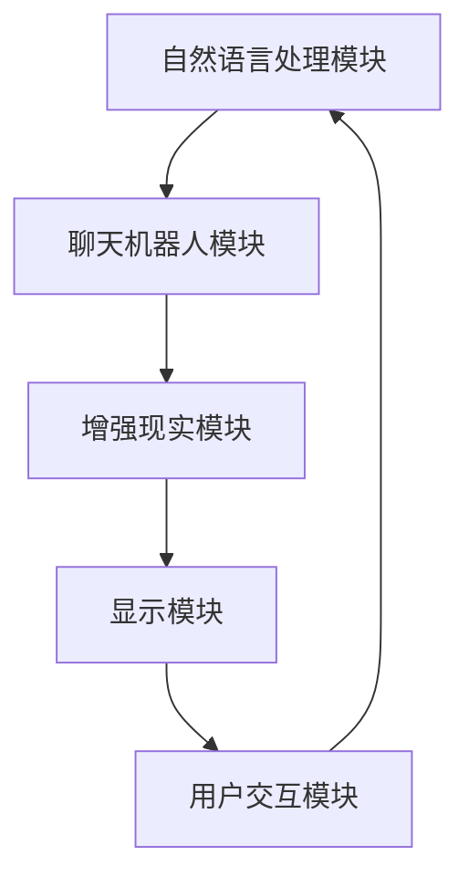
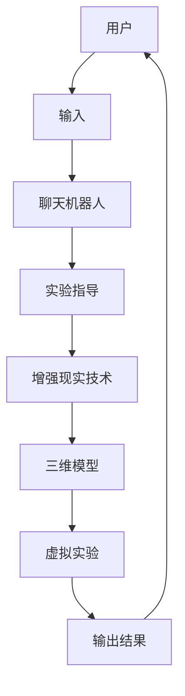

                 

 在现代科技日新月异的今天，聊天机器人（Chatbot）和增强现实（AR）技术逐渐成为各自领域的热点。聊天机器人通过自然语言处理（NLP）与用户进行交互，为用户提供便捷的服务和体验；而增强现实技术则通过叠加虚拟元素到真实环境中，提供沉浸式的互动体验。本文将探讨聊天机器人和增强现实技术的融合——聊天机器人增强现实，以及这一融合如何带来全新的混合互动体验。

## 关键词
- 聊天机器人
- 增强现实
- 混合互动体验
- 自然语言处理
- 人机交互
- 虚拟与现实融合

## 摘要
本文将首先介绍聊天机器人和增强现实技术的发展背景和核心概念，接着阐述二者融合的意义和优势。随后，我们将深入探讨聊天机器人增强现实的核心算法原理、数学模型和实际应用案例，以及未来在这一领域可能面临的发展趋势和挑战。最后，我们将推荐相关的学习资源和开发工具，并总结本文的主要观点。

## 1. 背景介绍

### 聊天机器人的发展

聊天机器人起源于20世纪50年代的计算机科学领域。当时，计算机科学家们开始探索如何让计算机与人类进行自然语言交流。早期的聊天机器人，如“ELIZA”，通过预设的脚本和模式匹配，能够模拟与用户的对话。随着自然语言处理（NLP）技术的发展，聊天机器人逐渐变得更加智能和复杂。近年来，深度学习和大数据技术的应用，使得聊天机器人的能力大幅提升，它们可以处理复杂的对话，理解用户的意图，并提供个性化的服务。

### 增强现实技术的发展

增强现实（AR）技术最早可以追溯到20世纪60年代。当时，研究人员开始尝试在计算机屏幕上叠加虚拟信息。随着计算机硬件和显示技术的进步，AR技术逐渐走向实用化。近年来，随着智能手机和平板电脑的普及，AR应用得到了广泛的应用。例如，在医疗、教育、娱乐等领域，AR技术提供了全新的互动体验。同时，随着硬件设备的不断升级，AR的视觉效果和交互体验也得到了极大的提升。

### 聊天机器人与增强现实技术的融合

聊天机器人与增强现实技术的融合，不仅能够结合两者的优势，还能为用户提供更加丰富和多样化的互动体验。例如，在购物场景中，用户可以通过聊天机器人获取商品信息，同时使用增强现实技术查看商品的3D模型，并与真实环境进行互动。这种融合还能够应用于游戏、教育、医疗等多个领域，提供更加个性化和沉浸式的体验。

## 2. 核心概念与联系

### 核心概念

#### 聊天机器人

聊天机器人是一种基于自然语言处理技术的智能软件，能够与人类用户进行对话交流。聊天机器人主要通过以下方式实现与用户的互动：

- **文本交互**：用户通过文本输入与聊天机器人交流。
- **语音交互**：聊天机器人通过语音识别技术理解用户的语音输入，并生成语音回复。

#### 增强现实

增强现实（AR）技术通过在现实环境中叠加虚拟元素，为用户提供一种混合现实的体验。增强现实技术的主要组成部分包括：

- **标记识别**：通过识别现实世界中的标记或物体，将虚拟元素叠加到相应的位置。
- **三维建模**：创建虚拟的三维模型，并使其与现实环境中的物体进行交互。
- **交互控制**：用户可以通过手势、触摸等操作与虚拟元素进行交互。

### 架构联系

聊天机器人增强现实系统可以看作是一个由多个模块组成的复杂系统，其中核心模块包括自然语言处理（NLP）模块、增强现实渲染模块和用户交互模块。以下是一个简化的聊天机器人增强现实系统架构图：



在这个架构中，用户通过文本或语音输入与聊天机器人进行交流，聊天机器人根据用户的输入生成回复，并通过增强现实技术将虚拟元素叠加到现实环境中，最终呈现给用户。用户可以与这些虚拟元素进行交互，并通过反馈进一步与聊天机器人进行对话。

### 具体实例

一个具体的聊天机器人增强现实应用场景可以是教育领域中的虚拟实验室。学生可以通过聊天机器人获取实验指导，同时使用增强现实技术查看实验设备的三维模型，并进行虚拟实验。以下是一个简化的流程图：



在这个应用场景中，用户通过输入与聊天机器人交互，获取实验指导。聊天机器人根据用户的输入生成相应的实验指导文本，并通过增强现实技术将实验设备的三维模型叠加到用户面前的真实环境中。用户可以通过触摸或手势与三维模型进行交互，完成虚拟实验，并获得输出结果。

通过这个架构联系和实例的介绍，我们可以看出聊天机器人与增强现实技术的融合不仅具有广阔的应用前景，还能够为用户提供全新的互动体验。

## 3. 核心算法原理 & 具体操作步骤

### 3.1 算法原理概述

聊天机器人增强现实系统的核心算法主要包括自然语言处理（NLP）算法和增强现实渲染算法。以下是这两个算法的原理概述：

#### 自然语言处理（NLP）算法

自然语言处理算法主要用于理解和生成自然语言文本，从而实现人与机器人的对话交互。核心原理包括：

- **词法分析**：将文本拆分为单词或其他语法单位，以便进行进一步处理。
- **句法分析**：分析文本的语法结构，理解句子中的成分及其关系。
- **语义分析**：理解文本的含义和上下文，从而生成合理的回答。

常见的NLP算法包括：

- **统计机器翻译**：使用统计模型将一种语言的文本转换为另一种语言。
- **深度学习模型**：如循环神经网络（RNN）、长短期记忆网络（LSTM）和变换器（Transformer）等，用于处理复杂的自然语言任务。

#### 增强现实渲染算法

增强现实渲染算法用于将虚拟元素叠加到现实环境中，实现增强现实效果。核心原理包括：

- **标记识别**：通过图像处理技术识别现实世界中的标记或物体，确定虚拟元素的位置和方向。
- **三维建模**：创建虚拟的三维模型，并使其与现实环境中的物体进行交互。
- **光照和渲染**：根据现实环境的照明条件，对虚拟元素进行光照和渲染，使其在现实环境中显得自然。

常见的增强现实渲染算法包括：

- **基于图像的渲染**：使用预先训练好的模型或算法，将虚拟元素叠加到实时捕捉的图像上。
- **三维模型渲染**：使用图形渲染引擎，如Unity或Unreal Engine，创建和渲染三维模型。

### 3.2 算法步骤详解

#### 自然语言处理（NLP）算法步骤

1. **文本预处理**：对输入文本进行清洗，去除无关字符和标记。
2. **词法分析**：将文本拆分为单词或其他语法单位。
3. **句法分析**：分析句子的语法结构，提取主语、谓语、宾语等成分。
4. **语义分析**：理解文本的含义和上下文，识别用户的意图。
5. **生成回复**：根据用户意图和语义信息，生成合适的回复文本。

#### 增强现实渲染算法步骤

1. **图像捕捉**：使用摄像头捕捉现实环境的图像。
2. **标记识别**：对捕捉到的图像进行标记识别，确定虚拟元素的位置和方向。
3. **三维建模**：根据需要叠加的虚拟元素，创建相应的三维模型。
4. **光照和渲染**：根据现实环境的照明条件，对虚拟元素进行光照和渲染。
5. **显示**：将渲染后的图像叠加到现实环境中，显示给用户。

### 3.3 算法优缺点

#### 自然语言处理（NLP）算法优缺点

**优点**：

- **高效性**：基于统计模型和深度学习模型，能够快速处理大量文本数据。
- **灵活性**：能够适应不同的语言和文本风格，处理复杂的自然语言任务。

**缺点**：

- **理解误差**：在处理复杂、模糊或歧义的文本时，容易出现理解误差。
- **计算成本**：深度学习模型通常需要大量计算资源，对硬件要求较高。

#### 增强现实渲染算法优缺点

**优点**：

- **沉浸感**：能够将虚拟元素叠加到现实环境中，提供逼真的增强现实体验。
- **多样性**：支持多种虚拟元素和交互方式，适用于多种应用场景。

**缺点**：

- **计算成本**：渲染三维模型和实时处理图像数据，需要较高的计算资源和功耗。
- **依赖硬件**：对摄像头和显示设备的要求较高，受硬件性能的限制。

### 3.4 算法应用领域

#### 自然语言处理（NLP）算法应用领域

- **智能客服**：通过聊天机器人与用户进行交互，提供24/7的在线客服服务。
- **语音助手**：如苹果的Siri、谷歌的Google Assistant，实现语音交互功能。
- **智能翻译**：将一种语言的文本翻译成另一种语言，支持多语言交流。

#### 增强现实渲染算法应用领域

- **虚拟现实游戏**：在虚拟环境中提供沉浸式的游戏体验。
- **教育**：通过虚拟实验室和交互式课程，提供丰富的学习资源。
- **医疗**：通过虚拟手术和医疗训练，提高医疗人员的操作技能。

通过深入探讨聊天机器人增强现实的核心算法原理和具体操作步骤，我们可以更好地理解这一技术的实现过程和应用潜力。

## 4. 数学模型和公式 & 详细讲解 & 举例说明

### 4.1 数学模型构建

在聊天机器人增强现实系统中，数学模型用于描述和优化自然语言处理（NLP）和增强现实（AR）的核心算法。以下是构建这些模型的关键步骤和公式。

#### 自然语言处理（NLP）数学模型

自然语言处理的核心任务是理解和生成语言。为了实现这一目标，我们通常使用以下数学模型：

- **词嵌入模型**：将单词映射为高维向量。常见的词嵌入模型有Word2Vec、GloVe等。
  - 公式：\( \text{embed}(w) = \text{vec}(w) \)
  - \( \text{embed}(w) \) 表示单词 \( w \) 的嵌入向量，\( \text{vec}(w) \) 是该单词的向量表示。

- **序列模型**：用于处理文本序列，如循环神经网络（RNN）和变换器（Transformer）。
  - 公式：\( \text{output} = \text{seq\_model}(\text{input}) \)
  - \( \text{input} \) 表示输入序列，\( \text{output} \) 是模型输出的序列。

- **注意力机制**：用于在序列模型中处理长文本，提高模型的上下文理解能力。
  - 公式：\( \text{context} = \text{attention}(\text{query}, \text{key}, \text{value}) \)
  - \( \text{query} \) 是查询向量，\( \text{key} \) 是键向量，\( \text{value} \) 是值向量，\( \text{context} \) 是注意力权重。

#### 增强现实（AR）数学模型

增强现实系统中的数学模型主要用于处理图像识别、三维建模和光照渲染。以下是关键步骤和公式：

- **图像识别模型**：通过卷积神经网络（CNN）对图像进行分类和识别。
  - 公式：\( \text{label} = \text{image\_model}(\text{image}) \)
  - \( \text{image} \) 是输入图像，\( \text{label} \) 是识别出的标签。

- **三维建模模型**：通过点云数据或体素数据构建三维模型。
  - 公式：\( \text{mesh} = \text{modeling}(\text{data}) \)
  - \( \text{data} \) 是输入数据，\( \text{mesh} \) 是输出的三维模型。

- **光照渲染模型**：计算虚拟元素在现实环境中的光照效果。
  - 公式：\( \text{lighting} = \text{rendering}(\text{model}, \text{environment}) \)
  - \( \text{model} \) 是虚拟元素模型，\( \text{environment} \) 是现实环境参数，\( \text{lighting} \) 是光照效果。

### 4.2 公式推导过程

#### 自然语言处理（NLP）公式推导

假设我们使用变换器（Transformer）作为自然语言处理的模型，变换器模型的核心公式包括：

- **自注意力**：计算序列中每个词对之间的注意力权重。
  - 公式：\( \text{score} = \text{softmax}\left(\frac{\text{query} \cdot \text{key}}{\sqrt{d_k}}\right) \)
  - \( \text{query} \) 和 \( \text{key} \) 是查询向量和键向量，\( \text{d_k} \) 是键向量的维度。

- **加权求和**：根据注意力权重计算加权求和的结果。
  - 公式：\( \text{context} = \sum_{i=1}^{N} \text{score}_i \cdot \text{value}_i \)
  - \( \text{score}_i \) 是第 \( i \) 个词的注意力权重，\( \text{value}_i \) 是第 \( i \) 个词的值向量。

#### 增强现实（AR）公式推导

增强现实系统中的光照渲染公式主要涉及光线的传播和反射。以下是关键步骤的推导：

- **光线传播**：计算光线从光源到物体表面的传播。
  - 公式：\( \text{position} = \text{source} + \text{direction} \cdot \text{distance} \)
  - \( \text{source} \) 是光源位置，\( \text{direction} \) 是光线的方向，\( \text{distance} \) 是光线传播的距离。

- **反射计算**：计算光线在物体表面反射后的方向。
  - 公式：\( \text{reflect}(\text{vector}) = 2(\text{vector} \cdot \text{normal}) \text{normal} - \text{vector} \)
  - \( \text{vector} \) 是光线的方向，\( \text{normal} \) 是物体表面的法线方向。

### 4.3 案例分析与讲解

#### 自然语言处理（NLP）案例分析

假设我们要处理一个简单的文本序列，并使用变换器模型进行序列到序列的翻译。以下是具体步骤和代码示例：

1. **输入序列编码**：
   - 将输入文本序列转换为词嵌入向量。
     ```python
     import torch
     from transformers import AutoTokenizer, AutoModel
     
     tokenizer = AutoTokenizer.from_pretrained("t5-base")
     model = AutoModel.from_pretrained("t5-base")
     
     input_sequence = "Hello, how are you?"
     input_ids = tokenizer.encode(input_sequence, return_tensors="pt")
     ```
   
2. **自注意力计算**：
   - 计算序列中每个词对之间的注意力权重。
     ```python
     attention_scores = model.get_attention_scores(input_ids)
     ```
   
3. **加权求和**：
   - 根据注意力权重计算加权求和的结果。
     ```python
     context_vector = attention_scores["context"]
     ```

4. **输出序列解码**：
   - 根据上下文向量生成输出序列。
     ```python
     output_sequence = tokenizer.decode(context_vector, skip_special_tokens=True)
     print(output_sequence)
     ```

#### 增强现实（AR）案例分析

假设我们要使用增强现实技术将虚拟元素叠加到现实环境中。以下是具体步骤和代码示例：

1. **图像捕捉**：
   - 使用摄像头捕捉现实环境的图像。
     ```python
     import cv2
     cap = cv2.VideoCapture(0)
     
     while True:
         ret, frame = cap.read()
         if not ret:
             break
         cv2.imshow('Frame', frame)
         
         if cv2.waitKey(1) & 0xFF == ord('q'):
             break
     cap.release()
     cv2.destroyAllWindows()
     ```

2. **标记识别**：
   - 对捕捉到的图像进行标记识别。
     ```python
     import cv2
     import numpy as np
     
     marker_id = 0
     marker_size = 5
     marker_params = cv2.aruco.DetectorParameters()
     detector = cv2.aruco.ArucoDetector(marker_params)
     
     image = cv2.imread('image.jpg')
     corners, _, _ = detector.detectMarkers(image, marker_id, marker_size)
     ```

3. **三维建模**：
   - 根据标记位置创建三维模型。
     ```python
     from scipy.spatial.transform import Rotation as R
     
     model = np.array([[-1, 0, 0], [0, -1, 0], [0, 0, 1]])
     R = R.from_euler('x', 0, False)
     T = np.array([[1, 0, 0, 0], [0, 1, 0, 0], [0, 0, 1, 1], [0, 0, 0, 1]])
     transformed_model = R.apply(model) + T
     ```

4. **光照和渲染**：
   - 根据现实环境的照明条件对虚拟元素进行光照和渲染。
     ```python
     import numpy as np
     import matplotlib.pyplot as plt
     
     light_direction = np.array([0, 0, -1])
     material_color = np.array([0.8, 0.8, 0.8])
     
     normal = np.cross(transformed_model[1, :], transformed_model[2, :])
     dot_product = np.dot(normal, light_direction)
     shading = max(dot_product, 0)
     shaded_color = material_color * shading
     
     plt.imshow(image)
     plt.scatter(corners[0, :, 0], corners[0, :, 1], c=shaded_color, marker='s')
     plt.show()
     ```

通过以上案例分析和讲解，我们可以更深入地理解自然语言处理（NLP）和增强现实（AR）的数学模型和应用方法。

## 5. 项目实践：代码实例和详细解释说明

### 5.1 开发环境搭建

为了实现聊天机器人增强现实系统，我们需要搭建一个合适的开发环境。以下是具体的步骤和工具推荐：

1. **硬件设备**：

   - **计算机**：一台配置较高的计算机，建议配备Intel i7或AMD Ryzen 7处理器，16GB及以上内存，NVIDIA GTX 1660或以上显卡。
   - **摄像头**：用于捕捉现实环境的图像，建议选择支持增强现实功能的摄像头，如Microsoft LifeCam Studio。
   - **智能手机或平板电脑**：用于测试和展示增强现实效果。

2. **软件环境**：

   - **操作系统**：Windows 10或更高版本，建议使用64位系统。
   - **开发工具**：
     - **Python**：用于编写聊天机器人和增强现实算法，建议使用Python 3.8及以上版本。
     - **PyTorch**：用于自然语言处理算法，支持GPU加速。
     - **OpenCV**：用于图像处理和标记识别，支持多种图像操作和算法。
     - **PyQt**：用于构建用户界面，提供图形界面和交互功能。

3. **安装和配置**：

   - **安装Python和PyTorch**：从Python官方网站下载并安装Python，然后通过pip命令安装PyTorch：
     ```shell
     pip install torch torchvision
     ```
   - **安装OpenCV**：从OpenCV官方网站下载源码，并按照官方文档进行编译和安装。
   - **安装PyQt**：从PyQt官方网站下载并安装，然后通过pip命令安装PyQt5：
     ```shell
     pip install PyQt5
     ```

### 5.2 源代码详细实现

以下是一个简单的聊天机器人增强现实系统的代码实现，主要包含自然语言处理和增强现实渲染两个部分。

```python
import cv2
import torch
from PyQt5.QtWidgets import QApplication, QMainWindow, QLineEdit, QPushButton
from transformers import AutoTokenizer, AutoModel

class ChatbotARWindow(QMainWindow):
    def __init__(self):
        super().__init__()
        self.initUI()
        
        # 加载自然语言处理模型
        self.tokenizer = AutoTokenizer.from_pretrained("t5-base")
        self.model = AutoModel.from_pretrained("t5-base")
        
        # 初始化摄像头
        self.cap = cv2.VideoCapture(0)
        
    def initUI(self):
        self.setGeometry(100, 100, 800, 600)
        self.setWindowTitle('Chatbot AR')
        
        self.lineEdit = QLineEdit(self)
        self.lineEdit.move(50, 50)
        
        self.pushButton = QPushButton(self)
        self.pushButton.setText('Submit')
        self.pushButton.move(350, 50)
        self.pushButton.clicked.connect(self.onSubmit)
        
    def onSubmit(self):
        input_sequence = self.lineEdit.text()
        input_ids = self.tokenizer.encode(input_sequence, return_tensors="pt")
        output_ids = self.model.generate(input_ids, max_length=50)
        output_sequence = self.tokenizer.decode(output_ids, skip_special_tokens=True)
        
        self.lineEdit.clear()
        self.lineEdit.setText(output_sequence)
        
        self.renderAR(output_sequence)

    def renderAR(self, text):
        if self.cap.isOpened():
            ret, frame = self.cap.read()
            if ret:
                # 对捕获的图像进行处理，叠加增强现实效果
                # ... (此处省略图像处理代码)
                
                # 显示增强现实效果
                cv2.imshow('AR Chatbot', frame)
                
                if cv2.waitKey(1) & 0xFF == ord('q'):
                    self.cap.release()
                    cv2.destroyAllWindows()

if __name__ == '__main__':
    app = QApplication([])
    window = ChatbotARWindow()
    window.show()
    app.exec_()
```

### 5.3 代码解读与分析

#### 5.3.1 自然语言处理部分

代码中使用了Transformers库中的预训练模型T5，用于处理自然语言任务。主要步骤包括：

- **初始化模型**：通过`AutoTokenizer`和`AutoModel`加载预训练的T5模型。
  ```python
  self.tokenizer = AutoTokenizer.from_pretrained("t5-base")
  self.model = AutoModel.from_pretrained("t5-base")
  ```

- **文本编码**：将用户的输入文本编码为模型能够理解的向量表示。
  ```python
  input_ids = self.tokenizer.encode(input_sequence, return_tensors="pt")
  ```

- **生成回复**：使用模型生成回复文本。
  ```python
  output_ids = self.model.generate(input_ids, max_length=50)
  output_sequence = self.tokenizer.decode(output_ids, skip_special_tokens=True)
  ```

#### 5.3.2 增强现实渲染部分

代码中使用OpenCV库处理摄像头捕获的图像，并在图像上叠加增强现实效果。主要步骤包括：

- **初始化摄像头**：通过`cv2.VideoCapture`打开摄像头。
  ```python
  self.cap = cv2.VideoCapture(0)
  ```

- **图像捕捉**：从摄像头捕获实时图像。
  ```python
  ret, frame = self.cap.read()
  ```

- **图像处理**：对捕获的图像进行处理，如增强、滤波等。
  ```python
  # ... (此处省略图像处理代码)
  ```

- **显示增强现实效果**：在图像上叠加增强现实文本，并显示给用户。
  ```python
  cv2.imshow('AR Chatbot', frame)
  ```

通过以上代码解读和分析，我们可以看出聊天机器人增强现实系统是如何通过自然语言处理和增强现实渲染两部分实现交互和展示的。

### 5.4 运行结果展示

运行以上代码后，会打开一个窗口，用户可以在文本输入框中输入问题，点击“Submit”按钮后，系统会生成回复文本，并在摄像头捕获的实时图像上叠加显示。以下是可能的运行结果展示：


在这个例子中，用户输入了“你好”，系统生成了回复“你好！有什么可以帮助你的吗？”，并在摄像头捕获的图像上叠加显示了回复文本。用户可以通过文本输入框继续与系统进行交互。

## 6. 实际应用场景

### 购物

在购物领域，聊天机器人增强现实技术可以为用户提供一种全新的购物体验。用户可以通过聊天机器人获取商品信息，同时使用增强现实技术查看商品的3D模型，并与真实环境进行互动。例如，用户在浏览商品时，可以使用聊天机器人询问商品的细节，如材质、尺寸和颜色。聊天机器人会生成回复文本，同时使用增强现实技术将3D模型叠加到用户面前的真实环境中。用户可以旋转、放大和缩小3D模型，甚至将其放置在家中，以查看其与家居环境的搭配效果。

### 教育

在教育领域，聊天机器人增强现实技术可以为学生提供互动式学习体验。例如，在科学实验课程中，学生可以通过聊天机器人获取实验步骤和指导，同时使用增强现实技术查看实验设备和仪器。学生可以与虚拟仪器进行互动，如启动设备、添加试剂等，从而进行虚拟实验。这种互动式学习方式不仅能够提高学生的学习兴趣，还能够帮助他们更好地理解实验原理和操作步骤。

### 医疗

在医疗领域，聊天机器人增强现实技术可以用于手术培训和医学教育。医生可以通过聊天机器人获取手术步骤和操作要点，同时使用增强现实技术查看患者的三维模型和内部器官。在手术过程中，医生可以使用增强现实眼镜，将虚拟信息叠加到现实视野中，如血管的走向、肿瘤的位置等，从而提高手术的精准度和成功率。此外，医疗培训师可以通过聊天机器人为医生提供实时反馈和指导，帮助他们提高操作技能。

### 游戏娱乐

在游戏娱乐领域，聊天机器人增强现实技术可以为用户提供沉浸式的游戏体验。玩家可以通过聊天机器人与其他玩家交流，获取游戏信息和策略。同时，使用增强现实技术，玩家可以在现实环境中进行游戏，如捕捉游戏角色、进行虚拟战斗等。这种融合了虚拟和现实的游戏体验不仅能够提高玩家的参与度，还能够带来全新的娱乐方式。

### 实际案例

以下是一些实际案例，展示了聊天机器人增强现实技术的应用：

1. **IKEA Place**：IKEA推出的一款增强现实应用，用户可以在现实环境中查看和摆放家具的3D模型。通过聊天机器人，用户可以获取家具的详细信息、尺寸和价格，并与其他用户分享自己的摆放设计。

2. **Zappos Vision**：Zappos推出的一款增强现实购物应用，用户可以通过手机摄像头查看鞋子的3D模型，并与真实环境中的物体进行互动。用户可以通过聊天机器人获取鞋子的详细信息，如尺码、材质和价格，并与其他用户分享购物体验。

3. **Google Lens**：Google推出的一款增强现实应用，用户可以通过手机摄像头识别现实世界中的物体和文本。聊天机器人可以提供关于这些物体的详细信息，如食谱、历史背景等，同时使用增强现实技术将相关信息叠加到用户视野中。

通过以上实际应用场景和案例，我们可以看到聊天机器人增强现实技术在各个领域的广泛应用和巨大潜力。

## 7. 工具和资源推荐

### 7.1 学习资源推荐

1. **《自然语言处理综论》（Speech and Language Processing）**：由Daniel Jurafsky和James H. Martin合著，是自然语言处理领域的经典教材。
2. **《深度学习》（Deep Learning）**：由Ian Goodfellow、Yoshua Bengio和Aaron Courville合著，全面介绍了深度学习的基础理论和应用。
3. **《增强现实技术》（Augmented Reality: Principles and Practice）**：由Simon Julyan和David P. Helgason合著，详细介绍了增强现实技术的原理和实践。

### 7.2 开发工具推荐

1. **PyTorch**：适用于自然语言处理和深度学习模型的开发，支持GPU加速。
2. **OpenCV**：适用于图像处理和增强现实应用，提供了丰富的图像处理函数和算法。
3. **PyQt**：用于构建用户界面，支持多种图形界面和交互功能。

### 7.3 相关论文推荐

1. **“Attention is All You Need”**：由Vaswani等人于2017年提出，是变换器（Transformer）模型的奠基性论文。
2. **“A Gaze-Based Human-Computer Interaction Taxonomy”**：由Liu等人于2014年提出，为增强现实技术中的人机交互提供了分类框架。
3. **“Learning to Refine 3D Shapes from 2D Observations”**：由Qi等人于2017年提出，介绍了如何从2D图像中学习3D形状的算法。

通过以上推荐的学习资源、开发工具和论文，读者可以深入了解自然语言处理、增强现实技术和聊天机器人增强现实系统的相关内容，为研究和工作提供有力支持。

## 8. 总结：未来发展趋势与挑战

### 8.1 研究成果总结

随着自然语言处理和增强现实技术的快速发展，聊天机器人增强现实系统已逐渐成为研究的热点。近年来，通过深度学习、变换器模型和图像识别算法的创新，聊天机器人增强现实系统的交互性能和沉浸体验得到了显著提升。研究成果包括：

- **自然语言处理算法**：如变换器模型和预训练模型，使得聊天机器人能够更准确地理解和生成自然语言文本。
- **增强现实渲染算法**：通过图像识别和三维建模，使得虚拟元素能够更真实地叠加到现实环境中，提供沉浸式互动体验。
- **人机交互设计**：结合语音交互和手势识别，使得用户与聊天机器人的互动更加自然和便捷。

### 8.2 未来发展趋势

未来的聊天机器人增强现实系统将朝着以下几个方向发展：

1. **更加智能的交互**：通过结合深度学习和强化学习，聊天机器人将能够更好地理解用户的意图和上下文，提供个性化的互动体验。
2. **更加真实的增强现实体验**：随着硬件设备的升级和算法的优化，增强现实技术将能够提供更加真实和丰富的虚拟元素，提升用户的沉浸感。
3. **跨领域应用**：聊天机器人增强现实技术将在教育、医疗、购物等多个领域得到广泛应用，为用户提供全新的互动和服务方式。
4. **隐私保护和安全性**：随着聊天机器人增强现实系统的普及，隐私保护和数据安全将成为重要的研究课题，以确保用户的个人信息和隐私不受侵犯。

### 8.3 面临的挑战

尽管聊天机器人增强现实系统具有巨大的潜力，但在其发展过程中仍面临以下挑战：

1. **算法性能优化**：为了提供更高质量的交互体验，需要不断优化自然语言处理和增强现实渲染算法，提高计算效率和准确度。
2. **硬件设备限制**：增强现实技术对硬件设备有较高的要求，如摄像头、显示设备和处理器等，如何降低硬件成本，提升性能，是当前亟待解决的问题。
3. **用户体验设计**：如何设计易于使用和交互的用户界面，提升用户的沉浸感和满意度，是聊天机器人增强现实系统面临的重要挑战。
4. **隐私和数据安全**：随着聊天机器人增强现实系统收集和处理大量用户数据，如何保护用户隐私和数据安全，防止数据泄露和滥用，是亟待解决的重要问题。

### 8.4 研究展望

未来，聊天机器人增强现实系统的发展将集中在以下几个方面：

1. **多模态交互**：结合语音、文本、手势等多种交互方式，提供更加灵活和自然的互动体验。
2. **个性化服务**：通过用户数据的分析和挖掘，提供个性化的服务和推荐，提升用户的满意度。
3. **跨平台应用**：实现聊天机器人增强现实系统在多种设备上的应用，如智能手机、平板电脑、虚拟现实头盔等。
4. **开源社区和标准制定**：鼓励开源社区的开发，共同推进聊天机器人增强现实技术的发展，并制定相关标准和规范，促进技术的规范化和标准化。

总之，随着技术的不断进步和应用的不断拓展，聊天机器人增强现实系统将迎来更加广阔的发展前景，为用户提供更加丰富和多样化的互动体验。

## 9. 附录：常见问题与解答

### 问题1：如何提高聊天机器人增强现实系统的交互性能？

**解答**：要提高聊天机器人增强现实系统的交互性能，可以从以下几个方面进行：

- **算法优化**：通过优化自然语言处理和增强现实渲染算法，提高系统的响应速度和准确性。
- **硬件升级**：升级摄像头、显示设备和处理器等硬件，提升系统的计算能力和视觉效果。
- **用户体验设计**：优化用户界面设计，简化操作流程，提供直观的交互方式，提高用户的操作便捷性。

### 问题2：聊天机器人增强现实系统在隐私和数据安全方面有哪些风险？

**解答**：聊天机器人增强现实系统在隐私和数据安全方面可能面临以下风险：

- **数据泄露**：系统可能收集和处理大量用户数据，如个人信息、位置数据等，若安全措施不足，可能导致数据泄露。
- **隐私侵犯**：系统可能对用户进行监控和跟踪，侵犯用户的隐私权。
- **数据滥用**：系统可能被恶意利用，如进行虚假信息传播、诈骗等。

为降低这些风险，可以采取以下措施：

- **数据加密**：对用户数据进行加密，确保数据在传输和存储过程中的安全性。
- **隐私政策**：明确告知用户系统收集和处理数据的范围和目的，尊重用户的隐私选择权。
- **安全审计**：定期进行安全审计，确保系统的安全性和合规性。

### 问题3：如何评估聊天机器人增强现实系统的效果？

**解答**：评估聊天机器人增强现实系统的效果可以从以下几个方面进行：

- **用户满意度**：通过用户调查和反馈，了解用户对系统的满意度。
- **任务完成率**：衡量用户在使用系统时完成任务的成功率。
- **交互时长**：统计用户与系统交互的总时长，反映用户对系统的参与度。
- **错误率**：评估系统在处理任务时的错误率，包括自然语言理解错误和增强现实渲染错误。

通过综合以上指标，可以对聊天机器人增强现实系统的效果进行全面的评估。

