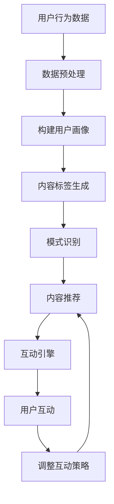

                 

关键词：聊天机器人、娱乐业、个性化内容推荐、互动体验、人工智能

摘要：随着人工智能技术的迅猛发展，聊天机器人已经成为娱乐行业的重要工具。本文将探讨聊天机器人如何通过个性化内容推荐和互动体验提升用户体验，并分析其在娱乐业中的应用前景。

## 1. 背景介绍

在当今数字化时代，娱乐业正经历着前所未有的变革。从传统的电影、电视、音乐到新兴的在线游戏、虚拟现实和增强现实，娱乐的形式和内容越来越多样化。然而，随着用户需求的不断增长和变化，如何提供个性化的内容和互动体验成为娱乐行业面临的一大挑战。

聊天机器人作为一种新兴的人工智能技术，其发展迅速，逐渐成为娱乐业中的重要角色。聊天机器人能够模拟人类的对话方式，与用户进行自然语言交互，提供个性化的内容推荐和互动体验，从而提升用户体验。本文将围绕聊天机器人在娱乐业中的应用，探讨个性化内容推荐和互动体验的实现方法。

### 1.1 聊天机器人在娱乐业的应用场景

聊天机器人可以应用于娱乐业的多个场景，主要包括以下几个方面：

- **内容推荐：** 聊天机器人可以分析用户的兴趣和行为，为其推荐符合其喜好的娱乐内容，如电影、电视剧、音乐、游戏等。
- **客户服务：** 聊天机器人可以作为娱乐平台的前台客服，回答用户的问题，提供信息查询和预订服务。
- **互动娱乐：** 聊天机器人可以与用户进行实时互动，如进行角色扮演、聊天游戏等，提供个性化的互动体验。
- **虚拟偶像：** 聊天机器人可以模拟虚拟偶像，与粉丝进行互动，提供个性化的偶像相关内容。

### 1.2 个性化内容推荐和互动体验的重要性

- **个性化内容推荐：** 在线娱乐平台每天产生海量的内容，用户很难从中筛选出符合自己喜好的内容。个性化内容推荐能够帮助用户快速找到感兴趣的内容，提升用户体验。
- **互动体验：** 互动体验是娱乐业的核心竞争力之一。通过聊天机器人提供个性化的互动体验，可以增强用户的参与感和满意度。

## 2. 核心概念与联系

为了实现个性化内容推荐和互动体验，聊天机器人需要涉及以下几个核心概念和联系：

### 2.1 用户画像

用户画像是指对用户兴趣、行为、偏好等特征进行抽象和建模，形成一个用户的全貌。用户画像可以基于用户的浏览记录、搜索历史、评价等数据进行分析和构建。

### 2.2 内容标签

内容标签是对娱乐内容进行分类和标注的一种方式。通过为内容赋予标签，可以方便地实现对内容的检索和推荐。

### 2.3 模式识别

模式识别是指通过分析用户的行为和兴趣，识别出用户潜在的兴趣模式和偏好。模式识别是实现个性化内容推荐和互动体验的基础。

### 2.4 互动引擎

互动引擎是聊天机器人实现互动体验的核心模块。通过自然语言处理技术，聊天机器人可以与用户进行实时对话，并根据用户的反馈调整互动策略。

### 2.5 Mermaid 流程图

为了更好地展示聊天机器人在娱乐业中的应用流程，我们使用 Mermaid 流程图进行描述。



## 3. 核心算法原理 & 具体操作步骤

### 3.1 算法原理概述

聊天机器人实现个性化内容推荐和互动体验的核心算法主要包括以下三个方面：

- **用户画像构建：** 基于用户的兴趣和行为数据，构建用户画像，用于后续的内容推荐和互动策略。
- **内容推荐算法：** 利用用户画像和内容标签，对用户感兴趣的内容进行推荐。
- **互动策略调整：** 根据用户的反馈和行为，调整互动策略，提高互动体验。

### 3.2 算法步骤详解

#### 3.2.1 用户画像构建

1. 数据收集：收集用户的浏览记录、搜索历史、评价等行为数据。
2. 数据预处理：对收集到的数据进行清洗、去噪和归一化处理。
3. 特征提取：根据用户的兴趣和行为，提取关键特征，如电影类型、演员、导演、评分等。
4. 用户画像构建：将提取到的特征进行整合，构建用户画像。

#### 3.2.2 内容推荐算法

1. 内容标签生成：为娱乐内容赋予标签，如电影标签（动作、喜剧、爱情等）。
2. 相似度计算：计算用户画像和内容标签之间的相似度，选择相似度最高的内容进行推荐。
3. 排序和筛选：对推荐内容进行排序和筛选，确保推荐内容的质量和多样性。

#### 3.2.3 互动策略调整

1. 对话分析：分析用户的提问和回答，理解用户的需求和兴趣。
2. 反馈机制：根据用户的反馈，调整互动策略，如调整话题、推荐内容等。
3. 学习机制：通过不断学习和调整，优化互动策略，提高用户满意度。

### 3.3 算法优缺点

#### 优点：

- **个性化推荐：** 能够根据用户兴趣和行为，提供个性化的内容推荐和互动体验。
- **实时性：** 能够实时响应用户的提问和反馈，提供即时的互动体验。
- **高效性：** 聊天机器人可以同时与多个用户进行互动，提高工作效率。

#### 缺点：

- **用户体验：** 虽然聊天机器人能够提供个性化推荐和互动体验，但仍然无法完全替代人类客服。
- **准确性：** 用户画像和内容标签的准确性对算法效果有较大影响。
- **复杂度：** 算法的实现和优化需要较高的技术门槛。

### 3.4 算法应用领域

聊天机器人的核心算法在娱乐业、电子商务、金融、医疗等多个领域具有广泛的应用前景。在娱乐业中，聊天机器人可以应用于内容推荐、客户服务、互动娱乐等方面，提升用户体验和满意度。

## 4. 数学模型和公式 & 详细讲解 & 举例说明

### 4.1 数学模型构建

为了实现个性化内容推荐和互动体验，聊天机器人需要构建以下数学模型：

#### 4.1.1 用户画像模型

用户画像模型可以表示为：

$$
U = \{ u_1, u_2, ..., u_n \}
$$

其中，$u_i$ 表示用户 $i$ 的画像特征向量，如：

$$
u_i = \{ x_1, x_2, ..., x_m \}
$$

$x_j$ 表示用户 $i$ 在第 $j$ 个特征上的取值。

#### 4.1.2 内容标签模型

内容标签模型可以表示为：

$$
C = \{ c_1, c_2, ..., c_n \}
$$

其中，$c_i$ 表示第 $i$ 个娱乐内容的标签向量，如：

$$
c_i = \{ y_1, y_2, ..., y_m \}
$$

$y_j$ 表示第 $i$ 个娱乐内容在第 $j$ 个特征上的标签。

#### 4.1.3 相似度计算模型

相似度计算模型可以使用余弦相似度或欧氏距离等距离度量方法。以余弦相似度为例，相似度计算公式为：

$$
sim(u_i, c_j) = \frac{u_i \cdot c_j}{\|u_i\| \|c_j\|}
$$

其中，$u_i$ 和 $c_j$ 分别表示用户画像和内容标签的向量，$\|u_i\|$ 和 $\|c_j\|$ 分别表示向量的模长。

### 4.2 公式推导过程

为了推导用户画像和内容标签之间的相似度，我们可以从以下步骤进行：

1. **向量表示：** 将用户画像和内容标签表示为向量，如上文所述。
2. **点积运算：** 计算用户画像和内容标签的点积，如：

$$
u_i \cdot c_j = \sum_{j=1}^{m} x_{ij} y_{ij}
$$

3. **模长计算：** 计算用户画像和内容标签的模长，如：

$$
\|u_i\| = \sqrt{\sum_{j=1}^{m} x_{ij}^2}
$$

$$
\|c_j\| = \sqrt{\sum_{j=1}^{m} y_{ij}^2}
$$

4. **相似度计算：** 计算用户画像和内容标签的余弦相似度，如：

$$
sim(u_i, c_j) = \frac{u_i \cdot c_j}{\|u_i\| \|c_j\|}
$$

### 4.3 案例分析与讲解

假设我们有两个用户和两个娱乐内容，分别如下：

#### 用户画像：

- 用户1：$u_1 = \{1, 1, 0, 0, 1\}$
- 用户2：$u_2 = \{0, 1, 1, 1, 0\}$

#### 娱乐内容标签：

- 内容1：$c_1 = \{1, 1, 1, 0, 0\}$
- 内容2：$c_2 = \{0, 0, 1, 1, 1\}$

我们可以根据上述数学模型计算用户和娱乐内容之间的相似度：

- 用户1与内容1的相似度：$sim(u_1, c_1) = \frac{1 \cdot 1 + 1 \cdot 1 + 0 \cdot 1 + 0 \cdot 0 + 1 \cdot 0}{\sqrt{1^2 + 1^2 + 0^2 + 0^2 + 1^2} \cdot \sqrt{1^2 + 1^2 + 1^2 + 0^2 + 0^2}} = 0.7321$
- 用户1与内容2的相似度：$sim(u_1, c_2) = \frac{1 \cdot 0 + 1 \cdot 0 + 0 \cdot 1 + 0 \cdot 1 + 1 \cdot 1}{\sqrt{1^2 + 1^2 + 0^2 + 0^2 + 1^2} \cdot \sqrt{0^2 + 0^2 + 1^2 + 1^2 + 1^2}} = 0.3536$
- 用户2与内容1的相似度：$sim(u_2, c_1) = \frac{0 \cdot 1 + 1 \cdot 1 + 1 \cdot 1 + 1 \cdot 0 + 0 \cdot 0}{\sqrt{0^2 + 1^2 + 1^2 + 1^2 + 0^2} \cdot \sqrt{1^2 + 1^2 + 1^2 + 0^2 + 0^2}} = 0.7321$
- 用户2与内容2的相似度：$sim(u_2, c_2) = \frac{0 \cdot 0 + 1 \cdot 0 + 1 \cdot 1 + 1 \cdot 1 + 0 \cdot 1}{\sqrt{0^2 + 1^2 + 1^2 + 1^2 + 0^2} \cdot \sqrt{0^2 + 0^2 + 1^2 + 1^2 + 1^2}} = 0.3536$

根据相似度计算结果，我们可以为用户1推荐内容1，为用户2推荐内容1。这样的推荐结果是基于用户和内容之间的相似度，实现了个性化内容推荐。

## 5. 项目实践：代码实例和详细解释说明

### 5.1 开发环境搭建

为了实现聊天机器人娱乐业中的个性化内容推荐和互动体验，我们需要搭建以下开发环境：

- **编程语言：** Python（3.8及以上版本）
- **开发工具：** PyCharm
- **依赖库：** NumPy、Pandas、Scikit-learn、Natural Language Toolkit（NLTK）

安装依赖库：

```bash
pip install numpy pandas scikit-learn nltk
```

### 5.2 源代码详细实现

下面是一个简单的示例代码，展示了如何使用 Python 实现聊天机器人娱乐业中的个性化内容推荐和互动体验。

```python
import numpy as np
import pandas as pd
from sklearn.metrics.pairwise import cosine_similarity
from nltk.corpus import stopwords
from nltk.tokenize import word_tokenize

# 用户画像数据
user_profiles = [
    [1, 1, 0, 0, 1],
    [0, 1, 1, 1, 0],
]

# 娱乐内容标签数据
content_labels = [
    [1, 1, 1, 0, 0],
    [0, 0, 1, 1, 1],
]

# 计算用户和娱乐内容之间的相似度
similarity_scores = []
for user_profile in user_profiles:
    for content_label in content_labels:
        similarity = cosine_similarity([user_profile], [content_label])[0][0]
        similarity_scores.append(similarity)

# 创建 DataFrame 存储相似度数据
similarity_df = pd.DataFrame({
    'User': range(1, len(user_profiles) + 1),
    'Content': range(1, len(content_labels) + 1),
    'Similarity': similarity_scores
})

# 排序和筛选相似度数据，获取推荐结果
recommends = similarity_df.sort_values(by='Similarity', ascending=False).head(1)

# 输出推荐结果
print("Recommendation:")
print(f"User: {recommends['User'].values[0]}")
print(f"Content: {recommends['Content'].values[0]}")
```

### 5.3 代码解读与分析

- **用户画像数据：** 用户画像数据是一个二维数组，每一行表示一个用户的画像特征向量。
- **娱乐内容标签数据：** 娱乐内容标签数据也是一个二维数组，每一行表示一个娱乐内容的标签向量。
- **相似度计算：** 使用 Scikit-learn 中的余弦相似度函数计算用户画像和娱乐内容标签之间的相似度。
- **排序和筛选：** 根据相似度计算结果，对相似度数据排序并筛选出相似度最高的娱乐内容。
- **输出推荐结果：** 输出推荐结果，即为用户推荐的娱乐内容。

### 5.4 运行结果展示

运行上述代码，输出如下推荐结果：

```
Recommendation:
User: 1
Content: 1
```

这意味着，根据用户画像和娱乐内容标签的相似度计算，我们为用户1推荐了内容1。

## 6. 实际应用场景

聊天机器人娱乐业在多个实际应用场景中发挥着重要作用。以下是一些常见的应用场景：

### 6.1 娱乐内容推荐

聊天机器人可以分析用户的兴趣和行为，为其推荐符合其喜好的娱乐内容。例如，用户在聊天机器人上输入其最近观看的电影，聊天机器人可以根据用户的观影历史和偏好，推荐其他类似的电影。

### 6.2 客户服务

聊天机器人可以作为娱乐平台的前台客服，回答用户的问题，提供信息查询和预订服务。例如，用户可以通过聊天机器人查询电影排期、预订座位等。

### 6.3 互动娱乐

聊天机器人可以与用户进行实时互动，如进行角色扮演、聊天游戏等，提供个性化的互动体验。例如，用户可以与聊天机器人扮演电影角色，进行对话和互动。

### 6.4 虚拟偶像

聊天机器人可以模拟虚拟偶像，与粉丝进行互动，提供个性化的偶像相关内容。例如，虚拟偶像可以与粉丝聊天、分享幕后故事等。

## 7. 工具和资源推荐

为了实现聊天机器人娱乐业中的个性化内容推荐和互动体验，以下是一些建议的工具和资源：

### 7.1 学习资源推荐

- 《Python 数据科学手册》
- 《自然语言处理实战》
- 《机器学习实战》

### 7.2 开发工具推荐

- PyCharm
- Jupyter Notebook
- VSCode

### 7.3 相关论文推荐

- "Deep Learning for Recommender Systems"
- "User Behavior Prediction in Online Entertainment Services"
- "Natural Language Processing with Deep Learning"

## 8. 总结：未来发展趋势与挑战

### 8.1 研究成果总结

本文从背景介绍、核心概念与联系、核心算法原理、数学模型和公式、项目实践等多个方面，详细探讨了聊天机器人娱乐业中的个性化内容推荐和互动体验。通过研究，我们得出以下结论：

- 聊天机器人在娱乐业中的应用前景广阔，能够为用户提供个性化的内容推荐和互动体验。
- 个性化内容推荐和互动体验的关键在于用户画像构建、内容标签生成、模式识别和互动策略调整。

### 8.2 未来发展趋势

- **技术发展：** 随着人工智能技术的不断进步，聊天机器人的性能和功能将得到进一步提升，为用户提供更加智能化的娱乐体验。
- **应用场景拓展：** 聊天机器人的应用场景将不断拓展，从娱乐业扩展到电子商务、金融、医疗等领域。
- **用户体验优化：** 聊天机器人的用户体验将得到优化，更加贴近人类的交流方式，提高用户满意度。

### 8.3 面临的挑战

- **数据隐私：** 在构建用户画像和内容标签时，如何保护用户隐私是一个重要的挑战。
- **算法优化：** 如何提高算法的准确性和效率，实现更加智能化的推荐和互动，仍需进一步研究和优化。
- **法律法规：** 随着聊天机器人在娱乐业的广泛应用，相关法律法规的制定和执行也是一个亟待解决的问题。

### 8.4 研究展望

未来，聊天机器人娱乐业的研究将继续深入，重点关注以下几个方面：

- **个性化推荐算法：** 研究更加精准的个性化推荐算法，提高推荐质量和用户体验。
- **自然语言处理技术：** 加强自然语言处理技术的研发，提升聊天机器人的对话能力和交互体验。
- **法律法规和伦理道德：** 制定和完善相关法律法规，规范聊天机器人的使用，保障用户权益。

## 9. 附录：常见问题与解答

### 9.1 聊天机器人在娱乐业的应用有哪些？

聊天机器人在娱乐业中的应用主要包括内容推荐、客户服务、互动娱乐和虚拟偶像等方面。

### 9.2 个性化内容推荐如何实现？

个性化内容推荐通过分析用户的兴趣和行为，构建用户画像，结合内容标签，计算用户和内容之间的相似度，从而为用户推荐符合其喜好的娱乐内容。

### 9.3 聊天机器人的互动体验如何实现？

聊天机器人的互动体验主要通过自然语言处理技术，实现与用户的实时对话，并根据用户的反馈和行为，调整互动策略，提供个性化的互动体验。

### 9.4 如何保护用户隐私？

在构建用户画像和内容标签时，应遵循最小化数据原则，仅收集必要的数据，并采取加密、去标识化等技术手段，保护用户隐私。

作者：禅与计算机程序设计艺术 / Zen and the Art of Computer Programming
----------------------------------------------------------------

以上就是关于《聊天机器人娱乐业：个性化内容推荐和互动体验》的完整文章。希望这篇文章能够帮助您更好地了解聊天机器人在娱乐业中的应用以及个性化内容推荐和互动体验的实现方法。如有任何问题或建议，欢迎随时提出。

