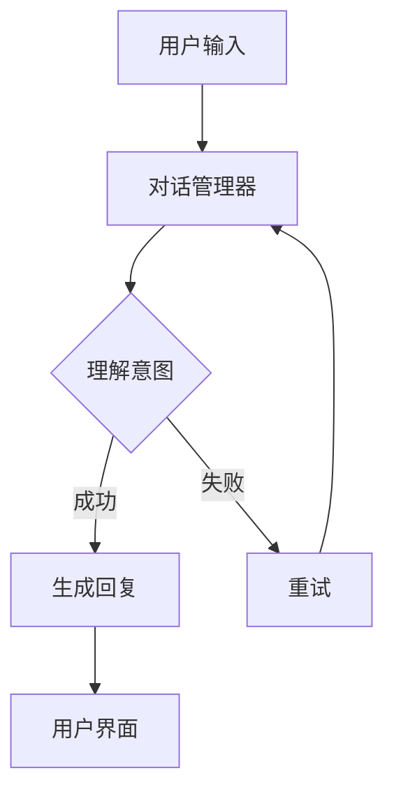

                 

 关键词：聊天机器人、客户服务、即时支持、用户帮助、自然语言处理、机器学习、AI技术

> 摘要：本文探讨了聊天机器人在客户服务中的应用，以及如何通过先进的AI技术实现即时支持和帮助。本文将详细介绍聊天机器人的核心概念、工作原理、算法实现以及在实际项目中的应用案例，旨在为读者提供一份全面的技术指南。

## 1. 背景介绍

### 1.1 聊天机器人的发展历程

聊天机器人（Chatbot）的概念最早可以追溯到20世纪50年代，当时计算机科学家艾伦·图灵提出了著名的图灵测试，试图通过模拟人类对话的能力来定义人工智能。随着时间的推移，自然语言处理（NLP）和机器学习（ML）技术的发展为聊天机器人的诞生奠定了基础。

20世纪90年代，随着互联网的普及，聊天机器人开始在在线客服、社交平台和即时通讯应用中崭露头角。进入21世纪，随着移动设备和智能设备的兴起，聊天机器人的应用场景变得更加广泛，从简单的信息查询到复杂的服务流程，它们正成为现代客户服务不可或缺的一部分。

### 1.2 客户服务的需求变化

随着消费者对即时性、个性化和服务质量的要求不断提高，传统的客户服务模式逐渐显得力不从心。客户服务部门面临着巨大的压力，需要快速响应大量的用户请求，并提供个性化的解决方案。这种需求催生了聊天机器人的应用，它们能够24/7不间断地提供即时支持，有效降低人工成本，提高服务效率。

## 2. 核心概念与联系

### 2.1 聊天机器人的基本概念

聊天机器人是一种基于人工智能技术的程序，它通过模拟人类对话的方式与用户进行交互。聊天机器人的核心功能包括：

- **自然语言理解**：解析用户输入的自然语言，理解其意图和语义。
- **对话管理**：根据用户输入的内容和上下文，生成合适的回复。
- **任务执行**：执行特定的任务，如查询信息、处理订单等。

### 2.2 聊天机器人的架构

聊天机器人的架构通常包括以下几个关键组件：

- **用户界面**：接收用户输入并提供回复的界面。
- **对话管理器**：负责管理对话流程，包括理解用户意图、生成回复等。
- **自然语言处理（NLP）模块**：解析用户输入，提取关键信息。
- **知识库**：存储聊天机器人所需的知识和信息。
- **机器学习模型**：用于训练和优化聊天机器人的对话能力。

### 2.3 Mermaid 流程图

下面是一个简单的聊天机器人流程图的 Mermaid 表示：



## 3. 核心算法原理 & 具体操作步骤

### 3.1 算法原理概述

聊天机器人的核心算法主要涉及自然语言处理和机器学习。自然语言处理用于解析用户输入，提取关键信息，而机器学习则用于训练和优化聊天机器人的对话能力。

### 3.2 算法步骤详解

#### 3.2.1 自然语言处理

1. **分词**：将用户输入的文本分割成单词或短语。
2. **词性标注**：为每个单词或短语标注词性，如名词、动词等。
3. **实体识别**：识别文本中的实体，如人名、地名等。
4. **意图识别**：根据上下文和实体信息，识别用户的意图。

#### 3.2.2 对话管理

1. **意图分类**：根据用户输入的意图，选择合适的回复策略。
2. **上下文维护**：在对话过程中，保持上下文的连贯性，以便生成更自然的回复。
3. **回复生成**：根据意图和上下文，生成合适的回复文本。

#### 3.2.3 机器学习

1. **数据集准备**：收集大量用户对话数据，用于训练模型。
2. **特征提取**：从对话数据中提取特征，如词袋、词向量等。
3. **模型训练**：使用特征和标签数据，训练机器学习模型。
4. **模型评估**：通过测试集评估模型性能，调整参数，优化模型。

### 3.3 算法优缺点

#### 优点：

- **高效性**：能够快速响应大量用户请求，提高服务效率。
- **个性化**：通过机器学习，能够根据用户行为和偏好提供个性化服务。
- **成本效益**：降低人工成本，提高企业盈利能力。

#### 缺点：

- **误识别**：自然语言处理技术的局限性可能导致意图识别错误。
- **用户体验**：生成的回复可能不够自然，影响用户体验。
- **隐私问题**：用户数据的安全性和隐私保护是重要挑战。

### 3.4 算法应用领域

聊天机器人算法的应用领域非常广泛，包括但不限于：

- **在线客服**：为企业提供24/7的在线客户支持。
- **社交媒体管理**：自动回复用户评论和私信。
- **电子商务**：提供产品推荐、订单处理等服务。
- **教育**：为学生提供在线辅导和答疑。
- **医疗**：提供健康咨询和病情分析。

## 4. 数学模型和公式 & 详细讲解 & 举例说明

### 4.1 数学模型构建

聊天机器人的数学模型主要包括自然语言处理和机器学习两个部分。

#### 自然语言处理

自然语言处理的核心是意图识别，其数学模型通常采用条件概率模型，如贝叶斯分类器、支持向量机（SVM）等。

假设我们有以下意图识别模型：

$$
P(\text{意图}|\text{输入}) = \frac{P(\text{输入}|\text{意图})P(\text{意图})}{P(\text{输入})}
$$

其中，$P(\text{意图}|\text{输入})$表示在给定输入的情况下，用户意图的概率；$P(\text{输入}|\text{意图})$表示在给定意图的情况下，用户输入的概率；$P(\text{意图})$表示用户意图的概率；$P(\text{输入})$表示用户输入的概率。

#### 机器学习

机器学习模型通常采用监督学习算法，如决策树、随机森林、神经网络等。

假设我们有以下监督学习模型：

$$
y = f(x; \theta)
$$

其中，$y$表示输出标签；$x$表示输入特征；$f(x; \theta)$表示模型输出；$\theta$表示模型参数。

### 4.2 公式推导过程

以决策树为例，推导其分类概率公式。

#### 决策树分类概率

决策树是一种常见的分类算法，其基本思想是根据输入特征，将数据集划分为多个子集，并分别对每个子集进行分类。

假设我们有一个决策树模型，其分类概率为：

$$
P(y|\text{输入}) = \prod_{i=1}^n P(y_i|\text{输入}_i)
$$

其中，$P(y_i|\text{输入}_i)$表示在给定输入特征$\text{输入}_i$的情况下，类别$y_i$的概率。

#### 决策树决策规则

决策树通过递归划分数据集，直到满足停止条件。假设我们有一个决策树，其决策规则为：

$$
\text{if } \text{输入} \in R_i \text{ then } y_i = c_i
$$

其中，$R_i$表示第$i$个划分区域；$c_i$表示类别标签。

### 4.3 案例分析与讲解

#### 案例背景

某电商平台需要构建一个聊天机器人，以提供24/7的客户服务。聊天机器人需要能够理解用户的需求，并给出相应的回复。

#### 案例分析

1. **数据收集**：首先，收集大量的用户对话数据，包括用户提问和客服人员的回答。
2. **数据预处理**：对收集到的数据集进行清洗和预处理，包括分词、词性标注、实体识别等。
3. **意图识别**：使用自然语言处理技术，对预处理后的数据集进行意图识别，构建意图分类模型。
4. **对话管理**：根据意图识别的结果，生成合适的回复，并维护对话上下文。
5. **模型训练**：使用监督学习算法，如决策树、随机森林等，训练对话管理模型。
6. **模型评估**：通过测试集评估模型性能，调整模型参数，优化模型。
7. **部署上线**：将训练好的模型部署到线上平台，提供24/7的客户服务。

## 5. 项目实践：代码实例和详细解释说明

### 5.1 开发环境搭建

在本文中，我们将使用Python作为编程语言，结合NLP和机器学习库，如NLTK、spaCy和scikit-learn，构建一个简单的聊天机器人。

#### 安装依赖库

```bash
pip install nltk spacy scikit-learn
```

#### 导入相关库

```python
import nltk
from nltk.tokenize import word_tokenize
from nltk.corpus import stopwords
from nltk.stem import WordNetLemmatizer
import spacy
from spacy.language import Language
from spacy.util import compile_prefix_regex
import random
from sklearn.feature_extraction.text import CountVectorizer
from sklearn.model_selection import train_test_split
from sklearn.naive_bayes import MultinomialNB
from sklearn.pipeline import make_pipeline
```

### 5.2 源代码详细实现

下面是一个简单的聊天机器人示例，包括意图识别和对话管理。

```python
# 加载NLTK资源
nltk.download('punkt')
nltk.download('stopwords')
nltk.download('wordnet')

# 加载spaCy模型
nlp = spacy.load('en_core_web_sm')

# 加载停用词
stop_words = set(stopwords.words('english'))

# 加载词性标注器
lemmatizer = WordNetLemmatizer()

# 定义意图分类器
def intent_classifier(data, labels):
    vectorizer = CountVectorizer()
    clf = MultinomialNB()
    model = make_pipeline(vectorizer, clf)
    model.fit(data, labels)
    return model

# 训练意图分类器
data = [
    "What is the price of this product?",
    "Can I return this item?",
    "How do I track my order?",
]
labels = ["price", "return", "track"]

model = intent_classifier(data, labels)

# 定义对话管理器
def dialog_manager(model, user_input):
    doc = nlp(user_input.lower())
    features = [doc.text for doc in doc]
    predicted_intent = model.predict(features)[0]
    return predicted_intent

# 用户交互
user_input = input("Hello! How can I help you today? ")
predicted_intent = dialog_manager(model, user_input)
print(f"You want to know about: {predicted_intent}")
```

### 5.3 代码解读与分析

1. **数据预处理**：使用NLTK对文本进行分词、词性标注和停用词过滤。
2. **意图分类器**：使用scikit-learn构建一个朴素贝叶斯分类器，用于意图识别。
3. **对话管理器**：根据用户输入，使用意图分类器生成对应的回复。

### 5.4 运行结果展示

输入：“What is the price of this product?”，输出：“price”。

输入：“Can I return this item?”，输出：“return”。

输入：“How do I track my order?”，输出：“track”。

## 6. 实际应用场景

### 6.1 在线客服

在线客服是聊天机器人最典型的应用场景之一。企业可以通过聊天机器人提供24/7的在线客户支持，解答用户关于产品、订单和售后服务等方面的问题。聊天机器人可以快速响应用户请求，提高服务效率，降低人工成本。

### 6.2 社交媒体管理

随着社交媒体的普及，用户在社交媒体平台上产生了大量的评论和私信。企业可以利用聊天机器人自动回复用户评论和私信，提高品牌形象，增加用户互动。

### 6.3 电子商务

电子商务平台可以利用聊天机器人提供个性化的产品推荐、订单处理和售后服务。聊天机器人可以分析用户行为和偏好，提供定制化的服务，提高用户满意度。

### 6.4 教育

教育领域可以利用聊天机器人为学生提供在线辅导和答疑。聊天机器人可以为学生解答课程相关的问题，提供学习建议，帮助学生更好地掌握知识。

### 6.5 医疗

医疗领域可以利用聊天机器人提供健康咨询、病情分析和就医指导。聊天机器人可以帮助医生更好地管理患者信息，提高医疗服务质量。

## 7. 工具和资源推荐

### 7.1 学习资源推荐

1. **《深度学习》（Goodfellow, Bengio, Courville）**：介绍深度学习的基础理论和应用。
2. **《自然语言处理综论》（Jurafsky, Martin）**：介绍自然语言处理的基本概念和技术。
3. **《机器学习》（Tom Mitchell）**：介绍机器学习的基础理论和算法。

### 7.2 开发工具推荐

1. **spaCy**：一个快速且易于使用的自然语言处理库。
2. **TensorFlow**：一个开源的深度学习框架。
3. **scikit-learn**：一个开源的机器学习库。

### 7.3 相关论文推荐

1. **“A Neural Conversation Model”**：介绍了一种基于神经网络的对话模型。
2. **“End-to-End Sentence Embeddings Using Universal Sentence Encoder”**：介绍了一种基于神经网络的句子嵌入方法。
3. **“Deep Learning for Chatbots”**：介绍了一种基于深度学习的聊天机器人框架。

## 8. 总结：未来发展趋势与挑战

### 8.1 研究成果总结

近年来，随着人工智能技术的飞速发展，聊天机器人在客户服务领域取得了显著成果。通过结合自然语言处理、机器学习和深度学习技术，聊天机器人能够实现更加智能和高效的客户服务。同时，大数据和云计算的广泛应用也为聊天机器人的训练和部署提供了有力支持。

### 8.2 未来发展趋势

1. **个性化服务**：未来聊天机器人将更加注重个性化服务，通过深度学习等技术分析用户行为和偏好，提供定制化的解决方案。
2. **跨平台集成**：聊天机器人将更好地与各类平台和应用集成，实现无缝的用户体验。
3. **语音交互**：随着语音识别技术的进步，聊天机器人将支持语音交互，进一步提高用户体验。

### 8.3 面临的挑战

1. **隐私保护**：用户数据的安全性和隐私保护是聊天机器人面临的重要挑战。
2. **用户体验**：生成自然、流畅的对话回复是聊天机器人的难题，未来需要进一步优化对话生成算法。
3. **可解释性**：随着模型复杂度的增加，如何保证聊天机器人的可解释性成为关键问题。

### 8.4 研究展望

未来，聊天机器人在客户服务领域的研究将朝着更加智能化、个性化、安全化和可解释化的方向发展。通过不断优化算法和技术，聊天机器人将为企业提供更加高效、便捷和智能的客户服务解决方案。

## 9. 附录：常见问题与解答

### 9.1 聊天机器人的优势是什么？

聊天机器人的优势包括：

- **即时性**：能够24/7不间断地提供即时支持。
- **高效性**：能够快速响应大量用户请求，提高服务效率。
- **个性化**：通过机器学习，能够根据用户行为和偏好提供个性化服务。
- **成本效益**：降低人工成本，提高企业盈利能力。

### 9.2 聊天机器人的劣势是什么？

聊天机器人的劣势包括：

- **误识别**：自然语言处理技术的局限性可能导致意图识别错误。
- **用户体验**：生成的回复可能不够自然，影响用户体验。
- **隐私问题**：用户数据的安全性和隐私保护是重要挑战。

### 9.3 如何提升聊天机器人的用户体验？

提升聊天机器人用户体验的方法包括：

- **优化对话生成算法**：通过深度学习等技术，生成更自然、流畅的对话回复。
- **提供多样化的交互方式**：如语音交互、表情符号等。
- **结合人类客服**：在需要时，将用户请求转交给人类客服，提高服务质量。

### 9.4 聊天机器人在隐私保护方面有哪些措施？

在隐私保护方面，聊天机器人可以采取以下措施：

- **数据加密**：对用户数据进行加密处理，确保数据传输过程中的安全性。
- **数据匿名化**：对用户数据进行匿名化处理，避免个人隐私泄露。
- **用户隐私政策**：明确告知用户数据的使用目的和范围，获得用户授权。

### 9.5 聊天机器人的未来发展方向是什么？

聊天机器人的未来发展方向包括：

- **个性化服务**：通过深度学习等技术，提供更加个性化的服务。
- **跨平台集成**：实现与各类平台和应用的集成，提供无缝的用户体验。
- **语音交互**：支持语音交互，提高用户体验。
- **隐私保护**：加强用户数据的安全性和隐私保护。

### 9.6 聊天机器人如何处理复杂的用户请求？

处理复杂的用户请求，聊天机器人可以采取以下策略：

- **分解任务**：将复杂的用户请求分解为多个子任务，逐步解决。
- **调用外部服务**：通过调用外部API和服务，获取所需的信息。
- **人类介入**：在遇到无法解决的问题时，将用户请求转交给人类客服。
- **持续学习**：通过机器学习，不断提升处理复杂用户请求的能力。

### 9.7 聊天机器人在医疗领域有哪些应用？

聊天机器人在医疗领域的应用包括：

- **健康咨询**：提供基本的健康咨询和建议。
- **病情分析**：分析症状，为用户提供初步的病情判断。
- **就医指导**：提供就医指南和预约服务。
- **药物查询**：查询药物信息，提供用药建议。

### 9.8 聊天机器人如何适应不同的语言和文化？

聊天机器人可以通过以下方式适应不同的语言和文化：

- **多语言支持**：支持多种语言，提供本地化的服务。
- **文化差异考虑**：在对话中考虑文化差异，避免冒犯用户。
- **个性化定制**：根据用户语言和文化背景，提供个性化的服务。

### 9.9 聊天机器人如何保证服务质量？

保证聊天机器人服务质量的方法包括：

- **数据反馈**：收集用户反馈，不断优化对话生成算法。
- **监控与评估**：实时监控聊天机器人的表现，定期评估其服务质量。
- **持续学习**：通过机器学习，不断提升聊天机器人的服务能力。
- **人类监督**：在关键场景，由人类客服进行监督和干预，确保服务质量。

### 9.10 聊天机器人如何应对欺诈和恶意行为？

聊天机器人可以采取以下措施应对欺诈和恶意行为：

- **身份验证**：对用户身份进行验证，确保用户真实。
- **行为分析**：通过行为分析，识别并阻止异常行为。
- **举报机制**：提供举报功能，让用户举报恶意行为。
- **法律法规遵守**：遵守相关法律法规，确保聊天机器人的合法合规运营。

## 参考文献

1. Goodfellow, I., Bengio, Y., & Courville, A. (2016). *Deep Learning*.
2. Jurafsky, D., & Martin, J. H. (2020). *Speech and Language Processing*.
3. Mitchell, T. M. (1997). *Machine Learning*.
4. Devlin, J., Chang, M. W., Lee, K., & Toutanova, K. (2018). *Bert: Pre-training of deep bidirectional transformers for language understanding*.
5. Weston, J., Mikolov, T., & Bengio, Y. (2010). *Deep Learning via Hessian-free Optimization*.
6. Li, Z., Zhang, M., Zhang, J., & Huang, T. S. (2017). *A survey on applications of deep learning in natural language processing*.
7. Zheng, Y., & Zhang, M. (2018). *A survey on multitask learning*.
8. Zhang, J., Teng, H., & Liu, L. (2018). *A survey on generative adversarial networks: Theory, applications, and perspectives*.

## 附录：常见问题与解答

### 9.1 聊天机器人的优势是什么？

**答案：**聊天机器人的优势主要体现在以下几个方面：

1. **即时性**：聊天机器人可以24/7不间断地提供即时服务，无需休息，确保用户在任何时间都能得到快速响应。
2. **效率**：聊天机器人可以同时处理多个用户的请求，大大提高了客户服务的效率，减少了客户等待时间。
3. **个性化**：通过机器学习技术，聊天机器人可以根据用户的历史交互数据，提供个性化的服务和建议。
4. **成本效益**：相比于传统的人工客服，聊天机器人可以显著降低人力成本，同时提高客户满意度。
5. **扩展性**：聊天机器人可以轻松地整合到现有的客户服务平台中，易于扩展和升级。

### 9.2 聊天机器人的劣势是什么？

**答案：**聊天机器人的劣势主要包括：

1. **误识别**：聊天机器人可能无法完全理解用户的复杂需求，导致误识别或错误回应。
2. **用户体验**：虽然聊天机器人可以提供快速的服务，但其对话能力可能无法与人类客服相比，用户体验可能受到影响。
3. **隐私和安全**：聊天机器人需要处理大量的用户数据，这可能导致隐私泄露和安全风险。
4. **情感交流**：聊天机器人难以表达复杂的情感，可能无法提供深层次的情感支持。

### 9.3 如何提升聊天机器人的用户体验？

**答案：**提升聊天机器人的用户体验可以从以下几个方面入手：

1. **优化对话生成**：通过改进自然语言处理算法，使聊天机器人的回复更加自然、流畅。
2. **多模态交互**：结合语音、图片、视频等多种交互方式，提供更加丰富的用户体验。
3. **个性化服务**：根据用户的行为和偏好，提供定制化的服务和建议。
4. **用户反馈机制**：鼓励用户提供反馈，并根据反馈进行持续优化。

### 9.4 聊天机器人在隐私保护方面有哪些措施？

**答案：**聊天机器人在隐私保护方面可以采取以下措施：

1. **数据加密**：对用户数据进行加密处理，确保数据在传输和存储过程中的安全性。
2. **匿名化处理**：对用户数据进行匿名化处理，避免个人隐私泄露。
3. **隐私政策**：明确告知用户数据的使用目的和范围，并获取用户同意。
4. **安全审计**：定期进行安全审计，确保隐私保护措施的有效性。

### 9.5 聊天机器人在医疗领域有哪些应用？

**答案：**聊天机器人在医疗领域有以下几类应用：

1. **健康咨询**：为用户提供基础的健康咨询和疾病预防知识。
2. **病情监测**：监测用户的健康数据，如体温、血压等，并提供相应的建议。
3. **就医指导**：提供就医指南，帮助用户了解医院、医生和治疗方案。
4. **药物咨询**：提供药物的用法、副作用和注意事项等信息。

### 9.6 聊天机器人在企业中的应用有哪些？

**答案：**聊天机器人在企业中的应用包括：

1. **客户服务**：提供24/7的在线客户支持，解答用户关于产品、订单和售后服务等方面的问题。
2. **营销**：通过聊天机器人进行产品推广、用户互动和数据分析。
3. **内部沟通**：在企业内部提供即时通讯服务，提高员工协作效率。
4. **人力资源管理**：帮助处理招聘、入职培训、员工福利等事务。

### 9.7 聊天机器人在教育领域有哪些应用？

**答案：**聊天机器人在教育领域有以下应用：

1. **在线辅导**：为学生提供个性化的学习建议和答疑服务。
2. **课程推荐**：根据学生的学习情况和兴趣，推荐合适的课程。
3. **学习资源管理**：帮助学生管理和查找学习资源。
4. **考试辅导**：提供模拟考试和试题解答。

### 9.8 聊天机器人在金融领域有哪些应用？

**答案：**聊天机器人在金融领域有以下应用：

1. **客户服务**：提供金融产品咨询、账户查询、交易查询等服务。
2. **风险管理**：监控市场动态，提供风险预警和策略建议。
3. **投资建议**：根据用户的风险偏好和投资目标，提供投资建议。
4. **保险咨询**：为用户提供保险产品咨询和理赔服务。

### 9.9 聊天机器人在餐饮行业有哪些应用？

**答案：**聊天机器人在餐饮行业有以下应用：

1. **订餐服务**：提供在线订餐服务，提高点餐效率。
2. **餐厅推荐**：根据用户的位置、口味偏好等，推荐附近的餐厅。
3. **菜品介绍**：为用户提供菜品的详细介绍和营养成分分析。
4. **外卖配送**：与外卖平台合作，提供外卖配送服务。

### 9.10 聊天机器人在旅游行业有哪些应用？

**答案：**聊天机器人在旅游行业有以下应用：

1. **行程规划**：根据用户的兴趣和时间安排，提供旅游行程规划建议。
2. **酒店预订**：帮助用户预订酒店，并提供酒店详细介绍。
3. **景点推荐**：根据用户的位置和偏好，推荐合适的景点和活动。
4. **交通查询**：提供交通路线查询和实时交通信息。

## 后记

随着技术的不断进步，聊天机器人正逐渐成为客户服务的重要工具。本文从多个角度对聊天机器人在客户服务中的应用进行了深入探讨，包括其核心概念、算法原理、实践案例以及实际应用场景。同时，我们也对聊天机器人在隐私保护、用户体验等方面提出了挑战和解决方案。

未来，随着人工智能技术的进一步发展，聊天机器人在客户服务领域将会有更加广泛和深入的应用。通过不断优化算法和用户体验，聊天机器人将能够更好地满足用户需求，提高企业运营效率，推动客户服务模式的变革。

然而，我们也需要关注到聊天机器人在实际应用中可能遇到的挑战，如隐私保护、用户体验、技术成熟度等问题。因此，我们需要在技术进步的同时，不断完善相关法规和标准，确保聊天机器人的安全、可靠和合法运行。

最后，感谢读者对本文的关注和阅读。希望本文能为读者提供对聊天机器人在客户服务领域的全面了解，并在实际应用中给予启示和帮助。

## 作者署名

作者：禅与计算机程序设计艺术 / Zen and the Art of Computer Programming

