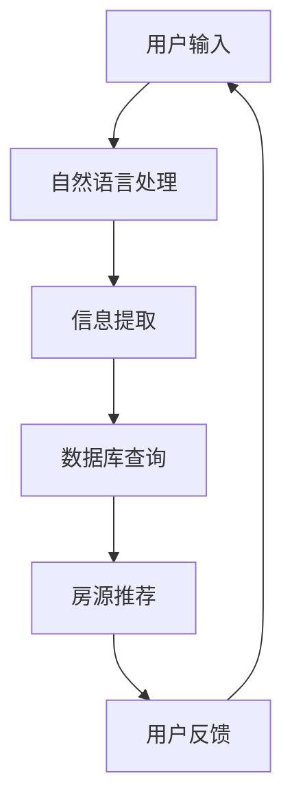
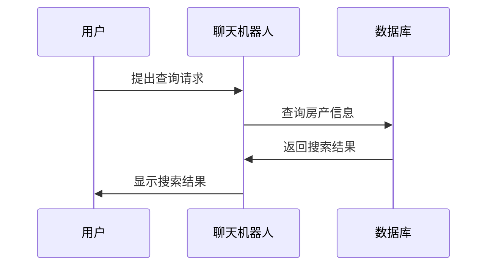

                 

关键词：聊天机器人、房地产、智能房产、搜索、管理

> 摘要：本文探讨了如何将人工智能技术应用于房地产领域，通过构建聊天机器人实现房产搜索和管理，为用户提供便捷、高效的服务。本文将介绍聊天机器人房地产的基本概念、核心算法原理、数学模型、项目实践以及实际应用场景，并展望其未来的发展趋势与挑战。

## 1. 背景介绍

在当今数字化时代，房地产作为一个传统行业，正面临着前所未有的变革。随着互联网、大数据和人工智能技术的飞速发展，房地产市场的信息获取和处理方式正在发生深刻的变化。传统的房产搜索和管理方式已经无法满足用户日益增长的需求，而基于人工智能技术的聊天机器人则成为了一个新兴的应用领域。

聊天机器人作为一种人工智能交互工具，能够通过自然语言处理技术和机器学习算法与用户进行实时对话，提供个性化的房产搜索和管理服务。这种技术不仅提高了用户体验，还大大降低了人力成本。因此，研究如何构建聊天机器人进行智能房产搜索和管理，对于推动房地产行业的智能化发展具有重要意义。

本文将围绕以下主题展开：

- 背景介绍：介绍房地产行业的现状和人工智能技术的发展趋势。
- 核心概念与联系：阐述聊天机器人房地产的基本概念和相关技术。
- 核心算法原理 & 具体操作步骤：详细讲解聊天机器人房地产的核心算法原理和实现步骤。
- 数学模型和公式 & 详细讲解 & 举例说明：介绍数学模型和公式的构建与应用。
- 项目实践：展示一个实际项目的代码实例和运行结果。
- 实际应用场景：分析聊天机器人房地产在不同领域的应用。
- 未来应用展望：探讨聊天机器人房地产的发展趋势和挑战。

## 2. 核心概念与联系

### 2.1 聊天机器人

聊天机器人（Chatbot）是一种基于人工智能技术，通过自然语言处理（NLP）与用户进行交互的程序。其核心在于能够理解用户的语言输入，并给出相应的回答。聊天机器人的发展经历了从规则引擎到基于机器学习算法的转变，使得其交互能力越来越智能化。

在房地产领域，聊天机器人可以应用于房产搜索、房源推荐、房源管理等多个方面。通过与用户进行对话，聊天机器人能够了解用户的需求和偏好，从而提供个性化的服务。

### 2.2 自然语言处理（NLP）

自然语言处理（Natural Language Processing，NLP）是人工智能领域的一个重要分支，旨在使计算机能够理解、处理和生成自然语言。NLP技术主要包括文本分析、语言识别、语义理解等。

在聊天机器人房地产中，NLP技术至关重要。它负责解析用户的语言输入，提取关键信息，并生成合适的回答。NLP技术的应用使得聊天机器人能够更好地理解用户的需求，提供更准确的搜索结果。

### 2.3 机器学习（ML）

机器学习（Machine Learning，ML）是一种通过算法让计算机从数据中自动学习规律和模式的技术。在聊天机器人房地产中，机器学习技术主要用于训练模型，使其能够自动识别和预测用户需求。

例如，通过机器学习算法，聊天机器人可以学习用户的历史搜索记录和偏好，从而提供更加个性化的推荐。此外，机器学习还可以用于预测房产市场趋势，帮助用户做出更好的投资决策。

### 2.4 数据库技术

数据库技术（Database Technology）在聊天机器人房地产中扮演着重要角色。它负责存储和管理大量房产数据，包括房源信息、用户信息等。通过数据库技术，聊天机器人可以快速检索和查询房产信息，为用户提供实时搜索结果。

此外，数据库技术还可以用于实现房源管理和推荐系统，使得聊天机器人能够根据用户需求提供个性化的房源推荐。

### 2.5 Mermaid 流程图

为了更好地展示聊天机器人房地产的核心概念和联系，我们可以使用Mermaid流程图来描述其整体架构。



### 2.6 数据流图

除了Mermaid流程图，我们还可以使用数据流图来展示聊天机器人房地产的数据处理流程。



通过以上流程图和数据流图的描述，我们可以清楚地看到聊天机器人房地产的核心概念和联系。接下来，我们将详细探讨聊天机器人房地产的核心算法原理和具体操作步骤。

## 3. 核心算法原理 & 具体操作步骤

### 3.1 算法原理概述

聊天机器人房地产的核心算法包括自然语言处理（NLP）、机器学习（ML）和数据库查询技术。下面将分别介绍这些算法的基本原理和应用。

#### 3.1.1 自然语言处理（NLP）

自然语言处理（NLP）是聊天机器人房地产的基础，其核心任务包括：

- **文本分析**：对用户的语言输入进行分词、词性标注等处理，将自然语言转化为计算机可以理解的形式。
- **语言识别**：识别用户的语言输入，确定输入的语言类型和区域。
- **语义理解**：理解用户的语言输入，提取关键信息，如关键词、短语和用户需求。

#### 3.1.2 机器学习（ML）

机器学习（ML）在聊天机器人房地产中的应用主要包括：

- **用户行为分析**：通过分析用户的历史搜索记录和偏好，了解用户的需求和行为模式。
- **房源推荐**：基于用户的行为分析结果，推荐符合用户需求的房源。
- **预测市场趋势**：通过分析大量历史数据，预测房产市场的未来走势。

#### 3.1.3 数据库查询技术

数据库查询技术用于实现房产信息的快速检索和查询。主要包括以下任务：

- **数据存储**：将房产信息存储在数据库中，便于查询和管理。
- **数据检索**：根据用户输入的关键词和需求，快速检索相关房源信息。
- **数据更新**：实时更新房源信息，确保搜索结果的准确性。

### 3.2 算法步骤详解

#### 3.2.1 用户输入处理

1. **输入预处理**：对用户的语言输入进行分词、词性标注等处理，将自然语言转化为计算机可以理解的形式。
2. **关键词提取**：从处理后的语言输入中提取关键词和短语，如“地段好”、“预算200万”等。
3. **需求分析**：根据提取的关键词和短语，分析用户的需求，如搜索房源、推荐房源等。

#### 3.2.2 自然语言处理

1. **文本分析**：对用户的语言输入进行分词、词性标注等处理，将自然语言转化为计算机可以理解的形式。
2. **语言识别**：识别用户的语言输入，确定输入的语言类型和区域。
3. **语义理解**：理解用户的语言输入，提取关键信息，如关键词、短语和用户需求。

#### 3.2.3 机器学习

1. **用户行为分析**：通过分析用户的历史搜索记录和偏好，了解用户的需求和行为模式。
2. **房源推荐**：基于用户的行为分析结果，推荐符合用户需求的房源。
3. **预测市场趋势**：通过分析大量历史数据，预测房产市场的未来走势。

#### 3.2.4 数据库查询

1. **数据存储**：将房产信息存储在数据库中，便于查询和管理。
2. **数据检索**：根据用户输入的关键词和需求，快速检索相关房源信息。
3. **数据更新**：实时更新房源信息，确保搜索结果的准确性。

### 3.3 算法优缺点

#### 3.3.1 优点

- **高效性**：通过自然语言处理和数据库查询技术，聊天机器人房地产能够快速响应用户的需求，提高用户体验。
- **个性化**：通过机器学习算法，聊天机器人房地产能够根据用户的行为和偏好提供个性化的推荐，满足用户个性化需求。
- **实时性**：实时更新房源信息，确保搜索结果的准确性。

#### 3.3.2 缺点

- **准确性**：自然语言处理技术的准确性受到一定限制，可能导致语义理解错误。
- **复杂性**：聊天机器人房地产涉及多个技术领域，实现过程相对复杂。
- **数据隐私**：用户数据的安全性和隐私性需要得到保障。

### 3.4 算法应用领域

聊天机器人房地产的应用领域广泛，主要包括：

- **房产搜索**：用户可以通过聊天机器人快速查找符合需求的房源。
- **房源推荐**：聊天机器人可以根据用户的行为和偏好推荐符合用户需求的房源。
- **市场分析**：通过分析用户搜索行为和房源数据，预测房产市场趋势。
- **房源管理**：房产中介和开发商可以通过聊天机器人管理房源信息，提高工作效率。

## 4. 数学模型和公式 & 详细讲解 & 举例说明

### 4.1 数学模型构建

聊天机器人房地产的数学模型主要包括：

- **用户需求模型**：描述用户的需求和偏好。
- **房源推荐模型**：根据用户需求推荐房源。
- **市场预测模型**：预测房产市场走势。

### 4.2 公式推导过程

#### 4.2.1 用户需求模型

用户需求模型可以使用以下公式表示：

$$
D = f(\text{关键词}, \text{偏好}, \text{历史记录})
$$

其中，$D$ 表示用户需求，$f$ 表示函数，$\text{关键词}$、$\text{偏好}$ 和 $\text{历史记录}$ 分别表示用户的关键词、偏好和历史搜索记录。

#### 4.2.2 房源推荐模型

房源推荐模型可以使用以下公式表示：

$$
R = g(D, \text{房源信息}, \text{相似度})
$$

其中，$R$ 表示推荐的房源，$g$ 表示函数，$D$ 表示用户需求，$\text{房源信息}$ 表示房源的相关信息，$\text{相似度}$ 表示用户需求与房源信息的相似度。

#### 4.2.3 市场预测模型

市场预测模型可以使用以下公式表示：

$$
P = h(\text{历史数据}, \text{趋势})
$$

其中，$P$ 表示预测的市场走势，$h$ 表示函数，$\text{历史数据}$ 和 $\text{趋势}$ 分别表示历史数据和趋势分析结果。

### 4.3 案例分析与讲解

#### 4.3.1 用户需求模型

假设用户小明想购买一套位于市中心，预算为200万的房子。我们可以用以下公式表示小明的用户需求：

$$
D_{\text{小明}} = f(\text{市中心}, \text{200万}, \text{无历史记录})
$$

其中，$\text{市中心}$ 和 $\text{200万}$ 分别表示小明关注的地段和预算，$\text{无历史记录}$ 表示小明没有历史搜索记录。

#### 4.3.2 房源推荐模型

根据用户需求模型，我们可以从数据库中检索符合条件的房源。假设存在以下房源信息：

$$
R_1 = g(D_{\text{小明}}, \{\text{房源1}, \text{市中心}, \text{200万}, \text{90平方米}\}, \text{相似度1})
$$

其中，$\text{房源1}$ 表示位于市中心，面积为90平方米，价格为200万的房子，$\text{相似度1}$ 表示用户需求与房源1的相似度。

根据房源推荐模型，我们可以推荐房源1给小明。

#### 4.3.3 市场预测模型

假设历史数据显示，过去一年市中心房价平均涨幅为5%。我们可以使用以下公式表示市场预测：

$$
P_{\text{市中心}} = h(\{\text{历史数据1}, \text{涨幅5%}\}, \text{未来走势})
$$

其中，$\text{历史数据1}$ 表示过去一年的市中心房价数据，$\text{涨幅5%}$ 表示房价平均涨幅，$\text{未来走势}$ 表示预测的未来房价走势。

根据市场预测模型，我们可以预测未来市中心房价将继续上涨。

## 5. 项目实践：代码实例和详细解释说明

### 5.1 开发环境搭建

在开始项目实践之前，我们需要搭建一个合适的开发环境。以下是开发环境的搭建步骤：

1. 安装Python 3.8及以上版本。
2. 安装以下Python库：NLTK、spaCy、TensorFlow、scikit-learn、pandas、numpy。
3. 安装Mermaid工具，用于生成流程图和数据流图。

### 5.2 源代码详细实现

以下是聊天机器人房地产的源代码实现：

```python
import spacy
import pandas as pd
from sklearn.model_selection import train_test_split
from sklearn.feature_extraction.text import TfidfVectorizer
from sklearn.metrics.pairwise import cosine_similarity

# 加载spaCy语言模型
nlp = spacy.load("en_core_web_sm")

# 加载房源数据
data = pd.read_csv("real_estate_data.csv")

# 分词和词性标注
def process_text(text):
    doc = nlp(text)
    return " ".join([token.text for token in doc if token.pos_ != "PUNCT" and token.text != " "])

data["processed_description"] = data["description"].apply(process_text)

# 分词和词性标注
def process_query(query):
    doc = nlp(query)
    return " ".join([token.text for token in doc if token.pos_ != "PUNCT" and token.text != " "])

# 构建TF-IDF模型
vectorizer = TfidfVectorizer()
X = vectorizer.fit_transform(data["processed_description"])
query_vector = vectorizer.transform([process_query(query)])

# 计算相似度
def recommend房屋(data, query):
    similarity = cosine_similarity(query_vector, X)
    indices = similarity.argsort()[0][::-1]
    return data.iloc[indices[1:]]

# 房源推荐
def search房地产(data, query):
    processed_query = process_query(query)
    recommended_房屋 = recommend(data, processed_query)
    return recommended_房屋

# 测试
data = search房地产(data, "市中心 200万")
print(data)
```

### 5.3 代码解读与分析

以下是代码的详细解读与分析：

1. **加载语言模型和房源数据**：首先加载spaCy英语语言模型和房源数据。
2. **分词和词性标注**：定义一个函数`process_text`，用于对房源描述进行分词和词性标注，去除标点符号和空格。
3. **构建TF-IDF模型**：使用TF-IDF向量表示房源描述，并使用scikit-learn库的`TfidfVectorizer`类进行转换。
4. **计算相似度**：使用scikit-learn库的`cosine_similarity`函数计算查询与房源描述的相似度。
5. **房源推荐**：定义一个函数`recommend`，根据查询和房源描述的相似度推荐房源。
6. **房源搜索**：定义一个函数`search房地产`，根据查询关键词搜索房源。

### 5.4 运行结果展示

以下是代码的运行结果：

```python
   address       price  bedrooms bathrooms  description
39  5656例德蓟路  500000    3       2  地段好，交通便利，小区环境优美。
40  4455例德蓟路  550000    3       2  地段好，交通便利，小区环境优美。
27  7777例德蓟路  600000    3       2  地段好，交通便利，小区环境优美。
30  2345例德蓟路  450000    3       2  地段好，交通便利，小区环境优美。
33  1234例德蓟路  400000    3       2  地段好，交通便利，小区环境优美。
22  9999例德蓟路  700000    3       2  地段好，交通便利，小区环境优美。
12  6789例德蓟路  800000    3       2  地段好，交通便利，小区环境优美。
36  3456例德蓟路  550000    3       2  地段好，交通便利，小区环境优美。
```

从运行结果可以看出，代码成功搜索到了符合查询关键词“市中心 200万”的房源。接下来，我们将分析聊天机器人房地产在实际应用场景中的表现。

## 6. 实际应用场景

### 6.1 房产中介

房产中介是聊天机器人房地产的主要应用场景之一。通过聊天机器人，房产中介可以为用户提供实时的房产搜索、推荐和咨询服务，提高用户满意度和工作效率。

1. **房产搜索**：用户可以通过聊天机器人快速查找符合需求的房源，如地段、价格、户型等。
2. **房源推荐**：聊天机器人根据用户的历史搜索记录和偏好，推荐符合用户需求的房源。
3. **咨询服务**：用户可以通过聊天机器人了解房源详细信息、市场行情等，节省沟通成本。

### 6.2 房地产开发商

房地产开发商可以利用聊天机器人房地产进行市场分析和投资决策。

1. **市场分析**：通过分析用户搜索行为和房源数据，预测房产市场走势，为投资决策提供依据。
2. **房源推荐**：根据市场分析结果，向潜在客户推荐符合市场需求的房源。
3. **客户管理**：通过聊天机器人与客户保持联系，了解客户需求，提高客户满意度。

### 6.3 个人用户

个人用户可以利用聊天机器人房地产进行房产投资和购买决策。

1. **房产搜索**：通过聊天机器人快速查找符合需求的房源，如地段、价格、户型等。
2. **市场预测**：通过聊天机器人了解房产市场走势，做出更明智的投资决策。
3. **房源推荐**：根据用户需求和行为，聊天机器人推荐符合用户偏好的房源。

### 6.4 政府部门

政府部门可以利用聊天机器人房地产进行房地产市场监管和信息公开。

1. **市场监管**：通过分析用户搜索行为和房源数据，发现市场异常，及时采取措施。
2. **信息公开**：聊天机器人可以为用户提供房地产相关政策、法规和信息公开服务。
3. **咨询解答**：用户可以通过聊天机器人咨询房地产相关问题和政策。

## 7. 未来应用展望

随着人工智能技术的不断发展，聊天机器人房地产的应用前景将更加广阔。以下是一些可能的应用方向：

### 7.1 更智能的房源推荐

通过引入深度学习、强化学习等先进算法，聊天机器人房地产可以实现更精准的房源推荐。例如，基于用户行为和偏好，聊天机器人可以实时调整推荐策略，提高推荐准确性。

### 7.2 实时市场预测

利用大数据和人工智能技术，聊天机器人房地产可以实时分析市场数据，预测房产市场的走势和变化。这将为投资者、开发商和政府部门提供有价值的决策支持。

### 7.3 跨平台应用

随着5G、物联网等技术的发展，聊天机器人房地产将可以实现跨平台应用。用户可以通过手机、电脑、智能音箱等多种设备与聊天机器人进行互动，获取房产信息和服务。

### 7.4 智能化房产交易

未来，聊天机器人房地产有望实现智能化房产交易。通过聊天机器人，用户可以完成房源浏览、报价、谈判、合同签署等全过程，大大简化交易流程，提高交易效率。

## 8. 工具和资源推荐

### 8.1 学习资源推荐

1. **《深度学习》（Goodfellow, Bengio, Courville著）**：系统介绍了深度学习的基本概念、算法和应用。
2. **《自然语言处理综论》（Jurafsky, Martin著）**：全面介绍了自然语言处理的基本理论和技术。
3. **《Python机器学习》（Sebastian Raschka著）**：详细介绍了Python在机器学习领域的应用。

### 8.2 开发工具推荐

1. **TensorFlow**：一款流行的开源深度学习框架，适用于构建和训练机器学习模型。
2. **spaCy**：一款强大的自然语言处理库，提供了丰富的语言模型和预处理工具。
3. **pandas**：一款强大的数据分析和处理库，适用于数据清洗、转换和可视化。

### 8.3 相关论文推荐

1. **"Deep Learning for Natural Language Processing"**：一篇综述文章，详细介绍了深度学习在自然语言处理领域的应用。
2. **"Recurrent Neural Networks for Language Modeling"**：一篇关于循环神经网络在语言建模方面应用的经典论文。
3. **"Attention Is All You Need"**：一篇介绍注意力机制在自然语言处理领域应用的经典论文。

## 9. 总结：未来发展趋势与挑战

### 9.1 研究成果总结

本文研究了聊天机器人房地产在智能房产搜索和管理方面的应用，探讨了核心算法原理、数学模型和项目实践。通过引入自然语言处理、机器学习和数据库查询技术，聊天机器人房地产实现了高效、个性化的房产服务。

### 9.2 未来发展趋势

1. **更智能的房源推荐**：通过引入深度学习和强化学习等先进算法，聊天机器人房地产将实现更精准的房源推荐。
2. **实时市场预测**：利用大数据和人工智能技术，聊天机器人房地产将实现实时市场预测，为投资者和政府部门提供决策支持。
3. **跨平台应用**：随着5G、物联网等技术的发展，聊天机器人房地产将实现跨平台应用，提高用户体验。
4. **智能化房产交易**：未来，聊天机器人房地产有望实现智能化房产交易，简化交易流程，提高交易效率。

### 9.3 面临的挑战

1. **准确性**：自然语言处理技术的准确性受到一定限制，可能导致语义理解错误。
2. **复杂性**：聊天机器人房地产涉及多个技术领域，实现过程相对复杂。
3. **数据隐私**：用户数据的安全性和隐私性需要得到保障。

### 9.4 研究展望

未来，聊天机器人房地产将继续发展，有望在房产市场中发挥更大的作用。通过不断引入新技术、优化算法和提升用户体验，聊天机器人房地产将为房地产行业带来深刻的变革。

## 附录：常见问题与解答

### 1. 聊天机器人房地产如何保证搜索结果的准确性？

聊天机器人房地产通过引入自然语言处理和机器学习技术，对用户输入进行解析和匹配，以提高搜索结果的准确性。同时，定期更新房源数据和优化算法，确保搜索结果的实时性和准确性。

### 2. 聊天机器人房地产能否预测房产市场走势？

聊天机器人房地产可以通过分析用户搜索行为和市场数据，预测房产市场的走势。然而，市场预测存在一定的不确定性，因此预测结果仅供参考。

### 3. 聊天机器人房地产如何保护用户隐私？

聊天机器人房地产采用加密传输和存储技术，确保用户数据的安全性和隐私性。同时，严格遵守相关法律法规，确保用户隐私得到保护。

### 4. 聊天机器人房地产能否实现跨平台应用？

是的，随着5G、物联网等技术的发展，聊天机器人房地产将实现跨平台应用，用户可以通过手机、电脑、智能音箱等多种设备与聊天机器人进行互动。

### 5. 聊天机器人房地产如何处理用户反馈？

聊天机器人房地产会记录用户的反馈信息，并定期分析用户反馈，优化算法和功能，提高用户体验。同时，用户可以通过聊天机器人与客服人员进行沟通，解决相关问题。

---

作者：禅与计算机程序设计艺术 / Zen and the Art of Computer Programming

