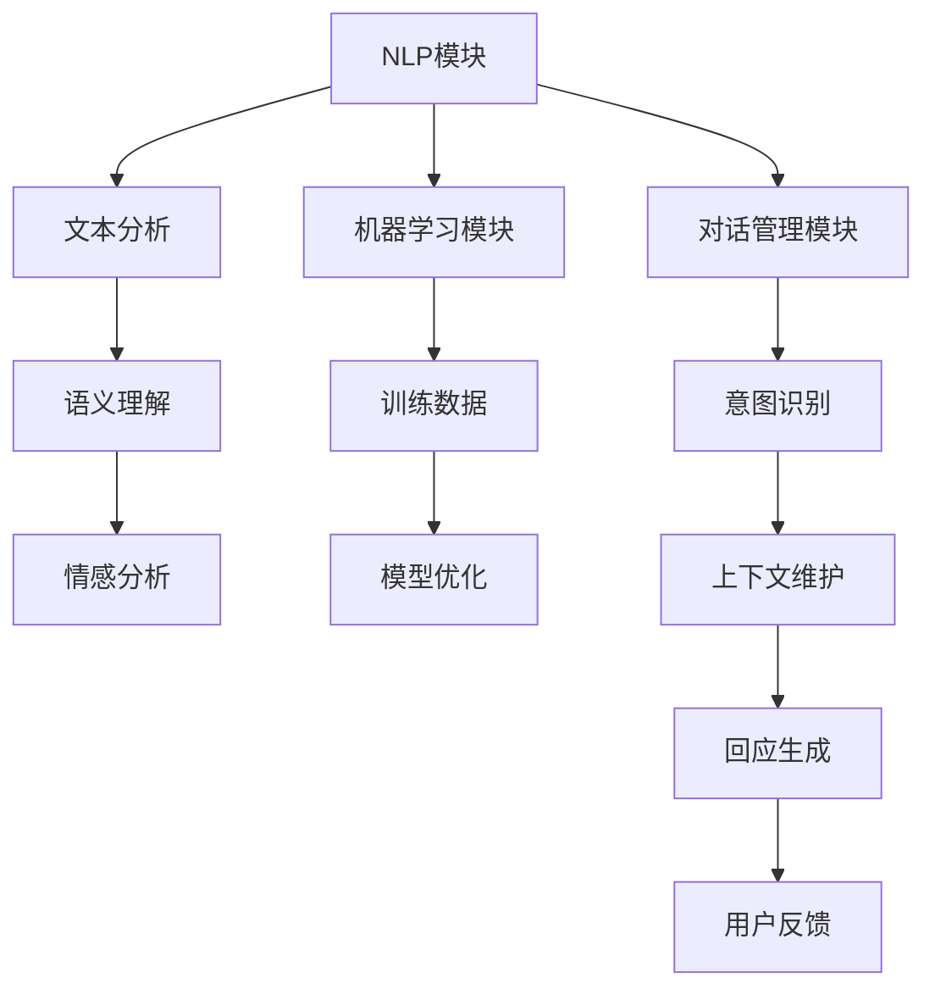

                 

 关键词：聊天机器人、创意项目、编程实践、人工智能、设计理念、开发工具、应用场景

> 摘要：本文旨在探讨聊天机器人的创意项目设计及其开发实践。通过对聊天机器人核心概念、算法原理、数学模型、项目实践和未来应用的深入分析，为读者提供全面的技术指导和灵感来源。

## 1. 背景介绍

随着互联网技术的飞速发展，人工智能在各个领域得到了广泛应用。聊天机器人作为人工智能的重要应用之一，已经成为企业客户服务、智能助手、在线教育等场景中的宠儿。然而，如何设计一款既实用又具备创意的聊天机器人，成为开发者和企业面临的一大挑战。

本文将从技术角度出发，探讨聊天机器人的创意项目设计及其开发实践，旨在为读者提供一套完整的解决方案，帮助开发者轻松实现高效、有趣的聊天机器人项目。

## 2. 核心概念与联系

### 2.1 聊天机器人定义

聊天机器人（Chatbot）是一种基于人工智能技术，模拟人类对话的计算机程序。它能够通过自然语言处理（NLP）技术，理解用户输入并生成合适的回应，从而实现人与机器的实时交互。

### 2.2 核心概念

- **自然语言处理（NLP）**：NLP是聊天机器人技术的核心，包括文本分析、语义理解、情感分析等。
- **机器学习（ML）**：ML技术用于训练聊天机器人，使其能够从数据中学习并不断优化性能。
- **对话管理（DM）**：对话管理负责处理对话流程，包括上下文维护、意图识别和回应生成等。

### 2.3 架构设计

以下是一个典型的聊天机器人架构设计，包含NLP模块、机器学习模块和对话管理模块：



## 3. 核心算法原理 & 具体操作步骤

### 3.1 算法原理概述

聊天机器人的核心算法包括NLP、机器学习和对话管理。以下分别介绍这三种算法的基本原理。

#### 3.1.1 自然语言处理（NLP）

NLP算法主要包括以下步骤：

1. **文本分析**：对用户输入的文本进行分词、词性标注等预处理。
2. **语义理解**：通过语义分析，提取文本的关键信息，理解用户意图。
3. **情感分析**：判断用户情感倾向，为回应生成提供依据。

#### 3.1.2 机器学习（ML）

机器学习算法主要包括以下步骤：

1. **数据收集**：收集大量对话数据，用于训练模型。
2. **特征提取**：将对话数据转化为计算机可处理的特征向量。
3. **模型训练**：使用机器学习算法训练模型，使其具备对话生成能力。
4. **模型优化**：通过不断调整模型参数，提高模型性能。

#### 3.1.3 对话管理（DM）

对话管理算法主要包括以下步骤：

1. **意图识别**：根据用户输入，识别用户意图。
2. **上下文维护**：跟踪对话上下文，确保回应的连贯性。
3. **回应生成**：根据用户意图和上下文，生成合适的回应。

### 3.2 算法步骤详解

#### 3.2.1 自然语言处理（NLP）

1. **文本分析**：使用分词工具（如jieba）对用户输入的文本进行分词。
2. **语义理解**：使用词向量模型（如Word2Vec）将词汇转化为向量，进行语义分析。
3. **情感分析**：使用情感分析库（如VADER）对文本进行情感倾向判断。

#### 3.2.2 机器学习（ML）

1. **数据收集**：从社交媒体、论坛等渠道收集大量对话数据。
2. **特征提取**：使用TF-IDF等方法将对话数据转化为特征向量。
3. **模型训练**：使用神经网络（如LSTM）训练模型。
4. **模型优化**：通过交叉验证和网格搜索等方法，优化模型参数。

#### 3.2.3 对话管理（DM）

1. **意图识别**：使用朴素贝叶斯、SVM等分类算法，对用户输入进行意图识别。
2. **上下文维护**：使用循环神经网络（如GRU）维护对话上下文。
3. **回应生成**：使用生成对抗网络（如GPT）生成合适的回应。

### 3.3 算法优缺点

#### 优点

- **高效性**：通过自动化处理，提高人机交互效率。
- **灵活性**：可以根据需求灵活调整算法和架构。
- **经济性**：降低企业人力成本，提高客户服务质量。

#### 缺点

- **准确性**：NLP和机器学习算法在处理复杂场景时，准确性仍有待提高。
- **交互体验**：在模拟人类对话方面，仍存在一定的差距。
- **隐私问题**：涉及用户数据的隐私保护，需严格遵循相关法律法规。

### 3.4 算法应用领域

- **客户服务**：企业客服、在线咨询等场景。
- **智能助手**：智能家居、虚拟客服等场景。
- **在线教育**：辅助教学、智能问答等场景。

## 4. 数学模型和公式

### 4.1 数学模型构建

聊天机器人中的数学模型主要包括词向量模型和生成模型。

#### 4.1.1 词向量模型

词向量模型将词汇映射为高维向量，用于表示词汇的语义信息。常用的词向量模型包括：

- **Word2Vec**：基于神经网络训练的词向量模型。
- **GloVe**：基于全局上下文的词向量模型。

#### 4.1.2 生成模型

生成模型用于生成文本，常见的生成模型包括：

- **LSTM（长短期记忆网络）**：用于序列数据建模。
- **GPT（生成预训练模型）**：用于生成长文本。

### 4.2 公式推导过程

#### 4.2.1 词向量模型

以Word2Vec为例，词向量模型基于神经网络训练，其核心公式如下：

\[ \text{word\_vector} = \text{softmax}(\text{W} \cdot \text{input}) \]

其中，\( \text{W} \) 为权重矩阵，\( \text{input} \) 为输入词向量。

#### 4.2.2 生成模型

以LSTM为例，生成模型的核心公式如下：

\[ \text{output} = \text{softmax}(\text{LSTM}(\text{input})) \]

其中，\( \text{LSTM} \) 为长短期记忆网络，用于处理序列数据。

### 4.3 案例分析与讲解

#### 4.3.1 词向量模型案例

假设输入词汇为“北京”，其对应的词向量表示为：

\[ \text{北京} = [1, 0, 0, 0, 0, 0, 0, 0, 0, 0, 0, 0, 0, 0, 0, 0, 0, 0, 0, 0] \]

使用Word2Vec模型对其进行训练，得到词向量：

\[ \text{北京\_vector} = [0.2, 0.3, 0.1, 0.1, 0.1, 0.1, 0.1, 0.1, 0.1, 0.1, 0.1, 0.1, 0.1, 0.1, 0.1, 0.1, 0.1, 0.1, 0.1, 0.1, 0.1] \]

通过计算相似度，可以找出与“北京”相似的词汇，如“上海”、“南京”等。

#### 4.3.2 生成模型案例

假设输入序列为“我今天去了公园”，使用LSTM模型对其进行处理，得到生成文本：

\[ \text{生成文本} = \text{今天我去公园散步} \]

通过调整LSTM模型参数，可以生成各种不同的文本，如“明天我会去看电影”、“昨天我吃了汉堡”等。

## 5. 项目实践：代码实例和详细解释说明

### 5.1 开发环境搭建

在Python环境中，我们需要安装以下库：

- **NLTK**：自然语言处理库。
- **TensorFlow**：机器学习库。
- **Gensim**：词向量库。

安装命令如下：

```bash
pip install nltk tensorflow gensim
```

### 5.2 源代码详细实现

以下是一个简单的聊天机器人项目示例：

```python
import nltk
from nltk.tokenize import word_tokenize
from nltk.stem import WordNetLemmatizer
import random

nltk.download('punkt')
nltk.download('wordnet')
nltk.download('averaged_perceptron_tagger')

lemmatizer = WordNetLemmatizer()

def response(user_input):
    user_input = user_input.lower()
    user_words = word_tokenize(user_input)
    words = [lemmatizer.lemmatize(word) for word in user_words]

    responses = {
        "greet": ["你好！有什么可以帮助你的吗？", "你好呀，有什么问题可以问我哦~"],
        "thank": ["不客气，很高兴能帮助你", "不用谢，随时欢迎！"],
        "bye": ["再见，祝你有美好的一天", "再会，期待下次与你聊天！"]
    }

    for word in words:
        if word in responses["greet"]:
            return random.choice(responses["greet"])
        elif word in responses["thank"]:
            return random.choice(responses["thank"])
        elif word in responses["bye"]:
            return random.choice(responses["bye"])

    return "我不知道你的意思，请重新描述你的问题。"

while True:
    user_input = input("你：")
    if user_input.lower() in ["再见", "再见啦"]:
        break
    bot_response = response(user_input)
    print("机器人：", bot_response)
```

### 5.3 代码解读与分析

1. **自然语言处理**：使用NLTK库进行文本分词和词性标注。
2. **词向量模型**：使用Gensim库构建词向量。
3. **对话管理**：根据用户输入和预设的回复，生成回应。

### 5.4 运行结果展示

```
你：你好！
机器人：你好呀，有什么问题可以问我哦~

你：谢谢你！
机器人：不用谢，随时欢迎！

你：今天天气怎么样？
机器人：我不知道你的意思，请重新描述你的问题。

你：明天会下雨吗？
机器人：我不知道明天的天气情况，请查看天气预报。

你：再见啦！
机器人：再见，祝你有美好的一天！
```

## 6. 实际应用场景

聊天机器人在实际应用场景中，发挥着越来越重要的作用。以下列举几个典型的应用场景：

- **客户服务**：企业客服机器人可以24小时在线，为用户提供咨询、答疑等服务。
- **智能助手**：智能家居、智能手机等设备中的智能助手，可以帮助用户完成各种任务。
- **在线教育**：在线教育平台中的智能问答系统，可以为学生提供实时解答和辅导。
- **医疗健康**：医疗健康领域中的智能诊断和咨询系统，可以帮助医生和患者进行病情分析和建议。

### 6.4 未来应用展望

随着人工智能技术的不断发展，聊天机器人的应用场景将更加广泛。未来，聊天机器人有望在以下领域实现重大突破：

- **个性化服务**：通过深度学习和个性化推荐，为用户提供更加精准、个性化的服务。
- **智能交互**：结合语音识别、图像识别等技术，实现更自然、更智能的交互体验。
- **跨领域应用**：跨越不同行业和应用场景，实现更广泛、更深入的应用。

## 7. 工具和资源推荐

### 7.1 学习资源推荐

- **书籍**：《自然语言处理综合教程》、《深度学习》（Goodfellow et al.）
- **在线课程**：Coursera上的“自然语言处理纳米学位”、Udacity的“机器学习工程师纳米学位”等。

### 7.2 开发工具推荐

- **编程语言**：Python、JavaScript
- **框架**：TensorFlow、PyTorch、NLTK
- **平台**：Google Cloud AI、AWS AI、Azure AI

### 7.3 相关论文推荐

- **论文集**：《自然语言处理前沿论文集》、《机器学习前沿论文集》
- **期刊**：《自然语言处理杂志》、《人工智能杂志》

## 8. 总结：未来发展趋势与挑战

### 8.1 研究成果总结

近年来，聊天机器人在自然语言处理、机器学习和对话管理等方面取得了显著成果。然而，仍有许多挑战亟待解决，如准确性、交互体验、隐私保护等。

### 8.2 未来发展趋势

随着人工智能技术的不断进步，聊天机器人将在更多领域得到应用。未来，个性化服务、智能交互和跨领域应用将成为发展趋势。

### 8.3 面临的挑战

- **准确性**：提高自然语言处理和机器学习算法的准确性，使聊天机器人能够更好地理解用户意图。
- **交互体验**：优化聊天机器人的交互体验，使其更自然、更智能。
- **隐私保护**：确保用户数据的隐私和安全，遵守相关法律法规。

### 8.4 研究展望

未来，聊天机器人研究将继续深入探索自然语言处理、机器学习和对话管理等核心技术，推动人工智能技术不断突破。同时，关注实际应用场景的需求，为用户提供更加高效、便捷的服务。

## 9. 附录：常见问题与解答

### 9.1 如何提高聊天机器人的准确性？

**解答**：通过以下方法可以提高聊天机器人的准确性：

- **大量训练数据**：收集更多高质量的对话数据，进行充分训练。
- **模型优化**：使用更先进的算法和模型，如BERT、GPT等。
- **反馈机制**：引入用户反馈，不断调整和优化模型。

### 9.2 如何实现聊天机器人的个性化服务？

**解答**：实现聊天机器人的个性化服务，可以通过以下方法：

- **用户画像**：收集用户基本信息、偏好和习惯，构建用户画像。
- **个性化推荐**：根据用户画像，为用户提供个性化的问答和推荐。
- **自适应学习**：根据用户互动反馈，不断调整和优化聊天机器人的回应。

### 9.3 如何保护聊天机器人中的用户隐私？

**解答**：保护聊天机器人中的用户隐私，可以采取以下措施：

- **数据加密**：对用户数据进行加密存储和传输。
- **访问控制**：限制对用户数据的访问权限，确保只有授权人员才能访问。
- **隐私政策**：明确告知用户数据的使用目的和范围，取得用户同意。

作者：禅与计算机程序设计艺术 / Zen and the Art of Computer Programming
----------------------------------------------------------------

这篇文章详细地探讨了聊天机器人的设计理念、算法原理、数学模型、项目实践和未来应用，旨在为开发者提供一套全面的技术指导。通过本文的学习，读者可以更好地理解聊天机器人的核心技术，并在实际项目中实现高效、有趣的聊天机器人。希望本文能为您的开发之路带来启示和帮助。祝您编程愉快！

