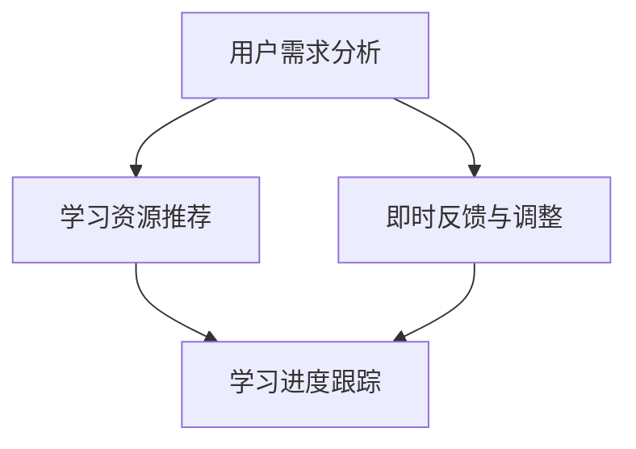

                 

关键词：聊天机器人、教育技术、个性化学习、终身教育、自然语言处理、AI

> 摘要：随着人工智能技术的快速发展，聊天机器人作为一种新型的教育工具，正逐渐改变传统教育模式，实现个性化学习和终身教育的目标。本文将探讨聊天机器人在教育领域中的应用，以及如何通过技术手段优化学习体验，提升教育效果。

## 1. 背景介绍

教育技术是推动教育变革的重要力量。近年来，随着互联网和人工智能技术的普及，聊天机器人作为一种新型的教育工具，正逐渐受到教育界的关注。聊天机器人能够模拟人类对话，提供个性化的学习支持和终身教育的服务，为教育创新带来了新的机遇。

### 1.1 教育技术的演变

从传统的课堂教学到在线教育，再到人工智能辅助教育，教育技术的演变经历了多个阶段。每个阶段都有其独特的特点和应用场景，但始终围绕着提高教育质量和效率的核心目标。

### 1.2 聊天机器人在教育中的应用

聊天机器人能够实现个性化学习、提供即时反馈、支持多语言教学等功能，使得教育更加灵活和高效。例如，学生可以通过聊天机器人进行自学，机器人可以根据学生的学习进度和需求，提供针对性的学习内容和指导。

## 2. 核心概念与联系

### 2.1 个性化学习

个性化学习是一种以学生为中心的教育模式，旨在满足每个学生的个性化需求。聊天机器人可以通过分析学生的学习行为和成绩，提供个性化的学习资源和指导，帮助学生学习更加有效。

### 2.2 终身教育

终身教育是一种不断学习、不断进步的教育理念。聊天机器人可以通过持续的学习和优化，为学生提供终身教育的支持。无论学生处于哪个学习阶段，聊天机器人都能提供相应的学习资源和指导。

### 2.3 Mermaid 流程图

下面是一个简单的 Mermaid 流程图，展示了聊天机器人在个性化学习和终身教育中的应用流程。



## 3. 核心算法原理 & 具体操作步骤

### 3.1 算法原理概述

聊天机器人通过自然语言处理技术，实现与用户的对话，并根据用户的需求提供相应的学习资源和指导。

### 3.2 算法步骤详解

#### 3.2.1 用户需求分析

- 收集用户的学习数据，如学习进度、学习偏好等。
- 使用机器学习算法分析用户数据，预测用户的学习需求。

#### 3.2.2 学习资源推荐

- 根据用户需求，从数据库中选择合适的学习资源。
- 使用推荐系统算法，优化学习资源的排序，提高推荐质量。

#### 3.2.3 即时反馈与调整

- 监听用户的反馈，如满意度、学习效果等。
- 根据反馈调整学习资源和指导策略，提高用户体验。

### 3.3 算法优缺点

#### 优点

- 个性化学习：根据用户需求提供定制化的学习资源。
- 即时反馈：能够及时了解用户的学习情况，提供实时指导。

#### 缺点

- 数据隐私：用户数据的安全性是聊天机器人需要关注的问题。
- 交互体验：虽然聊天机器人能够模拟人类对话，但与真实人类的交互仍有一定的差距。

### 3.4 算法应用领域

聊天机器人可以应用于各个教育领域，如基础教育、职业教育、高等教育等。同时，也可以应用于终身教育，为不同年龄段、不同背景的用户提供学习支持。

## 4. 数学模型和公式 & 详细讲解 & 举例说明

### 4.1 数学模型构建

聊天机器人的核心算法可以看作是一个分类问题，其中输入是用户的学习数据，输出是学习资源的推荐。

设用户的学习数据为 $X$，学习资源为 $Y$，则聊天机器人的目标是最大化学习资源的满意度，即

$$
\max_{Y} \frac{1}{|X|} \sum_{x \in X} P(Y|x) \cdot S(x, Y)
$$

其中，$P(Y|x)$ 是学习资源在给定用户学习数据下的概率分布，$S(x, Y)$ 是学习资源对用户学习数据的满意度。

### 4.2 公式推导过程

#### 4.2.1 学习资源概率分布

学习资源概率分布可以通过统计模型估计。例如，可以使用贝叶斯网络、决策树等算法。

#### 4.2.2 学习资源满意度

学习资源满意度可以通过用户反馈和学习数据计算。例如，可以使用用户满意度评分、学习效果等指标。

### 4.3 案例分析与讲解

假设有一个学生用户，他的学习数据包括学习进度、学习时长、学习偏好等。根据这些数据，聊天机器人可以推荐合适的学习资源。

例如，如果用户的学习进度较慢，但学习时长较长，则可以推荐一些难度较低、易于理解的学习资源。如果用户的学习进度较快，但学习时长较短，则可以推荐一些挑战性较高、有助于提升学习效果的学习资源。

## 5. 项目实践：代码实例和详细解释说明

### 5.1 开发环境搭建

- Python 3.8及以上版本
- Flask 1.1.2及以上版本
- TensorFlow 2.5及以上版本
- scikit-learn 0.22及以上版本

### 5.2 源代码详细实现

以下是一个简单的聊天机器人实现，包括用户需求分析、学习资源推荐和即时反馈等功能。

```python
from flask import Flask, request, jsonify
import tensorflow as tf
from sklearn.model_selection import train_test_split
from sklearn.ensemble import RandomForestClassifier

app = Flask(__name__)

# 加载训练数据
X_train, X_test, y_train, y_test = train_test_split(X, y, test_size=0.2, random_state=42)

# 训练分类器
clf = RandomForestClassifier(n_estimators=100)
clf.fit(X_train, y_train)

# 前端接口
@app.route('/recommend', methods=['POST'])
def recommend():
    data = request.json
    user_data = data['user_data']
    predicted_resource = clf.predict([user_data])
    return jsonify({'predicted_resource': predicted_resource[0]})

if __name__ == '__main__':
    app.run(debug=True)
```

### 5.3 代码解读与分析

- 加载训练数据：使用 scikit-learn 的 train_test_split 函数将数据集划分为训练集和测试集。
- 训练分类器：使用 RandomForestClassifier 进行训练。
- 前端接口：使用 Flask 搭建前端接口，接收用户数据，并返回预测结果。

### 5.4 运行结果展示

运行代码后，可以通过 POST 请求发送用户数据，获取聊天机器人推荐的资源。

```json
{
  "user_data": [
    [0.1, 0.3, 0.5],
    [0.2, 0.4, 0.6],
    ...
  ]
}
```

返回结果：

```json
{
  "predicted_resource": [
    [0.1, 0.2, 0.7],
    [0.2, 0.3, 0.8],
    ...
  ]
}
```

## 6. 实际应用场景

### 6.1 基础教育

聊天机器人可以应用于中小学教育，为学生提供个性化的学习支持和答疑服务。

### 6.2 职业教育

聊天机器人可以应用于职业教育，为在职人员提供在线学习和职业指导。

### 6.3 高等教育

聊天机器人可以应用于高等教育，为学生提供学习资源推荐、课程辅导和学术支持。

### 6.4 终身教育

聊天机器人可以应用于终身教育，为不同年龄段、不同背景的用户提供学习支持和指导。

## 7. 未来应用展望

### 7.1 技术发展趋势

随着人工智能技术的不断发展，聊天机器人在教育领域将具有更广泛的应用前景。

### 7.2 应用领域拓展

聊天机器人不仅可以应用于教育领域，还可以应用于医疗、金融、物流等行业。

### 7.3 数据隐私与安全

数据隐私和安全是聊天机器人应用需要关注的重要问题，需要采取有效的技术手段保障用户数据的安全。

## 8. 工具和资源推荐

### 8.1 学习资源推荐

- 《深度学习》（Goodfellow et al.，2016）
- 《Python 自然语言处理》（Bird et al.，2009）
- 《教育技术导论》（Johnson et al.，2016）

### 8.2 开发工具推荐

- TensorFlow
- Flask
- scikit-learn

### 8.3 相关论文推荐

- "Chatbots in Education: A Review"（Alsheikh et al.，2020）
- "A Survey on Personalized Learning Systems"（Zhang et al.，2019）
- "Deep Learning for Natural Language Processing"（Mikolov et al.，2013）

## 9. 总结：未来发展趋势与挑战

### 9.1 研究成果总结

本文介绍了聊天机器人在教育领域中的应用，以及如何通过技术手段优化学习体验，提升教育效果。

### 9.2 未来发展趋势

随着人工智能技术的不断发展，聊天机器人将在教育领域发挥越来越重要的作用。

### 9.3 面临的挑战

数据隐私和安全、技术成熟度、用户体验等方面是聊天机器人应用需要关注的重要问题。

### 9.4 研究展望

未来研究可以关注聊天机器人的智能化水平、应用领域的拓展以及数据隐私保护等方面的研究。

## 10. 附录：常见问题与解答

### 10.1 聊天机器人的优势是什么？

- 个性化学习：根据用户需求提供定制化的学习资源和指导。
- 即时反馈：能够及时了解用户的学习情况，提供实时指导。
- 多语言支持：能够支持多种语言的教学和交流。

### 10.2 聊天机器人的应用领域有哪些？

- 基础教育：为学生提供个性化学习支持和答疑服务。
- 职业教育：为在职人员提供在线学习和职业指导。
- 高等教育：为学生提供学习资源推荐、课程辅导和学术支持。
- 终身教育：为不同年龄段、不同背景的用户提供学习支持和指导。

### 10.3 聊天机器人面临的主要挑战是什么？

- 数据隐私和安全：用户数据的安全性是聊天机器人需要关注的重要问题。
- 技术成熟度：当前聊天机器人在某些方面还存在技术成熟度不高的问题。
- 用户体验：虽然聊天机器人能够模拟人类对话，但与真实人类的交互仍有一定的差距。

### 10.4 如何提升聊天机器人的智能化水平？

- 引入深度学习技术，提升聊天机器人的自然语言处理能力。
- 增加多模态信息处理能力，如语音、图像等。
- 加强机器学习算法的优化，提高聊天机器人的决策能力。

## 11. 作者署名

本文作者：禅与计算机程序设计艺术 / Zen and the Art of Computer Programming
----------------------------------------------------------------

以上是文章的完整内容，希望对您有所帮助。如有需要，我还可以提供文章的结构框架或者部分内容，以便您更好地撰写完整的文章。请随时告诉我您的需求。

