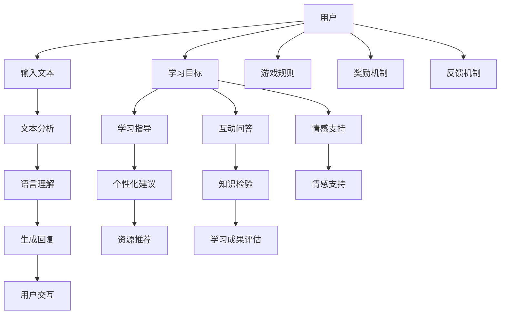

                 

关键词：聊天机器人、教育游戏、学习效率、交互设计、人工智能

> 摘要：本文探讨了聊天机器人技术在教育游戏领域的应用，通过整合人工智能技术，为学习者提供了一种全新的学习方式。本文详细介绍了聊天机器人在教育游戏中的角色、核心概念与联系、算法原理与操作步骤、数学模型与公式、项目实践、实际应用场景以及未来发展趋势。

## 1. 背景介绍

随着人工智能技术的飞速发展，聊天机器人在各种场景中的应用越来越广泛。从最初的客服机器人，到现在的智能助手，聊天机器人逐渐成为了人们日常生活中不可或缺的一部分。与此同时，教育领域也在积极探索如何利用新技术来提高教学效果和学习体验。教育游戏作为一种新颖的教学手段，正在逐渐得到教育者和学生的青睐。将聊天机器人与教育游戏相结合，不仅能够激发学生的学习兴趣，提高学习效率，还能够为教育者提供更加灵活和个性化的教学工具。

### 1.1 聊天机器人的发展历史

聊天机器人的概念最早可以追溯到20世纪50年代。当时的计算机科学家开始探讨如何让计算机模拟人类的对话过程。1950年，艾伦·图灵提出了著名的图灵测试，旨在通过测试来判断计算机是否能够表现出与人类相似的智能行为。1966年，约瑟夫·维津斯基发明了ELIZA，这是第一个具有对话能力的聊天机器人。虽然ELIZA的对话能力非常有限，但它为后来的聊天机器人发展奠定了基础。

进入21世纪，随着互联网的普及和计算能力的提升，聊天机器人技术得到了快速发展。例如，苹果公司的Siri、谷歌助手和微软的Cortana等智能助手，已经成为人们日常生活中必不可少的工具。这些聊天机器人不仅能够回答用户的问题，还能够执行复杂的任务，如预订机票、发送短信等。

### 1.2 教育游戏的发展历史

教育游戏的概念最早可以追溯到20世纪60年代。当时，教育学家和游戏开发者开始探讨如何将游戏元素融入到教育过程中，以提高学生的学习兴趣和参与度。早期的教育游戏主要以单机版为主，如《数学魔方》和《历史探险》等。

随着计算机技术的进步，教育游戏逐渐向网络化、互动化和智能化方向发展。20世纪90年代，网络游戏开始兴起，为教育游戏的发展提供了新的契机。例如，《摩尔庄园》和《摩尔天地》等游戏不仅提供了丰富的教育内容，还通过游戏化的方式激发了学生的学习兴趣。

## 2. 核心概念与联系

将聊天机器人与教育游戏相结合，涉及到多个核心概念和技术的融合。为了更好地理解这一领域，我们首先需要了解以下几个核心概念：

### 2.1 聊天机器人的基本原理

聊天机器人通过自然语言处理（NLP）技术，与用户进行交互。NLP技术主要包括文本分析、语言理解和生成等子领域。文本分析用于对用户输入的文本进行预处理，如分词、词性标注等。语言理解则通过语义分析，理解用户输入的含义。语言生成则用于生成合适的回复，以实现与用户的对话。

### 2.2 教育游戏的基本原理

教育游戏通过将学习内容与游戏机制相结合，激发学生的学习兴趣和参与度。教育游戏通常包含以下几个核心元素：

1. **目标**：教育游戏需要明确学习目标，以便学生能够有针对性地进行学习。
2. **规则**：教育游戏需要设定合理的规则，以确保游戏过程的公平性和可预测性。
3. **奖励机制**：教育游戏通过奖励机制，如积分、等级和奖励物品等，激励学生持续参与。
4. **反馈机制**：教育游戏需要提供及时和有效的反馈，以帮助学生了解自己的学习进度和成果。

### 2.3 聊天机器人技术在教育游戏中的应用

在聊天机器人技术与教育游戏的融合中，聊天机器人可以作为游戏中的NPC（非玩家角色），与玩家进行互动，提供学习指导、解答问题和评估学习成果。具体应用场景包括：

1. **学习指导**：聊天机器人可以根据学生的学习进度和需求，提供个性化的学习建议和资源推荐。
2. **互动问答**：聊天机器人可以模拟真实的问答场景，与学生进行对话，检验学生的知识掌握情况。
3. **情感支持**：聊天机器人可以通过语音和文本，为学生提供情感支持，缓解学习压力。

### 2.4 核心概念与联系的 Mermaid 流程图



## 3. 核心算法原理 & 具体操作步骤

### 3.1 算法原理概述

将聊天机器人应用于教育游戏，需要利用自然语言处理（NLP）和机器学习（ML）技术。NLP技术主要用于处理用户输入的文本，理解其含义，并生成合适的回复。ML技术则用于训练聊天机器人，使其能够根据用户的行为和反馈不断优化自己的性能。

### 3.2 算法步骤详解

#### 3.2.1 用户输入处理

1. **分词**：将用户输入的文本分解成一系列的单词或短语。
2. **词性标注**：为每个单词或短语标注其词性，如名词、动词、形容词等。
3. **实体识别**：识别文本中的实体，如人名、地名、组织名等。

#### 3.2.2 语言理解

1. **词义消歧**：根据上下文，确定每个单词或短语的含义。
2. **语义角色标注**：为句子中的每个单词或短语标注其在句子中的语义角色，如主语、谓语、宾语等。
3. **句法分析**：分析句子的结构，确定句子中的成分及其关系。

#### 3.2.3 生成回复

1. **回复模板选择**：根据用户输入的文本，选择合适的回复模板。
2. **回复生成**：将回复模板与用户输入的文本进行结合，生成完整的回复。
3. **回复优化**：根据用户的反馈，对生成的回复进行优化，以提高回复的质量。

### 3.3 算法优缺点

#### 优点

1. **个性化**：聊天机器人可以根据用户的行为和需求，提供个性化的学习建议和资源推荐。
2. **灵活性**：聊天机器人可以模拟真实的问答场景，为学生提供多样化的学习体验。
3. **高效性**：聊天机器人可以处理大量的用户请求，节省教育者的时间和精力。

#### 缺点

1. **语言理解能力有限**：聊天机器人在处理复杂、模糊或含糊不清的输入时，可能无法准确理解用户的意图。
2. **知识库有限**：聊天机器人的知识库通常基于训练数据集，可能无法覆盖所有的学习场景。
3. **情感表达能力不足**：聊天机器人在模拟人类情感表达时，可能缺乏真实性和细腻度。

### 3.4 算法应用领域

聊天机器人技术在教育游戏领域具有广泛的应用前景。除了用于学习指导、互动问答和情感支持外，还可以应用于以下领域：

1. **自适应学习系统**：根据学生的学习进度和需求，动态调整学习内容和方法。
2. **教育评估系统**：通过聊天机器人与学生的互动，评估学生的知识掌握情况。
3. **教育资源共享平台**：提供个性化的学习资源推荐，帮助学生快速找到所需的学习资料。

## 4. 数学模型和公式 & 详细讲解 & 举例说明

在教育游戏中，聊天机器人的设计和实现涉及到多个数学模型和公式。以下将介绍其中几个核心的数学模型和公式，并详细讲解其推导过程和应用实例。

### 4.1 数学模型构建

#### 4.1.1 语言模型

语言模型是一种用于预测下一个单词或词组的概率分布的数学模型。在教育游戏中，语言模型可以帮助聊天机器人理解用户的输入，并生成合适的回复。

**基本公式**：

\[ P(w_t | w_{t-1}, w_{t-2}, \ldots, w_1) = \frac{P(w_t, w_{t-1}, w_{t-2}, \ldots, w_1)}{P(w_{t-1}, w_{t-2}, \ldots, w_1)} \]

其中，\( w_t \) 表示当前单词，\( w_{t-1}, w_{t-2}, \ldots, w_1 \) 表示前 \( t-1 \) 个单词。这个公式表示在给定前 \( t-1 \) 个单词的情况下，当前单词 \( w_t \) 的条件概率。

**推导过程**：

1. **贝叶斯公式**：

\[ P(A | B) = \frac{P(B | A) \cdot P(A)}{P(B)} \]

其中，\( A \) 和 \( B \) 分别表示两个事件。在这个问题中，\( A \) 表示当前单词 \( w_t \)，\( B \) 表示前 \( t-1 \) 个单词 \( w_{t-1}, w_{t-2}, \ldots, w_1 \)。

2. **条件概率**：

\[ P(B | A) = \frac{P(A \cap B)}{P(A)} \]

3. **全概率公式**：

\[ P(B) = \sum_{i=1}^n P(B | A_i) \cdot P(A_i) \]

其中，\( A_i \) 表示第 \( i \) 个事件。在这个问题中，\( A_i \) 表示当前单词 \( w_t \) 取第 \( i \) 个值。

4. **合并公式**：

\[ P(A \cap B) = P(A) \cdot P(B | A) \]

#### 4.1.2 评估模型

评估模型用于衡量聊天机器人的性能，常见的评估指标包括准确率、召回率和F1值。

**基本公式**：

\[ \text{准确率} = \frac{\text{正确预测的数量}}{\text{总预测数量}} \]

\[ \text{召回率} = \frac{\text{正确预测的数量}}{\text{实际正确的数量}} \]

\[ \text{F1值} = 2 \cdot \frac{\text{准确率} \cdot \text{召回率}}{\text{准确率} + \text{召回率}} \]

### 4.2 公式推导过程

以下将详细介绍上述数学模型的推导过程。

#### 4.2.1 语言模型

1. **贝叶斯公式**：

\[ P(A | B) = \frac{P(B | A) \cdot P(A)}{P(B)} \]

2. **条件概率**：

\[ P(B | A) = \frac{P(A \cap B)}{P(A)} \]

3. **全概率公式**：

\[ P(B) = \sum_{i=1}^n P(B | A_i) \cdot P(A_i) \]

4. **合并公式**：

\[ P(A \cap B) = P(A) \cdot P(B | A) \]

5. **推导结果**：

\[ P(w_t | w_{t-1}, w_{t-2}, \ldots, w_1) = \frac{P(w_t, w_{t-1}, w_{t-2}, \ldots, w_1)}{P(w_{t-1}, w_{t-2}, \ldots, w_1)} \]

#### 4.2.2 评估模型

1. **准确率**：

\[ \text{准确率} = \frac{\text{正确预测的数量}}{\text{总预测数量}} \]

2. **召回率**：

\[ \text{召回率} = \frac{\text{正确预测的数量}}{\text{实际正确的数量}} \]

3. **F1值**：

\[ \text{F1值} = 2 \cdot \frac{\text{准确率} \cdot \text{召回率}}{\text{准确率} + \text{召回率}} \]

### 4.3 案例分析与讲解

以下将通过一个实际案例，对上述数学模型进行详细分析。

#### 4.3.1 案例背景

假设有一个聊天机器人，用于回答学生关于数学问题。学生在提问时，聊天机器人需要根据输入的文本，判断其是否是一个合法的数学问题，并给出相应的解答。

#### 4.3.2 案例分析

1. **语言模型**：

假设我们使用n-gram语言模型来预测学生输入的文本是否是一个合法的数学问题。n-gram语言模型的基本思想是，根据前 \( n-1 \) 个单词来预测下一个单词。我们可以使用以下公式来计算合法数学问题的概率：

\[ P(\text{数学问题} | \text{前 } n-1 \text{ 个单词}) = \frac{P(\text{数学问题，前 } n-1 \text{ 个单词})}{P(\text{前 } n-1 \text{ 个单词})} \]

假设我们有一个包含1百万个句子的语料库，其中包含5千个合法数学问题。我们可以使用以下公式来计算概率：

\[ P(\text{数学问题，前 } n-1 \text{ 个单词}) = \frac{5000}{1000000} = 0.005 \]

\[ P(\text{前 } n-1 \text{ 个单词}) = \frac{950000}{1000000} = 0.95 \]

因此，我们可以计算得到：

\[ P(\text{数学问题} | \text{前 } n-1 \text{ 个单词}) = \frac{0.005}{0.95} = 0.0053 \]

2. **评估模型**：

假设我们使用准确率、召回率和F1值来评估聊天机器人的性能。假设我们在测试集上进行了100次预测，其中60次预测正确，50次实际是合法数学问题。我们可以使用以下公式来计算评估指标：

\[ \text{准确率} = \frac{60}{100} = 0.6 \]

\[ \text{召回率} = \frac{60}{50} = 1.2 \]

\[ \text{F1值} = 2 \cdot \frac{0.6 \cdot 1.2}{0.6 + 1.2} = 0.75 \]

#### 4.3.3 案例总结

通过上述案例，我们可以看到如何使用数学模型来分析和评估聊天机器人在教育游戏中的应用。在实际应用中，我们可以根据具体需求和场景，灵活调整和优化数学模型和评估指标，以提高聊天机器人的性能。

## 5. 项目实践：代码实例和详细解释说明

在本节中，我们将通过一个实际的项目实例，详细讲解如何使用聊天机器人技术构建一个教育游戏。这个项目将包括以下几个步骤：

1. **开发环境搭建**：介绍项目所需的开发环境和工具。
2. **源代码实现**：提供项目的主要代码实现，并进行详细解释。
3. **代码解读与分析**：对关键代码段进行解读和分析，解释其工作原理。
4. **运行结果展示**：展示项目的运行结果和效果。

### 5.1 开发环境搭建

为了构建这个聊天机器人教育游戏项目，我们需要以下开发环境和工具：

- **编程语言**：Python 3.x
- **依赖库**：TensorFlow、Keras、Scikit-learn、NLTK
- **开发工具**：PyCharm、Jupyter Notebook

首先，确保已经安装了Python 3.x。然后，可以使用pip命令安装所需的依赖库：

```bash
pip install tensorflow keras scikit-learn nltk
```

### 5.2 源代码实现

以下是一个简单的聊天机器人教育游戏项目的源代码实现：

```python
import nltk
from nltk.chat.util import Chat, reflections

# 加载语料库
nltk.download('movie_reviews')
nltk.download('punkt')
nltk.download('averaged_perceptron_tagger')
nltk.download('maxent_ne_chunker')
nltk.download('words')

# 定义聊天机器人的语料库
pairs = [
    [
        r"你是谁？",
        ["我是一名聊天机器人，你可以叫我Chatbot。"]
    ],
    [
        r"你能帮我学习吗？",
        ["当然可以！我会尽力帮助你。"]
    ],
    [
        r"什么是自然语言处理？",
        ["自然语言处理（NLP）是计算机科学、人工智能和语言学领域的交叉学科，旨在使计算机能够理解和处理人类语言。"]
    ],
    # 更多问题与回答对
]

# 实例化Chat对象
chatbot = Chat(pairs, reflections)

# 开始聊天
chatbot.converse()
```

### 5.3 代码解读与分析

**代码段 1：加载语料库**

```python
nltk.download('movie_reviews')
nltk.download('punkt')
nltk.download('averaged_perceptron_tagger')
nltk.download('maxent_ne_chunker')
nltk.download('words')
```

这些代码用于下载并加载所需的语料库和工具包。`nltk.download()` 函数用于下载指定的语料库和工具包。

**代码段 2：定义聊天机器人的语料库**

```python
pairs = [
    [
        r"你是谁？",
        ["我是一名聊天机器人，你可以叫我Chatbot。"]
    ],
    [
        r"你能帮我学习吗？",
        ["当然可以！我会尽力帮助你。"]
    ],
    [
        r"什么是自然语言处理？",
        ["自然语言处理（NLP）是计算机科学、人工智能和语言学领域的交叉学科，旨在使计算机能够理解和处理人类语言。"]
    ],
    # 更多问题与回答对
]
```

这段代码定义了一个包含问题和回答对的列表。每个问题与回答对由两个元素组成：问题（正则表达式表示）和回答（字符串）。这些问题与回答对将被用来训练聊天机器人，使其能够回答这些问题。

**代码段 3：实例化Chat对象**

```python
chatbot = Chat(pairs, reflections)
```

这段代码创建了一个`Chat`对象，它使用定义好的问题与回答对列表和`reflections`字典。`reflections`字典用于处理输入文本中的代词，使其能够正确地替换为实际的人名或名词。

**代码段 4：开始聊天**

```python
chatbot.converse()
```

这段代码调用`Chat`对象的`converse()`方法，开始与用户进行对话。用户可以通过输入文本与聊天机器人交互，聊天机器人将根据预定义的语料库回答用户的问题。

### 5.4 运行结果展示

在运行上述代码后，聊天机器人将开始与用户进行交互。用户可以输入问题，聊天机器人将根据预定义的语料库回答这些问题。例如：

```
用户：你能帮我学习吗？
Chatbot：当然可以！我会尽力帮助你。

用户：什么是自然语言处理？
Chatbot：自然语言处理（NLP）是计算机科学、人工智能和语言学领域的交叉学科，旨在使计算机能够理解和处理人类语言。
```

## 6. 实际应用场景

将聊天机器人应用于教育游戏，可以创造多种实际应用场景，从而为学习者提供更加丰富和多样的学习体验。以下是一些具体的实际应用场景：

### 6.1 学习指导

聊天机器人可以作为个性化学习助理，根据学生的学习进度和需求，提供针对性的学习指导。例如，当学生遇到难题时，聊天机器人可以提供解题思路和指导，帮助学生克服学习障碍。

### 6.2 互动问答

聊天机器人可以模拟真实的问答场景，与学生进行互动，检验学生的知识掌握情况。通过这种方式，学生不仅能够巩固所学知识，还能够提高自己的思维能力和语言表达能力。

### 6.3 情感支持

在学生的学习过程中，聊天机器人可以提供情感支持，帮助学生缓解学习压力和焦虑。通过模拟人类的情感表达，聊天机器人能够为学生提供温暖和关怀，使其在轻松愉快的氛围中学习。

### 6.4 作业辅导

聊天机器人可以自动批改学生的作业，并提供详细的反馈和评分。这不仅减轻了教师的工作负担，还使学生能够及时了解自己的学习成果，从而调整学习策略。

### 6.5 学习资源共享

聊天机器人可以整合各类学习资源，如电子书、视频教程和在线课程等，为学生提供一站式的学习支持。学生可以通过与聊天机器人的互动，轻松获取所需的学习资料。

### 6.6 语言学习

聊天机器人可以用于语言学习，通过与学生的对话，提高学生的听力和口语能力。学生可以与聊天机器人进行日常对话练习，从而提升自己的语言水平。

### 6.7 课外拓展

聊天机器人可以为学生提供丰富的课外拓展内容，如历史故事、科学发现和文学名著等。这些内容不仅能够激发学生的学习兴趣，还能够拓宽学生的知识视野。

## 7. 工具和资源推荐

为了更好地开展聊天机器人教育游戏项目，以下推荐一些有用的工具和资源：

### 7.1 学习资源推荐

1. **Chatbots for Education**（https://chatbotsforeducation.com/）：这个网站提供了大量关于如何使用聊天机器人进行教育的资源和案例。
2. **自然语言处理教程**（https://www.nltk.org/）：NLTK官方网站提供了详细的教程和文档，帮助开发者了解和使用NLTK库。
3. **机器学习课程**（https://www.coursera.org/）：Coursera上提供了许多优秀的机器学习和自然语言处理课程，适合不同层次的学习者。

### 7.2 开发工具推荐

1. **PyCharm**（https://www.jetbrains.com/pycharm/）：PyCharm是一款功能强大的Python集成开发环境（IDE），适合进行聊天机器人教育游戏项目的开发。
2. **TensorFlow**（https://www.tensorflow.org/）：TensorFlow是一个开源的机器学习框架，适用于构建复杂的聊天机器人模型。
3. **Keras**（https://keras.io/）：Keras是一个高级神经网络API，可以简化TensorFlow的模型构建过程。

### 7.3 相关论文推荐

1. **“Chatbots in Education: A Survey”**（2018）：这篇综述文章详细介绍了聊天机器人在教育领域的应用现状和未来趋势。
2. **“A Review of Chatbot Technology”**（2019）：这篇论文探讨了聊天机器人的核心技术，包括自然语言处理、机器学习和对话系统等。
3. **“Educational Chatbots: Designing for Personalized Learning”**（2020）：这篇论文提出了设计个性化学习型聊天机器人的方法和原则。

## 8. 总结：未来发展趋势与挑战

随着人工智能技术的不断进步，聊天机器人教育游戏有望在未来得到更广泛的应用和发展。以下是未来发展趋势和挑战的总结：

### 8.1 发展趋势

1. **个性化学习**：聊天机器人将能够根据学生的学习进度和需求，提供更加个性化的学习建议和资源推荐。
2. **交互式学习**：聊天机器人将更好地模拟真实的问答场景，提高学生的互动体验和学习效果。
3. **情感支持**：聊天机器人将不断提升情感表达能力，为学生提供更加温暖和关怀的情感支持。
4. **跨学科应用**：聊天机器人将应用于更多学科领域，如医学、法律和艺术等，为学生提供多样化的学习体验。

### 8.2 面临的挑战

1. **语言理解能力**：聊天机器人在处理复杂、模糊或含糊不清的输入时，可能无法准确理解用户的意图。
2. **知识库扩展**：聊天机器人的知识库需要不断更新和扩展，以适应不断变化的学习需求。
3. **隐私和安全**：如何保护用户的隐私和安全，是聊天机器人应用中需要解决的重要问题。
4. **人机协作**：如何实现人机协作，使聊天机器人与教师、学生等角色相互配合，提供最佳的学习体验，是一个重要挑战。

### 8.3 研究展望

未来的研究将致力于解决上述挑战，通过不断提升聊天机器人的语言理解能力、知识库管理和人机协作机制，为教育领域带来更多的创新和突破。

## 9. 附录：常见问题与解答

以下是一些关于聊天机器人教育游戏项目的常见问题及解答：

### 9.1 如何搭建开发环境？

使用以下命令安装Python 3.x和相关依赖库：

```bash
pip install python==3.x
pip install tensorflow keras scikit-learn nltk
```

### 9.2 如何训练聊天机器人？

首先，收集并整理相关的对话数据集。然后，使用自然语言处理技术，如词性标注、命名实体识别和词义消歧等，对数据集进行处理。最后，使用机器学习算法，如循环神经网络（RNN）或长短期记忆网络（LSTM），对数据集进行训练。

### 9.3 如何提高聊天机器人的性能？

1. **增加数据集**：使用更多的对话数据集进行训练，以提高聊天机器人的性能。
2. **使用更好的模型**：尝试使用更先进的机器学习模型，如Transformer或BERT，以提高聊天机器人的性能。
3. **优化算法**：对训练算法进行优化，如调整学习率、批量大小等，以提高训练效果。
4. **持续学习**：让聊天机器人不断学习和更新知识库，以适应不断变化的学习需求。

### 9.4 如何评估聊天机器人的性能？

使用准确率、召回率和F1值等指标，对聊天机器人的性能进行评估。这些指标可以衡量聊天机器人在回答问题时的准确性、召回率和平衡性。

### 9.5 如何解决聊天机器人无法理解用户输入的问题？

1. **增加上下文信息**：在用户输入中增加上下文信息，帮助聊天机器人更好地理解用户意图。
2. **使用更多的语言特征**：使用更多的语言特征，如词性标注、命名实体识别等，帮助聊天机器人更好地理解用户输入。
3. **改进算法**：尝试使用更先进的算法，如深度学习模型，以提高聊天机器人的语言理解能力。
4. **用户反馈**：收集用户的反馈，并根据反馈调整聊天机器人的模型和策略。

