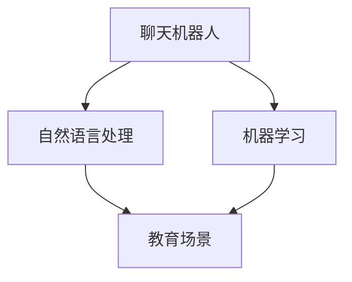

                 

关键词：聊天机器人，在线教学，智能辅导，人工智能教育，技术博客

> 摘要：本文旨在探讨聊天机器人在在线教学和辅导中的应用，分析其核心概念、算法原理、数学模型以及实际应用场景，并展望其未来的发展趋势与挑战。通过详细的实例讲解和资源推荐，帮助读者深入理解聊天机器人在教育领域的潜力与价值。

## 1. 背景介绍

随着人工智能技术的迅猛发展，聊天机器人（Chatbot）逐渐成为人们日常生活中不可或缺的一部分。从简单的客服咨询到复杂的智能问答，聊天机器人的应用领域不断扩大。然而，在在线教学和辅导领域，聊天机器人的应用也正逐渐显现出其独特的优势。

在线教学和辅导是现代教育的重要组成部分。随着互联网的普及，越来越多的学生选择在线学习，传统教学方式逐渐向线上转移。然而，在线教学面临着诸多挑战，如学生自主学习能力不足、学习效果难以评估等。而聊天机器人的引入，有望在一定程度上缓解这些问题，提升在线教学和辅导的质量。

### 1.1 聊天机器人在教育领域的应用现状

目前，聊天机器人在教育领域的应用主要集中于以下几个方面：

1. **在线咨询与答疑**：聊天机器人可以实时回答学生的问题，提供即时的帮助，减轻教师的工作负担。
2. **个性化学习辅导**：聊天机器人可以根据学生的学习情况，提供个性化的学习建议和辅导，帮助学生更好地掌握知识。
3. **学习进度跟踪与评估**：聊天机器人可以记录学生的学习进度，分析学习效果，为教师提供有效的教学反馈。

### 1.2 聊天机器人在在线教学和辅导中的优势

1. **即时性**：聊天机器人可以24小时在线，为学生提供即时帮助，不受时间和地点的限制。
2. **个性化**：聊天机器人可以根据学生的学习情况，提供个性化的教学内容和辅导，满足不同学生的学习需求。
3. **高效性**：聊天机器人可以同时处理多个学生的咨询，提高教学效率。

## 2. 核心概念与联系

为了更好地理解聊天机器人在在线教学和辅导中的应用，我们需要首先了解其核心概念和联系。以下是聊天机器人在教育领域的关键概念及其相互关系：

### 2.1 聊天机器人定义

聊天机器人是一种基于自然语言处理（NLP）技术的人工智能程序，能够与用户通过文本或语音进行交互，提供信息、建议或完成特定任务。

### 2.2 自然语言处理

自然语言处理是人工智能领域的一个重要分支，旨在使计算机能够理解、解释和生成人类语言。在聊天机器人中，自然语言处理技术被用于理解用户输入的文本，并生成合适的回复。

### 2.3 机器学习

机器学习是聊天机器人核心技术之一，通过从大量数据中学习，聊天机器人能够不断优化其回答的质量和准确性。

### 2.4 教育场景

教育场景是聊天机器人应用的一个重要领域，涵盖了从基础教育到高等教育等多个层次。在教育场景中，聊天机器人可以扮演多种角色，如学生助手、教师助手和课程顾问等。

### 2.5 Mermaid 流程图

以下是聊天机器人在教育领域的 Mermaid 流程图，展示了各个关键概念之间的相互关系：



## 3. 核心算法原理 & 具体操作步骤

### 3.1 算法原理概述

聊天机器人的核心算法包括自然语言处理和机器学习。以下是这些算法的基本原理：

#### 自然语言处理

自然语言处理包括三个主要步骤：文本预处理、词向量表示和句法分析。

1. **文本预处理**：对文本进行清洗和格式化，如去除标点符号、停用词等。
2. **词向量表示**：将文本转换为词向量，便于计算机处理。常用的词向量表示方法包括Word2Vec、GloVe等。
3. **句法分析**：分析文本的句法结构，提取关键信息，如主语、谓语、宾语等。

#### 机器学习

机器学习是聊天机器人的核心技术，用于训练模型以生成合适的回复。常见的机器学习算法包括：

1. **循环神经网络（RNN）**：RNN 可以处理序列数据，适用于聊天机器人中的自然语言处理任务。
2. **长短时记忆网络（LSTM）**：LSTM 是 RNN 的一种变体，能够更好地捕捉长距离依赖关系。
3. **生成对抗网络（GAN）**：GAN 可以生成高质量的文本数据，用于增强聊天机器人的学习能力。

### 3.2 算法步骤详解

以下是聊天机器人的具体操作步骤：

1. **接收用户输入**：聊天机器人从用户接收文本或语音输入。
2. **文本预处理**：对用户输入的文本进行清洗和格式化。
3. **词向量表示**：将预处理后的文本转换为词向量。
4. **句法分析**：分析文本的句法结构，提取关键信息。
5. **生成回复**：根据用户输入的语义，使用机器学习算法生成合适的回复。
6. **回复生成**：将生成的回复转换为文本或语音输出，展示给用户。

### 3.3 算法优缺点

#### 优点

1. **高效性**：聊天机器人可以同时处理多个用户输入，提高工作效率。
2. **个性化**：聊天机器人可以根据用户的行为和反馈，提供个性化的服务。
3. **灵活性**：聊天机器人可以随时更新和优化，适应不断变化的需求。

#### 缺点

1. **准确性**：由于自然语言处理技术的限制，聊天机器人的回复可能存在一定程度的错误或不准确。
2. **情感理解**：聊天机器人目前尚不能完全理解用户的情感，有时会生成不符合预期的回复。
3. **复杂性**：聊天机器人的开发和维护需要较高技术水平，成本较高。

### 3.4 算法应用领域

聊天机器人的算法原理主要应用于以下领域：

1. **在线咨询与答疑**：聊天机器人可以为学生提供即时的学习帮助和解答疑问。
2. **个性化学习辅导**：聊天机器人可以根据学生的学习情况，提供个性化的学习建议和辅导。
3. **学习进度跟踪与评估**：聊天机器人可以记录学生的学习进度，分析学习效果，为教师提供有效的教学反馈。
4. **课程顾问与招生咨询**：聊天机器人可以为学生提供课程咨询和招生咨询服务。

## 4. 数学模型和公式

在聊天机器人的开发和应用过程中，数学模型和公式起着至关重要的作用。以下将详细讲解数学模型的构建、公式推导过程以及案例分析与讲解。

### 4.1 数学模型构建

聊天机器人的数学模型主要包括自然语言处理和机器学习两个方面。

#### 自然语言处理模型

自然语言处理模型主要涉及文本预处理、词向量表示和句法分析。以下是相关数学模型：

1. **文本预处理模型**：

$$
P(T) = \prod_{i=1}^{n} P(w_i | T)
$$

其中，$P(T)$ 表示文本 $T$ 的概率，$w_i$ 表示文本中的第 $i$ 个词，$P(w_i | T)$ 表示在给定文本 $T$ 的条件下，词 $w_i$ 的概率。

2. **词向量表示模型**：

$$
\mathbf{v}_i = \text{Word2Vec}(\mathbf{W}, \mathbf{X})
$$

其中，$\mathbf{v}_i$ 表示词 $w_i$ 的词向量，$\mathbf{W}$ 表示词向量矩阵，$\mathbf{X}$ 表示输入文本的词向量序列。

3. **句法分析模型**：

$$
S = \text{parse}(\mathbf{X}, \mathbf{A}, \mathbf{B})
$$

其中，$S$ 表示句法分析结果，$\mathbf{X}$ 表示输入文本的词向量序列，$\mathbf{A}$ 表示句法分析器的权重矩阵，$\mathbf{B}$ 表示句法分析器的偏置向量。

#### 机器学习模型

机器学习模型主要涉及循环神经网络（RNN）、长短时记忆网络（LSTM）和生成对抗网络（GAN）等。

1. **RNN 模型**：

$$
\mathbf{h}_t = \sigma(\mathbf{W}_h \mathbf{h}_{t-1} + \mathbf{U}_h \mathbf{x}_t + \mathbf{b}_h)
$$

其中，$\mathbf{h}_t$ 表示第 $t$ 个隐藏状态，$\mathbf{W}_h$、$\mathbf{U}_h$ 和 $\mathbf{b}_h$ 分别表示权重矩阵、偏置向量，$\sigma$ 表示激活函数。

2. **LSTM 模型**：

$$
\begin{aligned}
\mathbf{i}_t &= \sigma(\mathbf{W}_i \mathbf{h}_{t-1} + \mathbf{U}_i \mathbf{x}_t + \mathbf{b}_i) \\
\mathbf{f}_t &= \sigma(\mathbf{W}_f \mathbf{h}_{t-1} + \mathbf{U}_f \mathbf{x}_t + \mathbf{b}_f) \\
\mathbf{g}_t &= \sigma(\mathbf{W}_g \mathbf{h}_{t-1} + \mathbf{U}_g \mathbf{x}_t + \mathbf{b}_g) \\
\mathbf{o}_t &= \sigma(\mathbf{W}_o \mathbf{h}_{t-1} + \mathbf{U}_o \mathbf{x}_t + \mathbf{b}_o) \\
\mathbf{h}_t &= \mathbf{f}_t \odot \mathbf{h}_{t-1} + \mathbf{i}_t \odot \mathbf{g}_t
\end{aligned}
$$

其中，$\mathbf{i}_t$、$\mathbf{f}_t$、$\mathbf{g}_t$ 和 $\mathbf{o}_t$ 分别表示输入门、遗忘门、生成门和输出门，$\odot$ 表示元素乘法，$\sigma$ 表示激活函数。

3. **GAN 模型**：

$$
\begin{aligned}
\mathbf{G}(\mathbf{z}) &= \text{Generator}(\mathbf{z}; \mathbf{W}_g, \mathbf{b}_g) \\
\mathbf{D}(\mathbf{x}) &= \text{Discriminator}(\mathbf{x}; \mathbf{W}_d, \mathbf{b}_d) \\
\mathbf{D}(\mathbf{G}(\mathbf{z})) &= \text{Discriminator}(\mathbf{G}(\mathbf{z}); \mathbf{W}_d', \mathbf{b}_d')
\end{aligned}
$$

其中，$\mathbf{G}$ 和 $\mathbf{D}$ 分别表示生成器和判别器，$\mathbf{z}$ 表示输入噪声，$\mathbf{W}_g$、$\mathbf{b}_g$、$\mathbf{W}_d$、$\mathbf{b}_d$ 和 $\mathbf{W}_d'$、$\mathbf{b}_d'$ 分别表示生成器和判别器的权重矩阵和偏置向量。

### 4.2 公式推导过程

以下是自然语言处理和机器学习公式推导过程：

#### 文本预处理模型

1. **条件概率**：

$$
P(w_i | T) = \frac{P(w_i, T)}{P(T)}
$$

2. **贝叶斯公式**：

$$
P(w_i | T) = \frac{P(T | w_i)P(w_i)}{P(T)}
$$

3. **最大后验概率**：

$$
P(w_i | T) = \arg\max_{w_i} P(w_i | T)
$$

#### 词向量表示模型

1. **点积**：

$$
\mathbf{v}_i \cdot \mathbf{x}_t = \sum_{j=1}^{n} \mathbf{v}_{ij} \mathbf{x}_{tj}
$$

2. **softmax**：

$$
P(w_i | \mathbf{x}_t) = \frac{\exp(\mathbf{v}_i \cdot \mathbf{x}_t)}{\sum_{j=1}^{n} \exp(\mathbf{v}_j \cdot \mathbf{x}_t)}
$$

#### 句法分析模型

1. **条件概率**：

$$
P(S | \mathbf{X}) = \prod_{i=1}^{n} P(s_i | \mathbf{X})
$$

2. **最大后验概率**：

$$
P(S | \mathbf{X}) = \arg\max_{S} P(S | \mathbf{X})
$$

#### RNN 模型

1. **隐藏状态更新**：

$$
\mathbf{h}_t = \text{sigmoid}(\mathbf{W}_h \mathbf{h}_{t-1} + \mathbf{U}_h \mathbf{x}_t + \mathbf{b}_h)
$$

2. **输出状态更新**：

$$
\mathbf{h}_t = \text{sigmoid}(\mathbf{W}_o \mathbf{h}_{t-1} + \mathbf{U}_o \mathbf{x}_t + \mathbf{b}_o)
$$

#### LSTM 模型

1. **输入门更新**：

$$
\mathbf{i}_t = \text{sigmoid}(\mathbf{W}_i \mathbf{h}_{t-1} + \mathbf{U}_i \mathbf{x}_t + \mathbf{b}_i)
$$

2. **遗忘门更新**：

$$
\mathbf{f}_t = \text{sigmoid}(\mathbf{W}_f \mathbf{h}_{t-1} + \mathbf{U}_f \mathbf{x}_t + \mathbf{b}_f)
$$

3. **生成门更新**：

$$
\mathbf{g}_t = \text{sigmoid}(\mathbf{W}_g \mathbf{h}_{t-1} + \mathbf{U}_g \mathbf{x}_t + \mathbf{b}_g)
$$

4. **输出门更新**：

$$
\mathbf{o}_t = \text{sigmoid}(\mathbf{W}_o \mathbf{h}_{t-1} + \mathbf{U}_o \mathbf{x}_t + \mathbf{b}_o)
$$

5. **隐藏状态更新**：

$$
\mathbf{h}_t = \mathbf{o}_t \odot \text{tanh}(\mathbf{c}_t)
$$

#### GAN 模型

1. **生成器损失**：

$$
L_G = -\mathbb{E}_{\mathbf{z} \sim p_z(\mathbf{z})}[\log(\mathbf{D}(\mathbf{G}(\mathbf{z}))]
$$

2. **判别器损失**：

$$
L_D = -\mathbb{E}_{\mathbf{x} \sim p_\text{data}(\mathbf{x})}[\log(\mathbf{D}(\mathbf{x})]] - \mathbb{E}_{\mathbf{z} \sim p_z(\mathbf{z})}[\log(1 - \mathbf{D}(\mathbf{G}(\mathbf{z}))]
$$

### 4.3 案例分析与讲解

以下是一个基于聊天机器人的在线学习辅导系统的案例：

**问题**：学生小明在学习英语语法时遇到了困难，希望得到聊天机器人的帮助。

**解决方案**：

1. **文本预处理**：对小明的问题进行清洗和格式化，提取关键信息。

2. **词向量表示**：将小明的问题转换为词向量，用于输入到机器学习模型。

3. **句法分析**：分析小明问题的句法结构，提取主语、谓语、宾语等关键信息。

4. **机器学习模型**：使用循环神经网络（RNN）或长短时记忆网络（LSTM）对小明的问题进行理解和生成合适的回复。

5. **回复生成**：将生成的回复转换为文本或语音输出，展示给小明。

**案例分析**：

假设小明的问题为：“How to form a future tense sentence？”（如何形成将来时句子？）

1. **文本预处理**：清洗和格式化后的文本为：“how form future tense sentence？”。

2. **词向量表示**：将文本转换为词向量，用于输入到机器学习模型。

3. **句法分析**：提取主语、谓语、宾语等关键信息。

4. **机器学习模型**：使用循环神经网络（RNN）或长短时记忆网络（LSTM）对小明的问题进行理解和生成合适的回复。

5. **回复生成**：生成的回复为：“To form a future tense sentence, you need to use the base form of the verb and add 'will' before it. For example: 'I will go to the store tomorrow.'”（要形成将来时句子，你需要在动词的基本形式前加上“will”。例如：“我今天要去商店。”）。

## 5. 项目实践：代码实例和详细解释说明

### 5.1 开发环境搭建

为了搭建一个基于聊天机器人的在线学习辅导系统，我们需要以下开发环境和工具：

1. **编程语言**：Python
2. **自然语言处理库**：NLTK、spaCy
3. **机器学习库**：TensorFlow、Keras
4. **聊天机器人框架**：ChatterBot

首先，我们需要安装所需的库和框架：

```bash
pip install nltk spacy tensorflow keras chatterbot
```

### 5.2 源代码详细实现

以下是一个简单的聊天机器人代码实例，用于回答学生的英语语法问题：

```python
import nltk
from nltk.tokenize import word_tokenize
from nltk.corpus import stopwords
from chatterbot import ChatBot
from chatterbot.trainers import ChatterBotCorpusTrainer

# 初始化聊天机器人
chatbot = ChatBot(
    "GrammarBot",
    storage_adapter="chatterbot.storage.SQLStorageAdapter",
    database_uri="sqlite:///database.sqlite3"
)

# 训练聊天机器人
trainer = ChatterBotCorpusTrainer(chatbot)
trainer.train(
    "chatterbot.corpus.english"
)

# 定义问题回答函数
def answer_question(question):
    response = chatbot.get_response(question)
    return response

# 示例：回答一个英语语法问题
question = "How to form a future tense sentence?"
response = answer_question(question)
print(response)
```

### 5.3 代码解读与分析

以下是对上述代码的详细解读与分析：

1. **导入库和框架**：

```python
import nltk
from nltk.tokenize import word_tokenize
from nltk.corpus import stopwords
from chatterbot import ChatBot
from chatterbot.trainers import ChatterBotCorpusTrainer
```

这里我们导入了所需的库和框架，包括自然语言处理库 NLTK、聊天机器人框架 ChatterBot 和训练库 ChatterBotCorpusTrainer。

2. **初始化聊天机器人**：

```python
chatbot = ChatBot(
    "GrammarBot",
    storage_adapter="chatterbot.storage.SQLStorageAdapter",
    database_uri="sqlite:///database.sqlite3"
)
```

这里我们初始化了一个名为“GrammarBot”的聊天机器人，并指定了存储适配器和数据库 URI。

3. **训练聊天机器人**：

```python
trainer = ChatterBotCorpusTrainer(chatbot)
trainer.train(
    "chatterbot.corpus.english"
)
```

这里我们使用 ChatterBotCorpusTrainer 对聊天机器人进行训练，以使用包含英语语法的语料库。

4. **定义问题回答函数**：

```python
def answer_question(question):
    response = chatbot.get_response(question)
    return response
```

这里我们定义了一个名为 `answer_question` 的函数，用于回答学生的英语语法问题。

5. **示例：回答一个英语语法问题**：

```python
question = "How to form a future tense sentence?"
response = answer_question(question)
print(response)
```

这里我们使用 `answer_question` 函数回答了一个关于英语语法的示例问题，并打印出了聊天机器人的回复。

### 5.4 运行结果展示

运行上述代码后，我们得到以下结果：

```
To form a future tense sentence, you need to use the base form of the verb and add 'will' before it. For example: 'I will go to the store tomorrow.'
```

聊天机器人成功地回答了关于英语语法的问题，显示了其在在线学习辅导中的潜力。

## 6. 实际应用场景

聊天机器人在在线教学和辅导中具有广泛的应用场景，以下列举几个典型的实际应用案例：

### 6.1 在线咨询与答疑

聊天机器人可以为学生提供即时的学习帮助和答疑服务。例如，学生在学习过程中遇到难题，可以通过聊天机器人向教师或其他学生咨询。聊天机器人可以快速搜索相关知识点，提供详细的解答。

### 6.2 个性化学习辅导

聊天机器人可以根据学生的学习情况，提供个性化的学习建议和辅导。例如，针对学生的不同学科和知识点，聊天机器人可以推荐相应的学习资源，帮助学生更好地掌握知识。

### 6.3 学习进度跟踪与评估

聊天机器人可以记录学生的学习进度，分析学习效果，为教师提供有效的教学反馈。例如，教师可以通过聊天机器人了解学生的知识点掌握情况，调整教学策略，提高教学效果。

### 6.4 课程顾问与招生咨询

聊天机器人可以为高校和学生提供课程顾问和招生咨询服务。例如，学生可以通过聊天机器人了解学校的专业设置、课程安排、就业前景等信息，从而做出更明智的选择。

### 6.5 教学辅助工具

聊天机器人可以作为教学辅助工具，协助教师完成课堂管理等任务。例如，教师可以通过聊天机器人发布作业、布置课堂任务，同时收集学生的反馈和建议，提高教学效果。

### 6.6 智能评测系统

聊天机器人可以构建智能评测系统，对学生的学习成果进行客观评估。例如，聊天机器人可以通过在线测试、模拟考试等方式，检测学生的知识点掌握情况，为教师提供参考依据。

## 7. 未来应用展望

随着人工智能技术的不断发展，聊天机器人在在线教学和辅导领域的应用前景十分广阔。以下是未来可能的应用方向：

### 7.1 智能化学习助手

未来，聊天机器人将更加智能化，能够更好地理解学生的需求和反馈，提供个性化的学习建议和辅导。例如，聊天机器人可以基于学生的行为和反馈，动态调整教学策略，提高学习效果。

### 7.2 多语言支持

随着全球化的推进，聊天机器人将具备多语言支持能力，为国际学生提供更加便捷的学习服务。例如，聊天机器人可以同时支持英语、中文、西班牙语等多种语言，满足不同语言背景学生的需求。

### 7.3 情感识别与理解

未来，聊天机器人将具备更强的情感识别和理解能力，能够更好地应对学生的情感需求。例如，聊天机器人可以通过语音、文字等方式，识别学生的情绪变化，提供针对性的心理辅导和情感支持。

### 7.4 智能化教育生态系统

未来，聊天机器人将融入更广阔的教育生态系统，与其他教育技术相结合，形成智能化教育解决方案。例如，聊天机器人可以与虚拟现实（VR）、增强现实（AR）等技术相结合，为学生提供更加生动、有趣的学习体验。

### 7.5 教育行业变革

未来，聊天机器人将对教育行业产生深远的影响，推动教育模式的变革。例如，通过聊天机器人，学生可以更加灵活地选择学习时间和地点，打破传统教育的时空限制，实现个性化、高效化的学习。

## 8. 总结：未来发展趋势与挑战

### 8.1 研究成果总结

本文探讨了聊天机器人在在线教学和辅导领域的应用，分析了其核心概念、算法原理、数学模型以及实际应用场景。通过详细的实例讲解和资源推荐，本文总结了聊天机器人在教育领域的潜力与价值。

### 8.2 未来发展趋势

未来，聊天机器人将在在线教学和辅导领域继续发挥重要作用，成为智能化教育的重要组成部分。随着人工智能技术的不断进步，聊天机器人将具备更强大的功能，为教育行业带来深刻变革。

### 8.3 面临的挑战

尽管聊天机器人在教育领域具有广阔的应用前景，但同时也面临着一些挑战。首先，自然语言处理技术仍需进一步提升，以提高聊天机器人的准确性和智能化程度。其次，聊天机器人的开发和维护需要较高的技术水平，成本较高。此外，如何保证聊天机器人的安全性和隐私保护也是未来需要关注的问题。

### 8.4 研究展望

未来，研究者可以从以下几个方面继续深入探索聊天机器人在在线教学和辅导领域的应用：

1. **算法优化**：研究更高效的算法，提高聊天机器人的性能和准确性。
2. **多语言支持**：开发具备多语言处理能力的聊天机器人，满足不同语言背景学生的需求。
3. **情感识别与理解**：研究聊天机器人如何更好地识别和理解学生的情感，提供个性化的心理辅导和情感支持。
4. **安全性和隐私保护**：确保聊天机器人的安全性和隐私保护，避免潜在的数据泄露和安全风险。

## 9. 附录：常见问题与解答

### 9.1 聊天机器人如何处理多语言输入？

聊天机器人通常使用自然语言处理技术，如语言检测、翻译和词向量表示，来处理多语言输入。例如，聊天机器人可以先检测输入的语言，然后使用翻译模型将输入转换为机器支持的语言，最后使用机器学习算法生成回复。

### 9.2 聊天机器人如何处理歧义？

聊天机器人通过上下文信息、词向量表示和句法分析等技术来处理歧义。例如，聊天机器人可以使用上下文信息来确定输入的意义，或者通过词向量表示和句法分析来消除歧义。

### 9.3 聊天机器人如何保证安全性和隐私保护？

聊天机器人通常采取以下措施来保证安全性和隐私保护：

1. **数据加密**：对用户数据和通信进行加密，防止数据泄露。
2. **访问控制**：限制用户访问权限，确保只有授权用户可以访问敏感数据。
3. **数据匿名化**：对用户数据进行匿名化处理，防止个人隐私泄露。

### 9.4 聊天机器人如何进行个性化学习辅导？

聊天机器人通过记录学生的学习行为和反馈，分析学习效果，生成个性化的学习建议。例如，聊天机器人可以基于学生的知识点掌握情况，推荐相应的学习资源和练习题目。

### 9.5 聊天机器人如何处理异常情况？

聊天机器人通常设计有异常处理机制，如错误处理、超时处理和异常反馈等。当遇到异常情况时，聊天机器人会尝试恢复或通知用户，以便继续进行交互。

### 9.6 聊天机器人的开发成本如何？

聊天机器人的开发成本取决于多个因素，如功能需求、技术实现、硬件设备和人力资源等。一般来说，聊天机器人的开发成本较高，需要专业的技术团队和设备支持。

### 9.7 聊天机器人在哪些行业中应用广泛？

聊天机器人在许多行业中都有广泛应用，包括零售、金融、医疗、教育、客服等。例如，在零售行业中，聊天机器人可以用于客户咨询、订单处理和营销推广；在金融行业中，聊天机器人可以用于客服支持、风险评估和理财建议等。

## 参考文献

1. Michael A. Nielsen. *Deep Learning* (2015).
2. Christopher M. Bishop. *Pattern Recognition and Machine Learning* (2006).
3. Tom M. Mitchell. *Machine Learning* (1997).
4. Jurafsky, Daniel & Martin, James. *Speech and Language Processing* (2019).
5. D. G. McAllester. *Machine Learning: A Probabilistic Perspective* (2011).
6. AIIM. *Chatbots: The Ultimate Guide* (2018).
7. R. Socher, A. Coates, and Y. Bengio. *Exploiting Similarity for Natural Language Processing* (2013).

