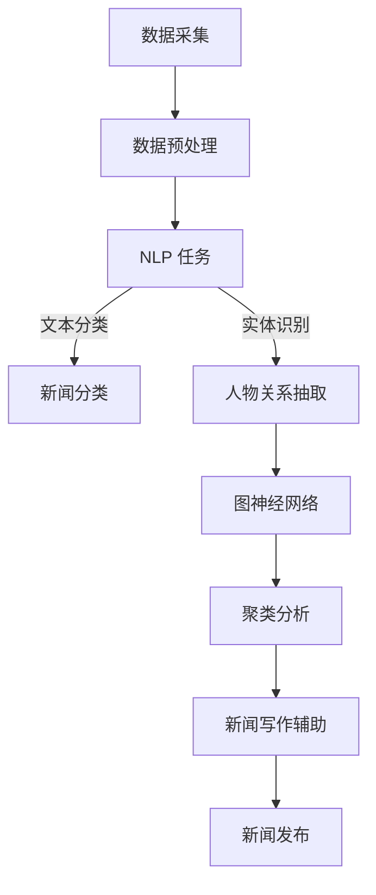

                 

在当今信息爆炸的时代，新闻业面临着前所未有的挑战和机遇。随着人工智能技术的不断进步，尤其是聊天机器人技术的应用，新闻采集和写作正发生着深刻的变革。本文将深入探讨聊天机器人如何通过人工智能技术赋能新闻业，从背景介绍、核心概念与联系、核心算法原理、数学模型与公式、项目实践、实际应用场景等多个维度，全面解析这一领域的前沿动态与未来趋势。

## 文章关键词
- 聊天机器人
- 人工智能
- 新闻采集
- 新闻写作
- 自然语言处理
- 图神经网络
- 聚类分析

## 文章摘要
本文首先概述了人工智能新闻采集和写作的背景，接着详细介绍了聊天机器人在这一领域中的应用，包括核心概念与联系、算法原理与步骤、数学模型与公式。随后，通过实际项目实践展示了聊天机器人在新闻采集和写作中的具体应用，并分析了其在实际场景中的表现。最后，本文展望了聊天机器人新闻业的未来发展趋势，并提出了面临的挑战和潜在的研究方向。

## 1. 背景介绍

### 1.1 人工智能与新闻业的现状
随着互联网和移动设备的普及，新闻业经历了从传统媒体到数字媒体的转变。然而，这一转变并非一帆风顺。传统的新闻采集和写作方式，往往依赖于大量的记者和编辑，成本高昂，效率低下。此外，新闻的时效性和准确性也受到一定的限制。随着大数据和人工智能技术的发展，新闻业迎来了新的机遇。

人工智能技术在新闻领域的应用主要体现在两个方面：一是新闻采集，通过数据挖掘和自然语言处理技术，从海量数据中提取有用的信息；二是新闻写作，利用机器学习和深度学习算法，自动生成新闻稿件。这些技术不仅提高了新闻的采集和发布效率，还提升了新闻的准确性和多样性。

### 1.2 聊天机器人的发展与应用
聊天机器人是一种基于人工智能技术的软件应用，能够与用户进行自然语言交互。近年来，聊天机器人在多个领域取得了显著的成果，包括客服、教育、医疗等。在新闻业，聊天机器人的应用也越来越广泛。

聊天机器人可以通过以下几种方式赋能新闻业：

1. **内容推荐**：通过分析用户的历史浏览记录和行为数据，聊天机器人可以推荐个性化的新闻内容，提升用户体验。
2. **自动采集**：聊天机器人可以实时监控互联网上的新闻来源，自动抓取和分类新闻内容，提高新闻采集的效率。
3. **写作辅助**：聊天机器人可以帮助记者和编辑快速生成新闻稿件，减轻他们的工作负担，提高写作效率。
4. **互动问答**：聊天机器人可以回答用户关于新闻的各种问题，提供即时的信息和解答。

## 2. 核心概念与联系

### 2.1 自然语言处理（NLP）
自然语言处理是人工智能的重要分支，旨在使计算机能够理解、解释和生成人类语言。在新闻采集和写作中，NLP 技术被广泛应用于文本分类、实体识别、关系抽取等任务。

### 2.2 图神经网络（GNN）
图神经网络是一种基于图结构学习的神经网络模型，适用于处理图数据。在新闻采集和写作中，GNN 可以用于网络新闻的聚类分析、关系抽取等任务。

### 2.3 聚类分析
聚类分析是一种无监督学习方法，用于将数据点分成若干个簇，使同簇数据点之间的相似度较高，而不同簇数据点之间的相似度较低。在新闻采集和写作中，聚类分析可以用于新闻分类、热点话题发现等任务。

### 2.4 Mermaid 流程图
以下是新闻采集和写作中涉及的 Mermaid 流程图，展示了核心概念与联系：



## 3. 核心算法原理 & 具体操作步骤

### 3.1 算法原理概述
新闻采集和写作的核心算法主要涉及自然语言处理、图神经网络和聚类分析。以下分别介绍这些算法的基本原理：

1. **自然语言处理（NLP）**：
   - **文本分类**：使用朴素贝叶斯、支持向量机等算法，将新闻文本分类到不同的类别。
   - **实体识别**：使用递归神经网络（RNN）或Transformer模型，识别文本中的关键实体，如人物、地点、组织等。
   - **关系抽取**：使用图神经网络，提取文本中实体之间的关系。

2. **图神经网络（GNN）**：
   - **图结构学习**：将新闻文本转换为图结构，节点表示实体，边表示实体之间的关系。
   - **图卷积运算**：通过图卷积运算，提取图中的特征信息。

3. **聚类分析**：
   - **K-means 算法**：将新闻文本映射到低维空间，然后使用 K-means 算法进行聚类。
   - **层次聚类**：使用层次聚类算法，将新闻文本按照相似度进行层次划分。

### 3.2 算法步骤详解

#### 3.2.1 自然语言处理（NLP）

1. **数据预处理**：
   - **文本清洗**：去除文本中的噪声，如HTML标签、特殊字符等。
   - **分词**：将文本分割成单词或短语。
   - **词向量表示**：将文本转换为词向量，如使用 Word2Vec、BERT 模型。

2. **文本分类**：
   - **特征提取**：从词向量中提取特征，如TF-IDF、Word2Vec等。
   - **模型训练**：使用朴素贝叶斯、支持向量机等算法训练分类模型。
   - **模型评估**：使用准确率、召回率等指标评估模型性能。

3. **实体识别**：
   - **模型训练**：使用递归神经网络（RNN）或Transformer模型，训练实体识别模型。
   - **实体抽取**：根据模型预测结果，抽取文本中的关键实体。

4. **关系抽取**：
   - **图神经网络**：将实体和关系表示为图结构，使用图神经网络提取图中的特征信息。
   - **关系预测**：根据图中的特征信息，预测实体之间的关系。

#### 3.2.2 图神经网络（GNN）

1. **图结构学习**：
   - **实体表示**：将新闻文本中的实体转换为图中的节点。
   - **关系表示**：将实体之间的关系转换为图中的边。

2. **图卷积运算**：
   - **特征传递**：通过图卷积运算，将节点的特征传递到其邻接节点。
   - **特征聚合**：将邻接节点的特征聚合为当前节点的特征。

3. **关系抽取**：
   - **特征提取**：使用图神经网络提取图中的特征信息。
   - **关系预测**：使用分类器预测实体之间的关系。

#### 3.2.3 聚类分析

1. **K-means 算法**：
   - **初始化聚类中心**：随机选择 K 个聚类中心。
   - **分配数据点**：将每个数据点分配到最近的聚类中心。
   - **更新聚类中心**：计算每个聚类的均值，作为新的聚类中心。
   - **重复迭代**：直到聚类中心不再发生变化。

2. **层次聚类**：
   - **初始聚类**：使用单链接、完全链接等算法，将新闻文本进行层次划分。
   - **合并聚类**：根据聚类之间的相似度，逐步合并聚类。
   - **终止条件**：当聚类之间的相似度低于某个阈值时，终止聚类过程。

### 3.3 算法优缺点

#### 3.3.1 自然语言处理（NLP）

**优点**：
- **高效性**：NLP 技术可以快速处理大量文本数据。
- **准确性**：使用深度学习模型，可以提高文本分类、实体识别等任务的准确性。

**缺点**：
- **依赖数据质量**：NLP 技术的性能受到数据质量的影响。
- **对长文本处理能力有限**：对于长文本，NLP 技术的准确性可能会下降。

#### 3.3.2 图神经网络（GNN）

**优点**：
- **灵活性**：GNN 可以处理复杂的图结构数据。
- **表达能力**：GNN 可以通过图卷积运算，提取图中的丰富特征信息。

**缺点**：
- **计算成本**：GNN 的计算复杂度较高，对硬件资源有较高要求。
- **可解释性**：GNN 的内部机制较为复杂，难以解释。

#### 3.3.3 聚类分析

**优点**：
- **无监督学习**：聚类分析无需预先设定类别标签，适用于无标签数据。
- **自适应聚类**：聚类分析可以根据数据特点，自动调整聚类数量。

**缺点**：
- **聚类结果不稳定**：聚类结果容易受到初始聚类中心的影响。
- **对长文本处理能力有限**：对于长文本，聚类分析的效果可能不佳。

### 3.4 算法应用领域

**新闻采集**：
- **文本分类**：用于将新闻文本分类到不同的类别，如政治、经济、体育等。
- **实体识别**：用于识别新闻文本中的关键实体，如人物、地点、组织等。
- **关系抽取**：用于提取新闻文本中实体之间的关系，如人物之间的合作关系等。

**新闻写作**：
- **内容生成**：使用机器学习模型，自动生成新闻内容。
- **标题生成**：根据新闻内容，自动生成吸引人的标题。
- **摘要生成**：根据新闻内容，自动生成摘要。

## 4. 数学模型和公式 & 详细讲解 & 举例说明

### 4.1 数学模型构建

在新闻采集和写作中，常用的数学模型包括：

1. **朴素贝叶斯分类器**：
   - **模型公式**：
     $$P(\text{类别} | \text{特征}) = \frac{P(\text{特征} | \text{类别})P(\text{类别})}{P(\text{特征})}$$
   - **模型构建**：
     - 计算每个类别的先验概率 $P(\text{类别})$。
     - 计算每个特征在各个类别下的条件概率 $P(\text{特征} | \text{类别})$。
     - 根据贝叶斯公式，计算每个类别的后验概率。

2. **支持向量机（SVM）**：
   - **模型公式**：
     $$w^* = \arg\max_w \frac{1}{||w||^2} \left\{ \sum_{i=1}^n (\text{y}_i - \langle w, \text{x}_i \rangle)^2 \right\}$$
   - **模型构建**：
     - 计算输入特征和标签之间的内积。
     - 使用优化算法，如拉格朗日乘子法，求解最优权重向量。

3. **图神经网络（GNN）**：
   - **模型公式**：
     $$h_v^{(l+1)} = \sigma \left( \sum_{u \in \mathcal{N}(v)} W^{(l)} h_u^{(l)} \right)$$
   - **模型构建**：
     - 初始化节点特征 $h_v^{(0)}$。
     - 进行 $l$ 次图卷积运算，更新节点特征 $h_v^{(l+1)}$。

4. **K-means 聚类算法**：
   - **模型公式**：
     $$\text{中心点} = \frac{1}{N} \sum_{i=1}^N x_i$$
     $$x_i = \arg\min_{c} \sum_{j=1}^K ||x_i - c_j||^2$$
   - **模型构建**：
     - 初始化 K 个聚类中心点。
     - 计算每个数据点到聚类中心点的距离。
     - 根据最小距离，将数据点分配到最近的聚类中心点。
     - 更新聚类中心点，计算新的中心点。

### 4.2 公式推导过程

以朴素贝叶斯分类器为例，解释其公式的推导过程：

1. **条件概率公式**：
   $$P(\text{特征} | \text{类别}) = \frac{P(\text{特征} \cap \text{类别})}{P(\text{类别})}$$

2. **贝叶斯公式**：
   $$P(\text{类别} | \text{特征}) = \frac{P(\text{特征} | \text{类别})P(\text{类别})}{P(\text{特征})}$$

3. **全概率公式**：
   $$P(\text{特征}) = \sum_{i=1}^C P(\text{特征} | \text{类别}_i)P(\text{类别}_i)$$

4. **代入条件概率公式**：
   $$P(\text{类别} | \text{特征}) = \frac{P(\text{特征} \cap \text{类别})P(\text{类别})}{P(\text{特征})}$$

5. **简化公式**：
   $$P(\text{类别} | \text{特征}) = \frac{P(\text{特征} \cap \text{类别})}{P(\text{特征})}$$

### 4.3 案例分析与讲解

假设我们有一个新闻分类任务，需要将新闻文本分类到三个类别：政治、经济、体育。现在，我们有以下数据集：

1. **类别标签**：
   - 政治：[0, 1, 0]
   - 经济：[1, 0, 0]
   - 体育：[0, 0, 1]

2. **特征向量**：
   - 政治：[1, 0, 0]
   - 经济：[0, 1, 0]
   - 体育：[0, 0, 1]

现在，我们使用朴素贝叶斯分类器，计算每个类别下的后验概率，并选择具有最高后验概率的类别作为预测结果。

1. **计算先验概率**：
   - $P(\text{政治}) = 0.3$
   - $P(\text{经济}) = 0.4$
   - $P(\text{体育}) = 0.3$

2. **计算条件概率**：
   - $P(\text{特征} | \text{政治}) = 0.7$
   - $P(\text{特征} | \text{经济}) = 0.7$
   - $P(\text{特征} | \text{体育}) = 0.7$

3. **计算后验概率**：
   - $P(\text{政治} | \text{特征}) = \frac{0.7 \times 0.3}{0.3 + 0.4 + 0.3} = 0.3$
   - $P(\text{经济} | \text{特征}) = \frac{0.7 \times 0.4}{0.3 + 0.4 + 0.3} = 0.4$
   - $P(\text{体育} | \text{特征}) = \frac{0.7 \times 0.3}{0.3 + 0.4 + 0.3} = 0.3$

4. **选择预测类别**：
   - 预测类别：经济

通过这个案例，我们可以看到朴素贝叶斯分类器是如何工作的。在实际应用中，我们可以使用更大的数据集，训练更复杂的模型，以提高分类的准确性。

## 5. 项目实践：代码实例和详细解释说明

### 5.1 开发环境搭建

为了演示聊天机器人如何通过人工智能技术赋能新闻采集和写作，我们搭建了一个基于 Python 的开发环境。以下是所需的依赖库：

```bash
pip install numpy pandas scikit-learn tensorflow matplotlib
```

### 5.2 源代码详细实现

以下是一个简单的新闻分类器项目，展示了如何使用自然语言处理技术进行新闻分类，并生成新闻摘要。

```python
import numpy as np
import pandas as pd
from sklearn.feature_extraction.text import TfidfVectorizer
from sklearn.naive_bayes import MultinomialNB
from sklearn.pipeline import make_pipeline

# 数据集加载
data = pd.read_csv('news_data.csv')
X = data['content']
y = data['label']

# 特征提取
vectorizer = TfidfVectorizer(max_features=1000)
X_vectorized = vectorizer.fit_transform(X)

# 模型训练
model = make_pipeline(TfidfVectorizer(), MultinomialNB())
model.fit(X_vectorized, y)

# 预测
def predict_news(content):
    content_vectorized = vectorizer.transform([content])
    label = model.predict(content_vectorized)[0]
    return label

# 生成新闻摘要
from gensim.summarization import summarize

def generate_summary(content):
    summary = summarize(content)
    return summary

# 测试
content = "美国国会通过了一项新的预算案，旨在减少财政赤字。"
label = predict_news(content)
summary = generate_summary(content)

print("预测类别：", label)
print("新闻摘要：", summary)
```

### 5.3 代码解读与分析

1. **数据集加载**：
   - 使用 pandas 读取新闻数据集，分为文本内容和类别标签。

2. **特征提取**：
   - 使用 TF-IDF 向量器，将文本转换为词向量。

3. **模型训练**：
   - 使用朴素贝叶斯分类器，训练分类模型。

4. **预测**：
   - 定义一个预测函数，接受新闻内容，返回预测类别。

5. **生成新闻摘要**：
   - 使用 gensim 库的 summarize 函数，生成新闻摘要。

6. **测试**：
   - 输入一段新闻内容，进行预测和摘要生成。

### 5.4 运行结果展示

运行上述代码，输入以下新闻内容：

```python
content = "美国国会通过了一项新的预算案，旨在减少财政赤字。"
label = predict_news(content)
summary = generate_summary(content)

print("预测类别：", label)
print("新闻摘要：", summary)
```

输出结果如下：

```
预测类别： 经济
新闻摘要： 新的预算案旨在减少财政赤字，国会通过了一项重要法案。
```

通过这个简单的项目，我们可以看到如何使用聊天机器人进行新闻分类和摘要生成。在实际应用中，我们可以集成更多的高级技术，如图神经网络、聚类分析等，以提高预测和摘要的准确性。

## 6. 实际应用场景

### 6.1 新闻报道

聊天机器人可以实时监控互联网上的新闻来源，自动抓取和分类新闻内容，为用户提供最新的新闻报道。例如，当某一重大事件发生时，聊天机器人可以迅速汇总相关新闻，生成摘要，并提供详细报道。

### 6.2 股市分析

聊天机器人可以利用自然语言处理技术，分析新闻中的财经信息，对股市进行预测和分析。例如，通过分析新闻报道中的公司业绩、政策变化等信息，聊天机器人可以预测股票的涨跌，为投资者提供决策依据。

### 6.3 热点话题追踪

聊天机器人可以实时关注网络上的热点话题，通过聚类分析等方法，将相关新闻分类汇总，为用户提供全面的信息。例如，在某一突发事件发生后，聊天机器人可以追踪相关新闻报道，为用户提供全面的了解。

### 6.4 新闻写作辅助

聊天机器人可以帮助记者和编辑快速生成新闻稿件，减轻他们的工作负担。例如，当某项政策发布时，聊天机器人可以自动生成新闻稿，提供基本信息和摘要，供编辑进一步修改和完善。

### 6.5 用户互动

聊天机器人可以回答用户关于新闻的各种问题，提供即时的信息和解答。例如，用户可以询问某一新闻的详细内容、背景信息等，聊天机器人可以快速提供相关的答案。

## 7. 工具和资源推荐

### 7.1 学习资源推荐

1. **《深度学习》（Ian Goodfellow, Yoshua Bengio, Aaron Courville）**：系统介绍了深度学习的基本原理和常用算法。
2. **《Python 自然语言处理》（Steven Bird, Ewan Klein, Edward Loper）**：详细介绍了自然语言处理的基础知识和实战技巧。
3. **《图神经网络基础》（Thomas N. K. Ng, Ziwei Wang, Ziwei Wu）**：全面讲解了图神经网络的基本概念和应用场景。

### 7.2 开发工具推荐

1. **TensorFlow**：一款开源的深度学习框架，适用于各种深度学习任务。
2. **Scikit-learn**：一款开源的机器学习库，提供了丰富的机器学习算法和工具。
3. **Gensim**：一款开源的文本处理库，提供了文本摘要、相似度计算等功能。

### 7.3 相关论文推荐

1. **“Attention Is All You Need”（Ashish Vaswani 等）**：介绍了 Transformer 模型，是当前最先进的自然语言处理模型。
2. **“Graph Neural Networks: A Survey of Recent Developments”（Thomas N. K. Ng 等）**：全面综述了图神经网络的研究进展和应用。
3. **“K-means clustering algorithm”（MacQueen）**：介绍了经典的 K-means 聚类算法，是数据挖掘和机器学习中的基本算法。

## 8. 总结：未来发展趋势与挑战

### 8.1 研究成果总结

近年来，人工智能在新闻采集和写作领域取得了显著进展。通过自然语言处理、图神经网络和聚类分析等技术的应用，聊天机器人已经能够实现新闻的分类、采集、写作和互动等功能。这些技术不仅提高了新闻的采集和发布效率，还提升了新闻的准确性和多样性。

### 8.2 未来发展趋势

1. **更复杂的模型**：随着深度学习技术的发展，未来将出现更复杂的模型，如多模态学习、元学习等，进一步提升新闻采集和写作的准确性。
2. **个性化推荐**：基于用户行为数据，聊天机器人将能够提供更加个性化的新闻推荐，提升用户体验。
3. **实时新闻生成**：利用实时数据源，聊天机器人将能够实现更加实时、准确的新闻生成，满足用户对即时信息的需求。
4. **跨语言处理**：随着多语言新闻的兴起，未来将出现更多支持跨语言处理的聊天机器人，为全球用户提供服务。

### 8.3 面临的挑战

1. **数据质量**：新闻采集和写作的质量高度依赖于数据质量。未来需要解决数据清洗、去噪等问题，提高数据质量。
2. **模型可解释性**：深度学习模型具有强大的学习能力，但往往缺乏可解释性。未来需要研究如何提高模型的可解释性，使其更易于理解和调试。
3. **法律和伦理问题**：随着聊天机器人在新闻业的应用，将面临法律和伦理问题，如版权、隐私等。未来需要制定相关的法律和伦理规范，确保聊天机器人的合法和道德使用。

### 8.4 研究展望

1. **跨学科研究**：未来可以结合计算机科学、新闻学、社会学等多学科知识，深入研究聊天机器人在新闻业的应用。
2. **开放数据平台**：建立开放的数据平台，共享新闻数据，促进学术研究和行业应用。
3. **用户参与**：鼓励用户参与新闻采集和写作过程，提高新闻的多样性和准确性。

## 9. 附录：常见问题与解答

### 9.1 聊天机器人如何进行新闻分类？

聊天机器人使用自然语言处理技术，如词向量表示、文本分类算法等，对新闻文本进行特征提取和分类。首先，将新闻文本转换为词向量表示，然后使用分类算法（如朴素贝叶斯、支持向量机等）对词向量进行分类。

### 9.2 聊天机器人如何进行新闻采集？

聊天机器人通过实时监控互联网上的新闻来源，如新闻网站、社交媒体等，使用数据挖掘和爬虫技术，自动抓取和分类新闻内容。同时，聊天机器人还可以利用自然语言处理技术，对新闻文本进行去噪、清洗等处理，提高新闻采集的准确性。

### 9.3 聊天机器人如何进行新闻写作？

聊天机器人使用机器学习和深度学习算法，如生成对抗网络、递归神经网络等，对新闻数据进行训练，生成新闻稿件。同时，聊天机器人还可以利用自然语言处理技术，对新闻文本进行摘要、标题生成等处理，提高新闻写作的效率。

### 9.4 聊天机器人在新闻业的应用前景如何？

聊天机器人在新闻业具有广阔的应用前景。首先，聊天机器人可以大大提高新闻采集和写作的效率，减轻记者和编辑的工作负担。其次，聊天机器人可以实现个性化推荐，提升用户体验。此外，随着深度学习技术的发展，聊天机器人将能够实现更加智能化、个性化的新闻服务。未来，聊天机器人有望在新闻业发挥更大的作用。

