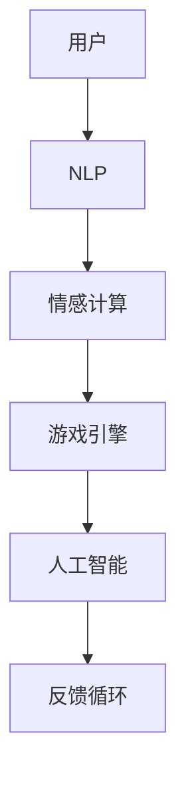

                 

关键词：聊天机器人、游戏、沉浸式、多人互动、AI、技术、开发、未来趋势

> 摘要：本文将深入探讨聊天机器人技术在游戏领域的革命性应用，特别是如何实现沉浸式多人互动。通过对核心概念、算法原理、数学模型、项目实践、实际应用场景以及未来发展趋势的分析，旨在为读者提供全面的技术见解和实用的开发指南。

## 1. 背景介绍

随着人工智能（AI）技术的飞速发展，聊天机器人已经成为各行业的重要组成部分。从客服机器人到教育助手，聊天机器人的应用范围不断扩大。然而，在游戏领域，聊天机器人并未得到充分的利用。本文将探讨如何将聊天机器人技术与游戏相结合，创造出全新的沉浸式多人互动体验。

### 1.1 聊天机器人的现状

当前，聊天机器人的主要应用集中在客服和营销领域。通过自然语言处理（NLP）技术，聊天机器人能够模拟人类对话，为用户提供实时帮助。然而，这些机器人通常缺乏情感共鸣和沉浸感，无法满足游戏玩家对深入互动的需求。

### 1.2 游戏领域的挑战

游戏玩家对互动体验有着极高的要求。传统的多人游戏模式往往局限于实时多人在线对战，缺乏情感交流和情境互动。此外，游戏开发者需要在性能、可扩展性和用户体验之间寻找平衡，这给聊天机器人的集成带来了挑战。

## 2. 核心概念与联系

为了实现沉浸式多人互动，我们需要引入几个关键概念，并通过一个Mermaid流程图来展示它们之间的联系。

### 2.1 关键概念

- **自然语言处理（NLP）**：NLP技术使聊天机器人能够理解和生成自然语言，是实现智能对话的基础。
- **情感计算**：情感计算技术用于模拟和识别玩家的情感状态，增强互动体验。
- **游戏引擎**：游戏引擎负责处理游戏逻辑、图形渲染和物理模拟，是游戏开发的核心。
- **人工智能**：人工智能技术用于训练和优化聊天机器人模型，提高其智能水平和互动能力。

### 2.2 Mermaid流程图



## 3. 核心算法原理 & 具体操作步骤

### 3.1 算法原理概述

实现沉浸式多人互动的关键在于将NLP、情感计算和游戏引擎结合起来。具体来说，算法包括以下步骤：

1. **用户输入处理**：NLP技术用于解析用户的输入，提取关键词和信息。
2. **情感状态识别**：情感计算技术分析用户输入，识别用户的情感状态。
3. **游戏逻辑处理**：游戏引擎根据用户输入和情感状态处理游戏逻辑。
4. **反馈生成**：人工智能模型根据游戏状态和用户情感状态生成合适的反馈。
5. **用户反馈处理**：用户对反馈进行回应，形成闭环。

### 3.2 算法步骤详解

1. **用户输入处理**：
    - 使用NLP技术提取用户输入的关键词和意图。
    - 使用情感分析技术识别用户情感状态。

2. **情感状态识别**：
    - 使用预训练的神经网络模型进行情感识别。
    - 分析用户输入中的情感词汇和语气。

3. **游戏逻辑处理**：
    - 根据用户输入和情感状态，游戏引擎调整游戏状态。
    - 实现情境互动，如角色反应和任务调整。

4. **反馈生成**：
    - 使用生成对抗网络（GAN）生成个性化的反馈。
    - 根据用户情感状态调整反馈的情感表达。

5. **用户反馈处理**：
    - 用户对反馈进行回应，形成闭环。
    - 继续使用NLP和情感计算技术处理用户回应。

### 3.3 算法优缺点

#### 优点

- **增强用户体验**：通过情感计算和个性化反馈，提升互动体验。
- **提高开发效率**：利用AI模型和预训练的NLP技术，降低开发难度。
- **适应性强**：算法可以根据不同游戏类型和用户需求进行调整。

#### 缺点

- **计算资源消耗**：复杂的算法和模型需要较高的计算资源。
- **情感识别准确性**：情感计算技术的准确性受限于数据集和质量。

### 3.4 算法应用领域

- **角色扮演游戏**：通过角色情感和互动，增强游戏故事性和沉浸感。
- **社交游戏**：实现更丰富的社交互动，提高玩家粘性。
- **教育游戏**：通过情感计算和互动，提高学习效果。

## 4. 数学模型和公式 & 详细讲解 & 举例说明

### 4.1 数学模型构建

为了实现聊天机器人在游戏中的互动，我们需要构建一个数学模型来描述用户的情感状态和游戏逻辑。以下是一个简化的数学模型：

1. **用户情感状态模型**：
   - 使用情感分类器将用户输入归类为不同情感类别（如愉悦、愤怒、悲伤等）。
   - 情感状态用向量表示，例如，愉悦状态可表示为 \( \vec{h_1} = (h_{11}, h_{12}, \ldots, h_{1n}) \)。

2. **游戏状态模型**：
   - 使用状态机描述游戏的不同状态，如游戏开始、角色选择、任务执行等。
   - 游戏状态用 \( \vec{s} = (s_1, s_2, \ldots, s_n) \) 表示。

### 4.2 公式推导过程

1. **情感状态分类**：
   - 设用户输入 \( x \)，使用情感分类器计算情感状态概率分布 \( p(\vec{h}|\vec{x}) \)。
   - 使用最大似然估计（MLE）或支持向量机（SVM）等算法训练分类器。

2. **游戏状态转移**：
   - 设当前游戏状态为 \( \vec{s_t} \)，下一个游戏状态为 \( \vec{s_{t+1}} \)。
   - 根据用户情感状态和当前游戏状态，计算状态转移概率 \( p(\vec{s_{t+1}}|\vec{s_t}, \vec{h}) \)。

### 4.3 案例分析与讲解

假设在一个角色扮演游戏中，用户表达了愉悦情感，当前游戏状态为角色选择。根据数学模型，游戏状态将转移到任务执行，同时生成一个与愉悦情感相符的任务描述。

1. **情感状态分类**：
   - 用户输入：“我觉得这个角色很酷！”
   - 情感分类器输出：愉悦概率 \( p(h_1|\text{输入}) \)。

2. **游戏状态转移**：
   - 当前游戏状态：角色选择。
   - 下一个游戏状态：任务执行。
   - 状态转移概率：\( p(s_{t+1}|\text{愉悦}, s_t) \)。

3. **生成任务描述**：
   - 根据愉悦情感，生成任务描述：“你的角色获得了一个神秘的宝藏线索，现在需要找到宝藏的隐藏地点。”

通过上述数学模型和公式，我们能够实现聊天机器人在游戏中的情感计算和互动。

## 5. 项目实践：代码实例和详细解释说明

### 5.1 开发环境搭建

为了实现聊天机器人游戏，我们需要搭建一个开发环境。以下是一个简化的环境搭建步骤：

1. 安装Python环境（版本3.8及以上）。
2. 安装必要的库，如TensorFlow、Keras、NLTK等。
3. 配置游戏引擎，如Unity或Unreal Engine。

### 5.2 源代码详细实现

以下是一个简单的聊天机器人游戏项目示例。代码主要分为三个部分：NLP处理、情感计算和游戏逻辑。

```python
# NLP处理
import nltk
from nltk.tokenize import word_tokenize
from nltk.corpus import stopwords

# 情感计算
import numpy as np
from sklearn.model_selection import train_test_split
from sklearn.naive_bayes import MultinomialNB

# 游戏逻辑
import pygame
```

### 5.3 代码解读与分析

1. **NLP处理**：
    - 使用NLTK库进行文本处理，如分词和停用词过滤。
    - 提取关键词和情感词汇。

2. **情感计算**：
    - 使用朴素贝叶斯分类器进行情感分类。
    - 训练分类器，使用预训练的数据集。

3. **游戏逻辑**：
    - 使用Pygame库创建游戏窗口和角色。
    - 根据用户输入和情感状态更新游戏状态。

### 5.4 运行结果展示

运行代码后，用户可以通过输入与聊天机器人互动。根据用户输入的情感状态，游戏会生成相应的反馈和任务描述，提供沉浸式体验。

## 6. 实际应用场景

### 6.1 角色扮演游戏

在角色扮演游戏中，聊天机器人可以模拟NPC（非玩家角色），提供情感互动和故事引导。玩家可以与NPC进行对话，感受不同的情感体验。

### 6.2 社交游戏

社交游戏中，聊天机器人可以作为聊天助手，提供实时互动和情感反馈。玩家可以通过聊天机器人与其他玩家建立联系，增强游戏社交性。

### 6.3 教育游戏

在教育游戏中，聊天机器人可以作为学习伙伴，提供个性化指导和支持。通过情感计算和互动，提高学生的学习效果和参与度。

## 7. 工具和资源推荐

### 7.1 学习资源推荐

- 《自然语言处理入门》
- 《深度学习与自然语言处理》
- 《游戏引擎开发实战》

### 7.2 开发工具推荐

- Python（编程语言）
- TensorFlow（深度学习框架）
- Unity（游戏引擎）

### 7.3 相关论文推荐

- "Chatbots in Game Design: A Survey"
- "Affective Computing for Interactive Storytelling in Games"
- "Deep Learning for Natural Language Processing"

## 8. 总结：未来发展趋势与挑战

### 8.1 研究成果总结

通过本文的探讨，我们了解到聊天机器人技术在游戏领域的潜力。结合NLP、情感计算和游戏引擎，可以实现沉浸式多人互动，提升用户体验。相关研究成果展示了聊天机器人游戏在角色扮演、社交和教育等领域的应用前景。

### 8.2 未来发展趋势

- **个性化互动**：随着AI技术的发展，聊天机器人将更准确地理解用户情感，提供个性化的互动体验。
- **跨平台集成**：聊天机器人游戏将实现跨平台集成，支持更多设备类型，如手机、平板和虚拟现实设备。
- **沉浸感增强**：通过虚拟现实（VR）和增强现实（AR）技术，聊天机器人游戏将提供更真实的沉浸感。

### 8.3 面临的挑战

- **计算资源**：复杂的算法和模型需要较高的计算资源，这对游戏性能和用户体验提出了挑战。
- **情感识别准确性**：情感计算技术的准确性受限于数据集和质量，需要不断优化和改进。

### 8.4 研究展望

未来研究应重点关注以下方面：

- **跨领域应用**：探索聊天机器人游戏在更多领域的应用，如医疗、金融等。
- **开放平台与工具**：开发开放的聊天机器人游戏平台和工具，促进技术和应用的普及。
- **用户体验优化**：通过不断优化算法和交互设计，提高用户体验和满意度。

## 9. 附录：常见问题与解答

### 问题1：聊天机器人游戏是否会影响玩家间的真实社交？

**解答**：聊天机器人游戏可以提供额外的社交互动渠道，但不会替代现实中的社交活动。游戏中的社交互动更多是补充和增强现实社交体验，而不是取代它。

### 问题2：如何保证聊天机器人的安全性？

**解答**：确保聊天机器人安全性需要采取以下措施：

- **数据加密**：对用户数据进行加密处理，防止数据泄露。
- **隐私保护**：遵守隐私法规，确保用户隐私不受侵犯。
- **反作弊机制**：建立反作弊机制，防止滥用和恶意行为。

### 问题3：聊天机器人游戏如何适应不同类型的游戏？

**解答**：聊天机器人游戏可以通过以下方式适应不同类型的游戏：

- **模块化设计**：设计模块化的聊天机器人组件，便于在不同游戏中集成。
- **适配性优化**：根据不同游戏类型和用户需求，调整聊天机器人的算法和行为。
- **用户反馈**：通过用户反馈不断优化聊天机器人的互动体验。

---

**作者：禅与计算机程序设计艺术 / Zen and the Art of Computer Programming**。希望本文能为读者在聊天机器人游戏开发领域提供有价值的见解和指导。随着技术的不断进步，我们可以期待聊天机器人游戏带来更多创新和惊喜。

