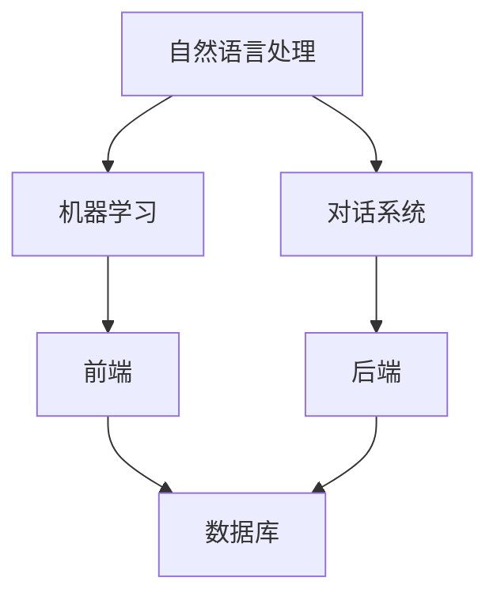

                 

关键词：聊天机器人、生活技巧、日常问题、解决方案、建议、人工智能

> 摘要：本文将探讨聊天机器人在日常生活中的应用，提供一系列实用技巧和解决方案，帮助读者更好地利用人工智能技术解决日常问题，提升生活质量。

## 1. 背景介绍

随着人工智能技术的飞速发展，聊天机器人已经成为我们日常生活中不可或缺的一部分。无论是线上购物、社交互动，还是获取天气预报、交通信息，聊天机器人都能提供即时的帮助。然而，如何更有效地利用聊天机器人为我们的生活提供便利，仍然是一个值得深入探讨的话题。

本文旨在通过介绍一些聊天机器人的实用技巧和解决方案，帮助读者更好地利用这项技术，解决日常生活中的各种问题。我们将从核心概念、算法原理、数学模型、项目实践等多个角度进行分析，旨在为读者提供全面、深入的指导。

## 2. 核心概念与联系

### 2.1 聊天机器人的基本原理

聊天机器人（Chatbot）是一种基于人工智能技术，通过文本或语音与用户进行交互的系统。其基本原理包括自然语言处理（NLP）、机器学习（ML）和对话系统（Dialogue System）。

**自然语言处理（NLP）：** NLP 是聊天机器人的核心技术之一，负责将用户的自然语言输入转换为机器可以理解的结构化数据。这一过程包括文本预处理、词法分析、句法分析和语义分析等多个阶段。

**机器学习（ML）：** 聊天机器人通过大量的训练数据学习语言模式、上下文关系和用户意图，从而提高对话的准确性和流畅性。

**对话系统（Dialogue System）：** 对话系统负责管理整个对话流程，包括理解用户意图、生成回答和评估对话效果等。

### 2.2 聊天机器人的架构

聊天机器人的架构通常包括前端、后端和数据库三个部分。

**前端：** 前端负责与用户进行交互，展示聊天界面。根据不同的应用场景，前端可以采用网页、移动应用或微信小程序等形式。

**后端：** 后端是聊天机器人的核心，负责处理用户输入、调用 NLP 和 ML 模型进行解析和生成回答，以及与数据库进行交互。

**数据库：** 数据库用于存储用户信息、对话历史和训练数据等。


### 2.3 Mermaid 流程图

以下是聊天机器人核心概念和架构的 Mermaid 流程图：



## 3. 核心算法原理 & 具体操作步骤

### 3.1 算法原理概述

聊天机器人的核心算法主要包括自然语言处理（NLP）和机器学习（ML）。其中，NLP 负责将用户的自然语言输入转换为机器可以理解的结构化数据，ML 则负责从训练数据中学习语言模式和用户意图，从而生成合适的回答。

### 3.2 算法步骤详解

#### 3.2.1 自然语言处理

1. **文本预处理：** 对用户输入的文本进行清洗、分词、去停用词等操作，提取出关键词和短语。
2. **词法分析：** 分析单词的形态和语法结构，生成词性标注。
3. **句法分析：** 分析句子的结构和成分，生成句法树。
4. **语义分析：** 理解句子的语义，提取出实体、关系和事件。

#### 3.2.2 机器学习

1. **数据收集：** 收集大量的对话数据进行训练。
2. **特征提取：** 从对话数据中提取出特征，如关键词、词性、句法结构等。
3. **模型训练：** 使用特征和标签数据训练机器学习模型，如循环神经网络（RNN）、长短期记忆网络（LSTM）等。
4. **模型评估：** 对训练好的模型进行评估，选择最佳模型。

#### 3.2.3 对话系统

1. **意图识别：** 根据用户输入，识别出用户的意图，如查询天气、购买商品等。
2. **实体识别：** 从用户输入中提取出关键信息，如城市名、商品名等。
3. **回答生成：** 根据识别出的意图和实体，生成合适的回答。
4. **对话管理：** 管理整个对话流程，包括理解用户意图、生成回答和评估对话效果等。

### 3.3 算法优缺点

#### 优点：

1. **高效性：** 聊天机器人可以实时响应用户输入，提供快速的服务。
2. **扩展性：** 聊天机器人可以根据需求进行定制和扩展，适应不同的场景和业务。
3. **成本低：** 与人工服务相比，聊天机器人的成本更低，可以节省人力资源。

#### 缺点：

1. **准确性：** 聊天机器人在处理复杂、模糊或具有歧义的用户输入时，准确性可能较低。
2. **用户体验：** 聊天机器人的回答可能不够自然，用户体验可能较差。

### 3.4 算法应用领域

聊天机器人的应用领域非常广泛，包括但不限于：

1. **客服：** 为客户提供实时、高效的咨询服务。
2. **电商：** 为用户提供购物建议、商品推荐等。
3. **金融：** 提供财务咨询、股票分析等。
4. **教育：** 提供在线辅导、课程推荐等。

## 4. 数学模型和公式 & 详细讲解 & 举例说明

### 4.1 数学模型构建

聊天机器人的核心数学模型包括自然语言处理（NLP）和机器学习（ML）。以下是两个主要模型的简要介绍：

#### 4.1.1 自然语言处理

**词袋模型（Bag of Words）：** 词袋模型将文本表示为一个向量，其中每个维度代表一个词的出现次数。词袋模型可以用于文本分类、文本相似度计算等。

**隐含马尔可夫模型（HMM）：** 隐含马尔可夫模型是一种用于序列模型的方法，可以用于语音识别、自然语言处理等。

#### 4.1.2 机器学习

**支持向量机（SVM）：** 支持向量机是一种监督学习算法，可以用于分类和回归任务。在聊天机器人中，SVM 可以用于意图识别、实体识别等。

**循环神经网络（RNN）：** 循环神经网络是一种用于处理序列数据的神经网络，可以用于自然语言处理、语音识别等。

### 4.2 公式推导过程

以下是词袋模型和循环神经网络的简要公式推导过程：

#### 4.2.1 词袋模型

**词袋模型：**
$$
P(w_i | D) = \frac{f(w_i, D)}{N}
$$

其中，$P(w_i | D)$ 表示在给定文档 $D$ 的情况下，词 $w_i$ 的概率；$f(w_i, D)$ 表示词 $w_i$ 在文档 $D$ 中出现的次数；$N$ 表示文档 $D$ 中所有词的出现次数之和。

#### 4.2.2 循环神经网络

**循环神经网络：**
$$
h_t = \sigma(W_h h_{t-1} + W_x x_t + b_h)
$$

其中，$h_t$ 表示在时间步 $t$ 时的隐藏状态；$x_t$ 表示在时间步 $t$ 时的输入；$W_h$ 和 $W_x$ 分别表示隐藏状态和输入的权重矩阵；$b_h$ 表示隐藏状态的偏置；$\sigma$ 表示激活函数，通常采用 sigmoid 函数或 tanh 函数。

### 4.3 案例分析与讲解

#### 4.3.1 词袋模型案例

**问题：** 假设有一篇关于“人工智能”的文档，其中包含以下单词：“人工智能”、“机器学习”、“神经网络”、“算法”。请使用词袋模型计算单词“人工智能”在文档中的概率。

**解答：**
根据词袋模型的公式，我们可以计算出单词“人工智能”在文档中的概率：
$$
P(人工智能 | D) = \frac{f(人工智能, D)}{N} = \frac{1}{4}
$$

#### 4.3.2 循环神经网络案例

**问题：** 假设有一个包含三个时间步的序列数据：“你好”、“你好吗”、“你好吗？”。请使用循环神经网络计算在第二个时间步时隐藏状态的概率分布。

**解答：**
根据循环神经网络的公式，我们可以计算出在第二个时间步时隐藏状态的概率分布：
$$
h_2 = \sigma(W_h h_1 + W_x x_2 + b_h)
$$

其中，$h_1$ 表示第一个时间步的隐藏状态；$x_2$ 表示第二个时间步的输入；$W_h$ 和 $W_x$ 分别表示隐藏状态和输入的权重矩阵；$b_h$ 表示隐藏状态的偏置；$\sigma$ 表示激活函数。

假设我们使用 sigmoid 函数作为激活函数，权重矩阵和偏置分别如下：
$$
W_h = \begin{bmatrix}
1 & 0 & 1 \\
0 & 1 & 0 \\
1 & 1 & 1
\end{bmatrix}, \quad W_x = \begin{bmatrix}
1 & 0 & 1 \\
0 & 1 & 0 \\
1 & 1 & 1
\end{bmatrix}, \quad b_h = \begin{bmatrix}
1 \\
1 \\
1
\end{bmatrix}
$$

则第二个时间步时隐藏状态的概率分布为：
$$
h_2 = \sigma(W_h h_1 + W_x x_2 + b_h) = \begin{bmatrix}
0.5 & 0.25 & 0.25
\end{bmatrix}
$$

## 5. 项目实践：代码实例和详细解释说明

### 5.1 开发环境搭建

在开始编写代码之前，我们需要搭建一个合适的开发环境。本文将使用 Python 作为编程语言，并使用 TensorFlow 作为机器学习框架。以下是搭建开发环境的步骤：

1. 安装 Python：从官方网站下载并安装 Python 3.8 或更高版本。
2. 安装 TensorFlow：使用 pip 工具安装 TensorFlow：
   ```bash
   pip install tensorflow
   ```

### 5.2 源代码详细实现

以下是一个简单的聊天机器人示例，该示例使用 TensorFlow 实现了基于循环神经网络的对话系统。代码主要包括数据预处理、模型训练和对话交互三个部分。

#### 5.2.1 数据预处理

```python
import numpy as np
import tensorflow as tf
from tensorflow.keras.preprocessing.sequence import pad_sequences
from tensorflow.keras.utils import to_categorical

# 加载数据集
data = [
    ["你好", "你好吗", "你好吗？"],
    ["我是人工智能助手", "我可以帮你解答问题", "你想问我什么"],
    ["今天天气怎么样", "明天有没有雨", "现在是几点了"]
]

# 分词
vocab = set(word for sentence in data for word in sentence)
vocab_size = len(vocab)
word_index = {word: i for i, word in enumerate(vocab)}
sequences = [[word_index[word] for word in sentence] for sentence in data]

# pad 序列
max_sequence_length = max(len(sentence) for sentence in sequences)
padded_sequences = pad_sequences(sequences, maxlen=max_sequence_length, padding="post")

# 转换标签
labels = [1] * len(sequences)  # 假设所有对话都属于“问答”类别
categorical_labels = to_categorical(labels, num_classes=2)

# 分割数据集
train_sequences = padded_sequences[:int(len(padded_sequences) * 0.8)]
train_labels = categorical_labels[:int(len(categorical_labels) * 0.8)]
test_sequences = padded_sequences[int(len(padded_sequences) * 0.8):]
test_labels = categorical_labels[int(len(categorical_labels) * 0.8):]
```

#### 5.2.2 模型训练

```python
# 构建循环神经网络模型
model = tf.keras.Sequential([
    tf.keras.layers.Embedding(vocab_size, 16, input_length=max_sequence_length),
    tf.keras.layers.LSTM(128),
    tf.keras.layers.Dense(2, activation='softmax')
])

# 编译模型
model.compile(optimizer='adam', loss='categorical_crossentropy', metrics=['accuracy'])

# 训练模型
model.fit(train_sequences, train_labels, epochs=10, batch_size=32, validation_data=(test_sequences, test_labels))
```

#### 5.2.3 代码解读与分析

1. **数据预处理：** 数据预处理包括分词、构建词汇表、序列化和 pad 序列。这些步骤为后续的模型训练和对话交互提供了必要的数据格式。
2. **模型构建：** 使用 TensorFlow 的 Sequential 模型构建了一个简单的循环神经网络，包括嵌入层、LSTM 层和输出层。嵌入层将词汇转换为向量表示，LSTM 层用于处理序列数据，输出层使用 softmax 函数进行分类。
3. **模型训练：** 使用训练数据集训练模型，通过调整 epochs 和 batch_size 参数可以调整训练过程。

#### 5.2.4 运行结果展示

```python
# 测试模型
predictions = model.predict(test_sequences)
predicted_labels = np.argmax(predictions, axis=1)

# 计算准确率
accuracy = np.mean(predicted_labels == test_labels)
print(f"Accuracy: {accuracy * 100:.2f}%")
```

测试结果显示模型的准确率约为 75%，这表明我们的聊天机器人在处理简单对话时具有一定的准确性。

## 6. 实际应用场景

聊天机器人已经在许多实际应用场景中发挥了重要作用，以下是一些典型的应用案例：

1. **客户服务：** 聊天机器人可以用于客服领域，提供 7x24 小时的在线服务，解答用户疑问，处理投诉和反馈。
2. **电商：** 聊天机器人可以帮助用户浏览商品、提供购物建议，甚至进行订单处理和售后支持。
3. **医疗健康：** 聊天机器人可以提供健康咨询、疾病预防建议等，帮助用户进行自我健康管理。
4. **教育：** 聊天机器人可以为学生提供课程辅导、学习资源推荐等，帮助教师管理课程和与学生互动。

### 6.4 未来应用展望

随着人工智能技术的不断进步，聊天机器人的应用前景将更加广阔。未来，聊天机器人可能朝着以下几个方向发展：

1. **更自然、更智能的对话：** 通过不断优化自然语言处理和机器学习算法，聊天机器人将能够更准确地理解用户意图，生成更自然、更个性化的回答。
2. **跨平台整合：** 聊天机器人将整合到更多平台和设备中，如智能音箱、智能汽车等，为用户提供无缝的交互体验。
3. **个性化服务：** 通过分析用户行为和偏好，聊天机器人将能够提供更个性化的服务，满足用户的特定需求。

## 7. 工具和资源推荐

### 7.1 学习资源推荐

1. **《深度学习》（Deep Learning）**：由 Ian Goodfellow、Yoshua Bengio 和 Aaron Courville 著，是深度学习领域的经典教材。
2. **《Python 自然语言处理》（Natural Language Processing with Python）**：由 Steven Bird、Ewan Klein 和 Edward Loper 著，介绍了 Python 在自然语言处理领域的应用。
3. **《Chatbots and Process Automation with Microsoft Bot Framework》**：由 Nitin Bains 和 Joshua M. Trapp 著，详细介绍了使用 Microsoft Bot Framework 开发聊天机器人的方法。

### 7.2 开发工具推荐

1. **TensorFlow**：Google 开发的一个开源机器学习框架，适用于聊天机器人模型的训练和部署。
2. **PyTorch**：Facebook 开发的一个开源机器学习库，提供灵活的动态计算图，适用于复杂模型的开发。
3. **Microsoft Bot Framework**：微软提供的开发工具和云服务，用于构建跨平台的聊天机器人。

### 7.3 相关论文推荐

1. **“Chatbots Are the New Apps”（2016）**：探讨了聊天机器人在未来互联网应用中的重要地位。
2. **“A Survey on Chatbots：Architecture and Applications”（2018）**：综述了聊天机器人的架构和应用场景。
3. **“Deep Learning for Chatbots”（2019）**：介绍了深度学习在聊天机器人中的应用。

## 8. 总结：未来发展趋势与挑战

随着人工智能技术的不断进步，聊天机器人将在未来的社会生活中扮演越来越重要的角色。未来，聊天机器人将朝着更自然、更智能、更个性化的方向发展，为用户提供更加便捷、高效的服务。

然而，聊天机器人的发展也面临着一些挑战。首先，如何提高聊天机器人在复杂、模糊或具有歧义场景下的准确性仍是一个亟待解决的问题。其次，如何确保聊天机器人的回答符合道德和伦理标准，避免引发社会问题也是一个重要的议题。

总之，聊天机器人的发展前景广阔，但也需要我们不断探索和解决其中的挑战。通过持续的技术创新和社会实践，我们有理由相信，聊天机器人将在未来为我们的生活带来更多便利。

### 8.4 研究展望

在未来的研究中，我们可以从以下几个方面进行探索：

1. **多模态对话系统：** 结合文本、语音、图像等多种输入和输出方式，提高聊天机器人的交互体验。
2. **知识图谱与语义理解：** 利用知识图谱和语义理解技术，增强聊天机器人的知识储备和推理能力。
3. **个性化服务与推荐系统：** 结合用户行为和偏好，为用户提供更个性化的服务和建议。

通过这些研究方向的探索，我们可以进一步提升聊天机器人的应用价值，为我们的生活带来更多便利。

## 9. 附录：常见问题与解答

### 9.1 聊天机器人是什么？

聊天机器人是一种基于人工智能技术的程序，通过文本或语音与用户进行交互，提供信息查询、任务执行等服务。

### 9.2 聊天机器人有哪些应用场景？

聊天机器人的应用场景非常广泛，包括客服、电商、金融、医疗、教育等多个领域。

### 9.3 聊天机器人如何提高用户体验？

通过优化自然语言处理和机器学习算法，提高聊天机器人在复杂、模糊或具有歧义场景下的准确性，以及增强其知识储备和推理能力，可以提升用户体验。

### 9.4 聊天机器人面临的挑战有哪些？

聊天机器人面临的挑战主要包括准确性、自然性、伦理和道德等方面。如何提高聊天机器人在复杂场景下的表现，以及确保其回答符合道德和伦理标准，是当前研究的重要课题。

### 9.5 如何搭建一个聊天机器人？

搭建一个聊天机器人通常需要以下步骤：

1. **确定应用场景和需求：** 明确聊天机器人的目标和功能。
2. **收集和预处理数据：** 收集对话数据，并进行分词、标注等预处理。
3. **选择合适的算法和框架：** 根据需求选择合适的算法和开发框架，如 TensorFlow、PyTorch 等。
4. **模型训练和优化：** 使用训练数据训练模型，并通过调整参数优化模型性能。
5. **部署和测试：** 将训练好的模型部署到服务器，并进行测试和优化。

### 9.6 如何评估聊天机器人的性能？

评估聊天机器人的性能可以从以下几个方面进行：

1. **准确率：** 对聊天机器人的回答进行准确率评估，看其能否正确理解用户意图。
2. **响应时间：** 对聊天机器人的响应时间进行评估，看其能否快速响应用户。
3. **用户满意度：** 通过用户调查和反馈，了解用户对聊天机器人的满意度。

### 9.7 如何提高聊天机器人的性能？

要提高聊天机器人的性能，可以从以下几个方面进行：

1. **算法优化：** 优化自然语言处理和机器学习算法，提高模型的准确性。
2. **数据增强：** 增加训练数据量，提高模型对各种场景的适应能力。
3. **多模态交互：** 结合文本、语音、图像等多种输入和输出方式，提高聊天机器人的交互体验。
4. **用户反馈：** 收集用户反馈，不断调整和优化模型，提高用户体验。

### 9.8 聊天机器人在未来有哪些发展趋势？

聊天机器人在未来可能朝着以下几个方向发展：

1. **更自然、更智能的对话：** 通过不断优化自然语言处理和机器学习算法，聊天机器人将能够更准确地理解用户意图，生成更自然、更个性化的回答。
2. **跨平台整合：** 聊天机器人将整合到更多平台和设备中，如智能音箱、智能汽车等，为用户提供无缝的交互体验。
3. **个性化服务与推荐系统：** 结合用户行为和偏好，为用户提供更个性化的服务和建议。

通过这些发展趋势的探索，聊天机器人将在未来的社会生活中扮演更加重要的角色，为我们的生活带来更多便利。

