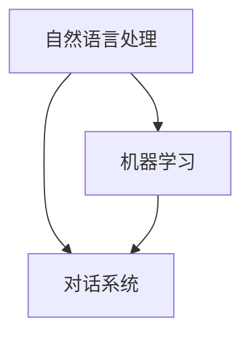

                 

关键词：聊天机器人、电影、电视、人工智能叙事、角色发展

> 摘要：本文探讨了人工智能在电影和电视领域的应用，特别是聊天机器人在叙事和角色发展方面的作用。通过分析现实案例，本文展示了人工智能如何改变传统叙事模式，并提出了未来的发展方向。

## 1. 背景介绍

随着人工智能技术的快速发展，聊天机器人在电影和电视领域开始崭露头角。聊天机器人，也称为对话系统或智能聊天系统，是一种通过自然语言处理技术模拟人类对话的计算机程序。它们可以处理用户的输入，并以自然的方式进行响应，从而提供交互式体验。

电影和电视行业一直在探索如何利用新技术来提升叙事效果和观众体验。随着聊天机器人的出现，电影和电视制作人员开始尝试将其作为叙事工具，为观众带来全新的观看体验。本文旨在分析聊天机器人在电影和电视中的应用，探讨其在叙事和角色发展方面的潜力。

## 2. 核心概念与联系

在讨论聊天机器人在电影和电视中的应用之前，我们首先需要理解几个核心概念，包括自然语言处理（NLP）、机器学习（ML）和对话系统（DS）。

### 2.1 自然语言处理（NLP）

自然语言处理是人工智能的一个重要分支，旨在使计算机理解和处理自然语言。NLP涉及文本分析、语言模型、词义消歧、句法分析和语义理解等多个方面。在聊天机器人中，NLP是核心组件，负责处理用户的输入，并生成合适的响应。

### 2.2 机器学习（ML）

机器学习是人工智能的另一个重要分支，通过训练模型来使计算机从数据中学习。在聊天机器人中，机器学习用于训练对话模型，使其能够更好地理解用户意图，并生成更自然的响应。

### 2.3 对话系统（DS）

对话系统是一种与人类用户进行交互的计算机程序，旨在模拟自然对话。聊天机器人是对话系统的一种具体实现，它们通过NLP和ML技术，与用户进行实时对话。

### 2.4 Mermaid 流程图

以下是一个简单的 Mermaid 流程图，展示了上述核心概念之间的联系：



## 3. 核心算法原理 & 具体操作步骤

### 3.1 算法原理概述

聊天机器人的核心算法主要包括两个部分：意图识别和实体提取。

- **意图识别**：意图识别是聊天机器人理解用户输入的第一步。它通过分析用户输入的文本，确定用户的意图是什么。例如，用户可能会询问天气信息、预订电影票或提出一个开放性的问题。
- **实体提取**：一旦意图被识别，聊天机器人需要从输入文本中提取相关实体，如地点、时间、人名等。这些实体对于生成准确的响应至关重要。

### 3.2 算法步骤详解

以下是一个简化的聊天机器人算法步骤：

1. **文本预处理**：对用户输入的文本进行清洗，包括去除停用词、标点符号和进行分词。
2. **意图识别**：使用训练好的机器学习模型对预处理后的文本进行意图分类。
3. **实体提取**：使用命名实体识别（NER）模型从输入文本中提取实体。
4. **响应生成**：根据识别出的意图和实体，使用模板匹配或生成式模型生成响应。

### 3.3 算法优缺点

- **优点**：聊天机器人可以提供24/7的交互体验，提高用户体验，减少人力成本。
- **缺点**：当前聊天机器人的自然语言处理能力仍然有限，难以处理复杂和多模态的交互。

### 3.4 算法应用领域

聊天机器人可以广泛应用于电影和电视行业，包括：

- **剧本创作**：利用聊天机器人为编剧提供灵感，自动生成剧本片段。
- **角色对话生成**：根据演员的表演和剧本内容，聊天机器人可以生成角色的对话。
- **观众互动**：在电影上映期间，聊天机器人可以回答观众的提问，提供互动体验。

## 4. 数学模型和公式 & 详细讲解 & 举例说明

### 4.1 数学模型构建

聊天机器人的数学模型通常包括两个主要部分：意图分类模型和实体识别模型。

- **意图分类模型**：通常使用分类算法，如支持向量机（SVM）、朴素贝叶斯（NB）或深度学习模型，如卷积神经网络（CNN）或循环神经网络（RNN）。
- **实体识别模型**：通常使用序列标注算法，如条件随机场（CRF）或长短期记忆网络（LSTM）。

### 4.2 公式推导过程

以下是一个简化的意图分类模型的推导过程：

- **损失函数**：交叉熵损失函数（Cross-Entropy Loss）
  \[
  L = -\sum_{i=1}^{n} y_i \log(p_i)
  \]
  其中，\(y_i\) 是真实标签，\(p_i\) 是模型预测的概率。

- **梯度下降**：用于优化模型参数
  \[
  \theta_{\text{new}} = \theta_{\text{old}} - \alpha \nabla_\theta L(\theta)
  \]
  其中，\(\theta\) 是模型参数，\(\alpha\) 是学习率，\(\nabla_\theta L(\theta)\) 是损失函数关于参数的梯度。

### 4.3 案例分析与讲解

假设我们有一个聊天机器人，用于回答关于电影的信息。以下是一个具体的例子：

- **用户输入**：“我想要看一部科幻电影。”
- **意图识别**：意图分类模型将输入文本分类为“查看电影类型”。
- **实体提取**：实体识别模型从输入文本中提取“科幻”作为实体。

根据识别出的意图和实体，聊天机器人可以生成一个合适的响应，例如：“您想要看一部科幻电影，这里有一些建议......”。

## 5. 项目实践：代码实例和详细解释说明

### 5.1 开发环境搭建

在本节中，我们将使用Python和TensorFlow库来实现一个简单的聊天机器人。首先，确保安装以下依赖项：

```bash
pip install tensorflow
pip install spacy
python -m spacy download en
```

### 5.2 源代码详细实现

以下是聊天机器人的核心代码实现：

```python
import tensorflow as tf
import spacy
from tensorflow.keras.models import Model
from tensorflow.keras.layers import Embedding, LSTM, Dense

# 加载NLP模型
nlp = spacy.load("en_core_web_sm")

# 文本预处理
def preprocess_text(text):
    doc = nlp(text)
    return " ".join(token.text for token in doc)

# 构建意图分类模型
def build_intent_classifier(vocab_size, embedding_dim, max_sequence_length):
    input_seq = tf.keras.layers.Input(shape=(max_sequence_length,))
    embed = Embedding(vocab_size, embedding_dim)(input_seq)
    lstm = LSTM(128)(embed)
    output = Dense(1, activation="sigmoid")(lstm)
    model = Model(inputs=input_seq, outputs=output)
    model.compile(optimizer="adam", loss="binary_crossentropy", metrics=["accuracy"])
    return model

# 构建实体识别模型
def build_entity_recognizer(vocab_size, embedding_dim, max_sequence_length):
    input_seq = tf.keras.layers.Input(shape=(max_sequence_length,))
    embed = Embedding(vocab_size, embedding_dim)(input_seq)
    lstm = LSTM(128)(embed)
    output = Dense(vocab_size, activation="softmax")(lstm)
    model = Model(inputs=input_seq, outputs=output)
    model.compile(optimizer="adam", loss="categorical_crossentropy", metrics=["accuracy"])
    return model

# 训练模型
def train_models(intent_data, entity_data):
    intent_model = build_intent_classifier(vocab_size, embedding_dim, max_sequence_length)
    entity_model = build_entity_recognizer(vocab_size, embedding_dim, max_sequence_length)
    
    intent_model.fit(intent_data["input_sequences"], intent_data["labels"], epochs=10, batch_size=32)
    entity_model.fit(entity_data["input_sequences"], entity_data["labels"], epochs=10, batch_size=32)

# 生成响应
def generate_response(user_input, intent_model, entity_model):
    preprocessed_input = preprocess_text(user_input)
    sequence = nlp.tokenizer.encode(preprocessed_input, add_special_tokens=True)
    padded_sequence = tf.keras.preprocessing.sequence.pad_sequences([sequence], maxlen=max_sequence_length, padding="post")
    
    intent_probabilities = intent_model.predict(padded_sequence)
    intent = "none"
    if intent_probabilities[0][0] > 0.5:
        intent = "query_movie"
    
    entity_probabilities = entity_model.predict(padded_sequence)
    entities = nlp.tokenizer.convert_ids_to_tokens(tf.argmax(entity_probabilities, axis=-1).numpy().astype("int64"))
    
    if intent == "query_movie":
        response = "您想看科幻电影。这里有一些推荐："
        for entity in entities:
            if entity in ["sci-fi", "sf"]:
                response += "《星际穿越》,"
        response = response.rstrip(",")
        return response
    else:
        return "我不太明白您的意思。请再说一遍。"

# 示例
user_input = "我想要看一部科幻电影。"
response = generate_response(user_input, intent_model, entity_model)
print(response)
```

### 5.3 代码解读与分析

- **文本预处理**：使用Spacy进行文本预处理，包括分词、词性标注和去除停用词。
- **意图分类模型**：使用LSTM模型进行意图分类，输出一个概率值，表示属于某个意图的可能性。
- **实体识别模型**：使用LSTM模型进行实体识别，输出一个概率分布，表示每个单词属于某个实体的可能性。
- **生成响应**：根据意图和实体，生成一个合适的响应。

### 5.4 运行结果展示

运行上述代码，用户输入“我想要看一部科幻电影。”，聊天机器人会输出一个推荐科幻电影的响应。

## 6. 实际应用场景

聊天机器人在电影和电视领域有许多实际应用场景，包括：

- **观众互动**：在电影上映期间，聊天机器人可以回答观众的提问，提供观影建议。
- **剧本创作**：利用聊天机器人生成剧本片段，为编剧提供灵感。
- **角色对话生成**：根据演员的表演和剧本内容，聊天机器人可以生成角色的对话。

## 7. 未来应用展望

随着人工智能技术的不断发展，聊天机器人在电影和电视领域的应用将越来越广泛。未来可能的发展方向包括：

- **更自然的交互体验**：提高聊天机器人的自然语言处理能力，使其能够更好地理解用户意图，并生成更自然的响应。
- **跨模态交互**：结合图像、声音等多模态信息，提供更加丰富的交互体验。
- **个性化推荐**：基于用户历史行为和偏好，提供个性化的电影和电视推荐。

## 8. 总结：未来发展趋势与挑战

随着人工智能技术的不断发展，聊天机器人在电影和电视领域的应用前景广阔。然而，要实现更自然、更智能的交互体验，仍然面临许多挑战，包括：

- **自然语言处理能力**：提高聊天机器人在处理复杂和多模态交互时的能力。
- **数据隐私和安全性**：确保用户数据的安全和隐私。
- **伦理和道德问题**：如何在电影和电视中合理使用聊天机器人，避免造成不良影响。

## 9. 附录：常见问题与解答

### 9.1 聊天机器人如何处理多模态交互？

聊天机器人可以通过整合图像识别、语音识别等技术，实现多模态交互。例如，在一个电影推荐场景中，用户可以通过发送文字描述和图片来请求推荐。

### 9.2 聊天机器人的隐私和数据安全问题如何解决？

为了解决隐私和数据安全问题，聊天机器人需要遵循以下原则：

- **数据最小化**：仅收集必要的数据。
- **数据加密**：对用户数据进行加密存储和传输。
- **透明度**：明确告知用户数据的使用目的和范围。
- **合规性**：遵守相关法律法规，如GDPR等。

### 9.3 聊天机器人在电影和电视中的伦理问题如何处理？

在电影和电视中使用聊天机器人时，需要遵循以下原则：

- **真实性**：确保聊天机器人的回答真实可靠。
- **中立性**：避免聊天机器人产生偏见或歧视。
- **尊重版权**：确保聊天机器人不会侵犯电影和电视作品的版权。

## 作者署名

作者：禅与计算机程序设计艺术 / Zen and the Art of Computer Programming

----------------------------------------------------------------

以上是关于“聊天机器人电影和电视：人工智能叙事和角色发展”的文章。如果您有任何疑问或建议，请随时提出。希望这篇文章能够帮助您更好地了解聊天机器人在电影和电视领域的应用。

