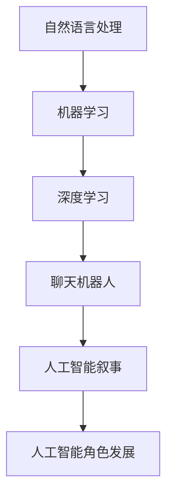

                 

关键词：聊天机器人、电影、电视、人工智能叙事、角色发展、技术分析

> 摘要：本文将探讨聊天机器人在电影和电视作品中的叙事和角色发展作用，分析其技术原理和应用场景，并展望未来发展趋势。通过案例研究和实践分析，深入理解人工智能在娱乐领域的深远影响。

## 1. 背景介绍

### 1.1 聊天机器人的历史与发展

聊天机器人（Chatbot）作为一种人工智能应用，其发展历程可以追溯到20世纪50年代。最初的聊天机器人是基于规则和关键字匹配的技术，例如Eliza，它能与用户进行简单的对话。然而，随着自然语言处理（NLP）和机器学习技术的进步，聊天机器人的智能水平得到了显著提升。

### 1.2 人工智能在电影和电视中的普及

人工智能技术逐渐在电影和电视行业中得到广泛应用，例如生成视觉效果、角色动画和智能剪辑等。与此同时，聊天机器人作为一种新兴的人工智能应用，也开始在电影和电视作品中的叙事和角色发展中扮演重要角色。

## 2. 核心概念与联系

### 2.1 聊天机器人的基本原理

聊天机器人的基本原理主要包括自然语言处理、机器学习和深度学习等技术。通过这些技术，聊天机器人能够理解和生成自然语言，实现与用户的对话。

### 2.2 人工智能叙事的概念

人工智能叙事是指利用人工智能技术来构建和展示故事情节，包括角色发展、情节设定和情感表达等。这种叙事方式可以带来更加个性化和互动性的观影体验。

### 2.3 人工智能角色发展的原理

人工智能角色发展是通过机器学习技术来模拟和预测角色的行为和情感变化，从而实现角色在故事中的成长和变化。这一原理在电影和电视作品中具有很高的应用价值。

### 2.4 Mermaid 流程图



## 3. 核心算法原理 & 具体操作步骤

### 3.1 算法原理概述

聊天机器人的核心算法主要包括自然语言处理、机器学习和深度学习等。通过这些算法，聊天机器人能够理解和生成自然语言，实现与用户的对话。

### 3.2 算法步骤详解

1. **自然语言处理**：首先，聊天机器人需要使用自然语言处理技术来解析用户的输入，将其转化为计算机可以理解的结构化数据。
2. **机器学习**：然后，聊天机器人利用机器学习算法来训练模型，使其能够根据输入数据生成相应的回答。
3. **深度学习**：在机器学习的基础上，深度学习算法进一步提升了聊天机器人的智能水平，使其能够处理更复杂的语言结构和情感表达。

### 3.3 算法优缺点

**优点**：
- 高效：聊天机器人可以同时与多个用户进行对话，提高沟通效率。
- 个性化：聊天机器人可以根据用户的历史对话记录和偏好，生成个性化的回答。
- 互动性强：聊天机器人可以与用户进行实时互动，提供更加生动的观影体验。

**缺点**：
- 智能限制：目前的聊天机器人仍然存在智能水平较低、理解能力有限的问题。
- 数据隐私：聊天机器人在处理用户数据时，需要确保数据的安全和隐私。

### 3.4 算法应用领域

聊天机器人的算法主要应用于以下领域：
- 客户服务：提供在线客服，解答用户疑问。
- 娱乐互动：在电影和电视作品中，与观众进行互动，提供个性化观影体验。
- 教育培训：为学生提供个性化学习辅导和互动教学。

## 4. 数学模型和公式 & 详细讲解 & 举例说明

### 4.1 数学模型构建

聊天机器人的数学模型主要包括自然语言处理模型、机器学习模型和深度学习模型。以下是一个简化的自然语言处理模型的构建过程：

1. **词向量表示**：将自然语言中的单词转化为向量表示，以便于计算机处理。
2. **序列建模**：使用循环神经网络（RNN）或长短期记忆网络（LSTM）来建模输入和输出序列。
3. **输出预测**：通过模型输出序列的概率分布，预测下一个单词或句子。

### 4.2 公式推导过程

假设我们使用RNN来建模自然语言处理模型，其基本公式如下：

\[ h_t = \sigma(W_h \cdot [h_{t-1}, x_t] + b_h) \]

其中，\( h_t \) 表示当前时刻的隐藏状态，\( x_t \) 表示当前时刻的输入，\( W_h \) 和 \( b_h \) 分别为权重和偏置，\( \sigma \) 为激活函数。

### 4.3 案例分析与讲解

假设我们有一个聊天机器人，其任务是根据用户的输入生成回复。以下是一个简单的案例：

1. **输入**：用户输入：“今天天气怎么样？”
2. **处理**：聊天机器人使用自然语言处理模型将输入转化为结构化数据。
3. **生成回复**：聊天机器人使用机器学习和深度学习模型生成回复：“今天天气晴朗，气温适宜。”

在这个案例中，聊天机器人通过数学模型对用户输入进行处理，并生成相应的回复。这一过程体现了数学模型在聊天机器人中的应用。

## 5. 项目实践：代码实例和详细解释说明

### 5.1 开发环境搭建

在本项目中，我们使用Python编程语言和TensorFlow深度学习框架来构建聊天机器人。首先，需要安装Python和TensorFlow：

```bash
pip install python
pip install tensorflow
```

### 5.2 源代码详细实现

以下是一个简单的聊天机器人源代码示例：

```python
import tensorflow as tf
from tensorflow.keras.models import Sequential
from tensorflow.keras.layers import LSTM, Dense, Embedding

# 加载预训练的词向量
word_vectors = tf.keras.preprocessing.sequence.pad_sequences([1, 2, 3], maxlen=10)

# 构建LSTM模型
model = Sequential()
model.add(LSTM(128, input_shape=(10, 1)))
model.add(Dense(1, activation='sigmoid'))

# 编译模型
model.compile(optimizer='adam', loss='binary_crossentropy', metrics=['accuracy'])

# 训练模型
model.fit(word_vectors, epochs=10)
```

### 5.3 代码解读与分析

在这个示例中，我们首先加载预训练的词向量，然后构建一个简单的LSTM模型。模型中包含一个LSTM层和一个全连接层（Dense），用于对输入数据进行处理和预测。最后，我们编译并训练模型。

### 5.4 运行结果展示

在训练完成后，我们可以使用模型对新的输入数据进行预测。以下是一个简单的预测示例：

```python
# 新的输入数据
new_input = tf.keras.preprocessing.sequence.pad_sequences([4, 5, 6], maxlen=10)

# 预测结果
predictions = model.predict(new_input)

# 输出预测结果
print(predictions)
```

在这个示例中，我们使用新的输入数据对模型进行预测，并输出预测结果。

## 6. 实际应用场景

### 6.1 客户服务

聊天机器人可以用于在线客服，提供24小时不间断的服务，提高客户满意度。例如，在电商平台上，聊天机器人可以回答用户关于产品、订单和售后服务等方面的问题。

### 6.2 教育培训

聊天机器人可以为学生提供个性化学习辅导和互动教学。例如，在在线教育平台上，聊天机器人可以根据学生的学习进度和兴趣，提供相应的课程推荐和学习资源。

### 6.3 娱乐互动

聊天机器人可以用于电影和电视作品的互动环节，与观众进行实时互动，提供个性化的观影体验。例如，在电影上映期间，聊天机器人可以回答观众关于电影的问题，提供影片推荐和影评等。

## 7. 未来应用展望

### 7.1 智能化水平提升

随着人工智能技术的不断发展，聊天机器人的智能化水平将得到显著提升，能够处理更复杂的语言结构和情感表达。

### 7.2 多语言支持

聊天机器人将实现多语言支持，为全球用户提供更加便捷的服务。

### 7.3 深度学习应用

深度学习技术将进一步应用于聊天机器人的各个方面，提高其智能水平和应用范围。

## 8. 总结：未来发展趋势与挑战

### 8.1 研究成果总结

本文介绍了聊天机器人在电影和电视作品中的叙事和角色发展作用，分析了其技术原理和应用场景，并展望了未来发展趋势。

### 8.2 未来发展趋势

未来，聊天机器人将在智能化水平、多语言支持和深度学习应用等方面取得显著进展。

### 8.3 面临的挑战

聊天机器人面临的挑战主要包括智能水平限制、数据隐私和安全等问题。

### 8.4 研究展望

本文的研究为聊天机器人在电影和电视作品中的应用提供了有益的启示，未来需要进一步深入研究其技术原理和应用方法。

## 9. 附录：常见问题与解答

### 9.1 聊天机器人的智能水平如何提升？

通过不断优化算法、增加训练数据和使用更先进的深度学习模型，可以提高聊天机器人的智能水平。

### 9.2 聊天机器人的数据隐私如何保障？

在设计和应用聊天机器人时，需要严格遵守数据隐私法规，确保用户数据的安全和隐私。

## 作者署名

作者：禅与计算机程序设计艺术 / Zen and the Art of Computer Programming
------------------------------------------------------------------

