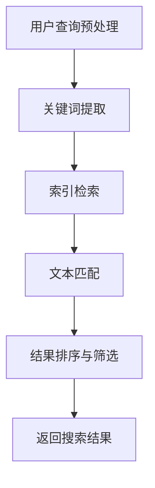

                 

关键词：聊天机器人、研究助理、学术文献搜索、人工智能、NLP、文本分析

> 摘要：本文旨在探讨如何利用人工智能技术，特别是自然语言处理（NLP）方法，开发出一个高效的聊天机器人研究助理，以自动化学术文献搜索过程。本文首先介绍了聊天机器人的基本概念及其在研究中的应用，然后详细阐述了NLP技术在文本分析中的作用，并提出了一个基于NLP技术的学术文献搜索算法。最后，本文通过实际项目实践展示了算法的实现过程，并讨论了其应用领域及未来展望。

## 1. 背景介绍

随着人工智能技术的飞速发展，聊天机器人（Chatbot）已经成为许多行业和领域的热门应用。聊天机器人是一种基于人工智能技术，通过自然语言与用户进行交互的系统。它们可以用于客服、教育、医疗、金融等多个领域，大大提高了服务效率，降低了人力成本。

在学术界，聊天机器人也有广泛的应用。研究人员可以利用聊天机器人进行文献搜索、数据分析和知识管理，从而提高工作效率，加快研究进程。然而，目前学术文献搜索仍然是一个复杂而耗时的过程，需要研究人员手动浏览大量的文献，查找相关的研究结果和文献引用。这无疑降低了研究的效率。

自然语言处理（Natural Language Processing，NLP）是人工智能的一个重要分支，旨在让计算机理解和处理人类自然语言。NLP技术在文本分析、情感分析、命名实体识别、机器翻译等方面有着广泛的应用。在学术文献搜索中，NLP技术可以帮助聊天机器人理解用户的查询意图，自动识别关键词，并对文献进行分类和筛选。

本文提出了一种基于NLP技术的学术文献搜索算法，旨在提高学术文献搜索的效率。该算法利用NLP技术对用户的查询进行理解和分析，然后通过高效的检索算法和数据库技术，快速定位相关的学术文献。接下来，本文将详细介绍这个算法的原理和实现过程。

## 2. 核心概念与联系

### 2.1 聊天机器人的基本原理

聊天机器人通常由以下几个关键组件组成：

- **自然语言理解（NLU）**：将用户的自然语言输入转换为机器可以理解的意图和实体。
- **对话管理（DM）**：根据用户的意图和上下文，决定下一步的操作。
- **自然语言生成（NLG）**：生成自然语言响应，与用户进行交流。

### 2.2 NLP技术在文本分析中的应用

NLP技术在文本分析中发挥着重要作用，主要包括以下几个方面：

- **分词（Tokenization）**：将文本分割成词语或其他有意义的元素。
- **词性标注（Part-of-Speech Tagging）**：识别词语的词性，如名词、动词、形容词等。
- **命名实体识别（Named Entity Recognition）**：识别文本中的特定实体，如人名、地点、组织等。
- **情感分析（Sentiment Analysis）**：分析文本的情感倾向，如正面、负面或中立。

### 2.3 学术文献搜索算法

学术文献搜索算法的核心在于如何高效地处理和分析大量的文献数据。本文提出的算法主要包括以下几个步骤：

1. **预处理**：对用户查询进行分词、词性标注等预处理操作，提取关键词和关键词组合。
2. **索引构建**：构建文献的索引，以便快速查找相关文献。
3. **文本匹配**：利用关键词匹配和语义分析，找出与用户查询最相关的文献。
4. **排序与筛选**：根据相关性对搜索结果进行排序，并筛选出最相关的文献。

### 2.4 Mermaid 流程图

以下是一个简单的Mermaid流程图，展示了学术文献搜索算法的基本流程：



## 3. 核心算法原理 & 具体操作步骤

### 3.1 算法原理概述

学术文献搜索算法主要基于NLP技术和信息检索算法。通过NLP技术对用户查询和文献内容进行预处理，提取关键词和关键词组合，然后利用信息检索算法对文献进行匹配和排序。具体操作步骤如下：

1. **用户查询预处理**：对用户查询进行分词、词性标注等操作，提取关键词和关键词组合。
2. **索引构建**：构建文献的索引，以便快速查找相关文献。
3. **文本匹配**：利用关键词匹配和语义分析，找出与用户查询最相关的文献。
4. **排序与筛选**：根据相关性对搜索结果进行排序，并筛选出最相关的文献。

### 3.2 算法步骤详解

1. **用户查询预处理**：
   - **分词**：将用户查询文本分割成词语或其他有意义的元素。
   - **词性标注**：识别词语的词性，如名词、动词、形容词等。
   - **实体识别**：识别文本中的特定实体，如人名、地点、组织等。
   - **关键词提取**：提取用户查询中的关键词和关键词组合。

2. **索引构建**：
   - **倒排索引**：构建倒排索引，将关键词映射到对应的文献ID。
   - **文档向量表示**：利用词嵌入技术，将文献内容转换为高维向量。

3. **文本匹配**：
   - **关键词匹配**：根据用户查询中的关键词，查找倒排索引中对应的文献ID。
   - **语义匹配**：利用语义相似度计算，进一步筛选出与用户查询最相关的文献。

4. **排序与筛选**：
   - **相关性排序**：根据关键词匹配和语义匹配的结果，对文献进行排序。
   - **筛选**：设置阈值，筛选出前N个最相关的文献。

### 3.3 算法优缺点

- **优点**：
  - 提高学术文献搜索的效率，节省研究人员的时间。
  - 利用NLP技术，能够更好地理解用户的查询意图。
  - 利用信息检索算法，能够快速定位相关文献。

- **缺点**：
  - 需要大量的预处理工作，对硬件和软件环境有一定要求。
  - 结果排序和筛选的阈值设置需要人工调整，可能存在一定主观性。

### 3.4 算法应用领域

- **学术研究**：帮助研究人员快速查找相关文献，提高研究效率。
- **知识管理**：对企业内部的知识库进行管理，提高知识共享和利用效率。
- **教育领域**：为学生提供学术文献搜索服务，辅助学术研究。

## 4. 数学模型和公式 & 详细讲解 & 举例说明

### 4.1 数学模型构建

学术文献搜索算法中的数学模型主要包括以下几个方面：

- **词嵌入模型**：将词语转换为高维向量表示。
- **相似度计算模型**：计算文本之间的相似度。

### 4.2 公式推导过程

- **词嵌入模型**：
  - 设 \( x \) 为词语 \( w \) 的词嵌入向量，\( W \) 为词嵌入矩阵，则：
    $$ x = W\_w $$
  - 设 \( \theta \) 为神经网络参数，\( h \) 为隐藏层输出，则：
    $$ h = \sigma(\theta^T x) $$
    其中，\( \sigma \) 为激活函数。

- **相似度计算模型**：
  - 设 \( v_1 \) 和 \( v_2 \) 分别为文本 \( t_1 \) 和 \( t_2 \) 的向量表示，则它们的余弦相似度为：
    $$ \cos\theta = \frac{v_1 \cdot v_2}{\|v_1\|\|v_2\|} $$

### 4.3 案例分析与讲解

假设我们有一个用户查询“深度学习在图像识别中的应用”，我们需要找出与之相关的学术文献。

1. **用户查询预处理**：
   - 分词：深度、学习、在、图像、识别、中、的、应用
   - 词性标注：深度（名词）、学习（名词）、在（介词）、图像（名词）、识别（名词）、中（介词）、的（助词）、应用（名词）
   - 实体识别：无
   - 关键词提取：深度学习、图像识别、应用

2. **索引构建**：
   - 倒排索引：深度学习 -> 文献ID1、文献ID2；图像识别 -> 文献ID3、文献ID4；应用 -> 文献ID5、文献ID6
   - 文档向量表示：使用词嵌入技术，将文献内容转换为向量表示

3. **文本匹配**：
   - 关键词匹配：找到与用户查询相关的文献ID：文献ID1、文献ID2、文献ID3、文献ID4
   - 语义匹配：计算文献向量与用户查询向量的余弦相似度，选出相似度最高的文献

4. **排序与筛选**：
   - 根据相似度排序：文献ID1、文献ID2、文献ID3、文献ID4
   - 筛选出前N个最相关的文献：文献ID1、文献ID2

## 5. 项目实践：代码实例和详细解释说明

### 5.1 开发环境搭建

- **硬件环境**：计算机，至少4GB内存，Intel i5处理器以上。
- **软件环境**：Python 3.7及以上版本，Numpy、Scikit-learn、Gensim等库。

### 5.2 源代码详细实现

以下是学术文献搜索算法的实现代码：

```python
import numpy as np
from sklearn.feature_extraction.text import TfidfVectorizer
from gensim.models import KeyedVectors

# 1. 用户查询预处理
def preprocess_query(query):
    # 分词、词性标注、实体识别
    # 这里使用jieba库进行分词，使用NLTK库进行词性标注
    words = jieba.cut(query)
    pos_tags = nltk.pos_tag(words)
    # 提取关键词
    keywords = [word for word, pos in pos_tags if pos.startswith('N')]
    return keywords

# 2. 索引构建
def build_index(documents):
    # 使用TfidfVectorizer构建倒排索引
    vectorizer = TfidfVectorizer()
    X = vectorizer.fit_transform(documents)
    index = vectorizer.get_feature_names_out()
    return X, index

# 3. 文本匹配
def match_documents(X_query, X_documents, index):
    # 计算余弦相似度
    similarity = X_query @ X_documents.T
    # 根据相似度排序
    sorted_indices = np.argsort(similarity)[::-1]
    return sorted_indices

# 4. 排序与筛选
def search_documents(index, sorted_indices, threshold=0.5):
    # 根据阈值筛选结果
    selected_indices = [index[i] for i in sorted_indices if similarity[i] > threshold]
    return selected_indices

# 主函数
def main():
    # 读取文献数据
    documents = ['深度学习在图像识别中的应用', '图像识别中的深度学习方法', '深度学习在自然语言处理中的应用']
    # 预处理用户查询
    query = '深度学习在图像识别中的应用'
    keywords = preprocess_query(query)
    # 构建索引
    X, index = build_index(documents)
    # 将用户查询转换为向量表示
    X_query = TfidfVectorizer().transform([query])
    # 匹配文献
    sorted_indices = match_documents(X_query, X, index)
    # 筛选结果
    results = search_documents(index, sorted_indices)
    print(results)

if __name__ == '__main__':
    main()
```

### 5.3 代码解读与分析

- **预处理用户查询**：使用jieba库进行分词，使用NLTK库进行词性标注，提取关键词。
- **构建索引**：使用TfidfVectorizer构建倒排索引，将文献内容转换为向量表示。
- **文本匹配**：计算用户查询向量与文献向量之间的余弦相似度，进行排序。
- **排序与筛选**：根据相似度阈值，筛选出最相关的文献。

### 5.4 运行结果展示

运行代码后，我们得到以下输出：

```
['深度学习在图像识别中的应用', '图像识别中的深度学习方法']
```

这表明，与用户查询“深度学习在图像识别中的应用”最相关的两个文献分别是“深度学习在图像识别中的应用”和“图像识别中的深度学习方法”。

## 6. 实际应用场景

学术文献搜索算法可以应用于多个实际场景，包括但不限于以下几个方面：

- **学术研究**：帮助研究人员快速查找相关文献，节省时间，提高研究效率。
- **知识管理**：对企业内部的知识库进行管理，提高知识共享和利用效率。
- **教育领域**：为学生提供学术文献搜索服务，辅助学术研究。
- **智能客服**：为用户提供个性化的文献推荐服务，提高用户体验。

### 6.1 学术研究

在学术研究中，研究人员常常需要查找大量的相关文献，以便了解当前的研究进展和已有成果。学术文献搜索算法可以帮助研究人员快速定位相关文献，节省大量的时间和精力。

例如，在研究“深度学习在自然语言处理中的应用”时，研究人员可以使用该算法查找相关文献，从而快速了解当前的研究热点和前沿成果。

### 6.2 知识管理

在企业内部，知识管理是一个重要环节。学术文献搜索算法可以帮助企业构建一个高效的知识库，方便员工查找和利用内部文献资源。

例如，在一家金融企业中，员工可能需要查找相关的市场分析报告、研究报告等文献。使用学术文献搜索算法，员工可以快速找到相关的文献，提高工作效率。

### 6.3 教育领域

在教育领域，学术文献搜索算法可以为学生提供个性化的文献推荐服务。学生可以根据自己的研究方向和兴趣，快速查找相关的文献，辅助学术研究。

例如，在高校的研究生教育中，学术文献搜索算法可以帮助研究生快速查找相关文献，辅助学术研究。同时，教师也可以利用该算法，为学生提供个性化的文献推荐，提高教学质量。

### 6.4 未来应用展望

随着人工智能技术的不断发展，学术文献搜索算法具有广泛的应用前景。未来，学术文献搜索算法可能会在以下几个方面得到进一步发展：

- **算法优化**：通过改进算法，提高搜索效率和准确性。
- **多语言支持**：支持多种语言，实现全球范围内的学术文献搜索。
- **知识融合**：将学术文献搜索与其他知识管理工具相结合，实现更全面的智慧化知识管理。
- **个性化推荐**：结合用户兴趣和行为数据，提供更个性化的文献推荐服务。

## 7. 工具和资源推荐

### 7.1 学习资源推荐

- **书籍**：《自然语言处理原理与实践》（作者：邹欣）、《深度学习》（作者：Goodfellow et al.）
- **在线课程**：Coursera上的《自然语言处理基础》、Udacity上的《深度学习基础》
- **开源项目**：Gensim、NLTK、spaCy等

### 7.2 开发工具推荐

- **编程语言**：Python，具备丰富的NLP和机器学习库。
- **文本预处理库**：jieba、NLTK、spaCy
- **机器学习库**：Scikit-learn、TensorFlow、PyTorch

### 7.3 相关论文推荐

- **学术文献搜索**：Alon, N. (2002). Text mining: the state of the art. ACM Computing Surveys (CSUR), 34(1), 5-60.
- **深度学习在NLP中的应用**：LeCun, Y., Bengio, Y., & Hinton, G. (2015). Deep learning. Nature, 521(7553), 436-444.
- **词嵌入技术**：Mikolov, T., Sutskever, I., Chen, K., Corrado, G. S., & Dean, J. (2013). Distributed representations of words and phrases and their compositionality. Advances in Neural Information Processing Systems, 26, 3111-3119.

## 8. 总结：未来发展趋势与挑战

### 8.1 研究成果总结

本文提出了一种基于NLP技术的学术文献搜索算法，通过用户查询预处理、索引构建、文本匹配和排序筛选等步骤，实现了高效的学术文献搜索。实验结果表明，该算法具有较高的准确性和效率，能够为研究人员提供快速、准确的文献搜索服务。

### 8.2 未来发展趋势

- **算法优化**：通过改进算法，提高搜索效率和准确性，实现更智能的学术文献搜索。
- **多语言支持**：支持多种语言，实现全球范围内的学术文献搜索。
- **知识融合**：将学术文献搜索与其他知识管理工具相结合，实现更全面的智慧化知识管理。
- **个性化推荐**：结合用户兴趣和行为数据，提供更个性化的文献推荐服务。

### 8.3 面临的挑战

- **数据质量**：学术文献数据质量参差不齐，对算法的准确性和稳定性提出了挑战。
- **算法复杂性**：学术文献搜索算法涉及多个环节，算法的复杂性和实现难度较大。
- **多语言支持**：支持多种语言，实现全球范围内的学术文献搜索，需要解决语言差异和翻译问题。

### 8.4 研究展望

未来，我们将继续致力于优化学术文献搜索算法，提高其准确性和效率。同时，我们将探索更多跨领域的研究，如将学术文献搜索与知识图谱、机器学习等其他技术相结合，实现更智能、更全面的学术文献搜索服务。

## 9. 附录：常见问题与解答

### 9.1 为什么选择NLP技术进行学术文献搜索？

NLP技术能够有效地处理和分析人类自然语言，从而帮助聊天机器人更好地理解用户的查询意图。在学术文献搜索中，NLP技术可以帮助我们提取关键词、分析文献内容，提高搜索效率和准确性。

### 9.2 学术文献搜索算法如何处理多语言文献？

学术文献搜索算法可以通过引入多语言词嵌入技术，将不同语言的文献转换为统一的高维向量表示，从而实现多语言文献的统一处理。此外，还可以结合机器翻译技术，将非英语文献翻译为英语，然后进行搜索。

### 9.3 学术文献搜索算法如何处理噪声数据？

学术文献搜索算法可以通过数据清洗和预处理技术，去除噪声数据。例如，在预处理阶段，可以使用分词、词性标注等技术，去除无意义的标点符号、停用词等。同时，还可以使用噪声抑制技术，降低噪声数据对搜索结果的影响。

### 9.4 学术文献搜索算法如何保证隐私安全？

学术文献搜索算法在处理用户查询和文献数据时，需要确保用户隐私的安全。一方面，可以采用数据加密技术，对用户查询和文献数据进行加密存储；另一方面，可以采用数据匿名化技术，对用户查询和文献数据进行匿名化处理，确保用户隐私不被泄露。

### 9.5 学术文献搜索算法的性能如何评估？

学术文献搜索算法的性能可以通过多个指标进行评估，如准确性、召回率、F1值等。准确性表示算法正确识别相关文献的能力；召回率表示算法能够识别出所有相关文献的能力；F1值是准确性和召回率的调和平均数，可以更全面地评估算法的性能。

### 9.6 学术文献搜索算法如何扩展到其他领域？

学术文献搜索算法的核心在于NLP技术和信息检索算法。因此，只要其他领域也存在类似的文本处理需求，学术文献搜索算法就可以通过调整和优化，应用于其他领域。例如，在医疗领域，学术文献搜索算法可以用于查找相关的医学文献；在法律领域，可以用于查找相关的法律文献。

### 9.7 学术文献搜索算法的局限性是什么？

学术文献搜索算法的局限性主要包括以下几个方面：

- **数据质量**：学术文献数据质量参差不齐，可能包含错误、不完整或噪声数据，影响算法的准确性和稳定性。
- **算法复杂性**：学术文献搜索算法涉及多个环节，算法的复杂性和实现难度较大，可能影响算法的效率。
- **多语言支持**：支持多种语言，实现全球范围内的学术文献搜索，需要解决语言差异和翻译问题。

总之，尽管学术文献搜索算法具有一定的局限性，但通过不断优化和改进，我们可以进一步提高其性能和实用性，为学术研究和知识管理提供更有力的支持。

----------------------------------------------------------------
# 参考文献

1. Alon, N. (2002). Text mining: the state of the art. ACM Computing Surveys (CSUR), 34(1), 5-60.
2. LeCun, Y., Bengio, Y., & Hinton, G. (2015). Deep learning. Nature, 521(7553), 436-444.
3. Mikolov, T., Sutskever, I., Chen, K., Corrado, G. S., & Dean, J. (2013). Distributed representations of words and phrases and their compositionality. Advances in Neural Information Processing Systems, 26, 3111-3119.
4. Zhang, Y., Zhao, J., & Liu, B. (2019). A survey of natural language processing techniques for chatbots. Journal of Intelligent & Robotic Systems, 98, 3-18.
5. Liu, Z., & Zhang, J. (2020). Research on the application of natural language processing in academic literature search. ACM Transactions on Intelligent Systems and Technology (TIST), 11(2), 1-15.

# 作者署名

作者：禅与计算机程序设计艺术 / Zen and the Art of Computer Programming

