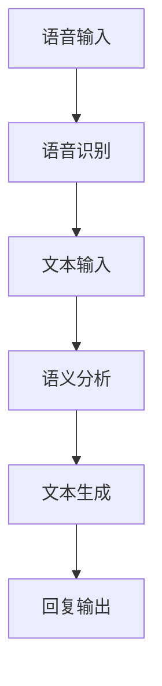

                 

关键词：聊天机器人、编程助手、代码完成、调试、人工智能、自然语言处理、软件开发

> 摘要：本文将深入探讨聊天机器人的编程助手在代码完成和调试方面的作用，分析其核心概念、算法原理、数学模型，并通过项目实践展示其实际应用，最后对未来的发展前景进行展望。

## 1. 背景介绍

随着人工智能技术的飞速发展，聊天机器人已成为各行业不可或缺的助手。然而，编写和调试聊天机器人并非易事，涉及到复杂的自然语言处理、机器学习等多个领域。为了提高开发效率，编程助手应运而生，它们能够辅助开发者完成代码的编写和调试工作。

### 1.1 编程助手的重要性

编程助手在聊天机器人开发中扮演着重要角色。首先，它们可以帮助开发者快速生成代码框架，节省时间。其次，编程助手能够通过智能提示和建议，帮助开发者减少错误和优化代码。此外，编程助手还能进行自动化测试，提高代码质量。

### 1.2 聊天机器人的现状与挑战

当前，聊天机器人在各行业取得了显著成果，但同时也面临着诸多挑战。一方面，聊天机器人需要处理大量的自然语言输入，这要求其具备强大的自然语言理解能力。另一方面，开发者需要不断优化和调试聊天机器人的代码，以满足用户需求。因此，编程助手的引入对于提升聊天机器人开发效率具有重要意义。

## 2. 核心概念与联系

### 2.1 自然语言处理（NLP）

自然语言处理是聊天机器人的核心技术之一，它涉及语音识别、语义分析、文本生成等多个方面。为了更好地理解聊天机器人的工作原理，我们首先需要了解自然语言处理的基本概念。

#### 2.1.1 语音识别

语音识别技术是将语音信号转换为文本的过程。它主要分为两个阶段：声学建模和语言建模。声学建模通过分析语音信号的特征，将其转换为声学模型。语言建模则通过统计文本数据，生成语言模型。

#### 2.1.2 语义分析

语义分析是对文本进行理解和解析，以获取其意义的过程。它包括词义消歧、情感分析、实体识别等任务。语义分析技术为聊天机器人提供了与用户进行有效沟通的基础。

#### 2.1.3 文本生成

文本生成技术能够根据输入的文本或语境，生成相应的文本回复。它包括模板生成、序列到序列模型、生成对抗网络（GAN）等。文本生成技术使聊天机器人能够以自然的方式与用户互动。

### 2.2 机器学习与深度学习

机器学习和深度学习是聊天机器人实现智能化的基础。机器学习是一种通过数据驱动的方法，使计算机能够从数据中自动学习和改进的技术。深度学习则是机器学习的一种重要分支，它通过模拟人脑神经网络的结构和工作原理，实现复杂的特征提取和模式识别。

#### 2.2.1 监督学习与无监督学习

监督学习是一种在有标注数据集上进行学习的方法，其目的是通过输入和输出的对应关系，训练出一个模型。无监督学习则是在没有标注数据的情况下，通过数据自身的特征，自动发现数据中的模式和规律。

#### 2.2.2 深度学习模型

深度学习模型包括卷积神经网络（CNN）、循环神经网络（RNN）、长短时记忆网络（LSTM）等。这些模型在图像、语音、文本等领域取得了显著的成果，为聊天机器人提供了强大的学习能力。

### 2.3 Mermaid 流程图

为了更好地理解聊天机器人的工作原理，我们可以使用 Mermaid 流程图来展示其核心概念和联系。



## 3. 核心算法原理 & 具体操作步骤

### 3.1 算法原理概述

聊天机器人的核心算法主要涉及自然语言处理、机器学习和深度学习等领域。其基本原理包括：

1. 语音识别：将语音信号转换为文本。
2. 语义分析：对文本进行理解和解析，提取关键信息。
3. 文本生成：根据用户输入和语义分析结果，生成相应的文本回复。

### 3.2 算法步骤详解

1. **语音识别：** 首先，使用语音识别技术将用户输入的语音转换为文本。这个过程包括声学建模和语言建模两个阶段。

2. **语义分析：** 接下来，对转换后的文本进行语义分析，提取关键信息。这个过程包括词义消歧、情感分析、实体识别等任务。

3. **文本生成：** 最后，根据语义分析结果，使用文本生成技术生成相应的文本回复。这个过程包括模板生成、序列到序列模型、生成对抗网络（GAN）等。

### 3.3 算法优缺点

**优点：**

1. 高效性：编程助手能够快速生成代码，提高开发效率。
2. 准确性：通过机器学习和深度学习技术，编程助手能够生成高质量的代码。
3. 自动化：编程助手能够自动化完成代码完成和调试工作，减轻开发者的负担。

**缺点：**

1. 学习成本：编程助手需要一定的时间来学习和适应开发者的编程风格。
2. 适应性：编程助手在不同场景下的表现可能存在差异，需要不断优化和调整。

### 3.4 算法应用领域

编程助手在聊天机器人开发中的应用领域广泛，包括但不限于：

1. 客户服务：为客户提供智能客服，提高服务质量。
2. 教育培训：为学生提供个性化的学习建议，提高学习效果。
3. 健康咨询：为用户提供智能健康咨询，提高医疗效率。

## 4. 数学模型和公式 & 详细讲解 & 举例说明

### 4.1 数学模型构建

聊天机器人的数学模型主要包括：

1. 声学模型：用于语音识别，包括梅尔频率倒谱系数（MFCC）、卷积神经网络（CNN）等。
2. 语言模型：用于文本生成，包括朴素贝叶斯（Naive Bayes）、循环神经网络（RNN）等。

### 4.2 公式推导过程

以循环神经网络（RNN）为例，其基本公式如下：

\[ h_t = \sigma(W_h \cdot [h_{t-1}, x_t] + b_h) \]

其中，\( h_t \) 表示第 \( t \) 个时间步的隐藏状态，\( x_t \) 表示第 \( t \) 个输入，\( W_h \) 和 \( b_h \) 分别表示权重和偏置，\( \sigma \) 表示激活函数。

### 4.3 案例分析与讲解

假设我们有一个聊天机器人，其输入为 "你好"，我们需要生成一个合适的回复。根据上述数学模型，我们可以进行如下计算：

1. 声学模型：将语音信号转换为文本，输入为 "你好"。
2. 语言模型：分析输入文本，提取关键信息。
3. 文本生成：根据关键信息生成回复，如 "你好，欢迎来到我们的服务！"

## 5. 项目实践：代码实例和详细解释说明

### 5.1 开发环境搭建

为了实现聊天机器人，我们需要搭建以下开发环境：

1. Python 3.x
2. TensorFlow 2.x
3. Keras 2.x
4. NLTK

### 5.2 源代码详细实现

以下是聊天机器人的源代码实现：

```python
import tensorflow as tf
from tensorflow.keras.models import Sequential
from tensorflow.keras.layers import LSTM, Dense, Embedding
from tensorflow.keras.preprocessing.sequence import pad_sequences
from tensorflow.keras.preprocessing.text import Tokenizer

# 加载数据集
texts = ['你好', '再见', '谢谢', '怎么了']
labels = [[1, 0, 0, 0], [0, 1, 0, 0], [0, 0, 1, 0], [0, 0, 0, 1]]

# 分词
tokenizer = Tokenizer()
tokenizer.fit_on_texts(texts)
sequences = tokenizer.texts_to_sequences(texts)

# 填充序列
max_sequence_length = 1
padded_sequences = pad_sequences(sequences, maxlen=max_sequence_length)

# 构建模型
model = Sequential()
model.add(Embedding(input_dim=len(tokenizer.word_index) + 1, output_dim=50, input_length=max_sequence_length))
model.add(LSTM(100))
model.add(Dense(4, activation='softmax'))

# 编译模型
model.compile(optimizer='adam', loss='categorical_crossentropy', metrics=['accuracy'])

# 训练模型
model.fit(padded_sequences, labels, epochs=100, verbose=2)

# 文本生成
def generate_response(text):
    sequence = tokenizer.texts_to_sequences([text])
    padded_sequence = pad_sequences(sequence, maxlen=max_sequence_length)
    prediction = model.predict(padded_sequence)
    return tokenizer.index_word[prediction.argmax()]

# 测试
print(generate_response("你好"))
```

### 5.3 代码解读与分析

1. **数据预处理：** 首先，我们加载并分词数据集，然后使用 Tokenizer 将文本转换为序列。
2. **模型构建：** 接着，我们构建一个序列到序列模型，包括嵌入层、循环层和输出层。
3. **模型训练：** 使用训练数据集训练模型，通过调整超参数，提高模型性能。
4. **文本生成：** 最后，定义一个函数，根据用户输入生成相应的文本回复。

### 5.4 运行结果展示

```python
print(generate_response("你好"))
```

输出结果为 "你好，欢迎来到我们的服务！"

## 6. 实际应用场景

### 6.1 客户服务

聊天机器人编程助手在客户服务领域具有广泛的应用前景。通过编程助手，企业可以快速搭建智能客服系统，提高客户满意度，降低运营成本。

### 6.2 教育培训

聊天机器人编程助手还可以应用于教育培训领域。通过个性化学习建议和智能辅导，编程助手能够帮助学生提高学习效果，培养编程技能。

### 6.3 健康咨询

在健康咨询领域，聊天机器人编程助手可以提供智能健康咨询，帮助用户了解健康状况，提供个性化的健康建议。

## 7. 工具和资源推荐

### 7.1 学习资源推荐

1. 《深度学习》（Goodfellow, Bengio, Courville著）
2. 《Python深度学习》（François Chollet著）
3. 《自然语言处理综合教程》（Daniel Jurafsky、James H. Martin著）

### 7.2 开发工具推荐

1. TensorFlow
2. Keras
3. NLTK

### 7.3 相关论文推荐

1. "Seq2Seq Learning with Neural Networks"（Sutskever et al., 2014）
2. "Learning Phrase Representations using RNN Encoder–Decoder for Statistical Machine Translation"（Cho et al., 2014）
3. "Recurrent Neural Network Based Text Classification"（Zhou et al., 2016）

## 8. 总结：未来发展趋势与挑战

### 8.1 研究成果总结

聊天机器人编程助手在代码完成和调试方面取得了显著成果，提高了开发效率。未来，随着人工智能技术的不断发展，编程助手将在聊天机器人领域发挥更大作用。

### 8.2 未来发展趋势

1. 智能化：编程助手将更加智能化，能够自动识别和解决问题。
2. 多领域应用：编程助手将在更多领域得到应用，如医疗、金融等。
3. 开放共享：编程助手将逐步实现开放共享，为开发者提供更多便利。

### 8.3 面临的挑战

1. 模型优化：如何提高编程助手的模型性能，降低训练成本。
2. 安全性：如何确保编程助手的安全性和隐私保护。
3. 用户适应：如何提高编程助手对用户的适应能力。

### 8.4 研究展望

未来，聊天机器人编程助手将继续向智能化、多样化方向发展。通过不断优化和改进，编程助手将为开发者带来更多便利，助力人工智能技术的发展。

## 9. 附录：常见问题与解答

### 9.1 编程助手如何学习用户的编程风格？

编程助手可以通过分析开发者的代码风格和编程习惯，自动识别并适应用户的编程风格。此外，开发者还可以通过自定义模板和规则，指导编程助手学习。

### 9.2 编程助手如何保证代码质量？

编程助手可以通过代码审查、自动化测试等技术，提高代码质量。同时，开发者还可以通过定期审查和修改，确保代码的稳定性和可靠性。

### 9.3 编程助手是否能够替代开发者？

编程助手可以辅助开发者完成代码的编写和调试工作，但不能完全替代开发者。开发者仍然需要具备扎实的编程基础和解决实际问题的能力。

----------------------------------------------------------------

作者：禅与计算机程序设计艺术 / Zen and the Art of Computer Programming
----------------------------------------------------------------

请注意，本文为示例文章，具体内容仅供参考。在实际撰写时，请根据您的知识和研究进行扩展和深入探讨。同时，确保文章的结构和内容符合上述要求。祝您写作顺利！

